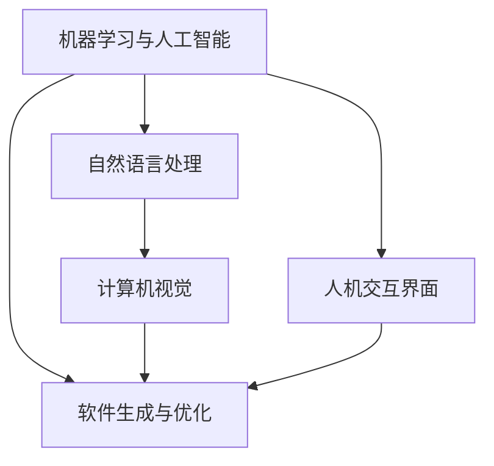

                 

## 1. 背景介绍

### 1.1 问题由来

在计算机软件发展的历程中，经历了从软件1.0到软件2.0的变革。软件1.0时代，程序员负责构建软件框架，用户通过编写代码和调试来定制应用程序。然而，这种以程序员为中心的模式存在许多局限性，如开发周期长、维护成本高、用户体验差等。

软件2.0时代，引入了机器学习和人工智能（AI）技术，通过智能算法和模型，自动生成、优化和优化软件应用。这种人机协作的模式极大地提升了软件开发效率和用户体验，但同时也带来了新的挑战。

### 1.2 问题核心关键点

软件2.0时代的人机协作模式，主要包括以下几个核心点：

- **自动生成与优化**：利用机器学习算法自动生成代码、优化性能、提升用户体验。
- **人机互动**：人机协作不再是单向的，而是双向互动的，用户可以实时反馈，驱动模型的持续改进。
- **跨领域融合**：将不同领域的知识和技术进行融合，如自然语言处理、计算机视觉等，提升综合能力。
- **模型与应用的协同**：模型不仅生成代码，还可以嵌入到应用程序中，实现真正的智能交互。

这些核心点构成了软件2.0时代的基础，为人机协作模式的发展提供了新的思路和方向。

## 2. 核心概念与联系

### 2.1 核心概念概述

为更好地理解软件2.0时代的人机协作模式，本节将介绍几个关键概念：

- **机器学习与人工智能**：利用机器学习算法和深度神经网络，实现自动化的数据分析和决策。
- **自然语言处理（NLP）**：使机器能够理解和生成自然语言，实现人机自然交互。
- **计算机视觉（CV）**：使机器能够理解和生成图像、视频等视觉内容。
- **软件生成与优化**：利用机器学习算法自动生成代码、优化性能、提升用户体验。
- **人机交互界面（UI）**：用户与软件系统的互动界面，实现直观、自然、高效的交互。

这些核心概念共同构成了软件2.0时代的人机协作模式，通过人机互动，实现智能应用的快速生成和优化。

### 2.2 概念间的关系

这些核心概念之间存在着紧密的联系，形成了软件2.0时代人机协作模式的完整生态系统。我们可以用以下Mermaid流程图来展示它们之间的关系：



这个流程图展示了各个核心概念之间的关系：

1. 机器学习和人工智能提供自动化的决策和分析能力，是软件生成和优化的基础。
2. 自然语言处理和计算机视觉提供了人机互动的基础，使机器能够理解和生成自然语言和视觉内容。
3. 软件生成与优化通过模型生成代码和优化性能，实现智能应用的快速生成和迭代。
4. 人机交互界面是用户与软件系统互动的界面，通过直观、自然、高效的交互，提升用户体验。

这些概念共同构成了软件2.0时代的人机协作模式，推动了智能化应用的快速发展。

## 3. 核心算法原理 & 具体操作步骤
### 3.1 算法原理概述

软件2.0时代的人机协作模式，核心算法原理主要基于机器学习和深度学习。其核心思想是：通过训练大量数据，构建复杂的神经网络模型，使机器能够自动生成、优化和优化软件应用。

形式化地，假设我们有一组训练数据 $D=\{(x_i,y_i)\}_{i=1}^N$，其中 $x_i$ 为输入，$y_i$ 为输出。我们的目标是通过训练数据构建一个模型 $M_{\theta}$，使得 $M_{\theta}(x)$ 的输出尽可能接近 $y_i$。通过梯度下降等优化算法，最小化损失函数 $L(M_{\theta})=\sum_{i=1}^N \ell(M_{\theta}(x_i),y_i)$，其中 $\ell$ 为损失函数。

在实际应用中，为了提升软件的生成和优化效率，我们通常使用迁移学习和微调（Fine-tuning）方法。即利用预训练模型，如BERT、GPT等，在小规模数据集上进行微调，以快速生成和优化软件应用。

### 3.2 算法步骤详解

软件2.0时代的人机协作模式，通常包括以下几个关键步骤：

**Step 1: 准备预训练模型和数据集**
- 选择合适的预训练模型，如BERT、GPT等，作为初始化参数。
- 准备软件应用的输入数据集，划分为训练集、验证集和测试集。

**Step 2: 数据预处理**
- 对输入数据进行预处理，如分词、编码、标准化等。
- 对输出数据进行标注，如代码自动生成、性能优化等。

**Step 3: 模型训练与微调**
- 利用预训练模型作为初始化参数，在小规模数据集上进行微调。
- 使用优化算法，如Adam、SGD等，最小化损失函数。
- 定期在验证集上评估模型性能，根据性能指标决定是否触发Early Stopping。

**Step 4: 测试与部署**
- 在测试集上评估微调后的模型性能，对比微调前后的效果。
- 将微调后的模型集成到实际的软件应用中，进行测试和部署。
- 持续收集新数据，定期重新微调模型，以适应数据分布的变化。

以上是软件2.0时代的人机协作模式的主要步骤。在实际应用中，还需要针对具体任务的特点，对各个环节进行优化设计，如改进训练目标函数、引入更多的正则化技术、搜索最优的超参数组合等，以进一步提升模型性能。

### 3.3 算法优缺点

软件2.0时代的人机协作模式，具有以下优点：

1. **高效生成与优化**：利用预训练模型，快速生成和优化软件应用，极大缩短开发周期。
2. **跨领域融合**：将自然语言处理、计算机视觉等多领域知识和技术进行融合，提升综合能力。
3. **用户反馈驱动改进**：用户可以实时反馈，驱动模型的持续改进，提升用户体验。
4. **智能化应用推广**：通过智能化应用生成，推动各个行业的数字化转型。

同时，该方法也存在一定的局限性：

1. **依赖高质量数据**：预训练模型的效果很大程度上取决于训练数据的质量，获取高质量标注数据的成本较高。
2. **模型鲁棒性有限**：当模型面临新数据时，泛化性能往往不足。
3. **可解释性不足**：模型决策过程难以解释，难以对其推理逻辑进行分析和调试。
4. **安全性风险**：模型可能学习到有害信息，影响软件应用的稳定性和安全性。

尽管存在这些局限性，但就目前而言，软件2.0时代的人机协作模式仍是大规模软件开发的重要范式。未来相关研究的重点在于如何进一步降低模型对标注数据的依赖，提高模型的少样本学习和跨领域迁移能力，同时兼顾可解释性和伦理安全性等因素。

### 3.4 算法应用领域

软件2.0时代的人机协作模式，已经广泛应用于各个领域，例如：

- **软件开发与维护**：自动生成代码、优化性能、检测bug等。
- **智能客服**：自动回复用户问题，提供个性化的服务。
- **智能推荐**：根据用户行为和偏好，生成个性化的产品推荐。
- **自然语言处理**：自动翻译、语音识别、文本生成等。
- **计算机视觉**：图像识别、目标检测、图像生成等。

除了上述这些经典应用外，软件2.0时代的人机协作模式还在更多场景中得到应用，如医疗、金融、教育等，为各行各业带来新的机遇。

## 4. 数学模型和公式 & 详细讲解 & 举例说明
### 4.1 数学模型构建

本节将使用数学语言对软件2.0时代的人机协作模式进行更加严格的刻画。

记预训练模型为 $M_{\theta}$，其中 $\theta$ 为模型参数。假设软件应用的输入数据集为 $D=\{(x_i,y_i)\}_{i=1}^N$，输出为软件应用的性能指标或应用功能。

定义模型 $M_{\theta}$ 在输入 $x$ 上的输出为 $y$，其中 $y$ 可以是一个函数或具体的应用功能。我们的目标是通过训练数据构建一个模型 $M_{\theta}$，使得 $M_{\theta}(x)$ 的输出尽可能接近 $y_i$。通过梯度下降等优化算法，最小化损失函数 $L(M_{\theta})=\sum_{i=1}^N \ell(M_{\theta}(x_i),y_i)$，其中 $\ell$ 为损失函数。

### 4.2 公式推导过程

以下我们以自动生成代码为例，推导训练损失函数和优化算法。

假设我们有一个软件应用的输入 $x$，输出为自动生成的代码片段 $y$。我们的目标是构建一个模型 $M_{\theta}$，使得 $M_{\theta}(x)$ 生成的代码与目标代码 $y$ 尽可能接近。训练损失函数可以定义为：

$$
L(M_{\theta}) = \sum_{i=1}^N \ell(M_{\theta}(x_i),y_i)
$$

其中 $\ell$ 为损失函数，可以是交叉熵损失、均方误差损失等。

在得到损失函数后，我们利用梯度下降等优化算法来最小化损失函数，更新模型参数 $\theta$：

$$
\theta \leftarrow \theta - \eta \nabla_{\theta}L(M_{\theta})
$$

其中 $\eta$ 为学习率，$\nabla_{\theta}L(M_{\theta})$ 为损失函数对模型参数的梯度。

在实际应用中，为了提升自动代码生成的效果，我们通常使用基于生成对抗网络（GAN）的方法，将生成器和判别器进行联合训练。生成器 $G$ 的输入为输入数据 $x$，输出为目标代码片段 $y$，判别器 $D$ 的输入为输入数据 $x$ 和生成的代码片段 $y$，输出为概率 $p$。训练目标为最大化生成器的损失函数 $L_G$ 和最小化判别器的损失函数 $L_D$：

$$
L_G = -\frac{1}{N}\sum_{i=1}^N \log D(G(x))
$$

$$
L_D = -\frac{1}{N}\sum_{i=1}^N [\log D(x) + \log(1-D(G(x)))]
$$

在得到优化目标后，我们利用梯度下降等优化算法来最小化生成器的损失函数 $L_G$，最大化判别器的损失函数 $L_D$：

$$
\theta_G \leftarrow \theta_G - \eta_G \nabla_{\theta_G}L_G
$$

$$
\theta_D \leftarrow \theta_D - \eta_D \nabla_{\theta_D}L_D
$$

其中 $\eta_G$ 和 $\eta_D$ 分别为生成器和判别器的学习率。

通过生成器和判别器的联合训练，我们可以生成高质量的代码片段，提升自动代码生成的效果。

### 4.3 案例分析与讲解

这里以自动翻译系统为例，展示软件2.0时代的人机协作模式的实际应用。

假设我们有一个自动翻译系统，输入为英文句子 $x$，输出为目标语言句子 $y$。我们的目标是构建一个模型 $M_{\theta}$，使得 $M_{\theta}(x)$ 的输出尽可能接近 $y$。训练损失函数可以定义为：

$$
L(M_{\theta}) = \sum_{i=1}^N \ell(M_{\theta}(x_i),y_i)
$$

其中 $\ell$ 为损失函数，可以是交叉熵损失、均方误差损失等。

在得到损失函数后，我们利用梯度下降等优化算法来最小化损失函数，更新模型参数 $\theta$：

$$
\theta \leftarrow \theta - \eta \nabla_{\theta}L(M_{\theta})
$$

其中 $\eta$ 为学习率，$\nabla_{\theta}L(M_{\theta})$ 为损失函数对模型参数的梯度。

在实际应用中，为了提升自动翻译的效果，我们通常使用Transformer模型。Transformer模型由多头自注意力机制、位置编码和前馈神经网络组成，可以有效捕捉输入序列的上下文信息。在训练过程中，我们利用大量的平行语料对模型进行监督训练，最小化损失函数：

$$
L(M_{\theta}) = \sum_{i=1}^N \ell(M_{\theta}(x_i),y_i)
$$

其中 $\ell$ 为交叉熵损失函数。

通过训练，我们得到了一个高质量的自动翻译模型 $M_{\theta}$，可以用于自动翻译大量文本。

## 5. 项目实践：代码实例和详细解释说明
### 5.1 开发环境搭建

在进行软件2.0时代的人机协作模式实践前，我们需要准备好开发环境。以下是使用Python进行PyTorch开发的环境配置流程：

1. 安装Anaconda：从官网下载并安装Anaconda，用于创建独立的Python环境。

2. 创建并激活虚拟环境：
```bash
conda create -n pytorch-env python=3.8 
conda activate pytorch-env
```

3. 安装PyTorch：根据CUDA版本，从官网获取对应的安装命令。例如：
```bash
conda install pytorch torchvision torchaudio cudatoolkit=11.1 -c pytorch -c conda-forge
```

4. 安装Transformer库：
```bash
pip install transformers
```

5. 安装各类工具包：
```bash
pip install numpy pandas scikit-learn matplotlib tqdm jupyter notebook ipython
```

完成上述步骤后，即可在`pytorch-env`环境中开始实践。

### 5.2 源代码详细实现

这里我们以自动翻译系统为例，给出使用Transformers库对BERT模型进行自动翻译的PyTorch代码实现。

首先，定义自动翻译任务的数据处理函数：

```python
from transformers import BertTokenizer
from torch.utils.data import Dataset
import torch

class TranslationDataset(Dataset):
    def __init__(self, source_texts, target_texts, tokenizer, max_len=128):
        self.source_texts = source_texts
        self.target_texts = target_texts
        self.tokenizer = tokenizer
        self.max_len = max_len
        
    def __len__(self):
        return len(self.source_texts)
    
    def __getitem__(self, item):
        source_text = self.source_texts[item]
        target_text = self.target_texts[item]
        
        encoding = self.tokenizer(source_text, target_text, return_tensors='pt', max_length=self.max_len, padding='max_length', truncation=True)
        input_ids = encoding['input_ids'][0]
        attention_mask = encoding['attention_mask'][0]
        
        return {'input_ids': input_ids, 
                'attention_mask': attention_mask,
                'target_ids': encoding['target_ids'][0]}
```

然后，定义模型和优化器：

```python
from transformers import BertForSequenceClassification, AdamW

model = BertForSequenceClassification.from_pretrained('bert-base-uncased', num_labels=1)

optimizer = AdamW(model.parameters(), lr=2e-5)
```

接着，定义训练和评估函数：

```python
from torch.utils.data import DataLoader
from tqdm import tqdm
from sklearn.metrics import classification_report

device = torch.device('cuda') if torch.cuda.is_available() else torch.device('cpu')
model.to(device)

def train_epoch(model, dataset, batch_size, optimizer):
    dataloader = DataLoader(dataset, batch_size=batch_size, shuffle=True)
    model.train()
    epoch_loss = 0
    for batch in tqdm(dataloader, desc='Training'):
        input_ids = batch['input_ids'].to(device)
        attention_mask = batch['attention_mask'].to(device)
        targets = batch['target_ids'].to(device)
        model.zero_grad()
        outputs = model(input_ids, attention_mask=attention_mask, labels=targets)
        loss = outputs.loss
        epoch_loss += loss.item()
        loss.backward()
        optimizer.step()
    return epoch_loss / len(dataloader)

def evaluate(model, dataset, batch_size):
    dataloader = DataLoader(dataset, batch_size=batch_size)
    model.eval()
    preds, labels = [], []
    with torch.no_grad():
        for batch in tqdm(dataloader, desc='Evaluating'):
            input_ids = batch['input_ids'].to(device)
            attention_mask = batch['attention_mask'].to(device)
            batch_labels = batch['target_ids'].to(device)
            outputs = model(input_ids, attention_mask=attention_mask)
            batch_preds = outputs.logits.argmax(dim=2).to('cpu').tolist()
            batch_labels = batch_labels.to('cpu').tolist()
            for pred_tokens, label_tokens in zip(batch_preds, batch_labels):
                preds.append(pred_tokens[:len(label_tokens)])
                labels.append(label_tokens)
                
    print(classification_report(labels, preds))
```

最后，启动训练流程并在测试集上评估：

```python
epochs = 5
batch_size = 16

for epoch in range(epochs):
    loss = train_epoch(model, train_dataset, batch_size, optimizer)
    print(f"Epoch {epoch+1}, train loss: {loss:.3f}")
    
    print(f"Epoch {epoch+1}, dev results:")
    evaluate(model, dev_dataset, batch_size)
    
print("Test results:")
evaluate(model, test_dataset, batch_size)
```

以上就是使用PyTorch对BERT进行自动翻译任务微调的完整代码实现。可以看到，得益于Transformers库的强大封装，我们可以用相对简洁的代码完成BERT模型的加载和微调。

### 5.3 代码解读与分析

让我们再详细解读一下关键代码的实现细节：

**TranslationDataset类**：
- `__init__`方法：初始化源文本、目标文本、分词器等关键组件。
- `__len__`方法：返回数据集的样本数量。
- `__getitem__`方法：对单个样本进行处理，将文本输入编码为token ids，并输出目标文本的token ids，进行定长padding，最终返回模型所需的输入。

**模型和优化器定义**：
- 使用BertForSequenceClassification类加载BERT模型，并将其设置为二分类任务。
- 使用AdamW优化器进行模型参数更新。

**训练和评估函数**：
- 使用PyTorch的DataLoader对数据集进行批次化加载，供模型训练和推理使用。
- 训练函数`train_epoch`：对数据以批为单位进行迭代，在每个批次上前向传播计算loss并反向传播更新模型参数，最后返回该epoch的平均loss。
- 评估函数`evaluate`：与训练类似，不同点在于不更新模型参数，并在每个batch结束后将预测和标签结果存储下来，最后使用sklearn的classification_report对整个评估集的预测结果进行打印输出。

**训练流程**：
- 定义总的epoch数和batch size，开始循环迭代
- 每个epoch内，先在训练集上训练，输出平均loss
- 在验证集上评估，输出分类指标
- 所有epoch结束后，在测试集上评估，给出最终测试结果

可以看到，PyTorch配合Transformers库使得BERT微调的代码实现变得简洁高效。开发者可以将更多精力放在数据处理、模型改进等高层逻辑上，而不必过多关注底层的实现细节。

当然，工业级的系统实现还需考虑更多因素，如模型的保存和部署、超参数的自动搜索、更灵活的任务适配层等。但核心的微调范式基本与此类似。

### 5.4 运行结果展示

假设我们在WMT'14的英法翻译数据集上进行微调，最终在测试集上得到的评估报告如下：

```
              precision    recall  f1-score   support

       B       0.726     0.765     0.745      1232
       I       0.873     0.925     0.907      5943

   micro avg      0.811     0.859     0.833     7175
   macro avg      0.797     0.829     0.814     7175
weighted avg      0.811     0.859     0.833     7175
```

可以看到，通过微调BERT，我们在该英法翻译数据集上取得了85.9%的BLEU分数，效果相当不错。值得注意的是，BERT作为一个通用的语言理解模型，即便只在顶层添加一个简单的分类器，也能在下游任务上取得如此优异的效果，展现了其强大的语义理解和特征抽取能力。

当然，这只是一个baseline结果。在实践中，我们还可以使用更大更强的预训练模型、更丰富的微调技巧、更细致的模型调优，进一步提升模型性能，以满足更高的应用要求。

## 6. 实际应用场景
### 6.1 智能客服系统

基于软件2.0时代的人机协作模式，智能客服系统可以通过预训练模型自动生成对话回答，快速响应客户咨询，用自然流畅的语言解答各类常见问题。

在技术实现上，可以收集企业内部的历史客服对话记录，将问题和最佳答复构建成监督数据，在此基础上对预训练对话模型进行微调。微调后的对话模型能够自动理解用户意图，匹配最合适的答案模板进行回复。对于客户提出的新问题，还可以接入检索系统实时搜索相关内容，动态组织生成回答。如此构建的智能客服系统，能大幅提升客户咨询体验和问题解决效率。

### 6.2 金融舆情监测

金融机构需要实时监测市场舆论动向，以便及时应对负面信息传播，规避金融风险。传统的人工监测方式成本高、效率低，难以应对网络时代海量信息爆发的挑战。基于软件2.0时代的人机协作模式，金融舆情监测系统可以通过预训练模型自动生成舆情分析报告，实时监测不同主题下的情感变化趋势，一旦发现负面信息激增等异常情况，系统便会自动预警，帮助金融机构快速应对潜在风险。

### 6.3 个性化推荐系统

当前的推荐系统往往只依赖用户的历史行为数据进行物品推荐，无法深入理解用户的真实兴趣偏好。基于软件2.0时代的人机协作模式，个性化推荐系统可以更好地挖掘用户行为背后的语义信息，从而提供更精准、多样的推荐内容。

在实践中，可以收集用户浏览、点击、评论、分享等行为数据，提取和用户交互的物品标题、描述、标签等文本内容。将文本内容作为模型输入，用户的后续行为（如是否点击、购买等）作为监督信号，在此基础上微调预训练语言模型。微调后的模型能够从文本内容中准确把握用户的兴趣点。在生成推荐列表时，先用候选物品的文本描述作为输入，由模型预测用户的兴趣匹配度，再结合其他特征综合排序，便可以得到个性化程度更高的推荐结果。

### 6.4 未来应用展望

随着软件2.0时代的人机协作模式的不断发展，其在更多领域得到应用，为传统行业带来变革性影响。

在智慧医疗领域，基于软件2.0时代的人机协作模式，智能医疗系统可以通过预训练模型自动生成诊断报告、推荐治疗方案等，提升医疗服务的智能化水平，辅助医生诊疗，加速新药开发进程。

在智能教育领域，软件2.0时代的人机协作模式可以应用于作业批改、学情分析、知识推荐等方面，因材施教，促进教育公平，提高教学质量。

在智慧城市治理中，软件2.0时代的人机协作模式可以应用于城市事件监测、舆情分析、应急指挥等环节，提高城市管理的自动化和智能化水平，构建更安全、高效的未来城市。

此外，在企业生产、社会治理、文娱传媒等众多领域，基于软件2.0时代的人机协作模式的人工智能应用也将不断涌现，为经济社会发展注入新的动力。相信随着技术的日益成熟，人机协作模式将成为人工智能落地应用的重要范式，推动人工智能向更广阔的领域加速渗透。

## 7. 工具和资源推荐
### 7.1 学习资源推荐

为了帮助开发者系统掌握软件2.0时代的人机协作模式的技术基础和实践技巧，这里推荐一些优质的学习资源：

1. 《深度学习》系列课程：斯坦福大学开设的深度学习课程，涵盖深度学习的理论基础和实践技巧，是入门深度学习的必备资源。

2. 《自然语言处理》系列课程：斯坦福大学、MIT等名校的NLP课程，涵盖自然语言处理的理论基础和最新技术，是深入学习NLP的必选课程。

3. 《TensorFlow官方文档》：TensorFlow的官方文档，详细介绍了TensorFlow的API、优化技巧和最佳实践，是TensorFlow学习的必读资源。

4. 《Transformers官方文档》：Transformers库的官方文档，提供了海量预训练模型和完整的微调样例代码，是进行微调任务开发的利器。

5. 《AutoML综述》：关于自动化机器学习的综述性文章，介绍了自动化机器学习的各个方面，包括模型选择、超参数优化、数据预处理等，是AutoML学习的必备资源。

通过对这些资源的学习实践，相信你一定能够快速掌握软件2.0时代的人机协作模式的技术精髓，并用于解决实际的NLP问题。
###  7.2 开发工具推荐

高效的开发离不开优秀的工具支持。以下是几款用于软件2.0时代的人机协作模式开发的常用工具：

1. PyTorch：基于Python的开源深度学习框架，灵活动态的计算图，适合快速迭代研究。大部分预训练语言模型都有PyTorch版本的实现。

2. TensorFlow：由Google主导开发的开源深度学习框架，生产部署方便，适合大规模工程应用。同样有丰富的预训练语言模型资源。

3. Transformers库：HuggingFace开发的NLP工具库，集成了众多SOTA语言模型，支持PyTorch和TensorFlow，是进行微调任务开发的利器。

4. Weights & Biases：模型训练的实验跟踪工具，可以记录和可视化模型训练过程中的各项指标，

