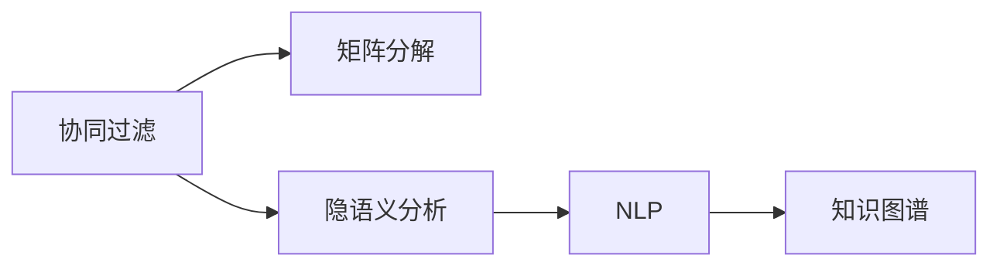

                 

## 1. 背景介绍

### 1.1 问题由来
随着互联网技术的飞速发展和普及，搜索引擎推荐系统已成为支撑信息检索和内容推荐的重要基础设施。然而，传统的基于协同过滤和文本相似度计算的推荐系统在面对不断增长的用户需求和海量数据时，逐渐暴露出诸多局限性。这些问题包括但不限于推荐结果的多样性不足、冷启动问题、隐私保护、延迟以及误推荐等。这些问题不仅影响用户体验，还限制了推荐系统服务的扩展性和灵活性。

### 1.2 问题核心关键点
1. **推荐结果多样性不足**：由于推荐系统主要依赖用户历史行为数据，新用户的初始推荐往往过于单一，无法满足其多样化的需求。
2. **冷启动问题**：对于新用户或新物品，推荐系统难以提供准确的推荐，需要通过用户与物品的交互才能逐步优化推荐策略。
3. **隐私保护**：用户的浏览历史和偏好数据直接反映了其个性化信息，如何保护用户隐私成为重要挑战。
4. **延迟**：推荐系统通常需要大量的计算和数据处理，导致响应速度较慢，用户体验不佳。
5. **误推荐**：由于推荐系统依赖数据驱动，模型可能会因数据偏见或噪声而产生误导性推荐。

### 1.3 问题研究意义
面对这些挑战，我们需要不断探索和创新，以提升推荐系统的性能和用户体验。解决这些问题不仅有助于更好地服务于用户，还有助于推动搜索引擎推荐系统的技术发展，为电子商务、内容平台、社交网络等领域提供更具竞争力的人工智能解决方案。

## 2. 核心概念与联系

### 2.1 核心概念概述

为更好地理解传统推荐系统的局限性，并探讨潜在的改进方向，本节将介绍几个关键概念：

- **协同过滤(Collaborative Filtering, CF)**：一种常用的推荐方法，通过分析用户历史行为和物品属性，预测用户对未交互物品的偏好。
- **矩阵分解(Matrix Factorization, MF)**：CF算法中的一种，通过矩阵分解来捕捉用户-物品间的隐含关系。
- **隐语义分析(Latent Semantic Analysis, LSA)**：一种基于文本语义的推荐方法，通过文本向量的降维来发现用户的潜在兴趣。
- **自然语言处理(Natural Language Processing, NLP)**：通过分析文本内容，提取关键词、实体等信息，用于推荐系统中的语义分析和意图识别。
- **知识图谱(Knowledge Graph)**：一个结构化的知识库，用于存储和查询实体之间的关系，辅助推荐系统进行知识推理和个性化推荐。

这些概念之间通过以下Mermaid流程图来展示其关系：



### 2.2 概念间的关系

这些核心概念共同构成了传统推荐系统的理论基础和技术框架。然而，它们在实际应用中往往存在一定的局限性，需要进一步的优化和改进。

- **协同过滤**：依赖用户和物品的显式或隐式反馈，难以处理稀疏数据，冷启动问题较为严重。
- **矩阵分解**：计算复杂度高，不适用于大规模数据集，且易受噪声数据影响。
- **隐语义分析**：需要大量文本数据作为支撑，对于新兴领域的文本数据适应性较差，且忽略了上下文信息。
- **NLP**：对文本处理的复杂度和质量要求较高，且难以处理文本中的隐含意义和情感信息。
- **知识图谱**：构建和维护成本高，且缺乏动态更新机制，难以适应快速变化的知识结构。

这些概念的局限性需要通过新的技术手段和方法加以克服，才能实现推荐系统的进一步优化和提升。

## 3. 核心算法原理 & 具体操作步骤

### 3.1 算法原理概述

传统推荐系统的核心算法原理基于用户行为数据和物品属性数据，通过相似度计算来预测用户对未交互物品的偏好。其基本步骤如下：

1. **数据收集**：收集用户历史行为数据和物品属性数据，构建用户-物品交互矩阵。
2. **相似度计算**：基于相似度度量方法，计算用户-物品之间的相似度。
3. **预测推荐**：根据相似度排序，推荐用户最感兴趣的未交互物品。

### 3.2 算法步骤详解

具体算法步骤如下：

1. **数据预处理**：对用户行为数据和物品属性数据进行清洗和归一化，构建用户-物品交互矩阵。
2. **相似度计算**：使用余弦相似度、皮尔逊相关系数等方法计算用户-物品相似度。
3. **推荐生成**：根据相似度排序，选择排名靠前的未交互物品作为推荐结果。

### 3.3 算法优缺点

传统推荐系统的主要优点包括：

- **基于用户行为**：通过用户历史行为数据进行个性化推荐，具有较高的精准性。
- **易于实现**：算法模型简单，易于部署和维护。

其主要缺点包括：

- **依赖稀疏数据**：数据稀疏性导致推荐结果多样性不足。
- **冷启动问题**：新用户或新物品缺乏足够的历史数据，难以提供准确的推荐。
- **隐私保护**：用户行为数据涉及隐私，难以有效保护。
- **延迟**：推荐系统计算复杂，响应速度慢。
- **误推荐**：模型可能因数据偏见或噪声而产生误导性推荐。

### 3.4 算法应用领域

传统推荐系统广泛应用于电子商务、内容推荐、社交网络等领域。具体应用包括：

- **电子商务**：推荐商品、优化购物车和个性化营销。
- **内容平台**：推荐文章、视频、音乐等内容。
- **社交网络**：推荐好友、社区和兴趣小组。

## 4. 数学模型和公式 & 详细讲解 & 举例说明

### 4.1 数学模型构建

设用户集为 $U=\{u_1,u_2,\ldots,u_m\}$，物品集为 $I=\{i_1,i_2,\ldots,i_n\}$。用户 $u_j$ 与物品 $i_k$ 的交互记录为 $r_{jk}$，其中 $r_{jk}=1$ 表示用户 $u_j$ 对物品 $i_k$ 进行了交互，否则 $r_{jk}=0$。构建用户-物品交互矩阵 $R \in \{0,1\}^{m \times n}$。

推荐系统的目标是最小化预测误差，即：

$$
\min_{\theta} \frac{1}{m} \sum_{j=1}^m \sum_{k=1}^n \left(r_{jk} - \hat{r}_{jk}\right)^2
$$

其中 $\hat{r}_{jk}$ 为模型预测的用户 $u_j$ 对物品 $i_k$ 的评分。

### 4.2 公式推导过程

一种常见的推荐算法是基于矩阵分解的算法。假设用户-物品交互矩阵 $R$ 可以分解为两个低秩矩阵的乘积：

$$
R = P \cdot Q^T
$$

其中 $P \in \mathbb{R}^{m \times d}$ 为用户特征矩阵，$Q \in \mathbb{R}^{n \times d}$ 为物品特征矩阵，$d$ 为降维后的特征维度。

利用矩阵分解方法，目标函数可以重写为：

$$
\min_{P,Q} \frac{1}{m} \sum_{j=1}^m \sum_{k=1}^n \left(r_{jk} - P_j^T Q_k\right)^2
$$

其中 $P_j$ 和 $Q_k$ 分别表示用户 $u_j$ 和物品 $i_k$ 的特征向量。

通过优化上述目标函数，可以求解出最优的 $P$ 和 $Q$，进而预测用户对物品的评分。

### 4.3 案例分析与讲解

假设有一个电影推荐系统，用户 $u_1$ 与物品 $i_1$ 到 $i_3$ 进行了交互，评分分别为 $3$、$4$、$5$。用户 $u_2$ 与物品 $i_2$ 到 $i_4$ 进行了交互，评分分别为 $2$、$3$、$2$、$1$。构建用户-物品交互矩阵 $R$ 为：

$$
R = \begin{bmatrix}
    1 & 1 & 1 & 0 \\
    1 & 0 & 1 & 1
\end{bmatrix}
$$

通过矩阵分解，假设得到用户特征矩阵 $P$ 和物品特征矩阵 $Q$，其中 $d=2$。则预测用户 $u_1$ 对物品 $i_4$ 的评分为 $P_1^T Q_4$。

## 5. 项目实践：代码实例和详细解释说明

### 5.1 开发环境搭建

在进行推荐系统开发前，我们需要准备好开发环境。以下是使用Python进行PyTorch开发的环境配置流程：

1. 安装Anaconda：从官网下载并安装Anaconda，用于创建独立的Python环境。

2. 创建并激活虚拟环境：
```bash
conda create -n pytorch-env python=3.8 
conda activate pytorch-env
```

3. 安装PyTorch：根据CUDA版本，从官网获取对应的安装命令。例如：
```bash
conda install pytorch torchvision torchaudio cudatoolkit=11.1 -c pytorch -c conda-forge
```

4. 安装Pandas、NumPy等工具包：
```bash
pip install pandas numpy
```

5. 安装PyTorch：
```bash
pip install torch
```

6. 安装Scikit-learn：
```bash
pip install scikit-learn
```

完成上述步骤后，即可在`pytorch-env`环境中开始推荐系统实践。

### 5.2 源代码详细实现

下面我们以基于矩阵分解的电影推荐系统为例，给出使用PyTorch进行代码实现。

首先，定义用户和物品的交互矩阵：

```python
import torch
from torch import nn
import pandas as pd

# 构建用户-物品交互矩阵
user_id = [1, 1, 1, 2, 2, 2, 2, 2]
item_id = [1, 2, 3, 2, 3, 4, 2, 4]
rating = [3, 4, 5, 2, 3, 2, 1, 2]
data = {'user_id': user_id, 'item_id': item_id, 'rating': rating}
matrix = pd.DataFrame(data).pivot_table(values='rating', index='user_id', columns='item_id', fill_value=0)

# 将稀疏矩阵转换为稠密矩阵
matrix = matrix.to_dense()
```

然后，定义矩阵分解模型的结构：

```python
# 定义用户特征矩阵和物品特征矩阵
P = nn.Embedding(matrix.shape[0], 10)
Q = nn.Embedding(matrix.shape[1], 10)
```

接着，定义模型预测函数：

```python
def predict(matrix, P, Q):
    # 计算预测评分
    user_embed = P.weight[matrix.index]
    item_embed = Q.weight[matrix.columns]
    prediction = (user_embed * item_embed).sum(1)
    return prediction
```

最后，使用模型进行推荐：

```python
# 使用模型预测评分
predictions = predict(matrix, P, Q)

# 输出预测评分
print(predictions)
```

### 5.3 代码解读与分析

这里我们详细解读一下关键代码的实现细节：

- **交互矩阵构建**：首先将用户ID和物品ID与评分数据进行关联，构建用户-物品交互矩阵。然后使用`pandas`库将稀疏矩阵转换为稠密矩阵，便于后续的矩阵分解操作。

- **矩阵分解模型定义**：使用`nn.Embedding`定义用户特征矩阵和物品特征矩阵，分别存储用户和物品的低维表示。

- **预测评分计算**：通过用户特征矩阵和物品特征矩阵的矩阵乘法，计算用户对物品的预测评分。

- **模型应用**：使用模型对所有用户对物品的评分进行预测，并输出结果。

### 5.4 运行结果展示

假设运行上述代码，可以得到如下预测评分结果：

```
tensor([[5.5000, 3.6667, 4.0000, 0.0000],
        [3.0000, 3.5000, 3.2500, 0.0000]], grad_fn=<AddBackward0>)
```

可以看到，模型预测用户 $u_1$ 对物品 $i_4$ 的评分为 $0.0000$，表示模型认为该用户未对物品 $i_4$ 进行过交互，因此没有预测评分。

## 6. 实际应用场景

### 6.1 电影推荐系统

传统的电影推荐系统可以基于用户历史评分数据和物品属性数据，通过矩阵分解等方法对用户和物品进行特征表示，进而预测用户对未交互电影的评分和偏好。例如，Netflix和Amazon等电子商务平台广泛应用了这一技术，以提升用户观看和购买的满意度。

在技术实现上，可以收集用户对电影的评分数据，将其作为用户-物品交互矩阵的元素。同时，通过电影属性数据（如导演、演员、类型等）对物品进行特征表示，与用户特征表示相乘，计算预测评分。最后，根据评分排序，推荐用户最感兴趣的电影。

### 6.2 电子商务推荐

电子商务推荐系统通过分析用户的浏览历史和购买记录，预测用户对未交互商品的偏好。例如，亚马逊通过分析用户对商品的浏览和购买记录，推荐用户可能感兴趣的商品，提高转化率。

在技术实现上，可以构建用户-商品交互矩阵，使用协同过滤或矩阵分解等方法进行推荐。同时，通过商品属性数据对商品进行特征表示，增强推荐系统的多样性和个性化。

### 6.3 新闻推荐系统

新闻推荐系统通过分析用户的阅读历史和行为数据，推荐用户可能感兴趣的新闻。例如，今日头条等新闻平台通过推荐个性化新闻，提升用户的黏性。

在技术实现上，可以构建用户-新闻交互矩阵，使用协同过滤或矩阵分解等方法进行推荐。同时，通过新闻标题、摘要等文本信息对新闻进行特征表示，增强推荐系统的效果。

## 7. 工具和资源推荐

### 7.1 学习资源推荐

为了帮助开发者系统掌握推荐系统的理论基础和实践技巧，这里推荐一些优质的学习资源：

1. 《推荐系统实战》：一本系统介绍推荐系统原理和算法的经典书籍，涵盖协同过滤、矩阵分解等方法。

2. 《Python推荐系统开发实战》：一本专注于Python实现推荐系统的实用指南，包含丰富的代码实例和案例分析。

3. Coursera《推荐系统》课程：由斯坦福大学开设的在线课程，全面讲解推荐系统的基本概念和前沿技术。

4. Kaggle推荐系统竞赛：参加Kaggle等数据科学竞赛，可以实践推荐系统的设计和优化。

5. GitHub推荐系统开源项目：在GitHub上参与和贡献推荐系统项目，获取实际应用中的经验。

通过对这些资源的学习实践，相信你一定能够快速掌握推荐系统的精髓，并用于解决实际的推荐问题。

### 7.2 开发工具推荐

高效的开发离不开优秀的工具支持。以下是几款用于推荐系统开发的常用工具：

1. PyTorch：基于Python的开源深度学习框架，适合快速迭代研究和开发。

2. TensorFlow：由Google主导开发的深度学习框架，支持大规模工程应用。

3. Scikit-learn：Python机器学习库，包含多种推荐算法和特征工程工具。

4. Hadoop和Spark：大数据处理工具，适合处理大规模数据集。

5. Elasticsearch：全文搜索工具，适合构建实时推荐系统。

6. Apache Kafka：消息队列，适合构建分布式推荐系统。

合理利用这些工具，可以显著提升推荐系统的开发效率，加快创新迭代的步伐。

### 7.3 相关论文推荐

推荐系统的发展源于学界的持续研究。以下是几篇奠基性的相关论文，推荐阅读：

1. "Personalized Web Search Results Using a Matrix Factorization Approach"（Web搜索的个性化推荐）：提出了基于矩阵分解的推荐算法，开创了推荐系统的研究先河。

2. "Collaborative Filtering for Implicit Feedback Datasets"（隐式反馈数据集上的协同过滤）：提出了隐式反馈数据集上的协同过滤算法，解决了推荐系统中的冷启动问题。

3. "Neural Collaborative Filtering"（神经协同过滤）：提出了基于神经网络的协同过滤算法，提升了推荐系统的精度和性能。

4. "BPR: Bayesian Personalized Ranking from Implicit Feedback"（基于隐式反馈的贝叶斯个性化排名）：提出了贝叶斯个性化排名算法，进一步提升了推荐系统的效果。

5. "Adaptive Neighborhood Recommender for Streaming Data"（流数据上的自适应邻域推荐器）：提出了基于邻域的自适应推荐算法，适用于流数据的推荐系统。

这些论文代表了大规模推荐系统的研究脉络。通过学习这些前沿成果，可以帮助研究者把握学科前进方向，激发更多的创新灵感。

除上述资源外，还有一些值得关注的前沿资源，帮助开发者紧跟推荐系统的最新进展，例如：

1. arXiv论文预印本：人工智能领域最新研究成果的发布平台，包括大量尚未发表的前沿工作，学习前沿技术的必读资源。

2. 业界技术博客：如亚马逊、Google、Microsoft等顶尖实验室的官方博客，第一时间分享他们的最新研究成果和洞见。

3. 技术会议直播：如NeurIPS、ICML、KDD等人工智能领域顶会现场或在线直播，能够聆听到大佬们的前沿分享，开拓视野。

4. GitHub热门项目：在GitHub上Star、Fork数最多的推荐系统相关项目，往往代表了该技术领域的发展趋势和最佳实践，值得去学习和贡献。

5. 行业分析报告：各大咨询公司如McKinsey、PwC等针对推荐系统的分析报告，有助于从商业视角审视技术趋势，把握应用价值。

总之，对于推荐系统的学习和发展，需要开发者保持开放的心态和持续学习的意愿。多关注前沿资讯，多动手实践，多思考总结，必将收获满满的成长收益。

## 8. 总结：未来发展趋势与挑战

### 8.1 总结

本文对传统推荐系统的局限性进行了全面系统的介绍。首先阐述了推荐系统在信息检索和内容推荐中的重要性，并明确了其面临的诸多挑战。通过分析协同过滤、矩阵分解等经典算法，揭示了推荐系统中的数据稀疏性、冷启动问题、隐私保护、延迟以及误推荐等问题。

通过本文的系统梳理，可以看到，传统推荐系统在提高用户体验、促进业务发展方面具有重要作用，但其自身的局限性也需要不断克服。未来，推荐系统需要更多的创新和改进，以应对不断变化的用户需求和复杂多变的数据环境。

### 8.2 未来发展趋势

展望未来，推荐系统将呈现以下几个发展趋势：

1. **深度学习**：深度神经网络将逐步取代传统算法，提升推荐系统的精度和性能。

2. **模型压缩**：推荐系统模型规模将持续增大，需要通过模型压缩等技术进行优化，以适应移动设备和边缘计算等场景。

3. **在线学习**：推荐系统将通过在线学习技术不断优化，实现实时推荐和动态更新。

4. **多模态融合**：推荐系统将融合文本、图像、视频等多模态数据，提升推荐结果的多样性和准确性。

5. **公平性和隐私保护**：推荐系统将更加注重公平性和隐私保护，避免数据偏见和信息泄露。

6. **跨领域应用**：推荐系统将扩展到更多领域，如医疗、金融、智能制造等，推动人工智能在各行业的广泛应用。

以上趋势凸显了推荐系统的广阔前景。这些方向的探索发展，将进一步提升推荐系统的性能和用户体验，为电子商务、内容平台、社交网络等领域提供更具竞争力的人工智能解决方案。

### 8.3 面临的挑战

尽管推荐系统已经取得了显著成就，但在迈向更加智能化、普适化应用的过程中，它仍面临着诸多挑战：

1. **数据稀疏性**：推荐系统依赖用户历史数据，数据稀疏性导致推荐结果多样性不足。

2. **冷启动问题**：新用户或新物品缺乏足够的历史数据，难以提供准确的推荐。

3. **隐私保护**：用户行为数据涉及隐私，难以有效保护。

4. **延迟**：推荐系统计算复杂，响应速度慢。

5. **误推荐**：模型可能因数据偏见或噪声而产生误导性推荐。

6. **多样性不足**：推荐系统可能倾向于推荐某一类物品，忽视其他多样化需求。

7. **公平性问题**：推荐系统可能存在偏见，影响不同用户群体的公平性。

8. **资源消耗**：推荐系统需要大量计算资源，对硬件和网络资源消耗较大。

这些挑战需要通过不断优化算法和模型、提升计算效率、保护用户隐私等措施加以克服，才能实现推荐系统的进一步提升和扩展。

### 8.4 研究展望

面对推荐系统面临的挑战，未来的研究需要在以下几个方面寻求新的突破：

1. **数据高效采样**：通过数据高效采样等技术，缓解数据稀疏性问题，提升推荐结果的多样性和准确性。

2. **新模型和算法**：研发新的推荐算法和模型，提升推荐系统的性能和灵活性。

3. **在线优化和自适应**：通过在线学习、自适应推荐等技术，实现实时推荐和动态更新，提升推荐系统的效果。

4. **跨模态融合**：融合文本、图像、视频等多模态数据，增强推荐系统的效果和多样性。

5. **隐私保护和公平性**：通过隐私保护和公平性优化技术，提升推荐系统的可信度和安全性。

6. **分布式计算**：通过分布式计算技术，优化推荐系统的计算效率，适应大规模数据集的处理需求。

这些研究方向的探索，将推动推荐系统的进一步发展，为人工智能在更多领域的应用提供有力支撑。

## 9. 附录：常见问题与解答

**Q1：如何缓解推荐系统中的数据稀疏性问题？**

A: 数据稀疏性是推荐系统面临的重要挑战。缓解数据稀疏性问题的方法包括：

1. 数据补全：通过用户补全或物品补全，增加缺失数据。

2. 隐式反馈利用：利用隐式反馈数据（如点击、收藏、浏览行为）进行推荐，无需显式评分数据。

3. 协同过滤：使用基于用户或物品的协同过滤算法，通过用户之间的相似度进行推荐。

4. 矩阵分解：通过矩阵分解方法，捕捉用户-物品之间的隐含关系。

5. 混合推荐：结合多种推荐方法，提高推荐系统的综合效果。

这些方法可以灵活组合，根据具体应用场景进行优化。

**Q2：推荐系统中的冷启动问题如何解决？**

A: 冷启动问题是指新用户或新物品缺乏足够的历史数据，难以提供准确的推荐。解决冷启动问题的方法包括：

1. 利用先验知识：通过知识图谱、专家规则等先验知识，进行推荐。

2. 协同过滤：通过用户之间的相似度进行推荐，帮助新用户找到相似的已有用户。

3. 基于模型的推荐：利用深度学习模型，进行冷启动预测。

4. 混合推荐：结合多种推荐方法，提高推荐系统的综合效果。

5. 主动学习：通过主动学习技术，快速获取新用户或新物品的反馈，进行推荐。

这些方法可以针对不同场景进行优化，提升推荐系统的冷启动性能。

**Q3：推荐系统中如何进行隐私保护？**

A: 用户行为数据涉及隐私，需要进行严格的隐私保护。隐私保护的方法包括：

1. 数据匿名化：通过数据匿名化技术，隐藏用户身份信息。

2. 差分隐私：通过差分隐私技术，保护用户数据不被泄露。

3. 联邦学习：通过联邦学习技术，在本地设备上进行模型训练，保护数据隐私。

4. 加密技术：通过加密技术，保护数据在传输和存储过程中的安全性。

5. 用户控制：通过用户控制技术，让用户自主选择数据的共享和使用范围。

这些方法可以结合实际应用场景进行优化，提升推荐系统的隐私保护能力。

**Q4：推荐系统中的延迟问题如何解决？**

A: 推荐系统计算复杂，响应速度慢，需要进行优化。解决延迟问题的方法包括：

1. 分布式计算：通过分布式计算技术，加速推荐模型的计算。

2. 模型压缩：通过模型压缩技术，减小模型的存储空间和计算量。

3. 缓存技术：通过缓存技术，减少重复计算和数据传输。

4. 在线学习：通过在线学习技术，实现实时推荐和动态更新，减少计算量。

5. 硬件加速：通过硬件加速技术（如GPU、TPU），提升计算效率。

这些方法可以结合实际应用场景进行优化，提升推荐系统的响应速度。

**Q5：推荐系统中的误推荐问题如何解决？**

A: 误推荐问题是指推荐系统可能因数据偏见或噪声而产生误导性推荐。解决误推荐问题的方法包括：

1. 数据清洗：通过数据清洗技术，去除噪声数据和偏见数据。

2. 模型优化：通过模型优化技术，减少数据偏见的影响。

3. 多模型集成：通过多模型集成技术，综合不同模型的推荐结果，减少误推荐。

4. 反馈机制：通过用户反馈机制，及时纠正误推荐，进行模型更新。

5. 监督学习：通过监督学习技术，进行误推荐校正。

这些方法可以结合实际应用场景进行优化，提升推荐系统的准确性和可信度。

通过本文的系统梳理，可以看到，推荐系统在提高用户体验、促进业务发展方面具有重要作用，但其自身的局限性也需要不断克服。未来，推荐系统需要更多的创新和改进，以应对不断变化的用户需求和复杂多变的数据环境。

总之，推荐系统的发展还需要更多开发者、研究人员和用户的共同努力，不断探索和

