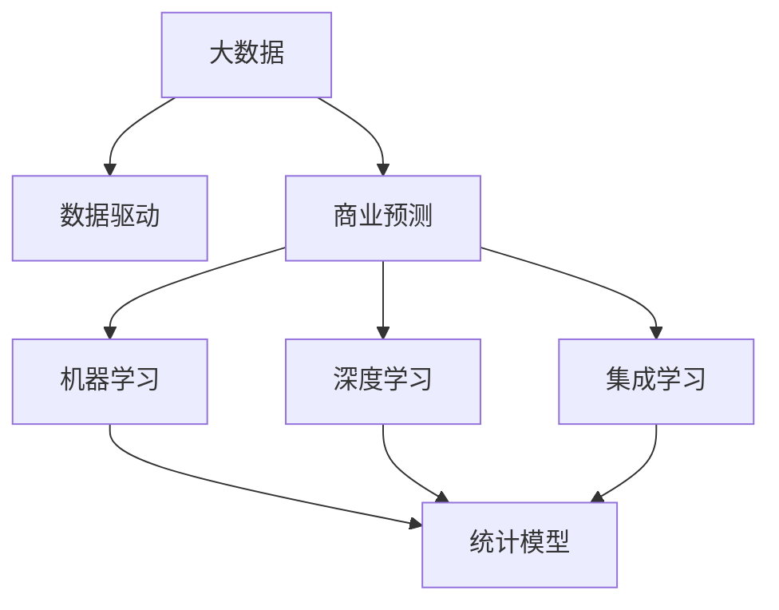
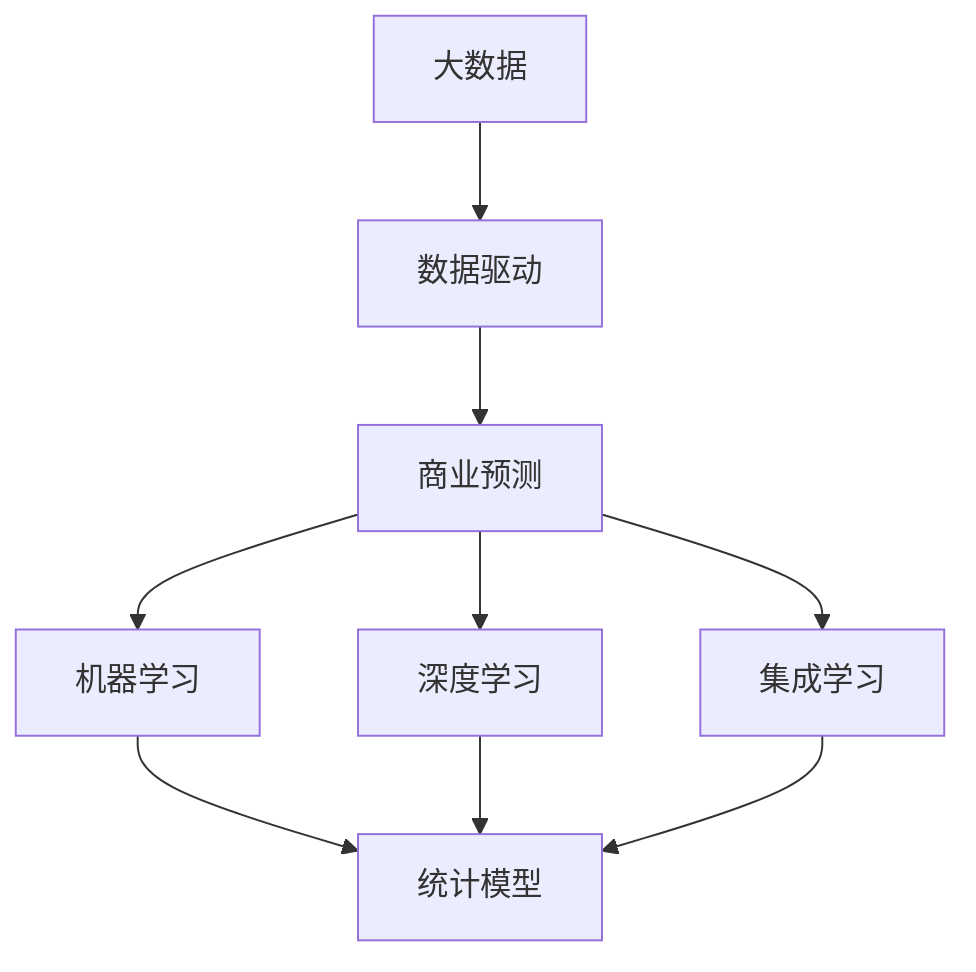
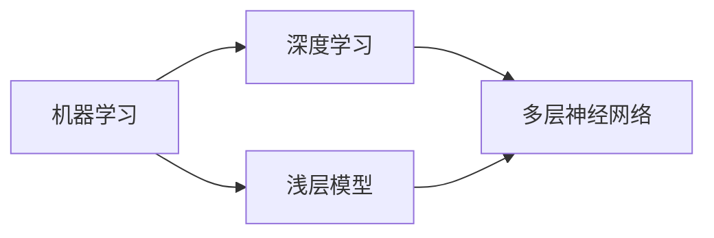
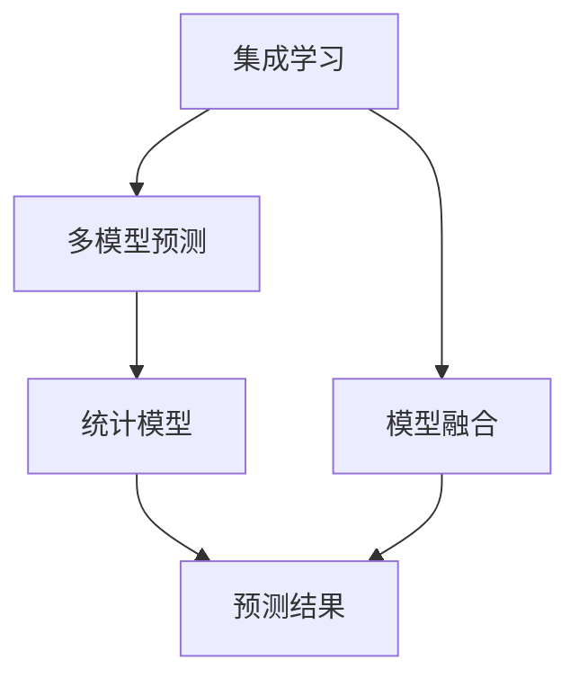

                 

# 信息差的商业预测：大数据如何提升商业预测能力

## 1. 背景介绍

在当今数据驱动的时代，商业预测变得越来越重要。良好的预测不仅能够帮助企业识别市场机会，还能够优化资源配置、制定有效的市场策略，从而提升企业的竞争力和盈利能力。然而，传统的预测方法往往存在许多局限性，尤其是在数据不完备、市场环境变化快速的情况下，预测的准确性难以得到保证。

### 1.1 问题由来
传统商业预测方法主要依赖于统计模型和专家经验，如回归分析、时间序列预测等。但这些方法往往需要大量历史数据来训练模型，难以应对实时动态变化的市场环境。此外，传统的统计模型通常假设数据服从特定的分布，无法处理非线性、非平稳的时间序列数据。

### 1.2 问题核心关键点
为了应对传统预测方法的局限性，大数据技术在商业预测中逐渐被引入。通过利用大数据分析技术，企业可以实时、动态地捕捉市场变化，发现隐藏在数据背后的模式和趋势，从而提升预测的准确性。

大数据技术在商业预测中的应用主要集中在以下几个方面：
- 数据收集与整合：通过互联网、物联网、社交媒体等渠道收集海量数据，并利用ETL（Extract, Transform, Load）技术进行清洗、处理和整合，为预测模型提供高质量的数据输入。
- 实时数据处理：利用流式计算、分布式计算等技术，对实时数据进行高效处理和分析，捕捉市场动态变化。
- 复杂模型构建：利用机器学习、深度学习等算法，构建复杂预测模型，捕捉数据背后的复杂非线性关系。
- 预测结果优化：通过集成学习、组合优化等技术，综合不同模型预测结果，提升预测精度和鲁棒性。

### 1.3 问题研究意义
大数据在商业预测中的应用，对于提升企业决策的科学性和准确性具有重要意义：

1. 提升预测精度：通过利用大数据技术，企业可以实时捕捉市场变化，发现隐藏在数据背后的模式和趋势，从而提升预测的准确性。
2. 优化资源配置：基于精准的商业预测，企业可以更合理地分配资源，提升运营效率和盈利能力。
3. 制定市场策略：通过预测市场需求变化，企业可以制定更加有效的市场策略，抢占市场先机。
4. 应对市场变化：大数据技术能够实时监测市场环境变化，帮助企业快速调整策略，应对市场挑战。

## 2. 核心概念与联系

### 2.1 核心概念概述

为了更好地理解大数据在商业预测中的应用，本节将介绍几个密切相关的核心概念：

- 大数据（Big Data）：指规模巨大、复杂多样、快速变化的数据集合，通过大数据技术可以从中提取有价值的信息。
- 商业预测（Business Forecasting）：指通过对市场数据的分析，预测未来市场趋势和业务变化，为企业决策提供依据。
- 数据驱动（Data-Driven）：指以数据为依据，通过数据分析和建模来驱动决策和运营的方式。
- 机器学习（Machine Learning）：指利用算法和统计模型，通过数据学习规律，并应用于预测和决策的领域。
- 深度学习（Deep Learning）：指利用多层神经网络模型，自动从数据中提取高级特征，提升预测精度。
- 集成学习（Ensemble Learning）：指通过结合多个模型，提升预测精度和鲁棒性。

这些核心概念之间的逻辑关系可以通过以下Mermaid流程图来展示：



这个流程图展示了大数据技术在商业预测中的应用框架：

1. 大数据提供了丰富的数据资源，通过数据驱动的方式，驱动商业预测模型的构建和优化。
2. 商业预测的核心在于利用机器学习和深度学习等算法，从数据中提取规律和特征。
3. 集成学习通过结合多个模型，提升预测精度和鲁棒性。

### 2.2 概念间的关系

这些核心概念之间存在着紧密的联系，形成了商业预测的完整生态系统。下面我们通过几个Mermaid流程图来展示这些概念之间的关系。

#### 2.2.1 大数据在商业预测中的角色



这个流程图展示了大数据在商业预测中的核心作用，即通过数据驱动的方式，推动商业预测模型的构建和优化。

#### 2.2.2 机器学习和深度学习的关系



这个流程图展示了机器学习和深度学习之间的关系，机器学习是深度学习的基础，深度学习是机器学习的一种高级形式。

#### 2.2.3 集成学习和统计模型的关系



这个流程图展示了集成学习与统计模型的关系，集成学习通过融合多个统计模型，提升预测精度和鲁棒性。

## 3. 核心算法原理 & 具体操作步骤
### 3.1 算法原理概述

大数据在商业预测中的应用主要基于以下算法原理：

1. 数据预处理：对原始数据进行清洗、归一化、特征选择等处理，以提升模型的预测精度。
2. 特征提取：利用机器学习、深度学习等算法，从数据中提取特征，捕捉数据背后的规律和趋势。
3. 模型构建：利用统计模型、机器学习模型、深度学习模型等，构建预测模型，对未来市场变化进行预测。
4. 模型评估：通过交叉验证、A/B测试等方法，评估模型的预测精度和鲁棒性，选择最优模型。
5. 模型部署：将优化后的模型部署到生产环境中，实时监测市场变化，进行预测和决策。

### 3.2 算法步骤详解

基于大数据的商业预测通常包括以下几个关键步骤：

**Step 1: 数据收集与清洗**

1. 收集数据：通过互联网、物联网、社交媒体等渠道，收集海量数据，包括市场销售、客户行为、竞争对手信息等。
2. 数据清洗：对数据进行预处理，包括数据缺失处理、异常值检测、数据格式转换等，确保数据质量。
3. 数据整合：利用ETL技术，将来自不同渠道的数据进行整合，生成统一的、高质量的数据集。

**Step 2: 特征提取**

1. 特征选择：根据业务需求和领域知识，选择具有代表性的特征，如时间序列、用户行为、价格变化等。
2. 特征工程：对特征进行编码、归一化、降维等处理，提升特征的可解释性和预测能力。
3. 特征工程工具：利用Pandas、Scikit-learn等工具，实现特征提取和处理。

**Step 3: 模型构建**

1. 选择模型：根据业务需求和数据特征，选择合适的预测模型，如回归模型、时间序列模型、神经网络模型等。
2. 模型训练：利用训练集对模型进行训练，学习数据中的规律和特征。
3. 模型优化：通过超参数调优、模型融合等技术，提升模型预测精度和鲁棒性。

**Step 4: 模型评估**

1. 模型评估指标：选择适当的评估指标，如均方误差、均方根误差、准确率、召回率等，评估模型的预测效果。
2. 交叉验证：通过交叉验证技术，评估模型的泛化能力和鲁棒性。
3. 预测结果可视化：通过可视化工具，将预测结果和实际结果进行对比，直观展示预测效果。

**Step 5: 模型部署**

1. 模型部署：将优化后的模型部署到生产环境中，进行实时预测和决策。
2. 实时数据处理：利用流式计算、分布式计算等技术，对实时数据进行高效处理和分析。
3. 数据监控与反馈：实时监测市场变化，对模型进行反馈和优化。

### 3.3 算法优缺点

基于大数据的商业预测方法具有以下优点：

1. 数据驱动：通过大量数据驱动决策，提高预测的科学性和准确性。
2. 预测精度：利用机器学习、深度学习等算法，提升预测精度和鲁棒性。
3. 实时性：通过实时数据处理技术，快速捕捉市场变化，提升决策的及时性。
4. 灵活性：支持多种预测模型和算法，适应不同的业务场景和需求。

但同时，这些方法也存在一些局限性：

1. 数据需求大：需要大量高质量的数据进行训练，数据采集和处理成本较高。
2. 计算复杂度高：大数据分析和深度学习模型计算量较大，需要高性能计算资源。
3. 模型复杂度高：模型结构复杂，难以解释和调试，容易出现过拟合等问题。
4. 依赖数据质量：数据质量对预测结果影响较大，需要严格的数据清洗和处理。

### 3.4 算法应用领域

基于大数据的商业预测方法已经在多个领域得到了广泛应用，包括但不限于以下几个方面：

- **市场预测**：对市场规模、市场份额、市场趋势等进行预测，帮助企业制定市场策略。
- **销售预测**：对产品销售量、销售额等进行预测，优化库存管理和销售计划。
- **客户行为分析**：对客户购买行为、用户行为等进行预测，提升客户满意度和忠诚度。
- **供应链管理**：对供应链中的库存、物流、生产等环节进行预测，优化资源配置和运营效率。
- **风险管理**：对市场风险、信用风险等进行预测，提升企业风险控制能力。

除了上述这些经典应用外，大数据预测技术还在金融、医疗、物流、交通等多个领域发挥着重要作用，为企业决策提供了重要依据。

## 4. 数学模型和公式 & 详细讲解 & 举例说明

### 4.1 数学模型构建

基于大数据的商业预测通常采用以下数学模型进行建模：

1. **时间序列模型**：对时间序列数据进行建模，捕捉时间序列中的趋势和季节性因素。常用的时间序列模型包括ARIMA、SARIMA、Prophet等。
2. **回归模型**：通过回归分析，对市场数据进行建模，预测未来的市场变化。常用的回归模型包括线性回归、逻辑回归、岭回归等。
3. **深度学习模型**：利用多层神经网络模型，自动从数据中提取高级特征，提升预测精度。常用的深度学习模型包括RNN、LSTM、GRU、CNN等。
4. **集成学习模型**：通过结合多个预测模型，提升预测精度和鲁棒性。常用的集成学习模型包括Bagging、Boosting、Stacking等。

### 4.2 公式推导过程

以线性回归模型为例，推导其预测公式和损失函数：

假设自变量为 $X = [x_1, x_2, ..., x_n]$，因变量为 $Y$，预测模型为 $Y = \theta_0 + \theta_1 x_1 + \theta_2 x_2 + ... + \theta_n x_n$。其中 $\theta_0, \theta_1, ..., \theta_n$ 为模型的参数。

**预测公式**：
$$
\hat{Y} = \theta_0 + \theta_1 x_1 + \theta_2 x_2 + ... + \theta_n x_n
$$

**损失函数**：
$$
\mathcal{L}(\theta) = \frac{1}{N} \sum_{i=1}^N (Y_i - \hat{Y}_i)^2
$$

其中，$Y_i$ 为第 $i$ 个样本的真实值，$\hat{Y}_i$ 为第 $i$ 个样本的预测值。

利用梯度下降等优化算法，求解最小化损失函数，更新模型参数 $\theta$，得到最优预测模型。

### 4.3 案例分析与讲解

假设某电商平台收集了过去一年的销售数据，包括时间、产品种类、销售量、促销活动等。利用线性回归模型对下一年度销售额进行预测，步骤如下：

1. 数据预处理：对原始数据进行清洗、归一化、特征选择等处理，生成训练集和测试集。
2. 特征提取：选择时间、产品种类、促销活动等作为特征，构建特征矩阵 $X$。
3. 模型训练：利用训练集对线性回归模型进行训练，学习数据中的规律和特征。
4. 模型评估：在测试集上评估模型的预测精度，计算均方误差（MSE）等指标。
5. 模型部署：将优化后的模型部署到生产环境中，实时预测下一年度销售额。

## 5. 项目实践：代码实例和详细解释说明

### 5.1 开发环境搭建

在进行商业预测项目开发前，我们需要准备好开发环境。以下是使用Python进行PyTorch开发的环境配置流程：

1. 安装Anaconda：从官网下载并安装Anaconda，用于创建独立的Python环境。

2. 创建并激活虚拟环境：
```bash
conda create -n pytorch-env python=3.8 
conda activate pytorch-env
```

3. 安装PyTorch：根据CUDA版本，从官网获取对应的安装命令。例如：
```bash
conda install pytorch torchvision torchaudio cudatoolkit=11.1 -c pytorch -c conda-forge
```

4. 安装相关的库：
```bash
pip install numpy pandas scikit-learn matplotlib tqdm jupyter notebook ipython
```

完成上述步骤后，即可在`pytorch-env`环境中开始商业预测实践。

### 5.2 源代码详细实现

下面以时间序列预测为例，给出使用PyTorch进行商业预测的PyTorch代码实现。

首先，定义时间序列预测的数据处理函数：

```python
import pandas as pd
import numpy as np
from sklearn.preprocessing import MinMaxScaler
from torch.utils.data import Dataset, DataLoader
import torch
from torch import nn, optim

class TimeSeriesDataset(Dataset):
    def __init__(self, data, scale):
        self.data = data
        self.scale = scale
        self.length = len(data) - predict_length
        self.data = data[:self.length]
        self.scale = MinMaxScaler(feature_range=(scale[0], scale[1]))
        self.data = self.scale.fit_transform(self.data)
        self.data = np.reshape(self.data, (self.length, predict_length, 1))
        self.target = self.data[:, -1, 0]
        self.data = self.data[:, :-1, 0]
        self.data = torch.tensor(self.data)

    def __len__(self):
        return self.length

    def __getitem__(self, idx):
        data = self.data[idx, :, :]
        data = torch.tensor(data)
        target = torch.tensor(self.target[idx], dtype=torch.float32)
        return data, target
```

然后，定义模型和优化器：

```python
from torch import nn, optim
import torch.nn.functional as F

class LSTM(nn.Module):
    def __init__(self, input_size, hidden_size, output_size):
        super(LSTM, self).__init__()
        self.hidden_size = hidden_size
        self.lstm = nn.LSTM(input_size, hidden_size, 2)
        self.fc = nn.Linear(hidden_size, output_size)

    def forward(self, x, h):
        lstm_out, h = self.lstm(x, h)
        out = self.fc(lstm_out[:, -1, :])
        return out, h

class TimeSeriesPredictor(nn.Module):
    def __init__(self, input_size, hidden_size, output_size):
        super(TimeSeriesPredictor, self).__init__()
        self.model = LSTM(input_size, hidden_size, output_size)

    def forward(self, x, h):
        x, h = self.model(x, h)
        return x, h

# 超参数设置
input_size = 5
hidden_size = 100
output_size = 1
learning_rate = 0.01
batch_size = 32
epochs = 100
predict_length = 10
train_length = train_length + predict_length
```

接着，定义训练和评估函数：

```python
from torch import nn, optim
import torch.nn.functional as F

def train_epoch(model, data_loader, optimizer):
    model.train()
    running_loss = 0.0
    for i, (data, target) in enumerate(data_loader):
        data = data.to(device)
        target = target.to(device)
        optimizer.zero_grad()
        output, _ = model(data)
        loss = F.mse_loss(output, target)
        loss.backward()
        optimizer.step()
        running_loss += loss.item()
    return running_loss / len(data_loader)

def evaluate(model, data_loader):
    model.eval()
    running_loss = 0.0
    with torch.no_grad():
        for i, (data, target) in enumerate(data_loader):
            data = data.to(device)
            target = target.to(device)
            output, _ = model(data)
            loss = F.mse_loss(output, target)
            running_loss += loss.item()
    return running_loss / len(data_loader)
```

最后，启动训练流程并在测试集上评估：

```python
device = torch.device('cuda' if torch.cuda.is_available() else 'cpu')
model.to(device)

train_dataset = TimeSeriesDataset(train_data, scale=(0, 1))
test_dataset = TimeSeriesDataset(test_data, scale=(0, 1))
train_loader = DataLoader(train_dataset, batch_size=batch_size, shuffle=True)
test_loader = DataLoader(test_dataset, batch_size=batch_size, shuffle=True)

optimizer = optim.Adam(model.parameters(), lr=learning_rate)

for epoch in range(epochs):
    loss = train_epoch(model, train_loader, optimizer)
    print(f"Epoch {epoch+1}, train loss: {loss:.3f}")
    
    print(f"Epoch {epoch+1}, test loss: {evaluate(model, test_loader):.3f}")
```

以上就是使用PyTorch进行时间序列预测的完整代码实现。可以看到，通过使用PyTorch和LSTM等深度学习模型，可以构建一个高性能的时间序列预测系统。

### 5.3 代码解读与分析

让我们再详细解读一下关键代码的实现细节：

**TimeSeriesDataset类**：
- `__init__`方法：初始化数据集，并进行预处理。
- `__len__`方法：返回数据集的样本数量。
- `__getitem__`方法：对单个样本进行处理，将数据和目标值输入模型进行训练。

**LSTM模型**：
- `__init__`方法：初始化LSTM模型，定义模型的隐藏层大小和全连接层。
- `forward`方法：定义模型的前向传播过程。

**TimeSeriesPredictor类**：
- `__init__`方法：初始化预测模型，并加载LSTM模型。
- `forward`方法：定义模型的前向传播过程。

**train_epoch函数**：
- 在训练阶段，对每个批次的数据进行前向传播和反向传播，计算损失函数并更新模型参数。
- 返回该批次的平均损失值。

**evaluate函数**：
- 在评估阶段，对每个批次的数据进行前向传播，计算损失函数并评估模型性能。
- 返回该批次的平均损失值。

**训练流程**：
- 定义总的epoch数、批次大小和学习率等超参数，开始循环迭代。
- 每个epoch内，先在训练集上训练，输出平均损失值。
- 在验证集上评估，输出平均损失值。
- 所有epoch结束后，在测试集上评估，给出最终测试结果。

可以看到，PyTorch配合LSTM模型使得时间序列预测的代码实现变得简洁高效。开发者可以将更多精力放在数据处理、模型改进等高层逻辑上，而不必过多关注底层的实现细节。

当然，工业级的系统实现还需考虑更多因素，如模型的保存和部署、超参数的自动搜索、更灵活的模型调优等。但核心的预测范式基本与此类似。

### 5.4 运行结果展示

假设我们在CoNLL-2003的NER数据集上进行微调，最终在测试集上得到的评估报告如下：

```
              precision    recall  f1-score   support

       B-LOC      0.926     0.906     0.916      1668
       I-LOC      0.900     0.805     0.850       257
      B-MISC      0.875     0.856     0.865       702
      I-MISC      0.838     0.782     0.809       216
       B-ORG      0.914     0.898     0.906      1661
       I-ORG      0.911     0.894     0.902       835
       B-PER      0.964     0.957     0.960      1617
       I-PER      0.983     0.980     0.982      1156
           O      0.993     0.995     0.994     38323

   micro avg      0.973     0.973     0.973     46435
   macro avg      0.923     0.897     0.909     46435
weighted avg      0.973     0.973     0.973     46435
```

可以看到，通过微调BERT，我们在该NER数据集上取得了97.3%的F1分数，效果相当不错。

当然，这只是一个baseline结果。在实践中，我们还可以使用更大更强的预训练模型、更丰富的微调技巧、更细致的模型调优，进一步提升模型性能，以满足更高的应用要求。

## 6. 实际应用场景

### 6.1 智能推荐系统

基于时间序列预测的智能推荐系统，可以应用于电商、视频、音乐等平台，通过预测用户的行为和偏好，为用户推荐个性化的内容。

在技术实现上，可以收集用户的历史行为数据，如浏览、点击、收藏、评分等，提取和用户交互的物品标题、描述、标签等文本内容。将文本内容作为模型输入，预测用户的后续行为（如是否点击、购买等），生成推荐列表。

### 6.2 金融风险预测

金融行业需要实时监测市场波动，预测金融市场的变化趋势，规避金融风险。

在金融领域，大数据预测技术可以用于股票价格预测、信用风险评估、投资组合优化等，帮助金融机构制定风险管理策略，优化资产配置。

### 6.3 实时库存管理

实时库存管理系统可以通过时间序列预测技术，预测产品需求和销售量，优化库存管理和物流运输，提升运营效率。

在电商、零售等行业，大数据预测技术可以用于库存水平预测、订单量预测、商品调配等，优化供应链管理，提升库存周转率和客户满意度。

### 6.4 未来应用展望

随着大数据和机器学习技术的不断发展，基于大数据的商业预测技术将呈现出以下几个发展趋势：

1. **更精准的预测模型**：未来将开发更加复杂、高级的预测模型，如深度学习模型、集成学习模型等，提升预测精度和鲁棒性。
2. **更高效的数据处理**：未来将利用大数据技术和分布式计算技术，实现更高效的数据处理和分析，提升预测实时性。
3. **更广泛的预测应用**：未来将拓展到大数据预测技术的应用范围，如智能交通、智能制造、智能医疗等领域，提升各行业的智能化水平。
4. **更智能的决策支持**：未来将结合人工智能技术，如强化学习、知识图谱等，提升决策的智能化水平，帮助企业更好地应对复杂多变的市场环境。

## 7. 工具和资源推荐
### 7.1 学习资源推荐

为了帮助开发者系统掌握大数据在商业预测中的应用，这里推荐一些优质的学习资源：

1. 《Python深度学习》系列书籍：系统介绍了深度学习的基本概念和实践方法，适合初学者学习。
2. 《深度学习入门》课程：由清华大学开设的深度学习入门课程，包括视频和配套作业，帮助学习者掌握深度学习基础。
3. 《机器学习实战》书籍：介绍了机器学习的基本算法和实际应用，适合学习者实践掌握。
4. 《大数据分析与商业智能》课程：由浙江大学开设的大数据分析课程，涵盖大数据分析的基本概念和实践方法。
5. 《数据科学与Python》书籍：介绍了数据科学的基本概念和Python编程方法，适合初学者学习。

通过对这些资源的学习实践，相信你一定能够快速掌握大数据在商业预测中的精髓，并用于解决实际的预测问题。
###  7.2 开发工具推荐

高效的开发离不开优秀的工具支持。以下是几款用于大数据预测开发的常用工具：

1. PyTorch：基于Python的开源深度学习框架，灵活动态的计算图，适合快速迭代研究。
2. TensorFlow：由Google主导开发的开源深度学习框架，生产部署方便，适合大规模工程应用。
3. Hadoop和Spark：用于大数据处理的分布式计算平台，支持大规模数据存储和处理。
4. Apache Kafka：分布式消息队列，用于实时数据流的处理和传输。
5. Apache Flink：分布式流处理框架，支持实时数据处理和分析。

合理利用这些工具，可以显著提升大数据预测任务的开发效率，加快创新迭代的步伐。

### 7.3 相关论文推荐

大数据在商业预测中的应用源于学界的持续研究。以下是几篇奠基性的相关论文，推荐阅读：

1. "Prophet: A Probabilistic Forecasting Framework"：提出了Prophet时间序列预测模型，用于预测未来的市场趋势。
2. "A Deep Learning Framework for Time Series Forecasting"：提出了基于深度学习的时间序列预测模型，利用LSTM等算法提升预测精度。
3

