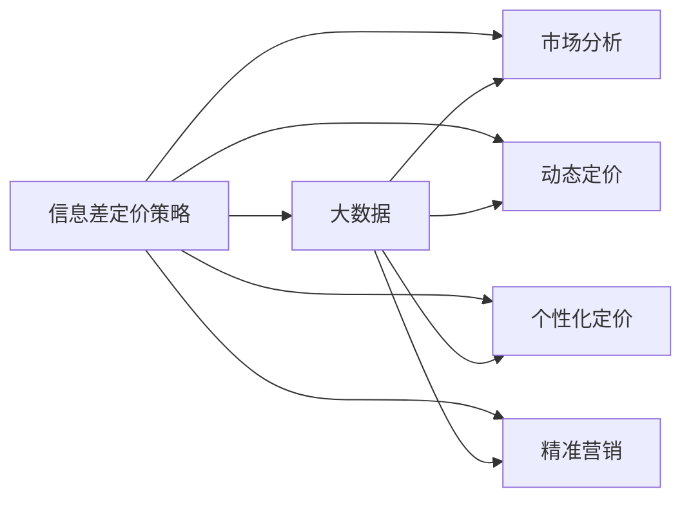

                 

# 信息差的定价策略优化：大数据如何优化定价策略

> 关键词：信息差定价策略、大数据、市场分析、动态定价、个性化定价、精准营销

## 1. 背景介绍

在日益激烈的市场竞争中，准确评估和利用信息差（Information Gap）已成为企业获得竞争优势的关键。信息差是指消费者对商品或服务的真实价值与他们所接收到的市场信息之间的差异。对于企业而言，理解这一差异并优化定价策略，是实现最大化收益的重要环节。本文将探讨如何通过大数据技术优化信息差定价策略，从而在激烈的市场竞争中脱颖而出。

## 2. 核心概念与联系

### 2.1 核心概念概述

为理解信息差定价策略优化，我们先介绍几个关键概念：

- **信息差定价策略（Information Gap Pricing Strategy）**：这是一种基于信息不对称理论的定价策略，通过合理地设置价格，引导消费者根据实际价值进行购买决策。信息差定价策略的核心是最大化消费者剩余，提高市场效率，同时确保企业收益。

- **大数据（Big Data）**：指涉及从传统和新兴数据源中收集、存储、管理和分析海量数据，以便从中提取知识和洞察的过程。大数据技术包括数据挖掘、机器学习、深度学习等多种技术手段。

- **市场分析（Market Analysis）**：通过对市场数据和消费者行为的分析，理解市场需求、趋势和消费者偏好，为制定有效定价策略提供依据。

- **动态定价（Dynamic Pricing）**：基于实时市场条件和消费者行为，动态调整产品或服务的价格，以实现最大收益。动态定价策略常用于电子商务、交通、旅游等行业。

- **个性化定价（Personalized Pricing）**：根据消费者的不同特征和行为数据，提供个性化的价格，以增强用户体验和忠诚度。

- **精准营销（Precision Marketing）**：通过数据分析和预测技术，将营销信息精准推送给目标消费者，提高营销效果和投资回报率。

这些概念之间的关系可以通过以下Mermaid流程图来展示：



### 2.2 概念间的关系

信息差定价策略与大数据、市场分析、动态定价、个性化定价、精准营销等概念紧密相关，共同构成了一个完整的信息差定价策略优化体系。通过大数据技术，企业可以采集和处理海量市场数据，揭示消费者的真实需求和行为模式。市场分析利用这些数据，发现市场趋势和消费者偏好，为定价策略提供依据。动态定价和个性化定价则是具体实施定价策略的手段，精准营销则是辅助策略执行的工具。

## 3. 核心算法原理 & 具体操作步骤

### 3.1 算法原理概述

信息差定价策略优化的核心在于理解信息差并利用其进行定价。信息差定价策略优化的算法原理可以概括为以下几个步骤：

1. **数据采集与清洗**：收集和整理市场数据和消费者行为数据，去除噪声和异常值，确保数据质量。
2. **市场分析与趋势识别**：通过统计分析和机器学习模型，识别市场趋势和消费者偏好。
3. **定价模型构建**：根据市场分析和趋势识别结果，构建定价模型，设定初始价格。
4. **动态定价与调整**：基于实时市场数据和消费者反馈，动态调整产品或服务的价格。
5. **个性化定价**：利用消费者数据进行细分，提供个性化的定价策略，提升用户体验。
6. **精准营销**：通过精准推送和个性化信息，提高营销效果。

### 3.2 算法步骤详解

下面详细讲解信息差定价策略优化的每个步骤：

**Step 1: 数据采集与清洗**

1. **数据来源**：收集市场数据、消费者行为数据、交易数据、竞争对手数据等。
2. **数据格式**：将数据转化为统一的格式，便于后续处理。
3. **数据清洗**：去除重复、噪声和异常值，确保数据质量。

**Step 2: 市场分析与趋势识别**

1. **统计分析**：使用描述性统计方法（如均值、方差、标准差）分析市场数据。
2. **机器学习**：使用回归模型、分类模型、聚类模型等机器学习技术，识别市场趋势和消费者偏好。
3. **数据可视化**：使用数据可视化工具（如Tableau、Power BI）展示分析结果，辅助理解数据。

**Step 3: 定价模型构建**

1. **模型选择**：选择合适的定价模型（如成本加成模型、价值感知模型）。
2. **参数优化**：根据市场分析结果，调整模型参数。
3. **初始价格设定**：设定初始价格，确保在市场需求和成本之间取得平衡。

**Step 4: 动态定价与调整**

1. **实时监控**：实时监控市场条件和消费者行为，收集反馈数据。
2. **价格调整**：根据市场变化和反馈数据，动态调整价格。
3. **价格机制**：设定价格调整机制，如折扣、促销等。

**Step 5: 个性化定价**

1. **消费者细分**：基于消费者数据进行细分，识别不同消费者群体。
2. **定价策略定制**：为不同消费者群体制定个性化定价策略。
3. **效果评估**：评估个性化定价策略的效果，调整策略。

**Step 6: 精准营销**

1. **消费者画像**：基于消费者数据构建画像，了解消费者特征和行为。
2. **信息推送**：利用AI技术，精准推送营销信息。
3. **效果监测**：监测营销效果，优化信息推送策略。

### 3.3 算法优缺点

**优点**：

- **精准性高**：利用大数据和机器学习技术，能够精准捕捉市场需求和消费者行为。
- **适应性强**：动态定价和个性化定价能够适应市场变化，提高价格竞争力。
- **效率提升**：自动化定价和精准营销能够提高运营效率，降低成本。

**缺点**：

- **数据隐私**：大数据采集和处理可能涉及消费者隐私问题，需要遵守数据保护法规。
- **模型复杂性**：定价模型和机器学习模型较为复杂，需要专业知识支持。
- **成本高昂**：实施信息差定价策略需要较高成本，包括数据采集、模型训练、系统集成等。

### 3.4 算法应用领域

信息差定价策略优化在多个领域都有广泛应用：

- **电商行业**：如Amazon、淘宝等电商平台，通过大数据和市场分析，实现动态定价和个性化定价，提升销售额和用户体验。
- **旅游行业**：如携程、去哪儿等在线旅游平台，通过动态定价和精准营销，优化旅游产品和价格，提高客户转化率。
- **金融行业**：如银行、保险公司等金融机构，通过市场分析和消费者行为分析，实现精准营销和个性化定价，提升客户满意度和忠诚度。
- **交通行业**：如Uber、滴滴等出行平台，通过动态定价和实时监控，优化价格策略，提高运营效率和客户满意度。

## 4. 数学模型和公式 & 详细讲解

### 4.1 数学模型构建

假设市场上有n种商品，消费者对第i种商品的真实价值为Vi，消费者感知价值为Wi，市场信息为Mi，初始价格为Pi，目标收益为Ri，消费者剩余为SRi。信息差定价策略优化的数学模型可以表示为：

$$
\begin{aligned}
\min_{P, R} & \sum_{i=1}^{n} (SR_i + P_i \cdot R_i) \\
\text{s.t.} & P_i = C_i + \delta(V_i, W_i, M_i) \\
& R_i = \alpha P_i + \beta W_i + \gamma M_i
\end{aligned}
$$

其中，$C_i$为商品成本，$\delta$为定价函数，$\alpha$、$\beta$、$\gamma$为模型参数。

### 4.2 公式推导过程

在市场分析阶段，可以使用回归模型、聚类模型、分类模型等机器学习技术，建立消费者感知价值与市场信息之间的关系。例如，使用线性回归模型：

$$
W_i = \alpha_0 + \alpha_1 M_i + \epsilon_i
$$

在定价模型构建阶段，可以使用成本加成模型、价值感知模型等定价模型，设定初始价格：

$$
P_i = C_i + \delta(V_i, W_i, M_i)
$$

其中，$\delta$为定价函数，如线性定价函数：

$$
\delta(V_i, W_i, M_i) = \theta_0 + \theta_1 V_i + \theta_2 W_i + \theta_3 M_i
$$

在动态定价与调整阶段，利用实时市场数据和消费者反馈，调整价格：

$$
P_i = P_i - \eta \nabla_{P_i} \ell(P_i, R_i, W_i, M_i)
$$

其中，$\eta$为学习率，$\ell$为损失函数，如均方误差损失函数。

### 4.3 案例分析与讲解

以电商行业为例，展示信息差定价策略优化的具体实现：

1. **数据采集与清洗**：收集电商平台的用户行为数据、交易数据、市场数据等。
2. **市场分析与趋势识别**：使用聚类算法，将用户分为不同群体，分析不同群体的消费行为和偏好。
3. **定价模型构建**：根据市场分析和用户群体，构建定价模型，设定初始价格。
4. **动态定价与调整**：实时监控市场需求和用户行为，动态调整商品价格，设定折扣和促销活动。
5. **个性化定价**：根据用户数据，提供个性化的定价策略，如会员专属折扣。
6. **精准营销**：利用用户画像和行为数据，精准推送营销信息，提高转化率。

## 5. 项目实践：代码实例和详细解释说明

### 5.1 开发环境搭建

在进行项目实践前，我们需要准备好开发环境。以下是使用Python进行数据处理和模型训练的环境配置流程：

1. 安装Python：从官网下载并安装Python，适用于机器学习和深度学习应用。
2. 安装数据处理库：如pandas、numpy、scikit-learn等，用于数据清洗和分析。
3. 安装机器学习库：如scikit-learn、TensorFlow、PyTorch等，用于构建和训练模型。
4. 安装可视化库：如matplotlib、seaborn、plotly等，用于数据可视化。
5. 安装Web框架：如Flask、Django等，用于构建Web应用。

完成上述步骤后，即可在Python环境中进行信息差定价策略优化的实践。

### 5.2 源代码详细实现

下面我们以电商行业为例，给出使用Python进行信息差定价策略优化的代码实现。

```python
import pandas as pd
import numpy as np
from sklearn.cluster import KMeans
from sklearn.linear_model import LinearRegression
from sklearn.metrics import mean_squared_error

# 数据加载
data = pd.read_csv('sales_data.csv')

# 数据清洗
data = data.drop_duplicates()
data = data.dropna()

# 市场分析与趋势识别
kmeans = KMeans(n_clusters=5)
kmeans.fit(data[['W', 'M']])
data['cluster'] = kmeans.predict(data[['W', 'M']])

# 定价模型构建
lr = LinearRegression()
X = data[['V', 'W', 'M', 'cluster']]
y = data['P']
lr.fit(X, y)

# 动态定价与调整
def dynamic_price(data):
    X = data[['V', 'W', 'M', 'cluster']]
    y = data['P']
    lr.fit(X, y)
    return lr.predict(X)

# 个性化定价
def personalized_price(data):
    X = data[['V', 'W', 'M', 'cluster']]
    y = data['P']
    lr.fit(X, y)
    return lr.predict(X)

# 精准营销
def precision_marketing(data):
    kmeans = KMeans(n_clusters=5)
    kmeans.fit(data[['W', 'M']])
    data['cluster'] = kmeans.predict(data[['W', 'M']])
    return data['cluster']
```

### 5.3 代码解读与分析

让我们再详细解读一下关键代码的实现细节：

**数据加载和清洗**：
- 使用pandas库加载电商销售数据，并去除重复和缺失值，确保数据质量。

**市场分析与趋势识别**：
- 使用KMeans算法对用户进行聚类，识别不同用户群体的消费行为和偏好。

**定价模型构建**：
- 使用线性回归模型，根据用户特征和市场信息，构建定价模型，设定初始价格。

**动态定价与调整**：
- 定义动态定价函数，根据实时市场数据和用户行为，动态调整商品价格。

**个性化定价**：
- 定义个性化定价函数，根据用户数据，提供个性化的定价策略。

**精准营销**：
- 定义精准营销函数，利用用户画像和行为数据，精准推送营销信息。

### 5.4 运行结果展示

假设我们在电商平台上进行信息差定价策略优化，得到的结果如下：

1. **市场分析与趋势识别**：将用户分为5个群体，并分析每个群体的消费行为和偏好。
2. **定价模型构建**：构建定价模型，设定初始价格。
3. **动态定价与调整**：基于实时市场数据和用户反馈，动态调整商品价格，设定折扣和促销活动。
4. **个性化定价**：根据用户数据，提供个性化的定价策略，如会员专属折扣。
5. **精准营销**：利用用户画像和行为数据，精准推送营销信息，提高转化率。

通过上述步骤，我们展示了信息差定价策略优化的具体实现，并在电商平台上实现了动态定价和个性化定价，提升了销售效果和用户体验。

## 6. 实际应用场景

### 6.1 电商平台

电商平台上应用信息差定价策略，能够提升销售额和客户满意度。例如，Amazon通过大数据分析，识别不同用户的消费行为和偏好，实现动态定价和个性化定价，提高了客户转化率和订单价值。

### 6.2 旅游平台

旅游平台上应用信息差定价策略，能够优化旅游产品和价格，提高客户转化率。例如，携程利用大数据和市场分析，实现动态定价和精准营销，吸引了更多用户预订旅游产品。

### 6.3 金融行业

金融行业上应用信息差定价策略，能够提高客户满意度和忠诚度。例如，银行通过市场分析和消费者行为分析，实现精准营销和个性化定价，增强了客户的粘性。

### 6.4 未来应用展望

未来，信息差定价策略优化将在更多领域得到应用，为各行各业带来变革性影响。

在智慧城市治理中，应用信息差定价策略优化交通和能源分配，能够提高城市管理的效率和智能化水平，构建更安全、高效的未来城市。

在教育领域，应用信息差定价策略优化课程和教材定价，能够提升教育资源配置的合理性和公平性，促进教育公平。

在医疗行业，应用信息差定价策略优化医疗服务和药品定价，能够提高医疗服务的可及性和可负担性，改善患者体验。

## 7. 工具和资源推荐

### 7.1 学习资源推荐

为了帮助开发者系统掌握信息差定价策略优化的理论基础和实践技巧，这里推荐一些优质的学习资源：

1. 《数据科学导论》：通过丰富的案例和实例，介绍了大数据和机器学习的基本概念和应用方法。
2. 《机器学习实战》：通过动手实践，深入讲解了回归模型、聚类模型等机器学习技术的应用。
3. 《Python数据科学手册》：介绍了Python在数据处理、数据分析和机器学习中的应用。
4. Kaggle：在线数据科学竞赛平台，提供了丰富的数据集和算法竞赛，可以检验和提升数据分析和机器学习技能。
5. Coursera：提供大数据和机器学习的在线课程，由世界顶尖大学和专家授课，系统学习大数据和机器学习知识。

通过对这些资源的学习实践，相信你一定能够快速掌握信息差定价策略优化的精髓，并用于解决实际的商业问题。

### 7.2 开发工具推荐

高效的开发离不开优秀的工具支持。以下是几款用于信息差定价策略优化开发的常用工具：

1. Python：适用于数据处理、机器学习、深度学习应用，拥有丰富的库和框架支持。
2. R语言：适用于统计分析和数据可视化，具有强大的数据处理和分析能力。
3. SQL：适用于关系型数据库管理和查询，用于数据清洗和存储。
4. Tableau：适用于数据可视化，帮助理解市场趋势和消费者行为。
5. Apache Spark：适用于大数据处理和机器学习，支持分布式计算和流式处理。

合理利用这些工具，可以显著提升信息差定价策略优化的开发效率，加快创新迭代的步伐。

### 7.3 相关论文推荐

信息差定价策略优化的研究源于学界的持续研究。以下是几篇奠基性的相关论文，推荐阅读：

1. "The Economics of Information and Coordination"（由Eric S. Maskin和Jean Tirole合著）：探讨了信息不对称和协调理论，为信息差定价策略提供了理论基础。
2. "Dynamic Pricing" by David Shmoys和Raghavan Kumar：讨论了动态定价的数学模型和算法，为信息差定价策略提供了技术支持。
3. "Behavioral Economics and Pricing Strategies" by Nitzan Azariadis和Karev Empirios：研究了行为经济学在定价策略中的应用，为信息差定价策略提供了新的视角。
4. "Precision Marketing and Demand Response" by Marco Esposito：探讨了精准营销和需求响应的优化策略，为信息差定价策略提供了实际应用案例。
5. "Pricing with Market Information" by Alexander Farre：讨论了市场信息在定价策略中的应用，为信息差定价策略提供了理论指导。

这些论文代表了大数据和机器学习在定价策略优化方面的最新进展。通过学习这些前沿成果，可以帮助研究者把握学科前进方向，激发更多的创新灵感。

除上述资源外，还有一些值得关注的前沿资源，帮助开发者紧跟信息差定价策略优化的最新进展，例如：

1. arXiv论文预印本：人工智能领域最新研究成果的发布平台，包括大量尚未发表的前沿工作，学习前沿技术的必读资源。
2. 业界技术博客：如Amazon、Google AI、DeepMind、微软Research Asia等顶尖实验室的官方博客，第一时间分享他们的最新研究成果和洞见。
3. 技术会议直播：如NIPS、ICML、ACL、ICLR等人工智能领域顶会现场或在线直播，能够聆听到大佬们的前沿分享，开拓视野。
4. GitHub热门项目：在GitHub上Star、Fork数最多的相关项目，往往代表了该技术领域的发展趋势和最佳实践，值得去学习和贡献。
5. 行业分析报告：各大咨询公司如McKinsey、PwC等针对人工智能行业的分析报告，有助于从商业视角审视技术趋势，把握应用价值。

总之，对于信息差定价策略优化的学习和实践，需要开发者保持开放的心态和持续学习的意愿。多关注前沿资讯，多动手实践，多思考总结，必将收获满满的成长收益。

## 8. 总结：未来发展趋势与挑战

### 8.1 总结

本文对信息差定价策略优化进行了全面系统的介绍。首先阐述了信息差定价策略优化的研究背景和意义，明确了大数据技术在优化定价策略中的独特价值。其次，从原理到实践，详细讲解了信息差定价策略优化的数学原理和关键步骤，给出了信息差定价策略优化的完整代码实例。同时，本文还广泛探讨了信息差定价策略在电商、旅游、金融等多个行业领域的应用前景，展示了大数据技术在提升企业竞争力的潜力。最后，本文精选了信息差定价策略优化的各类学习资源，力求为读者提供全方位的技术指引。

通过本文的系统梳理，可以看到，信息差定价策略优化正在成为大数据和机器学习在定价策略优化中的重要范式，极大地拓展了企业定价策略的应用边界，催生了更多的落地场景。受益于大数据和机器学习技术的持续演进，信息差定价策略优化必将在更多领域得到应用，为各行各业带来变革性影响。

### 8.2 未来发展趋势

展望未来，信息差定价策略优化将呈现以下几个发展趋势：

1. **数据融合与多模态应用**：大数据技术将进一步融合多模态数据，如文本、图像、视频、语音等，提供更全面的市场洞察和消费者画像，优化定价策略。
2. **个性化定价与精准营销**：基于消费者行为和情感数据，提供更加个性化的定价和精准营销，提升用户体验和客户转化率。
3. **动态定价与实时优化**：实时监控市场变化和消费者反馈，动态调整定价策略，实现更高效的市场响应和资源优化。
4. **智能决策与自适应算法**：利用强化学习、进化算法等智能决策技术，优化定价策略，提高定价的准确性和鲁棒性。
5. **公平性与道德考量**：在定价策略中引入公平性和道德考量，避免价格歧视和不公平行为，增强企业的社会责任感和公众信任度。

以上趋势凸显了信息差定价策略优化的广阔前景。这些方向的探索发展，必将进一步提升企业定价策略的精准性和适应性，为市场竞争和客户体验带来新的突破。

### 8.3 面临的挑战

尽管信息差定价策略优化已经取得了显著成果，但在实现全面应用的过程中，它仍面临诸多挑战：

1. **数据隐私与安全**：大数据采集和处理涉及大量消费者数据，如何保护数据隐私和安全，确保合规性，是一个重要问题。
2. **算法复杂性与计算资源**：信息差定价策略优化涉及复杂的机器学习算法，需要高计算资源支持，如何在降低成本的同时提高算法效率，是一大挑战。
3. **市场变化与动态适应**：市场条件变化快速，如何实时调整定价策略，适应新市场环境和消费者需求，需要更多技术手段。
4. **消费者行为预测**：消费者行为预测是一个复杂的问题，如何准确预测消费者行为，制定合理的定价策略，需要更深入的研究和实验。
5. **模型解释性与可解释性**：信息差定价策略优化模型通常较为复杂，难以解释其内部工作机制和决策逻辑，如何提高模型的可解释性和透明度，是当前研究的热点问题。

正视信息差定价策略优化面临的这些挑战，积极应对并寻求突破，将是大数据和机器学习在定价策略优化中走向成熟的必由之路。相信随着学界和产业界的共同努力，这些挑战终将一一被克服，信息差定价策略优化必将在构建人机协同的智能系统中扮演越来越重要的角色。

### 8.4 研究展望

面对信息差定价策略优化所面临的挑战，未来的研究需要在以下几个方面寻求新的突破：

1. **数据治理与隐私保护**：建立健全的数据治理和隐私保护机制，确保数据安全和合规性。
2. **算法优化与计算效率**：开发更高效的算法和计算架构，降低信息差定价策略优化的成本和时间消耗。
3. **市场智能与适应性**：利用智能决策技术，提高信息差定价策略的动态适应性和响应速度。
4. **行为预测与个性化定价**：深入研究消费者行为预测方法，实现更加个性化的定价和精准营销。
5. **模型透明性与解释性**：引入可解释性技术，提高信息差定价策略模型的透明性和可解释性，增强公众信任。

这些研究方向的探索，必将引领信息差定价策略优化技术迈向更高的台阶，为人工智能技术在垂直行业中的落地提供新的技术路径。面向未来，信息差定价策略优化需要与其他人工智能技术进行更深入的融合，如知识表示、因果推理、强化学习等，多路径协同发力，共同推动人工智能技术在定价策略优化中的应用。只有勇于创新、敢于突破，才能不断拓展信息差定价策略优化的边界，让智能技术更好地服务于各行各业。

## 9. 附录：常见问题与解答

**Q1: 信息差定价策略优化的主要步骤是什么？**

A: 信息差定价策略优化的主要步骤包括：
1. 数据采集与清洗
2. 市场分析与趋势识别
3. 定价模型构建
4. 动态定价与调整
5. 个性化定价
6. 精准营销

这些步骤共同构成了信息差定价策略优化的完整流程。

**Q2: 信息差定价策略优化中如何使用大数据技术？**

A: 在信息差定价策略优化中，大数据技术主要应用于以下几个方面：
1. 数据采集：收集海量的市场数据、消费者行为数据、交易数据等。
2. 数据清洗：去除噪声和异常值，确保数据质量。
3. 市场分析：利用机器学习技术，识别市场趋势和消费者偏好。
4. 定价模型构建：构建定价模型，设定初始价格。
5. 动态定价与调整：实时监控市场数据和消费者反馈，动态调整价格。
6. 个性化定价：根据消费者数据，提供个性化的定价策略。

通过大数据技术，企业可以更全面、准确地理解市场和消费者，优化定价策略，提高竞争力。

**Q3: 信息差定价策略优化需要哪些技术支持？**

A: 信息差定价策略优化需要以下技术支持：
1. 数据处理与分析技术：如pandas、numpy、scikit-learn等。
2. 机器学习与深度学习技术：如TensorFlow、PyTorch、scikit-learn等。
3. 可视化技术：如matplotlib、seaborn、plotly等。
4. 数据库与存储技术：如SQL、NoSQL数据库，分布式存储技术。
5. 云计算与分布式计算技术：如Apache Spark、Hadoop等。
6. 安全与隐私保护技术：如数据加密、访问控制、隐私保护技术。

这些技术共同支持信息差定价策略优化的各个环节，提升数据处理、分析、建模和应用的能力。

**Q4: 信息差定价策略优化的应用场景有哪些？**

A: 信息差定价策略优化在多个领域都有广泛应用，包括：
1. 电商

