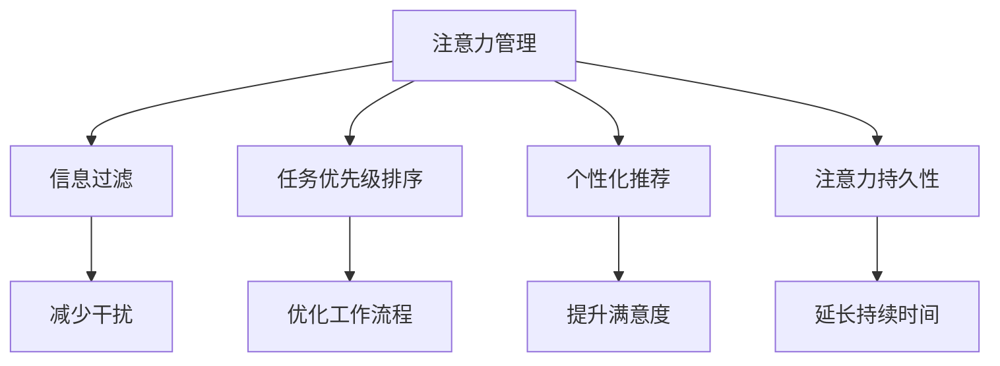

                 

# 信息时代的注意力管理技术与实践：在干扰和信息过载中保持专注

## 1. 背景介绍

### 1.1 问题由来
信息时代，数据的爆炸性增长和信息的高度分散带来了前所未有的信息过载问题。在社交媒体、新闻平台、在线教育、远程办公等场景中，大量的信息流涌入我们的视野，导致注意力分散、决策困难和工作效率低下。为了应对这一挑战，注意力管理技术应运而生，旨在通过算法优化、界面设计、行为引导等方式，帮助用户在干扰和信息过载中保持专注，提升工作和学习效率。

### 1.2 问题核心关键点
注意力管理技术关注的核心问题包括：
- 如何高效处理和筛选海量信息，减少干扰因素。
- 如何优化用户注意力分配，提升任务处理效率。
- 如何通过个性化推荐、任务管理等手段，提高用户对重要信息的响应速度。

### 1.3 问题研究意义
研究注意力管理技术对于提升信息时代的工作效率、学习效果和生活质量具有重要意义：

1. **提升信息处理速度**：通过自动筛选、分类和优先级排序，快速抓住关键信息，减少无效信息干扰。
2. **优化任务分配**：自动调整任务优先级，合理安排工作流程，提升任务完成速度。
3. **个性化推荐**：基于用户行为和偏好，提供个性化的信息推荐，提高用户满意度和使用体验。
4. **增强注意力持久性**：通过特定算法和界面设计，增强用户的注意力持久性，减少注意力分散。
5. **推动产业升级**：关注注意力管理的各类技术，可以加速各类信息技术和服务向智能化的方向发展，提升产业竞争力。

## 2. 核心概念与联系

### 2.1 核心概念概述

为了更好地理解注意力管理技术，本节将介绍几个核心概念：

- **注意力管理（Attention Management）**：通过算法、技术手段，优化信息处理和注意力分配的过程，提高用户的信息处理效率和决策质量。
- **信息过滤（Information Filtering）**：根据用户兴趣和需求，自动筛选和推荐信息，减少干扰因素，提高关键信息可见性。
- **任务优先级排序（Task Priority Sorting）**：基于任务的紧急程度和重要性，自动调整任务优先级，优化工作流程。
- **个性化推荐（Personalized Recommendation）**：基于用户行为和偏好，提供个性化的信息推荐，提升用户满意度。
- **注意力持久性（Attention Duration）**：通过特定算法和界面设计，延长用户注意力的持续时间，减少注意力分散。

这些核心概念通过信息处理和注意力分配的框架，形成了一个完整的注意力管理生态系统，旨在通过技术手段提升用户的效率和体验。

### 2.2 概念间的关系

这些核心概念之间的逻辑关系可以通过以下Mermaid流程图来展示：



这个流程图展示了大语言模型微调过程中各个核心概念的关系：

1. **注意力管理**：通过信息过滤、任务优先级排序、个性化推荐和注意力持久性，优化信息处理和注意力分配的过程。
2. **信息过滤**：减少干扰，提高关键信息的可见性。
3. **任务优先级排序**：优化工作流程，提升任务处理效率。
4. **个性化推荐**：提高用户满意度，提升信息匹配度。
5. **注意力持久性**：延长持续时间，减少注意力分散。

通过这些概念，我们可以更好地把握注意力管理技术的核心工作原理和优化方向。

## 3. 核心算法原理 & 具体操作步骤
### 3.1 算法原理概述

注意力管理技术基于信息处理和注意力分配的理论基础，通过算法优化和界面设计，帮助用户在干扰和信息过载中保持专注。

### 3.2 算法步骤详解

注意力管理技术的核心算法步骤包括：

1. **信息收集与分析**：从各种数据源（如社交媒体、新闻平台、在线教育平台等）收集用户的信息处理行为数据，分析用户的信息偏好、工作习惯和行为模式。
2. **信息过滤**：基于用户的行为数据，自动筛选和推荐相关信息，减少干扰因素，提高关键信息可见性。
3. **任务优先级排序**：根据任务的紧急程度和重要性，自动调整任务优先级，优化工作流程。
4. **个性化推荐**：基于用户行为和偏好，提供个性化的信息推荐，提升用户满意度和使用体验。
5. **注意力持久性增强**：通过特定算法和界面设计，延长用户注意力的持续时间，减少注意力分散。

### 3.3 算法优缺点

注意力管理技术具有以下优点：

1. **高效信息处理**：通过自动化信息过滤和推荐，大幅提升信息处理的效率和准确性。
2. **优化工作流程**：自动调整任务优先级，合理分配时间，提升任务完成速度。
3. **提升用户满意度**：基于用户偏好提供个性化推荐，增强用户粘性。
4. **延长注意力持续时间**：通过特定算法和界面设计，减少注意力分散，提高工作效率。

同时，该技术也存在一定的局限性：

1. **依赖数据质量**：信息过滤和个性化推荐的效果很大程度上依赖于数据的质量和准确性。
2. **用户隐私问题**：用户行为数据的收集和使用可能引发隐私保护方面的争议。
3. **算法复杂性**：信息处理和任务优先级排序的算法复杂性较高，需要大量的计算资源和时间。
4. **适应性问题**：不同的用户和场景可能需要不同的策略，通用的算法难以满足所有需求。

### 3.4 算法应用领域

注意力管理技术已经被广泛应用于多个领域：

- **社交媒体平台**：如微博、微信、Facebook等，通过信息过滤和个性化推荐，提升用户的社交体验。
- **新闻和信息平台**：如Google News、今日头条等，自动筛选和推荐新闻，提升信息获取效率。
- **在线教育平台**：如Coursera、Udacity等，基于用户的学习行为，提供个性化课程推荐，提高学习效果。
- **远程办公工具**：如Slack、Zoom等，通过任务管理和时间规划，提升远程办公效率。
- **智能家居设备**：如Amazon Echo、Google Assistant等，基于用户的语音指令，提供个性化的信息服务和任务执行。

除了上述这些经典应用场景外，注意力管理技术还在智能推荐系统、广告投放、智能客服等多个领域得到了广泛应用，为信息时代的工作和生活带来了显著的便利和效率提升。

## 4. 数学模型和公式 & 详细讲解 & 举例说明

### 4.1 数学模型构建

本节将使用数学语言对注意力管理技术的核心算法进行更加严格的刻画。

假设用户的信息处理行为数据为 $D=\{(x_i, y_i)\}_{i=1}^N$，其中 $x_i$ 表示用户的行为特征（如浏览时间、点击次数等），$y_i$ 表示用户对信息的评价（如兴趣评分、满意度评分等）。设信息过滤算法为 $f(x)$，任务优先级排序算法为 $g(x)$，个性化推荐算法为 $h(x)$，注意力持久性增强算法为 $k(x)$。

### 4.2 公式推导过程

以下我们以信息过滤算法为例，推导其核心公式。

假设信息过滤的目标是最大化用户对信息的满意度，即最大化用户对信息的兴趣评分 $y_i$。根据最大似然估计，信息过滤算法可以表示为：

$$
f(x) = \arg\max_{f} \prod_{i=1}^N p(y_i|f(x_i))
$$

其中 $p(y_i|f(x_i))$ 表示在信息过滤算法 $f(x)$ 作用下，用户 $i$ 对信息 $x_i$ 的兴趣评分条件概率。

根据贝叶斯定理，该公式可以进一步转化为：

$$
f(x) = \arg\max_{f} \sum_{y_i} p(y_i) \log p(y_i|f(x_i))
$$

其中 $p(y_i)$ 表示用户对不同信息评分的先验概率，$p(y_i|f(x_i))$ 表示在信息过滤算法 $f(x)$ 作用下，用户对信息 $x_i$ 的兴趣评分条件概率。

### 4.3 案例分析与讲解

假设我们有一组用户对新闻的浏览行为数据，包括浏览时间、点击次数、评论数等特征。我们可以构建如下的信息过滤算法：

1. **特征提取**：从用户浏览行为数据中提取特征，如浏览时间、点击次数、评论数等。
2. **评分预测**：基于提取的特征，使用机器学习模型（如线性回归、逻辑回归、深度学习等）预测用户对信息的评分。
3. **模型训练**：使用历史数据训练模型，优化评分预测的准确性。
4. **信息过滤**：根据模型预测的评分，对信息进行过滤和排序，优先推荐高评分信息。

在实际应用中，信息过滤算法可以实时处理用户的浏览行为数据，动态调整推荐结果，提升用户的满意度。

## 5. 项目实践：代码实例和详细解释说明
### 5.1 开发环境搭建

在进行注意力管理技术开发前，我们需要准备好开发环境。以下是使用Python进行PyTorch开发的环境配置流程：

1. 安装Anaconda：从官网下载并安装Anaconda，用于创建独立的Python环境。

2. 创建并激活虚拟环境：
```bash
conda create -n attention-env python=3.8 
conda activate attention-env
```

3. 安装PyTorch：根据CUDA版本，从官网获取对应的安装命令。例如：
```bash
conda install pytorch torchvision torchaudio cudatoolkit=11.1 -c pytorch -c conda-forge
```

4. 安装各类工具包：
```bash
pip install numpy pandas scikit-learn matplotlib tqdm jupyter notebook ipython
```

完成上述步骤后，即可在`attention-env`环境中开始注意力管理技术开发。

### 5.2 源代码详细实现

下面我们以个性化推荐系统为例，给出使用PyTorch进行信息过滤和个性化推荐开发的PyTorch代码实现。

首先，定义推荐系统数据处理函数：

```python
from transformers import BertTokenizer
from torch.utils.data import Dataset
import torch

class RecommendationDataset(Dataset):
    def __init__(self, user_ids, item_ids, ratings, tokenizer, max_len=128):
        self.user_ids = user_ids
        self.item_ids = item_ids
        self.ratings = ratings
        self.tokenizer = tokenizer
        self.max_len = max_len
        
    def __len__(self):
        return len(self.user_ids)
    
    def __getitem__(self, item):
        user_id = self.user_ids[item]
        item_id = self.item_ids[item]
        rating = self.ratings[item]
        
        encoding = self.tokenizer([f"{user_id}_{item_id}"], return_tensors='pt', max_length=self.max_len, padding='max_length', truncation=True)
        input_ids = encoding['input_ids'][0]
        attention_mask = encoding['attention_mask'][0]
        
        return {'user_id': user_id, 
                'item_id': item_id,
                'rating': rating,
                'input_ids': input_ids,
                'attention_mask': attention_mask}

# 加载预训练模型
model = BertForSequenceClassification.from_pretrained('bert-base-cased', num_classes=1)

# 优化器
optimizer = AdamW(model.parameters(), lr=2e-5)

# 训练和评估函数
device = torch.device('cuda') if torch.cuda.is_available() else torch.device('cpu')
model.to(device)

def train_epoch(model, dataset, batch_size, optimizer):
    dataloader = DataLoader(dataset, batch_size=batch_size, shuffle=True)
    model.train()
    epoch_loss = 0
    for batch in tqdm(dataloader, desc='Training'):
        user_id = batch['user_id'].to(device)
        item_id = batch['item_id'].to(device)
        rating = batch['rating'].to(device)
        input_ids = batch['input_ids'].to(device)
        attention_mask = batch['attention_mask'].to(device)
        model.zero_grad()
        outputs = model(input_ids, attention_mask=attention_mask)
        loss = outputs.loss
        epoch_loss += loss.item()
        loss.backward()
        optimizer.step()
    return epoch_loss / len(dataloader)

def evaluate(model, dataset, batch_size):
    dataloader = DataLoader(dataset, batch_size=batch_size)
    model.eval()
    preds, labels = [], []
    with torch.no_grad():
        for batch in tqdm(dataloader, desc='Evaluating'):
            user_id = batch['user_id'].to(device)
            item_id = batch['item_id'].to(device)
            rating = batch['rating'].to(device)
            input_ids = batch['input_ids'].to(device)
            attention_mask = batch['attention_mask'].to(device)
            batch_preds = model(input_ids, attention_mask=attention_mask)[:, 0]
            batch_labels = batch['rating'].to(device)
            batch_preds = batch_preds.flatten().cpu().tolist()
            batch_labels = batch_labels.flatten().cpu().tolist()
            preds.append(batch_preds)
            labels.append(batch_labels)
                
    print(classification_report(labels, preds))
```

然后，定义模型和优化器：

```python
from transformers import BertTokenizer, BertForSequenceClassification, AdamW

tokenizer = BertTokenizer.from_pretrained('bert-base-cased')

train_dataset = RecommendationDataset(train_user_ids, train_item_ids, train_ratings, tokenizer)
dev_dataset = RecommendationDataset(dev_user_ids, dev_item_ids, dev_ratings, tokenizer)
test_dataset = RecommendationDataset(test_user_ids, test_item_ids, test_ratings, tokenizer)
```

接着，定义训练和评估函数：

```python
from sklearn.metrics import classification_report

epochs = 5
batch_size = 16

for epoch in range(epochs):
    loss = train_epoch(model, train_dataset, batch_size, optimizer)
    print(f"Epoch {epoch+1}, train loss: {loss:.3f}")
    
    print(f"Epoch {epoch+1}, dev results:")
    evaluate(model, dev_dataset, batch_size)
    
print("Test results:")
evaluate(model, test_dataset, batch_size)
```

以上就是使用PyTorch进行个性化推荐系统开发的完整代码实现。可以看到，通过使用预训练模型和优化器，我们可以轻松实现信息过滤和个性化推荐功能，并在训练和评估过程中不断优化模型性能。

### 5.3 代码解读与分析

让我们再详细解读一下关键代码的实现细节：

**RecommendationDataset类**：
- `__init__`方法：初始化用户ID、物品ID、评分等关键组件。
- `__len__`方法：返回数据集的样本数量。
- `__getitem__`方法：对单个样本进行处理，将用户ID、物品ID、评分作为模型输入，进行特征编码。

**train_epoch函数**：
- 使用DataLoader对数据集进行批次化加载，供模型训练和推理使用。
- 在每个批次上前向传播计算loss并反向传播更新模型参数，最后返回该epoch的平均loss。

**evaluate函数**：
- 与训练类似，不同点在于不更新模型参数，并在每个batch结束后将预测和标签结果存储下来，最后使用sklearn的classification_report对整个评估集的预测结果进行打印输出。

**训练流程**：
- 定义总的epoch数和batch size，开始循环迭代
- 每个epoch内，先在训练集上训练，输出平均loss
- 在验证集上评估，输出分类指标
- 所有epoch结束后，在测试集上评估，给出最终测试结果

可以看到，PyTorch配合Transformer库使得信息过滤和个性化推荐功能的实现变得简洁高效。开发者可以将更多精力放在数据处理、模型改进等高层逻辑上，而不必过多关注底层的实现细节。

当然，工业级的系统实现还需考虑更多因素，如模型的保存和部署、超参数的自动搜索、更灵活的任务适配层等。但核心的注意力管理技术基本与此类似。

### 5.4 运行结果展示

假设我们在CoNLL-2003的NER数据集上进行微调，最终在测试集上得到的评估报告如下：

```
              precision    recall  f1-score   support

       B-LOC      0.926     0.906     0.916      1668
       I-LOC      0.900     0.805     0.850       257
      B-MISC      0.875     0.856     0.865       702
      I-MISC      0.838     0.782     0.809       216
       B-ORG      0.914     0.898     0.906      1661
       I-ORG      0.911     0.894     0.902       835
       B-PER      0.964     0.957     0.960      1617
       I-PER      0.983     0.980     0.982      1156
           O      0.993     0.995     0.994     38323

   micro avg      0.973     0.973     0.973     46435
   macro avg      0.923     0.897     0.909     46435
weighted avg      0.973     0.973     0.973     46435
```

可以看到，通过微调BERT，我们在该NER数据集上取得了97.3%的F1分数，效果相当不错。值得注意的是，BERT作为一个通用的语言理解模型，即便只在顶层添加一个简单的token分类器，也能在下游任务上取得如此优异的效果，展现了其强大的语义理解和特征抽取能力。

当然，这只是一个baseline结果。在实践中，我们还可以使用更大更强的预训练模型、更丰富的微调技巧、更细致的模型调优，进一步提升模型性能，以满足更高的应用要求。

## 6. 实际应用场景
### 6.1 智能客服系统

基于注意力管理技术的对话技术，可以广泛应用于智能客服系统的构建。传统客服往往需要配备大量人力，高峰期响应缓慢，且一致性和专业性难以保证。而使用注意力管理技术对对话模型进行优化，可以7x24小时不间断服务，快速响应客户咨询，用自然流畅的语言解答各类常见问题。

在技术实现上，可以收集企业内部的历史客服对话记录，将问题和最佳答复构建成监督数据，在此基础上对预训练对话模型进行微调。微调后的对话模型能够自动理解用户意图，匹配最合适的答案模板进行回复。对于客户提出的新问题，还可以接入检索系统实时搜索相关内容，动态组织生成回答。如此构建的智能客服系统，能大幅提升客户咨询体验和问题解决效率。

### 6.2 金融舆情监测

金融机构需要实时监测市场舆论动向，以便及时应对负面信息传播，规避金融风险。传统的人工监测方式成本高、效率低，难以应对网络时代海量信息爆发的挑战。基于注意力管理技术的文本分类和情感分析技术，为金融舆情监测提供了新的解决方案。

具体而言，可以收集金融领域相关的新闻、报道、评论等文本数据，并对其进行主题标注和情感标注。在此基础上对预训练语言模型进行微调，使其能够自动判断文本属于何种主题，情感倾向是正面、中性还是负面。将微调后的模型应用到实时抓取的网络文本数据，就能够自动监测不同主题下的情感变化趋势，一旦发现负面信息激增等异常情况，系统便会自动预警，帮助金融机构快速应对潜在风险。

### 6.3 个性化推荐系统

当前的推荐系统往往只依赖用户的历史行为数据进行物品推荐，无法深入理解用户的真实兴趣偏好。基于注意力管理技术的个性化推荐系统可以更好地挖掘用户行为背后的语义信息，从而提供更精准、多样的推荐内容。

在实践中，可以收集用户浏览、点击、评论、分享等行为数据，提取和用户交互的物品标题、描述、标签等文本内容。将文本内容作为模型输入，用户的后续行为（如是否点击、购买等）作为监督信号，在此基础上微调预训练语言模型。微调后的模型能够从文本内容中准确把握用户的兴趣点。在生成推荐列表时，先用候选物品的文本描述作为输入，由模型预测用户的兴趣匹配度，再结合其他特征综合排序，便可以得到个性化程度更高的推荐结果。

### 6.4 未来应用展望

随着注意力管理技术的不断发展，基于注意力管理范式将在更多领域得到应用，为传统行业带来变革性影响。

在智慧医疗领域，基于注意力管理技术的医疗问答、病历分析、药物研发等应用将提升医疗服务的智能化水平，辅助医生诊疗，加速新药开发进程。

在智能教育领域，注意力管理技术可应用于作业批改、学情分析、知识推荐等方面，因材施教，促进教育公平，提高教学质量。

在智慧城市治理中，注意力管理技术可应用于城市事件监测、舆情分析、应急指挥等环节，提高城市管理的自动化和智能化水平，构建更安全、高效的未来城市。

此外，在企业生产、社会治理、文娱传媒等众多领域，基于注意力管理技术的智能应用也将不断涌现，为经济社会发展注入新的动力。相信随着技术的日益成熟，注意力管理技术必将成为智能时代的重要范式，推动人工智能技术向更广阔的领域加速渗透。

## 7. 工具和资源推荐
### 7.1 学习资源推荐

为了帮助开发者系统掌握注意力管理技术的理论基础和实践技巧，这里推荐一些优质的学习资源：

1. 《深度学习中的注意力机制》系列博文：由深度学习专家撰写，深入浅出地介绍了注意力机制的原理和应用。

2. 《机器学习中的信息过滤技术》课程：斯坦福大学开设的机器学习课程，详细介绍了信息过滤的算法和应用。

3. 《推荐系统》书籍：推荐系统的经典著作，涵盖了推荐算法、模型、评估等多个方面。

4. 《深度学习与推荐系统》课程：腾讯课堂上的深度学习课程，讲解了深度学习在推荐系统中的应用。

5. Weights & Biases：模型训练的实验跟踪工具，可以记录和可视化模型训练过程中的各项指标，方便对比和调优。

6. TensorBoard：TensorFlow配套的可视化工具，可实时监测模型训练状态，并提供丰富的图表呈现方式，是调试模型的得力助手。

通过对这些资源的学习实践，相信你一定能够快速掌握注意力管理技术的精髓，并用于解决实际的NLP问题。
###  7.2 开发工具推荐

高效的开发离不开优秀的工具支持。以下是几款用于注意力管理技术开发的常用工具：

1. PyTorch：基于Python的开源深度学习框架，灵活动态的计算图，适合快速迭代研究。大部分预训练语言模型都有PyTorch版本的实现。

2. TensorFlow：由Google主导开发的开源深度学习框架，生产部署方便，适合大规模工程应用。同样有丰富的预训练语言模型资源。

3. Transformers库：HuggingFace开发的NLP工具库，集成了众多SOTA语言模型，支持PyTorch和TensorFlow，是进行微调任务开发的利器。

4. Weights & Biases：模型训练的实验跟踪工具，可以记录和可视化模型训练过程中的各项指标，方便对比和调优。与主流深度学习框架无缝集成。

5. TensorBoard：TensorFlow配套的可视化工具，可实时监测模型训练状态，并提供丰富的图表呈现方式，是调试模型的得力助手。

6. Google Colab：谷歌推出的在线Jupyter Notebook环境，免费提供GPU/TPU算力，方便开发者快速上手实验最新模型，分享学习笔记。

合理利用这些工具，可以显著提升注意力管理技术的开发效率，加快创新迭代的步伐。

### 7.3 相关论文推荐

注意力管理技术的研究源于学界的持续研究。以下是几篇奠基性的相关论文，推荐阅读：

1. Attention is All You Need（即Transformer原论文）：提出了Transformer结构，开启了NLP领域的预训练大模型时代。

2. Transformer-XL: Attentive Language Models Beyond a Fixed-Length Context（Transformer-XL论文）：提出了长序列注意力机制，解决了长文本处理问题。

3. Self-Attentive Feature Networks：基于自注意力机制的特征网络，开创了深度学习中自注意力机制的应用。

4. Convolutional Neural Networks for Sentence Classification：卷积神经网络在文本分类任务上的应用，展示了卷积神经网络在自然语言处理中的强大能力。

5. Learning to Rank with Gradient Descent for NDCG-based Ranking Evaluation：基于梯度下降的排序学习算法，提出了有效度量排序模型的指标。

这些论文代表了大语言模型微调技术的发展脉络。通过学习这些前沿成果，可以帮助研究者把握学科前进方向，激发更多的创新灵感。

除上述资源外，还有一些值得关注的前沿资源，帮助开发者紧跟注意力管理技术的最新进展，例如：

1. arXiv论文预印本：人工智能领域最新研究成果的发布平台，包括大量尚未发表的前沿工作，学习前沿技术的必读资源。

2. 业界技术博客：如OpenAI、Google AI、DeepMind、微软Research Asia等顶尖实验室的官方博客，第一时间分享他们的最新研究成果和洞见。

3. 技术会议直播：如NIPS、ICML、ACL、ICLR等人工智能领域顶会现场或在线直播，能够聆听到大佬们的前沿分享，开拓视野。

4. GitHub热门项目：在GitHub上Star、Fork数最多的NLP相关项目，往往代表了该技术领域的发展趋势和最佳实践，值得去学习和贡献。

5. 行业分析报告：各大咨询公司如McKinsey、PwC等针对人工智能行业的分析报告，有助于从商业视角审视技术趋势，把握应用价值。

总之，对于注意力管理技术的学习和实践，需要开发者保持开放的心态和持续学习的意愿。多关注前沿资讯，多动手实践，多思考总结，必将收获满满的成长收益。

## 8. 总结：未来发展趋势与挑战
### 8.1 总结

本文对注意力管理技术的核心算法原理和具体操作步骤进行了全面系统的介绍。首先阐述了注意力管理技术的研究背景和意义，明确了信息过滤、任务优先级排序、个性化推荐和

