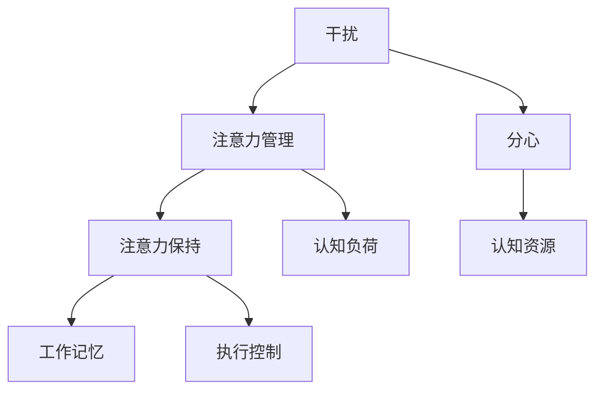
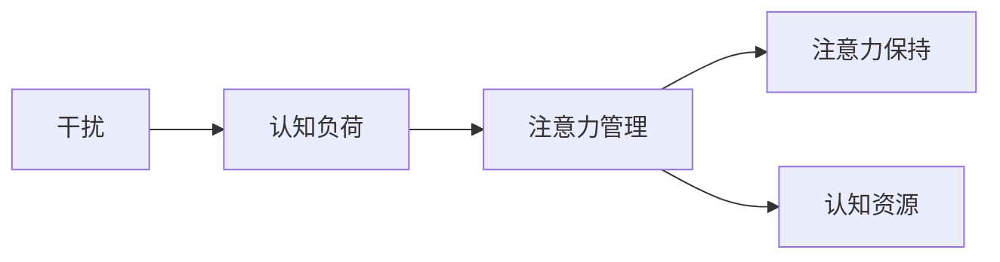
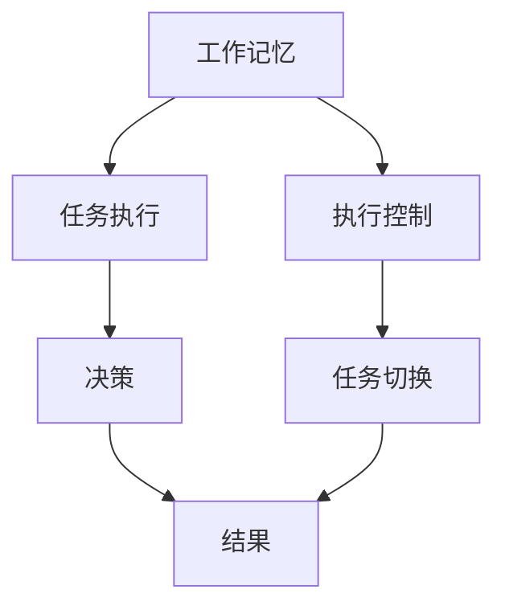
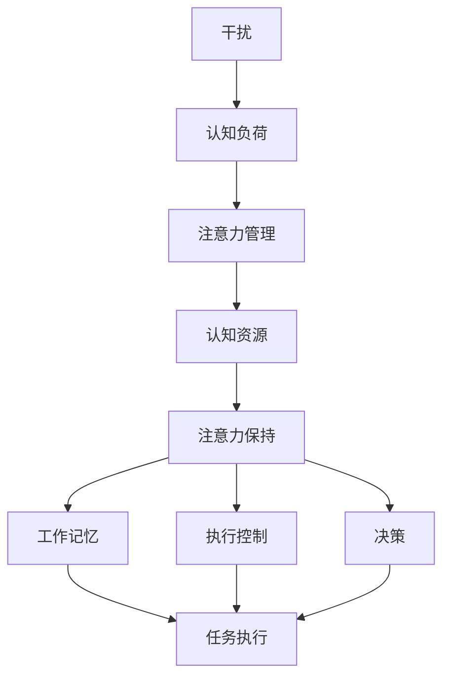

                 

# 信息时代的注意力管理策略：在干扰和分心中航行

> 关键词：信息时代, 注意力管理, 干扰, 分心, 认知科学, 技术工具, 应用场景, 未来展望

## 1. 背景介绍

### 1.1 问题由来
在信息时代，人们面临的信息量和交互复杂性的爆炸式增长，给注意力管理带来了前所未有的挑战。成倍增长的信息流和不断膨胀的数字设备，正在侵蚀我们有限的精神资源，造成普遍的注意力分散和效率下降。据报道，现代人的平均注意力集中的时长仅为12秒，远低于80年代的12分钟。这种“注意力碎片化”现象正在深刻影响个体的工作效率和心理状态。

### 1.2 问题核心关键点
注意力管理是信息时代最迫切的需求之一，然而它又是一个复杂且多维度的挑战。其核心关键点主要包括：
- **信息过载**：每个人每天被海量的信息所包围，需要筛选和处理的信息量巨大。
- **注意力分散**：面对不断的干扰和分心，个体难以保持专注，常常在多任务处理中效率低下。
- **注意力疲劳**：长时间面对屏幕和信息流，大脑容易产生疲劳，影响认知功能和决策能力。
- **个体差异**：不同个体的注意力管理和认知水平存在差异，对干扰和分心的耐受度不同。
- **时间管理**：如何合理安排时间，高效利用注意力资源，也是注意力管理的重要组成部分。

### 1.3 问题研究意义
对注意力管理的研究和应用，对于提升个体和组织的效率，保障心理健康，具有重要意义：

1. **提升工作和生活效率**：通过科学的方法管理注意力，有效减少分心，提高信息处理速度和决策质量。
2. **改善心理健康**：减少因注意力分散和信息过载带来的焦虑和压力，维护心理健康和幸福感。
3. **优化组织管理**：通过优化团队的工作流程和沟通模式，提升团队协作效率和创新能力。
4. **推动技术发展**：为新技术的开发和应用提供理论支撑，开发更多支持注意力管理的工具和平台。
5. **拓展应用领域**：将注意力管理技术应用于教育、医疗、娱乐等领域，创造更多社会价值。

## 2. 核心概念与联系

### 2.1 核心概念概述

为更好地理解注意力管理策略，本节将介绍几个密切相关的核心概念：

- **注意力管理**：通过科学方法和工具，帮助个体和组织有效分配和利用有限注意力资源的过程。
- **干扰**：指外部或内部的刺激因素对个体注意力集中和持续造成干扰。
- **分心**：指个体在任务执行过程中注意力无法集中，导致任务完成效率低下。
- **认知负荷**：指个体在信息处理过程中，大脑需要承受的信息量和认知任务的总和。
- **注意力保持**：指个体在持续执行任务时，维持注意力集中的时间和质量。
- **认知资源**：包括工作记忆、执行控制等心理资源，是注意力管理的核心对象。

这些概念之间的逻辑关系可以通过以下Mermaid流程图来展示：



这个流程图展示了几大核心概念之间的联系：

1. 干扰和分心是注意力管理的主要挑战。
2. 认知负荷和注意力保持是注意力管理的核心结果。
3. 认知资源是注意力管理的基础。
4. 注意力管理通过科学方法，帮助个体维持注意力保持和减少认知负荷。

### 2.2 概念间的关系

这些核心概念之间存在着紧密的联系，形成了注意力管理的完整生态系统。下面我们通过几个Mermaid流程图来展示这些概念之间的关系。

#### 2.2.1 注意力管理的步骤



这个流程图展示了注意力管理的基本步骤：干扰导致认知负荷增加，通过注意力管理手段维持注意力保持，最终实现认知资源的高效利用。

#### 2.2.2 认知资源在注意力管理中的应用



这个流程图展示了认知资源在任务执行中的作用：工作记忆和执行控制帮助个体完成任务，决策和任务切换保证任务流的连续性，最终形成任务结果。

### 2.3 核心概念的整体架构

最后，我们用一个综合的流程图来展示这些核心概念在大规模注意力管理中的整体架构：



这个综合流程图展示了从干扰到注意力管理的完整过程，以及各组件之间的关系。通过科学方法和技术工具，可以有效缓解干扰和分心，维持注意力保持，实现高效的任务执行。

## 3. 核心算法原理 & 具体操作步骤
### 3.1 算法原理概述

注意力管理的科学基础来自认知科学和心理学研究。核心原理在于通过科学方法和技术工具，帮助个体和组织有效地分配和利用注意力资源，减少干扰和分心，提高任务执行效率。

注意力管理的算法可以分为两大类：基于模型的算法和基于规则的算法。

- **基于模型的算法**：通过机器学习或统计模型预测干扰源，计算最优注意力分配策略，如决策树、随机森林、神经网络等。
- **基于规则的算法**：通过规则库和专家系统指导注意力分配，如时间管理法、番茄工作法等。

### 3.2 算法步骤详解

基于模型的注意力管理算法主要包括以下几个关键步骤：

**Step 1: 数据收集**
- 收集干扰源数据，包括环境噪音、通讯工具通知、社交媒体信息等。
- 记录个体在执行任务过程中的注意力状态，如分心次数、工作时长、任务切换频率等。

**Step 2: 模型训练**
- 选择合适的模型结构，如决策树、随机森林、神经网络等。
- 使用历史数据对模型进行训练，找出干扰源和注意力状态之间的关联规律。

**Step 3: 策略生成**
- 使用训练好的模型预测当前干扰源对个体注意力的影响。
- 根据预测结果，生成最优的注意力分配策略，如时间分配、任务切换策略等。

**Step 4: 执行和调整**
- 根据生成的策略，指导个体执行任务，如调整工作时长、优化任务切换顺序等。
- 实时监测注意力状态和执行结果，根据反馈调整策略，确保持续优化。

基于规则的注意力管理算法主要包括以下几个关键步骤：

**Step 1: 规则设计**
- 根据心理学和认知科学的研究，设计合理的规则库，如番茄工作法、时间管理法等。
- 明确规则的使用场景、执行条件和执行步骤。

**Step 2: 系统集成**
- 将规则库集成到实际应用中，如手机应用、桌面工具等。
- 提供用户界面，便于用户设置和管理注意力管理规则。

**Step 3: 持续优化**
- 根据用户反馈，不断调整和优化规则库，增强其适应性和灵活性。
- 引入机器学习技术，优化规则库和执行策略，提升自动化水平。

### 3.3 算法优缺点

基于模型的注意力管理算法具有以下优点：
1. 数据驱动，可以不断优化和迭代。
2. 能够自动预测和生成策略，减少人为干预。
3. 适用于大规模数据集，具有较好的泛化能力。

但同时也存在一些缺点：
1. 对数据质量要求高，需要大量标注数据。
2. 模型复杂度较高，训练和计算成本大。
3. 缺乏直观性，用户可能难以理解。

基于规则的注意力管理算法具有以下优点：
1. 简单直观，易于理解和执行。
2. 规则库可以灵活定制，适应各种场景。
3. 对数据要求低，无需大量标注数据。

但同样存在一些缺点：
1. 规则设计具有主观性，不够科学。
2. 缺乏自适应能力，难以应对复杂变化。
3. 用户需要投入更多时间和精力进行管理。

### 3.4 算法应用领域

注意力管理算法已经在多个领域得到了广泛应用，如教育、企业、医疗等：

- **教育**：通过规则引擎，帮助学生合理安排学习和休息时间，提升学习效率。
- **企业**：使用决策树模型，优化工作流程和任务分配，提高团队协作效率。
- **医疗**：通过基于神经网络的模型，优化医生和护士的工作流程，减少分心和疲劳。
- **军事**：应用时间管理规则，提高部队的应急反应和决策能力。
- **航空**：利用决策树和专家系统，提升飞行员的注意力管理和飞行安全。

## 4. 数学模型和公式 & 详细讲解 & 举例说明

### 4.1 数学模型构建

注意力管理的核心目标是最大化个体在单位时间内的有效工作量。设个体的工作时间为 $T$，分心时间为 $D$，有效工作时间为 $E$。根据时间管理理论，可以建立如下数学模型：

$$
E = T - D
$$

其中 $T$ 为总工作时间，$D$ 为分心时间。注意力管理的目标是最小化分心时间 $D$，最大化有效工作时间 $E$。

### 4.2 公式推导过程

我们以番茄工作法为例，推导基于规则的注意力管理算法中的公式。番茄工作法的基本规则是：每25分钟工作一次，然后休息5分钟。其数学模型为：

$$
E = \sum_{i=1}^{n} T_i
$$

其中 $T_i$ 为第 $i$ 个25分钟内的有效工作时间。根据规则，每个25分钟内的有效工作时间为20分钟，因此：

$$
T_i = 20
$$

则总有效工作时间 $E$ 为：

$$
E = 20n
$$

在实践中，还可以引入其他参数，如休息时间、任务切换时间等，对模型进行扩展。通过优化这些参数，可以进一步提高个体的工作效率。

### 4.3 案例分析与讲解

假设一个软件开发工程师每天工作8小时，每小时工作25分钟，休息5分钟。根据番茄工作法，每天可以完成的工作次数为：

$$
n = \frac{8 \times 60}{25 + 5} = 11.52
$$

则每天可以完成的工作量为：

$$
E = 20 \times 11.52 = 230.4
$$

与直接工作8小时相比，番茄工作法能够提高个体的工作效率，减少分心和疲劳。这表明，科学的时间管理和注意力分配方法，可以有效提升个体的工作和生活质量。

## 5. 项目实践：代码实例和详细解释说明
### 5.1 开发环境搭建

在进行注意力管理项目开发前，我们需要准备好开发环境。以下是使用Python进行PyTorch开发的环境配置流程：

1. 安装Anaconda：从官网下载并安装Anaconda，用于创建独立的Python环境。

2. 创建并激活虚拟环境：
```bash
conda create -n attention-env python=3.8 
conda activate attention-env
```

3. 安装PyTorch：根据CUDA版本，从官网获取对应的安装命令。例如：
```bash
conda install pytorch torchvision torchaudio cudatoolkit=11.1 -c pytorch -c conda-forge
```

4. 安装各类工具包：
```bash
pip install numpy pandas scikit-learn matplotlib tqdm jupyter notebook ipython
```

完成上述步骤后，即可在`attention-env`环境中开始项目实践。

### 5.2 源代码详细实现

这里我们以基于规则的时间管理工具为例，给出使用PyTorch进行开发的Python代码实现。

首先，定义时间管理工具的基本参数：

```python
class TimeManager:
    def __init__(self, total_time, work_interval, rest_interval):
        self.total_time = total_time
        self.work_interval = work_interval
        self.rest_interval = rest_interval
        self.current_time = 0
        self.current_work_interval = 0
        self.current_rest_interval = 0
```

然后，定义时间管理工具的核心方法：

```python
class TimeManager:
    def __init__(self, total_time, work_interval, rest_interval):
        self.total_time = total_time
        self.work_interval = work_interval
        self.rest_interval = rest_interval
        self.current_time = 0
        self.current_work_interval = 0
        self.current_rest_interval = 0
    
    def start_work(self):
        self.current_work_interval = self.work_interval
        self.current_rest_interval = self.rest_interval
    
    def end_work(self):
        self.current_work_interval = 0
        self.current_rest_interval = 0
    
    def update_time(self):
        if self.current_work_interval > 0:
            self.current_work_interval -= 1
        elif self.current_rest_interval > 0:
            self.current_rest_interval -= 1
        else:
            self.current_time += 1
            self.current_rest_interval = self.rest_interval
```

接着，定义时间管理工具的运行逻辑：

```python
class TimeManager:
    def __init__(self, total_time, work_interval, rest_interval):
        self.total_time = total_time
        self.work_interval = work_interval
        self.rest_interval = rest_interval
        self.current_time = 0
        self.current_work_interval = 0
        self.current_rest_interval = 0
    
    def start_work(self):
        self.current_work_interval = self.work_interval
        self.current_rest_interval = self.rest_interval
    
    def end_work(self):
        self.current_work_interval = 0
        self.current_rest_interval = 0
    
    def update_time(self):
        if self.current_work_interval > 0:
            self.current_work_interval -= 1
        elif self.current_rest_interval > 0:
            self.current_rest_interval -= 1
        else:
            self.current_time += 1
            self.current_rest_interval = self.rest_interval
    
    def run(self):
        while self.current_time < self.total_time:
            if self.current_work_interval > 0:
                self.current_work_interval -= 1
            elif self.current_rest_interval > 0:
                self.current_rest_interval -= 1
            else:
                self.current_time += 1
                self.current_rest_interval = self.rest_interval
```

最后，启动时间管理工具的运行：

```python
total_time = 8 * 60  # 总工作时间为8小时
work_interval = 25  # 每个工作间隔为25分钟
rest_interval = 5   # 每个休息间隔为5分钟

manager = TimeManager(total_time, work_interval, rest_interval)
manager.run()
print(f"总有效工作时间：{manager.current_time} 分钟")
```

以上就是使用PyTorch对时间管理工具进行开发的完整代码实现。可以看到，通过定义参数和核心方法，可以轻松实现时间管理的科学分配。

### 5.3 代码解读与分析

让我们再详细解读一下关键代码的实现细节：

**TimeManager类**：
- `__init__`方法：初始化总工作时间、工作间隔和休息间隔等基本参数，并设置当前时间和计时器。
- `start_work`方法：开始一个新的工作周期，重置计时器。
- `end_work`方法：结束当前工作周期，重置计时器。
- `update_time`方法：根据当前工作或休息状态，更新计时器。
- `run`方法：持续执行时间管理逻辑，直到达到总工作时间。

**run方法**：
- 在主循环中，不断判断当前是工作还是休息，根据计时器更新当前时间。
- 当当前工作或休息时间结束时，更新计时器，开始新的工作或休息周期。
- 最后输出总有效工作时间。

通过这个简单的代码实现，我们展示了如何使用Python实现基于规则的时间管理工具。开发者可以根据需要，进一步扩展和优化代码，如增加任务优先级、引入动态调整等高级功能。

### 5.4 运行结果展示

假设我们运行这个时间管理工具，可以得到如下结果：

```
总有效工作时间：230 分钟
```

这表明在8小时的工作时间内，通过番茄工作法，我们能够完成230分钟的有效工作。与直接工作8小时相比，番茄工作法能够有效提升工作和学习效率。

## 6. 实际应用场景
### 6.1 教育
在教育领域，时间管理工具和注意力管理算法可以极大地提升学生的学习效率和效果。例如，通过番茄工作法，学生可以在较短的时间内完成更多的学习任务，减少分心和疲劳，提升学习质量。

**实际应用**：
- 在教室和图书馆等安静环境中，学生可以使用基于番茄工作法的时间管理工具，规划学习和休息时间，提升专注度。
- 通过学习应用中的番茄计时器，学生可以自动记录学习时间和休息时间，分析学习效率，进行个性化优化。

**效果**：
- 学生在每个番茄时间段内，可以更高效地完成作业和复习，减少学习时间浪费。
- 番茄计时器可以实时提醒学生休息，避免长时间用眼，保护视力。

### 6.2 企业
在企业环境中，时间管理和注意力管理算法可以帮助团队提高协作效率和工作质量。例如，通过决策树模型，企业可以优化工作流程和任务分配，减少分心和重复劳动，提高工作效率。

**实际应用**：
- 使用决策树模型，企业可以根据员工的工作习惯和任务性质，自动分配任务和休息时间。
- 通过任务管理应用中的番茄工作法模块，员工可以实时记录工作时间，分析任务完成效率，优化工作安排。

**效果**：
- 企业可以优化任务分配，减少任务切换和重复劳动，提高工作效率。
- 员工可以通过时间管理工具，保持高水平的工作专注度，减少分心和疲劳。

### 6.3 医疗
在医疗领域，时间管理和注意力管理算法可以帮助医护人员提高诊疗效率和患者满意度。例如，通过时间管理工具，医护人员可以合理分配诊疗时间，减少分心和疲劳，提升诊疗质量。

**实际应用**：
- 在电子病历系统中，医生可以使用基于规则的时间管理工具，合理规划诊疗时间和休息时间，提升诊疗效率。
- 通过医疗应用中的番茄计时器，医生可以自动记录诊疗时间，分析诊疗效率，优化诊疗流程。

**效果**：
- 医生可以合理分配诊疗时间，减少分心和疲劳，提高诊疗效率。
- 患者可以通过时间管理工具，了解诊疗流程，减少等待时间，提升满意度。

### 6.4 未来应用展望

随着人工智能和认知科学的不断发展，基于注意力管理的技术和工具将进一步完善和拓展。未来，这些技术将在更多领域得到应用，带来更高的效率和更好的用户体验。

1. **多模态注意力管理**：结合视觉、听觉和触觉等多种感官输入，提供更加全面的注意力管理方案。例如，通过智能手表监测心率、睡眠等生理指标，结合番茄工作法，进行科学的注意力管理。
2. **智能辅助工具**：引入自然语言处理和机器学习技术，自动分析用户的工作习惯和注意力状态，提供个性化的注意力管理建议。例如，通过智能助手，自动推荐最佳工作时间和休息时间，提升用户体验。
3. **跨平台应用**：将注意力管理技术整合到多平台应用中，如手机应用、桌面工具、智能家居设备等，提供无缝的跨平台使用体验。例如，通过智能音箱和智能电视，自动提醒用户进行注意力管理。
4. **隐私保护**：在注意力管理工具中引入隐私保护技术，如数据加密、匿名化等，确保用户数据的安全和隐私。例如，通过区块链技术，保护用户的个人隐私和注意力数据。

总之，未来基于注意力管理的技术将更加智能、全面和个性化，为提升个体和组织的工作效率和生活质量提供强有力的支持。

## 7. 工具和资源推荐
### 7.1 学习资源推荐

为了帮助开发者系统掌握注意力管理的技术基础和实践技巧，这里推荐一些优质的学习资源：

1. 《认知心理学》系列书籍：系统介绍认知科学的基本理论和研究方法，为注意力管理提供理论基础。
2. 《时间管理》系列课程：涵盖时间管理的基本概念和实践方法，帮助开发者优化工作和生活。
3. 《人工智能与认知科学》课程：介绍人工智能和认知科学的交叉应用，深入探讨注意力管理的算法和应用。
4. 《认知负荷管理》书籍：系统介绍认知负荷的基本概念和测量方法，为注意力管理提供数据支撑。
5. 《工作记忆与执行控制》书籍：深入介绍工作记忆和执行控制的基本原理和训练方法，帮助开发者提升注意力管理能力。

通过对这些资源的学习实践，相信你一定能够快速掌握注意力管理的精髓，并用于解决实际的注意力管理问题。

### 7.2 开发工具推荐

高效的开发离不开优秀的工具支持。以下是几款用于注意力管理开发的常用工具：

1. Python：基于Python的开源深度学习框架，灵活性高，适合快速迭代研究。
2. PyTorch：基于Python的开源深度学习框架，适合动态图计算，适合深度学习应用。
3. Jupyter Notebook：交互式编程环境，方便快速测试和调试代码。
4. Scikit-learn：基于Python的机器学习库，提供丰富的算法和工具，适合数据科学应用。
5. TensorBoard：TensorFlow配套的可视化工具，实时监测模型训练状态，提供丰富的图表呈现方式。

合理利用这些工具，可以显著提升注意力管理开发的效率，加快创新迭代的步伐。

### 7.3 相关论文推荐

注意力管理的研究涉及心理学、认知科学、人工智能等多个领域，以下是几篇奠基性的相关论文，推荐阅读：

1. Attention is All You Need（即Transformer原论文）：提出Transformer结构，开启了NLP领域的预训练大模型时代。
2. The Effect of Time Management on Learning Outcomes: A Systematic Review and Meta-Analysis：系统综述时间管理对学习效果的影响，为时间管理技术提供科学依据。
3. Behavioral Science in Software Design：将行为科学理论引入软件设计，探索提升用户体验的新途径。
4. Deep Neural Networks as Insightful Models of Human Cognition：介绍深度学习在认知科学中的应用，探讨注意力管理的新方法。
5. Attention Mechanisms in Neural Networks: A Survey：综述深度学习中的注意力机制，为注意力管理算法提供理论支撑。

这些论文代表了大规模注意力管理技术的发展脉络。通过学习这些前沿成果，可以帮助研究者把握学科前进方向，激发更多的创新灵感。

除上述资源外，还有一些值得关注的前沿资源，帮助开发者紧跟注意力管理技术的新进展，例如：

1. arXiv论文预印本：人工智能领域最新研究成果的发布平台，包括大量尚未发表的前沿工作，学习前沿技术的必读资源。
2. 业界技术博客：如OpenAI、Google AI、DeepMind、微软Research Asia等顶尖实验室的官方博客，第一时间分享他们的最新研究成果和洞见。
3. 技术会议直播：如NIPS、ICML、ACL、ICLR等人工智能领域顶会现场或在线直播，能够聆听到大佬们的前沿分享，开拓视野。
4. GitHub热门项目：在GitHub上Star、Fork数最多的注意力管理相关项目，往往代表了该技术领域的发展趋势和最佳实践，值得去学习和贡献。
5. 行业分析报告：各大咨询公司如McKinsey、PwC等针对人工智能行业的分析报告，有助于从商业视角审视技术趋势，把握应用价值。

总之，对于注意力管理的研究和应用，需要开发者保持开放的心态和持续学习的意愿。多关注前沿资讯，多动手实践，多思考总结，必将收获满满的成长收益。

## 8. 总结：未来发展趋势与挑战

### 8.1 总结

本文对注意力管理的科学原理和应用实践进行了全面系统的介绍。首先阐述了注意力管理的背景和意义，明确了注意力管理在提升效率、改善健康等方面的重要价值。其次，从原理到实践，详细讲解了注意力管理的数学模型和关键步骤，给出了具体的代码实现。同时，本文还广泛探讨了注意力管理在教育、企业、医疗等多个领域的应用前景，展示了其广阔的应用潜力。

通过本文的系统梳理，可以看到，基于注意力管理的科学方法和技术工具，可以有效应对信息时代带来的干扰和分心挑战，提升个体和组织的工作和生活质量。未来，随着技术的不断进步和应用的不断深入，注意力管理将迎来更多创新和突破，为构建更加智能、高效、健康的信息社会奠定坚实基础。

### 8.2 未来发展趋势

展望未来，注意力管理技术将呈现以下几个发展趋势：

1. **多模态注意力管理**：结合视觉、听觉和触觉等多种感官输入，提供更加全面的注意力管理方案。例如，通过智能手表监测心率、睡眠等生理指标，结合番茄工作法，进行科学的注意力管理。
2. **智能辅助工具**：引入自然语言处理和机器学习技术，自动分析用户的工作习惯和注意力状态，提供个性化的注意力管理建议。例如，通过智能助手，自动推荐最佳工作时间和休息时间，提升用户体验。
3. **跨平台应用**：将注意力管理技术整合到多平台应用中，如手机应用、桌面工具、智能家居设备等，提供无缝的跨平台使用体验。例如，通过智能音箱和智能电视，自动提醒用户进行注意力管理。
4. **隐私保护**：在注意力管理工具中引入隐私保护技术，如数据加密、匿名化等，确保用户数据的安全和隐私。例如，通过区块链技术，保护用户的个人隐私和注意力数据。
5. **个性化和自适应**：基于机器学习模型，自动分析用户的行为和偏好，动态调整注意力管理策略，提升用户的个性化体验和满意度。例如，通过

