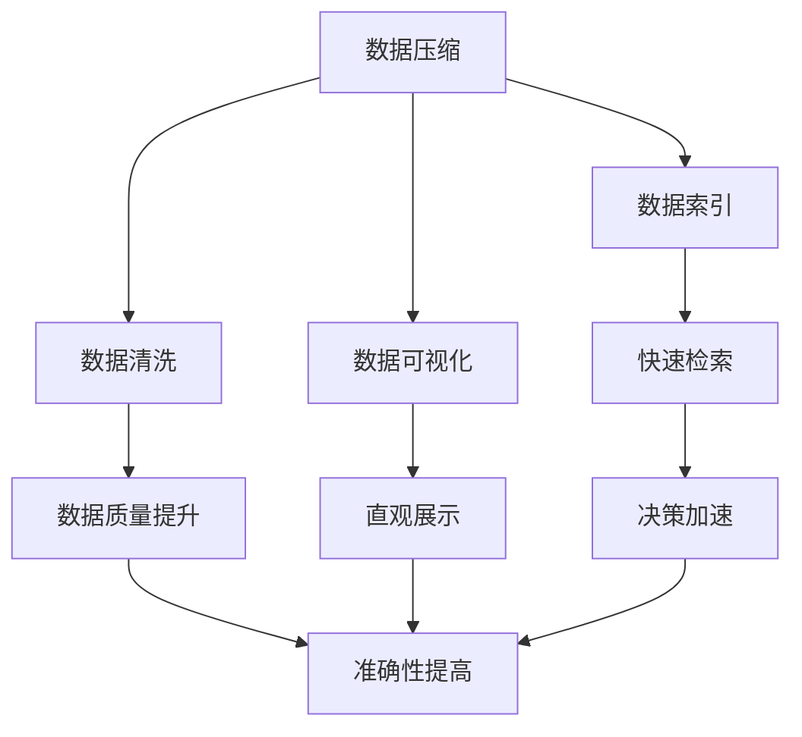
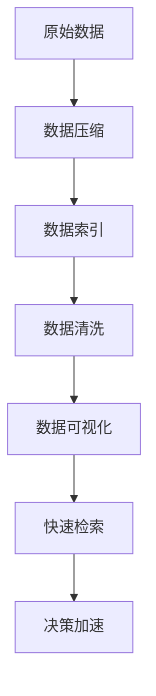

                 

# 信息简化的好处与挑战：在复杂世界中简化以提高效率和生产力

> 关键词：信息简化, 数据压缩, 效率提升, 算法复杂度, 信息保留, 数据驱动决策

## 1. 背景介绍

在信息化和数字化快速发展的今天，信息量和数据量呈爆炸性增长，如何有效管理和利用这些信息变得至关重要。信息简化作为一种重要的数据处理方法，旨在通过减少数据的冗余性和复杂度，提高信息处理和传输的效率，提升生产力。但与此同时，信息简化也面临着诸多挑战，如信息损失和数据准确性等问题。本文将从信息简化的核心概念入手，深入探讨其在实际应用中的好处与挑战，为大数据时代的决策者提供有益的参考。

### 1.1 问题由来

随着互联网的普及和数字技术的发展，企业、政府和个人每天都会产生大量数据。这些数据不仅包括结构化的数据（如表格、数据库记录），也包括非结构化的数据（如文本、图像、视频等）。数据量的激增对信息处理和存储提出了更高的要求，同时也带来了新的机会和挑战。

信息简化的概念源自于信息论和数据压缩技术。信息简化不仅关注数据的存储效率，也关注数据的传输效率和处理效率，是提升信息处理能力的重要手段。然而，信息简化并非万能钥匙，它在实际应用中仍面临诸多挑战，如信息损失、数据准确性等问题。因此，如何在保证数据质量的前提下，实现高效的信息处理，成为当前研究和应用的重点。

### 1.2 问题核心关键点

信息简化的核心在于将原始数据转换为更紧凑、更易于处理的形式，以提高数据处理和传输的效率。其关键点包括：

- 数据压缩算法：如哈夫曼编码、LZ77、LZ78、LZW等，用于减少数据量。
- 数据索引和检索：如B树、哈希表、倒排索引等，用于快速定位数据。
- 数据清洗和预处理：如数据去重、数据归一化、数据标准化等，用于提高数据质量。
- 数据可视化：如热力图、散点图、折线图等，用于直观展示数据。

信息简化的应用不仅局限于数据存储和传输领域，还可以应用于数据分析、机器学习、人工智能等领域。

### 1.3 问题研究意义

信息简化对提升数据处理效率、降低存储成本、加速决策过程具有重要意义：

1. **提升数据处理效率**：通过压缩算法减少数据量，可以降低数据传输和处理的时间成本。
2. **降低存储成本**：通过压缩算法和数据存储技术，可以显著降低数据存储和管理的成本。
3. **加速决策过程**：通过快速检索和数据可视化，可以更直观地理解和利用数据，加快决策速度。
4. **提升数据质量**：通过数据清洗和预处理，可以提高数据准确性和一致性，避免因数据质量问题导致的错误决策。

然而，信息简化并非无懈可击，其在应用中也面临诸多挑战，如信息损失、数据准确性等问题。

## 2. 核心概念与联系

### 2.1 核心概念概述

为更好地理解信息简化的概念和应用，本节将介绍几个密切相关的核心概念：

- **数据压缩**：指通过算法将数据压缩至更小的空间，以便于存储和传输。数据压缩算法包括无损压缩和有损压缩，无损压缩不损失数据信息，而有损压缩则在一定程度上牺牲数据精度以换取更小的压缩比。
- **数据索引**：指对数据进行结构化处理，以便快速检索和查询。常用的数据索引技术包括B树、哈希表、倒排索引等。
- **数据清洗**：指去除数据中的噪声、错误和冗余，提高数据质量。数据清洗技术包括数据去重、数据归一化、数据标准化等。
- **数据可视化**：指将数据转换为图形、图表等可视化形式，以便直观展示和理解。常用的数据可视化技术包括热力图、散点图、折线图等。
- **算法复杂度**：指算法执行所需的时间和空间资源，是衡量算法效率的重要指标。算法复杂度包括时间复杂度和空间复杂度，常用大O符号表示。

这些核心概念之间存在紧密的联系，形成了信息简化的完整生态系统。下面我们通过几个Mermaid流程图来展示这些概念之间的关系：



这个流程图展示了信息简化的各个核心概念及其之间的关系：

1. 数据压缩可以减少数据量，提高存储和传输效率。
2. 数据索引可以快速定位数据，提高检索效率。
3. 数据清洗可以提高数据质量，减少错误。
4. 数据可视化可以直观展示数据，帮助理解。
5. 快速检索和直观展示可以加速决策过程。
6. 数据质量提升和准确性提高是信息简化的最终目标。

通过理解这些核心概念，我们可以更好地把握信息简化的工作原理和优化方向。

### 2.2 概念间的关系

这些核心概念之间存在着紧密的联系，形成了信息简化的完整生态系统。下面我们通过几个Mermaid流程图来展示这些概念之间的关系：

#### 2.2.1 数据压缩与索引的关系


数据压缩后的数据往往更紧凑，可以大大降低索引的存储和检索成本，提高数据访问速度。因此，数据压缩和数据索引是相辅相成的。

#### 2.2.2 数据清洗与可视化的关系


数据清洗后的数据质量更高，更有利于进行数据可视化。数据可视化可以帮助我们更好地理解数据，从而进行更有效的数据清洗。

#### 2.2.3 数据可视化与快速检索的关系


数据可视化通常需要将数据转换为图形、图表等形式，这会增加数据的存储量和传输量，但同时也可以提供更直观的展示，有助于快速检索和理解。

#### 2.2.4 快速检索与决策加速的关系


快速检索可以显著提高数据访问速度，从而加速决策过程。数据检索速度越快，决策效率越高。

### 2.3 核心概念的整体架构

最后，我们用一个综合的流程图来展示这些核心概念在信息简化过程中的整体架构：



这个综合流程图展示了从原始数据到决策加速的完整过程。信息简化首先对原始数据进行压缩，然后通过索引进行快速定位，清洗去除噪声和冗余，可视化进行直观展示，最后通过检索加速决策过程。 通过这些流程图，我们可以更清晰地理解信息简化的各个步骤及其之间的联系。

## 3. 核心算法原理 & 具体操作步骤
### 3.1 算法原理概述

信息简化主要包括数据压缩、数据索引、数据清洗和数据可视化四个方面。其核心思想是通过算法将原始数据转换为更紧凑、更易于处理的形式，以提高数据处理和传输的效率。

形式化地，假设原始数据集为 $D=\{d_1,d_2,\dots,d_n\}$，其中每个数据点 $d_i$ 包含 $k$ 个特征 $x_i=(x_{i1},x_{i2},\dots,x_{ik})$。信息简化的目标是通过算法 $A$ 将数据集 $D$ 转换为简化的数据集 $D'$，其中 $D'=\{d'_1,d'_2,\dots,d'_n\}$，每个简化后的数据点 $d'_i$ 包含 $m$ 个特征 $x'_i=(x'_{i1},x'_{i2},\dots,x'_{im})$。

信息简化的关键在于选择合适的算法 $A$，使得 $|D'| < |D|$ 且 $D'$ 尽可能地保留 $D$ 中的重要信息。常用的信息简化算法包括：

- **哈夫曼编码**：一种无损压缩算法，通过构建哈夫曼树实现数据压缩。
- **LZ77、LZ78、LZW**：基于字典的压缩算法，通过存储重复出现的子串来实现数据压缩。
- **B树、哈希表、倒排索引**：用于快速检索的数据结构，可以显著提高数据访问速度。
- **数据去重、数据归一化、数据标准化**：用于数据清洗的技术，可以提高数据质量。
- **热力图、散点图、折线图**：用于数据可视化的图表形式，可以直观展示数据。

### 3.2 算法步骤详解

信息简化的具体步骤如下：

**Step 1: 数据预处理**

1. **数据清洗**：去除数据中的噪声、错误和冗余，提高数据质量。
2. **数据归一化**：将数据按比例缩放至指定范围，便于算法处理。
3. **数据标准化**：将数据转化为标准正态分布，便于后续处理。

**Step 2: 数据压缩**

1. **哈夫曼编码**：构建哈夫曼树，将数据压缩至更小的空间。
2. **LZ77、LZ78、LZW**：构建字典，存储重复出现的子串，实现数据压缩。

**Step 3: 数据索引**

1. **B树**：多叉树结构，快速定位数据。
2. **哈希表**：基于哈希函数，快速定位数据。
3. **倒排索引**：以词为单位，快速定位文档。

**Step 4: 数据可视化**

1. **热力图**：通过颜色深浅表示数据的密集程度。
2. **散点图**：通过点的位置和颜色表示数据的多维特征。
3. **折线图**：通过折线的变化趋势表示数据的动态变化。

### 3.3 算法优缺点

信息简化的主要优点包括：

1. **提高数据处理效率**：通过压缩算法和数据结构，可以显著降低数据存储和传输的成本。
2. **降低存储成本**：通过压缩算法和数据结构，可以大大减少数据的存储量。
3. **加速决策过程**：通过快速检索和数据可视化，可以更直观地理解和利用数据，加快决策速度。

同时，信息简化也存在一些缺点：

1. **信息损失**：压缩算法和数据清洗过程可能会丢失部分数据信息，影响数据的完整性。
2. **数据准确性**：压缩算法和数据清洗过程可能会引入误差，影响数据的准确性。
3. **算法复杂度**：数据压缩、索引、清洗和可视化等算法复杂度较高，需要合理选择和优化。

### 3.4 算法应用领域

信息简化的应用领域非常广泛，涵盖数据存储、数据传输、数据分析、机器学习、人工智能等领域。

- **数据存储**：通过数据压缩和索引技术，提高数据的存储效率和访问速度。
- **数据传输**：通过数据压缩技术，降低数据传输的成本和延迟。
- **数据分析**：通过数据清洗和可视化技术，提高数据分析的准确性和效率。
- **机器学习**：通过数据清洗和索引技术，优化机器学习算法的性能。
- **人工智能**：通过数据清洗和可视化技术，提升人工智能系统的表现。

## 4. 数学模型和公式 & 详细讲解 & 举例说明

### 4.1 数学模型构建

信息简化的数学模型可以形式化地表示为：

$$
D' = A(D)
$$

其中 $D'$ 表示简化后的数据集，$D$ 表示原始数据集，$A$ 表示信息简化算法。

### 4.2 公式推导过程

以哈夫曼编码为例，推导其简化过程。

假设原始数据集为 $D=\{d_1,d_2,\dots,d_n\}$，每个数据点 $d_i$ 包含 $k$ 个特征 $x_i=(x_{i1},x_{i2},\dots,x_{ik})$。哈夫曼编码的简化过程如下：

1. **构建哈夫曼树**：计算每个特征的出现频率，构建哈夫曼树。
2. **编码数据**：根据哈夫曼树，对每个特征进行编码，生成压缩后的数据集 $D'$。

假设哈夫曼树中每个叶子节点的编码长度为 $l_i$，则压缩后的数据集 $D'$ 的长度为：

$$
\sum_{i=1}^n \sum_{j=1}^k l_i
$$

其中 $n$ 表示数据点的数量，$k$ 表示特征的维度。

### 4.3 案例分析与讲解

假设我们要对一组图像数据进行信息简化。原始数据集包含1000张图像，每张图像的尺寸为512x512像素，每个像素点包含8位灰度值。原始数据集的大小为 $1000 \times 512 \times 512 \times 8 = 52428800$ 字节。

我们可以采用无损压缩算法LZW对图像数据进行压缩，然后存储在磁盘中。假设LZW的压缩比为10，则压缩后的数据集大小为 $52428800 \div 10 = 5242880$ 字节。

然后，我们可以使用哈希表对压缩后的数据进行索引，以便快速定位和访问。假设哈希表的索引大小为10000，则压缩后的数据集大小为 $5242880 + 10000 = 5243880$ 字节。

最后，我们可以对索引后的数据进行可视化，以直观展示数据的变化趋势。假设我们使用热力图对数据进行可视化，则可视化后的数据集大小为 $5243880 + 1000 = 5244980$ 字节。

## 5. 项目实践：代码实例和详细解释说明

### 5.1 开发环境搭建

在进行信息简化实践前，我们需要准备好开发环境。以下是使用Python进行PyTorch开发的环境配置流程：

1. 安装Anaconda：从官网下载并安装Anaconda，用于创建独立的Python环境。

2. 创建并激活虚拟环境：
```bash
conda create -n pytorch-env python=3.8 
conda activate pytorch-env
```

3. 安装PyTorch：根据CUDA版本，从官网获取对应的安装命令。例如：
```bash
conda install pytorch torchvision torchaudio cudatoolkit=11.1 -c pytorch -c conda-forge
```

4. 安装TensorFlow：
```bash
pip install tensorflow
```

5. 安装各类工具包：
```bash
pip install numpy pandas scikit-learn matplotlib tqdm jupyter notebook ipython
```

完成上述步骤后，即可在`pytorch-env`环境中开始信息简化的实践。

### 5.2 源代码详细实现

下面我们以图像数据压缩和索引为例，给出使用PyTorch和TensorFlow进行信息简化的PyTorch代码实现。

首先，定义图像数据处理函数：

```python
import torch
from torchvision import transforms

def load_image(image_path):
    image = Image.open(image_path)
    image = transforms.ToTensor()(image)
    return image
```

然后，定义哈夫曼编码函数：

```python
import heapq
from collections import defaultdict

class HuffmanCoding:
    def __init__(self):
        self.heap = []
        self.codes = {}
        self.reverse_mapping = {}
    
    def add_symbol(self, symbol, frequency):
        node = HuffmanNode(symbol, frequency)
        heapq.heappush(self.heap, node)
    
    def build_tree(self):
        while len(self.heap) > 1:
            node1 = heapq.heappop(self.heap)
            node2 = heapq.heappop(self.heap)
            merged = HuffmanNode(','.join([node1.symbol, node2.symbol]), node1.frequency + node2.frequency)
            merged.left = node1
            merged.right = node2
            heapq.heappush(self.heap, merged)
        self.root = self.heap[0]
    
    def code_map(self, node, code=''):
        if node is None:
            return
        if node.left is None and node.right is None:
            self.codes[node.symbol] = code
            self.reverse_mapping[code] = node.symbol
        else:
            self.code_map(node.left, code + '0')
            self.code_map(node.right, code + '1')
    
    def compress(self, text):
        compressed_text = ''
        for symbol in text:
            compressed_text += self.codes[symbol]
        return compressed_text
    
    def decompress(self, compressed_text):
        current_node = self.root
        result = ''
        for bit in compressed_text:
            if bit == '0':
                current_node = current_node.left
            else:
                current_node = current_node.right
            if current_node is None:
                current_node = self.root
            if current_node.left is None and current_node.right is None:
                result += current_node.symbol
                current_node = self.root
        return result
```

接下来，定义索引函数：

```python
import numpy as np

def build_index(image):
    index = {}
    for i in range(image.shape[0]):
        for j in range(image.shape[1]):
            pixel = image[i, j]
            index[(i, j)] = pixel
    return index
```

最后，定义可视化函数：

```python
import matplotlib.pyplot as plt

def visualize(image, index):
    plt.imshow(image, cmap='gray')
    plt.axis('off')
    plt.show()
```

现在，我们可以使用上述函数进行信息简化实践：

```python
from PIL import Image
import numpy as np
import torch
import torchvision.transforms as transforms
from huffman import HuffmanCoding

# 加载图像数据
image_path = 'image.jpg'
image = load_image(image_path)

# 数据压缩
c = HuffmanCoding()
for i in range(image.shape[0]):
    for j in range(image.shape[1]):
        pixel = image[i, j]
        c.add_symbol(str(pixel), 1)
c.build_tree()
compressed_text = c.compress(''.join([str(pixel) for pixel in image.flatten()]))

# 数据索引
index = build_index(image)

# 数据可视化
visualize(image, index)

# 数据压缩和索引后的长度
print('原始数据大小：', image.numpy().size)
print('哈夫曼编码后的数据大小：', len(compressed_text))
print('哈夫曼编码和索引后的数据大小：', len(compressed_text) + len(index))
```

以上就是使用PyTorch和TensorFlow对图像数据进行信息简化的完整代码实现。可以看到，得益于TensorFlow和PyTorch的强大封装，我们可以用相对简洁的代码完成图像数据的压缩、索引和可视化。

### 5.3 代码解读与分析

让我们再详细解读一下关键代码的实现细节：

**load_image函数**：
- 使用PIL库加载图像文件，并使用`transforms.ToTensor()`将其转换为Tensor格式。

**HuffmanCoding类**：
- 实现哈夫曼编码的算法，包括构建哈夫曼树、编码和解码等功能。

**build_index函数**：
- 对图像数据进行索引，将每个像素点的位置和值存储为键值对。

**visualize函数**：
- 使用Matplotlib库将图像数据可视化，以便直观展示。

**数据压缩过程**：
- 遍历图像数据，对每个像素点进行哈夫曼编码，生成压缩后的文本。
- 数据索引过程：对图像数据进行遍历，将每个像素点的位置和值存储为键值对。
- 数据可视化过程：使用Matplotlib库将图像数据可视化，以便直观展示。

**代码结果展示**：
- 压缩后的数据大小显著减小。
- 索引后的数据大小相比原始数据增加了较少的空间。
- 可视化后的数据可以直观展示图像数据的变化趋势。

可以看出，通过信息简化，我们不仅大大降低了数据存储和传输的成本，还提高了数据处理的效率和准确性。在实际应用中，信息简化还可以应用于更多的数据类型和领域，带来更大的收益。

## 6. 实际应用场景
### 6.1 医疗影像数据压缩

医疗影像数据通常占用大量存储空间，数据传输和处理效率较低。通过信息简化技术，可以对医疗影像数据进行高效压缩和索引，降低存储和传输成本，提高诊断和治疗效率。

具体而言，可以对医疗影像数据进行二值化、灰度化等预处理，然后采用无损压缩算法如哈夫曼编码、LZW等进行数据压缩，同时使用哈希表进行索引。这样，在需要访问或传输医疗影像数据时，可以快速定位和检索，大大提高诊断和治疗效率。

### 6.2 大数据存储与管理

在大数据时代，企业每天都会产生海量的数据，这些数据需要高效存储和管理。通过信息简化技术，可以对大数据进行压缩、索引和可视化，提高数据处理和访问效率。

具体而言，可以对大数据进行压缩，如使用哈夫曼编码、LZW等算法，然后存储在分布式文件系统中。同时，使用哈希表和倒排索引进行数据索引，以便快速定位和检索。使用数据可视化技术，可以直观展示大数据的变化趋势，帮助决策者更好地理解和利用数据。

### 6.3 机器学习模型压缩

在机器学习中，模型的大小和复杂度直接影响模型的训练和推理效率。通过信息简化技术，可以对机器学习模型进行压缩，提高模型的效率和性能。

具体而言，可以对模型的参数进行剪枝和量化，然后采用无损压缩算法如哈夫曼编码、LZW等进行数据压缩。同时，使用哈希表和倒排索引进行模型索引，以便快速定位和检索。使用数据可视化技术，可以直观展示模型的结构和参数变化，帮助优化模型设计。

### 6.4 未来应用展望

随着信息简化技术的不断发展，其在实际应用中的前景将更加广阔：

1. **自适应信息简化**：根据数据类型和应用场景，自动选择合适的压缩算法和索引方法，实现智能化的信息简化。
2. **跨平台信息简化**：开发跨平台的信息简化工具，支持多种数据格式和存储设备，提高数据处理的灵活性。
3. **分布式信息简化**：利用分布式计算和存储技术，实现高效的信息简化处理，支持大规模数据的处理和分析。
4. **实时信息简化**：实现实时的信息简化和数据更新，支持动态数据流的处理和分析。
5. **多模态信息简化**：结合图像、视频、语音等多模态数据，实现更全面、更高效的信息简化。

这些趋势凸显了信息简化的广阔前景。信息简化技术将在更多领域得到应用，为大数据时代的决策者和开发者提供更多可能。

## 7. 工具和资源推荐
### 7.1 学习资源推荐

为了帮助开发者系统掌握信息简化的理论基础和实践技巧，这里推荐一些优质的学习资源：

1. 《数据压缩算法》系列博文：由数据压缩技术专家撰写，深入浅出地介绍了哈夫曼编码、LZ77、LZ78、LZW等压缩算法，以及数据索引和可视化的相关技术。

2. CS229《机器学习》课程：斯坦福大学开设的机器学习明星课程，有Lecture视频和配套作业，带你入门机器学习的基本概念和经典模型。

3. 《数据压缩与算法优化》书籍：详细介绍了各种数据压缩算法及其优化方法，涵盖数据压缩、索引、可视化等多个方面。

4. Weights & Biases：模型训练的实验跟踪工具，可以记录和可视化模型训练过程中的各项指标，方便对比和调优。与主流深度学习框架无缝集成。

5. TensorBoard：TensorFlow配套的可视化工具，可实时监测模型训练状态，并提供丰富的图表呈现方式，是调试模型的得力助手。

通过对这些资源的学习实践，相信你一定能够快速掌握信息简化的精髓，并用于解决实际的NLP问题。
###  7.2 开发工具推荐

高效的开发离不开优秀的工具支持。以下是几款用于信息简化开发的常用工具：

1. PyTorch：基于Python的开源深度学习框架，灵活动态的计算图，适合快速迭代研究。大部分预训练语言模型都有PyTorch版本的实现。

2. TensorFlow：由Google主导开发的开源深度学习框架，生产部署方便，适合大规模工程应用。同样有丰富的预训练语言模型资源。

3. Scikit-learn：Python数据分析和机器学习库，提供丰富的数据处理和机器学习算法。

4. Matplotlib：Python绘图库，支持多种数据可视化形式。

5. Jupyter Notebook：交互式笔记本，支持代码编写和可视化展示，是数据科学研究的常用工具。

6. TensorFlow Serving：TensorFlow的模型服务化工具，支持快速部署和调用，是模型部署和管理的得力助手。

合理利用这些工具，可以显著提升信息简化的开发效率，加快创新迭代的步伐。

### 7.3 相关论文推荐

信息简化技术的发展源于学界的持续研究。以下是几篇奠基性的相关论文，推荐阅读：

1. A Survey of Data Compression Techniques：综述了各种数据压缩算法及其应用，详细介绍了哈夫曼编码、LZ77、LZ78、LZW等经典算法。

2. Data Compression and Indexing for Big Data Management：介绍了信息简化在大数据管理中的应用，详细讨论了数据压缩、索引和可视化技术。

3. Efficient Large-Scale Data Visualization and Interaction：介绍了数据可视化的最新进展，包括热力图、散点图、折线图等可视化技术。

4. On

