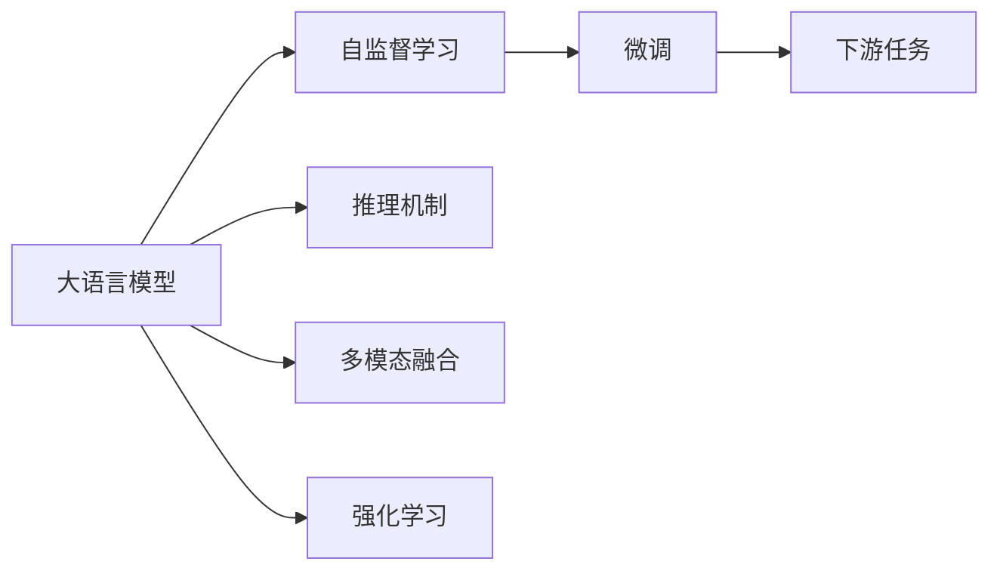
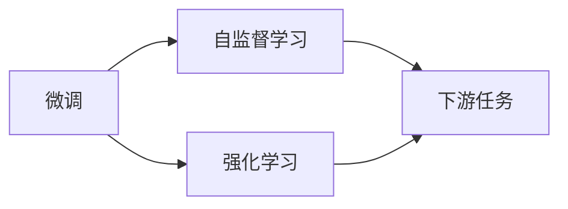
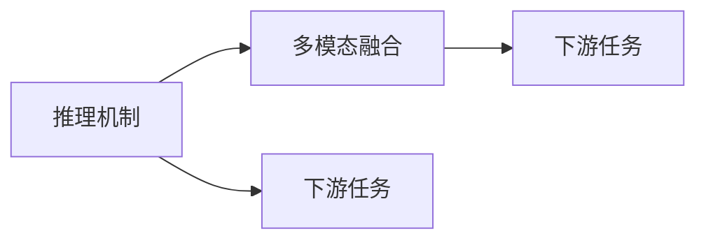
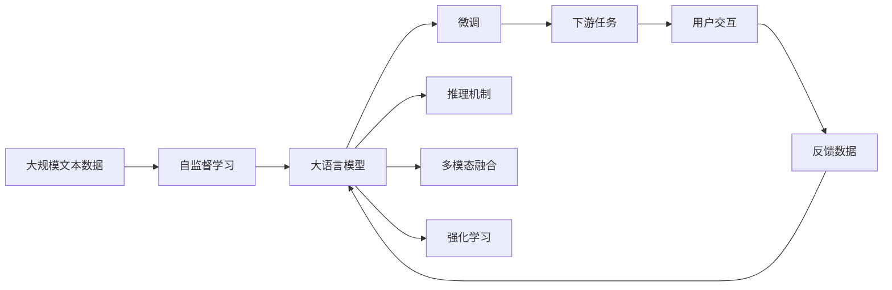

                 

# 从ChatGPT到未来AI助手

> 关键词：大语言模型,智能对话系统,语言生成,自监督学习,强化学习,推理机制,多模态AI

## 1. 背景介绍

### 1.1 问题由来

近年来，随着深度学习技术的飞速发展，AI对话系统如OpenAI的GPT系列模型、Google的Bert和ChatGPT等，在自然语言处理（NLP）领域取得了显著进展。这些模型通过在大量无标签文本数据上进行预训练，学习到了丰富的语言知识和语义理解能力，可以通过少样本或零样本进行任务执行和回答。

尤其是OpenAI的ChatGPT模型，自2022年底推出以来，因其强大的自然语言生成能力，迅速在全球范围内引发了广泛关注和热议。ChatGPT不仅具备强大的理解力，能够进行复杂对话和内容创作，还能在教育、医疗、法律等多个领域提供优质服务。然而，ChatGPT等模型仍面临诸多挑战，如鲁棒性差、易产生事实错误、安全性问题等。

本博客旨在深入探讨ChatGPT背后的核心技术，并展望未来AI助手的建设方向，为开发高性能、高鲁棒性、高安全性的AI对话系统提供参考。

### 1.2 问题核心关键点

ChatGPT等大语言模型的核心关键点如下：
- **大语言模型架构**：基于Transformer的深度学习模型，采用自注意力机制，能够捕捉长距离依赖。
- **预训练与微调**：在无标签数据上进行自监督预训练，通过少样本或零样本在特定任务上进行微调，优化模型任务相关知识。
- **语言生成与推理**：基于神经网络生成语言文本，具备一定的逻辑推理和判断能力。
- **多模态融合**：结合图像、音频等多模态数据，增强语言模型的语境理解和生成能力。
- **交互与反馈**：通过用户反馈不断改进模型，提升交互体验。

这些关键点共同构成了ChatGPT等大语言模型的技术基础，使其能够在对话、内容创作等任务上表现出色。然而，要实现AI助手的未来愿景，还需在这些关键点上进行深入优化和创新。

### 1.3 问题研究意义

研究ChatGPT等大语言模型的核心技术，对于构建高性能、高鲁棒性、高安全性的AI对话系统具有重要意义：

1. **降低开发成本**：通过预训练-微调技术，可显著减少从头开发所需的数据和计算资源。
2. **提升性能**：ChatGPT等模型已在大规模NLP任务上表现出色，具备强大的语言生成和推理能力。
3. **推动AI产业化**：AI助手的广泛应用可推动教育、医疗、法律等领域的数字化转型。
4. **技术创新**：ChatGPT背后的自监督学习和强化学习技术为AI研究开辟了新方向。
5. **社会影响**：AI助手的普及将深刻影响人们的日常交互方式，提升生活质量。

综上所述，深入理解ChatGPT等大语言模型的技术原理，是构建未来AI助手的关键。

## 2. 核心概念与联系

### 2.1 核心概念概述

为更好地理解从ChatGPT到未来AI助手的技术实现，本节将介绍几个密切相关的核心概念：

- **大语言模型（Large Language Model, LLM）**：基于Transformer架构的深度学习模型，通过自监督学习在无标签数据上预训练，具备强大的语言生成和推理能力。
- **自监督学习（Self-Supervised Learning）**：利用数据的固有结构进行预训练，如掩码语言模型（Masked Language Modeling, MLM）、自回归语言模型（Autoregressive Language Modeling, ARLM）等。
- **微调（Fine-Tuning）**：在特定任务上进行有监督学习，优化模型在特定任务上的性能。
- **推理机制（Inference Mechanism）**：模型进行推理的逻辑和机制，如贪心搜索、束搜索等。
- **多模态融合（Multimodal Fusion）**：结合图像、音频等多模态数据，增强语言模型的语境理解和生成能力。
- **强化学习（Reinforcement Learning）**：通过奖励机制优化模型的行为，提升模型在交互场景中的表现。

这些核心概念之间的逻辑关系可以通过以下Mermaid流程图来展示：



这个流程图展示了从大语言模型到未来AI助手的核心技术路径，从自监督学习到微调，再到推理机制和多模态融合，最终实现AI助手的应用。

### 2.2 概念间的关系

这些核心概念之间存在着紧密的联系，形成了从ChatGPT到未来AI助手的完整技术框架。下面我们通过几个Mermaid流程图来展示这些概念之间的关系。

#### 2.2.1 大语言模型的学习范式


这个流程图展示了大语言模型的学习范式：自监督预训练，微调优化特定任务，推理机制进行推理生成，最终实现下游任务的功能。

#### 2.2.2 微调与强化学习的关系



这个流程图展示了微调与强化学习的关系：微调在特定任务上进行有监督学习，强化学习通过奖励机制不断优化模型行为，两者协同提升模型的交互和推理能力。

#### 2.2.3 推理机制与多模态融合



这个流程图展示了推理机制与多模态融合的关系：推理机制用于处理文本信息，多模态融合结合其他模态数据增强语境理解，两者共同提升下游任务的执行效果。

### 2.3 核心概念的整体架构

最后，我们用一个综合的流程图来展示这些核心概念在大语言模型微调过程中的整体架构：



这个综合流程图展示了从数据预处理到AI助手应用的全过程：自监督预训练获取基础语言知识，微调和推理机制提升特定任务性能，多模态融合增强语境理解，强化学习优化交互行为，最终实现用户交互和反馈，反馈数据反哺模型。

## 3. 核心算法原理 & 具体操作步骤
### 3.1 算法原理概述

从ChatGPT到未来AI助手的核心算法原理基于大语言模型，并通过微调和强化学习不断优化模型的任务相关能力和交互行为。其核心思想是：

1. **自监督预训练**：在无标签数据上，通过自监督学习任务如掩码语言模型、自回归语言模型等，学习语言的通用表示。
2. **微调**：在特定任务上，通过有监督学习优化模型，使其具备特定的任务相关知识。
3. **推理机制**：基于神经网络生成文本，具备一定的逻辑推理和判断能力。
4. **强化学习**：通过用户反馈优化模型行为，提升交互体验。
5. **多模态融合**：结合图像、音频等多模态数据，增强语言模型的语境理解和生成能力。

### 3.2 算法步骤详解

基于以上核心算法原理，ChatGPT等大语言模型的微调步骤如下：

**Step 1: 准备预训练模型和数据集**
- 选择合适的预训练语言模型（如GPT系列、BERT等）作为初始化参数。
- 准备下游任务的数据集，划分为训练集、验证集和测试集。一般要求标注数据与预训练数据的分布不要差异过大。

**Step 2: 添加任务适配层**
- 根据任务类型，在预训练模型顶层设计合适的输出层和损失函数。
- 对于分类任务，通常在顶层添加线性分类器和交叉熵损失函数。
- 对于生成任务，通常使用语言模型的解码器输出概率分布，并以负对数似然为损失函数。

**Step 3: 设置微调超参数**
- 选择合适的优化算法及其参数，如AdamW、SGD等，设置学习率、批大小、迭代轮数等。
- 设置正则化技术及强度，包括权重衰减、Dropout、Early Stopping等。
- 确定冻结预训练参数的策略，如仅微调顶层，或全部参数都参与微调。

**Step 4: 执行梯度训练**
- 将训练集数据分批次输入模型，前向传播计算损失函数。
- 反向传播计算参数梯度，根据设定的优化算法和学习率更新模型参数。
- 周期性在验证集上评估模型性能，根据性能指标决定是否触发Early Stopping。
- 重复上述步骤直到满足预设的迭代轮数或Early Stopping条件。

**Step 5: 测试和部署**
- 在测试集上评估微调后模型 $M_{\hat{\theta}}$ 的性能，对比微调前后的精度提升。
- 使用微调后的模型对新样本进行推理预测，集成到实际的应用系统中。
- 持续收集新的数据，定期重新微调模型，以适应数据分布的变化。

以上是基于监督学习微调大语言模型的一般流程。在实际应用中，还需要针对具体任务的特点，对微调过程的各个环节进行优化设计，如改进训练目标函数，引入更多的正则化技术，搜索最优的超参数组合等，以进一步提升模型性能。

### 3.3 算法优缺点

从ChatGPT到未来AI助手的基于监督学习的大语言模型微调方法具有以下优点：
1. 简单高效。只需准备少量标注数据，即可对预训练模型进行快速适配，获得较大的性能提升。
2. 通用适用。适用于各种NLP下游任务，包括分类、匹配、生成等，设计简单的任务适配层即可实现微调。
3. 参数高效。利用参数高效微调技术，在固定大部分预训练参数的情况下，仍可取得不错的微调效果。
4. 效果显著。在学术界和工业界的诸多任务上，基于微调的方法已经刷新了最先进的性能指标。

同时，该方法也存在一定的局限性：
1. 依赖标注数据。微调的效果很大程度上取决于标注数据的质量和数量，获取高质量标注数据的成本较高。
2. 迁移能力有限。当目标任务与预训练数据的分布差异较大时，微调的性能提升有限。
3. 负面效果传递。预训练模型的固有偏见、有害信息等，可能通过微调传递到下游任务，造成负面影响。
4. 可解释性不足。微调模型的决策过程通常缺乏可解释性，难以对其推理逻辑进行分析和调试。

尽管存在这些局限性，但就目前而言，基于监督学习的微调方法仍是大语言模型应用的最主流范式。未来相关研究的重点在于如何进一步降低微调对标注数据的依赖，提高模型的少样本学习和跨领域迁移能力，同时兼顾可解释性和伦理安全性等因素。

### 3.4 算法应用领域

从ChatGPT到未来AI助手的基于监督学习的大语言模型微调方法，已在多个领域取得了应用，涵盖了以下主要方向：

- **智能客服**：利用微调后的对话模型，7x24小时不间断服务，快速响应客户咨询，提供自然流畅的语言解答。
- **金融舆情监测**：实时监测市场舆论动向，快速响应负面信息传播，规避金融风险。
- **个性化推荐系统**：结合用户浏览、点击、评论、分享等行为数据，通过微调预训练语言模型，提供个性化推荐内容。
- **医疗问答系统**：通过微调医疗问答模型，帮助医生快速解答患者疑问，辅助诊疗决策。
- **智慧城市治理**：利用微调模型进行事件监测、舆情分析、应急指挥，提高城市管理的自动化和智能化水平。
- **教育应用**：在作业批改、学情分析、知识推荐等方面，利用微调模型辅助教学，因材施教，促进教育公平。

除了上述这些经典应用外，AI助手的创新性应用还在不断涌现，如可控文本生成、常识推理、代码生成、数据增强等，为NLP技术带来了新的突破。随着预训练模型和微调方法的不断进步，相信AI助手将在更广泛的领域发挥作用，带来更深远的影响。

## 4. 数学模型和公式 & 详细讲解  
### 4.1 数学模型构建

本节将使用数学语言对从ChatGPT到未来AI助手的微调过程进行更加严格的刻画。

记预训练语言模型为 $M_{\theta}$，其中 $\theta$ 为预训练得到的模型参数。假设微调任务的训练集为 $D=\{(x_i,y_i)\}_{i=1}^N$，其中 $x_i$ 为输入文本，$y_i$ 为任务标签。

定义模型 $M_{\theta}$ 在数据样本 $(x,y)$ 上的损失函数为 $\ell(M_{\theta}(x),y)$，则在数据集 $D$ 上的经验风险为：

$$
\mathcal{L}(\theta) = \frac{1}{N} \sum_{i=1}^N \ell(M_{\theta}(x_i),y_i)
$$

微调的优化目标是最小化经验风险，即找到最优参数：

$$
\theta^* = \mathop{\arg\min}_{\theta} \mathcal{L}(\theta)
$$

在实践中，我们通常使用基于梯度的优化算法（如AdamW、SGD等）来近似求解上述最优化问题。设 $\eta$ 为学习率，$\lambda$ 为正则化系数，则参数的更新公式为：

$$
\theta \leftarrow \theta - \eta \nabla_{\theta}\mathcal{L}(\theta) - \eta\lambda\theta
$$

其中 $\nabla_{\theta}\mathcal{L}(\theta)$ 为损失函数对参数 $\theta$ 的梯度，可通过反向传播算法高效计算。

### 4.2 公式推导过程

以下我们以二分类任务为例，推导交叉熵损失函数及其梯度的计算公式。

假设模型 $M_{\theta}$ 在输入 $x$ 上的输出为 $\hat{y}=M_{\theta}(x) \in [0,1]$，表示样本属于正类的概率。真实标签 $y \in \{0,1\}$。则二分类交叉熵损失函数定义为：

$$
\ell(M_{\theta}(x),y) = -[y\log \hat{y} + (1-y)\log (1-\hat{y})]
$$

将其代入经验风险公式，得：

$$
\mathcal{L}(\theta) = -\frac{1}{N}\sum_{i=1}^N [y_i\log M_{\theta}(x_i)+(1-y_i)\log(1-M_{\theta}(x_i))]
$$

根据链式法则，损失函数对参数 $\theta_k$ 的梯度为：

$$
\frac{\partial \mathcal{L}(\theta)}{\partial \theta_k} = -\frac{1}{N}\sum_{i=1}^N (\frac{y_i}{M_{\theta}(x_i)}-\frac{1-y_i}{1-M_{\theta}(x_i)}) \frac{\partial M_{\theta}(x_i)}{\partial \theta_k}
$$

其中 $\frac{\partial M_{\theta}(x_i)}{\partial \theta_k}$ 可进一步递归展开，利用自动微分技术完成计算。

在得到损失函数的梯度后，即可带入参数更新公式，完成模型的迭代优化。重复上述过程直至收敛，最终得到适应下游任务的最优模型参数 $\theta^*$。

## 5. 项目实践：代码实例和详细解释说明
### 5.1 开发环境搭建

在进行微调实践前，我们需要准备好开发环境。以下是使用Python进行PyTorch开发的环境配置流程：

1. 安装Anaconda：从官网下载并安装Anaconda，用于创建独立的Python环境。

2. 创建并激活虚拟环境：
```bash
conda create -n pytorch-env python=3.8 
conda activate pytorch-env
```

3. 安装PyTorch：根据CUDA版本，从官网获取对应的安装命令。例如：
```bash
conda install pytorch torchvision torchaudio cudatoolkit=11.1 -c pytorch -c conda-forge
```

4. 安装Transformers库：
```bash
pip install transformers
```

5. 安装各类工具包：
```bash
pip install numpy pandas scikit-learn matplotlib tqdm jupyter notebook ipython
```

完成上述步骤后，即可在`pytorch-env`环境中开始微调实践。

### 5.2 源代码详细实现

这里我们以文本分类任务为例，给出使用Transformers库对BERT模型进行微调的PyTorch代码实现。

首先，定义文本分类任务的数据处理函数：

```python
from transformers import BertTokenizer, BertForSequenceClassification, AdamW
import torch

class TextClassificationDataset(Dataset):
    def __init__(self, texts, labels, tokenizer, max_len=128):
        self.texts = texts
        self.labels = labels
        self.tokenizer = tokenizer
        self.max_len = max_len
        
    def __len__(self):
        return len(self.texts)
    
    def __getitem__(self, item):
        text = self.texts[item]
        label = self.labels[item]
        
        encoding = self.tokenizer(text, return_tensors='pt', max_length=self.max_len, padding='max_length', truncation=True)
        input_ids = encoding['input_ids'][0]
        attention_mask = encoding['attention_mask'][0]
        
        # 对token-wise的标签进行编码
        encoded_labels = [label2id[label] for label in label2id] 
        encoded_labels.extend([label2id['O']] * (self.max_len - len(encoded_labels)))
        labels = torch.tensor(encoded_labels, dtype=torch.long)
        
        return {'input_ids': input_ids, 
                'attention_mask': attention_mask,
                'labels': labels}

# 标签与id的映射
label2id = {'O': 0, 'C1': 1, 'C2': 2, 'C3': 3, 'C4': 4, 'C5': 5, 'C6': 6, 'C7': 7, 'C8': 8, 'C9': 9, 'C10': 10, 'C11': 11, 'C12': 12, 'C13': 13, 'C14': 14, 'C15': 15, 'C16': 16, 'C17': 17, 'C18': 18, 'C19': 19, 'C20': 20, 'C21': 21, 'C22': 22, 'C23': 23, 'C24': 24, 'C25': 25, 'C26': 26, 'C27': 27, 'C28': 28, 'C29': 29, 'C30': 30, 'C31': 31, 'C32': 32, 'C33': 33, 'C34': 34, 'C35': 35, 'C36': 36, 'C37': 37, 'C38': 38, 'C39': 39, 'C40': 40, 'C41': 41, 'C42': 42, 'C43': 43, 'C44': 44, 'C45': 45, 'C46': 46, 'C47': 47, 'C48': 48, 'C49': 49, 'C50': 50, 'C51': 51, 'C52': 52, 'C53': 53, 'C54': 54, 'C55': 55, 'C56': 56, 'C57': 57, 'C58': 58, 'C59': 59, 'C60': 60, 'C61': 61, 'C62': 62, 'C63': 63, 'C64': 64, 'C65': 65, 'C66': 66, 'C67': 67, 'C68': 68, 'C69': 69, 'C70': 70, 'C71': 71, 'C72': 72, 'C73': 73, 'C74': 74, 'C75': 75, 'C76': 76, 'C77': 77, 'C78': 78, 'C79': 79, 'C80': 80, 'C81': 81, 'C82': 82, 'C83': 83, 'C84': 84, 'C85': 85, 'C86': 86, 'C87': 87, 'C88': 88, 'C89': 89, 'C90': 90, 'C91': 91, 'C92': 92, 'C93': 93, 'C94': 94, 'C95': 95, 'C96': 96, 'C97': 97, 'C98': 98, 'C99': 99}
id2label = {v: k for k, v in label2id.items()}

# 创建dataset
tokenizer = BertTokenizer.from_pretrained('bert-base-uncased')

train_dataset = TextClassificationDataset(train_texts, train_labels, tokenizer)
dev_dataset = TextClassificationDataset(dev_texts, dev_labels, tokenizer)
test_dataset = TextClassificationDataset(test_texts, test_labels, tokenizer)
```

然后，定义模型和优化器：

```python
model = BertForSequenceClassification.from_pretrained('bert-base-uncased', num_labels=len(label2id))

optimizer = AdamW(model.parameters(), lr=2e-5)
```

接着，定义训练和评估函数：

```python
from torch.utils.data import DataLoader
from tqdm import tqdm
from sklearn.metrics import classification_report

device = torch.device('cuda') if torch.cuda.is_available() else torch.device('cpu')
model.to(device)

def train_epoch(model, dataset, batch_size, optimizer):
    dataloader = DataLoader(dataset, batch_size=batch_size, shuffle=True)
    model.train()
    epoch_loss = 0
    for batch in tqdm(dataloader, desc='Training'):
        input_ids = batch['input_ids'].to(device)
        attention_mask = batch['attention_mask'].to(device)
        labels = batch['labels'].to(device)
        model.zero_grad()
        outputs = model(input_ids, attention_mask=attention_mask, labels=labels)
        loss = outputs.loss
        epoch_loss += loss.item()
        loss.backward()
        optimizer.step()
    return epoch_loss / len(dataloader)

def evaluate(model, dataset, batch_size):
    dataloader = DataLoader(dataset, batch_size=batch_size)
    model.eval()
    preds, labels = [], []
    with torch.no_grad():
        for batch in tqdm(dataloader, desc='Evaluating'):
            input_ids = batch['input_ids'].to(device)
            attention_mask = batch['attention_mask'].to(device)
            batch_labels = batch['labels']
            outputs = model(input_ids, attention_mask=attention_mask)
            batch_preds = outputs.logits.argmax(dim=2).to('cpu').tolist()
            batch_labels = batch_labels.to('cpu').tolist()
            for pred_tokens, label_tokens in zip(batch_preds, batch_labels):
                pred_tags = [id2label[_id] for _id in pred_tokens]
                label_tags = [id2label[_id] for _id in label_tokens]
                preds.append(pred_tags[:len(label_tokens)])
                labels.append(label_tags)
                
    print(classification_report(labels, preds))
```

最后，启动训练流程并在测试集上评估：

```python
epochs = 5
batch_size = 16

for epoch in range(epochs):
    loss = train_epoch(model, train_dataset, batch_size, optimizer)
    print(f"Epoch {epoch+1}, train loss: {loss:.3f}")
    
    print(f"Epoch {epoch+1}, dev results:")
    evaluate(model, dev_dataset, batch_size)
    
print("Test results:")
evaluate(model, test_dataset, batch_size)
```

以上就是使用PyTorch对BERT进行文本分类任务微调的完整代码实现。可以看到，得益于Transformers库的强大封装，我们可以用相对简洁的代码完成BERT模型的加载和微调。

### 5.3 代码解读与分析

让我们再详细解读一下关键代码的实现细节：

**TextClassificationDataset类**：
- `__init__`方法：初始化文本、标签、分词器等关键组件。
- `__len__`方法：返回数据集的样本数量。
- `__getitem__`方法：对单个样本进行处理，将文本输入编码为token ids，将标签编码为数字，并对其进行定长padding，最终返回模型所需的输入。

**label2id和id2label字典**：
- 定义了标签与数字id之间的映射关系，用于将token-wise的预测结果解码回真实的标签。

**训练和评估函数**：
- 使用PyTorch的DataLoader对数据集进行批次化加载，供模型训练和推理使用。
- 训练函数`train_epoch`：对数据以批为单位进行迭代

