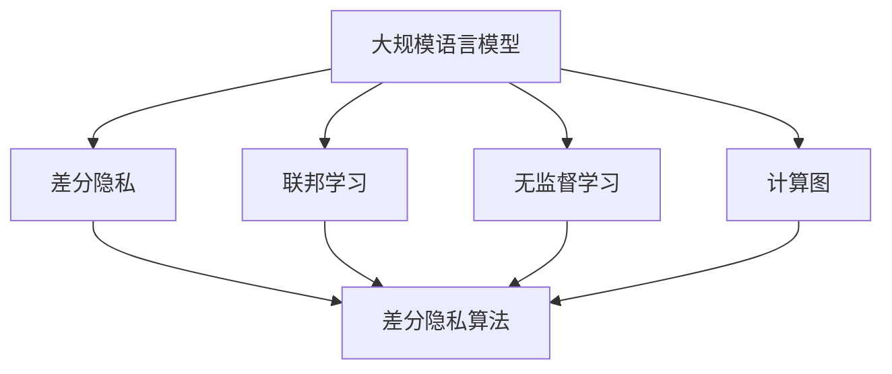
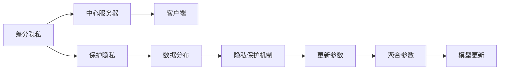
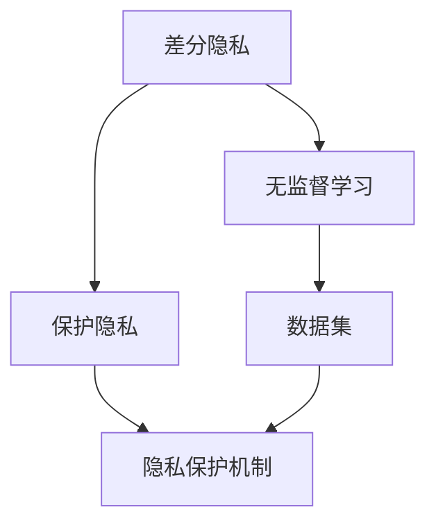
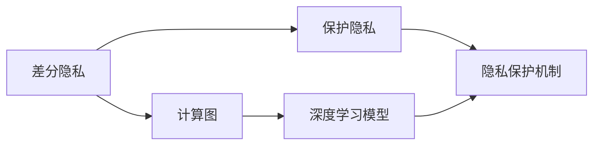
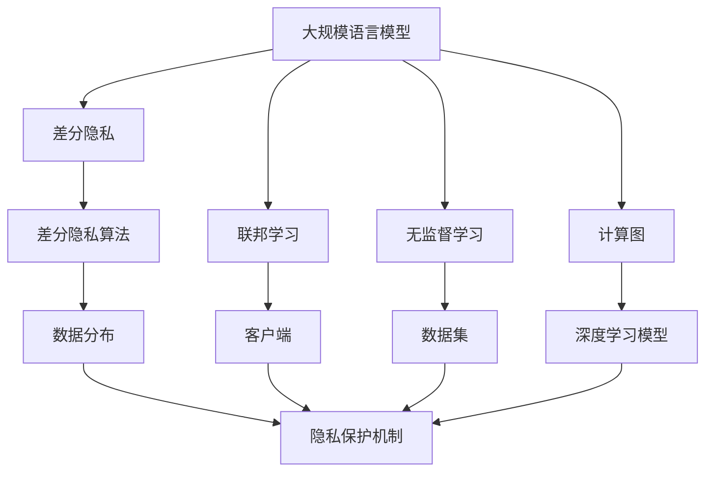

                 

# 大规模语言模型从理论到实践 隐私消除

> 关键词：大规模语言模型,隐私消除,差分隐私,联邦学习,无监督学习,隐私保护,计算图,差分隐私算法

## 1. 背景介绍

### 1.1 问题由来

近年来，随着深度学习技术的快速发展，大规模语言模型在自然语言处理(NLP)领域取得了巨大的突破。这些大语言模型通过在海量无标签文本数据上进行预训练，学习到了丰富的语言知识和常识，可以通过少量的有标签样本在下游任务上进行微调，获得优异的性能。然而，这些大模型的训练过程中，涉及到大量的个人隐私数据，如何在保证隐私的前提下，进行模型训练和优化，成为一个亟待解决的问题。

### 1.2 问题核心关键点

大规模语言模型在训练过程中需要大量个人隐私数据，如何在保护隐私的前提下进行模型训练，成为当前研究的热点问题。目前，主要的方法包括差分隐私、联邦学习、无监督学习等，其中差分隐私在保护隐私的同时，还能保证模型性能。

差分隐私是一种数学框架，旨在保护数据集中的个体隐私，使得在查询统计结果时，无法区分数据集中是否包含某个个体。差分隐私方法通常通过添加噪声、约束查询次数等手段，使得统计结果的精度略有下降，但个体隐私得到了最大程度的保护。

联邦学习是一种分布式机器学习方法，通过将数据分散存储在不同节点上，各节点仅更新本地模型参数，将参数更新结果发送给中心服务器，中心服务器通过聚合更新参数。这种方法可以在不共享原始数据的情况下，进行模型训练和优化。

无监督学习是一种无需标签数据的机器学习方法，通过挖掘数据的内在结构和规律，进行特征学习和模型训练。在隐私保护的背景下，无监督学习可以避免使用标注数据，从而保护隐私。

这些方法各有优缺点，适用于不同的应用场景。本文将详细介绍差分隐私和联邦学习的核心原理和具体操作步骤，并通过具体的代码实例，展示如何在实践中应用这些方法。

### 1.3 问题研究意义

保护隐私是大规模语言模型训练中的重要课题，涉及数据隐私、用户隐私等多个方面。隐私保护的缺失，不仅会带来法律风险，还会导致社会信任危机。因此，如何在保护隐私的前提下，进行大规模语言模型的训练和优化，具有重要的理论意义和实际价值。

1. 保护用户隐私：大规模语言模型训练涉及大量的个人信息，如聊天记录、社交媒体等，如果这些信息被滥用，将会对用户隐私造成严重影响。
2. 增强模型鲁棒性：通过差分隐私等隐私保护方法，可以使得模型对噪声更加鲁棒，从而提升模型的泛化性能。
3. 推动工业应用：隐私保护技术的成熟，可以使得大规模语言模型在更多行业和领域中得到应用，如金融、医疗、政府等。
4. 促进科研进展：隐私保护技术的应用，可以推动机器学习、人工智能领域的理论研究和技术突破。

## 2. 核心概念与联系

### 2.1 核心概念概述

为更好地理解差分隐私和联邦学习的隐私保护方法，本节将介绍几个密切相关的核心概念：

- 差分隐私（Differential Privacy）：一种数学框架，用于保护数据集中的个体隐私，使得在查询统计结果时，无法区分数据集中是否包含某个个体。
- 联邦学习（Federated Learning）：一种分布式机器学习方法，通过将数据分散存储在不同节点上，各节点仅更新本地模型参数，将参数更新结果发送给中心服务器，中心服务器通过聚合更新参数。
- 无监督学习（Unsupervised Learning）：一种无需标签数据的机器学习方法，通过挖掘数据的内在结构和规律，进行特征学习和模型训练。
- 计算图（Computation Graph）：一种用于表示计算过程的图形结构，常用于深度学习模型的实现和优化。
- 差分隐私算法：基于差分隐私理论，设计具体实现隐私保护的方法，如Laplace机制、Gaussian机制等。

这些核心概念之间的逻辑关系可以通过以下Mermaid流程图来展示：



这个流程图展示了大规模语言模型与差分隐私、联邦学习、无监督学习等隐私保护方法的关系：

1. 大规模语言模型通过差分隐私、联邦学习等方法，保护隐私数据，进行模型训练和优化。
2. 差分隐私算法具体实现隐私保护技术。
3. 计算图用于深度学习模型的实现和优化。
4. 无监督学习在保护隐私的情况下，进行模型训练和特征学习。

这些概念共同构成了大规模语言模型隐私保护的完整生态系统，使其能够在各种场景下保护用户隐私，同时保持模型的性能。

### 2.2 概念间的关系

这些核心概念之间存在着紧密的联系，形成了大规模语言模型隐私保护的完整生态系统。下面我通过几个Mermaid流程图来展示这些概念之间的关系。

#### 2.2.1 差分隐私与联邦学习的联系



这个流程图展示了差分隐私与联邦学习的基本原理，以及它们之间的联系：

1. 差分隐私通过添加噪声、约束查询次数等手段，保护数据集中的个体隐私。
2. 联邦学习将数据分散存储在不同节点上，各节点仅更新本地模型参数，将参数更新结果发送给中心服务器。
3. 中心服务器通过聚合更新参数，进行模型训练和优化。
4. 差分隐私在隐私保护机制中加入噪声，保护各节点数据隐私。
5. 更新参数和聚合参数过程中，差分隐私机制始终保证隐私保护。

#### 2.2.2 差分隐私与无监督学习的联系



这个流程图展示了差分隐私与无监督学习的基本原理，以及它们之间的联系：

1. 差分隐私通过添加噪声、约束查询次数等手段，保护数据集中的个体隐私。
2. 无监督学习无需标签数据，通过挖掘数据的内在结构和规律，进行特征学习和模型训练。
3. 数据集通过差分隐私机制进行隐私保护。
4. 无监督学习在数据集上，进行特征学习和模型训练，无需标签数据。
5. 差分隐私在隐私保护机制中加入噪声，保护数据集隐私。

#### 2.2.3 差分隐私与计算图的联系



这个流程图展示了差分隐私与计算图的基本原理，以及它们之间的联系：

1. 差分隐私通过添加噪声、约束查询次数等手段，保护数据集中的个体隐私。
2. 计算图用于表示深度学习模型的计算过程。
3. 深度学习模型通过计算图进行前向传播和反向传播，实现模型训练和优化。
4. 差分隐私在隐私保护机制中加入噪声，保护数据集隐私。
5. 深度学习模型在计算图中，进行前向传播和反向传播，实现模型训练和优化。

### 2.3 核心概念的整体架构

最后，我们用一个综合的流程图来展示这些核心概念在大规模语言模型隐私保护中的整体架构：



这个综合流程图展示了从差分隐私到联邦学习，再到无监督学习的完整过程。大规模语言模型首先通过差分隐私和计算图，进行隐私保护，然后通过联邦学习、无监督学习等方法，进行模型训练和优化。在计算图中，差分隐私机制始终保证隐私保护。在联邦学习和无监督学习中，隐私保护机制根据具体方法的不同，有所差异。

## 3. 核心算法原理 & 具体操作步骤
### 3.1 算法原理概述

差分隐私和联邦学习是大规模语言模型隐私保护的核心算法，其原理和具体操作步骤如下：

#### 3.1.1 差分隐私原理

差分隐私是一种保护数据集隐私的数学框架。假设有一个数据集 $D$，包含 $n$ 个样本，每个样本 $x_i$ 包含 $d$ 个特征。差分隐私通过添加噪声、约束查询次数等手段，使得在查询统计结果时，无法区分数据集中是否包含某个个体。

具体而言，差分隐私定义一个函数 $\mathcal{F}(D)$，用于对数据集 $D$ 进行查询，得到查询结果 $y$。为了保证隐私保护，差分隐私在查询函数中加入噪声 $\epsilon$，使得查询结果 $y'$ 的输出概率 $\Pr(y'=y|\mathcal{F}(D))$ 与查询函数 $\mathcal{F}(D)$ 的输出概率 $\Pr(y|\mathcal{F}(D))$ 相近，但无法区分两个数据集。数学上，差分隐私可以表示为：

$$
\Pr(y'=y|\mathcal{F}(D)) \leq e^{\epsilon} \cdot \Pr(y|\mathcal{F}(D))
$$

其中，$\epsilon$ 表示隐私保护参数，用于控制隐私保护的强度。$\epsilon$ 越大，隐私保护越弱，但模型性能越好。

差分隐私常用的实现方法包括Laplace机制、Gaussian机制等。Laplace机制通过在输出结果中添加一个Laplace噪声，保护数据集隐私。Gaussian机制通过在输出结果中添加一个Gaussian噪声，保护数据集隐私。

#### 3.1.2 联邦学习原理

联邦学习是一种分布式机器学习方法，通过将数据分散存储在不同节点上，各节点仅更新本地模型参数，将参数更新结果发送给中心服务器，中心服务器通过聚合更新参数。

假设有一个中心服务器 $C$ 和 $m$ 个客户端 $N_1, N_2, \ldots, N_m$，每个客户端 $N_i$ 包含 $n_i$ 个样本 $x_{i,j}$，其中 $j \in [1, n_i]$。联邦学习通过以下步骤进行模型训练：

1. 中心服务器 $C$ 发送初始化模型参数 $\theta_0$ 给每个客户端 $N_i$。
2. 每个客户端 $N_i$ 在自己的本地数据 $D_i$ 上，使用训练数据 $x_{i,j}$ 进行前向传播，计算梯度 $g_{i,j}$，更新本地模型参数 $\theta_i$。
3. 每个客户端 $N_i$ 将更新后的参数 $\theta_i$ 发送给中心服务器 $C$。
4. 中心服务器 $C$ 通过聚合所有客户端发送的参数 $\theta_i$，计算全局模型参数 $\theta_{new}$。
5. 中心服务器 $C$ 将全局模型参数 $\theta_{new}$ 发送给每个客户端 $N_i$，进行下一轮训练。

#### 3.1.3 无监督学习原理

无监督学习是一种无需标签数据的机器学习方法，通过挖掘数据的内在结构和规律，进行特征学习和模型训练。

假设有一个数据集 $D$，包含 $n$ 个样本 $x_1, x_2, \ldots, x_n$，每个样本 $x_i$ 包含 $d$ 个特征。无监督学习通过以下步骤进行模型训练：

1. 数据集 $D$ 通过差分隐私机制进行隐私保护。
2. 无监督学习算法对数据集 $D$ 进行特征提取，得到特征向量 $z_1, z_2, \ldots, z_n$。
3. 无监督学习算法对特征向量 $z_1, z_2, \ldots, z_n$ 进行模型训练，得到模型参数 $\theta$。
4. 模型参数 $\theta$ 用于对新数据进行预测和推理。

### 3.2 算法步骤详解

#### 3.2.1 差分隐私步骤详解

差分隐私的具体操作步骤如下：

1. 数据预处理：对原始数据进行清洗、归一化等预处理，得到处理后的数据集 $D$。
2. 隐私保护机制选择：根据具体应用场景和需求，选择Laplace机制、Gaussian机制等隐私保护机制。
3. 差分隐私算法实现：在差分隐私算法中，通过添加噪声、约束查询次数等手段，保证隐私保护。
4. 查询统计结果：使用差分隐私算法进行查询统计，得到统计结果 $y'$。
5. 隐私保护评估：评估差分隐私算法的隐私保护效果，检查是否满足隐私保护要求。

#### 3.2.2 联邦学习步骤详解

联邦学习的具体操作步骤如下：

1. 数据预处理：对原始数据进行清洗、归一化等预处理，得到处理后的数据集 $D_i$。
2. 初始化模型参数：将中心服务器 $C$ 的初始化模型参数 $\theta_0$ 发送给每个客户端 $N_i$。
3. 本地模型训练：每个客户端 $N_i$ 在自己的本地数据 $D_i$ 上，使用训练数据 $x_{i,j}$ 进行前向传播，计算梯度 $g_{i,j}$，更新本地模型参数 $\theta_i$。
4. 参数聚合：中心服务器 $C$ 通过聚合所有客户端发送的参数 $\theta_i$，计算全局模型参数 $\theta_{new}$。
5. 模型更新：中心服务器 $C$ 将全局模型参数 $\theta_{new}$ 发送给每个客户端 $N_i$，进行下一轮训练。
6. 隐私保护评估：评估联邦学习算法的隐私保护效果，检查是否满足隐私保护要求。

#### 3.2.3 无监督学习步骤详解

无监督学习的具体操作步骤如下：

1. 数据预处理：对原始数据进行清洗、归一化等预处理，得到处理后的数据集 $D$。
2. 隐私保护机制选择：根据具体应用场景和需求，选择差分隐私机制进行隐私保护。
3. 无监督学习算法实现：在无监督学习算法中，对数据集 $D$ 进行特征提取，得到特征向量 $z_1, z_2, \ldots, z_n$。
4. 模型训练：对特征向量 $z_1, z_2, \ldots, z_n$ 进行模型训练，得到模型参数 $\theta$。
5. 模型评估：评估无监督学习算法的模型性能，检查是否满足应用需求。

### 3.3 算法优缺点

差分隐私和联邦学习是大规模语言模型隐私保护的主要方法，其优缺点如下：

#### 差分隐私的优缺点

优点：
1. 保护隐私：差分隐私通过添加噪声、约束查询次数等手段，保护数据集中的个体隐私。
2. 模型性能：差分隐私可以在保护隐私的同时，保证模型性能。

缺点：
1. 噪声引入：差分隐私需要引入噪声，可能影响模型性能。
2. 参数选择：差分隐私参数 $\epsilon$ 需要根据具体应用场景进行合理选择，难以控制隐私保护强度。

#### 联邦学习的优缺点

优点：
1. 分布式训练：联邦学习可以在不共享原始数据的情况下，进行模型训练和优化。
2. 隐私保护：联邦学习保护客户端数据隐私。

缺点：
1. 通信开销：联邦学习需要频繁通信，增加了通信开销。
2. 模型一致性：中心服务器需要解决模型一致性问题，防止模型漂移。

#### 无监督学习的优缺点

优点：
1. 无需标签：无监督学习无需标签数据，保护隐私。
2. 模型自适应：无监督学习可以适应数据分布的变化，提高模型的泛化性能。

缺点：
1. 特征提取：无监督学习需要合理的特征提取算法，难以自动发现重要特征。
2. 模型复杂：无监督学习模型复杂，难以解释模型的内部工作机制。

### 3.4 算法应用领域

差分隐私和联邦学习在大规模语言模型隐私保护中，有广泛的应用场景，包括：

1. 自然语言处理（NLP）：差分隐私和联邦学习可以应用于语音识别、文本分类、情感分析等NLP任务。
2. 金融行业：差分隐私和联邦学习可以应用于信用评分、欺诈检测等金融任务。
3. 医疗行业：差分隐私和联邦学习可以应用于病历分析、药物研发等医疗任务。
4. 政府部门：差分隐私和联邦学习可以应用于公共数据保护、隐私查询等政府任务。
5. 电子商务：差分隐私和联邦学习可以应用于个性化推荐、广告投放等电子商务任务。

这些应用场景展示了差分隐私和联邦学习的广泛应用，未来还有更多领域将受益于这些技术。

## 4. 数学模型和公式 & 详细讲解 & 举例说明

### 4.1 数学模型构建

差分隐私和联邦学习在大规模语言模型隐私保护中，涉及到复杂的数学模型和公式。以下是差分隐私和联邦学习的数学模型构建：

#### 4.1.1 差分隐私数学模型

差分隐私数学模型如下：

假设有一个数据集 $D$，包含 $n$ 个样本 $x_1, x_2, \ldots, x_n$，每个样本 $x_i$ 包含 $d$ 个特征。差分隐私通过在查询结果 $y'$ 中添加噪声 $\epsilon$，保护数据集隐私。差分隐私的数学模型如下：

$$
\Pr(y'=y|\mathcal{F}(D)) \leq e^{\epsilon} \cdot \Pr(y|\mathcal{F}(D))
$$

其中，$\epsilon$ 表示隐私保护参数，用于控制隐私保护的强度。$\epsilon$ 越大，隐私保护越弱，但模型性能越好。

差分隐私常用的实现方法包括Laplace机制和Gaussian机制。Laplace机制通过在输出结果中添加一个Laplace噪声，保护数据集隐私。Gaussian机制通过在输出结果中添加一个Gaussian噪声，保护数据集隐私。

#### 4.1.2 联邦学习数学模型

联邦学习数学模型如下：

假设有一个中心服务器 $C$ 和 $m$ 个客户端 $N_1, N_2, \ldots, N_m$，每个客户端 $N_i$ 包含 $n_i$ 个样本 $x_{i,j}$，其中 $j \in [1, n_i]$。联邦学习通过以下步骤进行模型训练：

1. 中心服务器 $C$ 发送初始化模型参数 $\theta_0$ 给每个客户端 $N_i$。
2. 每个客户端 $N_i$ 在自己的本地数据 $D_i$ 上，使用训练数据 $x_{i,j}$ 进行前向传播，计算梯度 $g_{i,j}$，更新本地模型参数 $\theta_i$。
3. 每个客户端 $N_i$ 将更新后的参数 $\theta_i$ 发送给中心服务器 $C$。
4. 中心服务器 $C$ 通过聚合所有客户端发送的参数 $\theta_i$，计算全局模型参数 $\theta_{new}$。
5. 中心服务器 $C$ 将全局模型参数 $\theta_{new}$ 发送给每个客户端 $N_i$，进行下一轮训练。

### 4.2 公式推导过程

#### 4.2.1 差分隐私公式推导

差分隐私的Laplace机制公式推导如下：

假设有一个数据集 $D$，包含 $n$ 个样本 $x_1, x_2, \ldots, x_n$，每个样本 $x_i$ 包含 $d$ 个特征。差分隐私通过在输出结果中添加一个Laplace噪声，保护数据集隐私。Laplace机制的数学模型如下：

$$
y' = \arg\min_{y} \sum_{i=1}^n f(x_i, y) + \lambda \cdot e^{-\frac{|y - \hat{y}|}{\epsilon}}
$$

其中，$f(x_i, y)$ 表示数据集 $D$ 的查询函数，$y$ 表示查询结果，$\hat{y}$ 表示数据集 $D$ 的实际查询结果，$\lambda$ 表示噪声强度，$\epsilon$ 表示隐私保护参数。

Laplace机制的数学公式可以转化为如下形式：

$$
y' = \hat{y} + \lambda \cdot e^{-\frac{|y - \hat{y}|}{\epsilon}} \cdot Y
$$

其中，$Y$ 表示Laplace噪声，服从Laplace分布，方差为 $\frac{2}{\epsilon^2}$。

#### 4.2.2 联邦学习公式推导

联邦学习公式推导如下：

假设有一个中心服务器 $C$ 和 $m$ 个客户端 $N_1, N_2, \ldots, N_m$，每个客户端 $N_i$ 包含 $n_i$ 个样本 $x_{i,j}$，其中 $j \in [1, n_i]$。联邦学习通过以下步骤进行模型训练：

1. 中心服务器 $C$ 发送初始化模型参数 $\theta_0$ 给每个客户端 $N_i$。
2. 每个客户端 $N_i$ 在自己的本地数据 $D_i$ 上，使用训练数据 $x_{i,j}$ 进行前向传播，计算梯度 $g_{i,j}$，更新本地模型参数 $\theta_i$。
3. 每个客户端 $N_i$ 将更新后的参数 $\theta_i$ 发送给中心服务器 $C$。
4. 中心服务器 $C$ 通过聚合所有客户端发送的参数 $\theta_i$，计算全局模型参数 $\theta_{new}$。
5. 中心服务器 $C$ 将全局模型参数 $\theta_{new}$ 发送给每个客户端 $N_i$，进行下一轮训练。

### 4.3 案例分析与讲解

下面以差分隐私和联邦学习在大规模语言模型中的应用为例，进行案例分析与讲解。

#### 案例1：差分隐私在自然语言处理中的应用

假设有一个自然语言处理任务，需要从大量的用户聊天记录中提取情感信息。用户聊天记录包含 $n$ 个样本，每个样本包含 $d$ 个特征。差分隐私可以通过在输出结果中添加一个Laplace噪声，保护用户聊天记录的隐私。

具体实现步骤如下：

1. 数据预处理：对原始数据进行清洗、归一化等预处理，得到处理后的数据集 $D$。
2. 隐私保护机制选择：选择Laplace机制进行隐私保护。
3. 差分隐私算法实现：在差分隐私算法中，通过添加Laplace噪声、约束查询次数等手段，保证隐私保护。
4. 查询统计结果：使用差分隐私算法进行查询统计，得到统计结果 $y'$。
5. 隐私保护评估：评估差分隐私算法的隐私保护效果，检查是否满足隐私保护要求。

#### 案例2：联邦学习在金融行业中的应用

假设有一个金融任务，需要从用户的信用评分数据中提取特征，用于判断用户是否存在欺诈行为。用户信用评分数据包含 $n$ 个样本，每个样本包含 $d$ 个特征。联邦学习可以在不共享原始数据的情况下，进行模型训练和优化。

具体实现步骤如下：

1. 数据预处理：对原始数据进行清洗、归一化等预处理，得到处理后的数据集 $D_i$。
2. 初始化模型参数：将中心服务器 $C$ 的初始化模型参数 $\theta_0$ 发送给每个客户端 $N_i$。
3. 本地模型训练：每个客户端 $N_i$ 在自己的本地数据 $D_i$ 上，使用训练数据 $x_{i,j}$ 进行前向传播，计算梯度 $g_{i,j}$，更新本地模型参数 $\theta_i$。
4. 参数聚合：中心服务器 $C$ 通过聚合所有客户端发送的参数 $\theta_i$，计算全局模型参数 $\theta_{new}$。
5. 模型更新：中心服务器 $C$ 将全局模型参数 $\theta_{new}$ 发送给每个客户端 $N_i$，进行下一轮训练。
6. 隐私保护评估：评估联邦学习算法的隐私保护效果，检查是否满足隐私保护要求。

## 5. 项目实践：代码实例和详细解释说明

### 5.1 开发环境搭建

在进行差分隐私和联邦学习实践前，我们需要准备好开发环境。以下是使用Python进行PyTorch开发的环境配置流程：

1. 安装Anaconda：从官网下载并安装Anaconda，用于创建独立的Python环境。

2. 创建并激活虚拟环境：
```bash
conda create -n pytorch-env python=3.8 
conda activate pytorch-env
```

3. 安装PyTorch：根据CUDA版本，从官网获取对应的安装命令。例如：
```bash
conda install pytorch torchvision torchaudio cudatoolkit=11.1 -c pytorch -c conda-forge
``

