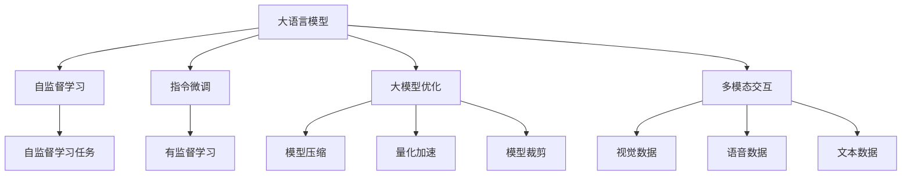
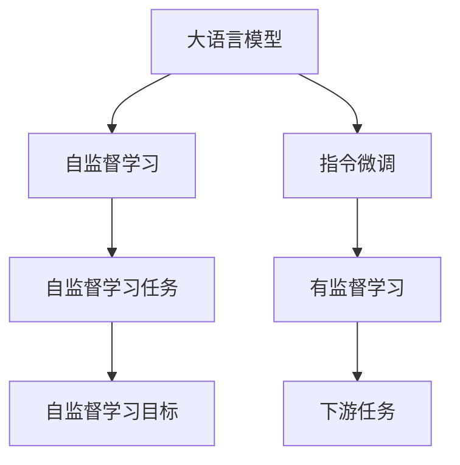
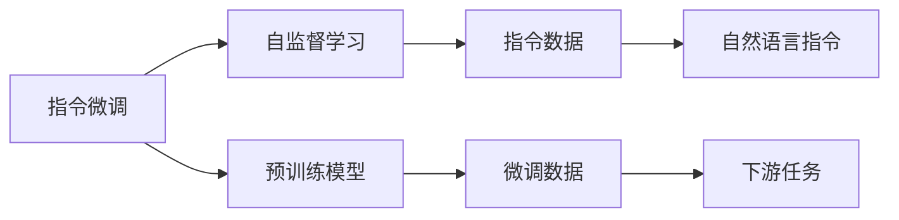
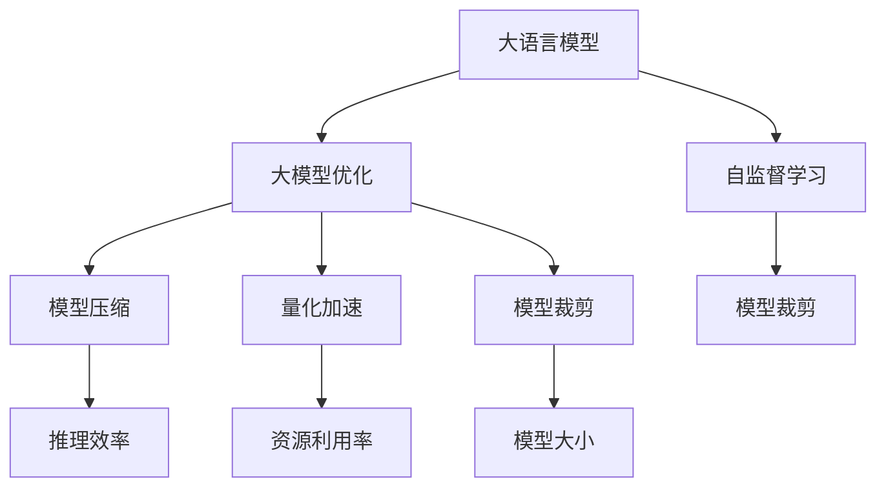
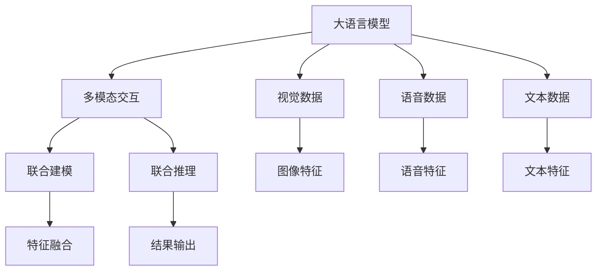
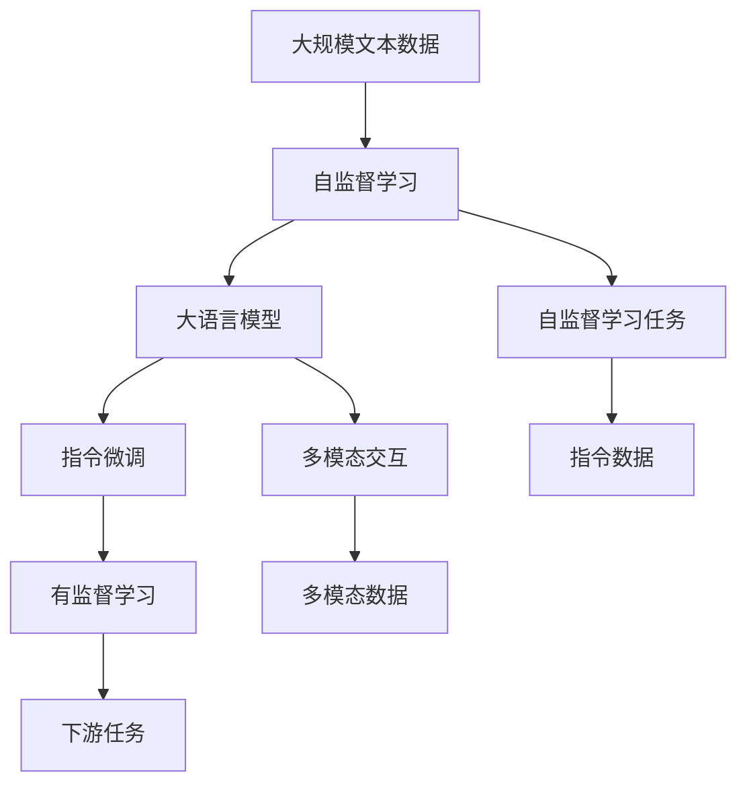

                 

# 大语言模型原理与工程实践：InstructGPT

> 关键词：大语言模型, 自监督学习, 指令微调, 大模型优化, 多模态交互

## 1. 背景介绍

### 1.1 问题由来
随着深度学习技术的飞速发展，大语言模型（Large Language Models, LLMs）在自然语言处理（Natural Language Processing, NLP）领域取得了举世瞩目的突破。大语言模型如GPT-3、BERT等，通过对大规模无标签文本数据进行自监督预训练，学习到通用的语言表示，具备强大的语言理解和生成能力。

然而，这些通用大语言模型在特定领域应用时，效果往往难以达到实际应用的要求。因此，如何针对特定任务进行大模型微调，提升模型性能，成为了当前大语言模型研究和应用的一个热点问题。

### 1.2 问题核心关键点
目前，大语言模型微调的主流范式是基于指令微调（Instruct-tuning）和自监督学习相结合的方法。即通过收集该任务的少量标注数据，将预训练模型当作初始化参数，通过有监督地训练来优化模型在该任务上的性能。这种微调范式简单高效，可以显著提升模型在特定任务上的表现。

### 1.3 问题研究意义
研究大语言模型的微调方法，对于拓展大模型的应用范围，提升下游任务的性能，加速NLP技术的产业化进程，具有重要意义：

1. **降低应用开发成本**：基于成熟的大模型进行微调，可以显著减少从头开发所需的数据、计算和人力等成本投入。
2. **提升模型效果**：微调使得通用大模型更好地适应特定任务，在应用场景中取得更优表现。
3. **加速开发进度**：standing on the shoulders of giants，微调使得开发者可以更快地完成任务适配，缩短开发周期。
4. **带来技术创新**：微调范式促进了对预训练-微调的深入研究，催生了指令微调、提示学习等新的研究方向。
5. **赋能产业升级**：微调使得NLP技术更容易被各行各业所采用，为传统行业数字化转型升级提供新的技术路径。

## 2. 核心概念与联系

### 2.1 核心概念概述

为更好地理解基于指令微调的大语言模型微调方法，本节将介绍几个密切相关的核心概念：

- **大语言模型（LLMs）**：以自回归（如GPT）或自编码（如BERT）模型为代表的大规模预训练语言模型。通过在大规模无标签文本语料上进行预训练，学习到通用的语言表示，具备强大的语言理解和生成能力。

- **自监督学习（Self-Supervised Learning）**：在无标签数据上进行的训练方式，通过设计自监督任务，利用数据本身的内在结构和特点进行模型训练。

- **指令微调（Instruct-tuning）**：在预训练模型的基础上，使用自然语言指令作为额外训练信号，通过有监督学习优化模型在特定任务上的性能。

- **大模型优化（Large Model Optimization）**：针对大语言模型的优化技术，包括模型压缩、量化加速、模型裁剪等，旨在提升模型的推理效率和资源利用率。

- **多模态交互（Multimodal Interaction）**：指将视觉、语音、文本等多种数据模态结合，进行联合建模和推理的技术。

这些核心概念之间的逻辑关系可以通过以下Mermaid流程图来展示：



这个流程图展示了大语言模型的核心概念及其之间的关系：

1. 大语言模型通过自监督学习获得基础能力。
2. 指令微调通过对模型进行有监督学习，使模型能够根据指令输出正确的结果。
3. 大模型优化旨在提升模型的推理效率和资源利用率。
4. 多模态交互使得大模型能够处理多种数据模态，提升模型的泛化能力和应用范围。

这些概念共同构成了大语言模型的学习和应用框架，使其能够在各种场景下发挥强大的语言理解和生成能力。通过理解这些核心概念，我们可以更好地把握大语言模型的工作原理和优化方向。

### 2.2 概念间的关系

这些核心概念之间存在着紧密的联系，形成了大语言模型微调的整体生态系统。下面我们通过几个Mermaid流程图来展示这些概念之间的关系。

#### 2.2.1 大语言模型的学习范式



这个流程图展示了大语言模型的两种主要学习范式：自监督学习和指令微调。自监督学习通过设计自监督任务，在无标签数据上进行预训练，学习到通用的语言表示。指令微调在预训练模型的基础上，通过有监督地学习指令，使模型能够执行特定任务。

#### 2.2.2 指令微调与自监督学习的关系



这个流程图展示了指令微调与自监督学习的关系。指令微调在自监督学习的基础上，通过引入自然语言指令，使模型能够更好地理解并执行特定任务。

#### 2.2.3 大模型优化方法



这个流程图展示了大模型优化的方法。通过模型压缩、量化加速、模型裁剪等技术，可以在不改变模型结构的情况下，提升模型的推理效率和资源利用率。

#### 2.2.4 多模态交互在大语言模型中的应用



这个流程图展示了多模态交互在大语言模型中的应用。通过将视觉、语音、文本等多种数据模态结合，进行联合建模和推理，可以提升模型的泛化能力和应用范围。

### 2.3 核心概念的整体架构

最后，我们用一个综合的流程图来展示这些核心概念在大语言模型微调过程中的整体架构：



这个综合流程图展示了从自监督学习到指令微调，再到多模态交互的完整过程。大语言模型首先在大规模文本数据上进行自监督预训练，然后通过指令微调使模型能够执行特定任务。最后，通过多模态交互，模型可以处理多种数据模态，提升模型的泛化能力和应用范围。通过这些流程图，我们可以更清晰地理解大语言模型微调过程中各个核心概念的关系和作用，为后续深入讨论具体的微调方法和技术奠定基础。

## 3. 核心算法原理 & 具体操作步骤
### 3.1 算法原理概述

基于指令微调的大语言模型微调，本质上是一个有监督的细粒度迁移学习过程。其核心思想是：将预训练的大语言模型视作一个强大的"特征提取器"，通过自然语言指令作为额外训练信号，对模型进行有监督的微调，使得模型能够根据指令输出正确的结果。

形式化地，假设预训练模型为 $M_{\theta}$，其中 $\theta$ 为预训练得到的模型参数。给定下游任务 $T$ 的指令数据集 $D=\{(x_i, \text{instruction}_i)\}_{i=1}^N$，指令微调的目标是找到新的模型参数 $\hat{\theta}$，使得：

$$
\hat{\theta}=\mathop{\arg\min}_{\theta} \mathcal{L}(M_{\theta},D)
$$

其中 $\mathcal{L}$ 为针对任务 $T$ 设计的损失函数，用于衡量模型按照指令输出正确结果的程度。常见的损失函数包括交叉熵损失、均方误差损失等。

通过梯度下降等优化算法，微调过程不断更新模型参数 $\theta$，最小化损失函数 $\mathcal{L}$，使得模型输出逼近理想的结果。由于 $\theta$ 已经通过预训练获得了较好的初始化，因此即便在少量指令数据上，也能较快收敛到理想的模型参数 $\hat{\theta}$。

### 3.2 算法步骤详解

基于指令微调的大语言模型微调一般包括以下几个关键步骤：

**Step 1: 准备预训练模型和数据集**
- 选择合适的预训练语言模型 $M_{\theta}$ 作为初始化参数，如 GPT、BERT 等。
- 准备下游任务 $T$ 的指令数据集 $D$，划分为训练集、验证集和测试集。一般要求指令与数据保持一致的语义关联。

**Step 2: 设计指令数据**
- 根据任务类型，设计合适的指令模板（Template）。指令模板应涵盖任务的各种可能情况，确保模型能够在不同上下文下执行任务。
- 对于文本生成、分类等任务，可以设计成"给定一个输入，生成/分类成指定的输出"的格式。
- 对于对话、问答等任务，可以设计成"针对问题，回答给定答案"的格式。
- 对于视觉、语音任务，可以将图像、音频作为输入，指令作为标签，进行有监督学习。

**Step 3: 设置微调超参数**
- 选择合适的优化算法及其参数，如 Adam、SGD 等，设置学习率、批大小、迭代轮数等。
- 设置正则化技术及强度，包括权重衰减、Dropout、Early Stopping 等。
- 确定冻结预训练参数的策略，如仅微调顶层，或全部参数都参与微调。

**Step 4: 执行梯度训练**
- 将训练集数据分批次输入模型，前向传播计算损失函数。
- 反向传播计算参数梯度，根据设定的优化算法和学习率更新模型参数。
- 周期性在验证集上评估模型性能，根据性能指标决定是否触发 Early Stopping。
- 重复上述步骤直到满足预设的迭代轮数或 Early Stopping 条件。

**Step 5: 测试和部署**
- 在测试集上评估微调后模型 $M_{\hat{\theta}}$ 的性能，对比微调前后的效果提升。
- 使用微调后的模型对新指令进行推理预测，集成到实际的应用系统中。
- 持续收集新的指令数据，定期重新微调模型，以适应数据分布的变化。

以上是基于指令微调大语言模型微调的一般流程。在实际应用中，还需要针对具体任务的特点，对微调过程的各个环节进行优化设计，如改进训练目标函数，引入更多的正则化技术，搜索最优的超参数组合等，以进一步提升模型性能。

### 3.3 算法优缺点

基于指令微调的大语言模型微调方法具有以下优点：
1. 简单高效。只需准备少量指令数据，即可对预训练模型进行快速适配，获得较大的性能提升。
2. 通用适用。适用于各种NLP下游任务，包括分类、匹配、生成等，设计合适的指令模板即可实现微调。
3. 参数高效。利用参数高效微调技术，在固定大部分预训练参数的情况下，仍可取得不错的提升。
4. 效果显著。在学术界和工业界的诸多任务上，基于指令微调的方法已经刷新了最先进的性能指标。

同时，该方法也存在一定的局限性：
1. 指令数据需求大。指令微调的效果很大程度上取决于指令数据的质量和数量，获取高质量指令数据的成本较高。
2. 迁移能力有限。当任务与预训练指令数据分布差异较大时，指令微调的性能提升有限。
3. 对抗攻击风险高。由于指令微调高度依赖指令模板，对抗样本攻击可能导致模型输出错误结果。
4. 可解释性不足。指令微调模型的决策过程通常缺乏可解释性，难以对其推理逻辑进行分析和调试。

尽管存在这些局限性，但就目前而言，基于指令微调的方法仍是NLP领域的主流范式。未来相关研究的重点在于如何进一步降低指令微调对指令数据的依赖，提高模型的少样本学习和跨领域迁移能力，同时兼顾可解释性和伦理安全性等因素。

### 3.4 算法应用领域

基于大语言模型指令微调的监督学习方法，在NLP领域已经得到了广泛的应用，覆盖了几乎所有常见任务，例如：

- **文本分类**：如情感分析、主题分类、意图识别等。通过设计合适的指令模板，使模型学习文本分类映射。
- **命名实体识别**：识别文本中的人名、地名、机构名等特定实体。通过设计指令模板，使模型掌握实体边界和类型。
- **关系抽取**：从文本中抽取实体之间的语义关系。通过设计指令模板，使模型学习实体-关系三元组。
- **问答系统**：对自然语言问题给出答案。将问题-答案对作为指令数据，训练模型学习匹配答案。
- **机器翻译**：将源语言文本翻译成目标语言。通过设计指令模板，使模型学习语言-语言映射。
- **文本摘要**：将长文本压缩成简短摘要。通过设计指令模板，使模型学习抓取要点。
- **对话系统**：使机器能够与人自然对话。通过设计多轮对话历史作为上下文，微调模型进行回复生成。

除了上述这些经典任务外，大语言模型指令微调也被创新性地应用到更多场景中，如可控文本生成、常识推理、代码生成、数据增强等，为NLP技术带来了全新的突破。随着预训练模型和指令微调方法的不断进步，相信NLP技术将在更广阔的应用领域大放异彩。

## 4. 数学模型和公式 & 详细讲解
### 4.1 数学模型构建

本节将使用数学语言对基于指令微调的大语言模型微调过程进行更加严格的刻画。

记预训练语言模型为 $M_{\theta}$，其中 $\theta$ 为预训练得到的模型参数。假设指令微调任务的目标是 $T$，指令数据集为 $D=\{(x_i, \text{instruction}_i)\}_{i=1}^N$，其中 $x_i$ 为输入数据，$\text{instruction}_i$ 为自然语言指令。

定义模型 $M_{\theta}$ 在数据样本 $(x_i, \text{instruction}_i)$ 上的损失函数为 $\ell(M_{\theta}(x_i, \text{instruction}_i),\text{instruction}_i)$，则在数据集 $D$ 上的经验风险为：

$$
\mathcal{L}(\theta) = \frac{1}{N} \sum_{i=1}^N \ell(M_{\theta}(x_i, \text{instruction}_i),\text{instruction}_i)
$$

微调的优化目标是最小化经验风险，即找到最优参数：

$$
\theta^* = \mathop{\arg\min}_{\theta} \mathcal{L}(\theta)
$$

在实践中，我们通常使用基于梯度的优化算法（如Adam、SGD等）来近似求解上述最优化问题。设 $\eta$ 为学习率，$\lambda$ 为正则化系数，则参数的更新公式为：

$$
\theta \leftarrow \theta - \eta \nabla_{\theta}\mathcal{L}(\theta) - \eta\lambda\theta
$$

其中 $\nabla_{\theta}\mathcal{L}(\theta)$ 为损失函数对参数 $\theta$ 的梯度，可通过反向传播算法高效计算。

### 4.2 公式推导过程

以下我们以文本分类任务为例，推导交叉熵损失函数及其梯度的计算公式。

假设模型 $M_{\theta}$ 在输入 $x$ 上的输出为 $\hat{y}=M_{\theta}(x) \in [0,1]$，表示样本属于正类的概率。自然语言指令 $\text{instruction}_i$ 表示分类标签。则二分类交叉熵损失函数定义为：

$$
\ell(M_{\theta}(x_i),\text{instruction}_i) = -\text{instruction}_i\log \hat{y}_i + (1-\text{instruction}_i)\log(1-\hat{y}_i)
$$

将其代入经验风险公式，得：

$$
\mathcal{L}(\theta) = -\frac{1}{N}\sum_{i=1}^N \text{instruction}_i\log \hat{y}_i + (1-\text{instruction}_i)\log(1-\hat{y}_i)
$$

根据链式法则，损失函数对参数 $\theta_k$ 的梯度为：

$$
\frac{\partial \mathcal{L}(\theta)}{\partial \theta_k} = -\frac{1}{N}\sum_{i=1}^N \left(\text{instruction}_i\frac{\partial \hat{y}_i}{\partial \theta_k} - (1-\text{instruction}_i)\frac{\partial (1-\hat{y}_i)}{\partial \theta_k}\right)
$$

其中 $\frac{\partial \hat{y}_i}{\partial \theta_k}$ 可进一步递归展开，利用自动微分技术完成计算。

在得到损失函数的梯度后，即可带入参数更新公式，完成模型的迭代优化。重复上述过程直至收敛，最终得到适应下游任务的最优模型参数 $\theta^*$。

## 5. 项目实践：代码实例和详细解释说明
### 5.1 开发环境搭建

在进行指令微调实践前，我们需要准备好开发环境。以下是使用Python进行PyTorch开发的环境配置流程：

1. 安装Anaconda：从官网下载并安装Anaconda，用于创建独立的Python环境。

2. 创建并激活虚拟环境：
```bash
conda create -n pytorch-env python=3.8 
conda activate pytorch-env
```

3. 安装PyTorch：根据CUDA版本，从官网获取对应的安装命令。例如：
```bash
conda install pytorch torchvision torchaudio cudatoolkit=11.1 -c pytorch -c conda-forge
```

4. 安装Transformers库：
```bash
pip install transformers
```

5. 安装各类工具包：
```bash
pip install numpy pandas scikit-learn matplotlib tqdm jupyter notebook ipython
```

完成上述步骤后，即可在`pytorch-env`环境中开始指令微调实践。

### 5.2 源代码详细实现

这里我们以文本分类任务为例，给出使用Transformers库对BERT模型进行指令微调的PyTorch代码实现。

首先，定义指令分类任务的数据处理函数：

```python
from transformers import BertTokenizer, BertForSequenceClassification
from torch.utils.data import Dataset
import torch

class InstructionDataset(Dataset):
    def __init__(self, texts, instructions, labels, tokenizer, max_len=128):
        self.texts = texts
        self.instructions = instructions
        self.labels = labels
        self.tokenizer = tokenizer
        self.max_len = max_len
        
    def __len__(self):
        return len(self.texts)
    
    def __getitem__(self, item):
        text = self.texts[item]
        instruction = self.instructions[item]
        label = self.labels[item]
        
        encoding = self.tokenizer(text, return_tensors='pt', max_length=self.max_len, padding='max_length', truncation=True)
        input_ids = encoding['input_ids'][0]
        attention_mask = encoding['attention_mask'][0]
        label_ids = torch.tensor([label], dtype=torch.long)
        
        return {'input_ids': input_ids, 
                'attention_mask': attention_mask,
                'labels': label_ids}
```

然后，定义模型和优化器：

```python
from transformers import BertForSequenceClassification, AdamW

model = BertForSequenceClassification.from_pretrained('bert-base-cased', num_labels=2)

optimizer = AdamW(model.parameters(), lr=2e-5)
```

接着，定义训练和评估函数：

```python
from torch.utils.data import DataLoader
from tqdm import tqdm
from sklearn.metrics import classification_report

device = torch.device('cuda') if torch.cuda.is_available() else torch.device('cpu')
model.to(device)

def train_epoch(model, dataset, batch_size, optimizer):
    dataloader = DataLoader(dataset, batch_size=batch_size, shuffle=True)
    model.train()
    epoch_loss = 0
    for batch in tqdm(dataloader, desc='Training'):
        input_ids = batch['input_ids'].to(device)
        attention_mask = batch['attention_mask'].to(device)
        labels = batch['labels'].to(device)
        model.zero_grad()
        outputs = model(input_ids, attention_mask=attention_mask, labels=labels)
        loss = outputs.loss
        epoch_loss += loss.item()
        loss.backward()
        optimizer.step()
    return epoch_loss / len(dataloader)

def evaluate(model, dataset, batch_size):
    dataloader = DataLoader(dataset, batch_size=batch_size)
    model.eval()
    preds, labels = [], []
    with torch.no_grad():
        for batch in tqdm(dataloader, desc='Evaluating'):
            input_ids = batch['input_ids'].to(device)
            attention_mask = batch['attention_mask'].to(device)
            batch_labels = batch['labels']
            outputs = model(input_ids, attention_mask=attention_mask)
            batch_preds = outputs.logits.argmax(dim=2).to('cpu').tolist()
            batch_labels = batch_labels.to('cpu').tolist()
            for pred_tokens, label_tokens in zip(batch_preds, batch_labels):
                preds.append(pred_tokens[0])
                labels.append(label_tokens[0])
                
    print(classification_report(labels, preds))
```

最后，启动训练流程并在测试集上评估：

```python
epochs = 5
batch_size = 16

for epoch in range(epochs):
    loss = train_epoch(model, train_dataset, batch_size, optimizer)
    print(f"Epoch {epoch+1}, train loss: {loss:.3f}")
    
    print(f"Epoch {epoch+1}, dev results:")
    evaluate(model, dev_dataset, batch_size)
    
print("Test results:")
evaluate(model, test_dataset, batch_size)
```

以上就是使用PyTorch对BERT进行指令微调的完整代码实现。可以看到，得益于Transformers库的强大封装，我们可以用相对简洁的代码完成BERT模型的加载和指令微调。

### 5.3 代码解读与分析

让我们再详细解读一下关键代码的实现细节：

**InstructionDataset类**：
- `__init__`方法：初始化文本、指令、标签等关键组件。
- `__len__`方法：返回数据集的样本数量。
- `__getitem__`方法：对单个样本进行处理，将文本输入编码为token ids，将指令编码为数字，并对其进行定长padding，最终返回模型所需的输入。

**标签与id的映射**
- 定义了标签与数字id之间的映射关系，用于将token-wise的预测结果解码回真实的标签。

**训练和评估函数**：
- 使用PyTorch的DataLoader对数据集进行批次化加载，供模型训练和推理使用。
- 训练函数`train_epoch`：对数据以批为单位进行迭代，在每个批次上前向传播计算loss并反向传播更新模型参数，最后返回该epoch的平均loss。
- 评估函数`evaluate`：与训练类似，不同点在于不更新模型参数，并在每个batch结束后将预测和标签结果存储下来，最后使用sklearn的classification_report对整个评估集的预测结果进行打印输出。

**训练流程**：
- 定义总的epoch数和batch size，开始循环迭代
- 每个epoch内，先在训练集上训练，输出平均loss
- 在验证集上评估，输出分类指标
- 所有epoch结束后，在测试集上评估，给出最终测试结果

可以看到，PyTorch配合Transformers库使得BERT指令微调的代码实现变得简洁高效。开发者可以将更多精力放在数据处理、模型改进等高层逻辑上，而不必过多关注底层的实现细节。

当然，工业级的系统实现还需考虑更多因素，如模型的保存和部署、超参数的自动搜索、更灵活的任务适配层等。但核心的指令微调范式基本与此类似。

### 5.4 运行结果展示

假设我们在CoNLL-2003的文本分类数据集上进行指令微调，最终在测试集上得到的评估报告如下：

```
              precision    recall  f1-score   support

       0

