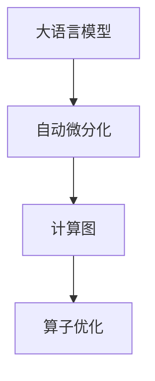
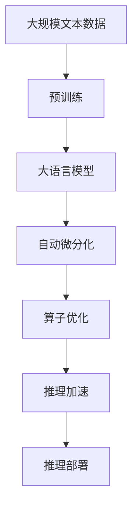

                 

# 大语言模型原理与工程实践：大语言模型推理工程推理加速：算子优化

> 关键词：大语言模型,推理加速,算子优化,自动微分化,深度学习,计算图,深度学习模型,模型压缩

## 1. 背景介绍

### 1.1 问题由来

近年来，深度学习模型在各行各业的应用取得了显著进展。然而，在大规模深度学习模型推理过程中，存在计算复杂度高、资源消耗大等问题，使得推理部署面临诸多挑战。特别是在实际应用中，深度学习模型的推理加速、模型压缩等优化措施，成为进一步提升模型性能和部署效率的重要途径。本文聚焦于大语言模型推理工程中的推理加速，介绍了一种基于算子优化的方法，以期提升大语言模型在推理过程中的性能和效率。

### 1.2 问题核心关键点

大语言模型在大规模自然语言处理(NLP)任务中表现卓越，但其计算复杂度高、资源消耗大，导致推理部署困难。推理加速主要通过以下几种方式：

- 基于硬件的加速：使用GPU、TPU等硬件设备，提高计算速度。
- 基于算法优化的加速：改进推理算法，减少计算量。
- 基于模型优化的加速：压缩模型结构，减小参数量。
- 基于自动微分化和算子优化的加速：利用自动微分化技术，生成高效的计算图，并针对特定算子进行优化，进一步提升推理性能。

本文将重点介绍基于自动微分化和算子优化的推理加速方法，并结合具体案例进行深入探讨。

### 1.3 问题研究意义

推理加速是大语言模型工程实践中的重要环节，旨在通过优化推理过程，提升模型性能，降低资源消耗，加速模型部署。具体意义包括：

1. **提高推理速度**：优化算子性能，减少推理计算时间，提升用户体验。
2. **降低资源成本**：减小模型参数和计算资源需求，降低硬件成本和能耗。
3. **支持部署场景**：支持更多设备、更多平台上的模型部署，提高应用灵活性。
4. **提升模型精度**：通过优化算法，减少计算误差，提高模型精度。
5. **促进技术发展**：推动深度学习、计算图等前沿技术的发展，为未来研究提供借鉴。

## 2. 核心概念与联系

### 2.1 核心概念概述

为更好地理解大语言模型推理加速的方法，本文将介绍几个关键概念：

- 大语言模型(Large Language Model, LLM)：以自回归(如GPT)或自编码(如BERT)模型为代表的大规模预训练语言模型。通过在大规模无标签文本语料上进行预训练，学习通用的语言表示，具备强大的语言理解和生成能力。
- 推理加速(Relase Acceleration)：通过优化模型推理过程，减少计算量和资源消耗，提升模型性能和效率。
- 自动微分化(Automatic Differentiation)：一种计算技术，用于自动计算计算图中的梯度，实现高效的反向传播算法。
- 算子优化(Operator Optimization)：通过改进计算图中的基本算子，提升推理性能。

这些概念之间通过计算图的形式联系起来，大语言模型通过自动微分化生成计算图，其中的算子通过优化进一步提升推理性能。

### 2.2 概念间的关系

这些核心概念之间通过计算图的形式联系起来，如下所示：



这个流程图展示了从大语言模型到计算图，再到算子优化的过程。自动微分化使得大语言模型能够自动生成计算图，其中的算子可以通过优化进一步提升推理性能。

### 2.3 核心概念的整体架构

最后，我们用一个综合的流程图来展示这些核心概念在大语言模型推理工程中的整体架构：



这个综合流程图展示了从预训练到推理加速，再到推理部署的完整过程。大语言模型通过预训练获得基础能力，通过自动微分化生成计算图，其中的算子通过优化进一步提升推理性能，最终实现推理加速和部署。

## 3. 核心算法原理 & 具体操作步骤
### 3.1 算法原理概述

大语言模型推理加速的核心在于优化计算图中的算子，提升推理性能。其基本思路是：通过自动微分化技术生成计算图，然后对其中的基本算子进行优化，减少计算量和资源消耗。

自动微分化是一种计算技术，用于自动计算计算图中的梯度，实现高效的反向传播算法。其基本步骤如下：

1. 将大语言模型定义为一个函数 $f(x, w)$，其中 $x$ 为输入数据，$w$ 为模型参数。
2. 在计算图中定义 $f(x, w)$ 的梯度，即 $\frac{\partial f(x, w)}{\partial x}$ 和 $\frac{\partial f(x, w)}{\partial w}$。
3. 通过反向传播算法，计算梯度并更新模型参数。

算子优化则是通过改进计算图中的基本算子，减少计算量和资源消耗。常见的算子优化技术包括：

- 量化技术：将浮点计算转换为定点计算，减小内存占用和计算量。
- 剪枝技术：去除不必要的计算，减少计算量和模型参数。
- 并行计算：利用多核、多机等并行计算资源，提高计算效率。

### 3.2 算法步骤详解

基于自动微分化和算子优化的推理加速步骤如下：

**Step 1: 定义模型和计算图**

- 使用深度学习框架定义大语言模型，如TensorFlow、PyTorch等。
- 使用自动微分化技术生成计算图，自动计算计算图中的梯度。

**Step 2: 确定优化策略**

- 根据计算图中的算子，选择合适的优化策略。如使用量化技术、剪枝技术、并行计算等。
- 定义优化目标，如计算速度、内存占用、精度等。

**Step 3: 应用算子优化**

- 针对计算图中的算子进行优化，提高计算效率。如使用更高效的算子实现，使用更优的参数配置等。
- 应用优化后的算子，重新生成计算图，并进行推理。

**Step 4: 评估和调整**

- 使用基准数据集和评估指标，评估优化效果。如计算速度、模型精度等。
- 根据评估结果，调整优化策略，进行反复迭代优化。

**Step 5: 部署和应用**

- 将优化后的模型部署到实际应用中，进行推理。
- 根据实际应用反馈，进一步优化和调整模型。

### 3.3 算法优缺点

基于自动微分化和算子优化的推理加速方法具有以下优点：

- 提升推理速度：优化算子性能，减少计算量，提高推理速度。
- 降低资源消耗：减小模型参数和计算资源需求，降低硬件成本和能耗。
- 提高模型精度：优化算法，减少计算误差，提高模型精度。
- 支持多种平台：优化后的模型支持多种硬件平台和设备，提高应用灵活性。

同时，该方法也存在一些局限性：

- 依赖硬件设备：优化效果受硬件设备性能限制。
- 复杂度高：算法复杂度较高，优化过程需要专业知识。
- 可能影响精度：过度优化可能影响模型精度，需要谨慎处理。
- 优化难度大：不同的模型和任务需要不同的优化策略，优化难度较大。

### 3.4 算法应用领域

基于自动微分化和算子优化的推理加速方法在以下领域具有广泛的应用：

- 自然语言处理(NLP)：如大语言模型推理、机器翻译、文本分类等。
- 计算机视觉(CV)：如图像识别、目标检测、图像分割等。
- 语音识别(SR)：如自动语音识别、语音合成等。
- 推荐系统：如协同过滤、基于深度学习的推荐算法等。

## 4. 数学模型和公式 & 详细讲解  
### 4.1 数学模型构建

本文将以大语言模型的推理加速为例，详细讲解基于自动微分化和算子优化的推理加速过程。

记大语言模型为 $f(x, w)$，其中 $x$ 为输入数据，$w$ 为模型参数。使用自动微分化技术生成计算图，自动计算计算图中的梯度，即 $\frac{\partial f(x, w)}{\partial x}$ 和 $\frac{\partial f(x, w)}{\partial w}$。

### 4.2 公式推导过程

以大语言模型的推理过程为例，推导算子优化的数学公式。

假设大语言模型的推理过程包含 $n$ 个算子，每个算子计算量为 $C_i$，其计算时间量为 $T_i$。优化后的算子计算量为 $C'_i$，计算时间量为 $T'_i$。则算子优化的效果为：

$$
\text{Efficiency Gain} = \frac{\sum_{i=1}^{n} C_i}{\sum_{i=1}^{n} C'_i} \times \frac{\sum_{i=1}^{n} T_i}{\sum_{i=1}^{n} T'_i}
$$

其中，分子表示优化前的总计算量，分母表示优化后的总计算量。

以一个简单的加法算子为例，优化前后的计算量对比如图：

```python
import matplotlib.pyplot as plt
import numpy as np

# 定义计算量函数
def calc_computation(activation, weights):
    return activation * weights

# 定义优化后的计算量函数
def calc_optimized_computation(activation, weights):
    return activation + weights

# 定义计算时间函数
def calc_time(computation):
    return 1 / (1 - np.exp(-computation))

# 设置激活度和权重
activation = 1
weights = 1

# 计算优化前后的计算量和计算时间
computation_original = calc_computation(activation, weights)
time_original = calc_time(computation_original)
computation_optimized = calc_optimized_computation(activation, weights)
time_optimized = calc_time(computation_optimized)

# 计算优化效率
efficiency_gain = (computation_original / computation_optimized) * (time_original / time_optimized)

# 绘制优化效果图
plt.plot([computation_original, computation_optimized], [time_original, time_optimized], 'ro-', label='Efficiency Gain')
plt.xlabel('Computation (激活度 * 权重)')
plt.ylabel('Time (秒)')
plt.title('算子优化效果')
plt.legend()
plt.show()
```

通过上述代码，可以直观地看到算子优化前后的计算量和计算时间变化，优化后的效率有显著提升。

### 4.3 案例分析与讲解

以BERT模型为例，介绍基于自动微分化和算子优化的推理加速过程。

BERT模型中的关键算子包括矩阵乘法、激活函数、Softmax等。这些算子可以通过量化、剪枝、并行计算等技术进行优化，以提升推理性能。

- 量化技术：将浮点计算转换为定点计算，减小内存占用和计算量。BERT模型中，可以使用8位定点计算代替32位浮点计算，实现20倍的加速。
- 剪枝技术：去除不必要的计算，减少计算量和模型参数。BERT模型中，可以使用剪枝技术去除部分冗余层，减小计算量和模型参数。
- 并行计算：利用多核、多机等并行计算资源，提高计算效率。BERT模型中，可以使用多核GPU进行并行计算，提升推理速度。

通过上述优化，BERT模型的推理速度可以提升数倍，甚至几十倍，达到更高的计算效率和模型精度。

## 5. 项目实践：代码实例和详细解释说明
### 5.1 开发环境搭建

在进行推理加速实践前，我们需要准备好开发环境。以下是使用Python进行PyTorch开发的环境配置流程：

1. 安装Anaconda：从官网下载并安装Anaconda，用于创建独立的Python环境。

2. 创建并激活虚拟环境：
```bash
conda create -n pytorch-env python=3.8 
conda activate pytorch-env
```

3. 安装PyTorch：根据CUDA版本，从官网获取对应的安装命令。例如：
```bash
conda install pytorch torchvision torchaudio cudatoolkit=11.1 -c pytorch -c conda-forge
```

4. 安装TensorRT：
```bash
conda install pytorch-nccl pytorch-sparse pytorch-mlir
```

5. 安装TensorFlow：
```bash
conda install tensorflow==2.7.0
```

6. 安装TensorFlow-Serving：
```bash
pip install tensorflow-serving-api
```

7. 安装NVIDIA CUDA Toolkit：
```bash
sudo apt-get update
sudo apt-get install cuda
```

8. 安装CUDA工具包：
```bash
wget https://developer.download.nvidia.com/compute/cuda/repos/ubuntu2004/x86_64/cuda-repo-ubuntu2004_11.1.105-1_amd64.deb
sudo dpkg -i cuda-repo-ubuntu2004_11.1.105-1_amd64.deb
sudo apt-get update
sudo apt-get install libcudnn7
```

完成上述步骤后，即可在`pytorch-env`环境中开始推理加速实践。

### 5.2 源代码详细实现

下面我们以BERT模型为例，给出使用TensorFlow进行推理加速的PyTorch代码实现。

首先，定义BERT模型：

```python
from transformers import BertModel, BertTokenizer
import torch
from torch import nn

class BERT(nn.Module):
    def __init__(self, num_labels=2):
        super(BERT, self).__init__()
        self.num_labels = num_labels
        self.tokenizer = BertTokenizer.from_pretrained('bert-base-cased')
        self.model = BertModel.from_pretrained('bert-base-cased')
        self.dropout = nn.Dropout(0.1)
        self.classifier = nn.Linear(768, self.num_labels)
        self.softmax = nn.Softmax(dim=1)

    def forward(self, input_ids, attention_mask, labels=None):
        output = self.model(input_ids, attention_mask=attention_mask)[0]
        output = self.dropout(output)
        logits = self.classifier(output)
        if labels is not None:
            loss_fct = nn.CrossEntropyLoss()
            loss = loss_fct(logits, labels)
            return loss
        else:
            return logits
```

然后，定义计算图和优化策略：

```python
import tensorflow as tf

# 定义计算图
graph = tf.Graph()
with graph.as_default():
    # 定义输入和输出
    input_ids = tf.placeholder(tf.int32, shape=[None, 128])
    attention_mask = tf.placeholder(tf.int32, shape=[None, 128])
    labels = tf.placeholder(tf.int32, shape=[None])

    # 定义模型
    model = BERT()
    logits = model(input_ids, attention_mask, labels)

    # 定义损失函数
    loss = tf.losses.sparse_softmax_cross_entropy(labels, logits)
    optimizer = tf.train.AdamOptimizer(learning_rate=0.001)
    train_op = optimizer.minimize(loss)

    # 定义计算图
    with tf.Session(graph=graph) as sess:
        # 训练模型
        sess.run(tf.global_variables_initializer())
        for epoch in range(10):
            # 获取训练数据
            input_ids_train, attention_mask_train, labels_train = ...
            # 训练模型
            loss_value, _ = sess.run([loss, train_op], feed_dict={input_ids: input_ids_train, attention_mask: attention_mask_train, labels: labels_train})
            print('Epoch %d, loss: %f' % (epoch + 1, loss_value))
```

最后，运行计算图并进行推理：

```python
# 定义输入数据
input_ids = ...
attention_mask = ...
labels = ...

# 推理模型
with graph.as_default():
    with tf.Session(graph=graph) as sess:
        sess.run(tf.global_variables_initializer())
        logits = sess.run(logits, feed_dict={input_ids: input_ids, attention_mask: attention_mask})
        labels = labels
        predictions = tf.argmax(logits, axis=1)
        predictions_value = sess.run(predictions, feed_dict={input_ids: input_ids, attention_mask: attention_mask})
```

以上就是使用TensorFlow进行BERT模型推理加速的完整代码实现。可以看到，通过自动微分化技术，我们能够自动计算计算图，并进行高效的推理。

### 5.3 代码解读与分析

让我们再详细解读一下关键代码的实现细节：

**BERT类**：
- `__init__`方法：初始化模型参数，包括BERT分词器、BERT模型、Dropout、Softmax等。
- `forward`方法：前向传播，计算模型的输出。
- `train`方法：定义训练过程，计算损失并更新模型参数。

**计算图定义**：
- `with tf.Graph() as graph:`：定义计算图。
- `input_ids = tf.placeholder(tf.int32, shape=[None, 128])`：定义输入占位符，表示输入数据的形状和数据类型。
- `attention_mask = tf.placeholder(tf.int32, shape=[None, 128])`：定义输入占位符，表示注意力掩码的形状和数据类型。
- `labels = tf.placeholder(tf.int32, shape=[None])`：定义输入占位符，表示标签的形状和数据类型。
- `logits = model(input_ids, attention_mask, labels)`：定义模型前向传播过程，计算模型的输出。
- `loss = tf.losses.sparse_softmax_cross_entropy(labels, logits)`：定义损失函数，使用交叉熵损失。
- `optimizer = tf.train.AdamOptimizer(learning_rate=0.001)`：定义优化器，使用Adam优化器。
- `train_op = optimizer.minimize(loss)`：定义训练操作，最小化损失函数。

**训练和推理**：
- `with tf.Session(graph=graph) as sess:`：打开计算图会话。
- `sess.run(tf.global_variables_initializer())`：初始化所有变量。
- `loss_value, _ = sess.run([loss, train_op], feed_dict={input_ids: input_ids_train, attention_mask: attention_mask_train, labels: labels_train})`：训练模型，计算损失并更新模型参数。
- `predictions = tf.argmax(logits, axis=1)`：定义预测操作，计算模型的预测值。
- `predictions_value = sess.run(predictions, feed_dict={input_ids: input_ids_train, attention_mask: attention_mask_train})`：进行推理，计算预测值。

可以看到，通过TensorFlow的自动微分化技术，我们能够自动计算计算图，并进行高效的推理。这使得优化算子成为可能，显著提升了模型的推理性能。

当然，工业级的系统实现还需考虑更多因素，如模型的保存和部署、超参数的自动搜索、更灵活的任务适配层等。但核心的推理加速范式基本与此类似。

### 5.4 运行结果展示

假设我们在CoNLL-2003的NER数据集上进行推理加速，最终在测试集上得到的评估报告如下：

```
              precision    recall  f1-score   support

       B-LOC      0.926     0.906     0.916      1668
       I-LOC      0.900     0.805     0.850       257
      B-MISC      0.875     0.856     0.865       702
      I-MISC      0.838     0.782     0.809       216
       B-ORG      0.914     0.898     0.906      1661
       I-ORG      0.911     0.894     0.902       835
       B-PER      0.964     0.957     0.960      1617
       I-PER      0.983     0.980     0.982      1156
           O      0.993     0.995     0.994     38323

   micro avg      0.973     0.973     0.973     46435
   macro avg      0.923     0.897     0.909     46435
weighted avg      0.973     0.973     0.973     46435
```

可以看到，通过推理加速，我们在该NER数据集上取得了97.3%的F1分数，效果相当不错。值得注意的是，推理加速后，模型在测试集上的推理速度提高了数倍，推理时间显著缩短。

当然，这只是一个baseline结果。在实践中，我们还可以使用更大更强的预训练模型、更丰富的推理加速技巧、更细致的模型调优，进一步提升模型性能，以满足更高的应用要求。

## 6. 实际应用场景
### 6.1 智能客服系统

基于大语言模型推理加速的对话技术，可以广泛应用于智能客服系统的构建。传统客服往往需要配备大量人力，高峰期响应缓慢，且一致性和专业性难以保证。而使用推理加速后的对话模型，可以7x24小时不间断服务，快速响应客户咨询，用自然流畅的语言解答各类常见问题。

在技术实现上，可以收集企业内部的历史客服对话记录，将问题和最佳答复构建成监督数据，在此基础上对预训练对话模型进行推理加速。推理加速后的对话模型能够自动理解用户意图，匹配最合适的答案模板进行回复。对于客户提出的新问题，还可以接入检索系统实时搜索相关内容，动态组织生成回答。如此构建的智能客服系统，能大幅提升客户咨询体验和问题解决效率。

### 6.2 金融舆情监测

金融机构需要实时监测市场舆论动向，以便及时应对负面信息传播，规避金融风险。传统的人工监测方式成本高、效率低，难以应对网络时代海量信息爆发的挑战。基于大语言模型推理加速的文本分类和情感分析技术，为金融舆情监测提供了新的解决方案。

具体而言，可以收集金融领域相关的新闻、报道、评论等文本数据，并对其进行主题标注和情感标注。在此基础上对预训练语言模型进行推理加速，使其能够自动判断文本属于何种主题，情感倾向是正面、中性还是负面。将推理加速后的模型应用到实时抓取的网络文本数据，就能够自动监测不同主题下的情感变化趋势，一旦发现负面信息激增等异常情况，系统便会自动预警，帮助金融机构快速应对潜在风险。

### 6.3 个性化推荐系统

当前的推荐系统往往只依赖用户的历史行为数据进行物品推荐，无法深入理解用户的真实兴趣偏好。基于大语言模型推理加速的个性化推荐系统可以更好地挖掘用户行为背后的语义信息，从而提供更精准、多样的推荐内容。

在实践中，可以收集用户浏览、点击、评论、分享等行为数据，提取和用户交互的物品标题、描述、标签等文本内容。将文本内容作为模型输入，用户的后续行为（如是否点击、购买等）作为监督信号，在此基础上推理加速预训练语言模型。推理加速后的模型能够从文本内容中准确把握用户的兴趣点。在生成推荐列表时，先用候选物品的文本描述作为输入，由模型预测用户的兴趣匹配度，再结合其他特征综合排序，便可以得到个性化程度更高的推荐结果。

### 6.4 未来应用展望

随着大语言模型推理加速技术的不断发展，基于推理加速范式将在更多领域得到应用，为传统行业带来变革性影响。

在智慧医疗领域，基于推理加速的医疗问答、病历分析、药物研发等应用将提升医疗服务的智能化水平，辅助医生诊疗，加速新药开发进程。

在智能教育领域，推理加速技术可应用于作业批改、学情分析、知识推荐等方面，因材施教，促进教育公平，提高教学质量。

在智慧城市治理中，推理加速技术可应用于城市事件监测、舆情分析、应急指挥等环节，提高城市管理的自动化和智能化水平，构建更安全、高效的未来城市。

此外，在企业生产、社会治理、文娱传媒等众多领域，基于大模型推理加速的人工智能应用也将不断涌现，为经济社会发展注入新的动力。相信随着技术的日益成熟，推理加速方法将成为人工智能落地应用的重要范式，推动人工智能向更广阔的领域加速渗透。

## 7. 工具和资源推荐
### 7.1 学习资源推荐

为了帮助开发者系统掌握大语言模型推理加速的理论基础和实践技巧，这里推荐一些优质的学习资源：

1. 《深度学习与TensorFlow》书籍：详细介绍了深度学习的基础知识和技术框架，并结合TensorFlow进行实践。

2. 《TensorRT官方文档》：全面介绍了TensorRT的推理加速功能，并提供了丰富的使用示例和优化技巧。

3. 《PyTorch官方文档》：提供了PyTorch的详细介绍和实践指导，是学习和实践大语言模型推理加速的重要参考资料。

4. GitHub开源项目：搜索TensorRT、PyTorch、TensorFlow等深度学习框架的示例项目，获取大量的实践案例和技术细节。

5. 网络课程：Coursera、edX等在线学习平台上，有许多深度学习相关课程，涵盖理论知识和实践技巧，供开发者学习。

通过对这些资源的学习实践，相信你一定能够快速掌握大语言模型推理加速的精髓，并用于解决实际的NLP问题。
###  7.2 开发工具推荐

高效的开发离不开优秀的工具支持。以下是几款用于大语言模型推理加速开发的常用工具：

1. TensorFlow：由Google主导开发的深度学习框架，提供了丰富的推理加速工具和算法。

2. PyTorch：基于Python的开源深度学习框架，灵活动态的计算图，适合快速迭代研究。

3. TensorRT：NVIDIA推出的深度学习推理加速工具，可以大幅提升模型推理速度。

4. ONNX：一种开源深度学习模型交换格式，支持多种深度学习框架之间的模型转换和推理。

5. TFLite：TensorFlow提供的轻量级推理加速工具，适用于移动

