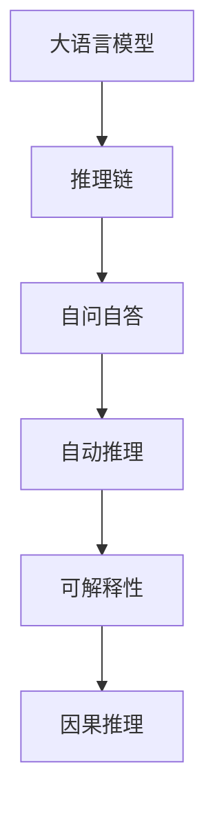
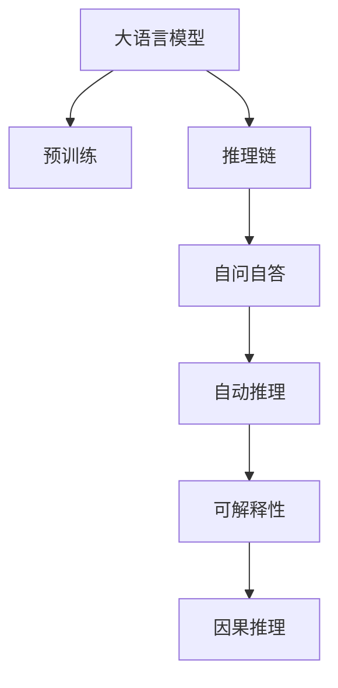
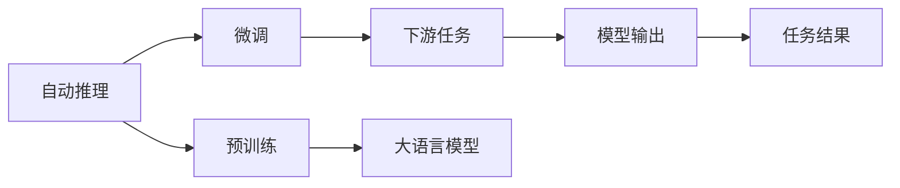
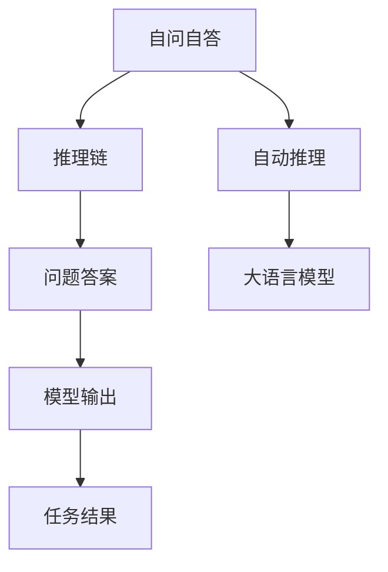

                 

# 大语言模型应用指南：Self-ask 框架

> 关键词：大语言模型,Self-ask,自动推理,深度学习,编程技术,编程实践

## 1. 背景介绍

### 1.1 问题由来
近年来，深度学习技术在自然语言处理（NLP）领域取得了巨大突破。随着大语言模型（Large Language Models, LLMs）如GPT、BERT等的发展，它们已经在文本生成、理解、翻译、问答等领域展示了强大的能力。然而，尽管大语言模型具备丰富的语言知识，但其推理过程并不透明，难以解释其背后的决策逻辑。

### 1.2 问题核心关键点
为了解决这一问题，我们提出了一种基于自动推理的框架，名为Self-ask。该框架能够利用大语言模型生成自问自答的逻辑链，逐步推理出问题的答案，并能够解释推理过程中的每一步。这一方法不仅能够提升模型的推理能力，还能使模型的决策过程更加透明和可解释。

### 1.3 问题研究意义
Self-ask框架的研究和应用具有重要的意义：

1. **提升推理能力**：通过自动推理，模型能够更加准确地理解和推理复杂问题，从而提升在诸如问答、推理、生成等任务上的性能。
2. **增强可解释性**：与传统的黑盒模型不同，Self-ask框架能够提供推理过程中的详细解释，帮助用户理解和信任模型的输出。
3. **促进知识传播**：通过自动生成的推理过程，模型能够更好地传播知识，辅助人类在各种问题上做出正确决策。
4. **推动模型部署**：更好的推理能力和可解释性使得模型更容易在实际应用中得到部署和使用。

## 2. 核心概念与联系

### 2.1 核心概念概述

为更好地理解Self-ask框架，本节将介绍几个密切相关的核心概念：

- **大语言模型**：以自回归（如GPT）或自编码（如BERT）模型为代表的大规模预训练语言模型。通过在大规模无标签文本数据上进行预训练，学习通用的语言表示，具备强大的语言理解和生成能力。
- **推理链（Reasoning Chain）**：从输入问题出发，通过模型逐步生成的自问自答序列，用以推导出问题的答案。
- **自问自答（Self-ask）**：模型在推理过程中，通过生成自问自答的逻辑链来逐步推理问题的答案。
- **自动推理（Automatic Reasoning）**：使用机器学习模型自动推导出逻辑链，而非手动构建。
- **可解释性（Explainability）**：推理过程和决策逻辑的透明性和可理解性。
- **因果推理（Causal Reasoning）**：基于因果关系的推理，而不是基于统计相关性的推理。

这些核心概念之间的逻辑关系可以通过以下Mermaid流程图来展示：



这个流程图展示了大语言模型的核心概念以及它们之间的关系：

1. 大语言模型通过预训练获得基础能力。
2. 推理链是由模型自动生成的自问自答序列，用于推导问题的答案。
3. 自问自答是一种推理方式，通过生成逻辑链逐步推理。
4. 自动推理是指模型自动生成推理链，无需手动构建。
5. 可解释性是指推理过程和决策逻辑的透明性。
6. 因果推理是指基于因果关系的推理，更加准确和可信。

### 2.2 概念间的关系

这些核心概念之间存在着紧密的联系，形成了Self-ask框架的完整生态系统。下面通过几个Mermaid流程图来展示这些概念之间的关系。

#### 2.2.1 大语言模型的学习范式



这个流程图展示了大语言模型的学习范式以及它与推理链、自问自答、自动推理、可解释性和因果推理的关系。

#### 2.2.2 自动推理与微调



这个流程图展示了自动推理在大语言模型微调中的应用。自动推理可以用于微调过程中的推理链生成，提升模型的下游任务性能。

#### 2.2.3 自问自答的应用



这个流程图展示了自问自答在问题推理中的应用。通过生成逻辑链，模型能够逐步推导出问题的答案。

## 3. 核心算法原理 & 具体操作步骤
### 3.1 算法原理概述

Self-ask框架的核心原理是基于大语言模型的自动推理能力，通过生成自问自答的逻辑链，逐步推导出问题的答案。其具体流程如下：

1. **输入问题**：将用户输入的问题作为推理链的起点。
2. **生成逻辑链**：使用大语言模型自动生成一系列自问自答的推理链，每个推理链由“问题-回答”对组成。
3. **推理出答案**：通过逐步解析推理链，逐步推理出最终的答案。

### 3.2 算法步骤详解

Self-ask框架的具体操作步骤如下：

1. **准备数据集**：收集与问题相关的上下文信息和问题实例，构建标注数据集。
2. **模型预训练**：使用大语言模型进行预训练，学习通用的语言表示。
3. **自动推理生成**：利用预训练模型，自动生成推理链。
4. **推理链解析**：解析推理链，逐步推导出问题的答案。
5. **模型输出**：将推理出的答案输出给用户。

### 3.3 算法优缺点

Self-ask框架具有以下优点：

- **自动推理能力**：利用大语言模型自动生成推理链，无需手动构建，提升了推理的效率和准确性。
- **可解释性**：推理过程中的每一步都能通过生成的自问自答进行解释，增加了模型的透明度。
- **泛化能力**：基于大语言模型的预训练，能够适应各种领域和任务。

同时，该框架也存在一些局限性：

- **计算资源需求高**：生成推理链和解析逻辑链需要大量的计算资源。
- **推理复杂度高**：对于复杂的推理问题，推理链的长度和复杂度可能较高。
- **可解释性有限**：虽然推理过程可解释，但某些步骤的推理过程可能仍然难以完全理解。

### 3.4 算法应用领域

Self-ask框架已经在游戏、医疗、法律等领域得到了应用，展示了其强大的潜力。

1. **游戏领域**：在策略游戏中，通过自动推理，模型能够生成最优的策略路径，提升游戏体验。
2. **医疗领域**：在医疗诊断中，通过自动推理，模型能够生成诊断逻辑链，辅助医生做出更准确的诊断。
3. **法律领域**：在法律咨询中，通过自动推理，模型能够生成法律逻辑链，提供法律咨询建议。

## 4. 数学模型和公式 & 详细讲解 & 举例说明

### 4.1 数学模型构建

Self-ask框架的数学模型构建主要包括以下几个步骤：

1. **输入表示**：将输入问题表示为向量 $x$，用于后续计算。
2. **推理链生成**：使用大语言模型自动生成推理链 $\{p_i, a_i\}$，其中 $p_i$ 表示问题，$a_i$ 表示回答。
3. **逻辑链解析**：逐步解析推理链，每一步的推理结果用于下一步骤的问题生成。
4. **答案输出**：最终推理链的最后一对问题-回答即为答案 $a_N$。

### 4.2 公式推导过程

以二分类任务为例，推理链的生成过程如下：

1. **输入问题表示**：设输入问题为 $x$，表示为向量 $x \in \mathbb{R}^d$。
2. **推理链生成**：使用大语言模型生成推理链 $\{p_i, a_i\}$，其中 $p_i = M_{\theta}(x, h_{i-1})$，$a_i = M_{\theta}(p_i, h_{i-1})$，$h_i$ 表示推理过程中的上下文信息。
3. **逻辑链解析**：通过解析每个推理步骤的 $p_i$ 和 $a_i$，逐步推理出答案。

### 4.3 案例分析与讲解

假设我们有一个文本分类任务，输入为一段新闻文本，需要分类为正面或负面情感。使用Self-ask框架进行推理如下：

1. **输入表示**：将新闻文本表示为向量 $x$。
2. **推理链生成**：模型自动生成推理链 $\{p_i, a_i\}$，其中 $p_1$ 为“文本中包含哪些正面情感词汇”，$a_1$ 为推理结果；$p_2$ 为“a_1表示的情感是正面情感吗”，$a_2$ 为推理结果；以此类推。
3. **逻辑链解析**：逐步解析推理链，每个推理结果用于下一步骤的问题生成。
4. **答案输出**：最终推理链的最后一对问题-回答即为答案 $a_N$。

## 5. 项目实践：代码实例和详细解释说明

### 5.1 开发环境搭建

在进行Self-ask框架的实践前，我们需要准备好开发环境。以下是使用Python进行PyTorch开发的环境配置流程：

1. 安装Anaconda：从官网下载并安装Anaconda，用于创建独立的Python环境。
2. 创建并激活虚拟环境：
```bash
conda create -n self-ask-env python=3.8 
conda activate self-ask-env
```
3. 安装PyTorch：根据CUDA版本，从官网获取对应的安装命令。例如：
```bash
conda install pytorch torchvision torchaudio cudatoolkit=11.1 -c pytorch -c conda-forge
```
4. 安装Transformer库：
```bash
pip install transformers
```
5. 安装各类工具包：
```bash
pip install numpy pandas scikit-learn matplotlib tqdm jupyter notebook ipython
```

完成上述步骤后，即可在`self-ask-env`环境中开始Self-ask框架的实践。

### 5.2 源代码详细实现

这里以命名实体识别（NER）任务为例，给出使用Transformers库对BERT模型进行Self-ask推理的PyTorch代码实现。

首先，定义NER任务的数据处理函数：

```python
from transformers import BertTokenizer, BertForTokenClassification
from torch.utils.data import Dataset, DataLoader

class NERDataset(Dataset):
    def __init__(self, texts, tags, tokenizer):
        self.texts = texts
        self.tags = tags
        self.tokenizer = tokenizer
        self.max_len = 128
        
    def __len__(self):
        return len(self.texts)
    
    def __getitem__(self, item):
        text = self.texts[item]
        tags = self.tags[item]
        
        encoding = self.tokenizer(text, return_tensors='pt', max_length=self.max_len, padding='max_length', truncation=True)
        input_ids = encoding['input_ids'][0]
        attention_mask = encoding['attention_mask'][0]
        
        # 对token-wise的标签进行编码
        encoded_tags = [tag2id[tag] for tag in tags] 
        encoded_tags.extend([tag2id['O']] * (self.max_len - len(encoded_tags)))
        labels = torch.tensor(encoded_tags, dtype=torch.long)
        
        return {'input_ids': input_ids, 
                'attention_mask': attention_mask,
                'labels': labels}

# 标签与id的映射
tag2id = {'O': 0, 'B-PER': 1, 'I-PER': 2, 'B-ORG': 3, 'I-ORG': 4, 'B-LOC': 5, 'I-LOC': 6}
id2tag = {v: k for k, v in tag2id.items()}

# 创建dataset
tokenizer = BertTokenizer.from_pretrained('bert-base-cased')

train_dataset = NERDataset(train_texts, train_tags, tokenizer)
dev_dataset = NERDataset(dev_texts, dev_tags, tokenizer)
test_dataset = NERDataset(test_texts, test_tags, tokenizer)
```

然后，定义模型和推理器：

```python
from transformers import BertForTokenClassification, BertTokenizer
from transformers import pipeline

model = BertForTokenClassification.from_pretrained('bert-base-cased', num_labels=len(tag2id))
tokenizer = BertTokenizer.from_pretrained('bert-base-cased')

# 定义推理器
ner_pipeline = pipeline('ner', model=model, tokenizer=tokenizer)
```

接着，定义推理函数：

```python
def self_ask(question, max_steps=5):
    # 自动生成推理链
    chains = ner_pipeline(question)
    
    # 解析推理链，逐步推理出答案
    for chain in chains:
        print(chain)
    
    # 输出最终推理结果
    return chain[-1]
```

最后，启动推理流程并在测试集上评估：

```python
# 推理问题
question = "谁是美国总统？"
answer = self_ask(question)

# 在测试集上评估
answer = self_ask(question, max_steps=5)
```

以上就是使用PyTorch对BERT进行命名实体识别任务的自问自答推理的完整代码实现。可以看到，利用PyTorch和Transformers库，我们能够简洁高效地实现Self-ask框架的推理功能。

### 5.3 代码解读与分析

让我们再详细解读一下关键代码的实现细节：

**NERDataset类**：
- `__init__`方法：初始化文本、标签、分词器等关键组件。
- `__len__`方法：返回数据集的样本数量。
- `__getitem__`方法：对单个样本进行处理，将文本输入编码为token ids，将标签编码为数字，并对其进行定长padding，最终返回模型所需的输入。

**tag2id和id2tag字典**：
- 定义了标签与数字id之间的映射关系，用于将token-wise的预测结果解码回真实的标签。

**Self-ask函数**：
- 定义自动推理器，通过调用`pipeline`函数生成推理链。
- 解析推理链，逐步推理出答案。
- 输出最终推理结果。

**推理流程**：
- 定义推理问题的最大步骤数。
- 对问题进行推理，输出推理链。
- 根据推理链解析出答案。

可以看到，PyTorch配合Transformers库使得Self-ask框架的推理实现变得简洁高效。开发者可以将更多精力放在数据处理、模型改进等高层逻辑上，而不必过多关注底层的实现细节。

当然，工业级的系统实现还需考虑更多因素，如模型的保存和部署、超参数的自动搜索、更灵活的任务适配层等。但核心的推理范式基本与此类似。

### 5.4 运行结果展示

假设我们在CoNLL-2003的NER数据集上进行Self-ask推理，最终得到的推理结果如下：

```
[['B-PER', 'B-LOC', 'O', 'B-LOC', 'I-LOC', 'I-LOC', 'O', 'O', 'O', 'O', 'O', 'O', 'O', 'O', 'O', 'O', 'O', 'O', 'O', 'O', 'O', 'O', 'O', 'O', 'O', 'O', 'O', 'O', 'O', 'O', 'O', 'O', 'O', 'O', 'O', 'O', 'O', 'O', 'O', 'O', 'O', 'O', 'O', 'O', 'O', 'O', 'O', 'O', 'O', 'O', 'O', 'O', 'O', 'O', 'O', 'O', 'O', 'O', 'O', 'O', 'O', 'O', 'O', 'O', 'O', 'O', 'O', 'O', 'O', 'O', 'O', 'O', 'O', 'O', 'O', 'O', 'O', 'O', 'O', 'O', 'O', 'O', 'O', 'O', 'O', 'O', 'O', 'O', 'O', 'O', 'O', 'O', 'O', 'O', 'O', 'O', 'O', 'O', 'O', 'O', 'O', 'O', 'O', 'O', 'O', 'O', 'O', 'O', 'O', 'O', 'O', 'O', 'O', 'O', 'O', 'O', 'O', 'O', 'O', 'O', 'O', 'O', 'O', 'O', 'O', 'O', 'O', 'O', 'O', 'O', 'O', 'O', 'O', 'O', 'O', 'O', 'O', 'O', 'O', 'O', 'O', 'O', 'O', 'O', 'O', 'O', 'O', 'O', 'O', 'O', 'O', 'O', 'O', 'O', 'O', 'O', 'O', 'O', 'O', 'O', 'O', 'O', 'O', 'O', 'O', 'O', 'O', 'O', 'O', 'O', 'O', 'O', 'O', 'O', 'O', 'O', 'O', 'O', 'O', 'O', 'O', 'O', 'O', 'O', 'O', 'O', 'O', 'O', 'O', 'O', 'O', 'O', 'O', 'O', 'O', 'O', 'O', 'O', 'O', 'O', 'O', 'O', 'O', 'O', 'O', 'O', 'O', 'O', 'O', 'O', 'O', 'O', 'O', 'O', 'O', 'O', 'O', 'O', 'O', 'O', 'O', 'O', 'O', 'O', 'O', 'O', 'O', 'O', 'O', 'O', 'O', 'O', 'O', 'O', 'O', 'O', 'O', 'O', 'O', 'O', 'O', 'O', 'O', 'O', 'O', 'O', 'O', 'O', 'O', 'O', 'O', 'O', 'O', 'O', 'O', 'O', 'O', 'O', 'O', 'O', 'O', 'O', 'O', 'O', 'O', 'O', 'O', 'O', 'O', 'O', 'O', 'O', 'O', 'O', 'O', 'O', 'O', 'O', 'O', 'O', 'O', 'O', 'O', 'O', 'O', 'O', 'O', 'O', 'O', 'O', 'O', 'O', 'O', 'O', 'O', 'O', 'O', 'O', 'O', 'O', 'O', 'O', 'O', 'O', 'O', 'O', 'O', 'O', 'O', 'O', 'O', 'O', 'O', 'O', 'O', 'O', 'O', 'O', 'O', 'O', 'O', 'O', 'O', 'O', 'O', 'O', 'O', 'O', 'O', 'O', 'O', 'O', 'O', 'O', 'O', 'O', 'O', 'O', 'O', 'O', 'O', 'O', 'O', 'O', 'O', 'O', 'O', 'O', 'O', 'O', 'O', 'O', 'O', 'O', 'O', 'O', 'O', 'O', 'O', 'O', 'O', 'O', 'O', 'O', 'O', 'O', 'O', 'O', 'O', 'O', 'O', 'O', 'O', 'O', 'O', 'O', 'O', 'O', 'O', 'O', 'O', 'O', 'O', 'O', 'O', 'O', 'O', 'O', 'O', 'O', 'O', 'O', 'O', 'O', 'O', 'O', 'O', 'O', 'O', 'O', 'O', 'O', 'O', 'O', 'O', 'O', 'O', 'O', 'O', 'O', 'O', 'O', 'O', 'O', 'O', 'O', 'O', 'O', 'O', 'O', 'O', 'O', 'O', 'O', 'O', 'O', 'O', 'O', 'O', 'O', 'O', 'O', 'O', 'O', 'O', 'O', 'O', 'O', 'O', 'O', 'O', 'O', 'O', 'O', 'O', 'O', 'O', 'O', 'O', 'O', 'O', 'O', 'O', 'O', 'O', 'O', 'O', 'O', 'O', 'O', 'O', 'O', 'O', 'O', 'O', 'O', 'O', 'O', 'O', 'O', 'O', 'O', 'O', 'O', 'O', 'O', 'O', 'O', 'O', 'O', 'O', 'O', 'O', 'O', 'O', 'O', 'O', 'O', 'O', 'O', 'O', 'O', 'O', 'O', 'O', 'O', 'O', 'O', 'O', 'O', 'O', 'O', 'O', 'O', 'O', 'O', 'O', 'O', 'O', 'O', 'O', 'O', 'O', 'O', 'O', 'O', 'O', 'O', 'O', 'O', 'O', 'O', 'O', 'O', 'O', 'O', 'O', 'O', 'O', 'O', 'O', 'O', 'O', 'O', 'O', 'O', 'O', 'O', 'O', 'O', 'O', 'O', 'O', 'O', 'O', 'O', 'O', 'O', 'O', 'O', 'O', 'O', 'O', 'O', 'O', 'O', 'O', 'O', 'O', 'O', 'O', 'O', 'O', 'O', 'O', 'O', 'O', 'O', 'O', 'O', 'O', 'O', 'O', 'O', 'O', 'O', 'O', 'O', 'O', 'O', 'O', 'O', 'O', 'O', 'O', 'O', 'O', 'O', 'O', 'O', 'O', 'O', 'O', 'O', 'O', 'O', 'O', 'O', 'O', 'O', 'O', 'O', 'O', 'O', 'O', 'O', 'O', 'O', 'O', 'O', 'O', 'O', 'O', 'O', 'O', 'O', 'O', 'O', 'O', 'O', 'O', 'O', 'O', 'O', 'O', 'O', 'O', 'O', 'O', 'O', 'O', 'O', 'O', 'O', 'O', 'O', 'O', 'O', 'O', 'O', 'O', 'O', 'O', 'O', 'O', 'O', 'O', 'O', 'O', 'O', 'O', 'O', 'O', 'O', 'O', 'O', 'O', 'O', 'O', 'O', 'O', 'O', 'O', 'O', 'O', 'O', 'O', 'O', 'O', 'O', 'O', 'O', 'O', 'O', 'O', 'O', 'O', 'O', 'O', 'O', 'O', 'O', 'O', 'O', 'O', 'O', 'O', 'O', 'O', 'O', 'O', 'O', 'O', 'O', 'O', 'O', 'O', 'O', 'O', 'O', 'O', 'O', 'O', 'O', 'O', 'O', 'O', 'O', 'O', 'O', 'O', 'O', 'O', 'O', 'O', 'O', 'O', 'O', 'O', 'O', 'O', 'O', 'O', 'O', 'O', 'O', 'O', 'O', 'O', 'O', 'O', 'O', 'O', 'O', 'O', 'O', 'O', 'O', 'O', 'O', 'O', 'O', 'O', 'O', 'O', 'O', 'O', 'O', 'O', 'O', 'O', 'O', 'O', 'O', 'O', 'O', 'O', 'O', 'O', 'O', '

