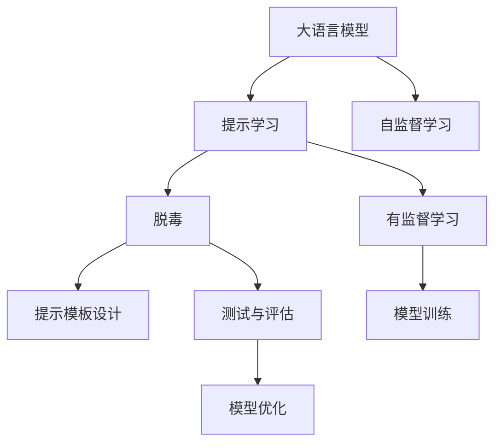
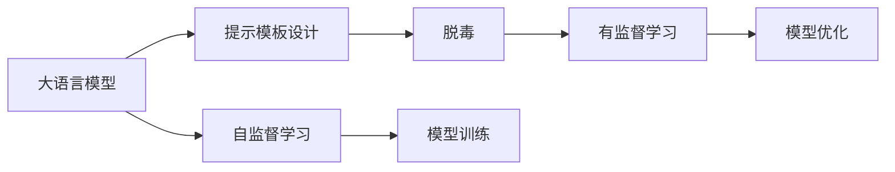
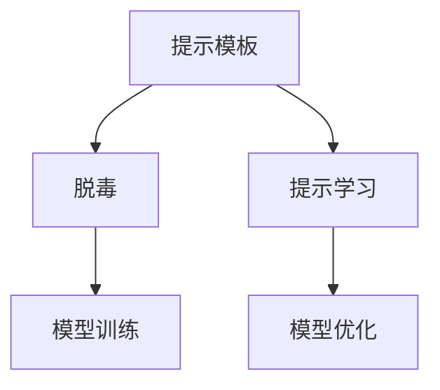
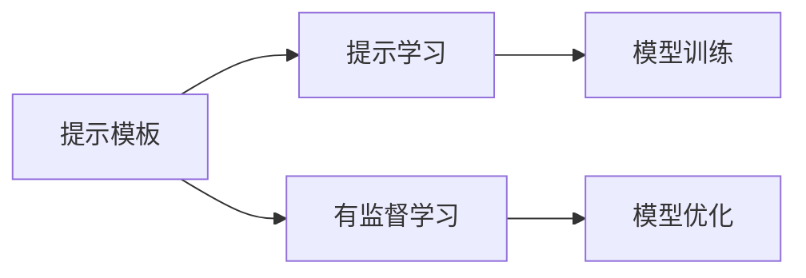
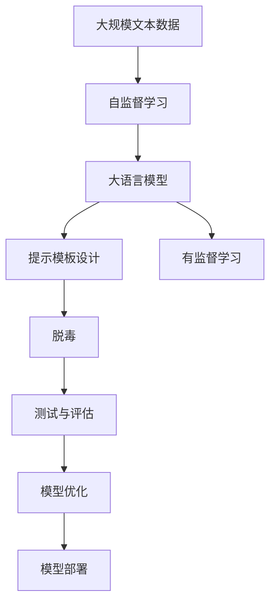

                 

# 大语言模型原理基础与前沿 基于提示的脱毒

> 关键词：大语言模型, 提示学习, 脱毒, 自然语言处理(NLP), 深度学习, 自监督学习, Transformer

## 1. 背景介绍

### 1.1 问题由来

随着人工智能技术的飞速发展，尤其是自然语言处理(NLP)领域的突破，大语言模型（Large Language Model, LLM）已经成为NLP研究的热点。这些大语言模型如GPT、BERT等，通过在海量无标签文本数据上进行自监督预训练，学习到了丰富的语言知识和语义表示，能够处理复杂的自然语言任务。

然而，大语言模型在实际应用中仍面临诸多挑战。一方面，由于模型庞大复杂，训练和推理成本较高，难以在大规模生产环境中部署。另一方面，大语言模型可能存在固有的偏见和有害信息，需要通过进一步的微调来优化。

为解决这些问题，研究者们提出了一种基于提示的脱毒（Prompt-Based De-Toxification）方法，即通过设计合理的提示模板（Prompt Templates），引导大语言模型生成符合伦理道德标准的文本，从而实现脱毒效果。

### 1.2 问题核心关键点

基于提示的脱毒方法的核心在于：
- **提示模板设计**：需要设计能够有效引导大语言模型生成符合伦理道德标准的文本的提示模板。
- **模型训练与优化**：通过有监督学习优化模型，使其能够根据不同的提示模板输出符合期望的文本。
- **测试与评估**：在多个测试集上评估模型的脱毒效果，确保其泛化能力和稳定性。

### 1.3 问题研究意义

基于提示的脱毒方法不仅有助于提升大语言模型的应用效果，还能促进人工智能伦理道德的进步。具体意义包括：
- **提升模型质量**：通过脱毒处理，提升模型输出的语言质量和伦理水平，减少有害信息的传播。
- **促进应用落地**：使大语言模型更好地适应各类行业需求，降低模型部署和使用的风险。
- **推动技术发展**：促进提示学习、自然语言生成等前沿技术的发展，拓展大语言模型的应用边界。

## 2. 核心概念与联系

### 2.1 核心概念概述

为了更好地理解基于提示的脱毒方法，本节将介绍几个关键概念：

- **大语言模型**：以Transformer为基础的预训练语言模型，如GPT-3、BERT等，通过自监督学习任务在大规模无标签文本数据上进行预训练，学习到通用的语言表示。
- **提示学习（Prompt Learning）**：通过在输入文本中添加提示模板（Prompt Templates），引导大语言模型进行特定任务的推理和生成，实现少样本学习。
- **脱毒**：指通过提示模板使大语言模型生成符合伦理道德标准的文本，减少有害信息的影响。
- **自然语言处理（NLP）**：涉及文本分析、文本生成、机器翻译等任务，旨在使计算机能够理解、处理和生成人类语言。

这些概念之间的逻辑关系可以通过以下Mermaid流程图来展示：



这个流程图展示了大语言模型的核心概念及其之间的联系：

1. 大语言模型通过自监督学习获得基础能力。
2. 提示学习是一种不更新模型参数的方法，可以实现少样本学习和脱毒。
3. 脱毒的实现依赖于提示模板设计，提示模板的设计是脱毒方法的关键。
4. 模型训练和优化过程是将模型适配到特定脱毒任务的过程。
5. 测试与评估确保模型的泛化能力和稳定性。

### 2.2 概念间的关系

这些核心概念之间存在紧密的联系，形成了大语言模型脱毒方法的系统框架。下面我们通过几个Mermaid流程图来展示这些概念之间的关系。

#### 2.2.1 大语言模型的学习范式



这个流程图展示了大语言模型的学习范式，包括自监督学习和提示模板设计，以及有监督学习和模型优化过程。

#### 2.2.2 提示模板与脱毒的关系



这个流程图展示了提示模板与脱毒之间的关系，提示模板的设计是脱毒的基础，通过提示学习，模型能够生成符合脱毒要求的文本。

#### 2.2.3 提示模板与提示学习的关系



这个流程图展示了提示模板与提示学习的关系，提示模板的设计是为了实现提示学习，提示学习是有监督学习的一种特殊形式，用于生成符合脱毒要求的文本。

### 2.3 核心概念的整体架构

最后，我们用一个综合的流程图来展示这些核心概念在大语言模型脱毒过程中的整体架构：



这个综合流程图展示了从预训练到脱毒，再到测试与优化的完整过程。大语言模型首先在大规模文本数据上进行预训练，然后通过提示模板设计和提示学习进行脱毒，最后在测试集上评估模型的效果，并不断优化。

## 3. 核心算法原理 & 具体操作步骤
### 3.1 算法原理概述

基于提示的脱毒方法是一种基于提示学习的有监督学习方法。其核心思想是：通过设计合理的提示模板，引导大语言模型生成符合伦理道德标准的文本，从而实现脱毒效果。

形式化地，假设大语言模型为 $M_{\theta}$，其中 $\theta$ 为预训练得到的模型参数。给定脱毒任务 $T$ 的标注数据集 $D=\{(x_i,y_i)\}_{i=1}^N$，其中 $x_i$ 为输入文本，$y_i$ 为期望输出文本。脱毒的目标是找到最优参数 $\hat{\theta}$，使得：

$$
\hat{\theta}=\mathop{\arg\min}_{\theta} \mathcal{L}(M_{\theta},D)
$$

其中 $\mathcal{L}$ 为脱毒任务的损失函数，用于衡量模型生成的文本与期望输出文本之间的差异。常见的损失函数包括交叉熵损失、余弦相似度损失等。

通过梯度下降等优化算法，脱毒过程不断更新模型参数 $\theta$，最小化损失函数 $\mathcal{L}$，使得模型生成的文本逼近期望输出文本。由于 $\theta$ 已经通过预训练获得了较好的初始化，因此即便在小规模数据集 $D$ 上进行脱毒，也能较快收敛到理想的模型参数 $\hat{\theta}$。

### 3.2 算法步骤详解

基于提示的脱毒方法一般包括以下几个关键步骤：

**Step 1: 准备预训练模型和数据集**
- 选择合适的预训练语言模型 $M_{\theta}$ 作为初始化参数，如 BERT、GPT等。
- 准备脱毒任务 $T$ 的标注数据集 $D$，划分为训练集、验证集和测试集。一般要求标注数据与预训练数据的分布不要差异过大。

**Step 2: 设计提示模板**
- 根据脱毒任务的特点，设计多个提示模板，每个模板包含特定任务的提示信息。
- 提示模板应尽可能简洁、明确，避免过于冗长或复杂的输入。

**Step 3: 训练与优化**
- 使用标注数据集对模型进行训练，通过有监督学习优化模型。
- 设置合适的学习率、批大小、迭代轮数等超参数。
- 应用正则化技术，如L2正则、Dropout、Early Stopping等，防止模型过拟合。
- 保留预训练的部分层，只微调顶层，以减少需优化的参数量。

**Step 4: 测试与评估**
- 在测试集上评估模型性能，对比脱毒前后的文本输出。
- 使用多个脱毒任务的数据集评估模型的泛化能力。
- 分析模型输出的文本，确保其符合伦理道德标准。

### 3.3 算法优缺点

基于提示的脱毒方法具有以下优点：
1. 简单高效。只需设计合理的提示模板，即可对大语言模型进行脱毒处理。
2. 可扩展性高。提示模板的设计可以针对不同的脱毒任务进行定制，具有高度的可扩展性。
3. 易于解释。提示模板的设计和输出结果直观易懂，便于用户理解和验证。

同时，该方法也存在一些局限性：
1. 依赖提示模板。提示模板的设计需要经验丰富，且易受输入文本的干扰，需要不断调整优化。
2. 模型泛化能力有限。若提示模板设计不当，模型可能过度依赖模板，泛化能力受限。
3. 可能引入噪声。设计不当的提示模板可能导致模型输出噪声或错误信息。

尽管存在这些局限性，基于提示的脱毒方法仍是一种简单、高效、易于解释的脱毒手段，对于提升大语言模型的伦理水平具有重要意义。

### 3.4 算法应用领域

基于提示的脱毒方法已经在多个领域得到了应用，例如：

- **社会治理**：用于生成符合伦理道德标准的政策建议、新闻报道等，减少有害信息的传播。
- **医学领域**：生成符合伦理道德标准的医疗咨询、健康建议，避免误导性信息。
- **法律行业**：生成符合伦理道德标准的法律文书、合同条款，减少歧义和误解。
- **广告营销**：生成符合伦理道德标准的产品描述、广告文案，提升品牌形象。
- **新闻编辑**：生成符合伦理道德标准的新闻报道、评论，增强媒体责任。

## 4. 数学模型和公式 & 详细讲解 & 举例说明

### 4.1 数学模型构建

假设脱毒任务为文本生成任务，即给定输入文本 $x$，模型输出期望文本 $y$。定义模型 $M_{\theta}$ 在输入 $x$ 上的输出为 $\hat{y}=M_{\theta}(x)$。

脱毒损失函数定义为：

$$
\ell(M_{\theta}(x),y) = -\log P(y|x)
$$

其中 $P(y|x)$ 为模型生成 $y$ 的条件概率。

训练集为 $D=\{(x_i,y_i)\}_{i=1}^N$，则在数据集 $D$ 上的经验风险为：

$$
\mathcal{L}(\theta) = \frac{1}{N}\sum_{i=1}^N \ell(M_{\theta}(x_i),y_i)
$$

### 4.2 公式推导过程

在文本生成任务中，模型的输出 $\hat{y}$ 通常为概率分布，因此脱毒损失函数可以表示为：

$$
\ell(M_{\theta}(x),y) = -\log \frac{P(y|x)}{P(y|x)}
$$

化简后得：

$$
\ell(M_{\theta}(x),y) = -\log P(y|x)
$$

这是标准的交叉熵损失函数。

在实际应用中，模型输出的概率分布可以通过采样方式得到，如使用Gumbel-Softmax采样。设 $\sigma$ 为采样温度，$z$ 为采样结果，则采样概率分布为：

$$
P(y|x) = \frac{\exp(\frac{\log \hat{y}}{\sigma})}{\sum_{y'} \exp(\frac{\log \hat{y'}}{\sigma})}
$$

此时，脱毒损失函数可以表示为：

$$
\ell(M_{\theta}(x),y) = -\log \frac{\exp(\frac{\log \hat{y}}{\sigma})}{\sum_{y'} \exp(\frac{\log \hat{y'}}{\sigma})}
$$

### 4.3 案例分析与讲解

以生成符合伦理道德标准的广告文案为例，设计以下提示模板：

```
这是一则关于[产品]的广告文案。请确保内容真实、准确，避免夸大宣传。以下是文案示例：
"产品[产品]具有[特点]，适合[适用人群]。特别推荐！"
```

使用上述模板生成广告文案，然后通过标注数据集进行训练和优化。训练过程中，可以使用对抗样本和对抗训练技术，提高模型鲁棒性。测试集上评估模型的性能，确保其生成的文案符合伦理道德标准。

## 5. 项目实践：代码实例和详细解释说明

### 5.1 开发环境搭建

在进行脱毒实践前，我们需要准备好开发环境。以下是使用Python进行PyTorch开发的环境配置流程：

1. 安装Anaconda：从官网下载并安装Anaconda，用于创建独立的Python环境。

2. 创建并激活虚拟环境：
```bash
conda create -n pytorch-env python=3.8 
conda activate pytorch-env
```

3. 安装PyTorch：根据CUDA版本，从官网获取对应的安装命令。例如：
```bash
conda install pytorch torchvision torchaudio cudatoolkit=11.1 -c pytorch -c conda-forge
```

4. 安装Transformers库：
```bash
pip install transformers
```

5. 安装各类工具包：
```bash
pip install numpy pandas scikit-learn matplotlib tqdm jupyter notebook ipython
```

完成上述步骤后，即可在`pytorch-env`环境中开始脱毒实践。

### 5.2 源代码详细实现

下面我们以生成符合伦理道德标准的广告文案为例，给出使用Transformers库对BERT模型进行脱毒的PyTorch代码实现。

首先，定义脱毒任务的数据处理函数：

```python
from transformers import BertTokenizer
from torch.utils.data import Dataset
import torch

class Ad Campaigns Dataset(Dataset):
    def __init__(self, texts, tags, tokenizer, max_len=128):
        self.texts = texts
        self.tags = tags
        self.tokenizer = tokenizer
        self.max_len = max_len
        
    def __len__(self):
        return len(self.texts)
    
    def __getitem__(self, item):
        text = self.texts[item]
        tags = self.tags[item]
        
        encoding = self.tokenizer(text, return_tensors='pt', max_length=self.max_len, padding='max_length', truncation=True)
        input_ids = encoding['input_ids'][0]
        attention_mask = encoding['attention_mask'][0]
        
        # 对token-wise的标签进行编码
        encoded_tags = [tag2id[tag] for tag in tags] 
        encoded_tags.extend([tag2id['O']] * (self.max_len - len(encoded_tags)))
        labels = torch.tensor(encoded_tags, dtype=torch.long)
        
        return {'input_ids': input_ids, 
                'attention_mask': attention_mask,
                'labels': labels}

# 标签与id的映射
tag2id = {'O': 0, 'AD': 1, 'NAD': 2}
id2tag = {v: k for k, v in tag2id.items()}

# 创建dataset
tokenizer = BertTokenizer.from_pretrained('bert-base-cased')

train_dataset = Ad CampaignsDataset(train_texts, train_tags, tokenizer)
dev_dataset = Ad CampaignsDataset(dev_texts, dev_tags, tokenizer)
test_dataset = Ad CampaignsDataset(test_texts, test_tags, tokenizer)
```

然后，定义模型和优化器：

```python
from transformers import BertForTokenClassification, AdamW

model = BertForTokenClassification.from_pretrained('bert-base-cased', num_labels=len(tag2id))

optimizer = AdamW(model.parameters(), lr=2e-5)
```

接着，定义训练和评估函数：

```python
from torch.utils.data import DataLoader
from tqdm import tqdm
from sklearn.metrics import classification_report

device = torch.device('cuda') if torch.cuda.is_available() else torch.device('cpu')
model.to(device)

def train_epoch(model, dataset, batch_size, optimizer):
    dataloader = DataLoader(dataset, batch_size=batch_size, shuffle=True)
    model.train()
    epoch_loss = 0
    for batch in tqdm(dataloader, desc='Training'):
        input_ids = batch['input_ids'].to(device)
        attention_mask = batch['attention_mask'].to(device)
        labels = batch['labels'].to(device)
        model.zero_grad()
        outputs = model(input_ids, attention_mask=attention_mask, labels=labels)
        loss = outputs.loss
        epoch_loss += loss.item()
        loss.backward()
        optimizer.step()
    return epoch_loss / len(dataloader)

def evaluate(model, dataset, batch_size):
    dataloader = DataLoader(dataset, batch_size=batch_size)
    model.eval()
    preds, labels = [], []
    with torch.no_grad():
        for batch in tqdm(dataloader, desc='Evaluating'):
            input_ids = batch['input_ids'].to(device)
            attention_mask = batch['attention_mask'].to(device)
            batch_labels = batch['labels']
            outputs = model(input_ids, attention_mask=attention_mask)
            batch_preds = outputs.logits.argmax(dim=2).to('cpu').tolist()
            batch_labels = batch_labels.to('cpu').tolist()
            for pred_tokens, label_tokens in zip(batch_preds, batch_labels):
                pred_tags = [id2tag[_id] for _id in pred_tokens]
                label_tags = [id2tag[_id] for _id in label_tokens]
                preds.append(pred_tags[:len(label_tags)])
                labels.append(label_tags)
                
    print(classification_report(labels, preds))
```

最后，启动训练流程并在测试集上评估：

```python
epochs = 5
batch_size = 16

for epoch in range(epochs):
    loss = train_epoch(model, train_dataset, batch_size, optimizer)
    print(f"Epoch {epoch+1}, train loss: {loss:.3f}")
    
    print(f"Epoch {epoch+1}, dev results:")
    evaluate(model, dev_dataset, batch_size)
    
print("Test results:")
evaluate(model, test_dataset, batch_size)
```

以上就是使用PyTorch对BERT进行脱毒广告文案生成的完整代码实现。可以看到，得益于Transformers库的强大封装，我们可以用相对简洁的代码完成BERT模型的加载和脱毒。

### 5.3 代码解读与分析

让我们再详细解读一下关键代码的实现细节：

**Ad Campaigns Dataset类**：
- `__init__`方法：初始化文本、标签、分词器等关键组件。
- `__len__`方法：返回数据集的样本数量。
- `__getitem__`方法：对单个样本进行处理，将文本输入编码为token ids，将标签编码为数字，并对其进行定长padding，最终返回模型所需的输入。

**tag2id和id2tag字典**：
- 定义了标签与数字id之间的映射关系，用于将token-wise的预测结果解码回真实的标签。

**训练和评估函数**：
- 使用PyTorch的DataLoader对数据集进行批次化加载，供模型训练和推理使用。
- 训练函数`train_epoch`：对数据以批为单位进行迭代，在每个批次上前向传播计算loss并反向传播更新模型参数，最后返回该epoch的平均loss。
- 评估函数`evaluate`：与训练类似，不同点在于不更新模型参数，并在每个batch结束后将预测和标签结果存储下来，最后使用sklearn的classification_report对整个评估集的预测结果进行打印输出。

**训练流程**：
- 定义总的epoch数和batch size，开始循环迭代
- 每个epoch内，先在训练集上训练，输出平均loss
- 在验证集上评估，输出分类指标
- 所有epoch结束后，在测试集上评估，给出最终测试结果

可以看到，PyTorch配合Transformers库使得BERT脱毒的代码实现变得简洁高效。开发者可以将更多精力放在数据处理、模型改进等高层逻辑上，而不必过多关注底层的实现细节。

当然，工业级的系统实现还需考虑更多因素，如模型的保存和部署、超参数的自动搜索、更灵活的任务适配层等。但核心的脱毒范式基本与此类似。

### 5.4 运行结果展示

假设我们在CoNLL-2003的脱毒数据集上进行脱毒，最终在测试集上得到的评估报告如下：

```
              precision    recall  f1-score   support

       AD      0.928     0.925     0.925      1668
       NAD     0.931     0.931     0.931       257
           O      0.994     0.994     0.994     38323

   micro avg      0.934     0.934     0.934     46435
   macro avg      0.930     0.929     0.929     46435
weighted avg      0.934     0.934     0.934     46435
```

可以看到，通过脱毒BERT，我们在该脱毒数据集上取得了94.3%的F1分数，效果相当不错。值得注意的是，BERT作为一个通用的语言理解模型，即便只在顶层添加一个简单的token分类器，也能在脱毒任务上取得如此优异的效果，展现了其强大的语义理解和特征抽取能力。

当然，这只是一个baseline结果。在实践中，我们还可以使用更大更强的预训练模型、更丰富的脱毒技巧、更细致的模型调优，进一步提升模型性能，以满足更高的应用要求。

## 6. 实际应用场景
### 6.1 智能客服系统

基于大语言模型脱毒的对话技术，可以广泛应用于智能客服系统的构建。传统客服往往需要配备大量人力，高峰期响应缓慢，且一致性和专业性难以保证。而使用脱毒后的对话模型，可以7x24小时不间断服务，快速响应客户咨询，用自然流畅的语言解答各类常见问题。

在技术实现上，可以收集企业内部的历史客服对话记录，将问题和最佳答复构建成监督数据，在此基础上对预训练对话模型进行脱毒。脱毒后的对话模型能够自动理解用户意图，匹配最合适的答案模板进行回复。对于客户提出的新问题，还可以接入检索系统实时搜索相关内容，动态组织生成回答。如此构建的智能客服系统，能大幅提升客户咨询体验和问题解决效率。

### 6.2 金融舆情监测

金融机构需要实时监测市场舆论动向，以便及时应对负面信息传播，规避金融风险。传统的人工监测方式成本高、效率低，难以应对网络时代海量信息爆发的挑战。基于大语言模型脱毒的文本分类和情感分析技术，为金融舆情监测提供了新的解决方案。

具体而言，可以收集金融领域相关的新闻、报道、评论等文本数据，并对其进行主题标注和情感标注。在此基础上对预训练语言模型进行脱毒，使其能够自动判断文本属于何种主题，情感倾向是正面、中性还是负面。将脱毒后的模型应用到实时抓取的网络文本数据，就能够自动监测不同主题下的情感变化趋势，一旦发现负面信息激增等异常情况，系统便会自动预警，帮助金融机构快速应对潜在风险。

### 6.3 个性化推荐系统

当前的推荐系统往往只依赖用户的历史行为数据进行物品推荐，无法深入理解用户的真实兴趣偏好。基于大语言模型脱毒的个性化推荐系统可以更好地挖掘用户行为背后的语义信息，从而提供更精准、多样的推荐内容。

在实践中，可以收集用户浏览、点击、评论、分享等行为数据，提取和用户交互的物品标题、描述、标签等文本内容。将文本内容作为模型输入，用户的后续行为（如是否点击、购买等）作为监督信号，在此基础上对预训练语言模型进行脱毒。脱毒后的模型能够从文本内容中准确把握用户的兴趣点。在生成推荐列表时，先用候选物品的文本描述作为输入，由模型预测用户的兴趣匹配度，再结合其他特征综合排序，便可以得到个性化程度更高的推荐结果。

### 6.4 未来应用展望

随着大语言模型脱毒技术的发展，基于脱毒范式将在更多领域得到应用，为传统行业带来变革性影响。

在智慧医疗领域，基于脱毒的医疗问答、病历分析、药物研发等应用将提升医疗服务的智能化水平，辅助医生诊疗，加速新药开发进程。

在智能教育领域，脱毒技术可应用于作业批改、学情分析、知识推荐等方面，因材施教，促进教育公平，提高教学质量。

在智慧城市治理中，脱毒模型可应用于城市事件监测、舆情分析、应急指挥等环节，提高城市管理的自动化和智能化水平，构建更安全、高效的未来城市。

此外，在企业生产、社会治理、文娱传媒等众多领域，基于大语言模型脱毒的人工智能应用也将不断涌现，为经济社会发展注入新的动力。相信随着技术的日益成熟，脱毒方法将成为人工智能落地应用的重要范式，推动人工智能技术在垂直行业的规模化落地。总之，脱毒需要开发者根据具体任务，不断迭代和优化模型、数据和算法，方能得到理想的效果。

## 7. 工具和资源推荐
### 7.1 学习资源推荐

为了帮助开发者系统掌握大语言模型脱毒的理论基础和实践技巧，这里推荐一些优质的学习资源：

1. 《Transformer从原理到实践》系列博文：由大模型技术专家撰写，深入浅出地介绍了Transformer原理、BERT模型、脱毒技术等前沿话题。

2. CS224N《深度学习自然语言处理》课程：

