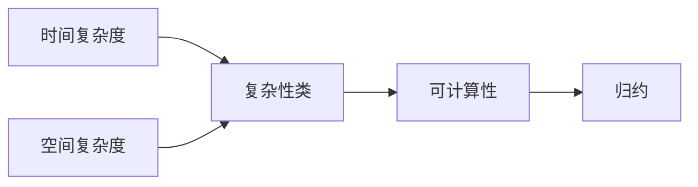

# 计算：第四部分 计算的极限 第 11 章 复杂性计算 什么是复杂

作者：禅与计算机程序设计艺术 / Zen and the Art of Computer Programming

## 1. 背景介绍

### 1.1  问题的由来

计算复杂性理论是计算机科学和数学中的一个重要分支,它研究计算问题的内在难度以及解决这些问题所需的资源(如时间和空间)。随着计算机科学的发展,人们开始关注计算的极限,即哪些问题是可计算的,哪些问题是难以计算的。这就引出了复杂性计算的概念,即研究计算问题的内在复杂性以及解决这些问题所需的资源。

### 1.2  研究现状

目前,复杂性计算已经成为计算机科学和数学中的一个重要研究方向。人们已经提出了许多复杂性类,如P、NP、PSPACE等,并研究了它们之间的关系。同时,人们也提出了许多经典的复杂性问题,如旅行商问题、背包问题等,并研究了它们的复杂性。此外,复杂性计算也被应用于密码学、人工智能、生物信息学等领域,成为这些领域的重要理论基础。

### 1.3  研究意义

复杂性计算的研究意义主要体现在以下几个方面:

1. 理论意义:复杂性计算是计算机科学和数学中的一个重要分支,它为研究计算的本质提供了理论基础。通过研究复杂性计算,我们可以更好地理解计算的极限以及计算问题的内在难度。

2. 实践意义:复杂性计算的研究成果可以应用于许多领域,如算法设计、密码学、人工智能等。通过研究复杂性计算,我们可以设计出更加高效、安全的算法,推动这些领域的发展。

3. 教育意义:复杂性计算是计算机科学和数学教育中的一个重要内容。通过学习复杂性计算,学生可以培养抽象思维和逻辑推理能力,提高解决问题的能力。

### 1.4  本文结构

本文将从以下几个方面介绍复杂性计算:

1. 核心概念与联系:介绍复杂性计算的核心概念,如时间复杂度、空间复杂度、复杂性类等,并分析它们之间的联系。

2. 核心算法原理与具体操作步骤:介绍复杂性计算中的经典算法,如动态规划、贪心算法等,并详细讲解它们的原理和操作步骤。

3. 数学模型和公式:介绍复杂性计算中的数学模型和公式,如大O符号、主定理等,并通过案例分析和举例说明它们的应用。

4. 项目实践:通过代码实例和详细解释,展示如何在实际项目中应用复杂性计算的理论和方法。

5. 实际应用场景:介绍复杂性计算在密码学、人工智能、生物信息学等领域的应用,并展望未来的发展趋势。

6. 工具和资源推荐:推荐学习复杂性计算的相关资源,如书籍、论文、开发工具等。

7. 总结:总结复杂性计算的研究成果,分析未来的发展趋势和面临的挑战,并对未来的研究方向进行展望。

8. 附录:列出复杂性计算中的常见问题与解答,方便读者查阅和学习。

## 2. 核心概念与联系

复杂性计算中有许多核心概念,它们之间存在着紧密的联系。下面我们将介绍几个最重要的概念:

1. 时间复杂度:指执行一个算法所需的时间资源,通常用大O符号表示。时间复杂度是衡量算法效率的重要指标之一。

2. 空间复杂度:指执行一个算法所需的空间资源,通常用大O符号表示。空间复杂度也是衡量算法效率的重要指标之一。

3. 复杂性类:根据问题的难度将问题分为不同的复杂性类,如P类、NP类、PSPACE类等。不同的复杂性类之间存在着包含关系。

4. 可计算性:研究哪些问题是可以通过算法解决的,哪些问题是无法通过算法解决的。可计算性是复杂性计算的理论基础。

5. 归约:将一个问题转化为另一个问题,从而证明两个问题的复杂性是相同的。归约是研究复杂性类之间关系的重要工具。

这些概念之间存在着紧密的联系,如下图所示:



从图中可以看出,时间复杂度和空间复杂度是衡量算法效率的重要指标,它们决定了问题属于哪个复杂性类。复杂性类反映了问题的可计算性,即问题是否可以通过算法解决。而归约则是研究复杂性类之间关系的重要工具,通过归约可以证明不同问题之间的复杂性是相同的。

## 3. 核心算法原理 & 具体操作步骤

### 3.1  算法原理概述

复杂性计算中有许多经典的算法,如动态规划、贪心算法、回溯算法等。这些算法都有其独特的原理和适用场景。下面我们以动态规划为例,介绍其基本原理。

动态规划是一种通过将问题分解为子问题,并存储子问题的解来避免重复计算的算法。它适用于具有最优子结构和重叠子问题的问题。动态规划的基本思想是:将问题分解为若干个子问题,先求解子问题,然后根据子问题的解得到原问题的解。

### 3.2  算法步骤详解

以斐波那契数列为例,介绍动态规划的具体步骤:

1. 定义状态:设 $f(n)$ 表示第 $n$ 个斐波那契数的值。

2. 找出状态转移方程:根据斐波那契数列的定义,可以得到状态转移方程:

$$
f(n) = \begin{cases}
0, & n=0 \
1, & n=1 \
f(n-1) + f(n-2), & n>1
\end{cases}
$$

3. 设置初始状态:根据状态转移方程,设置初始状态 $f(0)=0$, $f(1)=1$。

4. 按顺序计算每个状态的值:根据状态转移方程,按顺序计算 $f(2)$, $f(3)$, ..., $f(n)$ 的值。

5. 输出最终结果:输出 $f(n)$ 的值即为第 $n$ 个斐波那契数。

### 3.3  算法优缺点

动态规划的优点是:

1. 避免了重复计算,提高了算法效率。

2. 可以解决一些递归算法无法解决的问题,如最长公共子序列问题。

动态规划的缺点是:

1. 需要额外的空间来存储子问题的解,空间复杂度较高。

2. 状态转移方程不易找出,对问题的分析和抽象要求较高。

### 3.4  算法应用领域

动态规划在许多领域都有应用,如:

1. 字符串匹配:如最长公共子序列问题、编辑距离问题等。

2. 资源分配:如背包问题、最优二叉搜索树问题等。

3. 最短路径:如Floyd算法、Dijkstra算法等。

4. 博弈论:如石子游戏、Nim游戏等。

## 4. 数学模型和公式 & 详细讲解 & 举例说明

### 4.1  数学模型构建

在复杂性计算中,我们经常需要使用数学模型来描述问题和算法。下面我们以时间复杂度为例,介绍如何构建数学模型。

设 $T(n)$ 表示算法在输入规模为 $n$ 时的时间复杂度,则 $T(n)$ 可以表示为:

$$
T(n) = O(f(n))
$$

其中, $f(n)$ 是一个函数,表示算法的时间复杂度的上界。常见的时间复杂度有:

- $O(1)$:常数阶,表示算法的时间复杂度与输入规模无关。

- $O(\log n)$:对数阶,表示算法的时间复杂度与输入规模的对数成正比。

- $O(n)$:线性阶,表示算法的时间复杂度与输入规模成正比。

- $O(n^2)$:平方阶,表示算法的时间复杂度与输入规模的平方成正比。

- $O(2^n)$:指数阶,表示算法的时间复杂度与输入规模的指数成正比。

### 4.2  公式推导过程

下面我们以归并排序为例,推导其时间复杂度的公式。

归并排序的基本思想是:将待排序数组分成两个子数组,对子数组递归地进行归并排序,然后将排好序的子数组合并成一个有序数组。设归并排序的时间复杂度为 $T(n)$,则有:

$$
T(n) = \begin{cases}
O(1), & n=1 \
2T(n/2) + O(n), & n>1
\end{cases}
$$

其中, $2T(n/2)$ 表示对两个子数组进行归并排序的时间复杂度, $O(n)$ 表示将两个有序子数组合并成一个有序数组的时间复杂度。

根据主定理,可以得到归并排序的时间复杂度为:

$$
T(n) = O(n\log n)
$$

### 4.3  案例分析与讲解

下面我们以一个具体的例子来说明归并排序的过程。

假设我们要对数组 $[5, 2, 4, 7, 1, 3, 2, 6]$ 进行归并排序,则过程如下:

1. 将数组分成两个子数组: $[5, 2, 4, 7]$ 和 $[1, 3, 2, 6]$。

2. 对子数组 $[5, 2, 4, 7]$ 进行归并排序,得到有序子数组 $[2, 4, 5, 7]$。

3. 对子数组 $[1, 3, 2, 6]$ 进行归并排序,得到有序子数组 $[1, 2, 3, 6]$。

4. 将两个有序子数组合并成一个有序数组,得到最终结果 $[1, 2, 2, 3, 4, 5, 6, 7]$。

### 4.4  常见问题解答

1. 问:归并排序的空间复杂度是多少?

答:归并排序的空间复杂度是 $O(n)$,因为在合并两个有序子数组时,需要使用一个临时数组来存储合并后的结果。

2. 问:归并排序是稳定的排序算法吗?

答:是的,归并排序是稳定的排序算法。在合并两个有序子数组时,如果两个元素相等,我们可以先将左子数组中的元素放入临时数组,这样就可以保证相等元素的相对顺序不变。

## 5. 项目实践：代码实例和详细解释说明

### 5.1  开发环境搭建

在进行项目实践之前,我们需要搭建开发环境。以 Python 为例,我们需要安装 Python 解释器和集成开发环境(如 PyCharm)。

### 5.2  源代码详细实现

下面是归并排序的 Python 实现:

```python
def merge_sort(arr):
    if len(arr) <= 1:
        return arr
    mid = len(arr) // 2
    left = merge_sort(arr[:mid])
    right = merge_sort(arr[mid:])
    return merge(left, right)

def merge(left, right):
    result = []
    i = j = 0
    while i < len(left) and j < len(right):
        if left[i] <= right[j]:
            result.append(left[i])
            i += 1
        else:
            result.append(right[j])
            j += 1
    result += left[i:]
    result += right[j:]
    return result
```

### 5.3  代码解读与分析

1. `merge_sort` 函数:
   - 如果数组长度小于等于1,直接返回数组(递归基)。
   - 将数组分成两个子数组 `left` 和 `right`,递归地对它们进行归并排序。
   - 调