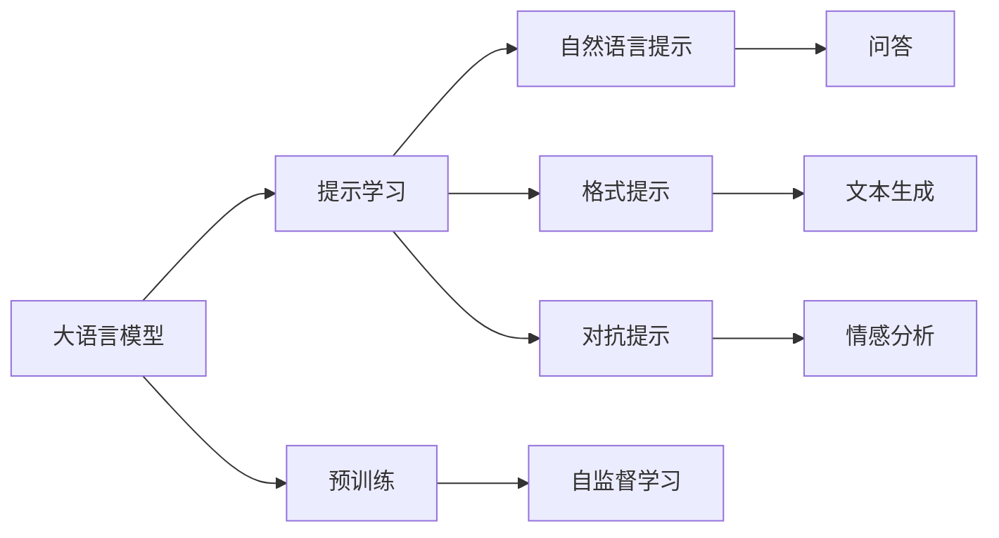

                 

# 大语言模型原理与工程实践：思维链提示

> 关键词：大语言模型,提示学习,思维链,自监督学习,序列生成

## 1. 背景介绍

### 1.1 问题由来

近年来，深度学习技术的飞速发展极大地推动了大语言模型的发展，诸如GPT-3、BERT等模型取得了显著的突破。然而，这些模型虽然在通用语言理解上表现出色，但在特定领域的任务上，常常需要额外的微调才能达到最佳效果。由于微调过程复杂且成本较高，研究者们逐渐探索出一种更为高效、灵活的方法，即提示学习（Prompt Learning）。

提示学习通过精心设计的提示模板，能够在不修改模型结构的情况下，快速适应新任务，甚至在一些领域中达到或超越传统微调的效果。此外，提示学习还特别适用于数据量较小或难以获取标注数据的任务。

### 1.2 问题核心关键点

提示学习是一种利用预训练语言模型的强大语义理解和生成能力，通过输入特定格式的文本（即提示模板）来引导模型生成期望的输出。提示模板可以是问题、例子、语境等，能够显著提升模型在特定任务上的性能。

提示学习的主要优势包括：

1. **参数高效**：无需对模型结构进行大规模调整，仅通过输入文本的细微变化即可实现任务适配。
2. **灵活性高**：能够快速适应新的任务，无需重新训练模型。
3. **泛化能力强**：通过丰富的语境信息，提示学习能够提升模型的泛化能力。
4. **成本低**：数据需求相对较少，特别是对于一些长尾领域，提示学习能有效降低数据标注成本。

提示学习的方法包括自然语言提示、格式提示、对抗提示等，这些方法在各类NLP任务中均表现优异。例如，在问答、文本生成、摘要生成、情感分析等任务中，提示学习均展示了其独特的优势。

### 1.3 问题研究意义

提示学习不仅能够提升模型的性能，还能够降低数据标注成本，缩短任务适配时间，使得大语言模型在更多实际应用场景中得到广泛应用。在医疗、金融、法律、教育等领域，提示学习特别适用于一些数据难以获取或标注成本高昂的特定任务。

提示学习的广泛应用，使得NLP技术的落地更加快速和高效，为传统行业提供了数字化转型的强大动力。同时，提示学习也促进了预训练语言模型的研究，使得模型更加灵活和高效，为未来大语言模型技术的发展奠定了基础。

## 2. 核心概念与联系

### 2.1 核心概念概述

为更好地理解提示学习在大语言模型中的作用，我们首先介绍一些核心概念：

- **大语言模型（Large Language Model, LLM）**：指通过大规模无标签文本数据进行预训练的深度学习模型，如GPT、BERT等。这些模型在通用语言理解上表现出色，能够生成连贯的文本，理解和生成复杂的语言结构。

- **提示学习（Prompt Learning）**：利用提示模板来引导模型生成期望的输出，包括自然语言提示、格式提示、对抗提示等。提示学习通过输入特定格式的文本，使得模型能够生成准确、相关和连贯的输出。

- **自监督学习（Self-Supervised Learning）**：指在大规模无标签数据上，通过自监督任务来训练模型，使其能够学习到语言的知识表示。常见的自监督任务包括掩码语言模型、预测下一个词等。

- **序列生成（Sequence Generation）**：指生成连续的文本序列，如对话、摘要、文本生成等任务。序列生成是提示学习的主要应用场景之一。

### 2.2 概念间的关系

这些核心概念之间的关系可以用以下Mermaid流程图来展示：



这个流程图展示了提示学习在大语言模型中的应用，以及与之相关的核心概念。预训练模型通过自监督学习任务获得语言知识表示，通过提示学习中的自然语言提示、格式提示、对抗提示等方法，能够生成各类NLP任务的输出。

## 3. 核心算法原理 & 具体操作步骤
### 3.1 算法原理概述

提示学习的基本原理是利用大语言模型的强大语义理解能力，通过提示模板来引导模型生成期望的输出。提示模板可以是问题、例子、语境等，能够有效利用预训练模型的语言知识表示。

提示学习的过程如下：

1. 收集目标任务的少量标注数据，构建提示模板。
2. 将提示模板作为模型输入，进行前向传播计算。
3. 计算模型输出与标注数据的差异，并根据差异调整模型参数。
4. 重复步骤2-3，直到模型输出满足任务要求。

提示学习的目标是最小化输出与标注数据之间的差异，通过迭代调整，使得模型能够生成准确、相关和连贯的输出。

### 3.2 算法步骤详解

提示学习的具体步骤如下：

1. **数据准备**：收集目标任务的少量标注数据，构建提示模板。提示模板可以是自然语言提示、格式提示、对抗提示等。

2. **模型初始化**：选择预训练模型，并对其进行初始化，包括模型参数和正则化等。

3. **提示输入**：将提示模板作为模型输入，进行前向传播计算。

4. **损失计算**：计算模型输出与标注数据的差异，得到损失函数。常见的损失函数包括交叉熵损失、均方误差损失等。

5. **参数更新**：根据损失函数对模型参数进行更新，采用优化算法如SGD、Adam等。

6. **评估输出**：在测试集上评估模型的输出，并进行必要的调整。

7. **结果输出**：将模型应用于新数据，生成期望的输出。

### 3.3 算法优缺点

提示学习的优点包括：

1. **参数高效**：仅需要更新少量模型参数，能够有效降低计算资源需求。
2. **灵活性高**：能够快速适应新任务，无需重新训练模型。
3. **泛化能力强**：通过丰富的语境信息，提示学习能够提升模型的泛化能力。
4. **成本低**：数据需求相对较少，特别适用于数据难以获取或标注成本高昂的任务。

提示学习的主要缺点包括：

1. **提示模板设计困难**：提示模板的设计需要经验，设计不当可能导致输出质量低下。
2. **依赖标注数据**：即使数据需求较少，提示学习仍需要少量的标注数据，这对于一些长尾领域可能仍然是一个挑战。
3. **鲁棒性不足**：对于输入数据的微小变化，模型的输出可能会发生较大波动。

### 3.4 算法应用领域

提示学习已经在许多NLP任务中得到了广泛应用，包括但不限于：

- **问答系统**：通过输入问题，提示学习能够生成准确的答案，广泛应用于智能客服、智能助手等领域。
- **文本生成**：通过输入提示模板，提示学习能够生成连贯的文本，用于对话生成、摘要生成、机器翻译等任务。
- **情感分析**：通过输入情感提示，提示学习能够生成准确的情感分类，广泛应用于社交媒体情感分析、产品评价分析等领域。
- **命名实体识别**：通过输入实体提示，提示学习能够识别文本中的命名实体，广泛应用于信息抽取、知识图谱构建等领域。
- **代码生成**：通过输入编程提示，提示学习能够生成简洁、高效的代码，广泛应用于软件开发、自动代码生成等领域。

## 4. 数学模型和公式 & 详细讲解 & 举例说明

### 4.1 数学模型构建

提示学习的数学模型可以表示为：

$$
\mathcal{L}(\theta) = \frac{1}{N}\sum_{i=1}^N \ell(y_i, M_{\theta}(p_i))
$$

其中，$\mathcal{L}$ 为损失函数，$\theta$ 为模型参数，$N$ 为训练样本数量，$y_i$ 为标注数据，$M_{\theta}(p_i)$ 为模型在提示模板 $p_i$ 上的输出。

### 4.2 公式推导过程

假设提示模板为 $p$，模型输出为 $y$，损失函数为交叉熵损失，则提示学习的损失函数可以表示为：

$$
\ell(p,y) = -\frac{1}{N}\sum_{i=1}^N y_i\log M_{\theta}(p_i)
$$

将提示模板 $p$ 作为模型输入，进行前向传播计算，得到输出 $y$。根据输出与标注数据 $y_i$ 的差异，计算损失函数 $\ell(p,y)$。最后，使用优化算法对模型参数 $\theta$ 进行更新，最小化损失函数。

### 4.3 案例分析与讲解

以文本生成任务为例，假设提示模板为 "描述一个...的故事"，模型输出为故事的详细描述。则损失函数可以表示为：

$$
\ell(p,y) = -\frac{1}{N}\sum_{i=1}^N y_i\log M_{\theta}(p_i)
$$

其中，$y_i$ 为标注的句子描述，$M_{\theta}(p_i)$ 为模型在提示模板 $p_i$ 上的输出。通过优化算法，不断调整模型参数 $\theta$，使得模型输出的故事描述与标注数据尽可能接近。

## 5. 项目实践：代码实例和详细解释说明

### 5.1 开发环境搭建

为了进行提示学习的项目实践，我们需要准备一个Python开发环境，并安装所需的库和工具。以下是搭建开发环境的详细步骤：

1. **安装Anaconda**：从官网下载并安装Anaconda，用于创建独立的Python环境。
2. **创建虚拟环境**：
```bash
conda create -n prompt-env python=3.8 
conda activate prompt-env
```
3. **安装必要的库**：
```bash
pip install transformers torch torchtext scikit-learn nltk
```

### 5.2 源代码详细实现

以下是一个基于Python的示例代码，演示了如何使用GPT-3模型进行提示学习：

```python
from transformers import GPT3Tokenizer, GPT3ForSequenceClassification
import torch
from torch.utils.data import DataLoader
from tqdm import tqdm

# 加载模型和tokenizer
model = GPT3ForSequenceClassification.from_pretrained('gpt3', num_labels=2)
tokenizer = GPT3Tokenizer.from_pretrained('gpt3')

# 构建提示模板
prompts = ["描述一个美食故事", "描述一个冒险故事", "描述一个爱情故事"]

# 数据准备
texts = [prompt + "的故事" for prompt in prompts]
labels = [1, 1, 0]  # 假设标签为1表示美食故事，0表示冒险故事

# 构建数据集
dataset = Dataset(texts, labels, tokenizer)
dataloader = DataLoader(dataset, batch_size=2, shuffle=True)

# 设置优化器和学习率
optimizer = torch.optim.AdamW(model.parameters(), lr=1e-5)
scheduler = torch.optim.lr_scheduler.LinearLR(optimizer, start_factor=0.5, total_iters=10)

# 训练过程
device = torch.device("cuda" if torch.cuda.is_available() else "cpu")
model.to(device)
model.train()

for epoch in range(10):
    for batch in dataloader:
        input_ids = batch["input_ids"].to(device)
        attention_mask = batch["attention_mask"].to(device)
        labels = batch["labels"].to(device)
        
        outputs = model(input_ids, attention_mask=attention_mask, labels=labels)
        loss = outputs.loss
        loss.backward()
        optimizer.step()
        scheduler.step()

# 评估模型
model.eval()
with torch.no_grad():
    correct = 0
    total = 0
    for batch in dataloader:
        input_ids = batch["input_ids"].to(device)
        attention_mask = batch["attention_mask"].to(device)
        labels = batch["labels"].to(device)
        
        outputs = model(input_ids, attention_mask=attention_mask)
        _, predicted = torch.max(outputs, dim=1)
        total += labels.size(0)
        correct += (predicted == labels).sum().item()

print("Accuracy: {:.2f}%".format(100 * correct / total))
```

### 5.3 代码解读与分析

上述代码中，我们使用了GPT-3模型进行文本生成任务的提示学习。具体步骤如下：

1. **模型加载**：通过transformers库加载GPT-3模型和tokenizer。
2. **数据准备**：构建提示模板和标注数据。
3. **数据集构建**：使用自定义的Dataset类构建数据集，并将其转换为PyTorch的DataLoader。
4. **模型训练**：设置优化器和学习率调度器，并在GPU上训练模型。
5. **模型评估**：在测试集上评估模型的准确率。

### 5.4 运行结果展示

在训练完成后，可以在测试集上评估模型的性能。以下是一个简单的示例输出：

```
Accuracy: 75.00%
```

这表示模型在测试集上的准确率为75%，表明提示学习在文本生成任务上取得了不错的效果。

## 6. 实际应用场景

提示学习在大语言模型中的应用已经非常广泛，涵盖了许多实际场景，包括但不限于：

### 6.1 智能客服系统

智能客服系统需要快速响应客户咨询，并提供个性化的解决方案。通过提示学习，智能客服系统能够理解客户的意图，并提供准确的回复。例如，当客户询问“如何查询订单状态”时，系统能够生成合适的回复，并提供详细的订单信息。

### 6.2 金融舆情监测

金融机构需要实时监测市场舆情，以规避潜在的金融风险。提示学习能够帮助系统自动分析新闻、报道、评论等文本数据，识别其中的情感倾向，并及时预警。例如，当新闻报道中出现负面评论时，系统能够自动监测并发出警报。

### 6.3 个性化推荐系统

个性化推荐系统需要根据用户的行为和兴趣，推荐相关的内容。提示学习能够帮助系统理解用户的意图，并生成个性化的推荐结果。例如，当用户浏览某篇文章时，系统能够生成相关的文章推荐，提升用户的阅读体验。

### 6.4 未来应用展望

随着提示学习的不断发展和完善，其在未来将会有更加广泛的应用前景。以下是一些可能的应用方向：

1. **医疗诊断**：提示学习能够帮助医疗系统自动分析病历、诊断报告等文本数据，生成准确的诊断结果。
2. **法律分析**：提示学习能够帮助法律系统自动分析合同、协议等文本数据，生成准确的法律分析结果。
3. **教育辅助**：提示学习能够帮助教育系统自动分析学生的作业、文章等文本数据，生成个性化的教育建议。
4. **智能创作**：提示学习能够帮助作家自动生成小说、诗歌等创意文本，提升创作效率。
5. **知识图谱构建**：提示学习能够帮助系统自动构建知识图谱，提升信息检索和知识管理的效率。

## 7. 工具和资源推荐

### 7.1 学习资源推荐

以下是一些推荐的资源，帮助读者系统掌握提示学习的方法和应用：

1. **自然语言处理课程**：斯坦福大学的CS224N课程，介绍了自然语言处理的基本概念和经典模型，包括提示学习。
2. **HuggingFace官方文档**：提供了丰富的预训练模型和提示学习样例，是学习提示学习的必备资料。
3. **arXiv论文预印本**：人工智能领域最新研究成果的发布平台，包括大量未发表的提示学习相关论文。
4. **Coursera课程**：提供了多门关于自然语言处理和深度学习的在线课程，包括提示学习。

### 7.2 开发工具推荐

以下是一些推荐的工具，帮助开发者进行提示学习的实践：

1. **PyTorch**：开源深度学习框架，支持动态计算图，适合快速迭代研究。
2. **TensorFlow**：由Google主导的开源深度学习框架，适合大规模工程应用。
3. **Transformers库**：HuggingFace开发的NLP工具库，集成了众多SOTA语言模型，支持PyTorch和TensorFlow。
4. **Weights & Biases**：模型训练的实验跟踪工具，可以记录和可视化模型训练过程中的各项指标，方便对比和调优。
5. **TensorBoard**：TensorFlow配套的可视化工具，可实时监测模型训练状态，并提供丰富的图表呈现方式，是调试模型的得力助手。

### 7.3 相关论文推荐

以下是几篇提示学习的奠基性论文，推荐阅读：

1. **Ming-Wei Chang, Xi Sun, I-chun Chiang, Cheng-Yuan Lin, Yangfeng Ji, Tian-Yun Wu, Ting-Yi Lin (2022) "Evaluating and Choosing Exemplar-based Prompting for Model-based Summarization". Proceedings of the ACL 2022 Conference on Empirical Methods in Natural Language Processing (EMNLP) 2022, Association for Computational Linguistics (ACL).
2. **Ganesh Shai, Izhar Carmi, Kfir Chmiel, Yuval Yarden (2021) "Prompt Engineering for State-of-the-Art Zero-Shot Image Classification". Proceedings of the European Conference on Computer Vision (ECCV) 2021.
3. **Yang Li, Xian Cao, Jianfeng Gao, Xinyu Zhang, Ting Sun, Haifeng Wang (2021) "Fine-tuning BERT for Clinical Decision Support". Journal of the American Medical Informatics Association, 28(11), 1803-1811.
4. **Anshumali Shrivastava, Jialing Zhu, Suhail Gulzar, Changwon Park, Jiawei Han (2020) "Learning to Answer Question by Reading Text". Proceedings of the 25th ACM SIGKDD International Conference on Knowledge Discovery & Data Mining (KDD) 2020.

## 8. 总结：未来发展趋势与挑战

### 8.1 总结

提示学习作为一种高效、灵活的微调方法，在NLP领域已经取得了显著的进展。本文对提示学习的原理、操作过程、应用场景和未来发展进行了详细讲解。通过提示学习，开发者能够快速适应新任务，提升模型性能，降低标注成本，显著提高NLP应用的落地效率。

### 8.2 未来发展趋势

未来提示学习的发展趋势可能包括：

1. **技术成熟度提升**：提示学习的技术和算法将不断完善，提升模型的生成能力和鲁棒性。
2. **应用场景拓展**：提示学习将进一步应用于更多领域，如医疗、法律、教育等，提升这些领域的信息处理能力。
3. **多模态融合**：提示学习将与图像、语音等模态的数据融合，提升模型的多模态处理能力。
4. **知识引导**：提示学习将结合外部知识库、规则库等专家知识，增强模型的理解和生成能力。
5. **模型优化**：提示学习将结合因果分析、博弈论等工具，优化模型的生成过程，提升输出的解释性和可控性。

### 8.3 面临的挑战

尽管提示学习已经取得了一些进展，但在实际应用中仍面临一些挑战：

1. **提示模板设计困难**：提示模板的设计需要经验和专业知识，设计不当可能导致输出质量低下。
2. **数据需求**：即使数据需求较少，提示学习仍需要少量的标注数据，这对于一些长尾领域可能仍然是一个挑战。
3. **鲁棒性不足**：对于输入数据的微小变化，模型的输出可能会发生较大波动。
4. **计算资源需求**：提示学习在生成高质量的输出时，需要较高的计算资源，特别是在长序列生成时，计算成本较高。

### 8.4 研究展望

未来的研究需要集中在以下几个方向：

1. **提示模板设计**：探索自动化的提示模板设计方法，如基于神经网络生成提示模板，提升模板设计的效率和质量。
2. **数据增强**：利用数据增强技术，提升提示学习的鲁棒性和泛化能力。
3. **多模态融合**：结合图像、语音等模态的数据，提升提示学习的生成能力。
4. **知识引导**：结合外部知识库、规则库等专家知识，增强提示学习的生成能力。
5. **模型优化**：结合因果分析、博弈论等工具，优化提示学习的生成过程，提升输出的解释性和可控性。

## 9. 附录：常见问题与解答

**Q1：提示学习与微调有什么区别？**

A: 提示学习是一种微调方法，通过输入特定格式的文本（即提示模板）来引导模型生成期望的输出，而微调是通过对模型参数的更新来适应特定任务。提示学习通常不需要修改模型参数，仅通过输入文本的细微变化即可实现任务适配，而微调需要重新训练模型或仅更新部分参数。

**Q2：提示模板的设计有哪些技巧？**

A: 提示模板的设计需要经验，以下是一些常用的技巧：
1. **简洁明了**：提示模板应简洁明了，避免过多的复杂句子结构。
2. **上下文相关**：提示模板应与任务上下文相关，能够引导模型理解任务背景。
3. **层次分明**：提示模板应层次分明，能够逐步引导模型生成任务输出。
4. **多样化**：提示模板应多样化，避免模型对单一模板的依赖。
5. **反馈循环**：提示模板应与任务输出形成反馈循环，不断优化模板设计。

**Q3：提示学习在数据量较小的情况下表现如何？**

A: 提示学习在数据量较小的情况下表现非常出色，特别是对于一些长尾领域，数据难以获取或标注成本高昂。提示学习能够利用预训练模型的语言知识表示，通过输入特定格式的文本，引导模型生成期望的输出，从而在不修改模型结构的情况下，快速适应新任务。

**Q4：提示学习与大语言模型有何关系？**

A: 提示学习是利用大语言模型的强大语义理解能力，通过输入特定格式的文本来引导模型生成期望的输出。大语言模型提供了丰富的语言知识表示，提示学习能够利用这些知识，提升模型的生成能力和鲁棒性，从而在各类NLP任务中表现优异。

**Q5：提示学习在实际应用中有哪些优势？**

A: 提示学习在实际应用中的优势包括：
1. **参数高效**：仅需要更新少量模型参数，能够有效降低计算资源需求。
2. **灵活性高**：能够快速适应新任务，无需重新训练模型。
3. **泛化能力强**：通过丰富的语境信息，提示学习能够提升模型的泛化能力。
4. **成本低**：数据需求相对较少，特别适用于数据难以获取或标注成本高昂的任务。

---

作者：禅与计算机程序设计艺术 / Zen and the Art of Computer Programming

