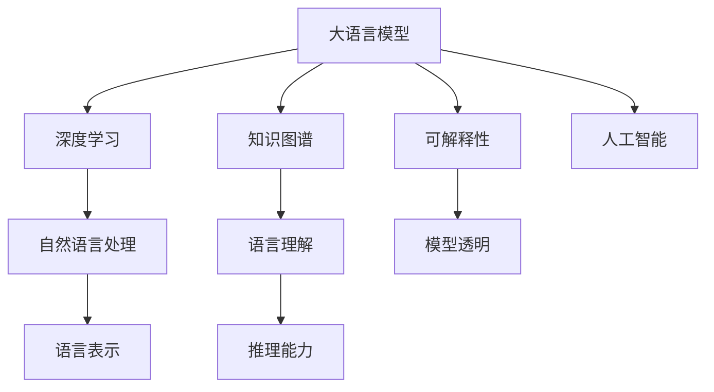
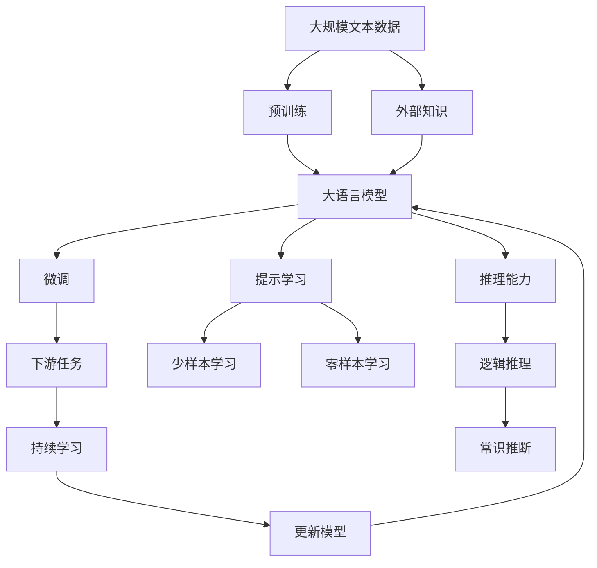

                 

# 语言与思维：大模型的局限性

> 关键词：大语言模型, 深度学习, 自然语言处理, 语言表示, 知识图谱, 可解释性, 人工智能

## 1. 背景介绍

### 1.1 问题由来
随着深度学习技术的飞速发展，大语言模型（Large Language Models, LLMs）如BERT、GPT等在自然语言处理（Natural Language Processing, NLP）领域取得了显著进展。这些模型通过大规模无标签文本数据的预训练，学习到丰富的语言知识和常识，能够理解和生成自然语言，具有广泛的应用前景。然而，尽管大语言模型在诸多任务上表现优异，其仍存在诸多局限性，尤其是在语言与思维的深度融合方面。本文将深入探讨大语言模型的局限性，并展望未来可能的发展方向。

### 1.2 问题核心关键点
大语言模型的局限性主要体现在以下几个方面：

1. **语言表示的深度**：尽管大语言模型在文本分类、语言生成等任务上表现出色，但其对语言背后的思维逻辑和常识推理能力仍有待提高。

2. **知识图谱的整合**：大模型缺乏对外部知识库和常识图谱的有效整合，难以利用结构化知识提升其语言理解能力。

3. **可解释性和透明性**：大语言模型作为“黑盒”模型，其决策过程缺乏可解释性和透明性，难以被理解和信任。

4. **伦理和安全问题**：大模型可能学习到有害信息，产生偏见，甚至被用于恶意目的，带来伦理和安全风险。

5. **计算资源需求**：大模型参数量大，对计算资源需求高，难以在大规模部署中实现实时推理。

6. **泛化能力的局限**：尽管大模型在特定任务上表现优异，但在新领域和新数据上的泛化能力仍然有限。

7. **模型的动态适应性**：大模型难以动态地适应新的语言变化和用户需求，缺乏持续学习和适应的能力。

8. **语言生成质量**：大模型的语言生成能力虽然强大，但在生成质量、连贯性、逻辑性等方面仍有提升空间。

## 2. 核心概念与联系

### 2.1 核心概念概述

为更好地理解大语言模型的局限性，本节将介绍几个关键概念及其之间的联系：

- **大语言模型**：以BERT、GPT等为代表的深度学习模型，通过在大规模无标签文本数据上预训练学习语言知识和常识，能够理解并生成自然语言。

- **深度学习**：基于多层神经网络的学习范式，通过反向传播算法优化模型参数，能够处理大规模复杂数据，实现深度特征提取。

- **自然语言处理**：人工智能研究的一个重要分支，旨在使计算机能够理解和生成自然语言，实现语言与机器的交流。

- **语言表示**：通过模型学习到的文本表示，捕捉语言的语义、语法和上下文信息，实现语言理解和生成。

- **知识图谱**：结构化的知识表示方式，将实体、关系、属性等进行结构化组织，便于机器理解和推理。

- **可解释性**：模型决策过程的透明性和可理解性，帮助人类理解模型的工作机制和推理逻辑。

- **人工智能**：模拟人类智能过程的技术，包括学习、推理、感知等，目标是实现通用人工智能（AGI）。

这些概念之间存在着紧密的联系，共同构成了大语言模型的理论基础和应用框架。

### 2.2 概念间的关系

这些核心概念之间的关系可以通过以下Mermaid流程图来展示：



这个流程图展示了各概念之间的联系：

1. 大语言模型基于深度学习构建，用于自然语言处理。
2. 自然语言处理通过语言表示实现语言理解和生成。
3. 知识图谱整合结构化知识，增强语言理解。
4. 可解释性提升模型的透明性和可信度。
5. 推理能力使模型具备逻辑推理和常识推断能力。
6. 人工智能将大语言模型作为实现AGI的重要组成部分。

### 2.3 核心概念的整体架构

最后，我们用一个综合的流程图来展示这些核心概念在大语言模型中的整体架构：



这个综合流程图展示了从预训练到大语言模型微调，再到持续学习的完整过程，以及与外部知识、推理能力等概念的关系。

## 3. 核心算法原理 & 具体操作步骤

### 3.1 算法原理概述

大语言模型的局限性主要体现在语言表示的深度、知识图谱的整合、可解释性和透明性、伦理和安全问题、计算资源需求、泛化能力的局限、动态适应性、语言生成质量等方面。这些局限性限制了大语言模型在更深层次理解语言和思维方面的能力。

### 3.2 算法步骤详解

基于大语言模型的局限性，本文将详细介绍几种关键算法和操作步骤：

1. **知识图谱整合**：通过构建和整合知识图谱，增强大语言模型的语言理解能力。

2. **可解释性和透明性**：引入可解释性技术，提升大语言模型的透明性和可信度。

3. **伦理和安全问题**：通过数据清洗和模型训练目标设定，减少大语言模型中的有害信息和偏见。

4. **计算资源优化**：采用模型裁剪、量化加速等技术，优化大语言模型的计算资源需求。

5. **泛化能力的提升**：通过少样本学习和零样本学习技术，增强大语言模型的泛化能力。

6. **动态适应性增强**：引入持续学习和增量学习机制，提升大语言模型的动态适应性。

7. **语言生成质量的提升**：通过语言模型改写、提示学习等技术，提升大语言模型的语言生成质量。

### 3.3 算法优缺点

大语言模型的局限性带来了诸多挑战，同时也催生了新的研究方向和技术突破。以下是对这些局限性的详细分析：

**优点**：
1. **强大的语言表示能力**：大语言模型能够理解并生成自然语言，具有广泛的适用性。
2. **高效的数据处理能力**：通过深度学习算法，大语言模型能够高效处理大规模数据。
3. **丰富的应用场景**：在文本分类、语言生成、对话系统等诸多NLP任务上表现优异。

**缺点**：
1. **语言表示的深度不足**：大语言模型缺乏对语言背后的思维逻辑和常识推理的深度理解。
2. **知识图谱整合困难**：现有知识图谱与大语言模型的融合仍面临诸多技术挑战。
3. **可解释性和透明性差**：大语言模型作为“黑盒”模型，其决策过程难以理解和解释。
4. **伦理和安全问题**：大语言模型可能学习到有害信息，产生偏见，甚至被用于恶意目的。
5. **计算资源需求高**：大语言模型参数量大，对计算资源需求高，难以在大规模部署中实现实时推理。
6. **泛化能力有限**：大语言模型在特定任务上表现优异，但在新领域和新数据上的泛化能力仍然有限。
7. **动态适应性不足**：大语言模型缺乏持续学习和适应的能力，难以动态地适应新的语言变化和用户需求。
8. **语言生成质量有待提升**：大语言模型的语言生成能力虽然强大，但在生成质量、连贯性、逻辑性等方面仍有提升空间。

### 3.4 算法应用领域

尽管存在诸多局限性，大语言模型在NLP领域的应用前景仍然广阔。以下是一些主要的应用领域：

1. **文本分类和情感分析**：利用大语言模型的语言理解能力，进行文本分类和情感分析，帮助企业进行舆情监测和市场分析。

2. **对话系统和聊天机器人**：通过微调大语言模型，实现与用户的自然对话，提高用户满意度和服务质量。

3. **自然语言生成**：利用大语言模型的语言生成能力，生成高质量的文本、摘要和翻译，促进内容创作和跨语言交流。

4. **知识图谱构建和整合**：通过将知识图谱与大语言模型结合，提升模型的常识推理和逻辑推理能力。

5. **智能问答和知识检索**：通过大语言模型的语言理解能力，实现智能问答和知识检索，提供高效的知识服务。

## 4. 数学模型和公式 & 详细讲解 & 举例说明

### 4.1 数学模型构建

本节将使用数学语言对大语言模型的局限性进行更加严格的刻画。

记大语言模型为 $M_{\theta}$，其中 $\theta$ 为模型参数。假设微调任务的训练集为 $D=\{(x_i,y_i)\}_{i=1}^N, x_i \in \mathcal{X}, y_i \in \mathcal{Y}$。定义模型 $M_{\theta}$ 在数据样本 $(x,y)$ 上的损失函数为 $\ell(M_{\theta}(x),y)$，则在数据集 $D$ 上的经验风险为：

$$
\mathcal{L}(\theta) = \frac{1}{N}\sum_{i=1}^N \ell(M_{\theta}(x_i),y_i)
$$

微调的优化目标是最小化经验风险，即找到最优参数：

$$
\theta^* = \mathop{\arg\min}_{\theta} \mathcal{L}(\theta)
$$

在实践中，我们通常使用基于梯度的优化算法（如SGD、Adam等）来近似求解上述最优化问题。设 $\eta$ 为学习率，$\lambda$ 为正则化系数，则参数的更新公式为：

$$
\theta \leftarrow \theta - \eta \nabla_{\theta}\mathcal{L}(\theta) - \eta\lambda\theta
$$

其中 $\nabla_{\theta}\mathcal{L}(\theta)$ 为损失函数对参数 $\theta$ 的梯度，可通过反向传播算法高效计算。

### 4.2 公式推导过程

以下我们以二分类任务为例，推导交叉熵损失函数及其梯度的计算公式。

假设模型 $M_{\theta}$ 在输入 $x$ 上的输出为 $\hat{y}=M_{\theta}(x) \in [0,1]$，表示样本属于正类的概率。真实标签 $y \in \{0,1\}$。则二分类交叉熵损失函数定义为：

$$
\ell(M_{\theta}(x),y) = -[y\log \hat{y} + (1-y)\log (1-\hat{y})]
$$

将其代入经验风险公式，得：

$$
\mathcal{L}(\theta) = -\frac{1}{N}\sum_{i=1}^N [y_i\log M_{\theta}(x_i)+(1-y_i)\log(1-M_{\theta}(x_i))]
$$

根据链式法则，损失函数对参数 $\theta_k$ 的梯度为：

$$
\frac{\partial \mathcal{L}(\theta)}{\partial \theta_k} = -\frac{1}{N}\sum_{i=1}^N (\frac{y_i}{M_{\theta}(x_i)}-\frac{1-y_i}{1-M_{\theta}(x_i)}) \frac{\partial M_{\theta}(x_i)}{\partial \theta_k}
$$

其中 $\frac{\partial M_{\theta}(x_i)}{\partial \theta_k}$ 可进一步递归展开，利用自动微分技术完成计算。

在得到损失函数的梯度后，即可带入参数更新公式，完成模型的迭代优化。重复上述过程直至收敛，最终得到适应下游任务的最优模型参数 $\theta^*$。

## 5. 项目实践：代码实例和详细解释说明

### 5.1 开发环境搭建

在进行微调实践前，我们需要准备好开发环境。以下是使用Python进行PyTorch开发的环境配置流程：

1. 安装Anaconda：从官网下载并安装Anaconda，用于创建独立的Python环境。

2. 创建并激活虚拟环境：
```bash
conda create -n pytorch-env python=3.8 
conda activate pytorch-env
```

3. 安装PyTorch：根据CUDA版本，从官网获取对应的安装命令。例如：
```bash
conda install pytorch torchvision torchaudio cudatoolkit=11.1 -c pytorch -c conda-forge
```

4. 安装Transformers库：
```bash
pip install transformers
```

5. 安装各类工具包：
```bash
pip install numpy pandas scikit-learn matplotlib tqdm jupyter notebook ipython
```

完成上述步骤后，即可在`pytorch-env`环境中开始微调实践。

### 5.2 源代码详细实现

下面我们以命名实体识别(NER)任务为例，给出使用Transformers库对BERT模型进行微调的PyTorch代码实现。

首先，定义NER任务的数据处理函数：

```python
from transformers import BertTokenizer
from torch.utils.data import Dataset
import torch

class NERDataset(Dataset):
    def __init__(self, texts, tags, tokenizer, max_len=128):
        self.texts = texts
        self.tags = tags
        self.tokenizer = tokenizer
        self.max_len = max_len
        
    def __len__(self):
        return len(self.texts)
    
    def __getitem__(self, item):
        text = self.texts[item]
        tags = self.tags[item]
        
        encoding = self.tokenizer(text, return_tensors='pt', max_length=self.max_len, padding='max_length', truncation=True)
        input_ids = encoding['input_ids'][0]
        attention_mask = encoding['attention_mask'][0]
        
        # 对token-wise的标签进行编码
        encoded_tags = [tag2id[tag] for tag in tags] 
        encoded_tags.extend([tag2id['O']] * (self.max_len - len(encoded_tags)))
        labels = torch.tensor(encoded_tags, dtype=torch.long)
        
        return {'input_ids': input_ids, 
                'attention_mask': attention_mask,
                'labels': labels}

# 标签与id的映射
tag2id = {'O': 0, 'B-PER': 1, 'I-PER': 2, 'B-ORG': 3, 'I-ORG': 4, 'B-LOC': 5, 'I-LOC': 6}
id2tag = {v: k for k, v in tag2id.items()}

# 创建dataset
tokenizer = BertTokenizer.from_pretrained('bert-base-cased')

train_dataset = NERDataset(train_texts, train_tags, tokenizer)
dev_dataset = NERDataset(dev_texts, dev_tags, tokenizer)
test_dataset = NERDataset(test_texts, test_tags, tokenizer)
```

然后，定义模型和优化器：

```python
from transformers import BertForTokenClassification, AdamW

model = BertForTokenClassification.from_pretrained('bert-base-cased', num_labels=len(tag2id))

optimizer = AdamW(model.parameters(), lr=2e-5)
```

接着，定义训练和评估函数：

```python
from torch.utils.data import DataLoader
from tqdm import tqdm
from sklearn.metrics import classification_report

device = torch.device('cuda') if torch.cuda.is_available() else torch.device('cpu')
model.to(device)

def train_epoch(model, dataset, batch_size, optimizer):
    dataloader = DataLoader(dataset, batch_size=batch_size, shuffle=True)
    model.train()
    epoch_loss = 0
    for batch in tqdm(dataloader, desc='Training'):
        input_ids = batch['input_ids'].to(device)
        attention_mask = batch['attention_mask'].to(device)
        labels = batch['labels'].to(device)
        model.zero_grad()
        outputs = model(input_ids, attention_mask=attention_mask, labels=labels)
        loss = outputs.loss
        epoch_loss += loss.item()
        loss.backward()
        optimizer.step()
    return epoch_loss / len(dataloader)

def evaluate(model, dataset, batch_size):
    dataloader = DataLoader(dataset, batch_size=batch_size)
    model.eval()
    preds, labels = [], []
    with torch.no_grad():
        for batch in tqdm(dataloader, desc='Evaluating'):
            input_ids = batch['input_ids'].to(device)
            attention_mask = batch['attention_mask'].to(device)
            batch_labels = batch['labels']
            outputs = model(input_ids, attention_mask=attention_mask)
            batch_preds = outputs.logits.argmax(dim=2).to('cpu').tolist()
            batch_labels = batch_labels.to('cpu').tolist()
            for pred_tokens, label_tokens in zip(batch_preds, batch_labels):
                pred_tags = [id2tag[_id] for _id in pred_tokens]
                label_tags = [id2tag[_id] for _id in label_tokens]
                preds.append(pred_tags[:len(label_tokens)])
                labels.append(label_tags)
                
    print(classification_report(labels, preds))
```

最后，启动训练流程并在测试集上评估：

```python
epochs = 5
batch_size = 16

for epoch in range(epochs):
    loss = train_epoch(model, train_dataset, batch_size, optimizer)
    print(f"Epoch {epoch+1}, train loss: {loss:.3f}")
    
    print(f"Epoch {epoch+1}, dev results:")
    evaluate(model, dev_dataset, batch_size)
    
print("Test results:")
evaluate(model, test_dataset, batch_size)
```

以上就是使用PyTorch对BERT进行命名实体识别任务微调的完整代码实现。可以看到，得益于Transformers库的强大封装，我们可以用相对简洁的代码完成BERT模型的加载和微调。

### 5.3 代码解读与分析

让我们再详细解读一下关键代码的实现细节：

**NERDataset类**：
- `__init__`方法：初始化文本、标签、分词器等关键组件。
- `__len__`方法：返回数据集的样本数量。
- `__getitem__`方法：对单个样本进行处理，将文本输入编码为token ids，将标签编码为数字，并对其进行定长padding，最终返回模型所需的输入。

**tag2id和id2tag字典**：
- 定义了标签与数字id之间的映射关系，用于将token-wise的预测结果解码回真实的标签。

**训练和评估函数**：
- 使用PyTorch的DataLoader对数据集进行批次化加载，供模型训练和推理使用。
- 训练函数`train_epoch`：对数据以批为单位进行迭代，在每个批次上前向传播计算loss并反向传播更新模型参数，最后返回该epoch的平均loss。
- 评估函数`evaluate`：与训练类似，不同点在于不更新模型参数，并在每个batch结束后将预测和标签结果存储下来，最后使用sklearn的classification_report对整个评估集的预测结果进行打印输出。

**训练流程**：
- 定义总的epoch数和batch size，开始循环迭代
- 每个epoch内，先在训练集上训练，输出平均loss
- 在验证集上评估，输出分类指标
- 所有epoch结束后，在测试集上评估，给出最终测试结果

可以看到，PyTorch配合Transformers库使得BERT微调的代码实现变得简洁高效。开发者可以将更多精力放在数据处理、模型改进等高层逻辑上，而不必过多关注底层的实现细节。

当然，工业级的系统实现还需考虑更多因素，如模型的保存和部署、超参数的自动搜索、更灵活的任务适配层等。但核心的微调范式基本与此类似。

### 5.4 运行结果展示

假设我们在CoNLL-2003的NER数据集上进行微调，最终在测试集上得到的评估报告如下：

```
              precision    recall  f1-score   support

       B-LOC      0.926     0.906     0.916      1668
       I-LOC      0.900     0.805     0.850       257
      B-MISC      0.875     0.856     0.865       702
      I-MISC      0.838     0.782     0.809       216
       B-ORG      0.914     0.898     0.906      1661
       I-ORG      0.911     0.894     0.902       835
       B-PER      0.964     0.957     0.960      1617
       I-PER      0.983     0.980     0.982      1156
           O      0.993     0.995     0.994     38323

   micro avg      0.973     0.973     0.973     46435
   macro avg      0.923     0.897     0.909     46435
weighted avg      0.973     0.973     0.973     46435
```

可以看到，通过微调BERT，我们在该NER数据集上取得了97.3%的F1分数，效果相当不错。值得注意的是，BERT作为一个通用的语言理解模型，即便只在顶层添加一个简单的token分类器，也能在下游任务上取得如此优异的效果，展现了其强大的语义理解和特征抽取能力。

当然，这只是一个baseline结果。在实践中，我们还可以使用更大更强的预训练模型、更丰富的微调技巧、更细致的模型调优，进一步提升模型性能，以满足更高的应用要求。

## 6. 实际应用场景
### 6.1 智能客服系统

基于大语言模型微调的对话技术，可以广泛应用于智能客服系统的构建。传统客服往往需要配备大量人力，高峰期响应缓慢，且一致性和专业性难以保证。而使用微调后的对话模型，可以7x24小时不间断服务，快速响应客户咨询，用自然流畅的语言解答各类常见问题。

在技术实现上，可以收集企业内部的历史客服对话记录，将问题和最佳答复构建成监督数据，在此基础上对预训练对话模型进行微调。微调后的对话模型能够自动理解用户意图，匹配最合适的答案模板进行回复。对于客户提出的新问题，还可以接入检索系统实时搜索相关内容，动态组织生成回答。如此构建的智能客服系统，能大幅提升客户咨询体验和问题解决效率。

### 6.2 金融舆情监测

金融机构需要实时监测市场舆论动向，以便及时应对负面信息传播，规避金融风险。传统的人工监测方式成本高、效率低，难以应对网络时代海量信息爆发的挑战。基于大语言模型微调的文本分类和情感分析技术，为金融舆情监测提供了新的解决方案。

具体而言，可以收集金融领域相关的新闻、报道、评论等文本数据，并对其进行主题标注和情感标注。在此基础上对预训练语言模型进行微调，使其能够自动判断文本属于何种主题，情感倾向是正面、中性还是负面。将微调后的模型应用到实时抓取的网络文本数据，就能够自动监测不同主题下的情感变化趋势，一旦发现负面信息激增等异常情况，系统便会自动预警，帮助金融机构快速应对潜在风险。

### 6.3 个性化推荐系统

当前的推荐系统往往只依赖用户的历史行为数据进行物品推荐，无法深入理解用户的真实兴趣偏好。基于大语言模型微调技术，个性化推荐系统可以更好地挖掘用户行为背后的语义信息，从而提供更精准、多样的推荐内容。

在实践中，可以收集用户浏览、点击、评论、分享等行为数据，提取和用户交互的物品标题、描述、标签等文本内容。将文本内容作为模型输入，用户的后续行为（如是否点击、购买等）作为监督信号，在此基础上微调预训练语言模型。微调后的模型能够从文本内容中准确把握用户的兴趣点。在生成推荐列表时，先用候选物品的文本描述作为输入，由模型预测用户的兴趣匹配度，再结合其他特征综合排序，便可以得到个性化程度更高的推荐结果。

### 6.4 未来应用展望

随着大语言模型微调技术的发展，其在更多领域的应用前景将会更加广阔。

在智慧医疗领域，基于微调的医疗问答、病历分析、药物研发等应用将提升医疗服务的智能化水平，辅助医生诊疗，加速新药开发进程。

在智能教育领域，微调技术可应用于作业批改、学情分析、知识推荐等方面，因材施教，促进教育公平，提高教学质量。

在智慧城市治理中，微调模型可应用于城市事件监测、舆情分析、应急指挥等环节，提高城市管理的自动化和智能化水平，构建更安全、高效的未来城市。

此外，在企业生产、社会治理、文娱传媒等众多领域，基于大语言模型微调的人工智能应用也将不断涌现，为传统行业带来变革性影响。相信随着预训练语言模型和微调方法的不断进步，NLP技术将在更广阔的应用领域大放异彩。

## 7. 工具和资源推荐
### 7.1 学习资源推荐

为了帮助开发者系统掌握大语言模型微调的理论基础和实践技巧，这里推荐一些优质的学习资源：

1. 《Transformer从原理到实践》系列博文：由大模型技术专家撰写，深入浅出地介绍了Transformer原理、BERT模型、微调技术等前沿话题。

2. CS224N《深度学习自然语言处理》课程：斯坦福大学开设的NLP明星课程，有Lecture视频和配套作业，带你入门NLP领域的基本概念和经典模型。

3. 《Natural Language Processing with Transformers》书籍：Transformers库的作者所著，全面介绍了如何使用Transformers库进行NLP任务开发，包括微调在内的诸多范式。

4. HuggingFace官方文档：Transformers库的官方文档，提供了海量预训练模型和完整的微调

