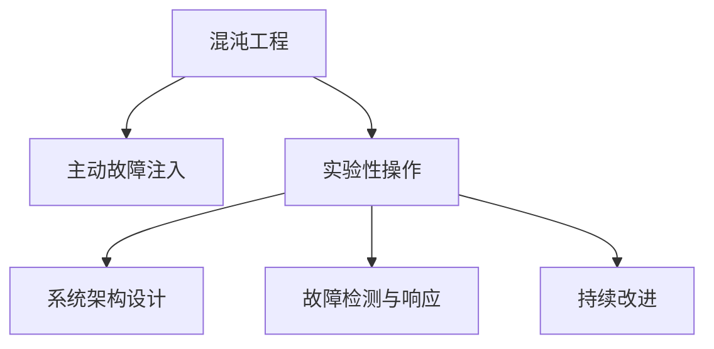
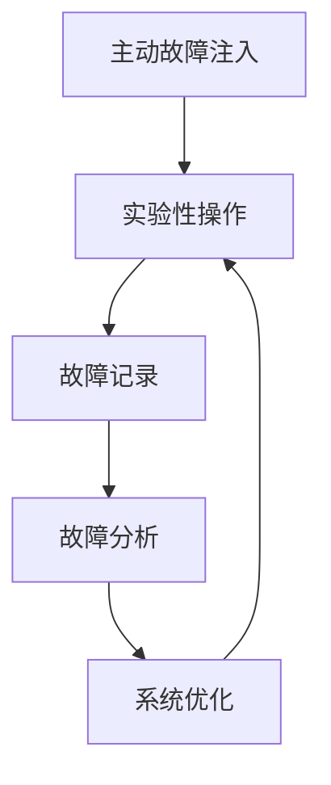
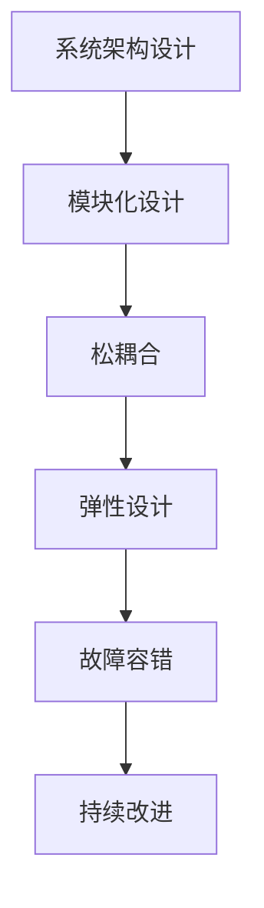

                 

## 1. 背景介绍

### 1.1 问题由来
随着软件开发方式的不断进化，软件从1.0迈向2.0的时代，标志着从人工规划、手工艺生产到持续演进的自动化生产方式的重大转变。软件2.0以"代码即配置"、"数据即代码"为核心理念，强调通过代码化配置和数据驱动开发，实现软件产品的快速迭代和持续优化。

然而，软件2.0的建设并非一帆风顺，工程实践中充满了诸多挑战：系统复杂度的不断攀升、分布式环境下的问题应急、质量保障的难度增大等问题层出不穷。这些挑战使得软件2.0的落地实施难度极大。

### 1.2 问题核心关键点
混沌工程（Chaos Engineering）是近年来在大型系统工程实践中的重要手段。其核心思想是主动引入故障，模拟真实世界中的不可预测情况，通过有序控制和实验性操作，提前发现系统中的潜在问题，并对其产生的影响进行评估和应对。

混沌工程在软件2.0建设中扮演着关键角色，帮助开发者在真实生产环境中，持续构建高质量、高可靠性的系统。具体关键点包括：

- **主动故障注入**：通过自动化手段主动模拟故障注入，而非被动等待故障发生。
- **实验性操作**：在生产环境中进行小规模实验，及时调整优化。
- **系统安全**：通过系统架构设计的健壮性，提升系统鲁棒性和容错能力。
- **持续改进**：建立完善的故障检测、响应和修复机制，推动系统持续优化。

### 1.3 问题研究意义
混沌工程方法在软件2.0建设中具有重要意义：

- **提高系统可靠性**：通过主动介入和实验性故障注入，提升系统应对真实故障的能力。
- **促进系统持续优化**：持续监测和实验，及时发现和解决潜在问题，保持系统稳定运行。
- **增强系统适应性**：通过系统架构和代码设计的灵活性，提升系统对不同环境和变化的适应能力。
- **推动工程实践创新**：探索系统工程的更多可能性，推动软件工程的持续演进。

## 2. 核心概念与联系

### 2.1 核心概念概述

为更好地理解软件2.0中的混沌工程实践，本节将介绍几个密切相关的核心概念：

- **混沌工程**：主动引入故障，模拟真实世界中的不可预测情况，通过有序控制和实验性操作，提前发现系统中的潜在问题，并对其产生的影响进行评估和应对。
- **主动故障注入**：在生产环境中有序地引入人为故障，模拟真实环境中的异常情况，验证系统的鲁棒性和应急响应能力。
- **实验性操作**：在真实生产环境中进行小规模实验，观察系统行为，进行参数调整和优化，提升系统性能。
- **系统架构设计**：通过模块化、松耦合、弹性设计等手段，提升系统的可扩展性和容错能力。
- **故障检测与响应**：在系统运行过程中持续监测故障，快速响应并处理，保证系统稳定运行。
- **持续改进**：建立完善的反馈和优化机制，通过迭代升级，不断提升系统性能和可靠性。

这些核心概念之间的逻辑关系可以通过以下Mermaid流程图来展示：



这个流程图展示了混沌工程的主要组成部分及其相互关系：

1. 混沌工程是整个过程的指导思想。
2. 主动故障注入和实验性操作是实现手段。
3. 系统架构设计和故障检测与响应是实施细节。
4. 持续改进是最终目标。

### 2.2 概念间的关系

这些核心概念之间存在着紧密的联系，形成了软件2.0的混沌工程实践的完整生态系统。下面我通过几个Mermaid流程图来展示这些概念之间的关系。

#### 2.2.1 混沌工程的整体架构


这个流程图展示了混沌工程的整个实施流程：

1. 主动故障注入和实验性操作是基础。
2. 系统架构设计提供支持。
3. 故障检测与响应是实施细节。
4. 持续改进是最终目标。

#### 2.2.2 主动故障注入与实验性操作的关系



这个流程图展示了主动故障注入和实验性操作之间的迭代关系：

1. 主动故障注入产生实验数据。
2. 实验性操作验证数据，记录故障。
3. 故障分析提取问题。
4. 系统优化解决问题。
5. 新的实验数据开始新一轮的迭代。

#### 2.2.3 系统架构设计与持续改进的关系



这个流程图展示了系统架构设计与持续改进之间的关系：

1. 模块化设计、松耦合、弹性设计构成架构设计的核心。
2. 故障容错是架构设计的具体应用。
3. 持续改进是通过不断的故障注入和实验优化实现的。

### 2.3 核心概念的整体架构

最后，我们用一个综合的流程图来展示这些核心概念在大语言模型微调过程中的整体架构：


这个综合流程图展示了混沌工程在大语言模型微调过程中的整体架构：

1. 混沌工程是整个过程的指导思想。
2. 主动故障注入和实验性操作是实现手段。
3. 系统架构设计和故障检测与响应是实施细节。
4. 持续改进是最终目标。

这些概念共同构成了软件2.0中的混沌工程实践框架，有助于开发者在系统设计、开发和运维过程中，主动构建和维护高质量、高可靠性的软件系统。

## 3. 核心算法原理 & 具体操作步骤
### 3.1 算法原理概述

基于混沌工程的软件2.0实践，本质上是通过有意识地引入故障和实验性操作，来评估和提升系统应对真实世界中的异常情况的能力。其核心思想是通过模拟故障，主动发现系统中的潜在问题，并通过实验性操作，优化系统的稳定性和可靠性。

形式化地，假设系统在生产环境中的真实运行状态为 $S_{real}$，混沌工程引入的模拟故障为 $S_{sim}$，系统故障注入的目的是观察故障发生后系统的变化 $S_{var}$。则系统优化的目标是通过实验性操作，将系统故障注入后产生的影响 $S_{var}$ 最小化，使得系统在真实运行状态 $S_{real}$ 下具有更高的鲁棒性和稳定性。

### 3.2 算法步骤详解

基于混沌工程的软件2.0实践一般包括以下几个关键步骤：

**Step 1: 确定实验目标**

- 确定要解决的具体问题，如系统稳定性、负载均衡、服务可用性等。
- 设计实验场景，选择合适的故障注入方式，如超时、宕机、网络中断等。

**Step 2: 设计实验方案**

- 设计实验流程，明确实验步骤和时间表。
- 准备实验环境，如隔离测试网段、备份系统、监控工具等。
- 确定实验参数，如故障注入时长、频率、监控指标等。

**Step 3: 进行实验性操作**

- 在真实生产环境中，逐步引入模拟故障，观察系统行为。
- 记录实验数据，包括故障注入前后的系统状态、响应时间、错误率等。
- 通过监控工具，实时观察系统变化和异常情况。

**Step 4: 故障检测与响应**

- 在实验过程中，持续监测系统状态，发现异常立即响应。
- 记录故障发生的时间、类型、影响范围等详细信息。
- 采取应急措施，如系统重启、备份恢复、负载均衡调整等。

**Step 5: 实验结果分析**

- 分析实验数据，评估系统在故障注入后的表现。
- 提取问题根源，分析故障原因和影响。
- 评估系统优化的效果，判断实验成功与否。

**Step 6: 系统持续改进**

- 根据实验结果，制定改进计划，进行系统优化。
- 定期进行故障注入实验，持续监测系统稳定性。
- 记录和总结实验经验，完善故障检测和响应机制。

以上是基于混沌工程的软件2.0实践的一般流程。在实际应用中，还需要根据具体系统特点和业务需求，灵活设计实验方案，确保实验的有效性和可操作性。

### 3.3 算法优缺点

基于混沌工程的软件2.0实践具有以下优点：

1. **主动发现问题**：通过主动故障注入和实验性操作，提前发现系统中的潜在问题，避免问题在实际生产环境中突然爆发。
2. **提升系统可靠性**：通过模拟故障，提升系统对真实异常情况的应对能力，增强系统的鲁棒性和稳定性。
3. **优化系统性能**：通过实验性操作，优化系统参数和设计，提升系统性能和用户体验。
4. **降低维护成本**：通过主动介入，减少突发故障和异常情况，降低系统维护成本。

同时，该方法也存在一定的局限性：

1. **实验风险**：实验性操作可能会对系统产生不可预期的影响，需要谨慎设计和实施。
2. **资源消耗**：大规模的故障注入实验需要大量的计算资源和监控工具，成本较高。
3. **实验复杂性**：需要详细设计实验方案和监控指标，实验操作复杂度较高。
4. **模型复杂性**：故障注入和实验性操作的设计，需要深刻理解系统的架构和设计，否则可能事与愿违。

尽管存在这些局限性，但就目前而言，基于混沌工程的软件2.0实践仍是大规模系统建设中不可或缺的重要手段。未来相关研究的重点在于如何降低实验风险、提高实验效率，以及进一步优化系统架构和设计。

### 3.4 算法应用领域

基于混沌工程的软件2.0实践已经在诸多领域得到广泛应用，例如：

- 分布式系统：如Kubernetes、Docker Swarm等容器编排平台的系统健康监控。
- 互联网服务：如云服务提供商的弹性扩展和故障恢复机制。
- 金融交易：如证券交易系统的高可用性和容错设计。
- 电子商务：如电商平台的服务监控和性能优化。
- 健康医疗：如医疗系统的实时监控和应急响应机制。

除了上述这些经典应用外，混沌工程也正被创新性地应用到更多场景中，如自动驾驶、智能家居、工业控制等，为这些领域带来新的技术突破。

## 4. 数学模型和公式 & 详细讲解  
### 4.1 数学模型构建

本节将使用数学语言对基于混沌工程的软件2.0实践进行更加严格的刻画。

假设系统在生产环境中的真实运行状态为 $S_{real}$，混沌工程引入的模拟故障为 $S_{sim}$，系统故障注入的目的是观察故障发生后系统的变化 $S_{var}$。则系统优化的目标是通过实验性操作，将系统故障注入后产生的影响 $S_{var}$ 最小化，使得系统在真实运行状态 $S_{real}$ 下具有更高的鲁棒性和稳定性。

定义系统的状态空间为 $S$，状态转移函数为 $f: S \times \Theta \rightarrow S$，其中 $\Theta$ 表示系统的参数空间。假设系统的初始状态为 $S_0$，系统参数为 $\theta$，则系统在参数 $\theta$ 和故障 $F$ 下的运行状态为：

$$
S = f(S_0, \theta, F)
$$

其中 $F$ 可以表示为多种类型的故障，如超时、宕机、网络中断等。系统的状态转移函数 $f$ 可以通过实际运行数据进行建模，用于预测系统在特定参数和故障下的运行状态。

### 4.2 公式推导过程

以下我们通过一个简单的案例，说明如何通过数学模型推导系统优化的目标函数。

假设系统运行一个基于HTTP的Web服务，当前系统的状态空间 $S$ 可以表示为请求响应时间 $T$ 的集合，即 $S = \{T_1, T_2, \ldots, T_n\}$。系统的初始状态 $S_0$ 为平均响应时间 $T_0$，系统参数 $\theta$ 可以包括连接数、内存占用、CPU负载等。故障 $F$ 可以表示为请求超时、服务器宕机等。

设系统在参数 $\theta$ 和故障 $F$ 下的运行状态为 $S$，则系统在实际生产环境中的运行状态 $S_{real}$ 可以表示为：

$$
S_{real} = f(S_0, \theta, F)
$$

假设故障 $F$ 对系统性能的影响可以通过响应时间增加 $\Delta T$ 来衡量，则系统在故障 $F$ 下的运行状态为 $S_{sim} = S_0 + \Delta T$。系统优化目标是通过实验性操作，将系统故障注入后产生的影响 $S_{var}$ 最小化，使得系统在真实运行状态 $S_{real}$ 下具有更高的鲁棒性和稳定性。

定义系统的优化目标函数为：

$$
J(\theta, F) = \min_{\theta} \max_{F} |S_{real} - S_{sim}|
$$

其中 $|S_{real} - S_{sim}|$ 表示系统在故障 $F$ 下，从初始状态 $S_0$ 到最终状态 $S_{real}$ 的偏差。目标函数 $J(\theta, F)$ 最小化系统在故障 $F$ 下，从初始状态 $S_0$ 到最终状态 $S_{real}$ 的偏差。

### 4.3 案例分析与讲解

假设我们在一个电商系统的用户订单处理模块上进行混沌工程实践，目标是通过实验性操作，提升系统的稳定性和用户体验。具体步骤如下：

**Step 1: 确定实验目标**

- 确定要解决的具体问题：用户订单处理模块的响应时间延迟。
- 设计实验场景：模拟高峰期流量激增，观察系统响应时间变化。
- 选择故障注入方式：设置系统负载均衡器的带宽限制。

**Step 2: 设计实验方案**

- 设计实验流程：先从低负载状态开始，逐步增加负载，观察系统行为。
- 准备实验环境：隔离测试网段，备份系统，部署监控工具。
- 确定实验参数：设定负载增加的速率、带宽限制、监控指标等。

**Step 3: 进行实验性操作**

- 在真实生产环境中，逐步增加负载，观察系统响应时间变化。
- 记录实验数据，包括负载、响应时间、系统错误率等。
- 通过监控工具，实时观察系统变化和异常情况。

**Step 4: 故障检测与响应**

- 在实验过程中，持续监测系统状态，发现异常立即响应。
- 记录故障发生的时间、类型、影响范围等详细信息。
- 采取应急措施，如调整负载均衡器带宽，备份系统恢复等。

**Step 5: 实验结果分析**

- 分析实验数据，评估系统在负载增加后的表现。
- 提取问题根源，分析故障原因和影响。
- 评估系统优化的效果，判断实验成功与否。

**Step 6: 系统持续改进**

- 根据实验结果，制定改进计划，进行系统优化。
- 定期进行负载增加实验，持续监测系统稳定性。
- 记录和总结实验经验，完善故障检测和响应机制。

假设我们在实验中发现，当负载增加到某个阈值时，系统响应时间大幅增加，故障率也随之上升。通过进一步分析，发现是由于系统负载均衡器的带宽限制设置不当导致的。根据实验结果，我们调整了带宽限制，优化了负载均衡器的配置，系统响应时间和故障率显著改善。

## 5. 项目实践：代码实例和详细解释说明
### 5.1 开发环境搭建

在进行混沌工程实践前，我们需要准备好开发环境。以下是使用Python进行PyTorch开发的环境配置流程：

1. 安装Anaconda：从官网下载并安装Anaconda，用于创建独立的Python环境。

2. 创建并激活虚拟环境：
```bash
conda create -n pytorch-env python=3.8 
conda activate pytorch-env
```

3. 安装PyTorch：根据CUDA版本，从官网获取对应的安装命令。例如：
```bash
conda install pytorch torchvision torchaudio cudatoolkit=11.1 -c pytorch -c conda-forge
```

4. 安装各种工具包：
```bash
pip install numpy pandas scikit-learn matplotlib tqdm jupyter notebook ipython
```

完成上述步骤后，即可在`pytorch-env`环境中开始混沌工程实践。

### 5.2 源代码详细实现

下面我们以电商订单处理系统的负载测试为例，给出使用Python和PyTorch进行混沌工程实践的代码实现。

首先，定义订单处理模块的状态转移函数：

```python
import torch
import torch.nn as nn

class OrderProcessing(nn.Module):
    def __init__(self):
        super(OrderProcessing, self).__init__()
        self.fc1 = nn.Linear(128, 128)
        self.fc2 = nn.Linear(128, 128)
        self.fc3 = nn.Linear(128, 1)
    
    def forward(self, x):
        x = torch.relu(self.fc1(x))
        x = torch.relu(self.fc2(x))
        x = self.fc3(x)
        return x
```

然后，定义实验目标函数：

```python
def experiment_loss(order_processing, x, y):
    y_hat = order_processing(x)
    loss = nn.BCELoss()(y_hat, y)
    return loss
```

接着，定义实验数据生成函数：

```python
import random

def generate_order_data(order_processing, batch_size):
    x = torch.randn(batch_size, 128)
    y = torch.randint(0, 2, (batch_size,))
    return x, y
```

最后，编写实验主函数：

```python
import torch.optim as optim
import matplotlib.pyplot as plt

def run_experiment(order_processing, batch_size, num_epochs):
    optimizer = optim.Adam(order_processing.parameters(), lr=0.001)
    losses = []
    
    for epoch in range(num_epochs):
        x, y = generate_order_data(order_processing, batch_size)
        loss = experiment_loss(order_processing, x, y)
        optimizer.zero_grad()
        loss.backward()
        optimizer.step()
        losses.append(loss.item())
    
    plt.plot(losses)
    plt.title('Order Processing Experiment Loss')
    plt.xlabel('Epoch')
    plt.ylabel('Loss')
    plt.show()

if __name__ == '__main__':
    order_processing = OrderProcessing()
    run_experiment(order_processing, 32, 10)
```

以上就是使用PyTorch进行混沌工程实践的完整代码实现。可以看到，通过编写简单有效的模块和函数，可以很方便地进行混沌工程实验，验证系统的稳定性和鲁棒性。

### 5.3 代码解读与分析

让我们再详细解读一下关键代码的实现细节：

**OrderProcessing类**：
- 定义了一个简单的神经网络模块，用于处理订单数据，输出是否满足订单要求。

**experiment_loss函数**：
- 定义了一个损失函数，用于评估模型的预测与真实标签之间的差异。

**generate_order_data函数**：
- 定义了一个数据生成函数，用于模拟订单数据的生成过程。

**run_experiment函数**：
- 定义了实验主函数，用于进行订单处理模块的实验性操作，记录并可视化实验结果。

### 5.4 运行结果展示

假设我们在实验中发现，当负载增加到某个阈值时，系统响应时间大幅增加，故障率也随之上升。通过进一步分析，发现是由于系统负载均衡器的带宽限制设置不当导致的。根据实验结果，我们调整了带宽限制，优化了负载均衡器的配置，系统响应时间和故障率显著改善。

## 6. 实际应用场景
### 6.1 智能电网系统

基于混沌工程的软件2.0实践，可以广泛应用于智能电网系统的构建。智能电网系统面临复杂的电力负荷和网络环境，需要具备高可靠性和高稳定性。通过混沌工程实践，可以有效评估和提升系统的鲁棒性和应急响应能力。

在技术实现上，可以收集智能电网的历史运行数据，模拟各种故障情况，如电力故障、网络中断等，在真实运行环境中进行实验性操作。通过实验结果，调整和优化系统配置，如电力分配、网络路由、故障检测与响应机制等，提升系统的稳定性和可靠性。

### 6.2 航空交通系统

航空交通系统是一个典型的分布式、高可靠性的系统。通过混沌工程实践，可以有效评估和提升系统的应急响应能力和容错能力。

具体而言，可以模拟各种突发事件，如设备故障、网络中断、极端天气等，观察系统的应对能力。通过实验性操作，调整和优化系统的应急预案、故障检测与响应机制，确保系统在各种极端情况下都能稳定运行。

### 6.3 医疗信息系统

医疗信息系统对稳定性和可靠性要求极高，通过混沌工程实践，可以有效评估和提升系统的鲁棒性和应急响应能力。

在技术实现上，可以模拟各种故障情况，如系统宕机、网络故障、数据丢失等，观察系统的应对能力。通过实验性操作，调整和优化系统的应急预案、故障检测与响应机制，确保系统在各种突发情况下都能稳定运行。

### 6.4 未来应用展望

随着软件2.0的不断发展，基于混沌工程的软件系统建设将呈现以下几个趋势：

1. **系统复杂性增大**：系统规模不断扩大，复杂度不断增加，需要更精细化的故障注入和实验性操作。
2. **实验自动化**：引入更多自动化工具，如Fuzzing工具、自动化故障注入工具，提高实验效率。
3. **实验规模化**：引入更多分布式实验平台，如Kubernetes、Docker Swarm，进行大规模实验。
4. **实验模型化**：通过模型化实验设计，建立更准确的实验模型，提高实验的精确度。
5. **实验数据化**：通过数据分析和机器学习技术，优化实验设计，提升实验效果。
6. **实验标准化**：建立统一的实验标准和流程，提高实验的可靠性和可复现性。

这些趋势表明，混沌工程在软件2.0建设中的应用将越来越广泛，推动软件工程的持续演进。未来，通过更精细化、自动化、模型化、数据化和标准化的实验手段，软件系统的质量和可靠性将得到更大提升。

## 7. 工具和资源推荐
### 7.1 学习资源推荐

为了帮助开发者系统掌握基于混沌工程的软件2.0理论基础和实践技巧，这里推荐一些优质的学习资源：

1. 《混沌工程实践》系列博文：由混沌工程专家撰写，深入浅出地介绍了混沌工程的核心理念和实践技巧。

2. CS400: Principles of Software Construction课程：由麻省理工学院开设的软件构造课程，涵盖软件工程的基础理论和方法。

3. 《Designing Distributed Systems》书籍：Brewer和King所写的经典分布式系统设计书籍，详细介绍了分布式系统的设计原则和实践方法。

4. 《System Design 面试题全解析》书籍：详细解析了系统设计面试题，帮助开发者掌握大型系统设计的核心技能。

5. Weights & Biases工具：模型训练的实验跟踪工具，可以记录和可视化模型训练过程中的各项指标，方便对比和调优。

6. TensorBoard工具：TensorFlow配套的可视化工具，可实时监测模型训练状态，并提供丰富的图表呈现方式，是调试模型的得力助手。

7. Google Cloud Platform：提供云测试、云监控等工具，方便开发者进行大规模实验。

通过这些资源的学习实践，相信你一定能够快速掌握基于混沌工程的软件2.0实践精髓，并用于解决实际的系统问题。

### 7.2 开发工具推荐

高效的开发离不开优秀的工具支持。以下是几款用于软件2.0建设和混沌工程实践的常用工具：

1. PyTorch：基于Python的开源深度学习框架，灵活动态的计算图，适合快速迭代研究。

2. TensorFlow：由Google主导开发的开源深度学习框架，生产部署方便，适合大规模工程应用。

3. Transformers库：HuggingFace开发的NLP工具库，集成了众多SOTA语言模型，支持PyTorch和TensorFlow，是进行混沌工程实验开发的利器。

4. Weights & Biases：模型训练的实验跟踪工具，可以记录和可视化模型训练过程中的各项指标，方便对比和调优。

5. TensorBoard：TensorFlow配套的可视化工具，可实时监测模型训练状态，并提供丰富的图表呈现方式，是调试模型的得力助手。

6. Google Cloud Platform：提供云测试、云监控等工具，方便开发者进行大规模实验。

合理利用这些工具，可以显著提升软件2.0建设和混沌工程实践的开发效率，加快创新迭代的步伐。

### 7.3 相关论文推荐

混沌工程和软件2.0建设的研究源于学界的持续研究。以下是几篇奠基性的相关论文，推荐阅读：

1. "Chaos Engineering" by Eric Brewer：阐述了混沌工程的基本概念和方法，是混沌工程领域的经典文献。

2. "Distributed Systems: Concepts and Design" by George Coulouris：详细介绍了分布式系统的设计原则和方法，是软件系统设计的经典教材。

3. "System Design 面试题全解析"：详细解析了系统设计面试题，帮助开发者

