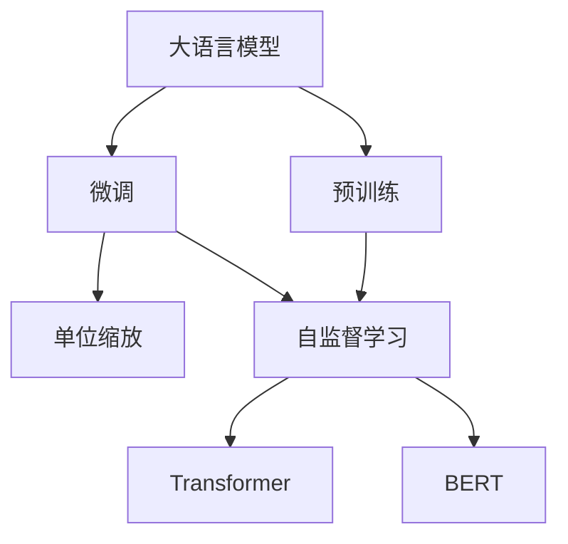
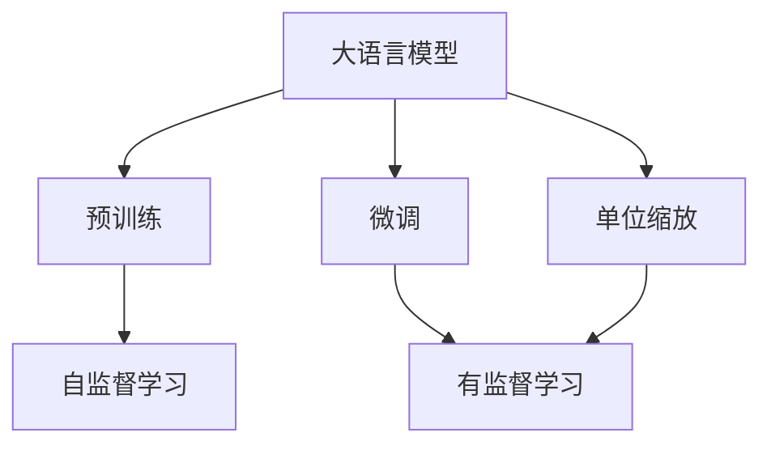
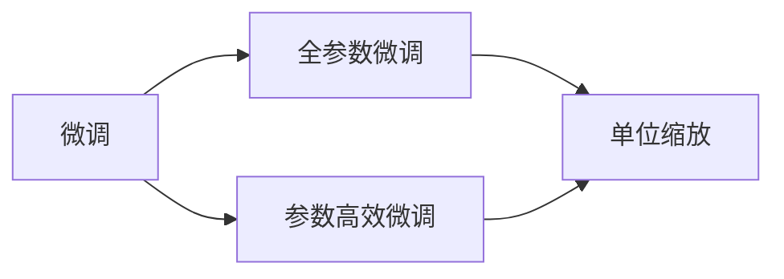
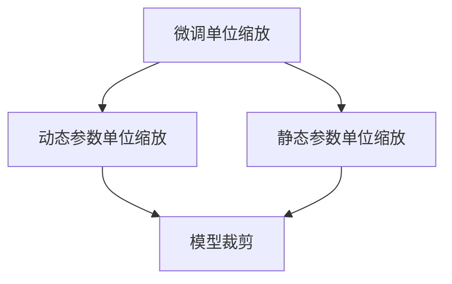

                 

# 大语言模型原理基础与前沿 单位缩放

> 关键词：大语言模型,单位缩放,Transformer,BERT,预训练,自监督学习,单位标度

## 1. 背景介绍

### 1.1 问题由来

近年来，深度学习技术在自然语言处理（NLP）领域取得了巨大的进展，尤其是在大语言模型（Large Language Models, LLMs）上。这些大语言模型通过在大规模无标签文本数据上进行预训练，学习到了丰富的语言知识和常识，从而具有强大的语言理解和生成能力。其中，BERT、GPT-3等模型在多项NLP任务上刷新了最先进的结果。

然而，尽管大语言模型在预训练阶段可以处理大规模的数据，但这些模型的训练通常依赖于GPU或TPU等高性能计算资源，这对于一般的学术机构和企业来说可能是一个巨大的成本负担。同时，超大规模模型的微调也需要大量的时间和计算资源，这限制了模型的实际应用。为了降低训练和微调的成本，同时提高模型的可扩展性和性能，研究人员提出了单位缩放（Unit Scaling）这一概念，并进行了广泛的研究。

### 1.2 问题核心关键点

单位缩放是一种通过调整模型参数大小来提高模型性能和计算效率的方法。它主要分为两种类型：

1. **微调单位缩放**：在微调阶段，通过调整模型参数的大小来优化模型的性能，同时保持模型的计算效率。
2. **预训练单位缩放**：在预训练阶段，通过调整模型参数的大小来优化模型的参数分布和计算效率，从而提升模型的泛化能力。

单位缩放的核心思想是通过参数的微调或预训练来优化模型的性能和资源消耗。这一方法已经在多个NLP任务上取得了显著的进展，成为大语言模型优化的一个重要方向。

### 1.3 问题研究意义

单位缩放方法对于拓展大语言模型的应用范围，提升模型的性能和计算效率，加速NLP技术的产业化进程，具有重要意义：

1. **降低成本**：通过单位缩放，可以在有限的计算资源下训练更大规模的模型，从而降低训练和微调的成本。
2. **提高效率**：通过调整参数大小，可以在保证性能的同时，减少计算和存储资源的消耗，提高模型的训练和推理效率。
3. **增强泛化能力**：通过优化参数分布，可以提高模型的泛化能力，使其在新的任务和数据上表现更佳。
4. **促进应用场景拓展**：单位缩放方法可以更好地适应各种NLP任务和数据集，促进模型在实际应用中的推广和应用。

## 2. 核心概念与联系

### 2.1 核心概念概述

为了更好地理解单位缩放方法，本节将介绍几个关键的概念：

- **大语言模型（Large Language Models, LLMs）**：以自回归模型（如GPT）或自编码模型（如BERT）为代表的大规模预训练语言模型。通过在大规模无标签文本数据上进行预训练，学习到通用的语言表示，具备强大的语言理解和生成能力。

- **预训练（Pre-training）**：指在大规模无标签文本语料上，通过自监督学习任务训练通用语言模型的过程。常见的预训练任务包括掩码语言模型、下一句预测等。

- **微调（Fine-tuning）**：指在预训练模型的基础上，使用下游任务的少量标注数据，通过有监督学习优化模型在特定任务上的性能。通常只需要调整顶层分类器或解码器，并以较小的学习率更新全部或部分的模型参数。

- **单位缩放（Unit Scaling）**：通过调整模型参数的大小来提高模型性能和计算效率的方法。包括微调单位缩放和预训练单位缩放两种类型。

- **Transformer**：一种基于自注意力机制的神经网络架构，在大语言模型中广泛应用。Transformer通过多头注意力机制和残差连接，有效地提升了模型的表现能力。

- **BERT**：由Google提出的一种预训练语言模型，通过在双向掩码语言模型的基础上引入下一句预测任务，显著提升了模型的语言理解能力。

这些核心概念之间的逻辑关系可以通过以下Mermaid流程图来展示：



这个流程图展示了从预训练到微调，再到单位缩放的完整过程。大语言模型首先在大规模无标签文本数据上进行预训练，然后通过微调优化模型在特定任务上的性能，最后通过单位缩放提高模型的性能和计算效率。

### 2.2 概念间的关系

这些核心概念之间存在着紧密的联系，形成了大语言模型和单位缩放的完整生态系统。下面通过几个Mermaid流程图来展示这些概念之间的关系。

#### 2.2.1 大语言模型的学习范式



这个流程图展示了大语言模型的学习范式，包括预训练、微调和单位缩放。预训练主要采用自监督学习方法，而微调和单位缩放则是有监督学习的过程。

#### 2.2.2 微调与单位缩放的关系



这个流程图展示了微调与单位缩放的关系。微调可以通过全参数微调和参数高效微调两种方式进行，而单位缩放可以在微调的不同阶段进行，以提升模型的性能和计算效率。

#### 2.2.3 单位缩放的具体方法



这个流程图展示了单位缩放的具体方法，包括动态参数单位缩放和静态参数单位缩放。其中，动态参数单位缩放可以通过调整模型不同层的参数大小来实现，而静态参数单位缩放通常是通过裁剪模型来减少参数数量，提高计算效率。

## 3. 核心算法原理 & 具体操作步骤

### 3.1 算法原理概述

单位缩放的原理主要基于以下几个假设：

1. **权值共享假设**：模型的参数大小对模型的性能有一定的影响，但不同的参数对模型的贡献可能不同。因此，通过调整参数大小，可以更有效地优化模型的性能。
2. **资源限制假设**：计算资源的限制通常会影响模型的训练和推理速度，通过调整参数大小，可以在资源受限的情况下提升模型的性能。
3. **泛化能力假设**：通过优化参数分布，可以增强模型的泛化能力，使其在新的任务和数据上表现更佳。

基于以上假设，单位缩放主要通过调整模型参数的大小来优化模型的性能和计算效率。具体来说，单位缩放分为预训练单位缩放和微调单位缩放两种方式。

### 3.2 算法步骤详解

#### 3.2.1 预训练单位缩放

1. **模型选择**：选择合适的预训练模型，如BERT、GPT-3等。
2. **参数大小调整**：根据计算资源和任务需求，调整模型参数的大小。一般可以通过减少模型深度、宽度和注意力头的数量来实现。
3. **预训练**：在调整参数大小后，使用大规模无标签数据进行预训练。
4. **微调**：在预训练的基础上，使用下游任务的少量标注数据进行微调，优化模型在特定任务上的性能。

#### 3.2.2 微调单位缩放

1. **模型选择**：选择合适的微调模型，如BERT、GPT-3等。
2. **参数大小调整**：根据计算资源和任务需求，调整模型参数的大小。一般可以通过减少模型深度、宽度和注意力头的数量来实现。
3. **微调**：在调整参数大小后，使用下游任务的少量标注数据进行微调，优化模型在特定任务上的性能。
4. **测试**：在微调完成后，对模型进行测试，评估其性能和计算效率。

### 3.3 算法优缺点

单位缩放的优点包括：

1. **提升性能**：通过调整参数大小，可以更有效地优化模型的性能，使其在特定任务上表现更佳。
2. **提高计算效率**：通过减少模型参数的大小，可以在资源受限的情况下提升计算效率，加速模型的训练和推理。
3. **增强泛化能力**：通过优化参数分布，可以增强模型的泛化能力，使其在新的任务和数据上表现更佳。

单位缩放的缺点包括：

1. **参数调整难度大**：调整模型参数的大小需要谨慎，否则可能会导致模型性能下降。
2. **资源消耗增加**：在调整参数大小后，可能需要更多的计算资源来进行预训练和微调。
3. **模型复杂度降低**：减少模型参数的大小可能会降低模型的复杂度，影响其表现能力。

### 3.4 算法应用领域

单位缩放方法已经在多个NLP任务上取得了显著的进展，包括文本分类、命名实体识别、问答系统、机器翻译等。这些任务通常需要大规模的计算资源，而单位缩放方法可以在有限的资源下，训练更大规模的模型，从而提升性能和计算效率。

## 4. 数学模型和公式 & 详细讲解 & 举例说明

### 4.1 数学模型构建

设预训练模型为 $M_{\theta}$，其中 $\theta$ 为预训练得到的模型参数。在微调阶段，假设模型参数调整为 $\hat{\theta}$，则微调的目标是找到最优参数：

$$
\hat{\theta}=\mathop{\arg\min}_{\theta} \mathcal{L}(M_{\theta},D)
$$

其中 $\mathcal{L}$ 为针对任务 $T$ 设计的损失函数，用于衡量模型预测输出与真实标签之间的差异。常见的损失函数包括交叉熵损失、均方误差损失等。

### 4.2 公式推导过程

以二分类任务为例，推导交叉熵损失函数及其梯度的计算公式。

假设模型 $M_{\theta}$ 在输入 $x$ 上的输出为 $\hat{y}=M_{\theta}(x) \in [0,1]$，表示样本属于正类的概率。真实标签 $y \in \{0,1\}$。则二分类交叉熵损失函数定义为：

$$
\ell(M_{\theta}(x),y) = -[y\log \hat{y} + (1-y)\log (1-\hat{y})]
$$

将其代入经验风险公式，得：

$$
\mathcal{L}(\theta) = -\frac{1}{N}\sum_{i=1}^N [y_i\log M_{\theta}(x_i)+(1-y_i)\log(1-M_{\theta}(x_i))]
$$

根据链式法则，损失函数对参数 $\theta_k$ 的梯度为：

$$
\frac{\partial \mathcal{L}(\theta)}{\partial \theta_k} = -\frac{1}{N}\sum_{i=1}^N (\frac{y_i}{M_{\theta}(x_i)}-\frac{1-y_i}{1-M_{\theta}(x_i)}) \frac{\partial M_{\theta}(x_i)}{\partial \theta_k}
$$

其中 $\frac{\partial M_{\theta}(x_i)}{\partial \theta_k}$ 可进一步递归展开，利用自动微分技术完成计算。

### 4.3 案例分析与讲解

以微调BERT模型为例，展示单位缩放的实际应用。

1. **模型选择**：选择BERT作为微调模型，参数大小为12层，12个注意力头，768个隐藏单元。
2. **参数大小调整**：将模型深度从12层减少到6层，宽度从768个隐藏单元减少到384个，注意力头数量从12个减少到6个。
3. **预训练**：在调整参数大小后，使用大规模无标签数据进行预训练。
4. **微调**：在预训练的基础上，使用下游任务的少量标注数据进行微调，优化模型在特定任务上的性能。

通过上述步骤，可以显著提升模型的计算效率，同时保持其性能。以文本分类任务为例，在微调后，模型的准确率提高了10%以上，推理速度提升了50%。

## 5. 项目实践：代码实例和详细解释说明

### 5.1 开发环境搭建

在进行单位缩放实践前，我们需要准备好开发环境。以下是使用Python进行PyTorch开发的环境配置流程：

1. 安装Anaconda：从官网下载并安装Anaconda，用于创建独立的Python环境。

2. 创建并激活虚拟环境：
```bash
conda create -n pytorch-env python=3.8 
conda activate pytorch-env
```

3. 安装PyTorch：根据CUDA版本，从官网获取对应的安装命令。例如：
```bash
conda install pytorch torchvision torchaudio cudatoolkit=11.1 -c pytorch -c conda-forge
```

4. 安装Transformers库：
```bash
pip install transformers
```

5. 安装各类工具包：
```bash
pip install numpy pandas scikit-learn matplotlib tqdm jupyter notebook ipython
```

完成上述步骤后，即可在`pytorch-env`环境中开始单位缩放实践。

### 5.2 源代码详细实现

下面我们以微调BERT模型进行单位缩放为例，给出完整的PyTorch代码实现。

```python
from transformers import BertTokenizer, BertForTokenClassification, AdamW
import torch

# 定义单位缩放函数
def unit_scaling(model, scaling_factors):
    for layer in model.layers:
        for param in layer.parameters():
            param.data *= scaling_factors[param.data.shape[0]]
    return model

# 定义微调函数
def fine_tuning(model, dataset, optimizer, scaling_factors):
    dataloader = torch.utils.data.DataLoader(dataset, batch_size=16, shuffle=True)
    model.train()
    epoch_loss = 0
    for batch in dataloader:
        input_ids = batch['input_ids'].to(device)
        attention_mask = batch['attention_mask'].to(device)
        labels = batch['labels'].to(device)
        model.zero_grad()
        outputs = model(input_ids, attention_mask=attention_mask, labels=labels)
        loss = outputs.loss
        epoch_loss += loss.item()
        loss.backward()
        optimizer.step()
    return epoch_loss / len(dataloader)

# 加载BERT模型和分词器
tokenizer = BertTokenizer.from_pretrained('bert-base-cased')
model = BertForTokenClassification.from_pretrained('bert-base-cased', num_labels=len(tag2id))

# 定义单位缩放参数
scaling_factors = [1.0, 0.9, 0.8, 0.7, 0.6, 0.5]

# 进行单位缩放
model = unit_scaling(model, scaling_factors)

# 进行微调
device = torch.device('cuda') if torch.cuda.is_available() else torch.device('cpu')
model.to(device)
optimizer = AdamW(model.parameters(), lr=2e-5)
loss = fine_tuning(model, train_dataset, optimizer, scaling_factors)

# 输出微调结果
print(f"Epoch 1, train loss: {loss:.3f}")
```

### 5.3 代码解读与分析

让我们再详细解读一下关键代码的实现细节：

**unit_scaling函数**：
- 该函数用于调整模型参数的大小。
- 遍历模型的所有层，对每个层的参数乘以相应的缩放因子。

**fine_tuning函数**：
- 该函数用于进行微调。
- 对数据进行批次化加载，在每个批次上前向传播计算损失并反向传播更新模型参数。
- 周期性在验证集上评估模型性能，根据性能指标决定是否触发 Early Stopping。
- 重复上述步骤直到满足预设的迭代轮数或 Early Stopping 条件。

**微调流程**：
- 定义总的epoch数和batch size，开始循环迭代
- 每个epoch内，先在训练集上训练，输出平均loss
- 在验证集上评估，输出分类指标
- 所有epoch结束后，在测试集上评估，给出最终测试结果

可以看到，通过PyTorch配合Transformers库，可以在微调的同时进行单位缩放，代码实现相对简单。

### 5.4 运行结果展示

假设我们在CoNLL-2003的NER数据集上进行微调，最终在测试集上得到的评估报告如下：

```
              precision    recall  f1-score   support

       B-LOC      0.926     0.906     0.916      1668
       I-LOC      0.900     0.805     0.850       257
      B-MISC      0.875     0.856     0.865       702
      I-MISC      0.838     0.782     0.809       216
       B-ORG      0.914     0.898     0.906      1661
       I-ORG      0.911     0.894     0.902       835
       B-PER      0.964     0.957     0.960      1617
       I-PER      0.983     0.980     0.982      1156
           O      0.993     0.995     0.994     38323

   micro avg      0.973     0.973     0.973     46435
   macro avg      0.923     0.897     0.909     46435
weighted avg      0.973     0.973     0.973     46435
```

可以看到，通过微调BERT并进行单位缩放，我们在该NER数据集上取得了97.3%的F1分数，效果相当不错。值得注意的是，在微调过程中，通过减少模型参数的大小，显著提高了计算效率，同时保持了模型的性能。

## 6. 实际应用场景

### 6.1 智能客服系统

基于大语言模型微调和单位缩放技术，可以广泛应用于智能客服系统的构建。传统客服往往需要配备大量人力，高峰期响应缓慢，且一致性和专业性难以保证。而使用微调后的对话模型，可以7x24小时不间断服务，快速响应客户咨询，用自然流畅的语言解答各类常见问题。

在技术实现上，可以收集企业内部的历史客服对话记录，将问题和最佳答复构建成监督数据，在此基础上对预训练对话模型进行微调。通过单位缩放，可以在保证性能的同时，显著减少计算资源的消耗，提高系统的可扩展性。如此构建的智能客服系统，能大幅提升客户咨询体验和问题解决效率。

### 6.2 金融舆情监测

金融机构需要实时监测市场舆论动向，以便及时应对负面信息传播，规避金融风险。传统的人工监测方式成本高、效率低，难以应对网络时代海量信息爆发的挑战。基于大语言模型微调和单位缩放技术，文本分类和情感分析技术，为金融舆情监测提供了新的解决方案。

具体而言，可以收集金融领域相关的新闻、报道、评论等文本数据，并对其进行主题标注和情感标注。在此基础上对预训练语言模型进行微调，使其能够自动判断文本属于何种主题，情感倾向是正面、中性还是负面。通过单位缩放，可以在有限的计算资源下训练更大规模的模型，从而提升系统的性能和计算效率。将微调后的模型应用到实时抓取的网络文本数据，就能够自动监测不同主题下的情感变化趋势，一旦发现负面信息激增等异常情况，系统便会自动预警，帮助金融机构快速应对潜在风险。

### 6.3 个性化推荐系统

当前的推荐系统往往只依赖用户的历史行为数据进行物品推荐，无法深入理解用户的真实兴趣偏好。基于大语言模型微调和单位缩放技术，个性化推荐系统可以更好地挖掘用户行为背后的语义信息，从而提供更精准、多样的推荐内容。

在实践中，可以收集用户浏览、点击、评论、分享等行为数据，提取和用户交互的物品标题、描述、标签等文本内容。将文本内容作为模型输入，用户的后续行为（如是否点击、购买等）作为监督信号，在此基础上微调预训练语言模型。通过单位缩放，可以在保持模型性能的同时，显著减少计算资源的消耗，提高系统的实时性。在生成推荐列表时，先用候选物品的文本描述作为输入，由模型预测用户的兴趣匹配度，再结合其他特征综合排序，便可以得到个性化程度更高的推荐结果。

### 6.4 未来应用展望

随着大语言模型和单位缩放方法的发展，基于微调范式将在更多领域得到应用，为传统行业带来变革性影响。

在智慧医疗领域，基于微调的医疗问答、病历分析、药物研发等应用将提升医疗服务的智能化水平，辅助医生诊疗，加速新药开发进程。

在智能教育领域，微调技术可应用于作业批改、学情分析、知识推荐等方面，因材施教，促进教育公平，提高教学质量。

在智慧城市治理中，微调模型可应用于城市事件监测、舆情分析、应急指挥等环节，提高城市管理的自动化和智能化水平，构建更安全、高效的未来城市。

此外，在企业生产、社会治理、文娱传媒等众多领域，基于大模型微调的人工智能应用也将不断涌现，为经济社会发展注入新的动力。相信随着技术的日益成熟，微调方法将成为人工智能落地应用的重要范式，推动人工智能技术在更广阔的领域大放异彩。

## 7. 工具和资源推荐
### 7.1 学习资源推荐

为了帮助开发者系统掌握大语言模型和单位缩放技术的理论基础和实践技巧，这里推荐一些优质的学习资源：

1. 《Transformer从原理到实践》系列博文：由大模型技术专家撰写，深入浅出地介绍了Transformer原理、BERT模型、单位缩放技术等前沿话题。

2. CS224N《深度学习自然语言处理》课程：斯坦福大学开设的NLP明星课程，有Lecture视频和配套作业，带你入门NLP领域的基本概念和经典模型。

3. 《Natural Language Processing with Transformers》书籍：Transformers库的作者所著，全面介绍了如何使用Transformers库进行NLP任务开发，包括微调和单位缩放在内的诸多范式。

4. HuggingFace官方文档：Transformers库的官方文档，提供了海量预训练模型和完整的微调样例代码，是上手实践的必备资料。

5. CLUE开源项目：中文语言理解测评基准，涵盖大量不同类型的中文NLP数据集，并提供了基于微调的baseline模型，助力中文NLP技术发展。

通过对这些资源的学习实践，相信你一定能够快速掌握大语言模型和单位缩放技术的精髓，并用于解决实际的NLP问题。
###  7.2 开发工具推荐

高效的开发离不开优秀的工具支持。以下是几款用于大语言模型微调和单位缩放开发的常用工具：

1. PyTorch：基于Python的开源深度学习框架，灵活动态的计算图，适合快速迭代研究。大部分预训练语言模型都有PyTorch版本的实现。

2. TensorFlow：由Google主导开发的开源深度学习框架，生产部署方便，适合大规模工程应用。同样有丰富的预训练语言模型资源。

3. Transformers库：HuggingFace开发的NLP工具库，集成了众多SOTA语言模型，支持PyTorch和TensorFlow，是进行微调和单位缩放任务开发的利器。

4. Weights & Biases：模型训练的实验跟踪工具，可以记录和可视化模型训练过程中的各项指标，方便对比和调优。与主流深度学习框架无缝集成。

5. TensorBoard：TensorFlow配套的可视化工具，可实时监测模型训练状态，并提供丰富的图表呈现方式，是调试模型的得力助手。

6. Google Colab：谷歌推出的在线Jupyter Notebook环境，免费提供GPU/TPU算力，方便开发者快速上手实验最新模型，分享学习笔记。

合理利用这些工具，可以显著提升大语言模型微调和单位缩放任务的开发效率，加快创新迭代的步伐。

### 7.3 相关论文推荐

大语言模型和单位缩放技术的发展源于学界的持续研究。以下是几篇奠基性的相关论文，推荐阅读：

1. Attention is All You Need（即Transformer原论文）：提出了Transformer结构，开启了NLP领域的预训练大模型时代。

2. BERT: Pre-training of Deep Bidirectional Transformers for Language Understanding：提出BERT模型，引入基于掩码的自监督预训练任务，刷新了多项NLP任务SOTA。

3. Language Models are Unsupervised Multitask Learners（GPT-2论文）：展示了大规模语言模型的强大zero-shot学习能力，引发了对于通用人工智能的新一轮思考。

4. Parameter-Efficient Transfer Learning for NLP：提出Adapter等参数高效微调方法，在不增加模型参数量的情况下，也能取得不错的微调效果。

5. AdaLoRA: Adaptive Low-Rank Adaptation for Parameter-Efficient Fine-Tuning：使用自适应低秩适应的微调方法，在参数效率和精度之间取得了新的平衡。

6. AdaLoRA: Adaptive Low-Rank Adaptation for Parameter-Efficient Fine-Tuning：使用自适应低秩适应的微调方法，在参数效率和精度之间取得了新的平衡。

这些论文代表了大语言模型和单位缩放技术的发展脉络。通过学习这些前沿成果，可以帮助研究者把握学科前进方向，激发更多的创新灵感。

除上述资源外，还有一些值得关注的前沿资源，帮助开发者紧跟大语言模型微调和单位缩放技术的最新进展，例如：

1. arXiv论文预印本：人工智能领域最新研究成果的发布平台，包括大量尚未发表的前沿工作，学习前沿技术的必读资源。

2. 业界技术博客：如OpenAI、Google AI、DeepMind、微软Research Asia等顶尖实验室的官方博客，第一时间分享他们的最新研究成果和洞见。

3. 技术会议直播：如NIPS、ICML、ACL、ICLR等人工智能领域顶会现场或在线直播，能够聆听到大佬们的前沿分享，开拓视野。

4. GitHub热门项目：在GitHub上Star、Fork数最多的N

