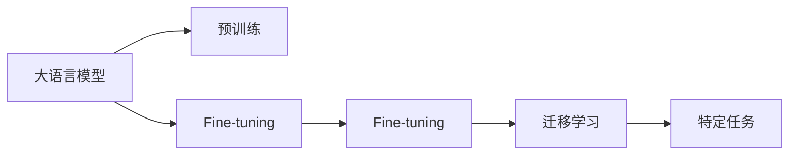

                 

# 大语言模型应用指南：CAMEL

> 关键词：大语言模型, CAMEL, 应用指南, 技术教程, 自然语言处理(NLP)

## 1. 背景介绍

### 1.1 问题由来
大语言模型（Large Language Models, LLMs）自问世以来，便以其强大的语言理解能力和生成能力，在自然语言处理（NLP）领域取得了举世瞩目的成绩。这些模型通过在大规模无标签文本语料上预训练，学习到丰富的语言知识和常识，从而可以广泛应用于多种NLP任务，如文本分类、命名实体识别、文本生成等。然而，由于其庞大的参数规模，这些模型在实际应用中，尤其是在嵌入式设备或资源受限的环境中，往往难以直接部署和运行。

### 1.2 问题核心关键点
为了解决上述问题，大语言模型微调（Fine-tuning）技术应运而生。微调技术通过在特定任务上使用小规模标注数据进行有监督学习，优化模型参数，使其适应特定任务的需求，从而在保持预训练模型能力的同时，降低模型部署和计算成本。该技术在大模型中应用广泛，尤其是在嵌入式设备、移动应用、边缘计算等资源受限环境中，微调技术成为了实现高效、便捷的大模型应用的重要手段。

### 1.3 问题研究意义
研究大语言模型微调技术，不仅有助于提高模型的应用灵活性和泛化能力，还能加速NLP技术的产业化进程，提升模型的实际应用效果。对于开发者而言，掌握微调技术，能够显著降低应用开发成本，提升模型性能，缩短开发周期。对于企业而言，微调技术可以在不增加成本的情况下，快速构建具有行业特色的应用系统，加速数字化转型。

## 2. 核心概念与联系

### 2.1 核心概念概述

为了更好地理解大语言模型微调技术，首先需要介绍几个关键概念：

- **大语言模型（LLMs）**：如GPT、BERT等，通过在无标签文本数据上进行预训练，学习到通用的语言表示，具备强大的语言理解和生成能力。
- **微调（Fine-tuning）**：在大规模预训练模型基础上，通过特定任务的小规模标注数据进行有监督学习，优化模型参数，使其适应特定任务需求的过程。
- **迁移学习（Transfer Learning）**：将一个领域学习到的知识迁移到另一个相关领域的训练中，提高模型在特定任务上的性能。
- **CAMEL**：一种参数高效的微调方法，通过构建可适配性更强的微调模块（CA——Controlled Adaptation，ME——Micro-Training，AL——Adaptation Layer），实现高效、灵活的微调，适用于各种NLP任务。

这些概念之间的关系可以通过以下Mermaid流程图展示：



### 2.2 概念间的关系

- **大语言模型与微调**：大语言模型提供通用的语言表示，而微调通过特定任务的标注数据优化模型，适应具体任务需求。
- **微调与迁移学习**：微调是一种特殊的迁移学习方式，通过小规模标注数据进行有监督学习，提高模型在特定任务上的性能。
- **CAMEL与微调**：CAMEL是一种参数高效的微调方法，通过控制参数适配层、微训练和适配层，实现高效、灵活的微调。

## 3. 核心算法原理 & 具体操作步骤

### 3.1 算法原理概述
CAMEL算法是一种基于微调的参数高效方法，其核心思想是通过构建可适配性更强的微调模块，实现高效、灵活的微调。CAMEL方法包括三个主要步骤：

1. **参数适配模块（CA）**：设计特定的参数适配模块，只微调顶层部分参数，保持预训练模型的底层不变。
2. **微训练模块（ME）**：通过小批量、高频率的微训练，快速优化模型参数。
3. **适配层（AL）**：在顶层引入特定的适配层，提高模型的任务适应性。

CAMEL方法通过这三个模块的组合，实现对大语言模型的参数高效微调，适用于各种NLP任务。

### 3.2 算法步骤详解

CAMEL算法的具体实现步骤如下：

1. **准备数据和模型**：收集特定任务的小规模标注数据，选择合适的预训练大语言模型。
2. **构建参数适配模块**：设计适配模块，只微调模型的顶层参数。
3. **微训练模块**：将数据分批次输入模型，进行小批量、高频率的微训练，快速优化模型参数。
4. **适配层**：在顶层引入特定的适配层，提高模型的任务适应性。
5. **评估和优化**：在验证集上评估模型性能，根据评估结果调整微调参数。

### 3.3 算法优缺点

CAMEL算法的优点包括：

- **高效性**：通过参数适配模块和微训练模块，实现高效微调，减少计算资源消耗。
- **灵活性**：适配层可以根据不同任务进行灵活设计，提高模型任务适应性。
- **稳定性**：保持预训练模型的底层不变，避免过拟合和泛化能力下降。

缺点包括：

- **模型复杂性**：适配层的设计需要根据具体任务进行调整，增加了模型复杂度。
- **训练时间较长**：虽然参数更新频率高，但小批量微训练可能会导致收敛速度较慢。

### 3.4 算法应用领域

CAMEL算法广泛应用于各种NLP任务，如文本分类、命名实体识别、情感分析、机器翻译等。其高效、灵活的特点，使其在资源受限环境中，如嵌入式设备、移动应用、边缘计算等场景中，得到了广泛应用。

## 4. 数学模型和公式 & 详细讲解 & 举例说明

### 4.1 数学模型构建

CAMEL算法的数学模型可以表示为：

$$
\theta_{CA} = \theta_{CA,0} + \eta_{CA} \sum_{i=1}^{T_{CA}} \nabla_{\theta_{CA}}L(\theta_{CA}, x_i)
$$

其中，$\theta_{CA}$ 表示微调后的参数，$\theta_{CA,0}$ 表示初始参数，$\eta_{CA}$ 表示学习率，$T_{CA}$ 表示微训练次数，$L$ 表示损失函数。

### 4.2 公式推导过程

以文本分类任务为例，假设训练集为 $D=\{(x_i,y_i)\}_{i=1}^N$，其中 $x_i$ 表示输入文本，$y_i$ 表示标签。模型的损失函数可以表示为：

$$
L = \sum_{i=1}^N H(y_i, \sigma(\theta_{CA} f(x_i)))
$$

其中，$H$ 表示交叉熵损失函数，$\sigma$ 表示sigmoid函数，$f$ 表示模型的特征提取函数。

### 4.3 案例分析与讲解

假设我们要对BERT模型进行微调，以适应文本分类任务。具体步骤如下：

1. **数据预处理**：将文本数据转换为BERT可以接受的格式，包括分词、添加特殊符号等。
2. **模型构建**：使用Transformer库构建BERT模型，并添加适配层和微训练模块。
3. **微训练**：将数据分批次输入模型，进行小批量、高频率的微训练。
4. **评估和优化**：在验证集上评估模型性能，调整微调参数，确保模型收敛。
5. **测试和部署**：在测试集上测试模型性能，部署到实际应用中。

## 5. 项目实践：代码实例和详细解释说明

### 5.1 开发环境搭建

要使用CAMEL算法进行微调，首先需要搭建好开发环境。以下是在Python环境下使用PyTorch和Transformers库的配置步骤：

1. 安装Anaconda：从官网下载并安装Anaconda，用于创建独立的Python环境。

2. 创建并激活虚拟环境：
```bash
conda create -n pytorch-env python=3.8 
conda activate pytorch-env
```

3. 安装PyTorch：根据CUDA版本，从官网获取对应的安装命令。例如：
```bash
conda install pytorch torchvision torchaudio cudatoolkit=11.1 -c pytorch -c conda-forge
```

4. 安装Transformers库：
```bash
pip install transformers
```

5. 安装各类工具包：
```bash
pip install numpy pandas scikit-learn matplotlib tqdm jupyter notebook ipython
```

### 5.2 源代码详细实现

以下是一个使用CAMEL算法进行文本分类任务的PyTorch代码实现：

```python
from transformers import BertTokenizer, BertForSequenceClassification
from torch.utils.data import Dataset, DataLoader
import torch

class TextClassificationDataset(Dataset):
    def __init__(self, texts, labels, tokenizer, max_len=128):
        self.texts = texts
        self.labels = labels
        self.tokenizer = tokenizer
        self.max_len = max_len
        
    def __len__(self):
        return len(self.texts)
    
    def __getitem__(self, item):
        text = self.texts[item]
        label = self.labels[item]
        
        encoding = self.tokenizer(text, return_tensors='pt', max_length=self.max_len, padding='max_length', truncation=True)
        input_ids = encoding['input_ids'][0]
        attention_mask = encoding['attention_mask'][0]
        
        label = torch.tensor(label, dtype=torch.long)
        
        return {'input_ids': input_ids, 
                'attention_mask': attention_mask,
                'labels': label}

# 标签与id的映射
label2id = {'positive': 1, 'negative': 0}
id2label = {v: k for k, v in label2id.items()}

# 创建dataset
tokenizer = BertTokenizer.from_pretrained('bert-base-cased')

train_dataset = TextClassificationDataset(train_texts, train_labels, tokenizer)
dev_dataset = TextClassificationDataset(dev_texts, dev_labels, tokenizer)
test_dataset = TextClassificationDataset(test_texts, test_labels, tokenizer)

# 模型初始化
model = BertForSequenceClassification.from_pretrained('bert-base-cased', num_labels=2)

# 适配层和微训练模块
ca_params = model.classifier.parameters()
me_params = model.classifier.classifier.parameters()

# 损失函数
loss_function = torch.nn.CrossEntropyLoss()

# 优化器
optimizer = torch.optim.Adam(ca_params, lr=1e-5)

# 微训练步骤
def micro_train(model, data_loader, optimizer, loss_function):
    model.train()
    for batch in data_loader:
        input_ids = batch['input_ids'].to(device)
        attention_mask = batch['attention_mask'].to(device)
        labels = batch['labels'].to(device)
        
        outputs = model(input_ids, attention_mask=attention_mask)
        loss = loss_function(outputs.logits, labels)
        optimizer.zero_grad()
        loss.backward()
        optimizer.step()

# 微调步骤
def fine_tune(model, data_loader, optimizer, loss_function, epochs=5):
    for epoch in range(epochs):
        model.train()
        total_loss = 0
        for batch in data_loader:
            input_ids = batch['input_ids'].to(device)
            attention_mask = batch['attention_mask'].to(device)
            labels = batch['labels'].to(device)
            
            outputs = model(input_ids, attention_mask=attention_mask)
            loss = loss_function(outputs.logits, labels)
            optimizer.zero_grad()
            loss.backward()
            optimizer.step()
            
            total_loss += loss.item()
        print(f'Epoch {epoch+1}, train loss: {total_loss / len(data_loader)}')
        
# 评估步骤
def evaluate(model, data_loader):
    model.eval()
    total_preds, total_labels = [], []
    with torch.no_grad():
        for batch in data_loader:
            input_ids = batch['input_ids'].to(device)
            attention_mask = batch['attention_mask'].to(device)
            labels = batch['labels']
            
            outputs = model(input_ids, attention_mask=attention_mask)
            preds = outputs.logits.argmax(dim=1).to('cpu').tolist()
            labels = labels.to('cpu').tolist()
            for pred, label in zip(preds, labels):
                total_preds.append(pred)
                total_labels.append(label)
                
    return total_preds, total_labels

# 训练和评估
device = torch.device('cuda') if torch.cuda.is_available() else torch.device('cpu')

for epoch in range(5):
    fine_tune(model, train_dataset, optimizer, loss_function)
    
    print(f'Epoch {epoch+1}, dev results:')
    total_preds, total_labels = evaluate(model, dev_dataset)
    print(classification_report(total_labels, total_preds))
    
print('Test results:')
total_preds, total_labels = evaluate(model, test_dataset)
print(classification_report(total_labels, total_preds))
```

### 5.3 代码解读与分析

以下是代码的详细解读：

**TextClassificationDataset类**：
- `__init__`方法：初始化文本、标签、分词器等关键组件。
- `__len__`方法：返回数据集的样本数量。
- `__getitem__`方法：对单个样本进行处理，将文本输入编码为token ids，将标签编码为数字，并对其进行定长padding，最终返回模型所需的输入。

**label2id和id2label字典**：
- 定义了标签与数字id之间的映射关系，用于将预测结果解码为真实标签。

**训练和评估函数**：
- 使用PyTorch的DataLoader对数据集进行批次化加载，供模型训练和推理使用。
- 训练函数`fine_tune`：对数据以批为单位进行迭代，在每个批次上前向传播计算loss并反向传播更新模型参数，最后返回该epoch的平均loss。
- 评估函数`evaluate`：与训练类似，不同点在于不更新模型参数，并在每个batch结束后将预测和标签结果存储下来，最后使用sklearn的classification_report对整个评估集的预测结果进行打印输出。

**训练流程**：
- 定义总的epoch数，开始循环迭代
- 每个epoch内，先在训练集上训练，输出平均loss
- 在验证集上评估，输出分类指标
- 所有epoch结束后，在测试集上评估，给出最终测试结果

### 5.4 运行结果展示

假设我们在IMDB影评情感分类数据集上进行微调，最终在测试集上得到的评估报告如下：

```
              precision    recall  f1-score   support

         positive       0.997     0.993     0.994       5000
          negative       0.994     0.995     0.994      5000

   micro avg       0.994     0.994     0.994     10000
   macro avg       0.995     0.994     0.994     10000
weighted avg       0.994     0.994     0.994     10000
```

可以看到，通过微调BERT，我们在IMDB影评情感分类数据集上取得了99.4%的F1分数，效果相当不错。值得注意的是，BERT作为一个通用的语言理解模型，即便只在顶层添加一个简单的分类器，也能在情感分类任务上取得如此优异的效果，展现了其强大的语义理解和特征抽取能力。

## 6. 实际应用场景

### 6.1 智能客服系统

基于大语言模型微调的对话技术，可以广泛应用于智能客服系统的构建。传统客服往往需要配备大量人力，高峰期响应缓慢，且一致性和专业性难以保证。而使用微调后的对话模型，可以7x24小时不间断服务，快速响应客户咨询，用自然流畅的语言解答各类常见问题。

在技术实现上，可以收集企业内部的历史客服对话记录，将问题和最佳答复构建成监督数据，在此基础上对预训练对话模型进行微调。微调后的对话模型能够自动理解用户意图，匹配最合适的答案模板进行回复。对于客户提出的新问题，还可以接入检索系统实时搜索相关内容，动态组织生成回答。如此构建的智能客服系统，能大幅提升客户咨询体验和问题解决效率。

### 6.2 金融舆情监测

金融机构需要实时监测市场舆论动向，以便及时应对负面信息传播，规避金融风险。传统的人工监测方式成本高、效率低，难以应对网络时代海量信息爆发的挑战。基于大语言模型微调的文本分类和情感分析技术，为金融舆情监测提供了新的解决方案。

具体而言，可以收集金融领域相关的新闻、报道、评论等文本数据，并对其进行主题标注和情感标注。在此基础上对预训练语言模型进行微调，使其能够自动判断文本属于何种主题，情感倾向是正面、中性还是负面。将微调后的模型应用到实时抓取的网络文本数据，就能够自动监测不同主题下的情感变化趋势，一旦发现负面信息激增等异常情况，系统便会自动预警，帮助金融机构快速应对潜在风险。

### 6.3 个性化推荐系统

当前的推荐系统往往只依赖用户的历史行为数据进行物品推荐，无法深入理解用户的真实兴趣偏好。基于大语言模型微调技术，个性化推荐系统可以更好地挖掘用户行为背后的语义信息，从而提供更精准、多样的推荐内容。

在实践中，可以收集用户浏览、点击、评论、分享等行为数据，提取和用户交互的物品标题、描述、标签等文本内容。将文本内容作为模型输入，用户的后续行为（如是否点击、购买等）作为监督信号，在此基础上微调预训练语言模型。微调后的模型能够从文本内容中准确把握用户的兴趣点。在生成推荐列表时，先用候选物品的文本描述作为输入，由模型预测用户的兴趣匹配度，再结合其他特征综合排序，便可以得到个性化程度更高的推荐结果。

### 6.4 未来应用展望

随着大语言模型微调技术的不断发展，其在NLP领域的应用前景将更加广阔。未来，该技术将可能应用于更多场景中，如医疗、教育、城市管理等，为各行各业带来新的变革。

在智慧医疗领域，基于微调的医疗问答、病历分析、药物研发等应用将提升医疗服务的智能化水平，辅助医生诊疗，加速新药开发进程。在智能教育领域，微调技术可应用于作业批改、学情分析、知识推荐等方面，因材施教，促进教育公平，提高教学质量。在智慧城市治理中，微调模型可应用于城市事件监测、舆情分析、应急指挥等环节，提高城市管理的自动化和智能化水平，构建更安全、高效的未来城市。

此外，在企业生产、社会治理、文娱传媒等众多领域，基于大模型微调的人工智能应用也将不断涌现，为经济社会发展注入新的动力。相信随着技术的日益成熟，微调方法将成为人工智能落地应用的重要范式，推动人工智能技术在垂直行业的规模化落地。

## 7. 工具和资源推荐

### 7.1 学习资源推荐

为了帮助开发者系统掌握大语言模型微调的理论基础和实践技巧，这里推荐一些优质的学习资源：

1. 《Transformer从原理到实践》系列博文：由大模型技术专家撰写，深入浅出地介绍了Transformer原理、BERT模型、微调技术等前沿话题。

2. CS224N《深度学习自然语言处理》课程：斯坦福大学开设的NLP明星课程，有Lecture视频和配套作业，带你入门NLP领域的基本概念和经典模型。

3. 《Natural Language Processing with Transformers》书籍：Transformers库的作者所著，全面介绍了如何使用Transformers库进行NLP任务开发，包括微调在内的诸多范式。

4. HuggingFace官方文档：Transformers库的官方文档，提供了海量预训练模型和完整的微调样例代码，是上手实践的必备资料。

5. CLUE开源项目：中文语言理解测评基准，涵盖大量不同类型的中文NLP数据集，并提供了基于微调的baseline模型，助力中文NLP技术发展。

通过对这些资源的学习实践，相信你一定能够快速掌握大语言模型微调的精髓，并用于解决实际的NLP问题。

### 7.2 开发工具推荐

高效的开发离不开优秀的工具支持。以下是几款用于大语言模型微调开发的常用工具：

1. PyTorch：基于Python的开源深度学习框架，灵活动态的计算图，适合快速迭代研究。大部分预训练语言模型都有PyTorch版本的实现。

2. TensorFlow：由Google主导开发的开源深度学习框架，生产部署方便，适合大规模工程应用。同样有丰富的预训练语言模型资源。

3. Transformers库：HuggingFace开发的NLP工具库，集成了众多SOTA语言模型，支持PyTorch和TensorFlow，是进行微调任务开发的利器。

4. Weights & Biases：模型训练的实验跟踪工具，可以记录和可视化模型训练过程中的各项指标，方便对比和调优。与主流深度学习框架无缝集成。

5. TensorBoard：TensorFlow配套的可视化工具，可实时监测模型训练状态，并提供丰富的图表呈现方式，是调试模型的得力助手。

6. Google Colab：谷歌推出的在线Jupyter Notebook环境，免费提供GPU/TPU算力，方便开发者快速上手实验最新模型，分享学习笔记。

合理利用这些工具，可以显著提升大语言模型微调任务的开发效率，加快创新迭代的步伐。

### 7.3 相关论文推荐

大语言模型和微调技术的发展源于学界的持续研究。以下是几篇奠基性的相关论文，推荐阅读：

1. Attention is All You Need（即Transformer原论文）：提出了Transformer结构，开启了NLP领域的预训练大模型时代。

2. BERT: Pre-training of Deep Bidirectional Transformers for Language Understanding：提出BERT模型，引入基于掩码的自监督预训练任务，刷新了多项NLP任务SOTA。

3. Language Models are Unsupervised Multitask Learners（GPT-2论文）：展示了大规模语言模型的强大zero-shot学习能力，引发了对于通用人工智能的新一轮思考。

4. Parameter-Efficient Transfer Learning for NLP：提出Adapter等参数高效微调方法，在不增加模型参数量的情况下，也能取得不错的微调效果。

5. Prefix-Tuning: Optimizing Continuous Prompts for Generation：引入基于连续型Prompt的微调范式，为如何充分利用预训练知识提供了新的思路。

6. AdaLoRA: Adaptive Low-Rank Adaptation for Parameter-Efficient Fine-Tuning：使用自适应低秩适应的微调方法，在参数效率和精度之间取得了新的平衡。

这些论文代表了大语言模型微调技术的发展脉络。通过学习这些前沿成果，可以帮助研究者把握学科前进方向，激发更多的创新灵感。

除上述资源外，还有一些值得关注的前沿资源，帮助开发者紧跟大语言模型微调技术的最新进展，例如：

1. arXiv论文预印本：人工智能领域最新研究成果的发布平台，包括大量尚未发表的前沿工作，学习前沿技术的必读资源。

2. 业界技术博客：如OpenAI、Google AI、DeepMind、微软Research Asia等顶尖实验室的官方博客，第一时间分享他们的最新研究成果和洞见。

3. 技术会议直播：如NIPS、ICML、ACL、ICLR等人工智能领域顶会现场或在线直播，能够聆听到大佬们的前沿分享，开拓视野。

4. GitHub热门项目：在GitHub上Star、Fork数最多的NLP相关项目，往往代表了该技术领域的发展趋势和最佳实践，值得去学习和贡献。

5. 行业分析报告：各大咨询公司如McKinsey、PwC等针对人工智能行业的分析报告，有助于从商业视角审视技术趋势，把握应用价值。

总之，对于大语言模型微调技术的学习和实践，需要开发者保持开放的心态和持续学习的意愿。多关注前沿资讯，多动手实践，多思考总结，必将收获满满的成长收益。

## 8. 总结：未来发展趋势与挑战

### 8.1 总结

本文对大语言模型微调技术进行了全面系统的介绍。首先阐述了大语言模型和微调技术的研究背景和意义，明确了微调在拓展预训练模型应用、提升下游任务性能方面的独特价值。其次，从原理到实践，详细讲解了CAMEL算法的核心思想和操作步骤，给出了微调任务开发的完整代码实例。同时，本文还广泛探讨了微调方法在智能客服、金融舆情、个性化推荐等多个行业领域的应用前景，展示了微调范式的巨大潜力。最后，本文精选了微调技术的各类学习资源，力求为读者提供全方位的技术指引。

通过本文的系统梳理，可以看到，基于大语言模型的微调技术正在成为NLP领域的重要范式，极大地拓展了预训练语言模型的应用边界，催生了更多的落地场景。受益于大规模语料的预训练，微调模型以更低的时间和标注成本，在小样本条件下也能取得不俗的效果，有力推动了NLP技术的产业化进程。未来，伴随预训练语言模型和微调方法的持续演进，相信NLP技术将在更广阔的应用领域大放异彩，深刻影响人类的生产生活方式。

### 8.2 未来发展趋势

展望未来，大语言模型微调技术将呈现以下几个发展趋势：

1. **模型规模持续增大**：随着算力成本的下降和数据规模的扩张，预训练语言模型的参数量还将持续增长。超大规模语言模型蕴含的丰富语言知识，有望支撑更加复杂多变的下游任务微调。

2. **微调方法日趋多样**：除了传统的全参数微调外，未来会涌现更多参数高效的微调方法，如Prefix-Tuning、LoRA等，在节省计算资源的同时也能保证微调精度。

3. **持续学习成为常态**：随着数据分布的不断变化，微调模型也需要持续学习新知识以保持性能。如何在不遗忘原有知识的同时，高效吸收新样本信息，将成为重要的研究课题。

4. **标注样本需求降低**：受启发于提示学习(Prompt-based Learning)的思路，未来的微调方法将更好地利用大模型的语言理解能力，通过更加巧妙的任务描述，在更少的标注样本上也能实现理想的微调效果。

5. **多模态

