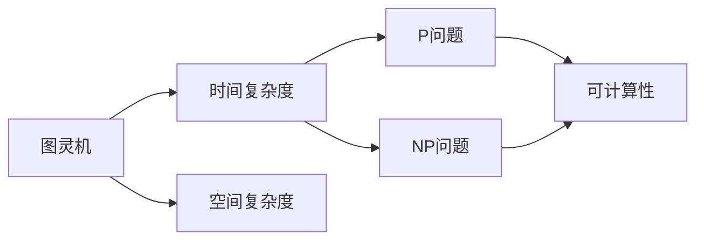

                 

# 计算：第四部分 计算的极限 第 9 章 计算复杂性 认知的边界

## 1. 背景介绍

### 1.1 问题由来

计算复杂性（Computational Complexity）是计算机科学和信息论中的一个核心概念，它研究算法在不同数据规模下的运行时间，帮助我们理解哪些问题是可以解决的，哪些是难以解决的。计算复杂性的研究直接关系到我们能否实现高效、可扩展的计算系统，从而提升人类对问题的认知能力。

随着计算机技术的飞速发展，尤其是大规模并行计算和分布式系统的应用，计算复杂性理论也在不断演变，帮助我们重新审视和应对复杂的计算问题。本章将详细介绍计算复杂性的核心概念，探讨其在计算极限和认知边界上的应用，以及未来的研究方向。

### 1.2 问题核心关键点

计算复杂性理论的核心在于研究问题的计算难度，包括时间复杂度、空间复杂度、可计算性等。计算复杂性理论分为两个主要分支：

1. 计算能力（Computational Power）：研究不同计算模型（如图灵机、量子计算机等）的计算能力，以及它们在计算不同问题时的表现。
2. 计算难度（Computational Difficulty）：研究哪些问题可以高效计算，哪些问题本质上是无法计算的，以及不同问题间的计算难度关系。

这些核心概念和研究方向构成了计算复杂性理论的基础框架，并广泛应用于密码学、机器学习、人工智能等领域，推动了计算科学的发展。

### 1.3 问题研究意义

理解计算复杂性理论的核心理论和应用，对于指导计算机科学的研究方向，评估算法和系统的性能，以及推动认知边界的拓展具有重要意义：

1. 算法设计与优化：理解问题的计算复杂性，可以帮助我们选择最优的算法策略，设计高效的计算模型，提升系统的性能和扩展性。
2. 密码学与安全性：计算复杂性理论是现代密码学的基础，帮助理解不同密码算法（如对称加密、公钥加密等）的安全性和计算难度。
3. 人工智能与机器学习：计算复杂性理论指导人工智能算法的设计，帮助理解不同学习任务（如监督学习、无监督学习等）的计算难度，推动深度学习和强化学习的进展。
4. 认知科学：计算复杂性理论为理解人类认知和思维提供了新视角，帮助探究人类智能的计算基础和极限。
5. 计算伦理与安全：计算复杂性理论指导安全系统设计，帮助理解数据隐私和安全问题的计算难度，推动计算伦理的讨论和实践。

总之，计算复杂性理论不仅是计算机科学的基石，更是推动人类认知边界的利器，具有广泛而深远的理论和应用价值。

## 2. 核心概念与联系

### 2.1 核心概念概述

计算复杂性理论涉及许多核心概念，包括但不限于：

- 图灵机（Turing Machine）：计算复杂性的基础模型，描述了一个可以执行任何计算任务的理想机器。
- 时间复杂度（Time Complexity）：衡量算法运行时间与问题规模之间的关系，通常用大O记号表示。
- 空间复杂度（Space Complexity）：衡量算法内存使用量与问题规模之间的关系，也是用大O记号表示。
- 可计算性（Computability）：研究哪些问题可以通过计算解决，哪些问题是不可计算的。
- P问题（P-problem）：可以在多项式时间内解决的问题，代表最困难的计算问题。
- NP问题（NP-problem）：可以在多项式时间内验证其解的问题。

这些核心概念之间有着紧密的联系，形成了计算复杂性理论的基本框架。通过理解这些概念，我们可以更好地把握计算的极限和认知的边界。

### 2.2 概念间的关系

计算复杂性理论中的概念之间有着复杂的相互作用，以下使用几个Mermaid流程图来展示这些概念之间的关系：



这个流程图展示了图灵机、时间复杂度、空间复杂度、P问题、NP问题以及可计算性之间的基本关系：

1. 图灵机是计算复杂性的基础模型，通过图灵机定义了所有可计算问题的计算能力。
2. 时间复杂度和空间复杂度分别衡量算法运行时间和内存使用量，是评估算法效率的重要指标。
3. P问题和NP问题代表计算难度分类，P问题是多项式时间内可解的问题，NP问题是多项式时间内可验证的问题。
4. 可计算性研究问题的计算难度，P和NP问题分别代表了可计算和不可计算的极限。

这些概念之间相互作用，共同构成了计算复杂性理论的核心框架，帮助我们理解计算的极限和认知的边界。

## 3. 核心算法原理 & 具体操作步骤

### 3.1 算法原理概述

计算复杂性理论的研究主要集中在算法的设计与分析上，通过分析算法在不同数据规模下的计算复杂度，帮助我们理解问题的计算难度和可行性。具体来说，计算复杂性理论主要关注以下几个方面：

- 时间复杂度的分析：通过分析算法在输入规模增加时的时间消耗，评估算法的效率。
- 空间复杂度的分析：通过分析算法在输入规模增加时的内存使用量，评估算法的空间需求。
- 算法正确性和可扩展性：通过数学模型和证明，评估算法在不同输入规模下的正确性和可扩展性。

计算复杂性理论的核心原理可以通过以下几个数学模型来表达：

- 递归函数（Recursive Function）：用于定义和描述计算问题。
- 图灵机模型（Turing Machine Model）：用于模拟计算过程和分析计算能力。
- 可计算性理论（Computability Theory）：用于研究哪些问题可以通过计算解决，哪些问题是不可计算的。
- 复杂度理论（Complexity Theory）：用于研究算法的计算复杂度，包括时间复杂度和空间复杂度。

### 3.2 算法步骤详解

以下是计算复杂性理论中核心的算法步骤和具体操作步骤：

1. **问题建模**：将实际问题转化为计算模型中的递归函数或图灵机。这一步需要将问题具体化，并确定输入规模。

2. **算法设计**：根据问题建模结果，设计一种求解问题的算法，并进行初步分析和评估。

3. **复杂度分析**：通过数学模型和证明，对算法的时间复杂度和空间复杂度进行详细分析。这一步需要运用递归函数和图灵机等理论工具。

4. **复杂度分类**：将算法按时间复杂度和空间复杂度进行分类，确定算法在不同数据规模下的计算能力。这一步通常使用大O记号进行表示。

5. **可计算性研究**：研究问题的可计算性，确定问题是否可以通过计算解决。这一步通常使用递归函数和图灵机等工具进行证明。

### 3.3 算法优缺点

计算复杂性理论在指导算法设计和评估方面具有重要意义，但也存在一些局限性：

- **抽象性和复杂性**：计算复杂性理论抽象度高，需要一定的数学和算法基础。初学者可能需要较长时间学习和理解。
- **理论性和实践性**：计算复杂性理论主要关注理论分析和证明，实际操作中可能与实际情况有所出入。
- **评估方法的局限**：计算复杂度仅能评估算法在特定问题上的计算难度，无法全面评估算法的实际性能。
- **优化复杂度**：某些复杂度较高的算法，可能通过优化策略（如并行计算、分布式计算等）进行优化，实际运行效率可能优于理论复杂度。

### 3.4 算法应用领域

计算复杂性理论不仅在计算机科学领域具有重要应用，还在密码学、网络安全、数据科学等领域有广泛应用。以下是几个主要应用领域：

- **密码学**：计算复杂性理论是现代密码学的基础，研究不同密码算法（如对称加密、公钥加密等）的安全性和计算难度。
- **网络安全**：计算复杂性理论指导网络安全系统的设计，帮助理解不同安全协议的计算难度和安全性。
- **数据科学**：计算复杂性理论帮助理解数据处理和分析算法的计算难度，指导数据挖掘和机器学习算法的设计。
- **人工智能**：计算复杂性理论指导人工智能算法的设计，帮助理解不同学习任务（如监督学习、无监督学习等）的计算难度。

## 4. 数学模型和公式 & 详细讲解 & 举例说明

### 4.1 数学模型构建

计算复杂性理论中的数学模型通常包括递归函数、图灵机、复杂度函数等。以下以图灵机模型为例，详细介绍数学模型的构建方法。

假设有一个图灵机M，对于输入字符串w，图灵机M的计算过程可以表示为一系列状态转移：

- $s_0$：初始状态，表示图灵机M开始执行计算。
- $s_i$：第i步计算的状态，根据计算规则进行状态转移。
- $s_f$：最终状态，表示计算完成或出现死循环。
- $q$：图灵机M的计算步骤，通常表示为一个递归函数。

图灵机M的计算过程可以表示为：

$$
q(w,s_0) \rightarrow (s_1, s_1) \rightarrow \cdots \rightarrow (s_f, s_f)
$$

其中，$q(w,s_i)$表示在状态$s_i$下，图灵机M对输入字符串w进行计算，输出状态转移（$s_{i+1}, q(w,s_{i+1})$）。

### 4.2 公式推导过程

计算复杂性理论中的公式推导通常涉及递归函数和图灵机模型的转化。以下以时间复杂度为例，详细介绍时间复杂度的推导过程。

假设有一个递归函数$f(n)$，表示算法对输入规模为$n$的数据进行计算所需的时间。时间复杂度通常用大O记号表示，即$O(f(n))$。

假设递归函数$f(n)$可以分解为两个子问题$f(n/2)$和$f(n/2)$，则时间复杂度可以推导如下：

$$
f(n) = 2f(n/2) + O(1)
$$

其中，$O(1)$表示常数项，可以忽略。通过递归展开，可以得到：

$$
f(n) = 2^kf(n/2^k) + O(k)
$$

当$k$趋近于$\infty$时，时间复杂度可以简化为：

$$
f(n) = O(2^kf(n/2^k))
$$

即，时间复杂度为指数级别。

### 4.3 案例分析与讲解

以下以一个简单的排序算法为例，详细讲解时间复杂度的推导和应用。

假设有一个冒泡排序算法，对长度为$n$的数组进行排序，其时间复杂度可以推导如下：

1. **初始化**：$O(1)$
2. **第一次遍历**：$O(n)$
3. **后续遍历**：对于每个元素，需要比较和交换，时间复杂度为$O(n)$
4. **最终结果**：$O(n^2)$

因此，冒泡排序算法的时间复杂度为$O(n^2)$，表明在数据规模较大时，其计算效率较低，不适合大规模数据处理。

## 5. 项目实践：代码实例和详细解释说明

### 5.1 开发环境搭建

在进行计算复杂性理论的实践时，需要搭建一个合适的开发环境。以下是使用Python进行计算复杂性分析的开发环境配置流程：

1. 安装Anaconda：从官网下载并安装Anaconda，用于创建独立的Python环境。

2. 创建并激活虚拟环境：
```bash
conda create -n complexity-env python=3.8 
conda activate complexity-env
```

3. 安装Python相关库：
```bash
conda install numpy matplotlib scipy sympy
```

4. 安装SymPy库，用于数学公式的推导和计算：
```bash
conda install sympy
```

完成上述步骤后，即可在`complexity-env`环境中开始计算复杂性理论的实践。

### 5.2 源代码详细实现

以下是一个简单的计算复杂性分析的Python代码实现，用于分析冒泡排序算法的时间复杂度。

```python
import sympy

# 定义递归函数
def bubble_sort(n):
    if n <= 1:
        return 0
    else:
        return 1 + 2 * bubble_sort(n // 2)

# 计算时间复杂度
n = sympy.symbols('n')
complexity = sympy.Function('f')(n)
complexity = complexity.subs(n, n)
complexity = sympy.simplify(complexity)

# 输出时间复杂度
print(complexity)
```

在这个代码中，我们定义了一个递归函数`bubble_sort(n)`，表示冒泡排序算法对长度为$n$的数组进行排序的时间复杂度。通过SymPy库，我们可以将递归函数转化为数学公式，并简化求解。

### 5.3 代码解读与分析

让我们再详细解读一下关键代码的实现细节：

**递归函数**：
- `bubble_sort(n)`：表示冒泡排序算法对长度为$n$的数组进行排序的时间复杂度。递归函数的基本思想是将数组分为两部分，对每一部分进行排序，然后将两部分合并。
- `n <= 1`：当数组长度小于等于1时，排序结束，时间复杂度为$O(1)$。
- `n // 2`：每次递归将数组长度减半，进行下一层递归。

**SymPy库**：
- `sympy.Function`：用于定义递归函数。
- `sympy.symbols`：用于定义输入变量$n$。
- `sympy.subs`：用于替换递归函数中的输入变量。
- `sympy.simplify`：用于简化数学表达式。

**输出时间复杂度**：
- `print(complexity)`：输出时间复杂度的简化表达式。

通过SymPy库，我们可以将递归函数转化为数学公式，并简化求解。这个过程展示了计算复杂性理论中的数学建模和推导方法。

### 5.4 运行结果展示

假设在上述代码中，我们计算了冒泡排序算法的时间复杂度，并得到了$O(n^2)$的结果。

## 6. 实际应用场景

### 6.1 实际应用场景

计算复杂性理论在实际应用中有着广泛的应用场景，以下列举几个典型应用：

1. **密码学**：计算复杂性理论是现代密码学的基础，研究不同密码算法（如对称加密、公钥加密等）的安全性和计算难度。
2. **网络安全**：计算复杂性理论指导网络安全系统的设计，帮助理解不同安全协议的计算难度和安全性。
3. **数据科学**：计算复杂性理论帮助理解数据处理和分析算法的计算难度，指导数据挖掘和机器学习算法的设计。
4. **人工智能**：计算复杂性理论指导人工智能算法的设计，帮助理解不同学习任务（如监督学习、无监督学习等）的计算难度。

## 7. 工具和资源推荐

### 7.1 学习资源推荐

为了帮助开发者系统掌握计算复杂性理论的理论基础和实践技巧，这里推荐一些优质的学习资源：

1. 《算法导论》（Introduction to Algorithms）：由Thomas H. Cormen等人合著的经典算法教材，详细讲解了算法设计和分析的基本原理和技巧。
2. 《计算复杂性：理论、算法和实践》（Computational Complexity: Theory and Practice）：Richard E. Lipton等人合著的计算复杂性理论教材，全面介绍了计算复杂性理论的核心概念和应用。
3. Coursera《算法设计与分析》课程：由Stanford大学提供的算法设计课程，涵盖算法设计、时间复杂度、空间复杂度等核心概念。
4. Coursera《计算机科学导论》课程：由University of California San Diego提供的计算机科学导论课程，讲解计算机科学的基本概念和计算模型。
5. HackerRank：提供算法和数据结构竞赛的在线平台，通过大量练习题，帮助理解计算复杂性理论的应用。

通过对这些资源的学习实践，相信你一定能够快速掌握计算复杂性理论的精髓，并用于解决实际的计算问题。

### 7.2 开发工具推荐

高效的开发离不开优秀的工具支持。以下是几款用于计算复杂性理论开发的常用工具：

1. Python：用于计算复杂性理论的分析和推导，支持SymPy等数学计算库。
2. MATLAB：用于数值计算和符号计算，支持符号计算、线性代数等高级功能。
3. R：用于统计分析和数据可视化，支持数据科学相关的计算复杂性理论应用。
4. LaTeX：用于数学公式的编写和排版，支持复杂的数学公式推导和排版。
5. Visual Studio Code：一款轻量级的代码编辑器，支持代码高亮、智能提示等功能。

合理利用这些工具，可以显著提升计算复杂性理论的开发效率，加快创新迭代的步伐。

### 7.3 相关论文推荐

计算复杂性理论的发展源于学界的持续研究。以下是几篇奠基性的相关论文，推荐阅读：

1. "Computational Complexity"（计算复杂性理论）：R. E. Lipton等人合著的计算复杂性理论教材，全面介绍了计算复杂性理论的核心概念和应用。
2. "Algorithms"（算法导论）：Thomas H. Cormen等人合著的经典算法教材，详细讲解了算法设计和分析的基本原理和技巧。
3. "The Complexity of Algorithms"（算法复杂性）：Richard E. Lipton等人合著的计算复杂性理论论文，探讨了算法复杂性理论的基本概念和应用。
4. "P vs NP"（P vs NP问题）：由David Deutsch等人提出的计算复杂性理论中的著名问题，探讨了P问题和NP问题的关系。
5. "Randomized Algorithms"（随机化算法）：Michael L. Fredman等人合著的随机化算法教材，讲解了随机化算法的时间复杂度和空间复杂度分析方法。

这些论文代表了大规模计算复杂性理论的发展脉络。通过学习这些前沿成果，可以帮助研究者把握学科前进方向，激发更多的创新灵感。

除上述资源外，还有一些值得关注的前沿资源，帮助开发者紧跟计算复杂性理论的最新进展，例如：

1. arXiv论文预印本：人工智能领域最新研究成果的发布平台，包括大量尚未发表的前沿工作，学习前沿技术的必读资源。
2. 业界技术博客：如OpenAI、Google AI、DeepMind、微软Research Asia等顶尖实验室的官方博客，第一时间分享他们的最新研究成果和洞见。
3. 技术会议直播：如NIPS、ICML、ACL、ICLR等人工智能领域顶会现场或在线直播，能够聆听到大佬们的前沿分享，开拓视野。
4. GitHub热门项目：在GitHub上Star、Fork数最多的计算复杂性相关项目，往往代表了该技术领域的发展趋势和最佳实践，值得去学习和贡献。
5. 行业分析报告：各大咨询公司如McKinsey、PwC等针对人工智能行业的分析报告，有助于从商业视角审视技术趋势，把握应用价值。

总之，对于计算复杂性理论的学习和实践，需要开发者保持开放的心态和持续学习的意愿。多关注前沿资讯，多动手实践，多思考总结，必将收获满满的成长收益。

## 8. 总结：未来发展趋势与挑战

### 8.1 总结

本文对计算复杂性理论进行了全面系统的介绍。首先阐述了计算复杂性理论的研究背景和意义，明确了计算复杂性理论在理解计算极限和认知边界上的重要价值。其次，从原理到实践，详细讲解了计算复杂性理论的核心概念和操作步骤，给出了计算复杂性理论任务开发的完整代码实例。同时，本文还广泛探讨了计算复杂性理论在密码学、网络安全、数据科学等多个领域的应用前景，展示了计算复杂性理论的广泛应用。

通过本文的系统梳理，可以看到，计算复杂性理论不仅是计算机科学的基石，更是推动认知边界的利器，具有广泛而深远的理论和应用价值。

### 8.2 未来发展趋势

展望未来，计算复杂性理论将呈现以下几个发展趋势：

1. 量子计算的兴起：量子计算理论将对计算复杂性理论产生深远影响，尤其是在算法设计和复杂度分析上。
2. 多模态计算的融合：将图灵机模型扩展到多模态计算，帮助理解复杂问题在不同模态下的计算难度。
3. 人工智能的认知边界：计算复杂性理论将进一步与人工智能结合，探讨人机协同的计算极限和认知边界。
4. 分布式计算的优化：研究分布式计算模型和算法，帮助优化大规模数据集上的计算复杂度。
5. 计算伦理与安全：计算复杂性理论将结合计算伦理与安全问题，探讨数据隐私、算法公正等新兴挑战。

以上趋势凸显了计算复杂性理论的广阔前景。这些方向的探索发展，必将进一步提升计算系统的性能和应用范围，为人类认知边界的拓展提供新的工具和平台。

### 8.3 面临的挑战

尽管计算复杂性理论已经取得了瞩目成就，但在迈向更加智能化、普适化应用的过程中，它仍面临着诸多挑战：

1. 抽象性和复杂性：计算复杂性理论抽象度高，需要一定的数学和算法基础。初学者可能需要较长时间学习和理解。
2. 理论性和实践性：计算复杂性理论主要关注理论分析和证明，实际操作中可能与实际情况有所出入。
3. 评估方法的局限：计算复杂度仅能评估算法在特定问题上的计算难度，无法全面评估算法的实际性能。
4. 优化复杂度：某些复杂度较高的算法，可能通过优化策略（如并行计算、分布式计算等）进行优化，实际运行效率可能优于理论复杂度。
5. 数据和模型的多样性：复杂度分析依赖于问题建模，但不同问题和数据的多样性，可能导致复杂度评估的不准确性。

### 8.4 研究展望

面对计算复杂性理论所面临的种种挑战，未来的研究需要在以下几个方面寻求新的突破：

1. 研究更加高效的计算模型：开发新的计算模型和算法，帮助理解复杂问题的计算难度，提升计算系统的性能。
2. 探索计算伦理与安全的边界：结合计算伦理与安全问题，探讨数据隐私、算法公正等新兴挑战，推动计算伦理的讨论和实践。
3. 结合人工智能和认知科学：进一步与人工智能结合，探讨人机协同的计算极限和认知边界，推动认知科学的发展。
4. 研究多模态计算的融合：将图灵机模型扩展到多模态计算，帮助理解复杂问题在不同模态下的计算难度。
5. 优化分布式计算的复杂度：研究分布式计算模型和算法，帮助优化大规模数据集上的计算复杂度，提升计算系统的扩展性。

这些研究方向的探索，必将引领计算复杂性理论向新的高度迈进，为构建安全、可靠、可解释、可控的计算系统铺平道路。相信随着学界和产业界的共同努力，计算复杂性理论必将在计算极限和认知边界上取得新的突破，为人类认知智能的进化带来深远影响。

## 9. 附录：常见问题与解答

**Q1：计算复杂性理论是否适用于所有计算问题？**

A: 计算复杂性理论主要适用于递归函数和图灵机模型中的计算问题，对于非递归或非图灵机模型的问题，可能需要其他理论方法。但对于大多数计算问题，尤其是计算机科学和信息论中的问题，计算复杂性理论提供了有力的分析和评估手段。

**Q2：时间复杂度和空间复杂度之间的关系是什么？**

A: 时间复杂度和空间复杂度之间通常存在一定的关系。对于大多数算法，时间复杂度增加，空间复杂度也会相应增加。例如，快速排序算法的时间复杂度为$O(nlogn)$，空间复杂度为$O(n)$；而归并排序算法的时间复杂度也为$O(nlogn)$，但空间复杂度为$O(n)$。这表明，复杂度分析需要同时考虑时间和空间两个维度，全面评估算法的性能。

**Q3：计算复杂性理论在实际应用中如何发挥作用？**

A: 计算复杂性理论在实际应用中发挥着重要的作用，主要体现在以下几个方面：
1. 指导算法设计：通过分析问题的计算复杂度，选择最优的算法策略，提升系统的性能和扩展性。
2. 优化资源配置：根据计算复杂度，合理配置计算资源，如CPU、GPU、内存等，确保计算系统的最优运行。
3. 评估系统性能：通过计算复杂度分析，评估系统的实际性能和运行效率，指导系统优化和改进。
4. 推动认知边界：计算复杂性理论不仅限于计算系统，还应用于人工智能和认知科学等领域，推动对人类认知边界的理解。

总之，计算复杂性理论在实际应用中有着广泛而重要的作用，帮助我们全面评估和优化计算系统，推动科学技术的进步。

**Q4：计算复杂性理论在人工智能领域的应用有哪些？**

A: 计算复杂性理论在人工智能领域有着广泛的应用，主要体现在以下几个方面：
1. 算法设计：通过计算复杂度分析，选择最优的算法策略，提升机器学习模型的性能和效率。
2. 模型优化：根据计算复杂度，优化机器学习模型的参数和架构，提升模型的泛化能力和鲁棒性。
3. 数据挖掘：通过计算复杂度分析，优化数据处理和分析算法，提升数据挖掘的效果和效率。
4. 认知科学：结合计算复杂性理论，探索人机协同的计算极限和认知边界，推动认知科学的发展。

总之，计算复杂性理论在人工智能领域有着广泛而重要的应用，帮助我们全面评估和优化计算系统，推动人工智能技术的进步。

---

作者：禅与计算机程序设计艺术 / Zen and the Art of Computer Programming

