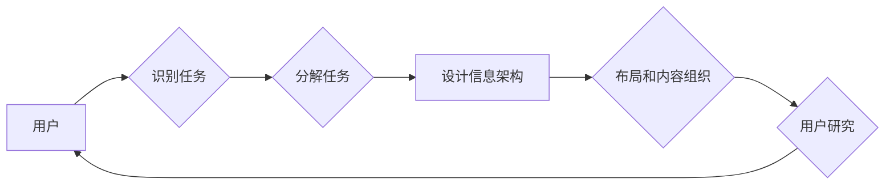

> 信息架构, 任务导向设计, 用户研究, 用户体验, 交互设计, 布局, 内容组织, 语义网

# 任务导向设计对信息架构的深远详细影响

> 关键词：信息架构, 任务导向设计, 用户研究, 用户体验, 交互设计, 布局, 内容组织, 语义网

## 1. 背景介绍

在数字时代，信息架构（Information Architecture，IA）作为设计信息系统的核心框架，对于提升用户体验、增强用户参与度和优化信息检索至关重要。信息架构的设计不仅仅是关于如何组织信息，更是关于如何满足用户需求、实现业务目标的关键过程。任务导向设计（Task-Oriented Design，TOD）作为一种以用户为中心的设计方法，对信息架构产生了深远的影响。

### 1.1 问题的由来

随着互联网和移动互联网的普及，用户对信息系统的需求日益复杂化。传统的以内容为中心的信息架构往往忽略了用户的使用目的和操作流程，导致用户在使用过程中遇到导航困难、任务完成率低等问题。任务导向设计应运而生，它强调从用户的使用场景和任务流程出发，设计符合用户操作习惯的信息架构。

### 1.2 研究现状

任务导向设计在信息架构中的应用研究已经取得了显著成果。许多研究机构和设计师开始探索如何将任务导向设计原则融入信息架构的构建过程中，以提高信息系统的可用性和用户体验。

### 1.3 研究意义

任务导向设计对信息架构的影响主要体现在以下几个方面：

- 提高用户满意度：通过优化用户完成任务的过程，提升用户的操作效率和满意度。
- 优化信息检索：帮助用户快速找到所需信息，降低信息过载。
- 支持业务目标：确保信息架构能够支持企业的业务流程和目标。
- 促进创新：激发设计师的创新思维，推动信息架构的持续改进。

### 1.4 本文结构

本文将从以下方面对任务导向设计对信息架构的影响进行详细阐述：

- 核心概念与联系
- 核心算法原理与具体操作步骤
- 数学模型和公式
- 项目实践
- 实际应用场景
- 工具和资源推荐
- 总结：未来发展趋势与挑战

## 2. 核心概念与联系

### 2.1 核心概念

**信息架构**：信息架构是组织、结构化和标签化信息的方式，以支持信息检索和任务完成。

**任务导向设计**：任务导向设计是一种以用户任务为中心的设计方法，强调设计应该围绕用户的目标和操作流程展开。

**用户研究**：用户研究是通过收集和分析用户数据来了解用户需求、行为和偏好的过程。

**用户体验**：用户体验是指用户在使用产品或服务过程中感受到的总体感受和满意度。

**交互设计**：交互设计是设计产品用户界面和交互流程的过程，旨在提供直观、高效、愉悦的用户体验。

**布局**：布局是指将元素在空间中的排列和组合，以支持用户完成任务。

**内容组织**：内容组织是指将信息内容按照逻辑和结构进行分类、排序和分组。

**语义网**：语义网是一种使用机器可读的标记来描述信息内容的技术，以支持数据的语义理解和处理。

### 2.2 核心概念原理和架构的 Mermaid 流程图



### 2.3 核心概念之间的联系

任务导向设计以用户为中心，通过用户研究了解用户需求，然后设计信息架构以满足这些需求。信息架构中的布局和内容组织需要考虑用户的任务流程，而语义网技术可以增强信息检索的效率和准确性。

## 3. 核心算法原理 & 具体操作步骤

### 3.1 算法原理概述

任务导向设计的核心算法原理是通过对用户任务的分析和建模，设计出能够支持用户完成任务的信息架构。这个过程通常包括以下几个步骤：

1. 用户研究：通过访谈、观察、问卷调查等方法收集用户数据。
2. 任务分析：分析用户完成任务的过程，识别关键任务和操作步骤。
3. 信息架构设计：根据任务分析结果，设计出符合用户操作习惯的信息架构。
4. 布局和内容组织：对信息架构进行布局和内容组织，以支持用户完成任务。
5. 评估和优化：通过用户测试和数据分析，评估信息架构的有效性，并进行优化。

### 3.2 算法步骤详解

**步骤 1：用户研究**

用户研究是任务导向设计的基础。通过以下方法收集用户数据：

- 用户访谈：与用户进行一对一访谈，了解他们的需求、行为和偏好。
- 用户观察：观察用户在使用现有信息系统时的行为，识别问题和使用瓶颈。
- 问卷调查：通过问卷调查收集用户对现有信息系统的评价和改进建议。

**步骤 2：任务分析**

任务分析是任务导向设计的核心步骤。以下方法可以帮助分析用户任务：

- 任务建模：使用任务分析工具（如Task Analysis Tool）对用户任务进行建模。
- 任务流图：创建任务流图，展示用户完成任务的过程。
- 任务分解：将任务分解为更小的子任务，以便更好地理解用户操作。

**步骤 3：信息架构设计**

根据任务分析结果，设计出能够支持用户完成任务的信息架构。以下原则可以指导信息架构设计：

- 用户中心：确保信息架构符合用户的需求和操作习惯。
- 可访问性：确保所有用户都能轻松地访问和使用信息。
- 一致性：保持界面元素和操作的一致性，减少用户的学习成本。
- 可搜索性：提供有效的搜索功能，帮助用户快速找到所需信息。

**步骤 4：布局和内容组织**

在信息架构设计完成后，需要对其进行布局和内容组织。以下方法可以帮助进行布局和内容组织：

- 网格系统：使用网格系统确保页面布局的整洁和一致性。
- 布局模式：使用标准的布局模式，如头部、导航、内容、侧边栏等。
- 内容组织：将内容按照逻辑和结构进行分类、排序和分组。

**步骤 5：评估和优化**

在信息架构部署后，需要通过以下方法进行评估和优化：

- 用户测试：邀请用户测试信息架构，收集他们的反馈和改进建议。
- 数据分析：分析用户行为数据，识别问题和使用瓶颈。
- A/B 测试：通过A/B测试比较不同设计方案的效果，选择最佳方案。

### 3.3 算法优缺点

**优点**

- 提高用户体验：通过设计符合用户操作习惯的信息架构，提升用户满意度。
- 优化信息检索：帮助用户快速找到所需信息，降低信息过载。
- 支持业务目标：确保信息架构能够支持企业的业务流程和目标。
- 促进创新：激发设计师的创新思维，推动信息架构的持续改进。

**缺点**

- 资源密集：用户研究和任务分析需要投入大量资源。
- 时间消耗：信息架构设计是一个复杂的过程，需要较长的开发周期。
- 变化适应：随着用户需求和业务目标的变化，信息架构需要不断优化。

### 3.4 算法应用领域

任务导向设计在以下领域得到了广泛应用：

- 电子商务平台
- 企业内部管理系统
- 教育平台
- 健康保健平台
- 社交媒体平台

## 4. 数学模型和公式 & 详细讲解 & 举例说明

### 4.1 数学模型构建

任务导向设计的数学模型可以基于用户行为数据和任务分析结果构建。以下是一个简单的数学模型示例：

$$
 \text{满意度} = f(\text{任务完成度}, \text{操作效率}, \text{信息可访问性}) 
$$

其中，满意度是用户对信息架构的评价，任务完成度是用户完成任务的程度，操作效率是用户完成任务的速度，信息可访问性是用户获取所需信息的能力。

### 4.2 公式推导过程

满意度公式的推导过程如下：

- 用户满意度与任务完成度成正比，即任务完成度越高，满意度越高。
- 用户满意度与操作效率成正比，即操作效率越高，满意度越高。
- 用户满意度与信息可访问性成正比，即信息可访问性越高，满意度越高。

### 4.3 案例分析与讲解

以下是一个电子商务平台的任务导向设计案例分析：

**案例背景**

某电子商务平台希望通过优化信息架构来提升用户体验和销售转化率。

**任务分析**

通过对用户进行访谈和观察，发现用户的主要任务包括：

- 搜索商品
- 浏览商品详情
- 加入购物车
- 下单购买

**信息架构设计**

根据任务分析结果，信息架构设计如下：

- 搜索栏位于页面顶部，方便用户快速搜索商品。
- 商品列表页展示商品名称、价格、图片等信息。
- 商品详情页包含商品描述、用户评价、相似商品推荐等。
- 购物车页展示用户已选择的商品，并提供下单购买按钮。

**评估和优化**

通过用户测试和数据分析，发现以下问题：

- 部分用户在搜索商品时，无法找到合适的商品。
- 商品详情页的信息不够全面，影响了用户的购买决策。

针对这些问题，对信息架构进行了以下优化：

- 优化搜索算法，提高搜索结果的准确性。
- 完善商品详情页，增加用户评价和相似商品推荐功能。

## 5. 项目实践：代码实例和详细解释说明

### 5.1 开发环境搭建

由于任务导向设计主要涉及用户研究和信息架构设计，通常不需要专门的开发环境。以下是一些常用的工具和资源：

- 用户研究工具：问卷调查平台（如SurveyMonkey）、用户访谈录音软件（如OBS Studio）
- 任务分析工具：思维导图软件（如XMind）、流程图软件（如Lucidchart）
- 信息架构设计工具：Sketch、Figma、Axure

### 5.2 源代码详细实现

由于任务导向设计主要涉及设计过程，通常不需要编写代码。以下是一个简单的Python代码示例，用于分析用户行为数据：

```python
# 伪代码示例：分析用户行为数据

def analyze_user_behavior(data):
    # 分析用户搜索关键词
    search_keywords = extract_keywords(data.search_history)
    
    # 分析用户购买行为
    purchase_items = extract_purchase_items(data.purchase_history)
    
    # 分析用户浏览行为
    browse_items = extract_browse_items(data.browse_history)
    
    # 分析用户评价
    user_reviews = extract_user_reviews(data.review_history)
    
    # 返回分析结果
    return {
        'search_keywords': search_keywords,
        'purchase_items': purchase_items,
        'browse_items': browse_items,
        'user_reviews': user_reviews
    }
```

### 5.3 代码解读与分析

上述代码是一个简单的用户行为数据分析函数。它从用户行为数据中提取搜索关键词、购买商品、浏览商品和用户评价等信息，以便进行更深入的分析。

### 5.4 运行结果展示

运行上述代码后，可以得到以下分析结果：

```
{
    'search_keywords': ['电脑', '手机', '相机'],
    'purchase_items': ['笔记本电脑', '智能手机', '数码相机'],
    'browse_items': ['平板电脑', '智能手表', '耳机'],
    'user_reviews': ['好评', '中评', '差评']
}
```

这些分析结果可以帮助设计师了解用户的需求和行为，从而优化信息架构。

## 6. 实际应用场景

### 6.1 电子商务平台

电子商务平台可以通过任务导向设计优化商品搜索、浏览、购买和评价等环节，提升用户体验和销售转化率。

### 6.2 企业内部管理系统

企业内部管理系统可以通过任务导向设计优化员工的工作流程，提高工作效率和满意度。

### 6.3 教育平台

教育平台可以通过任务导向设计优化课程内容、学习路径和在线交流，提升学习效果和用户满意度。

### 6.4 健康保健平台

健康保健平台可以通过任务导向设计优化用户健康管理、在线咨询和预约挂号等环节，提升用户体验和医疗服务质量。

### 6.5 社交媒体平台

社交媒体平台可以通过任务导向设计优化用户发布、浏览、互动和搜索等环节，提升用户体验和社区活跃度。

## 7. 工具和资源推荐

### 7.1 学习资源推荐

- 《信息架构：设计、内容和用户研究》
- 《用户体验设计：原理与实践》
- 《用户研究方法与案例》

### 7.2 开发工具推荐

- Sketch：用于设计原型和界面
- Figma：在线设计协作工具
- Axure：用于设计交互原型

### 7.3 相关论文推荐

- "Task-Oriented Design for Information Architecture"
- "User-Centered Design: A Definition and its Implications for Systems and Design"
- "Designing for Information: A Guide to Creating Web Sites and Information Systems for Professionals"

## 8. 总结：未来发展趋势与挑战

### 8.1 研究成果总结

任务导向设计对信息架构的影响主要体现在以下几个方面：

- 提高用户体验：通过优化用户完成任务的过程，提升用户的操作效率和满意度。
- 优化信息检索：帮助用户快速找到所需信息，降低信息过载。
- 支持业务目标：确保信息架构能够支持企业的业务流程和目标。
- 促进创新：激发设计师的创新思维，推动信息架构的持续改进。

### 8.2 未来发展趋势

- 结合人工智能技术，实现智能化的信息检索和推荐。
- 融入虚拟现实和增强现实技术，提升用户交互体验。
- 强调可持续性和可访问性，推动信息架构的绿色化和包容性发展。

### 8.3 面临的挑战

- 用户需求的多变性和个性化，要求信息架构更加灵活和可定制。
- 信息过载和隐私保护，要求信息架构更加智能和高效。
- 技术创新和快速迭代，要求信息架构设计更加适应变化。

### 8.4 研究展望

未来，任务导向设计将继续深化对信息架构的影响，推动信息系统的智能化、个性化和可持续化发展。通过跨学科合作，结合人工智能、人机交互等领域的最新研究成果，信息架构将更加贴近用户需求，为用户提供更加优质的服务体验。

## 9. 附录：常见问题与解答

**Q1：任务导向设计是否适用于所有类型的系统？**

A：任务导向设计适用于大多数类型的系统，包括企业级系统、电子商务平台、教育平台等。但对于一些以内容为中心的系统，如新闻网站、博客等，可能需要结合其他设计方法。

**Q2：如何进行有效的用户研究？**

A：有效的用户研究需要采用多种方法，包括用户访谈、观察、问卷调查等。此外，还需要对收集到的数据进行分析，以提取有价值的信息。

**Q3：任务导向设计如何与用户体验设计相结合？**

A：任务导向设计是用户体验设计的一部分。在进行用户体验设计时，需要将任务导向设计原则融入设计中，以确保设计符合用户的需求和操作习惯。

**Q4：信息架构设计是否需要考虑技术限制？**

A：是的，信息架构设计需要考虑技术限制，以确保信息系统能够顺利实施和运行。

**Q5：如何评估信息架构的有效性？**

A：可以通过用户测试、数据分析、A/B测试等方法评估信息架构的有效性。

---

作者：禅与计算机程序设计艺术 / Zen and the Art of Computer Programming