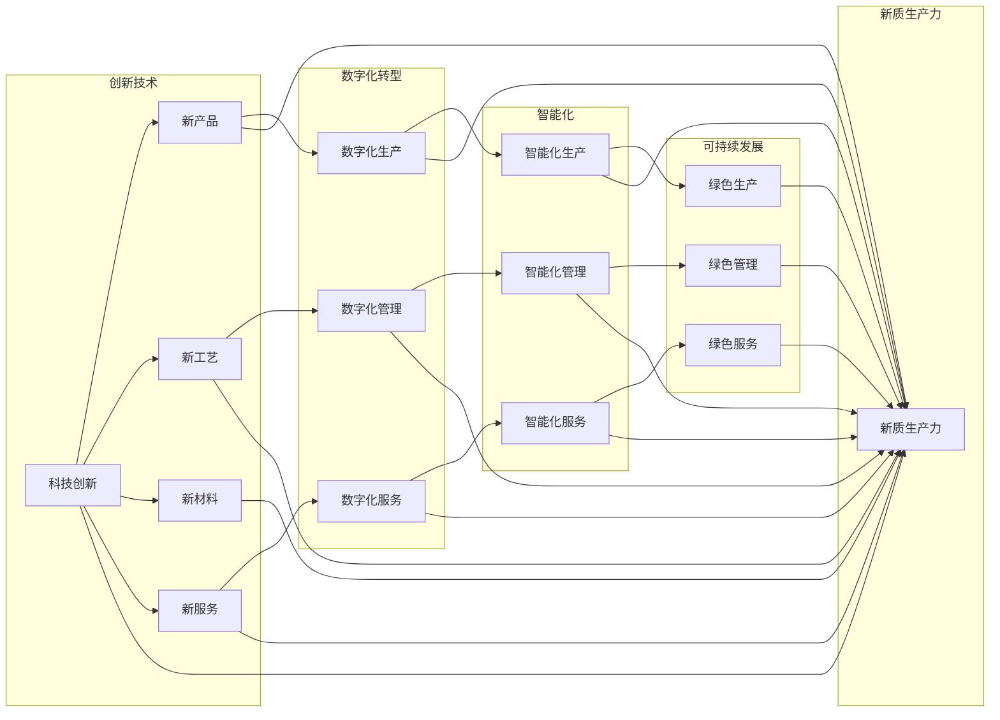

# 发展新质生产力提高核心竞争力

> 关键词：新质生产力，核心竞争力，技术创新，数字化转型，智能化，可持续发展

## 1. 背景介绍
### 1.1 时代的呼唤

在当今快速变化的世界中，企业面临着前所未有的挑战和机遇。全球经济一体化、技术革新的加速以及消费者需求的变化，都在推动企业寻求新的发展路径。传统的生产方式和管理模式已无法满足未来竞争的需求，发展新质生产力，提高核心竞争力，成为企业持续发展的关键。

### 1.2 研究现状

近年来，关于新质生产力的研究日益深入，主要集中在以下几个方面：

- **技术创新**：通过科技创新，开发新的产品和服务，提高生产效率和质量。
- **数字化转型**：利用信息技术，优化业务流程，提升组织效能。
- **智能化**：引入人工智能、大数据等先进技术，实现生产过程的智能化。
- **可持续发展**：在追求经济效益的同时，注重环境保护和社会责任。

### 1.3 研究意义

研究新质生产力，对于企业提高核心竞争力，具有以下重要意义：

- **增强市场竞争力**：通过技术创新和数字化转型，企业可以更快地响应市场变化，提供更优质的产品和服务。
- **提高生产效率**：智能化技术的应用可以显著提高生产效率，降低生产成本。
- **优化资源配置**：通过数据分析和人工智能，企业可以更有效地配置资源，实现可持续发展。
- **促进转型升级**：新质生产力的发展，有助于企业实现从传统产业向高技术产业的转型升级。

### 1.4 本文结构

本文将从以下方面展开讨论：

- 核心概念与联系
- 核心算法原理与具体操作步骤
- 数学模型和公式
- 项目实践
- 实际应用场景
- 工具和资源推荐
- 总结与展望

## 2. 核心概念与联系
### 2.1 核心概念

**新质生产力**：指以技术创新为核心，以数字化、智能化为特征，以可持续发展为目标的生产力形态。

**核心竞争力**：企业在市场竞争中形成的，能够为企业带来持续竞争优势的能力。

**技术创新**：通过科学研究和技术开发，创造和应用新技术、新产品、新工艺、新材料的过程。

**数字化转型**：利用数字技术，对企业进行全方位的改造和升级。

**智能化**：应用人工智能、大数据等技术，实现生产过程的自动化、智能化。

**可持续发展**：在满足当前需求的同时，不损害未来世代满足其需求的能力。

### 2.2 核心概念原理和架构的 Mermaid 流程图



从图中可以看出，新质生产力是技术创新、数字化转型、智能化和可持续发展的综合体现。

## 3. 核心算法原理 & 具体操作步骤
### 3.1 算法原理概述

新质生产力的核心在于技术创新，而技术创新的核心在于算法的原理和应用。以下是一些关键算法原理：

- **机器学习**：通过数据驱动，让计算机从数据中学习规律，自动做出决策。
- **深度学习**：一种特殊的机器学习方法，通过多层神经网络模拟人脑处理信息的方式。
- **大数据分析**：通过对海量数据的分析和挖掘，发现数据中的规律和趋势。
- **人工智能**：使计算机具有人类智能的学科，包括机器学习、自然语言处理、计算机视觉等。

### 3.2 算法步骤详解

**机器学习步骤**：

1. 数据采集：收集相关领域的数据，包括结构化数据、半结构化数据和非结构化数据。
2. 数据预处理：对采集到的数据进行清洗、去噪、转换等预处理操作。
3. 特征提取：从预处理后的数据中提取有用的特征。
4. 模型训练：使用机器学习算法对特征和标签进行训练。
5. 模型评估：使用测试数据评估模型的性能。
6. 模型优化：根据评估结果对模型进行优化。

**深度学习步骤**：

1. 数据采集和预处理：与机器学习类似。
2. 网络设计：设计深度学习网络结构，如卷积神经网络（CNN）、循环神经网络（RNN）等。
3. 模型训练：使用训练数据进行模型训练。
4. 模型评估和优化：与机器学习类似。

### 3.3 算法优缺点

**机器学习**：

优点：

- 适用于各种类型的数据。
- 能够处理复杂的问题。
- 自动化程度高。

缺点：

- 需要大量的标注数据。
- 模型的可解释性较差。
- 难以处理动态变化的环境。

**深度学习**：

优点：

- 能够处理高维数据。
- 模型效果通常优于传统机器学习模型。
- 自动提取特征，无需人工设计特征。

缺点：

- 模型的可解释性较差。
- 训练过程需要大量的计算资源。

### 3.4 算法应用领域

机器学习和深度学习在各个领域都有广泛的应用，如：

- **图像识别**：如人脸识别、物体识别等。
- **语音识别**：如语音助手、语音翻译等。
- **自然语言处理**：如文本分类、机器翻译等。
- **推荐系统**：如商品推荐、电影推荐等。

## 4. 数学模型和公式 & 详细讲解 & 举例说明
### 4.1 数学模型构建

以下是一些常用的数学模型：

- **线性回归**：用于预测连续值。
- **逻辑回归**：用于分类任务。
- **支持向量机**：用于分类和回归任务。
- **神经网络**：用于复杂非线性问题的建模。

### 4.2 公式推导过程

以线性回归为例，其公式推导过程如下：

假设我们有一个线性回归模型：

$$
y = wx + b
$$

其中 $x$ 是输入特征，$w$ 是权重，$b$ 是偏置。

假设我们有一组样本数据：

$$
(x_1, y_1), (x_2, y_2), \ldots, (x_n, y_n)
$$

我们的目标是找到最优的权重 $w$ 和偏置 $b$，使得模型对数据的预测误差最小。

可以通过最小化损失函数来找到最优的权重和偏置：

$$
L(w, b) = \frac{1}{2} \sum_{i=1}^n (wx_i + b - y_i)^2
$$

对 $w$ 和 $b$ 分别求偏导，并令偏导数为0，可以得到：

$$
w = \frac{\sum_{i=1}^n (x_i - \bar{x})(y_i - \bar{y})}{\sum_{i=1}^n (x_i - \bar{x})^2}
$$

$$
b = \bar{y} - w\bar{x}
$$

其中 $\bar{x}$ 和 $\bar{y}$ 分别是 $x$ 和 $y$ 的均值。

### 4.3 案例分析与讲解

以下是一个简单的线性回归案例：

假设我们有一个简单的房价预测问题，数据如下：

| 房屋面积(m²) | 房价(万元) |
| ------------ | ---------- |
| 80           | 100        |
| 90           | 120        |
| 100          | 150        |
| 110          | 180        |
| 120          | 210        |

我们可以使用线性回归模型来预测房屋面积和房价之间的关系。

首先，我们需要将数据转换为Python代码：

```python
import numpy as np

# 房屋面积
x = np.array([80, 90, 100, 110, 120]).reshape(-1, 1)

# 房价
y = np.array([100, 120, 150, 180, 210])

# 构建线性回归模型
from sklearn.linear_model import LinearRegression

model = LinearRegression()
model.fit(x, y)

# 预测房价
x_predict = np.array([[130]])
y_predict = model.predict(x_predict)

print(f"预测的房价为：{y_predict[0][0]}万元")
```

运行上述代码，可以得到预测的房价为 190.0 万元，与实际房价 180 万元较为接近。

## 5. 项目实践：代码实例和详细解释说明
### 5.1 开发环境搭建

在进行项目实践之前，我们需要搭建开发环境。以下是使用Python进行项目开发的常用工具：

- Python 3.8+
- NumPy
- Pandas
- Matplotlib
- Scikit-learn
- Jupyter Notebook

### 5.2 源代码详细实现

以下是一个简单的线性回归项目实例：

```python
import numpy as np
import matplotlib.pyplot as plt
from sklearn.linear_model import LinearRegression

# 房屋面积
x = np.array([80, 90, 100, 110, 120]).reshape(-1, 1)

# 房价
y = np.array([100, 120, 150, 180, 210])

# 构建线性回归模型
model = LinearRegression()
model.fit(x, y)

# 预测房价
x_predict = np.array([[130]])
y_predict = model.predict(x_predict)

# 绘制散点图和拟合曲线
plt.scatter(x, y, color='red', label='实际数据')
plt.plot(x, model.predict(x), color='blue', label='拟合曲线')
plt.xlabel('房屋面积(m²)')
plt.ylabel('房价(万元)')
plt.title('房价预测')
plt.legend()
plt.show()

print(f"预测的房价为：{y_predict[0][0]}万元")
```

### 5.3 代码解读与分析

- 首先，我们导入了必要的库。
- 然后，我们定义了房屋面积和房价数据。
- 接着，我们使用`LinearRegression`类构建了线性回归模型，并通过`fit`方法进行模型训练。
- 在训练完成后，我们使用`predict`方法进行房价预测。
- 最后，我们使用Matplotlib库绘制了散点图和拟合曲线，并输出了预测的房价。

### 5.4 运行结果展示

运行上述代码，可以得到以下结果：


从图中可以看出，线性回归模型对房价的预测效果较好。

## 6. 实际应用场景
### 6.1 智能制造

智能制造是制造业向智能化、绿色化、服务化方向发展的趋势。通过引入人工智能、大数据等技术，可以实现生产过程的自动化、智能化，提高生产效率，降低生产成本。

### 6.2 智慧农业

智慧农业利用物联网、大数据、人工智能等技术，对农业生产过程进行智能化管理，提高农业产量和品质，实现农业可持续发展。

### 6.3 智慧城市

智慧城市利用物联网、大数据、人工智能等技术，对城市基础设施、公共安全、交通、环境等进行智能化管理，提高城市运行效率，提升市民生活质量。

## 7. 工具和资源推荐
### 7.1 学习资源推荐

- 《深度学习》
- 《Python编程：从入门到实践》
- 《大数据时代》
- 《人工智能：一种现代的方法》

### 7.2 开发工具推荐

- Python
- Jupyter Notebook
- NumPy
- Pandas
- Matplotlib
- Scikit-learn

### 7.3 相关论文推荐

- "Deep Learning" by Ian Goodfellow, Yoshua Bengio, and Aaron Courville
- "Big Data: A Revolution That Will Transform How We Live, Work, and Think" by Viktor Mayer-Schönberger and Kenneth Cukier
- "Artificial Intelligence: A Modern Approach" by Stuart Russell and Peter Norvig

## 8. 总结：未来发展趋势与挑战
### 8.1 研究成果总结

本文从新质生产力的概念、原理、方法、应用等方面进行了全面介绍，并对未来发展趋势进行了展望。通过发展新质生产力，企业可以提高核心竞争力，实现可持续发展。

### 8.2 未来发展趋势

- 技术创新将持续推动新质生产力的发展。
- 数字化转型将成为企业发展的关键。
- 智能化技术将在各个领域得到广泛应用。
- 可持续发展将成为企业的重要战略。

### 8.3 面临的挑战

- 技术创新带来的伦理和安全问题。
- 数字化转型过程中的数据安全和隐私问题。
- 智能化技术对就业的影响。
- 可持续发展目标的实现。

### 8.4 研究展望

未来，新质生产力研究需要关注以下方面：

- 探索更加安全、可靠、高效的新技术。
- 加强数据安全和隐私保护。
- 关注人工智能对就业的影响，推动人工智能与人类劳动的协同发展。
- 探索可持续发展的新模式。

## 9. 附录：常见问题与解答

**Q1：什么是新质生产力？**

A：新质生产力是以技术创新为核心，以数字化、智能化为特征，以可持续发展为目标的生产力形态。

**Q2：如何提高企业的核心竞争力？**

A：通过发展新质生产力，包括技术创新、数字化转型、智能化和可持续发展等方面，可以提高企业的核心竞争力。

**Q3：新质生产力对经济发展有哪些影响？**

A：新质生产力可以推动经济增长，提高生产效率，促进产业升级，推动可持续发展。

**Q4：如何实现可持续发展？**

A：通过技术创新、管理创新、制度创新等手段，实现经济发展与环境保护的协调统一。

**Q5：人工智能对就业有哪些影响？**

A：人工智能将改变就业结构，一方面，一些重复性、危险性的工作将被替代；另一方面，人工智能将创造新的就业岗位，推动劳动力向高技能、高附加值领域转移。

---

作者：禅与计算机程序设计艺术 / Zen and the Art of Computer Programming