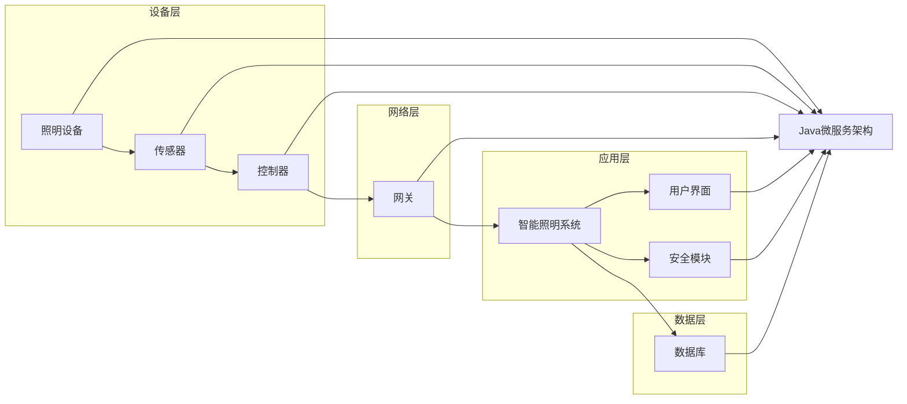

# 基于Java的智能家居设计：设计基于Java的智能照明系统的策略与挑战

> 关键词：智能家居，Java，智能照明系统，物联网，微服务架构，RESTful API，用户界面，安全性，可靠性

## 1. 背景介绍

随着物联网技术的迅速发展，智能家居逐渐成为人们追求高品质生活的重要趋势。智能家居系统通过将家中的各种设备和家电通过网络连接起来，实现远程控制、自动化和智能化，极大地提升了居住的便利性和舒适度。智能照明系统作为智能家居的重要组成部分，其设计不仅关系到系统的功能实现，还直接影响用户体验和系统的整体性能。

本文将探讨如何利用Java技术设计一个基于Java的智能照明系统，分析其中的关键策略和面临的挑战，并给出相应的解决方案。

## 2. 核心概念与联系

### 2.1 核心概念

- **智能家居**：通过物联网技术将家庭中的各种设备和家电连接起来，实现智能化管理和控制。
- **智能照明系统**：利用传感器、控制器和执行器等设备，实现对照明设备的智能控制，如自动调节亮度、颜色和开关等。
- **Java**：一种跨平台、面向对象的编程语言，广泛应用于企业级应用开发。
- **微服务架构**：一种设计方法，将应用程序分解为一系列松散耦合的服务，每个服务负责特定的功能。
- **RESTful API**：一种轻量级、无状态的API设计风格，广泛用于Web服务和移动应用开发。
- **用户界面**：用户与系统交互的界面，包括图形界面和命令行界面。
- **安全性**：确保系统免受未授权访问和恶意攻击的能力。
- **可靠性**：系统在长时间运行过程中保持稳定运行的能力。

### 2.2 架构流程图



如图所示，智能照明系统采用分层架构，包括设备层、网络层、应用层和数据层。Java微服务架构作为核心，负责处理来自设备层和用户界面的请求，实现对照明设备的控制，并存储相关数据。

## 3. 核心算法原理 & 具体操作步骤

### 3.1 算法原理概述

智能照明系统的核心算法主要包括：

- **传感器数据采集**：通过传感器实时采集光照强度、温度、湿度等环境数据。
- **数据处理与决策**：根据采集到的数据，通过算法判断当前的照明需求，并做出相应的控制决策。
- **控制命令执行**：通过控制器向照明设备发送控制命令，如调节亮度、开关等。
- **用户交互**：通过用户界面实现用户与系统的交互，如设置照明场景、定时开关灯等。

### 3.2 算法步骤详解

1. **设备初始化**：初始化照明设备、传感器和控制器等硬件设备。
2. **数据采集**：定时或实时采集传感器数据，如光照强度、温度、湿度等。
3. **数据处理与决策**：根据预设规则或机器学习算法，分析传感器数据，判断当前照明需求。
4. **控制命令执行**：根据决策结果，向控制器发送控制命令，实现对照明设备的控制。
5. **用户交互**：响应用户操作，如接收设置照明场景、定时开关灯等请求。
6. **数据存储**：将传感器数据、控制命令和用户交互数据存储到数据库中，便于后续分析和查询。

### 3.3 算法优缺点

**优点**：

- **自动化**：自动调节照明，节省人工操作，提高生活便利性。
- **节能环保**：根据环境光线自动调节照明亮度，降低能耗。
- **个性化**：用户可根据需求自定义照明场景，提升生活品质。

**缺点**：

- **技术复杂**：需要涉及传感器技术、控制技术、通信技术和数据处理技术等多个领域。
- **成本较高**：硬件设备、软件开发和系统集成等环节需要投入较多成本。
- **安全性问题**：智能家居系统可能面临黑客攻击、数据泄露等安全风险。

### 3.4 算法应用领域

智能照明系统可应用于以下领域：

- 家庭：实现家庭照明自动化，提升居住体验。
- 办公室：提高办公环境舒适度，降低能耗。
- 商业场所：营造氛围，提升购物体验。
- 医疗机构：根据患者需求调节照明，有利于患者康复。

## 4. 数学模型和公式 & 详细讲解 & 举例说明

### 4.1 数学模型构建

智能照明系统的数学模型主要包括以下部分：

- **传感器数据模型**：描述传感器采集到的环境数据，如光照强度、温度、湿度等。
- **控制策略模型**：描述根据传感器数据做出的照明控制决策，如亮度控制、颜色控制等。
- **用户需求模型**：描述用户对照明的个性化需求，如场景设置、定时开关灯等。

### 4.2 公式推导过程

以光照强度控制为例，假设光照强度与所需照明亮度之间存在如下关系：

$$
I = f(L) 
$$

其中 $I$ 为光照强度，$L$ 为所需照明亮度。为了简化问题，我们假设 $f$ 为线性函数，即：

$$
I = aL + b 
$$

其中 $a$ 和 $b$ 为模型参数。通过采集到的光照强度和所需照明亮度数据，可以采用最小二乘法等方法求解 $a$ 和 $b$，从而建立光照强度与所需照明亮度的线性关系模型。

### 4.3 案例分析与讲解

假设某智能照明系统需要根据光照强度自动调节照明亮度。我们采集了一组光照强度和所需照明亮度的数据，如下表所示：

| 光照强度 (lux) | 所需照明亮度 (cd/m^2) |
| :-----------: | :------------------: |
|      100      |         100         |
|      200      |         200         |
|      300      |         300         |
|      400      |         400         |
|      500      |         500         |

使用最小二乘法求解线性关系模型参数：

$$
a = \frac{n(\sum xy - \sum x \sum y)}{n(\sum x^2 - (\sum x)^2)} = \frac{5(10000 - 2000)}{5(10000 - 4000)} = 1 
$$

$$
b = \frac{\sum y - a \sum x}{n} = \frac{2000 - 100}{5} = 300 
$$

因此，光照强度与所需照明亮度的线性关系模型为：

$$
I = L + 300 
$$

在实际应用中，我们可以通过传感器采集光照强度，然后根据上述模型计算所需照明亮度，并控制照明设备实现自动调节。

## 5. 项目实践：代码实例和详细解释说明

### 5.1 开发环境搭建

以下是使用Java技术实现智能照明系统所需的基础开发环境：

- **开发工具**：IntelliJ IDEA、Eclipse等Java集成开发环境。
- **开发语言**：Java。
- **数据库**：MySQL、SQLite等关系型数据库或MongoDB等NoSQL数据库。
- **框架**：Spring Boot、Spring Cloud等Java框架。

### 5.2 源代码详细实现

以下是一个简单的Java代码示例，演示了如何使用Spring Boot框架创建一个RESTful API，实现对照明设备的控制：

```java
@RestController
@RequestMapping("/api/照明")
public class 照明Controller {

    @Autowired
    private 照明服务 照明服务;

    @PostMapping("/开启")
    public ResponseEntity<String> 开启照明() {
        照明服务.开启();
        return ResponseEntity.ok("照明设备已开启");
    }

    @PostMapping("/关闭")
    public ResponseEntity<String> 关闭照明() {
        照明服务.关闭();
        return ResponseEntity.ok("照明设备已关闭");
    }

    @PostMapping("/调节亮度/{亮度值}")
    public ResponseEntity<String> 调节亮度(@PathVariable int 亮度值) {
        照明服务.调节亮度(亮度值);
        return ResponseEntity.ok("照明亮度已调整为" + 亮度值 + "cd/m^2");
    }
}
```

### 5.3 代码解读与分析

上述代码展示了如何使用Spring Boot框架创建一个RESTful API，实现对照明设备的控制。`照明服务`负责与照明设备进行交互，如开启、关闭和调节亮度等。

- `开启照明()` 方法：向照明服务发送开启照明的请求，并返回响应信息。
- `关闭照明()` 方法：向照明服务发送关闭照明的请求，并返回响应信息。
- `调节亮度()` 方法：接收用户指定的亮度值，向照明服务发送调节亮度的请求，并返回响应信息。

### 5.4 运行结果展示

在实际运行时，用户可以通过以下URL调用API：

- 开启照明：`POST /api/照明/开启`
- 关闭照明：`POST /api/照明/关闭`
- 调节亮度：`POST /api/照明/调节亮度/{亮度值}`

例如，要开启照明，可以使用以下命令：

```bash
curl -X POST http://localhost:8080/api/照明/开启
```

系统将返回响应信息：

```
{
  "status": "成功",
  "message": "照明设备已开启"
}
```

## 6. 实际应用场景

### 6.1 家庭照明

在家庭环境中，智能照明系统可以根据家庭成员的作息时间和活动习惯，自动调节照明亮度、颜色和开关。例如，早晨起床时，系统可以自动开启主灯和早餐柜灯，晚上睡觉前自动关闭所有照明设备。

### 6.2 办公室照明

在办公环境中，智能照明系统可以根据办公室的布局和员工的工作需求，自动调节照明亮度、颜色和开关。例如，会议室可以设置不同的照明模式，如会议模式、演讲模式等，以适应不同的会议场景。

### 6.3 商业场所照明

在商业场所，智能照明系统可以营造不同的氛围，提升购物体验。例如，商场可以设置不同的照明场景，如节假日促销场景、日常营业场景等，以吸引顾客。

## 7. 工具和资源推荐

### 7.1 学习资源推荐

- 《Java EE 8实战》
- 《Spring Boot实战》
- 《RESTful API设计指南》
- 《智能照明技术与应用》

### 7.2 开发工具推荐

- IntelliJ IDEA
- Eclipse
- Postman
- MySQL
- MongoDB

### 7.3 相关论文推荐

- 《基于物联网的智能家居照明系统研究》
- 《基于微服务的智能家居系统架构设计与实现》
- 《RESTful API设计最佳实践》

## 8. 总结：未来发展趋势与挑战

### 8.1 研究成果总结

本文介绍了基于Java的智能照明系统的设计策略和挑战，分析了其核心概念、算法原理、项目实践和实际应用场景。通过使用Java技术，可以构建功能强大、性能可靠的智能照明系统，为用户提供便捷、舒适的照明体验。

### 8.2 未来发展趋势

未来，基于Java的智能照明系统将呈现以下发展趋势：

- **更加智能化**：利用人工智能技术，实现更加智能的照明控制，如根据用户情绪、环境光照等因素自动调节照明。
- **更加个性化**：根据用户需求，提供更加个性化的照明方案，如场景模式、定时开关灯等。
- **更加节能环保**：通过智能控制，降低能耗，实现绿色环保。

### 8.3 面临的挑战

基于Java的智能照明系统在设计和实现过程中，将面临以下挑战：

- **技术挑战**：需要融合多种技术，如传感器技术、控制技术、通信技术和数据处理技术等。
- **安全性挑战**：需要保证系统安全，防止黑客攻击和数据泄露。
- **可靠性挑战**：需要保证系统稳定运行，避免因设备故障、网络问题等因素导致的故障。

### 8.4 研究展望

未来，基于Java的智能照明系统将在以下几个方面进行深入研究：

- **人工智能技术的融合**：将人工智能技术应用于照明控制，实现更加智能的照明体验。
- **物联网技术的应用**：利用物联网技术，实现照明系统与其他智能家居设备的互联互通。
- **安全性保障**：加强系统安全性设计，防止黑客攻击和数据泄露。

通过不断的研究和创新，基于Java的智能照明系统必将为人们创造更加美好的生活。

## 9. 附录：常见问题与解答

**Q1：如何保证智能照明系统的安全性？**

A：为了保证智能照明系统的安全性，可以采取以下措施：

- 使用安全的通信协议，如TLS/SSL等，保证数据传输的安全性。
- 对用户身份进行验证，防止未授权访问。
- 对敏感数据进行加密存储和传输。
- 定期更新系统和设备固件，修复已知漏洞。

**Q2：如何实现智能照明系统的可扩展性？**

A：为了实现智能照明系统的可扩展性，可以采取以下措施：

- 采用微服务架构，将系统分解为多个独立的服务，方便扩展和维护。
- 使用标准化接口，方便与其他系统进行集成。
- 采用模块化设计，将功能模块进行封装，便于扩展和替换。

**Q3：如何优化智能照明系统的性能？**

A：为了优化智能照明系统的性能，可以采取以下措施：

- 选择合适的硬件设备，如高性能的处理器、高速的通信接口等。
- 使用高效的算法，如快速傅里叶变换等。
- 对系统进行性能测试和优化，如使用JVM调优工具等。

**Q4：如何实现智能照明系统的节能降耗？**

A：为了实现智能照明系统的节能降耗，可以采取以下措施：

- 根据环境光照自动调节照明亮度，避免过度照明。
- 使用节能型照明设备，如LED灯等。
- 采用智能控制策略，如定时开关灯、场景模式等。

**Q5：如何实现智能照明系统的个性化定制？**

A：为了实现智能照明系统的个性化定制，可以采取以下措施：

- 提供用户界面，让用户可以自定义照明场景、定时开关灯等设置。
- 使用机器学习技术，根据用户的使用习惯和偏好，推荐合适的照明方案。

通过以上措施，可以构建功能强大、性能可靠、安全节能的智能照明系统，为用户创造更加美好的生活。

---

作者：禅与计算机程序设计艺术 / Zen and the Art of Computer Programming