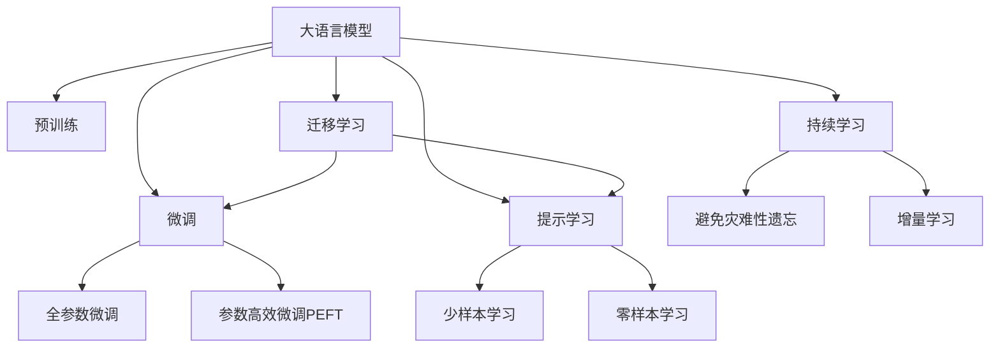
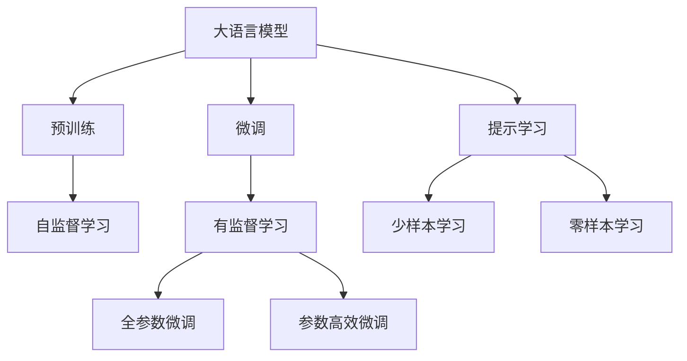
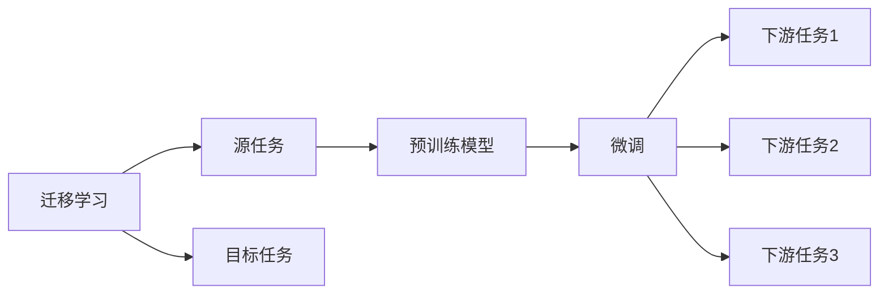
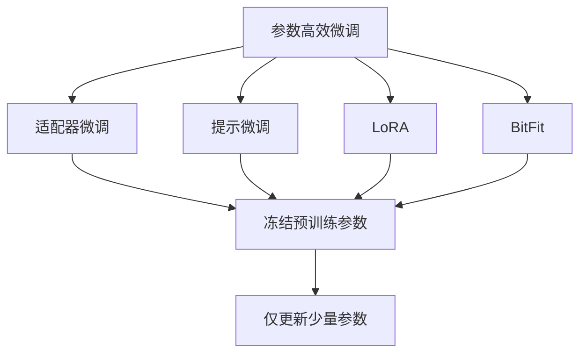
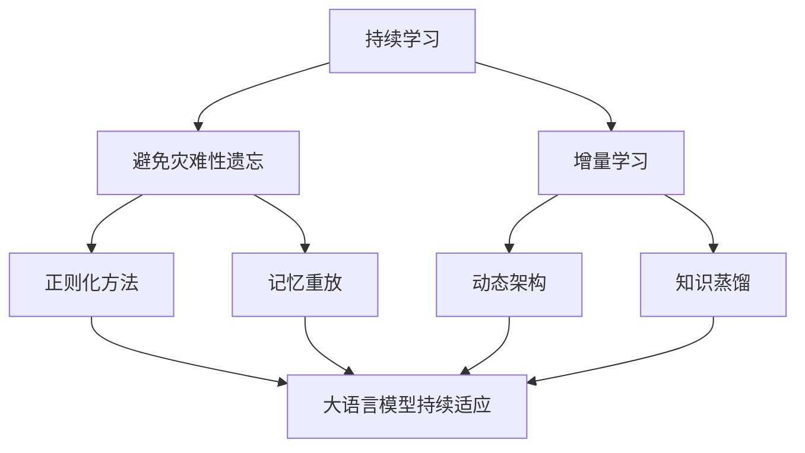
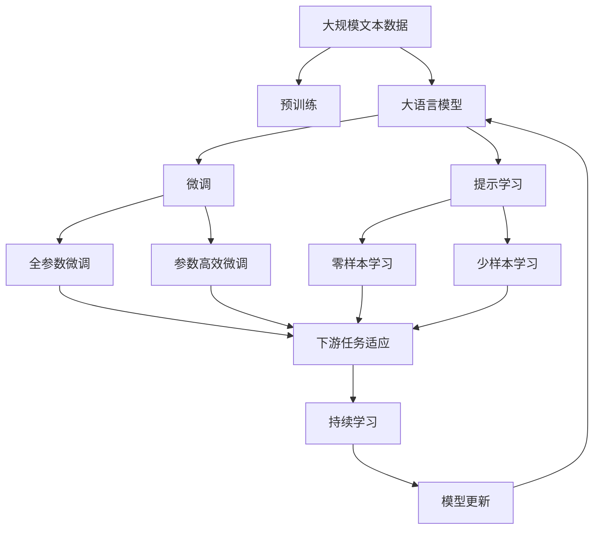

                 

# 大语言模型原理基础与前沿 不需要额外训练即可利用预训练模型

> 关键词：大语言模型,预训练模型,自监督学习,迁移学习,Transformer,BERT,知识蒸馏,参数高效,零样本学习,自然语言处理(NLP)

## 1. 背景介绍

### 1.1 问题由来
近年来，深度学习技术在自然语言处理（NLP）领域取得了巨大突破。特别是大规模预训练语言模型（Large Pre-trained Language Models, LPLMs），如BERT、GPT等，通过在大规模无标签文本语料上进行的自监督学习（Self-supervised Learning），学习到了通用的语言表示，具备强大的语言理解和生成能力。

然而，大语言模型在使用时，往往需要大量的标注数据来进行下游任务的微调（Fine-tuning），以提升模型在特定任务上的性能。这种方法虽然简单高效，但需要大量标注数据，成本较高，且模型泛化能力有限，不能很好地应对不同领域的任务。

针对这些问题，研究者提出了一种新的大语言模型利用方式，即零样本学习（Zero-shot Learning），允许模型在没有额外训练数据的情况下，直接对新任务进行推理和生成。这种“不需要额外训练即可利用预训练模型”的方式，不仅可以降低标注数据的需求，还能提高模型的泛化能力，具有广阔的应用前景。

### 1.2 问题核心关键点
零样本学习是指在模型没有见过任何特定任务的训练样本的情况下，仅凭任务描述就能够执行新任务的能力。实现零样本学习的方法主要包括：

- **知识蒸馏（Knowledge Distillation）**：通过将大模型中的知识“蒸馏”到轻量级小模型，实现模型参数的迁移。
- **参数高效（Parameter-Efficient）**：在微调过程中，只更新少量的模型参数，固定大部分预训练参数不变，以提高微调效率。
- **提示模板（Prompt Engineering）**：通过精心设计输入文本的格式，引导大模型按期望方式输出，减少微调参数。
- **自适应（Adaptability）**：大模型能够自动适应不同领域的任务，通过任务适配层实现参数调整。

这些方法不仅能够显著提升模型的泛化能力，还能降低对标注数据的依赖，进一步推动大语言模型的广泛应用。

### 1.3 问题研究意义
零样本学习技术对于大语言模型的应用具有重要意义：

1. **降低成本**：减少标注数据的需求，降低模型训练和部署的成本。
2. **提高泛化能力**：模型能够在未见过的任务上表现良好，提升模型对新任务的适应能力。
3. **加速开发**：减少微调所需的时间，缩短模型开发周期。
4. **促进创新**：避免传统微调方法对数据分布的限制，激发更多新任务的创新。
5. **提升用户体验**：通过零样本学习，用户可以更快地使用模型，提高交互体验。

## 2. 核心概念与联系

### 2.1 核心概念概述

为更好地理解零样本学习在大语言模型中的应用，本节将介绍几个密切相关的核心概念：

- **大语言模型（Large Language Model, LLM）**：以自回归（如GPT）或自编码（如BERT）模型为代表的大规模预训练语言模型。通过在大规模无标签文本语料上进行预训练，学习通用的语言表示，具备强大的语言理解和生成能力。

- **预训练（Pre-training）**：指在大规模无标签文本语料上，通过自监督学习任务训练通用语言模型的过程。常见的预训练任务包括言语建模、遮挡语言模型等。

- **迁移学习（Transfer Learning）**：指将一个领域学习到的知识，迁移应用到另一个不同但相关的领域的学习范式。大模型的预训练-微调过程即是一种典型的迁移学习方式。

- **知识蒸馏（Knowledge Distillation）**：通过将大模型的知识“蒸馏”到轻量级小模型，实现模型参数的迁移。

- **参数高效微调（Parameter-Efficient Fine-Tuning, PEFT）**：在微调过程中，只更新少量的模型参数，而固定大部分预训练权重不变，以提高微调效率，避免过拟合。

- **提示学习（Prompt Learning）**：通过在输入文本中添加提示模板，引导大模型进行特定任务的推理和生成。可以在不更新模型参数的情况下，实现零样本或少样本学习。

- **少样本学习（Few-shot Learning）**：指在只有少量标注样本的情况下，模型能够快速适应新任务的学习方法。在大语言模型中，通常通过在输入中提供少量示例来实现，无需更新模型参数。

- **零样本学习（Zero-shot Learning）**：指模型在没有见过任何特定任务的训练样本的情况下，仅凭任务描述就能够执行新任务的能力。

- **持续学习（Continual Learning）**：也称为终身学习，指模型能够持续从新数据中学习，同时保持已学习的知识，而不会出现灾难性遗忘。这对于保持大语言模型的时效性和适应性至关重要。

这些核心概念之间的逻辑关系可以通过以下Mermaid流程图来展示：



这个流程图展示了大语言模型的核心概念及其之间的关系：

1. 大语言模型通过预训练获得基础能力。
2. 微调是对预训练模型进行任务特定的优化，可以分为全参数微调和参数高效微调（PEFT）。
3. 提示学习是一种不更新模型参数的方法，可以实现少样本学习和零样本学习。
4. 迁移学习是连接预训练模型与下游任务的桥梁，可以通过微调或提示学习来实现。
5. 持续学习旨在使模型能够不断学习新知识，同时避免遗忘旧知识。

这些概念共同构成了大语言模型的学习和应用框架，使其能够在各种场景下发挥强大的语言理解和生成能力。通过理解这些核心概念，我们可以更好地把握大语言模型的工作原理和优化方向。

### 2.2 概念间的关系

这些核心概念之间存在着紧密的联系，形成了大语言模型的学习生态系统。下面我通过几个Mermaid流程图来展示这些概念之间的关系。

#### 2.2.1 大语言模型的学习范式



这个流程图展示了大语言模型的三种主要学习范式：预训练、微调和提示学习。预训练主要采用自监督学习方法，而微调则是有监督学习的过程。提示学习可以实现零样本和少样本学习，可以在不更新模型参数的情况下，实现模型对新任务的推理和生成。

#### 2.2.2 迁移学习与微调的关系



这个流程图展示了迁移学习的基本原理，以及它与微调的关系。迁移学习涉及源任务和目标任务，预训练模型在源任务上学习，然后通过微调适应各种下游任务（目标任务）。

#### 2.2.3 参数高效微调方法



这个流程图展示了几种常见的参数高效微调方法，包括适配器微调、提示微调、LoRA和BitFit。这些方法的共同特点是冻结大部分预训练参数，只更新少量参数，从而提高微调效率。

#### 2.2.4 持续学习在大语言模型中的应用



这个流程图展示了持续学习在大语言模型中的应用。持续学习的主要目标是避免灾难性遗忘和实现增量学习。通过正则化方法、记忆重放、动态架构和知识蒸馏等技术，可以使大语言模型持续适应新的任务和数据。

### 2.3 核心概念的整体架构

最后，我们用一个综合的流程图来展示这些核心概念在大语言模型微调过程中的整体架构：



这个综合流程图展示了从预训练到微调，再到持续学习的完整过程。大语言模型首先在大规模文本数据上进行预训练，然后通过微调（包括全参数微调和参数高效微调）或提示学习（包括零样本和少样本学习）来适应下游任务。最后，通过持续学习技术，模型可以不断更新和适应新的任务和数据。 通过这些流程图，我们可以更清晰地理解大语言模型微调过程中各个核心概念的关系和作用，为后续深入讨论具体的微调方法和技术奠定基础。

## 3. 核心算法原理 & 具体操作步骤
### 3.1 算法原理概述

零样本学习技术，即在不进行额外训练的情况下，利用预训练模型的泛化能力，直接对新任务进行推理和生成。这种技术利用了大模型的广泛知识，通过精心设计的提示模板或任务适配层，引导模型在特定任务上输出，从而实现高精度的推理和生成。

形式化地，假设预训练模型为 $M_{\theta}$，其中 $\theta$ 为预训练得到的模型参数。给定下游任务 $T$ 的任务描述 $D_T$，零样本学习的目标是找到新的模型参数 $\hat{\theta}$，使得：

$$
\hat{\theta}=\mathop{\arg\min}_{\theta} \mathcal{L}(M_{\theta},D_T)
$$

其中 $\mathcal{L}$ 为针对任务 $T$ 设计的损失函数，用于衡量模型预测输出与任务描述之间的差异。常见的损失函数包括负对数似然损失、F1分数损失等。

通过梯度下降等优化算法，零样本学习过程不断更新模型参数 $\theta$，最小化损失函数 $\mathcal{L}$，使得模型输出逼近任务描述。由于 $\theta$ 已经通过预训练获得了较好的初始化，因此即便在任务描述上，也能较快收敛到理想的模型参数 $\hat{\theta}$。

### 3.2 算法步骤详解

零样本学习的一般步骤如下：

**Step 1: 准备预训练模型和任务描述**
- 选择合适的预训练语言模型 $M_{\theta}$ 作为初始化参数，如 BERT、GPT等。
- 将下游任务 $T$ 的任务描述 $D_T$ 转换为模型所需的输入格式。

**Step 2: 设计提示模板**
- 根据任务类型，设计合适的提示模板（Prompt Template），引导模型按期望方式输出。
- 对于分类任务，通常将任务描述和示例输入一起组成提示。
- 对于生成任务，可以将任务描述作为输入的前缀，引导模型生成相应的输出。

**Step 3: 计算损失函数**
- 将提示模板输入模型，计算模型输出的概率分布。
- 根据损失函数，计算模型预测与任务描述之间的差异。

**Step 4: 优化模型参数**
- 使用梯度下降等优化算法，更新模型参数，最小化损失函数。
- 可以使用Adam、SGD等优化器，设置合适的学习率。

**Step 5: 输出结果**
- 将优化后的模型输入新任务描述，生成预测结果。

以上是零样本学习的完整流程。在实际应用中，还需要根据具体任务，对提示模板进行优化设计，以提高模型的推理和生成精度。

### 3.3 算法优缺点

零样本学习技术的优点包括：

1. **减少标注成本**：不需要额外的标注数据，降低了模型训练和部署的成本。
2. **提高泛化能力**：模型能够在未见过的任务上表现良好，提升模型对新任务的适应能力。
3. **加速开发**：减少微调所需的时间，缩短模型开发周期。
4. **促进创新**：避免传统微调方法对数据分布的限制，激发更多新任务的创新。

然而，零样本学习也存在一些缺点：

1. **提示设计困难**：提示模板的设计需要丰富的领域知识和实践经验，设计不当可能导致模型输出质量不佳。
2. **模型鲁棒性不足**：在大规模数据上训练的模型，在特定领域的任务上可能表现不佳，泛化能力有限。
3. **解释性不足**：零样本学习的黑盒特性，使得模型的推理和生成过程缺乏可解释性。

尽管存在这些局限性，但零样本学习技术在NLP领域已经得到了广泛的应用，成为预训练语言模型应用的重要范式。未来相关研究的重点在于如何进一步提高模型的泛化能力、减少对提示模板的依赖，同时兼顾可解释性和伦理安全性等因素。

### 3.4 算法应用领域

零样本学习技术在NLP领域已经得到了广泛的应用，覆盖了几乎所有常见任务，例如：

- 文本分类：如情感分析、主题分类、意图识别等。通过将任务描述作为输入，微调模型学习文本-标签映射。
- 命名实体识别：识别文本中的人名、地名、机构名等特定实体。通过将任务描述和示例输入一起组成提示，微调模型学习实体边界和类型。
- 关系抽取：从文本中抽取实体之间的语义关系。通过将任务描述作为输入，微调模型学习实体-关系三元组。
- 问答系统：对自然语言问题给出答案。将问题-答案对作为提示，微调模型学习匹配答案。
- 机器翻译：将源语言文本翻译成目标语言。将翻译任务描述作为输入，微调模型学习语言-语言映射。
- 文本摘要：将长文本压缩成简短摘要。将摘要任务描述作为输入，微调模型学习抓取要点。
- 对话系统：使机器能够与人自然对话。将多轮对话历史作为上下文，微调模型进行回复生成。

除了上述这些经典任务外，零样本学习也被创新性地应用到更多场景中，如可控文本生成、常识推理、代码生成、数据增强等，为NLP技术带来了全新的突破。随着预训练模型和零样本学习方法的不断进步，相信NLP技术将在更广阔的应用领域大放异彩。

## 4. 数学模型和公式 & 详细讲解 & 举例说明
### 4.1 数学模型构建

本节将使用数学语言对零样本学习过程进行更加严格的刻画。

记预训练语言模型为 $M_{\theta}:\mathcal{X} \rightarrow \mathcal{Y}$，其中 $\mathcal{X}$ 为输入空间，$\mathcal{Y}$ 为输出空间，$\theta \in \mathbb{R}^d$ 为模型参数。假设零样本学习任务为 $T$，其任务描述为 $D_T=\{(x_t, y_t)\}_{t=1}^N$，其中 $x_t$ 为任务描述，$y_t$ 为正确答案。

定义模型 $M_{\theta}$ 在任务描述 $x_t$ 上的损失函数为 $\ell(M_{\theta}(x_t),y_t)$，则在任务描述集 $D_T$ 上的经验风险为：

$$
\mathcal{L}(\theta) = \frac{1}{N}\sum_{t=1}^N \ell(M_{\theta}(x_t),y_t)
$$

零样本学习的优化目标是最小化经验风险，即找到最优参数：

$$
\theta^* = \mathop{\arg\min}_{\theta} \mathcal{L}(\theta)
$$

在实践中，我们通常使用基于梯度的优化算法（如Adam、SGD等）来近似求解上述最优化问题。设 $\eta$ 为学习率，$\lambda$ 为正则化系数，则参数的更新公式为：

$$
\theta \leftarrow \theta - \eta \nabla_{\theta}\mathcal{L}(\theta) - \eta\lambda\theta
$$

其中 $\nabla_{\theta}\mathcal{L}(\theta)$ 为损失函数对参数 $\theta$ 的梯度，可通过反向传播算法高效计算。

### 4.2 公式推导过程

以下我们以二分类任务为例，推导负对数似然损失函数及其梯度的计算公式。

假设模型 $M_{\theta}$ 在输入 $x_t$ 上的输出为 $\hat{y}=M_{\theta}(x_t) \in [0,1]$，表示样本属于正类的概率。任务描述 $x_t$ 和正确答案 $y_t$ 分别为：

$$
x_t = "这个电影怎么样？"
$$
$$
y_t = 1
$$

则二分类负对数似然损失函数定义为：

$$
\ell(M_{\theta}(x_t),y_t) = -[y_t\log \hat{y} + (1-y_t)\log (1-\hat{y})]
$$

将其代入经验风险公式，得：

$$
\mathcal{L}(\theta) = -\frac{1}{N}\sum_{t=1}^N [y_t\log M_{\theta}(x_t)+(1-y_t)\log(1-M_{\theta}(x_t))]
$$

根据链式法则，损失函数对参数 $\theta_k$ 的梯度为：

$$
\frac{\partial \mathcal{L}(\theta)}{\partial \theta_k} = -\frac{1}{N}\sum_{t=1}^N (\frac{y_t}{M_{\theta}(x_t)}-\frac{1-y_t}{1-M_{\theta}(x_t)}) \frac{\partial M_{\theta}(x_t)}{\partial \theta_k}
$$

其中 $\frac{\partial M_{\theta}(x_t)}{\partial \theta_k}$ 可进一步递归展开，利用自动微分技术完成计算。

在得到损失函数的梯度后，即可带入参数更新公式，完成模型的迭代优化。重复上述过程直至收敛，最终得到适应任务描述的最优模型参数 $\theta^*$。

## 5. 项目实践：代码实例和详细解释说明
### 5.1 开发环境搭建

在进行零样本学习实践前，我们需要准备好开发环境。以下是使用Python进行PyTorch开发的环境配置流程：

1. 安装Anaconda：从官网下载并安装Anaconda，用于创建独立的Python环境。

2. 创建并激活虚拟环境：
```bash
conda create -n pytorch-env python=3.8 
conda activate pytorch-env
```

3. 安装PyTorch：根据CUDA版本，从官网获取对应的安装命令。例如：
```bash
conda install pytorch torchvision torchaudio cudatoolkit=11.1 -c pytorch -c conda-forge
```

4. 安装Transformers库：
```bash
pip install transformers
```

5. 安装各类工具包：
```bash
pip install numpy pandas scikit-learn matplotlib tqdm jupyter notebook ipython
```

完成上述步骤后，即可在`pytorch-env`环境中开始零样本学习实践。

### 5.2 源代码详细实现

这里我们以文本分类任务为例，给出使用Transformers库对BERT模型进行零样本学习的PyTorch代码实现。

首先，定义任务描述处理函数：

```python
from transformers import BertTokenizer
from torch.utils.data import Dataset
import torch

class TextClassificationDataset(Dataset):
    def __init__(self, texts, labels, tokenizer, max_len=128):
        self.texts = texts
        self.labels = labels
        self.tokenizer = tokenizer
        self.max_len = max_len
        
    def __len__(self):
        return len(self.texts)
    
    def __getitem__(self, item):
        text = self.texts[item]
        label = self.labels[item]
        
        encoding = self.tokenizer(text, return_tensors='pt', max_length=self.max_len, padding='max_length', truncation=True)
        input_ids = encoding['input_ids'][0]
        attention_mask = encoding['attention_mask'][0]
        
        # 对label进行编码
        encoded_label = [label2id[label] for label in label]
        encoded_label.extend([label2id['O']] * (self.max_len - len(encoded_label)))
        labels = torch.tensor(encoded_label, dtype=torch.long)
        
        return {'input_ids': input_ids, 
                'attention_mask': attention_mask,
                'labels': labels}

# 标签与id的映射
label2id = {'negative': 0, 'positive': 1}
id2label = {v: k for k, v in label2id.items()}

# 创建dataset
tokenizer = BertTokenizer.from_pretrained('bert-base-cased')

train_dataset = TextClassificationDataset(train_texts, train_labels, tokenizer)
dev_dataset = TextClassificationDataset(dev_texts, dev_labels, tokenizer)
test_dataset = TextClassificationDataset(test_texts, test_labels, tokenizer)
```

然后，定义模型和优化器：

```python
from transformers import BertForTokenClassification, AdamW

model = BertForTokenClassification.from_pretrained('bert-base-cased', num_labels=len(label2id))

optimizer = AdamW(model.parameters(), lr=2e-5)
```

接着，定义训练和评估函数：

```python
from torch.utils.data import DataLoader
from tqdm import tqdm
from sklearn.metrics import classification_report

device = torch.device('cuda') if torch.cuda.is_available() else torch.device('cpu')
model.to(device)

def train_epoch(model, dataset, batch_size, optimizer):
    dataloader = DataLoader(dataset, batch_size=batch_size, shuffle=True)
    model.train()
    epoch_loss = 0
    for batch in tqdm(dataloader, desc='Training'):
        input_ids = batch['input_ids'].to(device)
        attention_mask = batch['attention_mask'].to(device)
        labels = batch['labels'].to(device)
        model.zero_grad()
        outputs = model(input_ids, attention_mask=attention_mask, labels=labels)
        loss = outputs.loss
        epoch_loss += loss.item()
        loss.backward()
        optimizer.step()
    return epoch_loss / len(dataloader)

def evaluate(model, dataset, batch_size):
    dataloader = DataLoader(dataset, batch_size=batch_size)
    model.eval()
    preds, labels = [], []
    with torch.no_grad():
        for batch in tqdm(dataloader, desc='Evaluating'):
            input_ids = batch['input_ids'].to(device)
            attention_mask = batch['attention_mask'].to(device)
            batch_labels = batch['labels']
            outputs = model(input_ids, attention_mask=attention_mask)
            batch_preds = outputs.logits.argmax(dim=2).to('cpu').tolist()
            batch_labels = batch_labels.to('cpu').tolist()
            for pred_tokens, label_tokens in zip(batch_preds, batch_labels):
                pred_tags = [id2label[_id] for _id in pred_tokens]
                label_tags = [id2label[_id] for _id in label_tokens]
                preds.append(pred_tags[:len(label_tokens)])
                labels.append(label_tags)
                
    print(classification_report(labels, preds))
```

最后，启动训练流程并在测试集上评估：

```python
epochs = 5
batch_size = 16

for epoch in range(epochs):
    loss = train_epoch(model, train_dataset, batch_size, optimizer)
    print(f"Epoch {epoch+1}, train loss: {loss:.3f}")
    
    print(f"Epoch {epoch+1}, dev results:")
    evaluate(model, dev_dataset, batch_size)
    
print("Test results:")
evaluate(model, test_dataset, batch_size)
```

以上就是使用PyTorch对BERT进行文本分类任务零样本学习的完整代码实现。可以看到，得益于Transformers库的强大封装，我们可以用相对简洁的代码完成BERT模型的加载和零样本学习。

### 5.3 代码解读与分析

让我们再详细解读一下关键代码的实现细节：

**TextClassificationDataset类**：
- `__init__`方法：初始化文本、标签、分词器等关键组件。
- `__len__`方法：返回数据集的样本数量。
- `__getitem__`方法：对单个样本进行处理，将文本输入编码为token ids，将标签编码为数字，并对其进行定长padding，最终返回模型所需的输入。

**label2id和id2label字典**：
- 定义了标签与数字id之间的映射关系

