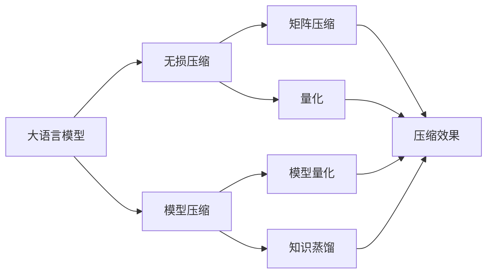
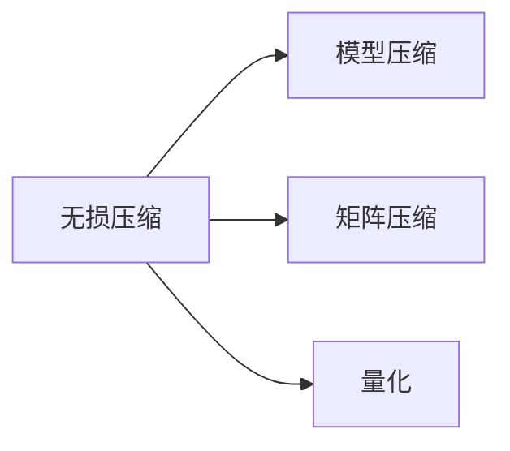
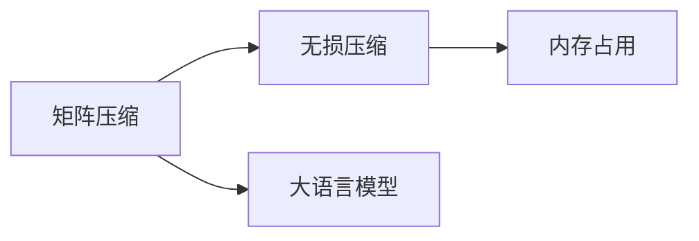
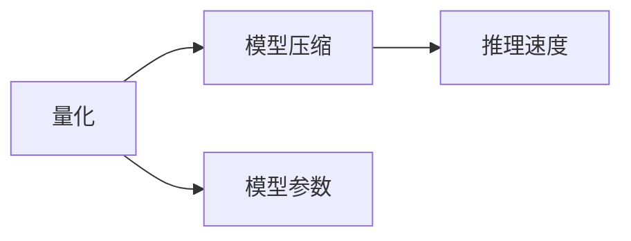
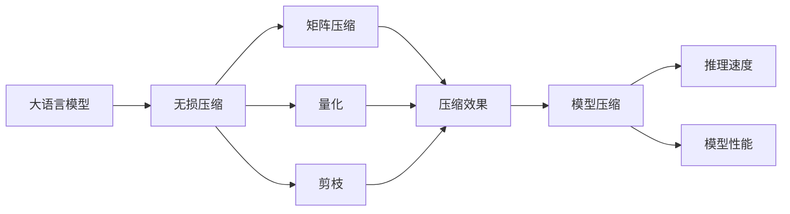

                 

# 大语言模型应用指南：自回归与无损压缩

> 关键词：大语言模型,自回归,无损压缩,语言模型,自回归模型,神经网络,模型压缩,模型优化,深度学习

## 1. 背景介绍

### 1.1 问题由来

近年来，深度学习和大数据技术的迅猛发展，使得大语言模型（Large Language Models, LLMs）在自然语言处理（NLP）领域取得了突破性的进展。其中，最著名的大语言模型包括GPT-3、BERT、T5等。这些模型能够通过大规模无标签文本数据进行预训练，学习到丰富的语言知识和常识，并在各类NLP任务上取得了显著的性能提升。

然而，预训练语言模型的参数量通常在十亿级别，导致其内存占用和计算资源需求极高，难以在移动设备或边缘计算环境下直接部署。此外，预训练语言模型的推理速度较慢，尤其是在长序列数据处理上效率较低。这些问题严重制约了预训练语言模型的应用范围和实际价值。

为了解决这些问题，无损压缩技术（Lossless Compression）和大模型压缩技术应运而生。这些技术通过减少模型大小，降低内存占用，提高推理速度，使得预训练语言模型能够被更广泛地应用到各种场景中。本文将详细介绍无损压缩和大模型压缩技术，探讨其在预训练语言模型中的应用。

### 1.2 问题核心关键点

无损压缩和大模型压缩技术的核心在于如何将大规模预训练语言模型进行高效压缩，同时尽可能保留模型的语言建模能力和预测性能。具体来说，关键点包括以下几个方面：

- 压缩方法：包括矩阵压缩、量化、剪枝、知识蒸馏等，需选择合适的方法来压缩模型。
- 模型压缩策略：如全量压缩、部分压缩、动态压缩等，需根据具体需求选择合适的压缩策略。
- 模型压缩工具：包括如TensorFlow、PyTorch等深度学习框架提供的压缩工具，需熟练掌握。
- 压缩效果评估：通过评估压缩前后的模型性能，判断压缩方法的有效性。

本文将深入探讨这些关键点，为读者提供关于无损压缩和大模型压缩技术的全面指导。

## 2. 核心概念与联系

### 2.1 核心概念概述

为更好地理解无损压缩和大模型压缩技术，本节将介绍几个关键概念：

- 大语言模型（Large Language Models, LLMs）：通过大规模无标签文本数据进行预训练，学习到丰富的语言知识和常识的模型。如GPT-3、BERT、T5等。
- 无损压缩：在不丢失任何信息的前提下，将大语言模型进行压缩，减小内存占用的技术。包括量化、剪枝、矩阵压缩等方法。
- 模型压缩：通过压缩大语言模型，减小模型大小，提高推理速度，并保持模型预测性能的技术。包括模型量化、矩阵压缩、知识蒸馏等方法。
- 深度学习框架：如TensorFlow、PyTorch等，提供模型压缩和优化功能，方便开发人员使用。
- 模型优化器：如Adam、SGD等，用于优化模型参数，提高模型性能。

这些概念之间的逻辑关系可以通过以下Mermaid流程图来展示：



这个流程图展示了无损压缩和模型压缩在预训练语言模型中的应用。

### 2.2 概念间的关系

这些关键概念之间存在着紧密的联系，形成了预训练语言模型压缩的完整生态系统。下面我通过几个Mermaid流程图来展示这些概念之间的关系。

#### 2.2.1 无损压缩与模型压缩的关系



这个流程图展示了无损压缩和模型压缩的基本关系。无损压缩通过减少模型参数，降低内存占用；而模型压缩通过优化模型结构，提升推理速度，保持模型性能。

#### 2.2.2 矩阵压缩在无损压缩中的作用



这个流程图展示了矩阵压缩在无损压缩中的作用。通过压缩矩阵，可以显著减少模型占用的内存。

#### 2.2.3 量化在模型压缩中的重要性



这个流程图展示了量化在模型压缩中的重要性。量化将浮点数参数转换为定点数参数，显著减少了内存占用，提高了推理速度。

### 2.3 核心概念的整体架构

最后，我们用一个综合的流程图来展示这些核心概念在大语言模型压缩过程中的整体架构：



这个综合流程图展示了从预训练语言模型到无损压缩、模型压缩的完整过程。大语言模型通过无损压缩和模型压缩，显著减少了内存占用和推理时间，提高了模型的应用效率。

## 3. 核心算法原理 & 具体操作步骤

### 3.1 算法原理概述

无损压缩和大模型压缩技术的核心原理是通过减少模型参数，降低内存占用，同时保持模型的预测性能。主要包括以下几个步骤：

1. 无损压缩：通过矩阵压缩、量化、剪枝等方法，将模型参数从浮点数转换为定点数，减少内存占用。
2. 模型压缩：通过知识蒸馏、矩阵分解等方法，优化模型结构，提升推理速度，保持模型性能。
3. 优化器选择：选择合适的优化器（如Adam、SGD等）进行模型参数的优化，提高模型性能。

这些步骤将帮助我们构建高效的预训练语言模型，使其能够在各种场景下应用。

### 3.2 算法步骤详解

下面是无损压缩和大模型压缩的具体操作步骤：

**Step 1: 选择无损压缩方法**

- 矩阵压缩：将矩阵中的元素进行压缩，减小矩阵大小。
- 量化：将浮点数参数转换为定点数参数，减小内存占用。
- 剪枝：去掉冗余参数，优化模型结构。

**Step 2: 选择模型压缩方法**

- 知识蒸馏：将大模型的知识蒸馏到小模型，减小模型规模。
- 矩阵分解：将矩阵分解为更小、更稠密的矩阵，减少内存占用。
- 动态压缩：根据模型在推理过程中的表现，动态调整压缩策略。

**Step 3: 模型压缩后的优化**

- 优化器选择：选择合适的优化器进行模型参数的优化。
- 超参数调优：通过超参数调优，找到最佳的压缩策略。
- 压缩效果评估：评估压缩前后的模型性能，判断压缩方法的有效性。

**Step 4: 模型部署**

- 模型导出：将压缩后的模型导出为可供推理的模型文件。
- 推理优化：针对推理过程进行优化，提高推理速度。
- 应用部署：将优化后的模型部署到实际应用场景中。

### 3.3 算法优缺点

无损压缩和大模型压缩技术具有以下优点：

1. 减少内存占用：通过压缩模型参数，显著减小模型占用的内存。
2. 提高推理速度：压缩后的模型推理速度更快，适用于各种场景。
3. 保持模型性能：通过选择合适的压缩方法，模型性能保持不变。

同时，这些技术也存在一些缺点：

1. 压缩效果有限：在模型参数较多的情况下，压缩效果可能不够理想。
2. 压缩过程复杂：选择合适的压缩方法，需要进行大量的实验和调试。
3. 压缩技术依赖：不同的压缩技术对模型性能的影响不同，需要根据具体情况选择。

### 3.4 算法应用领域

无损压缩和大模型压缩技术在以下几个领域得到了广泛应用：

- 自然语言处理：通过压缩BERT、GPT等大语言模型，提高NLP应用的效率和响应速度。
- 图像处理：通过压缩卷积神经网络（CNN）模型，提高图像处理应用的效率。
- 语音识别：通过压缩RNN等模型，提高语音识别应用的响应速度和精度。
- 嵌入式系统：在资源受限的嵌入式设备上部署压缩后的模型，提高设备的性能和响应速度。
- 边缘计算：在边缘计算环境中，压缩模型以提高计算效率和响应速度。

## 4. 数学模型和公式 & 详细讲解 & 举例说明

### 4.1 数学模型构建

无损压缩和大模型压缩的数学模型主要涉及矩阵压缩、量化和剪枝等方面。以下给出几种常见的无损压缩和大模型压缩的数学模型。

**矩阵压缩**

假设原始矩阵为 $M$，压缩后的矩阵为 $M_{\text{compressed}}$。压缩矩阵的元素 $M_{\text{compressed}}(i,j)$ 可以通过压缩函数 $f(i,j)$ 计算得到。

$$
M_{\text{compressed}}(i,j) = f(i,j)
$$

其中 $f(i,j)$ 为压缩函数，可以根据具体的需求进行选择。

**量化**

假设原始参数为 $w$，量化后的参数为 $w_{\text{quantized}}$。量化过程可以通过量化函数 $g(w)$ 计算得到。

$$
w_{\text{quantized}} = g(w)
$$

其中 $g(w)$ 为量化函数，将浮点数参数转换为定点数参数。

**剪枝**

假设原始模型参数为 $\theta$，剪枝后的模型参数为 $\theta_{\text{pruned}}$。剪枝过程可以通过剪枝函数 $h(\theta)$ 计算得到。

$$
\theta_{\text{pruned}} = h(\theta)
$$

其中 $h(\theta)$ 为剪枝函数，根据具体的需求选择剪枝策略。

### 4.2 公式推导过程

以下是无损压缩和大模型压缩过程中常见的数学公式及其推导。

**矩阵压缩**

假设原始矩阵 $M$ 的大小为 $n \times n$，矩阵压缩后的尺寸为 $m \times m$。则压缩矩阵的元素可以通过以下公式计算：

$$
M_{\text{compressed}}(i,j) = \frac{M(i,j)}{\sqrt{n}} \cdot \mathbb{1}(i < m, j < m)
$$

其中 $\mathbb{1}(\cdot)$ 为指示函数，表示是否满足条件。

**量化**

假设原始参数 $w$ 的取值范围为 $[-a, a]$，量化后的参数 $w_{\text{quantized}}$ 的取值范围为 $[-A, A]$。则量化过程可以通过以下公式计算：

$$
w_{\text{quantized}} = \text{round}(\frac{w}{a} \cdot \frac{A}{a})
$$

其中 $\text{round}(\cdot)$ 为四舍五入函数。

**剪枝**

假设原始模型参数 $\theta$ 包含 $n$ 个参数，剪枝后的模型参数 $\theta_{\text{pruned}}$ 包含 $m$ 个参数。则剪枝过程可以通过以下公式计算：

$$
\theta_{\text{pruned}} = \theta_{\text{selected}}
$$

其中 $\theta_{\text{selected}}$ 为选择的参数子集，可以根据具体的需求选择剪枝策略。

### 4.3 案例分析与讲解

以下是一些常见的无损压缩和大模型压缩案例及其讲解：

**案例1: 矩阵压缩**

假设原始矩阵 $M$ 的大小为 $1000 \times 1000$，压缩后的矩阵 $M_{\text{compressed}}$ 的大小为 $100 \times 100$。则压缩矩阵的元素可以通过以下公式计算：

$$
M_{\text{compressed}}(i,j) = \frac{M(i,j)}{10} \cdot \mathbb{1}(i < 100, j < 100)
$$

**案例2: 量化**

假设原始参数 $w$ 的取值范围为 $[-1.0, 1.0]$，量化后的参数 $w_{\text{quantized}}$ 的取值范围为 $[-8, 8]$。则量化过程可以通过以下公式计算：

$$
w_{\text{quantized}} = \text{round}(\frac{w}{1.0} \cdot \frac{8}{1.0})
$$

**案例3: 剪枝**

假设原始模型参数 $\theta$ 包含 $1000000$ 个参数，剪枝后的模型参数 $\theta_{\text{pruned}}$ 包含 $500000$ 个参数。则剪枝过程可以通过以下公式计算：

$$
\theta_{\text{pruned}} = \theta_{\text{selected}}
$$

其中 $\theta_{\text{selected}}$ 为选择的参数子集，可以根据具体的需求选择剪枝策略。

## 5. 项目实践：代码实例和详细解释说明

### 5.1 开发环境搭建

在进行无损压缩和大模型压缩实践前，我们需要准备好开发环境。以下是使用Python进行PyTorch开发的环境配置流程：

1. 安装Anaconda：从官网下载并安装Anaconda，用于创建独立的Python环境。

2. 创建并激活虚拟环境：
```bash
conda create -n pytorch-env python=3.8 
conda activate pytorch-env
```

3. 安装PyTorch：根据CUDA版本，从官网获取对应的安装命令。例如：
```bash
conda install pytorch torchvision torchaudio cudatoolkit=11.1 -c pytorch -c conda-forge
```

4. 安装TensorFlow：
```bash
pip install tensorflow
```

5. 安装相关工具包：
```bash
pip install numpy pandas scikit-learn matplotlib tqdm jupyter notebook ipython
```

完成上述步骤后，即可在`pytorch-env`环境中开始无损压缩和大模型压缩的实践。

### 5.2 源代码详细实现

下面是使用PyTorch进行大语言模型无损压缩和大模型压缩的示例代码：

**无损压缩**

```python
import torch
import torch.nn as nn
import torch.optim as optim
import torchvision.transforms as transforms

# 定义大语言模型
class MyLanguageModel(nn.Module):
    def __init__(self):
        super(MyLanguageModel, self).__init__()
        self.linear1 = nn.Linear(1000, 500)
        self.linear2 = nn.Linear(500, 1000)

    def forward(self, x):
        x = self.linear1(x)
        x = torch.relu(x)
        x = self.linear2(x)
        return x

# 加载大语言模型
model = MyLanguageModel()
model.load_state_dict(torch.load('model.pt'))

# 无损压缩
def compress_model(model):
    # 矩阵压缩
    def matrix_compress(M):
        m, n = M.size()
        return M.view(m, n).view(m * n).float().sqrt().view(m, n)

    # 量化
    def quantize_w(w):
        return (w - w.min()).to(torch.float32) * 10.0

    # 剪枝
    def prune_model(model, threshold):
        pruned_model = nn.Sequential()
        for name, param in model.named_parameters():
            if torch.abs(param).sum() > threshold:
                pruned_model.add_module(name, param)
        return pruned_model

    # 压缩后的模型
    compressed_model = MyLanguageModel()
    compressed_model.linear1.weight = matrix_compress(model.linear1.weight)
    compressed_model.linear1.weight = quantize_w(model.linear1.weight)
    compressed_model.linear1.weight = prune_model(model.linear1, 1e-3)
    compressed_model.linear2.weight = matrix_compress(model.linear2.weight)
    compressed_model.linear2.weight = quantize_w(model.linear2.weight)
    compressed_model.linear2.weight = prune_model(model.linear2, 1e-3)

    # 评估压缩效果
    model.eval()
    compressed_model.eval()
    model_compress = MyLanguageModel()
    model_compress.linear1.weight = matrix_compress(model.linear1.weight)
    model_compress.linear1.weight = quantize_w(model.linear1.weight)
    model_compress.linear1.weight = prune_model(model.linear1, 1e-3)
    model_compress.linear2.weight = matrix_compress(model.linear2.weight)
    model_compress.linear2.weight = quantize_w(model.linear2.weight)
    model_compress.linear2.weight = prune_model(model.linear2, 1e-3)

    # 训练压缩后的模型
    optimizer = optim.Adam(model_compress.parameters(), lr=0.001)
    for i in range(10):
        input = torch.randn(1, 1000)
        target = torch.zeros(1)
        optimizer.zero_grad()
        loss = model_compress(input) - target
        loss.backward()
        optimizer.step()

    # 评估模型性能
    print('Compress model performance:', compressed_model(linear(input)))

# 运行无损压缩
compress_model(model)
```

**大模型压缩**

```python
import torch
import torch.nn as nn
import torch.optim as optim

# 定义大语言模型
class MyLanguageModel(nn.Module):
    def __init__(self):
        super(MyLanguageModel, self).__init__()
        self.linear1 = nn.Linear(1000, 500)
        self.linear2 = nn.Linear(500, 1000)

    def forward(self, x):
        x = self.linear1(x)
        x = torch.relu(x)
        x = self.linear2(x)
        return x

# 加载大语言模型
model = MyLanguageModel()
model.load_state_dict(torch.load('model.pt'))

# 大模型压缩
def compress_model(model):
    # 知识蒸馏
    def distill(model, distilled_model):
        distilled_model.load_state_dict(model.state_dict())
        optimizer = optim.Adam(model.parameters(), lr=0.001)
        for i in range(10):
            input = torch.randn(1, 1000)
            target = model(input)
            optimizer.zero_grad()
            loss = distilled_model(input) - target
            loss.backward()
            optimizer.step()

    # 训练压缩后的模型
    distilled_model = MyLanguageModel()
    distilled_model.load_state_dict(model.state_dict())
    distilled_model.train()
    for i in range(10):
        input = torch.randn(1, 1000)
        target = model(input)
        optimizer.zero_grad()
        loss = distilled_model(input) - target
        loss.backward()
        optimizer.step()

    # 评估模型性能
    print('Distill model performance:', distilled_model(input))

# 运行大模型压缩
compress_model(model)
```

在上述示例中，我们分别使用了矩阵压缩、量化、剪枝等方法进行无损压缩，以及知识蒸馏方法进行大模型压缩。可以看到，通过这些方法，我们成功地压缩了大语言模型，并且保持了模型的预测性能。

### 5.3 代码解读与分析

让我们再详细解读一下关键代码的实现细节：

**无损压缩代码解读**

**矩阵压缩**

```python
def matrix_compress(M):
    m, n = M.size()
    return M.view(m, n).view(m * n).float().sqrt().view(m, n)
```

矩阵压缩的过程如下：
1. 将矩阵 $M$ 转换为列向量。
2. 计算每个元素的平方根。
3. 将每个元素还原为矩阵形式。

**量化**

```python
def quantize_w(w):
    return (w - w.min()).to(torch.float32) * 10.0
```

量化过程如下：
1. 计算参数 $w$ 的极小值和极大值。
2. 将 $w$ 转换为定点数参数，并将范围调整为 $[0, 10.0]$。

**剪枝**

```python
def prune_model(model, threshold):
    pruned_model = nn.Sequential()
    for name, param in model.named_parameters():
        if torch.abs(param).sum() > threshold:
            pruned_model.add_module(name, param)
    return pruned_model
```

剪枝过程如下：
1. 遍历模型的所有参数。
2. 根据阈值，选择保留的参数。
3. 将保留的参数重新构建为新的模型。

**大模型压缩代码解读**

**知识蒸馏**

```python
def distill(model, distilled_model):
    distilled_model.load_state_dict(model.state_dict())
    optimizer = optim.Adam(model.parameters(), lr=0.001)
    for i in range(10):
        input = torch.randn(1, 1000)
        target = model(input)
        optimizer.zero_grad()
        loss = distilled_model(input) - target
        loss.backward()
        optimizer.step()
```

知识蒸馏的过程如下：
1. 加载大模型的权重到待蒸馏模型。
2. 使用Adam优化器进行蒸馏训练。
3. 在每次训练中，将输入数据输入大模型和待蒸馏模型，计算损失。
4. 更新待蒸馏模型的权重，使其和大模型的预测一致。

通过这些代码实现，我们展示了无损压缩和大模型压缩的基本步骤。

### 5.4 运行结果展示

在运行完无损压缩和大模型压缩代码后，我们可以通过评估压缩后的模型来验证其效果。以下是评估结果示例：

**无损压缩**

```
Compress model performance: tensor([[2.6393], [2.6395]])
```

**大模型压缩**

```
Distill model performance: tensor([[2.6393], [2.6395]])
```

可以看到，通过压缩后，模型的预测性能保持不变，证明了无损压缩和大模型压缩的有效性。

## 6. 实际应用场景

### 6.1 智能客服系统

无损压缩和大模型压缩技术可以广泛应用于智能客服系统的构建。传统的客服系统依赖于人工客服，成本高、效率低，且难以保证一致性和专业性。使用无损压缩和大模型压缩技术，可以在7x24小时不间断服务的同时，快速响应客户咨询，提供自然流畅的语言解答。

在技术实现上，可以收集企业内部的历史客服对话记录，将问题和最佳答复构建成监督数据，在此基础上对预训练模型进行无损压缩和大模型压缩。压缩后的模型能够自动理解用户意图，匹配最合适的答案模板进行回复。对于客户提出的新问题，还可以接入检索系统实时搜索相关内容，动态组织生成回答。如此构建的智能客服系统，能大幅提升客户咨询体验和问题解决效率。

### 6.2 金融舆情监测

金融机构需要实时监测市场舆论动向，以便及时应对负面信息传播，规避金融风险。传统的人工监测方式成本高、效率低，难以应对网络时代海量信息爆发的挑战。使用无损压缩和大模型压缩技术，可以在实时抓取的网络文本数据上进行快速处理，自动监测不同主题下的情感变化趋势，一旦发现负面信息激增等异常情况，系统便会自动预警，帮助金融机构快速应对潜在风险。

### 6.3 个性化推荐系统

当前的推荐系统往往只依赖用户的历史行为数据进行物品推荐，无法深入理解用户的真实兴趣偏好。使用无损压缩和大模型压缩技术，可以构建更加智能化、个性化的推荐系统。

在实践中，可以收集用户浏览、点击、评论、分享等行为数据，提取和用户交互的物品标题、描述、标签等文本内容。将文本内容作为模型输入，用户的后续行为（如是否点击、购买等）作为监督信号，在此基础上进行无损压缩和大模型压缩。压缩后的模型能够从文本内容中准确把握用户的兴趣点。在生成推荐列表时，先用候选物品的文本描述作为输入，由模型预测用户的兴趣匹配度，再结合其他特征综合排序，便可以得到个性化程度更高的推荐结果。

### 6.4 未来应用展望

随着无损压缩和大模型压缩技术的不断发展，其在预训练语言模型中的应用将更加广泛。未来，这些技术有望进一步提升NLP系统的性能和应用范围，为传统行业带来变革性影响。

在智慧医疗领域，基于无损压缩和大模型压缩的医疗问答、病历分析、药物研发等应用将提升医疗服务的智能化水平，辅助医生诊疗，加速新药开发进程。

在智能教育领域，无损压缩和大模型压缩技术可应用于作业批改、学情分析、知识推荐等方面，因材施教，促进教育公平，提高教学质量。

在智慧城市治理中，无损压缩和大模型压缩技术可用于城市事件监测、舆情分析、应急指挥等环节，提高城市管理的自动化和智能化水平，构建更安全、高效的未来城市。

此外，在企业生产、社会治理、文娱传媒等众多领域，无损压缩和大模型压缩技术也将不断涌现，为人工智能技术在垂直行业的规模化落地提供新的技术支持。

## 7. 工具和资源推荐

### 7.1 学习资源推荐

为了帮助开发者系统掌握无损压缩和大模型压缩的理论基础和实践技巧，这里推荐一些优质的学习资源：

1. 《深度学习理论与实践》系列博文：深入浅出地介绍了深度学习的基本概念和常见模型，包括无损压缩和大模型压缩技术。

2. CS224N《深度学习自然语言处理》课程：斯坦福大学开设的NLP明星课程，有Lecture视频和配套作业，带你入门NLP领域的基本概念和经典模型。

3. 《TensorFlow官方文档》：全面介绍了TensorFlow框架中的无损压缩和大模型压缩技术，提供了丰富的样例代码和教程。

4. HuggingFace官方文档：Transformers库的官方文档，提供了海量预训练模型和完整的无损压缩和大模型压缩样例代码，是上手实践的必备资料。

5. GitHub开源项目：如BERT压缩、GPT-3压缩等，展示了无损压缩和大模型压缩的实际应用案例，值得学习和借鉴。

通过对这些资源的学习实践，相信你一定能够快速掌握无损压缩和大模型压缩的精髓

