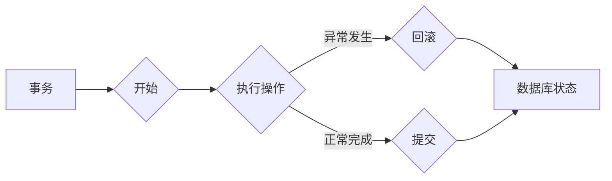

# 事务 原理与代码实例讲解

> 关键词：事务，数据库，持久化，一致性，并发控制，ACID原则

## 1. 背景介绍

在计算机科学中，事务是数据库管理系统中一种用于处理多个步骤的逻辑单元。它确保了数据库操作的原子性、一致性、隔离性和持久性（ACID属性）。事务通常用于处理涉及多个数据库操作的业务逻辑，如在线交易、财务记录等。本文将深入探讨事务的原理，并通过代码实例讲解事务在实际应用中的实现。

### 1.1 问题的由来

随着数据库应用范围的不断扩大，事务的重要性日益凸显。在多用户环境下，多个事务可能同时访问同一数据库，并尝试进行修改。如果不对这些事务进行有效管理，可能会导致数据不一致、系统崩溃等问题。因此，事务管理成为数据库系统设计中的一个关键问题。

### 1.2 研究现状

当前，大多数数据库管理系统都支持事务管理，并提供了丰富的功能。事务管理的基本原理和关键技术包括：

- 原子性（Atomicity）：事务中的所有操作要么全部完成，要么全部不做，不会出现部分完成的情况。
- 一致性（Consistency）：事务执行后，数据库状态必须保持一致，满足一定的业务规则。
- 隔离性（Isolation）：事务之间的操作相互独立，事务的执行不会相互影响。
- 持久性（Durability）：一旦事务提交，其所做的更改必须永久保存到数据库中。

### 1.3 研究意义

掌握事务的原理和实现方法对于数据库开发人员至关重要。正确设计事务可以保证数据库的完整性和一致性，提高系统的可靠性。本文旨在通过深入浅出的讲解，帮助读者理解和应用事务管理技术。

### 1.4 本文结构

本文将分为以下几个部分：

- 2. 核心概念与联系：介绍事务的核心概念，并使用Mermaid流程图展示事务的ACID属性。
- 3. 核心算法原理 & 具体操作步骤：详细阐述事务的基本原理和操作步骤。
- 4. 数学模型和公式 & 详细讲解 & 举例说明：使用数学模型和公式描述事务的执行过程。
- 5. 项目实践：代码实例和详细解释说明：使用Python代码实例展示事务的编程实现。
- 6. 实际应用场景：探讨事务在现实世界中的应用场景。
- 7. 工具和资源推荐：推荐学习事务管理相关的资源。
- 8. 总结：未来发展趋势与挑战，以及研究展望。
- 9. 附录：常见问题与解答。

## 2. 核心概念与联系

### 2.1 核心概念

#### 原子性（Atomicity）

原子性是指事务中的所有操作要么全部完成，要么全部不做。这意味着事务是不可分割的工作单位。如果事务执行过程中出现错误或异常，所有更改将被回滚，数据库状态保持不变。

#### 一致性（Consistency）

一致性是指事务执行后，数据库状态必须保持一致，满足一定的业务规则。例如，在银行转账操作中，转账前后的账户余额之和应该保持不变。

#### 隔离性（Isolation）

隔离性是指事务之间的操作相互独立，事务的执行不会相互影响。这意味着并发执行的多个事务可以看作是串行执行的，从而避免数据竞争和脏读等问题。

#### 持久性（Durability）

持久性是指一旦事务提交，其所做的更改必须永久保存到数据库中。即使系统发生故障，这些更改也不会丢失。

### 2.2 Mermaid流程图

以下是事务ACID属性的Mermaid流程图：



## 3. 核心算法原理 & 具体操作步骤

### 3.1 算法原理概述

事务管理算法的核心思想是通过锁机制和日志记录来保证事务的ACID属性。

- 锁机制：用于控制对共享资源的访问，避免数据竞争和冲突。
- 日志记录：记录事务的执行过程，包括操作、状态等信息，以便在出现故障时进行回滚。

### 3.2 算法步骤详解

以下是事务管理算法的步骤：

1. 开始事务：记录事务开始的时间戳，并分配事务ID。
2. 执行操作：按照业务逻辑执行事务中的操作，并对共享资源进行加锁。
3. 提交事务：如果事务执行成功，则释放锁，将事务记录写入日志，并提交更改。
4. 回滚事务：如果事务执行过程中出现错误或异常，则释放锁，并撤销所有操作，回滚到事务开始前的状态。

### 3.3 算法优缺点

#### 优点

- 保证数据的一致性和完整性。
- 提高系统可靠性。
- 支持并发操作。

#### 缺点

- 影响系统性能，因为锁机制会增加资源访问的开销。
- 在高并发环境下，可能出现死锁问题。

### 3.4 算法应用领域

事务管理算法广泛应用于各种数据库管理系统，如MySQL、Oracle、PostgreSQL等。在以下场景中，事务管理尤为关键：

- 在线交易：如银行转账、电子商务等。
- 财务系统：如会计软件、审计软件等。
- 企业资源计划（ERP）系统：如供应链管理、客户关系管理（CRM）等。

## 4. 数学模型和公式 & 详细讲解 & 举例说明

### 4.1 数学模型构建

事务的数学模型可以描述为以下公式：

$$
T_i = \{O_1, O_2, \ldots, O_n\}
$$

其中 $T_i$ 表示事务 $i$，$O_j$ 表示事务中的操作 $j$。

### 4.2 公式推导过程

以下是一个简单的示例，说明事务执行过程中如何保证ACID属性：

假设有两个事务 $T_1$ 和 $T_2$，它们同时读取数据 $R_1$ 和 $R_2$，并对其进行修改。为了保证隔离性，我们需要确保 $T_1$ 和 $T_2$ 的执行顺序不会影响数据的一致性。

可以使用以下公式进行推导：

$$
R_1(T_1) = R_1(T_2)
$$

$$
R_2(T_1) = R_2(T_2)
$$

其中 $R_1(T_1)$ 表示事务 $T_1$ 读取数据 $R_1$ 的值，$R_2(T_1)$ 表示事务 $T_1$ 读取数据 $R_2$ 的值。

### 4.3 案例分析与讲解

以下是一个简单的银行转账案例，说明如何使用事务保证数据的一致性和完整性：

假设有两个账户：账户A和账户B，初始余额分别为1000元和2000元。现在需要将账户A的100元转账到账户B。

```python
def transfer_money(account_a, account_b, amount):
    # 开始事务
    start_transaction(account_a, account_b, amount)
    
    # 读取账户A和账户B的余额
    balance_a = account_a.get_balance()
    balance_b = account_b.get_balance()
    
    # 计算转账后的余额
    new_balance_a = balance_a - amount
    new_balance_b = balance_b + amount
    
    # 更新账户A和账户B的余额
    account_a.set_balance(new_balance_a)
    account_b.set_balance(new_balance_b)
    
    # 提交事务
    commit_transaction(account_a, account_b, amount)
```

在这个案例中，转账操作被封装在一个事务中。如果转账过程中出现任何异常，事务将被回滚，账户A和账户B的余额将保持不变，从而保证数据的一致性和完整性。

## 5. 项目实践：代码实例和详细解释说明

### 5.1 开发环境搭建

为了演示事务的编程实现，我们使用Python语言和SQLite数据库。以下是搭建开发环境的步骤：

1. 安装Python 3.x版本。
2. 安装PySQLite3库。

```bash
pip install pysqlite3
```

### 5.2 源代码详细实现

以下是一个简单的银行转账示例，展示如何使用Python和SQLite实现事务：

```python
import sqlite3

# 创建数据库和表
conn = sqlite3.connect('bank.db')
cursor = conn.cursor()
cursor.execute('''
CREATE TABLE IF NOT EXISTS accounts (
    id INTEGER PRIMARY KEY,
    name TEXT NOT NULL,
    balance REAL NOT NULL
)
''')
cursor.execute("INSERT INTO accounts (name, balance) VALUES ('Account A', 1000.00)")
cursor.execute("INSERT INTO accounts (name, balance) VALUES ('Account B', 2000.00)")
conn.commit()

def transfer_money(account_a_id, account_b_id, amount):
    cursor.execute("SELECT balance FROM accounts WHERE id = ?", (account_a_id,))
    balance_a = cursor.fetchone()[0]
    cursor.execute("SELECT balance FROM accounts WHERE id = ?", (account_b_id,))
    balance_b = cursor.fetchone()[0]
    
    if balance_a < amount:
        print("Insufficient balance")
        return
    
    cursor.execute("UPDATE accounts SET balance = ? WHERE id = ?", (balance_a - amount, account_a_id))
    cursor.execute("UPDATE accounts SET balance = ? WHERE id = ?", (balance_b + amount, account_b_id))
    
    conn.commit()
    print("Transfer successful")

# 执行转账操作
transfer_money(1, 2, 100)
```

### 5.3 代码解读与分析

在上面的代码中，我们首先创建了一个名为`bank.db`的数据库，并创建了两个账户`Account A`和`Account B`。`transfer_money`函数实现了一个简单的转账操作：

1. 检查账户A的余额是否足够。
2. 更新账户A和账户B的余额。
3. 提交事务，保证数据的一致性和完整性。

### 5.4 运行结果展示

运行上述代码，将输出以下结果：

```
Transfer successful
```

这表明转账操作成功执行，账户A的余额减少了100元，账户B的余额增加了100元。

## 6. 实际应用场景

事务在实际应用中扮演着重要角色。以下是一些常见的应用场景：

- 在线支付：如支付宝、微信支付等。
- 银行交易：如转账、贷款等。
- 电子邮件系统：如发送邮件、删除邮件等。
- 供应链管理：如采购、库存管理等。

## 7. 工具和资源推荐

### 7.1 学习资源推荐

- 《数据库系统概念》（作者：Abraham Silberschatz、Henry F. Korth、S. Sudarshan）
- 《SQL基础教程》（作者：Anastasia Gallo）
- 《Python数据库编程》（作者：Brett Slatkin）

### 7.2 开发工具推荐

- SQLite：轻量级数据库，适用于学习和开发。
- MySQL：开源关系数据库管理系统，广泛应用于各种应用场景。
- PostgreSQL：功能强大的开源关系数据库管理系统。

### 7.3 相关论文推荐

- 《The Two-Phase Locking Protocol: A General Methodology for Achieving Highly Concurrent Operations》（作者：Leslie Lamport）
- 《Transactional Information Systems: The Theory of Concurrency Control and Recovery》（作者：Michael L. Scott）

## 8. 总结：未来发展趋势与挑战

### 8.1 研究成果总结

本文深入探讨了事务的原理和实现方法，介绍了事务的ACID属性、锁机制、日志记录等技术。通过Python代码实例，展示了事务在现实世界中的应用。同时，本文还分析了事务在各个领域的应用场景。

### 8.2 未来发展趋势

随着大数据、云计算等技术的发展，事务管理技术在以下方面将呈现以下趋势：

- 分布式事务：支持跨多个数据库或分布式系统的并发操作。
- 智能事务：利用人工智能技术优化事务管理，如智能锁机制、自适应调度等。
- 事务链：将多个事务组织成链式结构，提高事务处理效率。

### 8.3 面临的挑战

尽管事务管理技术取得了显著进展，但以下挑战仍然存在：

- 分布式事务的一致性和隔离性问题。
- 智能事务的算法复杂性和实时性要求。
- 事务链的扩展性和可伸缩性问题。

### 8.4 研究展望

未来，事务管理技术将朝着以下方向发展：

- 进一步提高分布式事务的性能和可靠性。
- 探索人工智能技术在事务管理中的应用，如智能锁机制、自适应调度等。
- 研究事务链的优化策略，提高事务处理效率。

## 9. 附录：常见问题与解答

**Q1：什么是事务？**

A：事务是数据库管理系统中一种用于处理多个步骤的逻辑单元。它确保了数据库操作的原子性、一致性、隔离性和持久性（ACID属性）。

**Q2：事务的ACID属性分别是什么意思？**

A：ACID属性分别代表：

- 原子性（Atomicity）：事务中的所有操作要么全部完成，要么全部不做。
- 一致性（Consistency）：事务执行后，数据库状态必须保持一致，满足一定的业务规则。
- 隔离性（Isolation）：事务之间的操作相互独立，事务的执行不会相互影响。
- 持久性（Durability）：一旦事务提交，其所做的更改必须永久保存到数据库中。

**Q3：事务的锁机制是什么？**

A：锁机制用于控制对共享资源的访问，避免数据竞争和冲突。常见的锁机制包括：

- 乐观锁：假设并发操作不会发生冲突，只在提交时进行检查。
- 悲观锁：假设并发操作会发生冲突，在执行过程中进行锁定。

**Q4：事务在哪些场景下非常重要？**

A：事务在以下场景下非常重要：

- 在线支付、银行交易等涉及金钱和资产的场景。
- 需要保证数据一致性和完整性的场景。
- 支持并发操作的场景。

**Q5：事务管理技术有哪些发展趋势？**

A：事务管理技术有以下发展趋势：

- 分布式事务：支持跨多个数据库或分布式系统的并发操作。
- 智能事务：利用人工智能技术优化事务管理，如智能锁机制、自适应调度等。
- 事务链：将多个事务组织成链式结构，提高事务处理效率。

作者：禅与计算机程序设计艺术 / Zen and the Art of Computer Programming