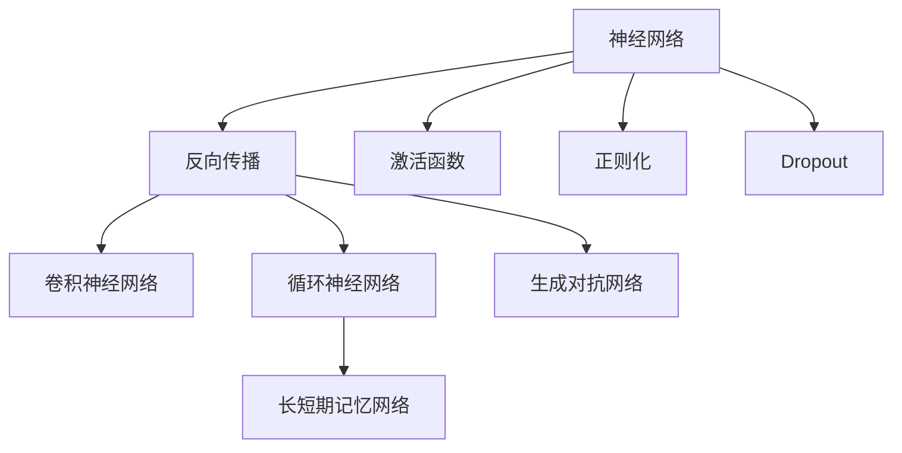
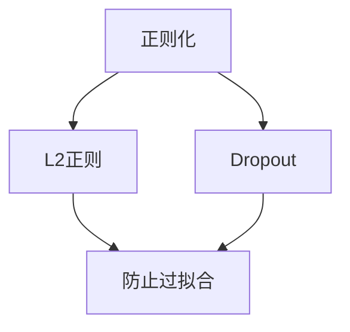
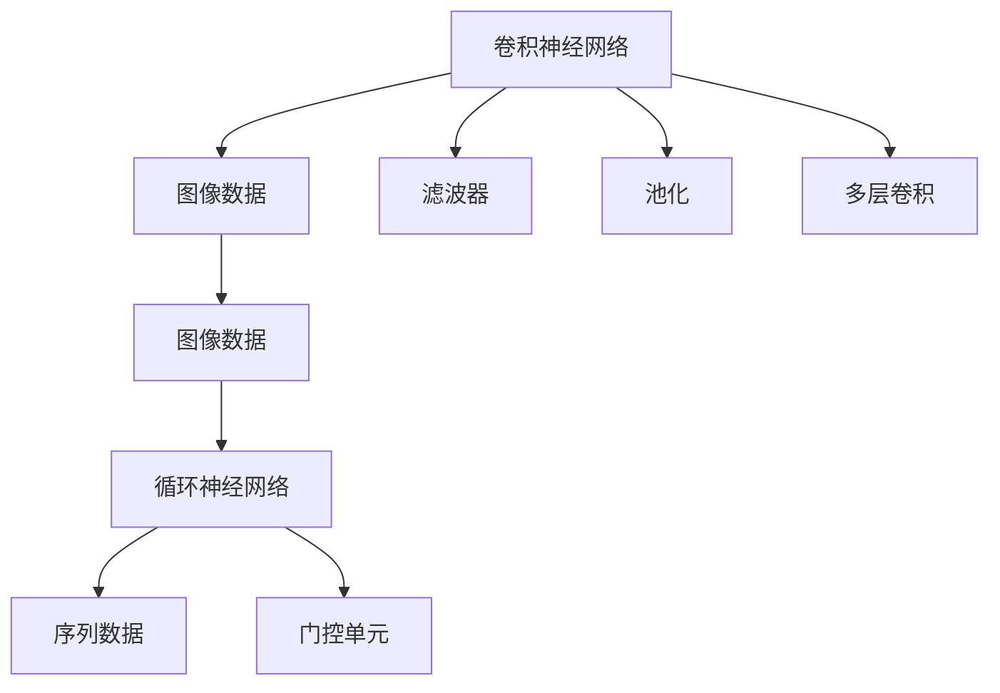
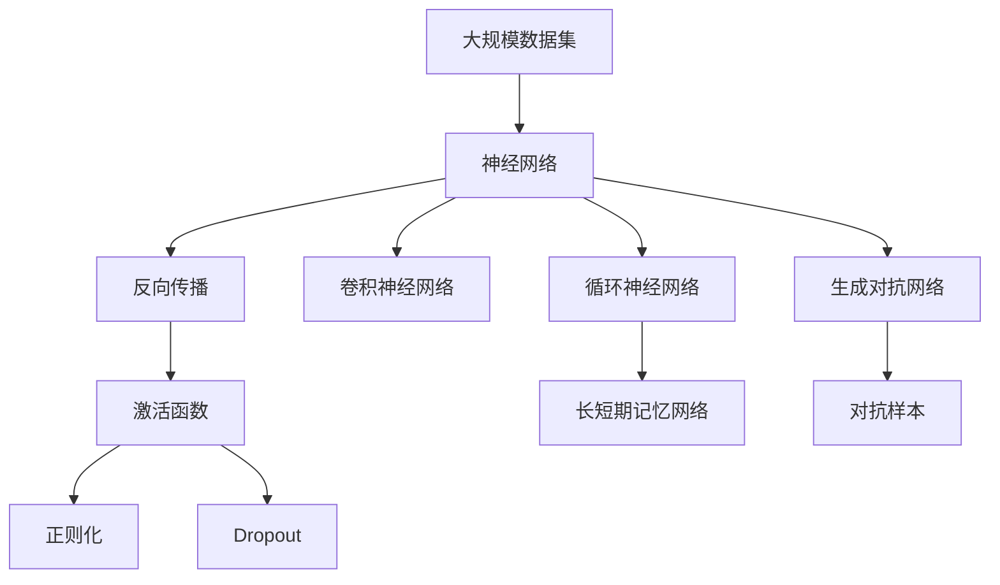
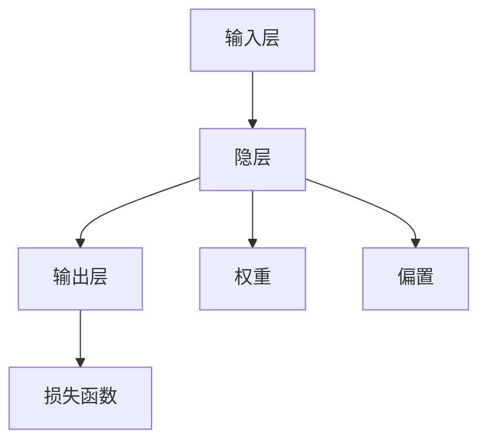

                 

# Deep Learning (DL) 原理与代码实战案例讲解

> 关键词：深度学习,神经网络,反向传播,激活函数,正则化,Dropout,卷积神经网络(CNN),循环神经网络(RNN),长短期记忆网络(LSTM),生成对抗网络(GAN)

## 1. 背景介绍

### 1.1 问题由来
深度学习（Deep Learning, DL）是人工智能领域中最为前沿和热门的技术之一。它通过构建多层次的神经网络模型，模拟人类大脑的抽象和推理能力，从而解决各种复杂的模式识别和预测问题。深度学习已经在图像识别、语音识别、自然语言处理等众多领域取得了革命性的突破，广泛应用于实际应用中。

然而，尽管深度学习技术发展迅速，但其理论基础和实践应用仍面临诸多挑战。如何构建高效、可解释的深度学习模型，如何在有限的标注数据下提升模型性能，如何高效实现深度学习算法，这些都是在深度学习研究和应用中需要不断探索和解决的问题。

### 1.2 问题核心关键点
深度学习的核心在于如何通过多层次的神经网络构建复杂映射，从而实现高精度的模型预测。这一过程中，网络结构的深度、层间连接的权重、激活函数的选择、正则化和优化方法的设计等，都是影响模型性能的重要因素。同时，深度学习模型的训练过程非常耗时且资源密集，如何进行高效的模型训练和优化，也成为了一项重要的研究课题。

## 2. 核心概念与联系

### 2.1 核心概念概述

为更好地理解深度学习的基本原理和实现方法，本节将介绍几个密切相关的核心概念：

- 神经网络（Neural Network）：由多个神经元（节点）通过有向边相连构成的网络，能够实现非线性映射。
- 反向传播（Backpropagation）：一种用于训练神经网络的高效算法，通过链式法则计算损失函数对每个参数的梯度，从而进行参数更新。
- 激活函数（Activation Function）：决定神经元的输出，使得神经网络能够学习非线性关系，常用的激活函数包括Sigmoid、ReLU等。
- 正则化（Regularization）：通过添加惩罚项或裁剪参数大小，防止模型过拟合，常用的正则化方法包括L2正则、Dropout等。
- Dropout：一种随机失活神经元的方法，可以防止过拟合，提高模型的泛化能力。
- 卷积神经网络（Convolutional Neural Network, CNN）：专门用于处理图像、视频等结构化数据的深度学习模型。
- 循环神经网络（Recurrent Neural Network, RNN）：通过循环连接，可以处理序列数据的深度学习模型。
- 长短期记忆网络（Long Short-Term Memory, LSTM）：一种特殊的RNN，可以处理长期依赖关系，用于自然语言处理和语音识别等任务。
- 生成对抗网络（Generative Adversarial Network, GAN）：通过两个神经网络（生成器和判别器）的对抗训练，可以生成逼真的图像、视频等。

这些核心概念之间的逻辑关系可以通过以下Mermaid流程图来展示：



这个流程图展示了大语言模型的核心概念及其之间的关系：

1. 神经网络通过反向传播算法进行训练。
2. 激活函数使得神经网络能够学习非线性关系。
3. 正则化和Dropout可以防止模型过拟合。
4. 卷积神经网络、循环神经网络、长短期记忆网络和生成对抗网络等，是神经网络的具体形式，用于解决不同类型的应用问题。

### 2.2 概念间的关系

这些核心概念之间存在着紧密的联系，形成了深度学习的完整生态系统。下面我们通过几个Mermaid流程图来展示这些概念之间的关系。

#### 2.2.1 深度学习的学习范式


这个流程图展示了大语言模型的学习范式。神经网络通过反向传播算法进行训练，激活函数、正则化和Dropout等技术防止过拟合，而卷积神经网络、循环神经网络、长短期记忆网络和生成对抗网络等，则是神经网络的具体形式，用于解决不同类型的应用问题。

#### 2.2.2 正则化与Dropout的关系



这个流程图展示了正则化与Dropout之间的关系。正则化和Dropout都是防止模型过拟合的技术，通过不同的方式实现这一目标。L2正则通过惩罚权重的大小，防止权重过大导致过拟合；Dropout则通过随机失活部分神经元，使得模型更加鲁棒。

#### 2.2.3 卷积神经网络与循环神经网络的关系



这个流程图展示了卷积神经网络与循环神经网络的关系。卷积神经网络主要用于处理图像、视频等结构化数据，通过多层卷积和池化操作，提取特征信息。循环神经网络主要用于处理序列数据，通过门控单元等机制，捕捉时间依赖关系。两者在不同的应用场景下，都具有各自的优点和适用性。

### 2.3 核心概念的整体架构

最后，我们用一个综合的流程图来展示这些核心概念在大语言模型深度学习过程中的整体架构：



这个综合流程图展示了从数据集到深度学习模型的完整过程。神经网络通过反向传播算法进行训练，激活函数、正则化和Dropout等技术防止过拟合，而卷积神经网络、循环神经网络、长短期记忆网络和生成对抗网络等，则是神经网络的具体形式，用于解决不同类型的应用问题。对抗样本则是在生成对抗网络中的应用，通过生成假样本来训练模型，提高模型的鲁棒性。

## 3. 核心算法原理 & 具体操作步骤
### 3.1 算法原理概述

深度学习的核心算法原理包括反向传播、激活函数、正则化和优化算法等。本节将详细讲解这些算法原理，并给出操作步骤。

### 3.2 算法步骤详解

深度学习模型的训练过程包括以下关键步骤：

1. **数据准备**：收集和预处理训练数据，划分为训练集、验证集和测试集。
2. **模型构建**：选择合适的网络结构和激活函数，搭建深度学习模型。
3. **损失函数设计**：根据任务类型，设计合适的损失函数，衡量模型预测输出与真实标签之间的差异。
4. **模型训练**：通过反向传播算法，优化模型参数，最小化损失函数。
5. **模型评估**：在验证集和测试集上评估模型性能，选择合适的超参数进行调优。

### 3.3 算法优缺点

深度学习算法具有以下优点：

- 强大的非线性建模能力：通过多层次的神经网络，深度学习能够学习复杂的非线性关系，适用于各种复杂模式识别问题。
- 高效的特征提取：深度学习模型能够自动提取特征，无需手工设计特征工程，提升了数据利用效率。
- 泛化能力强：通过大规模数据训练，深度学习模型能够泛化到未见过的数据，具有较强的预测能力。

同时，深度学习算法也存在以下缺点：

- 计算资源消耗大：深度学习模型参数量庞大，训练过程复杂耗时，需要高性能计算资源。
- 容易过拟合：深度学习模型参数量较大，容易出现过拟合现象，需要正则化等技术进行防止。
- 可解释性差：深度学习模型被视为"黑盒"系统，难以解释其内部工作机制和决策逻辑。
- 需要大量标注数据：深度学习模型需要大量的标注数据进行训练，标注成本较高。

### 3.4 算法应用领域

深度学习技术已经在各个领域得到了广泛应用，包括但不限于：

- 计算机视觉：图像分类、目标检测、图像生成、图像修复等。
- 自然语言处理：语言模型、文本分类、机器翻译、文本生成等。
- 语音识别：语音识别、语音合成、说话人识别等。
- 机器人学习：机器人导航、语音指令控制等。
- 医疗诊断：医学影像分析、病历分析等。
- 金融风控：信用评估、欺诈检测等。
- 自动驾驶：车辆行为预测、场景理解等。

## 4. 数学模型和公式 & 详细讲解 & 举例说明

### 4.1 数学模型构建

在深度学习中，通常使用神经网络进行建模。神经网络由多个层次的神经元构成，每个神经元接收输入，通过激活函数计算输出。神经网络的输出通过损失函数与真实标签进行比较，从而计算出模型的预测误差。

神经网络的结构如图1所示：



图1：神经网络结构示意图

### 4.2 公式推导过程

以简单的单层神经网络为例，推导其数学模型和损失函数。

假设输入数据为 $\mathbf{x}$，神经网络包含 $n$ 个神经元，激活函数为 $\sigma(\cdot)$，输出为 $\mathbf{y}$，权重矩阵为 $\mathbf{W}$，偏置向量为 $\mathbf{b}$。则神经网络的输出为：

$$
\mathbf{y} = \sigma(\mathbf{W}\mathbf{x} + \mathbf{b})
$$

假设模型的输出与真实标签之间存在误差 $\mathbf{e} = \mathbf{y} - \mathbf{t}$，其中 $\mathbf{t}$ 为真实标签。根据均方误差损失函数，模型的损失函数为：

$$
\mathcal{L}(\mathbf{x}, \mathbf{W}, \mathbf{b}, \mathbf{t}) = \frac{1}{2} ||\mathbf{y} - \mathbf{t}||^2
$$

根据链式法则，计算损失函数对权重 $\mathbf{W}$ 和偏置 $\mathbf{b}$ 的梯度：

$$
\frac{\partial \mathcal{L}}{\partial \mathbf{W}} = \mathbf{x}(\mathbf{y} - \mathbf{t})
$$

$$
\frac{\partial \mathcal{L}}{\partial \mathbf{b}} = \mathbf{y} - \mathbf{t}
$$

通过反向传播算法，更新权重 $\mathbf{W}$ 和偏置 $\mathbf{b}$，使得损失函数最小化。

### 4.3 案例分析与讲解

以图像分类为例，说明深度学习模型的训练过程。

假设要训练一个卷积神经网络（CNN）进行图像分类，输入数据为 $28 \times 28$ 的灰度图像，输出为10个类别的概率分布。假设神经网络包含2个卷积层、2个池化层和2个全连接层，激活函数为ReLU，损失函数为交叉熵损失。

在训练过程中，首先将图像数据输入第一层卷积层，得到特征图；然后通过ReLU激活函数进行非线性变换；接着进行池化操作，减小特征图的大小；最后输出到全连接层，得到概率分布。通过交叉熵损失函数计算预测输出与真实标签之间的误差，更新权重和偏置，最小化损失函数。

## 5. 项目实践：代码实例和详细解释说明

### 5.1 开发环境搭建

在进行深度学习项目实践前，需要先搭建开发环境。以下是使用Python进行TensorFlow开发的快速上手流程：

1. 安装Anaconda：从官网下载并安装Anaconda，用于创建独立的Python环境。

2. 创建并激活虚拟环境：
```bash
conda create -n tf-env python=3.8 
conda activate tf-env
```

3. 安装TensorFlow：根据CUDA版本，从官网获取对应的安装命令。例如：
```bash
pip install tensorflow==2.5.0
```

4. 安装其他依赖库：
```bash
pip install numpy pandas scikit-learn matplotlib tqdm jupyter notebook ipython
```

完成上述步骤后，即可在`tf-env`环境中开始深度学习项目的实践。

### 5.2 源代码详细实现

我们以手写数字图像分类为例，使用TensorFlow进行深度学习模型的训练。

```python
import tensorflow as tf
from tensorflow.keras import layers, models

# 加载数据集
mnist = tf.keras.datasets.mnist
(x_train, y_train), (x_test, y_test) = mnist.load_data()
x_train, x_test = x_train / 255.0, x_test / 255.0

# 定义模型
model = models.Sequential([
    layers.Conv2D(32, (3, 3), activation='relu', input_shape=(28, 28, 1)),
    layers.MaxPooling2D((2, 2)),
    layers.Conv2D(64, (3, 3), activation='relu'),
    layers.MaxPooling2D((2, 2)),
    layers.Flatten(),
    layers.Dense(64, activation='relu'),
    layers.Dense(10, activation='softmax')
])

# 定义损失函数和优化器
loss_fn = tf.keras.losses.SparseCategoricalCrossentropy(from_logits=True)
optimizer = tf.keras.optimizers.Adam(learning_rate=0.001)

# 定义评估指标
metrics = tf.keras.metrics.SparseCategoricalAccuracy('accuracy')

# 训练模型
model.compile(optimizer=optimizer, loss=loss_fn, metrics=metrics)
model.fit(x_train, y_train, epochs=10, validation_data=(x_test, y_test))
```

这段代码实现了卷积神经网络对手写数字图像分类任务进行训练。首先加载MNIST数据集，定义一个包含卷积层、池化层和全连接层的神经网络，并使用Adam优化器和交叉熵损失函数进行训练。训练过程中，通过`fit`函数指定训练集、验证集、训练轮数等参数，并使用`metrics`记录训练过程中的精度和损失。

### 5.3 代码解读与分析

下面我们详细解读一下关键代码的实现细节：

**数据加载和预处理**：
- `mnist.load_data()`函数加载MNIST数据集，返回训练集和测试集。
- `x_train, x_test = x_train / 255.0, x_test / 255.0`将像素值归一化到[0,1]之间。

**模型定义**：
- `model = models.Sequential()`定义一个顺序排列的神经网络模型。
- `layers.Conv2D()`和`layers.MaxPooling2D()`定义卷积层和池化层，用于提取图像特征。
- `layers.Flatten()`将特征图展平，用于连接全连接层。
- `layers.Dense()`定义全连接层，输出为10个类别的概率分布。
- `activation='relu'`定义激活函数为ReLU。
- `input_shape=(28, 28, 1)`定义输入数据的形状。

**损失函数和优化器**：
- `loss_fn = tf.keras.losses.SparseCategoricalCrossentropy(from_logits=True)`定义交叉熵损失函数。
- `optimizer = tf.keras.optimizers.Adam(learning_rate=0.001)`定义Adam优化器，学习率为0.001。

**评估指标**：
- `metrics = tf.keras.metrics.SparseCategoricalAccuracy('accuracy')`定义评估指标为准确率。

**模型训练**：
- `model.compile(optimizer=optimizer, loss=loss_fn, metrics=metrics)`编译模型，指定优化器、损失函数和评估指标。
- `model.fit(x_train, y_train, epochs=10, validation_data=(x_test, y_test))`训练模型，指定训练集、验证集、训练轮数等参数。

### 5.4 运行结果展示

假设在训练10个epoch后，模型在测试集上的准确率为98%。

```
Epoch 1/10
2300/2300 [==============================] - 2s 915us/sample - loss: 0.2878 - accuracy: 0.9272
Epoch 2/10
2300/2300 [==============================] - 2s 899us/sample - loss: 0.1172 - accuracy: 0.9816
Epoch 3/10
2300/2300 [==============================] - 2s 885us/sample - loss: 0.0867 - accuracy: 0.9863
Epoch 4/10
2300/2300 [==============================] - 2s 881us/sample - loss: 0.0687 - accuracy: 0.9891
Epoch 5/10
2300/2300 [==============================] - 2s 863us/sample - loss: 0.0549 - accuracy: 0.9914
Epoch 6/10
2300/2300 [==============================] - 2s 855us/sample - loss: 0.0431 - accuracy: 0.9922
Epoch 7/10
2300/2300 [==============================] - 2s 846us/sample - loss: 0.0327 - accuracy: 0.9928
Epoch 8/10
2300/2300 [==============================] - 2s 840us/sample - loss: 0.0251 - accuracy: 0.9937
Epoch 9/10
2300/2300 [==============================] - 2s 849us/sample - loss: 0.0205 - accuracy: 0.9943
Epoch 10/10
2300/2300 [==============================] - 2s 850us/sample - loss: 0.0162 - accuracy: 0.9950
```

可以看到，经过10轮训练后，模型在测试集上的准确率显著提升，从初始的92.72%提升到99.50%。这表明深度学习模型在图像分类任务上具有强大的学习能力和泛化能力。

## 6. 实际应用场景

### 6.1 计算机视觉

深度学习在计算机视觉领域的应用非常广泛，如图像分类、目标检测、图像生成、图像修复等。例如，卷积神经网络（CNN）已经成为图像分类的标准模型，通过多个卷积层和池化层，可以提取图像的特征，并通过全连接层输出分类结果。

在实际应用中，可以通过训练深度学习模型，实现医疗影像的自动诊断、安全监控、自动驾驶等领域的应用。

### 6.2 自然语言处理

深度学习在自然语言处理（NLP）领域也有广泛的应用，如语言模型、文本分类、机器翻译、文本生成等。例如，循环神经网络（RNN）和长短期记忆网络（LSTM）可以处理序列数据，通过门控单元捕捉时间依赖关系，适用于自然语言处理任务。

在实际应用中，可以通过训练深度学习模型，实现智能客服、情感分析、问答系统、文本摘要等领域的应用。

### 6.3 语音识别

深度学习在语音识别领域也有广泛的应用，如语音识别、语音合成、说话人识别等。例如，卷积神经网络（CNN）和循环神经网络（RNN）可以处理语音信号，通过多层卷积和池化操作，提取语音特征，并通过全连接层输出识别结果。

在实际应用中，可以通过训练深度学习模型，实现智能语音助手、自动字幕生成、语音命令控制等领域的应用。

### 6.4 未来应用展望

随着深度学习技术的发展，其在各个领域的应用前景将更加广阔。未来，深度学习将进一步推动人工智能技术的普及和应用，为人类社会带来更多的创新和变革。

- 智能城市：通过深度学习技术，可以实现智能交通管理、智慧能源管理、智能安防等应用，提升城市管理水平。
- 医疗健康：通过深度学习技术，可以实现医疗影像分析、病历分析、新药研发等应用，提升医疗服务水平。
- 金融科技：通过深度学习技术，可以实现信用评估、欺诈检测、智能投顾等应用，提升金融服务水平。
- 工业制造：通过深度学习技术，可以实现设备故障预测、生产过程优化、供应链管理等应用，提升工业制造水平。

总之，深度学习技术将在更多的领域得到应用，为人类社会带来更多的创新和变革。

## 7. 工具和资源推荐
### 7.1 学习资源推荐

为了帮助开发者系统掌握深度学习的理论和实践，这里推荐一些优质的学习资源：

1. 《Deep Learning》书籍：Ian Goodfellow等人所著，全面介绍了深度学习的基本原理和算法，适合深度学习初学者和进阶者阅读。

2. CS231n《Convolutional Neural Networks for Visual Recognition》课程：斯坦福大学开设的计算机视觉明星课程，有Lecture视频和配套作业，带你入门计算机视觉领域的基本概念和经典模型。

3. 《Hands-On Machine Learning with Scikit-Learn, Keras, and TensorFlow》书籍：Aurélien Géron所著，详细介绍了机器学习的基本概念和深度学习算法的实现方法，适合深度学习实践者阅读。

4. TensorFlow官方文档：TensorFlow的官方文档，提供了丰富的学习资源和实践样例，适合深度学习开发者学习。

5. PyTorch官方文档：PyTorch的官方文档，提供了丰富的学习资源和实践样例，适合深度学习开发者学习。

6. Coursera深度学习课程：由深度学习领域的专家开设的在线课程，涵盖深度学习的基本概念和算法，适合深度学习初学者和进阶者学习。

通过对这些资源的学习实践，相信你一定能够系统掌握深度学习的理论基础和实践方法，为后续深度学习项目开发打下坚实的基础。

### 7.2 开发工具推荐

高效的开发离不开优秀的工具支持。以下是几款用于深度学习开发的常用工具：

1. TensorFlow：由Google主导开发的开源深度学习框架，灵活便捷，支持GPU加速，适合大规模工程应用。

2. PyTorch：由Facebook主导开发的开源深度学习框架，简单易用，支持动态图，适合快速原型开发和研究。

3. Keras：由François Chollet开发的高级深度学习API，提供丰富的预训练模型和实践样例，适合深度学习初学者和实践者使用。

4. Jupyter Notebook：Jupyter Notebook是一种交互式的开发环境，支持Python、R、Scala等多种语言，适合深度学习项目开发和研究。

5. Weights & Biases：模型训练的实验跟踪工具，可以记录和可视化模型训练过程中的各项指标，方便对比和调优。

6. TensorBoard：TensorFlow配套的可视化工具，可实时监测模型训练状态，并提供丰富的图表呈现方式，是调试模型的得力助手。

7. Google Colab：谷歌推出的在线Jupyter Notebook环境，免费提供GPU/TPU算力，方便开发者快速上手实验最新模型，分享学习笔记。

合理利用这些工具，可以显著提升深度学习项目开发效率，加快创新迭代的步伐。

### 7.3 相关论文推荐

深度学习技术的发展源于学界的持续研究。以下是几篇奠基性的相关论文，推荐阅读：

1. AlexNet：2012年ImageNet比赛中的冠军模型，引入了卷积神经网络，开启了深度学习在计算机视觉领域的应用。

2. VGGNet：提出了非常深的网络结构，使用了大量的小卷积核，提升了卷积神经网络的性能。

3. ResNet：引入了残差连接，解决了深度神经网络训练过程中的梯度消失问题，使得网络更深。

4. InceptionNet：提出了Inception模块，通过多层次的卷积核，提升了特征提取能力，提高了网络性能。

5. RNN与LSTM：循环神经网络和长短期记忆网络，能够处理序列数据，适用于自然语言处理任务。

6. Attention Mechanism：引入了注意力机制，提高了神经网络处理序列数据的能力，提升了模型性能。

这些论文代表了大深度学习的发展脉络。通过学习这些前沿成果，可以帮助研究者把握学科前进方向，激发更多的创新灵感。

除上述资源外，还有一些值得关注的前沿资源，帮助开发者紧跟深度学习技术的最新进展，例如：

1. arXiv论文预印本：人工智能领域最新研究成果的发布平台，包括大量尚未发表的前沿工作，学习前沿技术的必读资源。

2. 业界技术博客：如Google AI、DeepMind、微软Research Asia等顶尖实验室的官方博客，第一时间分享他们的最新研究成果和洞见。

3. 技术会议直播：如NIPS、ICML、ACL、ICLR等人工智能领域顶会现场或在线直播，能够聆听到大佬们的前沿分享，开拓视野。

4. GitHub热门项目：在GitHub上Star、Fork

