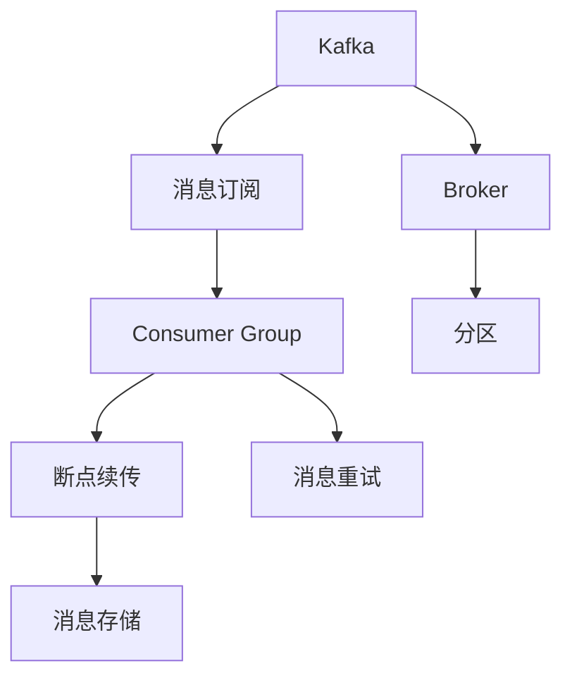
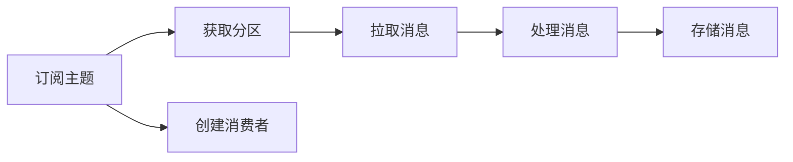
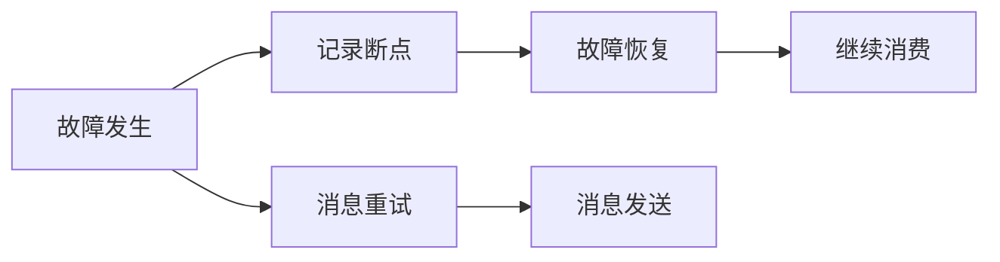
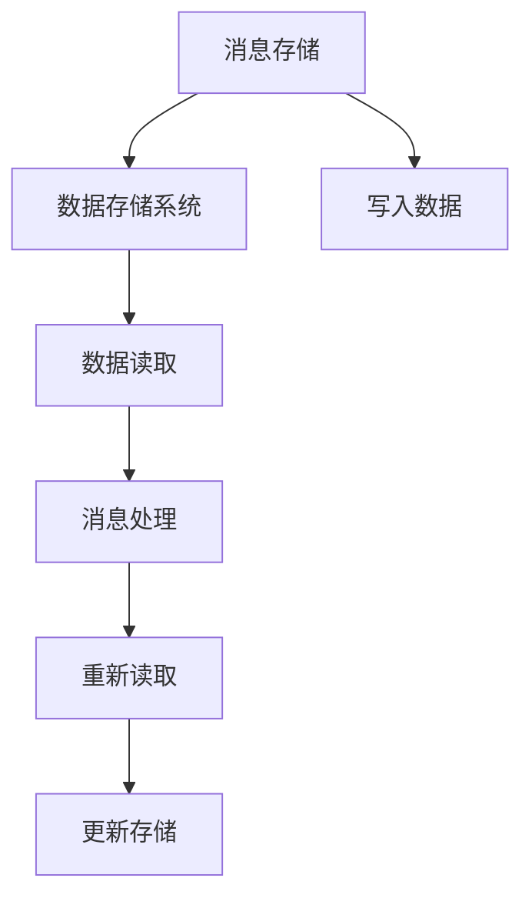
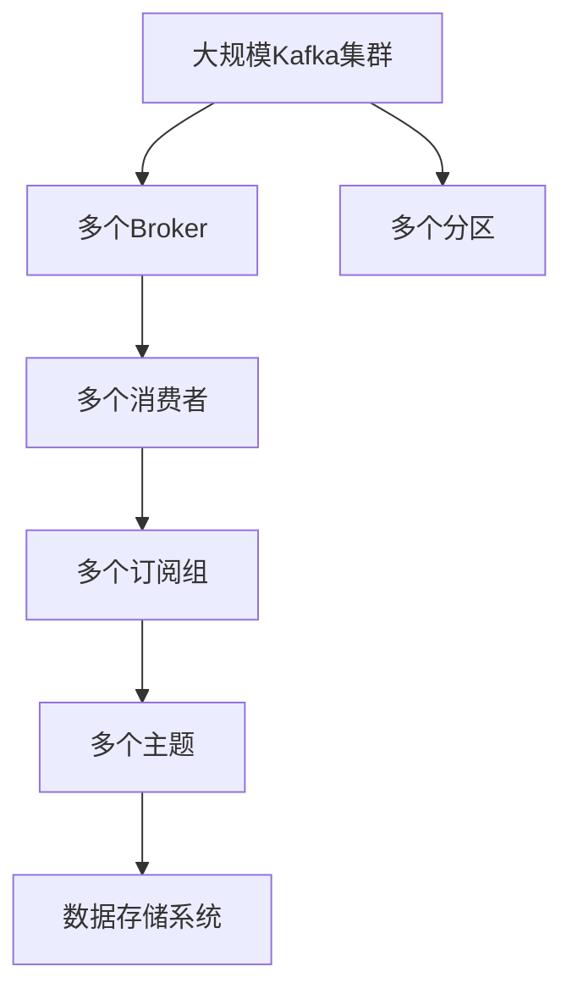

                 

# Kafka Consumer原理与代码实例讲解

> 关键词：Kafka,消息队列,消费者,消息订阅,容错机制,高效处理,代码实例

## 1. 背景介绍

### 1.1 问题由来
在分布式系统中，消息队列作为一种常见的通信机制，发挥着重要的作用。它提供了解耦的消息处理和异步通信能力，使系统组件之间的交互更加灵活高效。Apache Kafka作为一款高性能、分布式的消息队列系统，被广泛应用于大数据流处理、实时数据采集、事件驱动架构等多个领域。在实际应用中，对Kafka消费者的高效、可靠、可扩展性有较高要求，因此了解和掌握Kafka消费者的原理与实现显得尤为重要。

### 1.2 问题核心关键点
Kafka消费者主要负责从Kafka主题中订阅消息，并将消息进行处理或存储。其核心任务包括：
- 订阅主题：确定要订阅的消息主题。
- 拉取消息：从主题中拉取消息，并进行读取和处理。
- 故障恢复：在消费过程中，需要处理断点续传、消息重试等容错机制。
- 数据存储：将处理后的消息存储在数据存储系统，如数据库、文件系统等。

这些核心任务共同构成了Kafka消费者的功能架构，确保了系统的稳定性和可靠性。

### 1.3 问题研究意义
Kafka消费者的实现原理和关键技术对于构建高效、可靠的消息处理系统具有重要意义：
1. 理解消费者的工作原理和实现细节，有助于优化系统架构，提升系统性能。
2. 掌握消费者的故障恢复和容错机制，确保系统在发生故障时能快速恢复，保持服务可用性。
3. 学习消费者与生产者、数据存储系统的协同工作方式，为设计复杂的数据处理流程提供参考。
4. 了解消费者的优化技巧和最佳实践，能够帮助开发人员在实际应用中更好地利用Kafka，降低系统开发和维护成本。

## 2. 核心概念与联系

### 2.1 核心概念概述

为更好地理解Kafka消费者的实现原理，本节将介绍几个密切相关的核心概念：

- Kafka：Apache Kafka是一款开源的分布式流处理平台，提供高吞吐量、高可靠性、可扩展的消息发布和订阅系统。Kafka集群由多个Broker、生产者和消费者组成，每个Broker管理多个分区（Partition），每个分区包含有序的消息记录。
- Kafka消费者：从Kafka主题中订阅消息的组件，负责消息的读取、处理和存储。
- 消息订阅：消费者通过定义订阅组（Consumer Group），选择要订阅的消息主题。
- 断点续传：在消费者处理消息时，如果出现故障或宕机，Kafka会记录消费者的处理位置，故障恢复后继续从上次断点继续消费。
- 消息重试：在消费者处理消息时，可能会出现消息处理失败的情况，Kafka会将失败的消息重新发送给消费者，保证消息的可靠传输。
- 消息存储：消费者处理消息后，通常会将消息存储在数据存储系统，如数据库、文件系统等，供后续分析或使用。

这些核心概念之间的逻辑关系可以通过以下Mermaid流程图来展示：



这个流程图展示了Kafka消费者从订阅消息到最终存储的过程，以及其中的关键技术实现。

### 2.2 概念间的关系

这些核心概念之间存在着紧密的联系，形成了Kafka消费者的完整功能架构。下面通过几个Mermaid流程图来展示这些概念之间的关系。

#### 2.2.1 Kafka消费者的工作流程



这个流程图展示了Kafka消费者的核心工作流程，从订阅主题到获取分区，再到拉取消息、处理消息和存储消息，形成一个完整的消息处理流程。

#### 2.2.2 断点续传和消息重试



这个流程图展示了断点续传和消息重试的流程。当消费者出现故障时，记录当前处理的位置作为断点；当故障恢复后，继续从上次断点开始消费。同时，对于处理失败的消息，会进行重试发送，确保消息可靠传输。

#### 2.2.3 消息存储与故障恢复



这个流程图展示了消息存储的过程，以及故障恢复时的数据读取和更新。

### 2.3 核心概念的整体架构

最后，我们用一个综合的流程图来展示这些核心概念在大规模Kafka消费者系统中的整体架构：



这个综合流程图展示了Kafka集群中的多个Broker和分区，以及多个消费者和订阅组的关系，以及最终的数据存储系统。

## 3. 核心算法原理 & 具体操作步骤
### 3.1 算法原理概述

Kafka消费者的实现原理主要基于Kafka的分区和消息订阅机制，其核心算法包括：

- 分区与订阅：消费者通过指定订阅组（Consumer Group），订阅一个或多个Kafka主题。
- 消息拉取：消费者定期从其订阅的主题中拉取消息。
- 断点续传：消费者记录已处理消息的位置，当出现故障时，Kafka将从上次处理位置继续拉取消息。
- 消息重试：Kafka将处理失败的消息重新发送给消费者，确保消息可靠传输。

### 3.2 算法步骤详解

以下是Kafka消费者实现原理的详细步骤：

1. **订阅主题与获取分区**：
   - 消费者定义一个或多个订阅组（Consumer Group），订阅一个或多个Kafka主题。
   - Kafka集群根据主题的分区数，为每个订阅组分配对应的分区。

2. **拉取消息**：
   - 消费者从其订阅的分区中，周期性拉取消息。
   - 拉取消息时，消费者可以指定拉取消息的位置，如指定某个特定的偏移量。

3. **处理消息**：
   - 消费者对拉取到的消息进行解析和处理，如将消息转换为键值对或对象。
   - 在处理过程中，消费者需要记录已处理消息的位置，以便断点续传和故障恢复。

4. **存储消息**：
   - 消费者将处理后的消息存储在数据存储系统，如数据库、文件系统等。
   - 存储时，消费者可以选择不同的方法，如批量存储、实时写入等。

5. **断点续传与消息重试**：
   - 当消费者处理消息时，如果出现故障或宕机，Kafka会记录消费者的处理位置，故障恢复后继续从上次断点继续消费。
   - 对于处理失败的消息，Kafka会将失败的消息重新发送给消费者，直到成功处理。

### 3.3 算法优缺点

Kafka消费者具有以下优点：

- 高性能：通过异步消息拉取和批量处理，Kafka消费者能够实现高吞吐量、低延迟的消息处理。
- 可扩展性：消费者可以根据需要，通过添加或减少订阅组，动态扩展处理能力。
- 可靠性：通过断点续传和消息重试机制，确保消息可靠传输和处理。

但同时也存在一些缺点：

- 资源消耗高：大规模的消费者集群需要大量的计算资源和存储空间。
- 管理复杂：需要配置和管理多个Broker和分区，系统运维难度较大。
- 数据延迟：由于消息的异步拉取和处理，存在一定的数据延迟。

### 3.4 算法应用领域

Kafka消费者广泛应用于大数据流处理、实时数据采集、事件驱动架构等多个领域：

- 大数据流处理：通过订阅Kafka主题，实时处理海量数据，提供高效的流式处理能力。
- 实时数据采集：从多个数据源中订阅消息，实现数据的集中采集和处理。
- 事件驱动架构：通过Kafka作为消息中间件，实现分布式系统中的事件驱动和消息传递。

## 4. 数学模型和公式 & 详细讲解 & 举例说明

### 4.1 数学模型构建

Kafka消费者在处理消息时，需要记录已处理消息的位置。设消费者处理的消息为 $m$，其位置为 $p$，则消费者在处理 $m$ 时的位置可以表示为 $(p, m)$。消费者在每次处理消息时，记录当前位置，形成处理位置记录表 $L$，其中每个记录表示为 $(p, m)$。

在故障恢复时，Kafka根据记录表 $L$，确定消费者的断点续传位置，继续从上次处理位置开始消费。

### 4.2 公式推导过程

在处理消息时，消费者记录已处理消息的位置，即 $(p, m)$。在故障恢复时，Kafka根据记录表 $L$，确定消费者的断点续传位置，继续从上次处理位置开始消费。具体推导如下：

设消费者在处理消息 $m$ 时的位置为 $(p, m)$，则在故障恢复时，Kafka会从位置 $(p, m)$ 开始继续消费。因此，Kafka的故障恢复位置可以表示为：

$$
(p, m) = \min_{(p', m') \in L} (p', m')
$$

其中，$p'$ 和 $m'$ 分别为记录表 $L$ 中的位置和消息，$\min$ 表示在记录表 $L$ 中，找到最小位置 $(p', m')$，即最近一次处理的位置。

### 4.3 案例分析与讲解

假设消费者在处理消息 $m_1$ 和 $m_2$ 时的位置分别为 $(p_1, m_1)$ 和 $(p_2, m_2)$，即 $(p_1, m_1)$ 在 $(p_2, m_2)$ 之前。当消费者处理完 $m_2$ 后，记录了当前位置 $(p_2, m_2)$，即记录表 $L$ 中增加了记录 $(p_2, m_2)$。

当消费者故障恢复时，Kafka会从最近一次处理的位置 $(p_2, m_2)$ 开始继续消费。因此，Kafka的故障恢复位置为 $(p_2, m_2)$。

## 5. 项目实践：代码实例和详细解释说明
### 5.1 开发环境搭建

在进行Kafka消费者实践前，我们需要准备好开发环境。以下是使用Python进行Kafka开发的开发环境配置流程：

1. 安装Anaconda：从官网下载并安装Anaconda，用于创建独立的Python环境。

2. 创建并激活虚拟环境：
```bash
conda create -n kafka-env python=3.8 
conda activate kafka-env
```

3. 安装Kafka相关库：
```bash
pip install confluent-kafka pykafka
```

4. 安装各类工具包：
```bash
pip install numpy pandas scikit-learn matplotlib tqdm jupyter notebook ipython
```

完成上述步骤后，即可在`kafka-env`环境中开始Kafka消费者实践。

### 5.2 源代码详细实现

这里我们以一个简单的Kafka消费者为例，实现从Kafka主题中订阅消息并打印输出的功能。

首先，定义消费者处理函数：

```python
from kafka import KafkaConsumer

def consume_messages():
    consumer = KafkaConsumer('my_topic', bootstrap_servers=['localhost:9092'], group_id='my_group')
    for message in consumer:
        print(f'{message.topic}: {message.value}')
```

然后，启动消费者程序：

```python
if __name__ == '__main__':
    consume_messages()
```

### 5.3 代码解读与分析

让我们再详细解读一下关键代码的实现细节：

**KafkaConsumer类**：
- `my_topic`：要订阅的主题名称。
- `bootstrap_servers`：Kafka集群地址。
- `group_id`：消费者组名，用于记录已处理消息的位置，实现断点续传。

**consume_messages函数**：
- 创建KafkaConsumer对象，指定要订阅的主题、Kafka集群地址和消费者组名。
- 遍历消息，打印消息的主题和值。

**启动消费者程序**：
- 判断是否为模块导入，如果是则启动`consume_messages`函数。

可以看到，使用KafkaConsumer类创建消费者对象，并通过`for`循环遍历拉取到的消息，实现对消息的处理和输出。KafkaConsumer类封装了Kafka客户端的API，简化了Kafka消费者的实现。

### 5.4 运行结果展示

假设我们在一个包含单主题的Kafka集群上启动消费者程序，结果如下：

```
my_topic: b'hello world'
```

可以看到，程序成功地从Kafka主题中订阅了消息，并输出了消息的值。

## 6. 实际应用场景
### 6.1 智能推荐系统

在智能推荐系统中，Kafka消费者可以实时订阅用户行为数据，如浏览记录、点击记录等。通过将用户行为数据进行聚合、分析和建模，可以实时生成推荐结果，并向用户推送。这种实时数据驱动的推荐方式，能够更好地把握用户兴趣，提升推荐系统的精准度和用户体验。

### 6.2 日志收集与分析

在日志系统中，Kafka消费者可以订阅应用程序生成的日志信息，如系统日志、应用日志等。通过实时监控和分析日志信息，可以及时发现和处理系统异常，保证系统稳定运行。

### 6.3 数据采集与清洗

在数据采集系统中，Kafka消费者可以订阅各种来源的数据，如网络数据、传感器数据等。通过实时采集和清洗数据，可以减少数据丢失和重复，保证数据的质量和完整性。

### 6.4 未来应用展望

随着Kafka消费者的不断优化和创新，其应用场景将更加广泛和深入。未来，Kafka消费者可能会在以下几个方向得到进一步发展：

- 实时流计算：与流计算引擎（如Apache Flink、Apache Spark等）结合，实现实时数据处理和分析。
- 跨平台集成：与云平台、大数据平台等进行无缝集成，提供一站式数据处理解决方案。
- 数据治理：通过元数据管理和数据质量监控，提升数据治理能力。
- 微服务架构：与微服务架构结合，实现高效的消息传递和异步通信。

总之，Kafka消费者作为Kafka系统的重要组成部分，其高效、可靠、可扩展的特性，使其在分布式系统中具有广泛的应用前景。未来，伴随Kafka消费者的不断进化，其在数据处理和系统架构中的应用将更加深入和多样。

## 7. 工具和资源推荐
### 7.1 学习资源推荐

为了帮助开发者系统掌握Kafka消费者的理论基础和实践技巧，这里推荐一些优质的学习资源：

1. Apache Kafka官方文档：Kafka官方提供的详细文档，涵盖了Kafka的各个组件、API和最佳实践，是学习Kafka不可或缺的资源。

2. Kubernetes官方文档：Kafka在Kubernetes中也有广泛的部署和应用，Kubernetes官方文档提供了丰富的Kafka部署和运维指南。

3. Kafka架构设计指南：深入了解Kafka架构的设计理念和关键技术，有助于理解Kafka消费者的实现细节。

4. 《Kafka: The Definitive Guide》书籍：Kafka领域的经典书籍，系统介绍了Kafka的各个组件、API和最佳实践，适合深入学习。

5. Confluent Academy在线课程：Confluent提供的Kafka学习课程，包括Kafka基础、流处理、数据治理等多个方面，适合系统学习。

通过这些资源的学习实践，相信你一定能够快速掌握Kafka消费者的原理和实现，并用于解决实际的系统问题。

### 7.2 开发工具推荐

高效的开发离不开优秀的工具支持。以下是几款用于Kafka消费者开发的常用工具：

1. Apache Kafka：Kafka官方提供的分布式消息系统，是Kafka消费者的核心组件。

2. confluent-kafka-python：Python客户端库，提供了与Kafka集群交互的API，方便消费者开发。

3. pykafka：Python客户端库，提供了Kafka消费者的基本API，支持断点续传和消息重试等机制。

4. Kafka Manager：可视化管理工具，方便监控和管理Kafka集群，提供实时性能监控和告警功能。

5. Logstash：日志处理工具，支持将Kafka消息进行实时采集和处理。

合理利用这些工具，可以显著提升Kafka消费者的开发效率，加快创新迭代的步伐。

### 7.3 相关论文推荐

Kafka消费者的实现原理和关键技术对于构建高效、可靠的消息处理系统具有重要意义。以下是几篇奠基性的相关论文，推荐阅读：

1. "A Fault-Tolerant Message System"：这篇论文介绍了Kafka的设计理念和关键技术，是Kafka技术的重要基石。

2. "The Design and Implementation of Kafka"：这篇论文详细介绍了Kafka的架构设计和实现细节，有助于深入理解Kafka消费者的工作原理。

3. "A New Topic Subscription Model for Kafka"：这篇论文介绍了Kafka的新主题订阅模型，有助于理解消费者如何订阅和拉取消息。

4. "Kafka Streams: Apache Kafka Stream Processing Library"：这篇论文介绍了Kafka Streams的架构和实现，有助于理解Kafka消费者与流计算引擎的集成方式。

这些论文代表了大数据流处理和消息队列技术的进展，通过学习这些前沿成果，可以帮助研究者把握学科前进方向，激发更多的创新灵感。

除上述资源外，还有一些值得关注的前沿资源，帮助开发者紧跟Kafka消费者的最新进展，例如：

1. arXiv论文预印本：人工智能领域最新研究成果的发布平台，包括大量尚未发表的前沿工作，学习前沿技术的必读资源。

2. 业界技术博客：如Apache Kafka、Confluent、Kafka Tools等顶尖实验室的官方博客，第一时间分享他们的最新研究成果和洞见。

3. 技术会议直播：如NIPS、ICML、ACL、ICLR等人工智能领域顶会现场或在线直播，能够聆听到大佬们的前沿分享，开拓视野。

4. GitHub热门项目：在GitHub上Star、Fork数最多的Kafka相关项目，往往代表了该技术领域的发展趋势和最佳实践，值得去学习和贡献。

5. 行业分析报告：各大咨询公司如McKinsey、PwC等针对大数据流处理领域的分析报告，有助于从商业视角审视技术趋势，把握应用价值。

总之，对于Kafka消费者的学习与实践，需要开发者保持开放的心态和持续学习的意愿。多关注前沿资讯，多动手实践，多思考总结，必将收获满满的成长收益。

## 8. 总结：未来发展趋势与挑战
### 8.1 总结

本文对Kafka消费者的实现原理和关键技术进行了全面系统的介绍。首先阐述了Kafka消费者的工作流程和关键算法，明确了消费者在订阅主题、拉取消息、断点续传、消息重试等方面的实现细节。其次，从原理到实践，详细讲解了Kafka消费者的数学模型和公式推导，给出了消费者实现的关键代码实例。同时，本文还探讨了Kafka消费者在智能推荐系统、日志收集与分析、数据采集与清洗等多个领域的应用场景，展示了消费者在分布式系统中的强大能力。

通过本文的系统梳理，可以看到，Kafka消费者作为Kafka系统的重要组成部分，其高效、可靠、可扩展的特性，使其在分布式系统中具有广泛的应用前景。未来，伴随Kafka消费者的不断优化和创新，其在数据处理和系统架构中的应用将更加深入和多样。

### 8.2 未来发展趋势

展望未来，Kafka消费者的发展趋势将呈现以下几个方向：

1. 更高的性能和可扩展性：随着分布式系统规模的扩大，对Kafka消费者的性能和可扩展性提出了更高的要求。未来的消费者需要具备更高的吞吐量和更低的延迟，同时能够动态扩展处理能力。

2. 更强的故障恢复和容错能力：在大型系统中，Kafka消费者需要具备更强的故障恢复和容错能力，确保在单点故障、网络波动等情况下仍能正常运行。

3. 更灵活的消息处理方式：未来的消费者需要支持更加灵活的消息处理方式，如事件驱动、流计算等，提升系统的灵活性和可复用性。

4. 更高效的资源利用：随着数据量的增大，消费者需要更高效地利用计算资源和存储资源，提升系统的资源利用率。

5. 更完善的生态系统：伴随Kafka消费者的不断发展，其生态系统也将不断壮大，更多的高效组件和工具将为消费者提供更全面的支持。

以上趋势凸显了Kafka消费者技术的广阔前景。这些方向的探索发展，必将进一步提升Kafka消费者的性能和可靠性，为构建高效、可靠的消息处理系统铺平道路。

### 8.3 面临的挑战

尽管Kafka消费者技术已经取得了显著进展，但在迈向更加智能化、普适化应用的过程中，仍面临诸多挑战：

1. 高资源消耗：大规模的Kafka消费者集群需要大量的计算资源和存储空间，系统运维成本较高。

2. 数据延迟：由于消息的异步拉取和处理，存在一定的数据延迟，影响系统的实时性。

3. 故障恢复和容错机制的复杂性：在复杂的系统中，故障恢复和容错机制的实现较为复杂，需要全面考虑各种异常情况。

4. 数据一致性问题：在多副本消费模式下，如何保证数据一致性，避免数据丢失和重复，是一个重要挑战。

5. 多层次的优化：在多层次优化中，如何兼顾性能、可扩展性和易用性，需要综合考虑系统架构、算法实现和工具选择等因素。

6. 数据安全与隐私：在处理敏感数据时，如何保障数据安全与隐私，防止数据泄露和滥用，是一个重要挑战。

这些挑战需要在未来的技术演进中不断探索和解决，才能确保Kafka消费者技术的持续发展和应用落地。

### 8.4 研究展望

面对Kafka消费者所面临的挑战，未来的研究需要在以下几个方面寻求新的突破：

1. 高效率的消息拉取：开发更高效的消息拉取算法，减少数据延迟和系统延迟，提升系统的实时性和可扩展性。

2. 多副本消费模式：研究多副本消费模式下的数据一致性问题，确保数据可靠传输和存储。

3. 分布式协调机制：设计更灵活的分布式协调机制，提升系统的可扩展性和容错能力。

4. 数据安全与隐私保护：研究数据安全与隐私保护技术，确保数据在处理和存储过程中不被泄露和滥用。

5. 智能化的故障恢复：引入智能化的故障恢复机制，根据系统状态动态调整处理策略，提高系统鲁棒性。

6. 全栈优化：综合考虑系统架构、算法实现和工具选择，实现全栈优化，提升系统性能和可靠性。

这些研究方向的探索，必将引领Kafka消费者技术迈向更高的台阶，为构建高效、可靠的消息处理系统提供更全面的技术支持。

## 9. 附录：常见问题与解答

**Q1：如何实现断点续传和消息重试？**

A: 断点续传和消息重试是Kafka消费者的核心功能之一。在处理消息时，消费者需要记录已处理消息的位置，即 $(p, m)$，其中 $p$ 表示位置，$m$ 表示消息。在故障恢复时，Kafka根据记录表 $L$ 中的位置和消息，确定故障恢复位置。具体实现可以使用Kafka的Consumer API，记录处理位置，并在故障恢复时重新拉取消息。

**Q2：如何优化Kafka消费者的性能？**

A: 优化Kafka消费者的性能可以从以下几个方面入手：
1. 增加消费者数量：通过增加消费者数量，提升系统的吞吐量。
2. 使用批量拉取：通过批量拉取消息，减少网络延迟和传输开销。
3. 调整消息大小：适当调整消息大小，降低系统延迟。
4. 优化网络连接：优化网络连接，减少网络延迟和传输开销。
5. 使用压缩和分片：使用消息压缩和分片技术，提高系统的存储效率和吞吐量。

**Q3：Kafka消费者如何保证数据一致性？**

A: Kafka消费者在处理消息时，需要保证数据的一致性。具体实现可以使用以下策略：
1. 单副本消费：确保每个分区只有一个消费者副本，防止数据丢失和重复。
2. 事务处理：使用Kafka的事务处理机制，确保多个消息的原子提交和回滚。
3. 状态管理：通过状态管理机制，记录消费者处理的位置，确保断点续传和故障恢复。

**Q4：Kafka消费者如何处理大规模数据？**

A: 在处理大规模数据时，Kafka消费者可以采用以下策略：
1. 分区：将大规模数据分成多个分区，每个分区由一个消费者处理。
2. 批量处理：使用批量处理技术，减少系统延迟和传输开销。
3. 使用缓存和压缩：使用缓存和压缩技术，提高系统的吞吐量和存储效率。

这些策略可以结合使用，进一步优化Kafka消费者的性能和可靠性，确保其在大规模数据处理中的稳定性和高效性。

**Q5：如何部署和管理Kafka消费者？**

A: 部署和管理Kafka消费者需要考虑以下几个方面：
1. 配置管理：使用Kafka Manager或Confluent Platform等工具，

