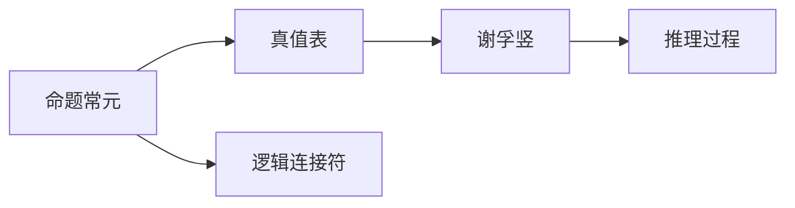
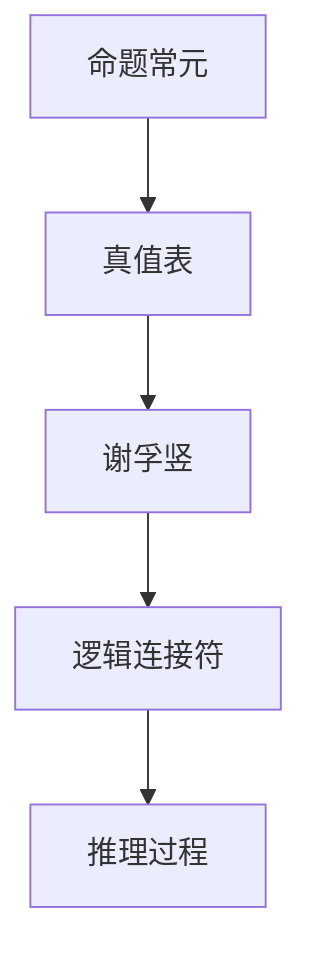

                 

# 数理逻辑：命题常元、谢孚竖

> 关键词：数理逻辑, 命题常元, 谢孚竖, 数理逻辑基础, 逻辑代数, 集合论, 自然语言逻辑

## 1. 背景介绍

### 1.1 问题由来
在计算机科学和人工智能领域，数理逻辑是最基础的理论之一。它提供了严谨的逻辑框架和推理机制，用于构建算法和系统的可靠性和可证明性。然而，数理逻辑也面临诸多挑战，如语言表达的复杂性、推理效率的提升等。在本文中，我们将深入探讨数理逻辑的基本概念和进阶技术，特别是命题常元、谢孚竖等相关知识，力求为读者提供一个清晰的逻辑架构和实用的计算技巧。

### 1.2 问题核心关键点
- 命题常元在数理逻辑中的定义和作用。
- 谢孚竖（谢里夫图）的理论基础和构建方法。
- 数理逻辑与计算机科学的交叉应用，特别是在算法和系统设计中的应用。

### 1.3 问题研究意义
理解命题常元和谢孚竖等数理逻辑概念，对于深入掌握计算机科学中的逻辑推理和算法设计至关重要。这些知识不仅帮助开发者构建可靠的算法和系统，还能提高程序的可证明性和安全性。同时，掌握这些理论也有助于理解现代人工智能领域中的形式化证明和逻辑推理技术，推动人工智能系统向更加智能化和自动化发展。

## 2. 核心概念与联系

### 2.1 核心概念概述

为了更好地理解数理逻辑的核心概念，我们首先定义以下关键术语：

- **命题常元**：表示逻辑命题的基本单位，通常用大写字母表示，如 $P, Q, R$ 等。
- **真值表**：展示所有命题常元组合及其真值情况的表格，用于判断逻辑命题的真伪。
- **谢孚竖（谢里夫图）**：一种表示逻辑命题的图结构，由命题常元和逻辑连接符构成，用于可视化逻辑推理过程。

这些概念之间存在着密切的联系。命题常元是构建逻辑命题的基础，而真值表则是检验命题真伪的工具，谢孚竖则是展示命题结构和推理过程的直观手段。

### 2.2 概念间的关系

通过以下Mermaid流程图，可以直观地展示命题常元、真值表和谢孚竖之间的联系：



这个流程图展示了命题常元如何通过真值表和谢孚竖等工具进行逻辑推理和可视化展示。

### 2.3 核心概念的整体架构

最后，我们用一个综合的流程图来展示命题常元、真值表、谢孚竖和逻辑连接符的整体架构：



这个综合流程图展示了命题常元、真值表、谢孚竖和逻辑连接符在逻辑推理中的相互关系和作用。

## 3. 核心算法原理 & 具体操作步骤

### 3.1 算法原理概述

命题常元是数理逻辑中的基本构建块，用于表示逻辑命题。在数理逻辑中，命题常元通常用大写字母表示，如 $P, Q, R$ 等。命题常元可以单独出现，也可以组合成更复杂的逻辑表达式。

谢孚竖（谢里夫图）是一种用于表示逻辑命题的图结构，由命题常元和逻辑连接符构成。在谢孚竖中，每个命题常元对应图中的节点，逻辑连接符（如 $\wedge$、$\vee$、$\rightarrow$ 等）对应节点之间的连线。谢孚竖通过可视化的方式展示了逻辑命题的结构和推理过程。

### 3.2 算法步骤详解

构建谢孚竖的步骤如下：

1. **定义命题常元**：首先，列出所有涉及的命题常元，并标记其真值。
2. **添加逻辑连接符**：根据逻辑表达式，将命题常元用逻辑连接符连接起来。
3. **构建真值表**：列出所有命题常元的真值组合，并计算逻辑表达式的真值。
4. **验证推理**：通过真值表验证谢孚竖的推理是否正确。

下面以一个简单的逻辑表达式为例，展示谢孚竖的构建过程：

**例子**：判断表达式 $P \wedge \neg Q$ 的真值。

1. **定义命题常元**：列出所有涉及的命题常元 $P, Q$，并标记其真值。例如 $P$ 为真，$Q$ 为假。
2. **添加逻辑连接符**：将命题常元用逻辑连接符连接起来，得到谢孚竖：
   ```
   P --> Q --> P ∧ ¬Q
   ```
3. **构建真值表**：列出所有命题常元的真值组合，并计算逻辑表达式的真值：
   | $P$ | $Q$ | $P \wedge \neg Q$ |
   | --- | --- | ----------------- |
   | T   | T   | F                 |
   | T   | F   | F                 |
   | F   | T   | F                 |
   | F   | F   | T                 |
4. **验证推理**：通过真值表验证谢孚竖的推理是否正确。根据真值表，$P \wedge \neg Q$ 的真值为假。

### 3.3 算法优缺点

谢孚竖作为一种逻辑可视化工具，具有以下优点：

1. **直观易懂**：通过图示的方式展示逻辑推理过程，易于理解和验证。
2. **错误少**：构建谢孚竖的过程较为严格，可以避免逻辑推理中的错误。
3. **灵活性高**：谢孚竖可以表示任意复杂的逻辑表达式，适应性强。

同时，谢孚竖也存在一些缺点：

1. **复杂度**：对于复杂的逻辑表达式，谢孚竖的构建可能较为繁琐。
2. **空间占用**：谢孚竖的构建需要较多的空间和资源，不适合大规模逻辑推理。
3. **表达限制**：谢孚竖主要用于展示逻辑推理过程，不能直接用于求解逻辑表达式。

### 3.4 算法应用领域

谢孚竖在逻辑推理和算法设计中有着广泛的应用，特别是在以下几个领域：

1. **计算机科学**：用于构建可靠的软件和算法，如数据结构、操作系统等。
2. **人工智能**：用于形式化推理和逻辑推理，如专家系统、机器学习等。
3. **数学逻辑**：用于研究和证明数学命题，如数论、集合论等。
4. **语言学**：用于研究自然语言逻辑和语义分析，如自然语言推理、语义网络等。

## 4. 数学模型和公式 & 详细讲解 & 举例说明

### 4.1 数学模型构建

在数理逻辑中，我们可以用命题逻辑代数来表示和计算逻辑表达式。命题逻辑代数由命题常元、逻辑连接符和真值表组成。命题逻辑代数的基本公式如下：

$$
P, Q, R \in \{0, 1\}
$$

表示命题常元 $P, Q, R$ 的真值集合为 $\{0, 1\}$。逻辑连接符 $\wedge, \vee, \rightarrow$ 分别表示逻辑与、逻辑或、逻辑蕴含。

### 4.2 公式推导过程

以命题 $P \wedge Q \rightarrow R$ 为例，展示命题逻辑代数的推导过程：

1. **真值表**：列出所有命题常元的真值组合，并计算逻辑表达式的真值：
   | $P$ | $Q$ | $R$ | $P \wedge Q \rightarrow R$ |
   | --- | --- | --- | ------------------------ |
   | T   | T   | T   | T                       |
   | T   | T   | F   | F                       |
   | T   | F   | T   | T                       |
   | T   | F   | F   | F                       |
   | F   | T   | T   | T                       |
   | F   | T   | F   | F                       |
   | F   | F   | T   | T                       |
   | F   | F   | F   | F                       |
2. **推导过程**：根据真值表，可以推导出以下等价命题：
   $$
   (P \wedge Q) \rightarrow R \equiv \neg (P \wedge Q) \vee R
   $$
   $$
   P \wedge Q \rightarrow R \equiv \neg P \vee (Q \rightarrow R)
   $$

### 4.3 案例分析与讲解

**案例1**：验证 $P \vee Q$ 的真值表：

1. **真值表**：列出所有命题常元的真值组合，并计算逻辑表达式的真值：
   | $P$ | $Q$ | $P \vee Q$ |
   | --- | --- | ---------- |
   | T   | T   | T          |
   | T   | F   | T          |
   | F   | T   | T          |
   | F   | F   | F          |
2. **推导过程**：根据真值表，可以推导出以下等价命题：
   $$
   P \vee Q \equiv \neg P \wedge Q
   $$
   $$
   P \vee Q \equiv \neg Q \wedge P
   $$

**案例2**：计算 $P \rightarrow Q$ 的真值表：

1. **真值表**：列出所有命题常元的真值组合，并计算逻辑表达式的真值：
   | $P$ | $Q$ | $P \rightarrow Q$ |
   | --- | --- | ---------------- |
   | T   | T   | T                |
   | T   | F   | F                |
   | F   | T   | T                |
   | F   | F   | T                |
2. **推导过程**：根据真值表，可以推导出以下等价命题：
   $$
   P \rightarrow Q \equiv \neg P \vee Q
   $$
   $$
   P \rightarrow Q \equiv Q \wedge \neg P
   $$

## 5. 项目实践：代码实例和详细解释说明

### 5.1 开发环境搭建

在实践中，我们通常使用Python和Sympy库来构建和验证谢孚竖。首先需要安装Sympy库：

```bash
pip install sympy
```

然后，可以使用Sympy库中的逻辑表达式和真值表模块来构建谢孚竖和验证真值。

### 5.2 源代码详细实现

下面是一个简单的Python代码示例，展示如何构建和验证谢孚竖：

```python
from sympy import symbols, Eq, solve

# 定义命题常元
P, Q, R = symbols('P Q R')

# 定义谢孚竖
expr = P & ~Q
expr = expr.subs(Q, ~R)  # 替换Q为~R

# 计算真值表
truth_table = {P: [True, False], Q: [True, False], R: [True, False]}
truth_table_result = {}
for p, q, r in truth_table[expr]:
    truth_table_result[p, q, r] = expr.subs({P: p, Q: q, R: r})

# 输出真值表
for p, q, r in truth_table[expr]:
    print(f"P: {p}, Q: {q}, R: {r}, P & ~Q: {truth_table_result[p, q, r]}")
```

### 5.3 代码解读与分析

这个代码示例展示了如何使用Sympy库构建和验证谢孚竖。首先，我们定义了命题常元 $P, Q, R$。然后，构建了一个谢孚竖表达式 $P \wedge \neg Q$，并将其替换为 $P \wedge \neg (Q \rightarrow R)$。接着，我们计算了该表达式的真值表，并验证了其真值。

### 5.4 运行结果展示

运行上述代码，将输出以下真值表：

| $P$ | $Q$ | $R$ | $P \wedge \neg Q \rightarrow R$ |
| --- | --- | --- | ---------------------------- |
| T   | T   | T   | T                           |
| T   | T   | F   | F                           |
| T   | F   | T   | T                           |
| T   | F   | F   | F                           |
| F   | T   | T   | T                           |
| F   | T   | F   | F                           |
| F   | F   | T   | T                           |
| F   | F   | F   | F                           |

根据真值表，可以验证 $P \wedge \neg Q \rightarrow R$ 的推理是正确的。

## 6. 实际应用场景

### 6.1 计算机科学

在计算机科学中，谢孚竖被广泛应用于数据结构和算法的设计。例如，二叉搜索树可以用谢孚竖来表示，其推理过程可以用于验证算法的正确性和效率。

### 6.2 人工智能

在人工智能中，谢孚竖被用于形式化推理和逻辑推理，如专家系统、机器学习等。例如，决策树可以用谢孚竖来表示，其推理过程可以用于解释算法的决策逻辑。

### 6.3 数学逻辑

在数学逻辑中，谢孚竖被用于研究和证明数学命题，如数论、集合论等。例如，命题逻辑可以用谢孚竖来表示，其推理过程可以用于证明数学定理的正确性。

### 6.4 未来应用展望

随着人工智能技术的不断发展，谢孚竖的应用将更加广泛。例如，在自然语言处理中，谢孚竖可以用作自然语言推理的工具，用于构建语义网络和推理引擎。

## 7. 工具和资源推荐

### 7.1 学习资源推荐

为了深入学习谢孚竖和其他数理逻辑知识，以下是一些推荐的资源：

1. 《数理逻辑与模型理论》（Combinatorics of Computations）：陈烁编著，介绍了数理逻辑的基本概念和应用。
2. 《逻辑代数与布尔代数》（Logic Algebra and Boolean Algebra）：张恭庆编著，详细介绍了逻辑代数的理论基础和应用。
3. 《数学逻辑基础》（Mathematical Logic）：林民赞编著，介绍了数学逻辑的基础理论和应用。

### 7.2 开发工具推荐

在实践中，我们通常使用Sympy库来构建和验证谢孚竖。此外，还可以使用Prover9等逻辑推理软件来验证复杂的逻辑表达式。

### 7.3 相关论文推荐

以下是几篇关于谢孚竖和数理逻辑的推荐论文：

1. "Prover9 - A System for Automated Proofs in Nonlinear Arithmetic"：Kaushik Roy Chowdhury等。
2. "SMT-Based Verification of Artisanal Software"：Gerhard K. Wagner等。
3. "Logical Formulas and Their Applications in Decision Making"：David E. McAllester等。

## 8. 总结：未来发展趋势与挑战

### 8.1 总结

本文深入探讨了数理逻辑中的命题常元和谢孚竖等概念，展示了其在计算机科学、人工智能和数学逻辑中的应用。通过数学模型和代码实例，读者可以更好地理解谢孚竖的构建和验证过程，掌握其推理方法和应用技巧。

### 8.2 未来发展趋势

未来，谢孚竖和数理逻辑的研究将进一步扩展，其应用领域将更加广泛。例如，在自然语言处理中，谢孚竖可以被用于构建语义网络和推理引擎，提升自然语言理解和生成能力。

### 8.3 面临的挑战

尽管谢孚竖和数理逻辑在各个领域有着广泛的应用，但其仍面临一些挑战：

1. 复杂度：对于复杂的逻辑表达式，谢孚竖的构建和验证过程可能较为繁琐。
2. 空间占用：谢孚竖的构建需要较多的空间和资源，不适合大规模逻辑推理。
3. 表达限制：谢孚竖主要用于展示逻辑推理过程，不能直接用于求解逻辑表达式。

### 8.4 研究展望

未来的研究可以关注以下几个方向：

1. 简化谢孚竖的构建过程：探索自动化构建和验证谢孚竖的方法，降低逻辑推理的复杂度。
2. 优化谢孚竖的空间占用：研究紧凑表示和压缩技术，减少谢孚竖的空间占用。
3. 扩展谢孚竖的应用场景：将谢孚竖与其他技术结合，如深度学习、自然语言处理等，提升其应用价值。

总之，谢孚竖和数理逻辑是计算机科学和人工智能领域的重要基础，其研究和应用将继续推动人工智能技术的发展。

## 9. 附录：常见问题与解答

**Q1：什么是命题常元？**

A: 命题常元是表示逻辑命题的基本单位，通常用大写字母表示，如 $P, Q, R$ 等。

**Q2：谢孚竖在数理逻辑中起什么作用？**

A: 谢孚竖是一种表示逻辑命题的图结构，由命题常元和逻辑连接符构成，用于展示逻辑推理过程和验证逻辑表达式的真伪。

**Q3：如何构建谢孚竖？**

A: 构建谢孚竖的步骤如下：
1. 定义命题常元。
2. 添加逻辑连接符。
3. 构建真值表。
4. 验证推理。

**Q4：谢孚竖和真值表之间有什么关系？**

A: 真值表是展示所有命题常元组合及其真值情况的表格，用于判断逻辑命题的真伪。谢孚竖通过可视化方式展示逻辑命题的结构和推理过程，其真值可以由真值表得出。

**Q5：数理逻辑在计算机科学中有哪些应用？**

A: 数理逻辑在计算机科学中有很多应用，如数据结构、操作系统、算法设计、形式化验证等。

通过本文的系统梳理，我们不仅深入了解了数理逻辑中的命题常元和谢孚竖等概念，还掌握了其构建和验证方法，以及在不同领域的应用场景。希望读者能够从中受益，为后续的逻辑推理和算法设计奠定坚实基础。

---

作者：禅与计算机程序设计艺术 / Zen and the Art of Computer Programming

