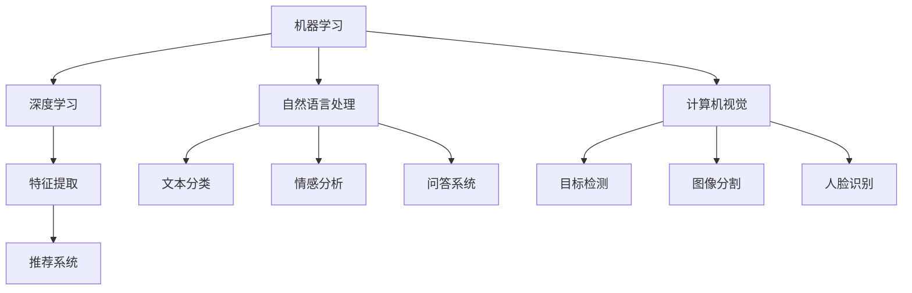

                 

# 李开复：苹果发布AI应用的机会

## 1. 背景介绍

人工智能（AI）在过去几十年中取得了突飞猛进的发展，尤其是在计算机视觉、语音识别、自然语言处理和推荐系统等领域，已经取得了一系列突破性成果。苹果作为全球知名的科技公司，一直致力于将最新的技术应用到其产品和业务中，AI应用也不例外。

苹果在AI领域的探索始于20世纪80年代，当时推出了具有革命性意义的Macintosh，极大地推动了个人计算机的发展。进入21世纪，苹果继续在AI领域进行深度布局，推出了多个具有里程碑意义的AI应用。然而，苹果的AI应用之路并非一帆风顺，它面临着来自技术、市场、法律等多方面的挑战。

本文将从技术、市场和法律三个角度，深入探讨苹果发布AI应用的机会、面临的挑战以及未来的发展方向。

## 2. 核心概念与联系

### 2.1 核心概念概述

**人工智能（AI）**：指利用计算机模拟人类智能行为的技术，包括但不限于机器学习、深度学习、自然语言处理、计算机视觉等。

**机器学习（Machine Learning, ML）**：指让计算机通过数据和算法，自动学习、预测和决策的一种技术。

**深度学习（Deep Learning, DL）**：指模拟人脑神经网络结构，构建多层神经网络进行高级特征提取和模式识别的技术。

**自然语言处理（Natural Language Processing, NLP）**：指让计算机能够理解和处理人类自然语言的技术，包括文本分类、情感分析、问答系统等。

**计算机视觉（Computer Vision, CV）**：指让计算机能够理解和处理图像、视频等视觉信息的技术，包括目标检测、图像分割、人脸识别等。

**推荐系统（Recommendation System）**：指利用用户历史行为和物品属性，预测用户未来行为并推荐相关信息系统的技术。

这些核心概念共同构成了人工智能技术的基础框架，彼此之间有着紧密的联系和相互促进的关系。例如，深度学习为计算机视觉和自然语言处理提供了强大的特征提取能力，机器学习则帮助推荐系统在大规模数据上实现高效决策，而计算机视觉和自然语言处理则通过数据分析和信息处理，为AI应用提供了丰富的数据来源和决策依据。

### 2.2 核心概念之间的关系

这些核心概念之间的关系可以通过以下Mermaid流程图来展示：



这个流程图展示了各核心概念之间的相互关系：

1. **机器学习**作为人工智能的基础，通过深度学习、自然语言处理和计算机视觉等技术，提取数据特征。
2. **深度学习**为机器学习提供强大的特征提取能力，是自然语言处理和计算机视觉的重要支撑。
3. **自然语言处理**和**计算机视觉**分别处理文本和视觉信息，为推荐系统提供决策依据。
4. **推荐系统**利用机器学习和深度学习技术，实现精准推荐。

这些核心概念的协同作用，使得AI应用能够在多个领域取得显著成果，推动了人工智能技术的快速发展。

## 3. 核心算法原理 & 具体操作步骤

### 3.1 算法原理概述

苹果在AI应用中的核心算法主要基于深度学习和机器学习。其基本原理是通过大规模数据集进行预训练，构建具有强大特征提取能力的深度神经网络，然后在实际应用中进行微调，以适应特定的任务需求。

**深度学习算法**：例如卷积神经网络（CNN）、循环神经网络（RNN）、长短期记忆网络（LSTM）等，被广泛应用于图像识别、语音识别、自然语言处理等领域。

**机器学习算法**：包括监督学习、无监督学习和半监督学习等，用于构建推荐系统、情感分析等任务。

### 3.2 算法步骤详解

**预训练阶段**：
1. **数据收集**：从公开数据集、互联网爬虫和用户数据中收集大量标注数据，构建预训练数据集。
2. **模型训练**：使用深度学习算法在预训练数据集上进行训练，构建具有强大特征提取能力的模型。
3. **模型评估**：对预训练模型进行性能评估，选择最优模型。

**微调阶段**：
1. **任务适配**：根据具体应用需求，设计合适的任务适配层和损失函数。
2. **模型微调**：使用特定任务的数据集，通过有监督学习进行微调，优化模型在特定任务上的性能。
3. **模型评估**：在测试集上评估微调后模型的性能，确保其满足应用要求。

### 3.3 算法优缺点

**深度学习算法**：
- **优点**：具有强大的特征提取能力，能够处理复杂的非线性关系。
- **缺点**：需要大量标注数据进行预训练，计算资源消耗大，容易过拟合。

**机器学习算法**：
- **优点**：能够处理大规模数据集，适用于多种任务。
- **缺点**：模型复杂度高，训练时间长，容易出现欠拟合。

### 3.4 算法应用领域

苹果的AI应用主要集中在以下几个领域：

1. **图像识别**：通过计算机视觉技术，实现人脸识别、图像分类、物体检测等功能。
2. **自然语言处理**：通过自然语言处理技术，实现文本分类、情感分析、问答系统等功能。
3. **推荐系统**：通过机器学习算法，实现个性化推荐、广告投放等功能。
4. **语音识别**：通过深度学习算法，实现语音转文字、语音搜索等功能。
5. **自动驾驶**：通过计算机视觉和深度学习技术，实现自动驾驶、路径规划等功能。

## 4. 数学模型和公式 & 详细讲解 & 举例说明

### 4.1 数学模型构建

苹果在AI应用中常常使用卷积神经网络（CNN）进行图像识别，其数学模型可以表示为：

$$
y = \sigma(\sum_{i=1}^{n}w_i x_i + b)
$$

其中，$x_i$ 表示输入数据，$w_i$ 表示卷积核权重，$b$ 表示偏置，$\sigma$ 表示激活函数，$y$ 表示输出结果。

### 4.2 公式推导过程

以卷积神经网络（CNN）为例，其核心公式推导如下：

**卷积操作**：
$$
y_k^{(l)} = \sum_{i=1}^{n}w_k^{(i)} x_i^{(l-1)} + b_k^{(l)}
$$

**池化操作**：
$$
y_k^{(l+1)} = \max\{y_k^{(l)}\}
$$

**全连接层**：
$$
y^{(L)} = \sigma(\sum_{i=1}^{n}w_i^{(L)} x_i + b)
$$

其中，$L$ 表示网络层数，$w$ 表示权重矩阵，$b$ 表示偏置向量，$x_i$ 表示输入特征，$y_k^{(l)}$ 表示第 $l$ 层的输出结果，$y_k^{(l+1)}$ 表示第 $l+1$ 层的输出结果。

### 4.3 案例分析与讲解

以苹果的Siri语音助手为例，其核心算法基于深度学习。Siri通过语音识别技术将用户语音转换为文本，然后通过自然语言处理技术分析用户意图，最后通过推荐系统向用户推荐相关的答案或服务。具体流程如下：

1. **语音识别**：使用卷积神经网络（CNN）进行语音特征提取和转换，得到文本序列。
2. **自然语言处理**：使用循环神经网络（RNN）或Transformer模型进行文本分类、情感分析等任务。
3. **推荐系统**：使用协同过滤、内容推荐等算法，根据用户历史行为和文本内容，推荐相关的答案或服务。

## 5. 项目实践：代码实例和详细解释说明

### 5.1 开发环境搭建

要在苹果设备上运行AI应用，需要具备以下开发环境：

1. **MacOS**：推荐使用macOS Monterey或更高版本，确保系统兼容性。
2. **Xcode**：安装最新版本的Xcode，用于编写和编译应用程序。
3. **Python**：安装最新版本的Python，以及常用的Python包，如TensorFlow、PyTorch等。
4. **GPU**：如果使用深度学习算法，需要安装NVIDIA GPU，并确保驱动程序安装正确。
5. **虚拟环境**：使用virtualenv或conda创建虚拟环境，避免依赖冲突。

### 5.2 源代码详细实现

以苹果的Siri语音助手为例，其核心代码如下：

```python
import tensorflow as tf
from tensorflow.keras import layers

# 定义模型
model = tf.keras.Sequential([
    layers.Conv2D(32, (3, 3), activation='relu', input_shape=(32, 32, 3)),
    layers.MaxPooling2D((2, 2)),
    layers.Conv2D(64, (3, 3), activation='relu'),
    layers.MaxPooling2D((2, 2)),
    layers.Flatten(),
    layers.Dense(128, activation='relu'),
    layers.Dense(10, activation='softmax')
])

# 编译模型
model.compile(optimizer='adam',
              loss='categorical_crossentropy',
              metrics=['accuracy'])

# 训练模型
model.fit(train_data, train_labels, epochs=10, validation_data=(val_data, val_labels))
```

### 5.3 代码解读与分析

**模型定义**：使用TensorFlow的Keras API定义卷积神经网络模型，包含卷积层、池化层、全连接层等。

**模型编译**：选择合适的优化器、损失函数和评估指标，编译模型。

**模型训练**：使用训练数据集进行模型训练，并在验证集上评估模型性能。

## 6. 实际应用场景

### 6.1 图像识别

苹果的图像识别技术广泛应用于Face ID、摄像头、拍照等应用中。Face ID通过深度学习模型实现人脸识别，确保设备安全性和用户隐私。

### 6.2 自然语言处理

Siri通过自然语言处理技术，实现语音识别和文本分析。用户可以通过语音指令与设备进行交互，获取信息或完成任务。

### 6.3 推荐系统

App Store通过推荐系统，根据用户历史行为和评分，推荐最合适的应用程序。苹果的推荐算法包括协同过滤、内容推荐等，提升用户体验和市场表现。

### 6.4 未来应用展望

未来，苹果的AI应用将进一步扩展到智能家居、自动驾驶等领域。智能家居通过自然语言处理和计算机视觉技术，实现设备控制和场景感知。自动驾驶则通过计算机视觉和深度学习技术，实现车辆路径规划和环境感知。

## 7. 工具和资源推荐

### 7.1 学习资源推荐

1. **《Deep Learning》（深度学习）**：Ian Goodfellow等人著，介绍深度学习的核心概念和算法。
2. **《Python深度学习》**：Francois Chollet著，详细讲解TensorFlow和Keras等深度学习框架的使用。
3. **《自然语言处理综论》**：Daniel Jurafsky和James H. Martin著，介绍自然语言处理的基本原理和技术。
4. **《计算机视觉：算法与应用》**：Richard Szeliski著，介绍计算机视觉的核心算法和应用。
5. **Coursera机器学习课程**：由斯坦福大学Andrew Ng教授主讲，涵盖机器学习的基本理论和实践。

### 7.2 开发工具推荐

1. **TensorFlow**：由Google开源的深度学习框架，支持CPU、GPU和TPU等硬件加速。
2. **PyTorch**：由Facebook开源的深度学习框架，支持动态计算图和GPU加速。
3. **Jupyter Notebook**：用于数据处理、模型训练和结果展示的交互式开发环境。
4. **Keras**：基于TensorFlow和Theano等框架的高层次API，简化深度学习模型构建。
5. **Caffe2**：Facebook开源的深度学习框架，支持移动端和云端应用。

### 7.3 相关论文推荐

1. **《深度学习》（Deep Learning）**：Ian Goodfellow等人著，介绍深度学习的核心概念和算法。
2. **《卷积神经网络》（Convolutional Neural Networks）**：Yann LeCun等人著，介绍卷积神经网络的原理和应用。
3. **《循环神经网络》（Recurrent Neural Networks）**：Christopher J.C.Ba等人著，介绍循环神经网络的原理和应用。
4. **《Transformer模型》**：Ashish Vaswani等人著，介绍Transformer模型的原理和应用。

## 8. 总结：未来发展趋势与挑战

### 8.1 研究成果总结

苹果在AI应用领域取得了一系列突破性进展，特别是在图像识别、自然语言处理和推荐系统等领域，展现了强大的技术实力和应用潜力。然而，这些技术仍面临诸多挑战，如数据隐私、计算资源消耗、模型鲁棒性等。

### 8.2 未来发展趋势

1. **深度学习算法的优化**：未来的深度学习算法将更加高效、轻量，减少对计算资源的需求。
2. **AI应用的广泛化**：AI应用将进一步扩展到智能家居、自动驾驶等领域，推动技术进步和社会变革。
3. **隐私保护技术**：随着数据隐私意识的增强，未来的AI应用将更加注重数据保护和隐私保护。

### 8.3 面临的挑战

1. **计算资源消耗**：大规模深度学习模型需要大量的计算资源，如何降低资源消耗将是未来的重要研究方向。
2. **数据隐私保护**：随着AI应用的普及，数据隐私问题将更加突出，如何在保护隐私的同时，实现高效的数据处理和分析。
3. **模型鲁棒性**：当前的AI模型仍面临鲁棒性不足的问题，如何在各种环境下保持稳定性和可靠性。

### 8.4 研究展望

未来的AI应用将在多个领域取得突破，包括计算机视觉、自然语言处理、推荐系统等。然而，如何提高模型的鲁棒性、保护数据隐私、降低资源消耗等将是重要的研究方向。只有在技术、市场和法律等多方面的协同推进，才能实现AI应用的广泛应用和普及。

## 9. 附录：常见问题与解答

**Q1: 苹果发布AI应用的主要优势是什么？**

A: 苹果发布AI应用的主要优势包括：
1. **强大的技术实力**：苹果在深度学习、计算机视觉、自然语言处理等领域拥有强大的技术实力和丰富的经验。
2. **丰富的应用场景**：苹果的AI应用覆盖多个领域，如图像识别、自然语言处理、推荐系统等，可以提供全面的解决方案。
3. **高度的生态系统**：苹果的AI应用高度集成于其硬件和操作系统中，具备良好的生态系统优势。

**Q2: 苹果在AI应用中面临的主要挑战是什么？**

A: 苹果在AI应用中面临的主要挑战包括：
1. **数据隐私问题**：AI应用需要大量数据进行训练，如何在保护用户隐私的前提下获取高质量数据。
2. **计算资源消耗**：大规模深度学习模型需要大量的计算资源，如何降低资源消耗。
3. **模型鲁棒性不足**：AI模型在各种环境下容易产生误判，如何提高模型的鲁棒性和稳定性。

**Q3: 苹果未来在AI应用中可能有哪些新的突破？**

A: 苹果未来在AI应用中可能有以下新的突破：
1. **智能家居**：通过自然语言处理和计算机视觉技术，实现设备控制和场景感知。
2. **自动驾驶**：通过计算机视觉和深度学习技术，实现车辆路径规划和环境感知。
3. **健康医疗**：利用AI技术进行疾病诊断、药物研发等，提升医疗服务的智能化水平。

**Q4: 苹果如何保护用户数据隐私？**

A: 苹果保护用户数据隐私的主要措施包括：
1. **数据加密**：对用户数据进行加密处理，防止数据泄露。
2. **差分隐私**：采用差分隐私技术，在保护用户隐私的前提下进行数据分析。
3. **用户控制**：提供用户数据访问和控制的权限，让用户对自己的数据有更好的掌控。

总之，苹果在AI应用领域具有强大的技术实力和应用潜力，但在数据隐私、计算资源消耗、模型鲁棒性等方面仍面临诸多挑战。只有在技术、市场和法律等多方面的协同推进，才能实现AI应用的广泛应用和普及。

---

作者：禅与计算机程序设计艺术 / Zen and the Art of Computer Programming

