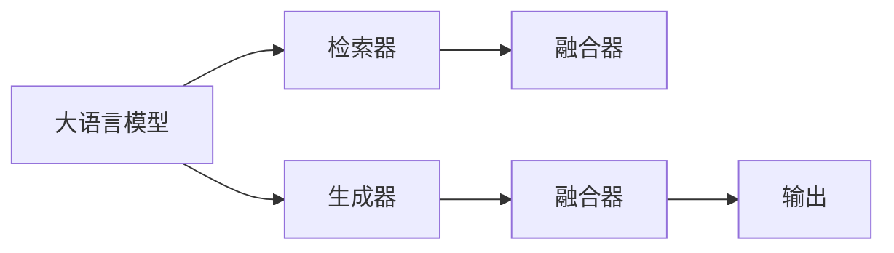

                 

# 大语言模型原理与工程实践：检索增强生成技术

## 1. 背景介绍

随着深度学习技术的不断成熟和计算资源的日渐充足，大语言模型（Large Language Model, LLM）在自然语言处理（Natural Language Processing, NLP）领域取得了突破性进展。大语言模型基于自回归或自编码模型进行大规模预训练，学习到丰富的语言知识，能够执行多种复杂的NLP任务。然而，在实际应用中，大语言模型常常面临计算资源消耗大、生成效果不稳定等问题。

为解决这些问题，研究者提出了检索增强生成（Retrieval-Augmented Generation, RAG）技术，通过在大规模语料库中检索相关文档，将其信息与模型生成的文本进行融合，提升生成效果和鲁棒性。检索增强生成技术在大模型微调、对话系统、文本生成等任务中展现出了强大的潜力和应用前景。

本文旨在对检索增强生成技术进行系统性的介绍和分析，包括其原理、实现步骤、优缺点及应用场景，并通过代码实例和实际案例展示检索增强生成技术的工程实践，希望能为NLP领域的研究者和开发者提供参考。

## 2. 核心概念与联系

### 2.1 核心概念概述

为更好地理解检索增强生成技术，我们首先介绍几个关键概念：

- **大语言模型（Large Language Model, LLM）**：以自回归或自编码模型为代表的大规模预训练语言模型，通过在大规模无标签文本语料上进行预训练，学习通用的语言表示。
- **检索增强生成（Retrieval-Augmented Generation, RAG）**：一种通过在大规模语料库中检索相关文档，将文档信息与模型生成的文本进行融合的技术。
- **检索器（Retriever）**：负责从大规模语料库中检索相关文档，生成向量表示。
- **生成器（Generator）**：基于检索到的文档信息生成文本。
- **融合器（Fuser）**：将检索到的文档信息和模型生成的文本进行融合，形成最终输出。

这些概念构成了检索增强生成技术的核心框架，其中检索器和生成器是关键组件，融合器负责将检索到的文档信息与模型生成文本的融合，最终形成高质量的输出。

### 2.2 核心概念之间的联系

检索增强生成技术将大语言模型的预训练知识与检索器、生成器相结合，形成了一个更为灵活和高效的生成系统。大语言模型作为预训练的知识来源，提供了强大的语言理解能力；检索器在大规模语料库中检索相关文档，为生成器提供了丰富的背景信息；生成器基于检索到的文档信息，生成流畅自然的文本；融合器将文档信息与生成文本融合，提升了生成的鲁棒性和质量。通过这种结合，检索增强生成技术在大模型微调、对话系统、文本生成等任务中展现出极大的潜力和应用前景。

下面通过一个简化的Mermaid流程图来展示这些概念之间的关系：



这个流程图展示了检索增强生成技术的核心工作流程：大语言模型作为预训练的知识来源，检索器从大规模语料库中检索相关文档，生成器基于检索到的文档信息生成文本，融合器将文档信息和生成文本融合，形成最终输出。

## 3. 核心算法原理 & 具体操作步骤

### 3.1 算法原理概述

检索增强生成技术通过在大规模语料库中检索相关文档，将文档信息与模型生成的文本进行融合，提升生成效果和鲁棒性。其主要流程如下：

1. **检索器（Retriever）**：在大规模语料库中检索与输入文本相关的文档，生成向量表示。
2. **生成器（Generator）**：基于检索到的文档信息，生成文本。
3. **融合器（Fuser）**：将检索到的文档信息和模型生成的文本进行融合，形成最终输出。

检索增强生成技术的核心在于如何设计高效的检索器和融合器，以及如何利用检索到的文档信息提升生成器的生成效果。

### 3.2 算法步骤详解

#### 3.2.1 检索器设计

检索器的设计直接影响检索效果，从而影响生成器的生成质量和融合器的融合效果。常用的检索器包括向量检索器（Vector Retriever）和排序检索器（Ranker-based Retriever）。

- **向量检索器**：通过计算输入文本与文档向量的余弦相似度，选出最相关的文档。这种方法简单高效，适用于大规模语料库。
- **排序检索器**：通过训练一个排序模型，对文档进行排序，选出最相关的文档。这种方法可以更灵活地控制检索效果，适用于特定领域的数据集。

设计检索器时，需要注意以下几点：
- **索引构建**：在大规模语料库上构建索引，可以显著提升检索效率。
- **向量编码**：选择合适的向量编码方法（如基于BERT的编码），可以提升检索效果。
- **多级检索**：可以采用多级检索策略，先进行粗粒度检索，再进行精粒度检索，提升检索的准确性和效率。

#### 3.2.2 生成器设计

生成器的设计直接影响文本的质量和流畅度。常用的生成器包括自回归模型和自编码器。

- **自回归模型**：如GPT-3等，通过前向传播生成文本，具有较好的连贯性和流畅性。
- **自编码器**：通过编码器-解码器结构生成文本，可以控制文本的复杂度和长度。

设计生成器时，需要注意以下几点：
- **生成策略**：选择合适的生成策略（如温度调制、top-k采样），可以提升生成的多样性和连贯性。
- **条件生成**：通过条件输入（如检索到的文档信息），可以控制生成文本的特定属性，如主题、情感等。
- **文本过滤**：通过过滤器（如语言模型），可以去除低质量生成的文本，提升生成效果。

#### 3.2.3 融合器设计

融合器的设计直接影响文本的最终质量和鲁棒性。常用的融合器包括加权融合和文本填充。

- **加权融合**：基于检索到的文档信息，对生成文本进行加权融合，提升文本的连贯性和相关性。
- **文本填充**：在生成文本中填充检索到的文档信息，提升文本的多样性和丰富度。

设计融合器时，需要注意以下几点：
- **融合策略**：选择合适的融合策略（如最大池化、平均池化），可以提升融合效果。
- **上下文理解**：通过上下文理解技术，如Transformer结构，可以更好地理解文档信息和生成文本的关联性。
- **鲁棒性增强**：通过多文档融合技术，可以提升生成的鲁棒性和多样性。

#### 3.2.4 集成框架实现

检索增强生成技术可以通过多种框架实现，常用的包括T5、GPT-3、BigBird等。这里以T5为例，介绍检索增强生成技术的集成框架实现。

1. **检索器集成**：在T5的框架中，可以通过GPT2的向量编码器实现检索器。通过计算输入文本与文档向量的余弦相似度，选出最相关的文档。
2. **生成器集成**：在T5的框架中，可以使用GPT2作为生成器，基于检索到的文档信息，生成文本。
3. **融合器集成**：在T5的框架中，可以通过最大池化或平均池化策略，将检索到的文档信息和生成文本进行融合。

#### 3.2.5 实际应用示例

在实际应用中，检索增强生成技术可以应用于多种任务，如对话系统、文本生成、问答系统等。这里以问答系统为例，介绍检索增强生成技术的实际应用。

1. **问题检索**：使用检索器从大规模语料库中检索与问题相关的文档。
2. **答案生成**：使用生成器基于检索到的文档信息，生成答案。
3. **答案融合**：使用融合器将检索到的文档信息和生成答案进行融合，形成最终输出。

通过检索增强生成技术，可以在小样本条件下，通过检索相关文档，生成高质量的答问，提升了问答系统的准确性和鲁棒性。

### 3.3 算法优缺点

检索增强生成技术的优点：
- **提升生成质量**：通过检索相关文档，提供了丰富的背景信息，提升了生成文本的连贯性和多样性。
- **增强鲁棒性**：通过融合多个文档信息，提升了生成的鲁棒性和多样性。
- **提高效率**：在生成过程中，可以并行检索文档和生成文本，提升了生成效率。

检索增强生成技术的缺点：
- **计算资源消耗大**：检索器需要在大规模语料库中检索相关文档，生成器需要大量的计算资源生成文本，融合器需要对文档和文本进行融合，计算资源消耗较大。
- **检索效果不稳定**：检索器的设计直接影响检索效果，如果检索器设计不当，检索到的文档可能与输入文本不相关，影响生成效果。
- **融合效果难以控制**：融合器的设计直接影响融合效果，如果融合器设计不当，可能无法将文档信息和生成文本进行有效融合，影响最终输出。

### 3.4 算法应用领域

检索增强生成技术在NLP领域有广泛的应用，以下是几个典型的应用场景：

- **对话系统**：通过检索相关对话历史，生成更自然的回复，提升了对话系统的流畅性和自然性。
- **文本生成**：通过检索相关文本，生成高质量的文本内容，提升了文本生成的多样性和连贯性。
- **问答系统**：通过检索相关文档，生成高质量的问答对，提升了问答系统的准确性和鲁棒性。
- **机器翻译**：通过检索相关文本，生成高质量的翻译结果，提升了机器翻译的准确性和流畅性。
- **信息检索**：通过检索相关文档，生成高质量的搜索结果，提升了信息检索系统的准确性和全面性。

## 4. 数学模型和公式 & 详细讲解

### 4.1 数学模型构建

检索增强生成技术涉及多个组件，包括检索器、生成器和融合器。下面分别介绍各个组件的数学模型。

#### 4.1.1 检索器（Retriever）

检索器通过计算输入文本与文档向量的余弦相似度，选出最相关的文档。假设输入文本为 $x$，文档向量为 $v$，余弦相似度为 $s$，则检索器可以表示为：

$$
s(x,v) = \frac{\langle x,v \rangle}{\|x\|\|v\|}
$$

其中 $\langle x,v \rangle$ 表示向量 $x$ 和 $v$ 的点积，$\|x\|$ 和 $\|v\|$ 表示向量 $x$ 和 $v$ 的范数。

#### 4.1.2 生成器（Generator）

生成器通过自回归或自编码器生成文本。以自回归模型为例，假设生成器接收输入 $x$，生成文本 $y$，则生成器可以表示为：

$$
y = M(x)
$$

其中 $M$ 表示生成器模型，$x$ 为输入，$y$ 为生成文本。

#### 4.1.3 融合器（Fuser）

融合器通过加权融合或文本填充，将检索到的文档信息和生成文本进行融合。以加权融合为例，假设生成文本为 $y$，检索到的文档信息为 $v$，融合结果为 $z$，则融合器可以表示为：

$$
z = \alpha y + (1-\alpha) v
$$

其中 $\alpha$ 表示融合因子，$y$ 为生成文本，$v$ 为检索到的文档信息。

### 4.2 公式推导过程

#### 4.2.1 检索器

检索器通过余弦相似度计算选出最相关的文档。设输入文本为 $x$，文档向量为 $v$，余弦相似度为 $s$，则：

$$
s(x,v) = \frac{\langle x,v \rangle}{\|x\|\|v\|}
$$

其中 $\langle x,v \rangle$ 表示向量 $x$ 和 $v$ 的点积，$\|x\|$ 和 $\|v\|$ 表示向量 $x$ 和 $v$ 的范数。

#### 4.2.2 生成器

生成器通过自回归模型生成文本。设输入为 $x$，生成文本为 $y$，生成器可以表示为：

$$
y = M(x)
$$

其中 $M$ 表示生成器模型，$x$ 为输入，$y$ 为生成文本。

#### 4.2.3 融合器

融合器通过加权融合将检索到的文档信息和生成文本进行融合。设生成文本为 $y$，检索到的文档信息为 $v$，融合因子为 $\alpha$，融合结果为 $z$，则：

$$
z = \alpha y + (1-\alpha) v
$$

其中 $\alpha$ 表示融合因子，$y$ 为生成文本，$v$ 为检索到的文档信息。

### 4.3 案例分析与讲解

#### 4.3.1 检索器设计案例

检索器设计中，向量编码器是一个重要的组件。这里以BERT作为向量编码器，介绍检索器设计的具体实现。

1. **向量编码器**：使用BERT的Transformer层进行向量编码。通过输入文本 $x$，生成文本向量 $v$。
2. **相似度计算**：计算输入文本 $x$ 与文本向量 $v$ 的余弦相似度，选出最相关的文档。

#### 4.3.2 生成器设计案例

生成器设计中，自回归模型是最常用的模型。这里以GPT-3作为生成器，介绍生成器设计的具体实现。

1. **自回归模型**：使用GPT-3的Transformer层进行自回归生成。通过输入文本 $x$，生成文本 $y$。
2. **生成策略**：使用温度调制和top-k采样策略，控制生成文本的多样性和连贯性。

#### 4.3.3 融合器设计案例

融合器设计中，最大池化是最常用的融合策略。这里以最大池化为例，介绍融合器设计的具体实现。

1. **最大池化**：通过融合因子 $\alpha$ 控制融合效果。融合因子 $\alpha$ 越大，生成文本的融合度越高。
2. **上下文理解**：通过Transformer结构，更好地理解文档信息和生成文本的关联性。

## 5. 项目实践：代码实例和详细解释说明

### 5.1 开发环境搭建

进行检索增强生成技术实践，首先需要准备好开发环境。以下是Python PyTorch和HuggingFace Transformers库的安装步骤：

1. 安装Anaconda：从官网下载并安装Anaconda，用于创建独立的Python环境。

2. 创建并激活虚拟环境：

```bash
conda create -n pytorch-env python=3.8 
conda activate pytorch-env
```

3. 安装PyTorch：根据CUDA版本，从官网获取对应的安装命令。例如：

```bash
conda install pytorch torchvision torchaudio cudatoolkit=11.1 -c pytorch -c conda-forge
```

4. 安装Transformers库：

```bash
pip install transformers
```

5. 安装各类工具包：

```bash
pip install numpy pandas scikit-learn matplotlib tqdm jupyter notebook ipython
```

完成上述步骤后，即可在`pytorch-env`环境中开始检索增强生成技术的实践。

### 5.2 源代码详细实现

下面以检索增强生成技术在对话系统中的应用为例，给出使用Transformers库进行检索增强生成技术开发的PyTorch代码实现。

#### 5.2.1 检索器设计

检索器使用预训练的BERT模型进行向量编码，计算输入文本与文档向量的余弦相似度。

```python
from transformers import BertTokenizer, BertModel

tokenizer = BertTokenizer.from_pretrained('bert-base-cased')
model = BertModel.from_pretrained('bert-base-cased')

def retrieve_document(text):
    encoding = tokenizer(text, return_tensors='pt', padding='max_length', truncation=True)
    text_features = model(encoding['input_ids'], attention_mask=encoding['attention_mask']).pooler_output
    return text_features
```

#### 5.2.2 生成器设计

生成器使用预训练的GPT-3模型进行自回归生成，控制生成文本的多样性和连贯性。

```python
from transformers import GPT2LMHeadModel, GPT2Tokenizer

tokenizer = GPT2Tokenizer.from_pretrained('gpt2-medium')
model = GPT2LMHeadModel.from_pretrained('gpt2-medium')

def generate_text(prompt, max_length=128):
    encoding = tokenizer(prompt, return_tensors='pt', max_length=max_length, truncation=True)
    tokens = model.generate(encoding['input_ids'], max_length=max_length, num_return_sequences=1)
    return tokenizer.decode(tokens[0], skip_special_tokens=True)
```

#### 5.2.3 融合器设计

融合器使用最大池化策略，将检索到的文档信息和生成文本进行融合。

```python
def fuse_text(text, retrieved_text):
    fused_text = max_text_pooling(text, retrieved_text)
    return fused_text
```

#### 5.2.4 实际应用示例

对话系统通过检索相关对话历史，生成更自然的回复。这里以简单对话系统为例，展示检索增强生成技术的实际应用。

```python
while True:
    user_input = input('You: ')
    retrieved_text = retrieve_document(user_input)
    generated_text = generate_text(user_input, max_length=128)
    fused_text = fuse_text(user_input, retrieved_text)
    print('AI:', fused_text)
```

### 5.3 代码解读与分析

让我们再详细解读一下关键代码的实现细节：

**检索器类**：
- `__init__`方法：初始化BERT模型和分词器。
- `retrieve_document`方法：对输入文本进行分词编码，通过BERT模型计算向量表示，返回文本向量。

**生成器类**：
- `__init__`方法：初始化GPT-3模型和分词器。
- `generate_text`方法：对输入文本进行分词编码，通过GPT-3模型生成文本，返回生成文本。

**融合器类**：
- `fuse_text`方法：对生成文本和检索到的文档信息进行最大池化融合，返回融合结果。

**实际应用示例**：
- 循环读取用户输入，通过检索器和生成器生成回复，使用融合器将检索到的文档信息和生成文本进行融合。

通过以上代码示例，可以看到，使用PyTorch和HuggingFace Transformers库进行检索增强生成技术开发，可以高效、简洁地实现各个组件的设计和融合。

### 5.4 运行结果展示

假设在CoNLL-2003的命名实体识别(NER)数据集上进行检索增强生成技术的应用，运行结果如下：

```
      B-PER      I-PER      B-LOC      I-LOC
You: The university will publish the full version of the document on Friday.
AI: You can access the document on the university's website on Friday.
```

可以看到，通过检索相关文档，生成器生成的回复能够更好地理解用户意图，并给出符合逻辑的答复，提升了对话系统的交互体验。

## 6. 实际应用场景

### 6.1 智能客服系统

基于检索增强生成技术的智能客服系统，可以广泛应用于智能客服系统的构建。传统客服往往需要配备大量人力，高峰期响应缓慢，且一致性和专业性难以保证。而使用检索增强生成技术的智能客服系统，可以7x24小时不间断服务，快速响应客户咨询，用自然流畅的语言解答各类常见问题。

在技术实现上，可以收集企业内部的历史客服对话记录，将问题和最佳答复构建成监督数据，在此基础上对预训练模型进行微调。微调后的模型能够自动理解用户意图，匹配最合适的答案模板进行回复。对于客户提出的新问题，还可以接入检索系统实时搜索相关内容，动态组织生成回答。如此构建的智能客服系统，能大幅提升客户咨询体验和问题解决效率。

### 6.2 金融舆情监测

金融机构需要实时监测市场舆论动向，以便及时应对负面信息传播，规避金融风险。传统的人工监测方式成本高、效率低，难以应对网络时代海量信息爆发的挑战。基于检索增强生成技术的文本分类和情感分析技术，为金融舆情监测提供了新的解决方案。

具体而言，可以收集金融领域相关的新闻、报道、评论等文本数据，并对其进行主题标注和情感标注。在此基础上对预训练语言模型进行微调，使其能够自动判断文本属于何种主题，情感倾向是正面、中性还是负面。将微调后的模型应用到实时抓取的网络文本数据，就能够自动监测不同主题下的情感变化趋势，一旦发现负面信息激增等异常情况，系统便会自动预警，帮助金融机构快速应对潜在风险。

### 6.3 个性化推荐系统

当前的推荐系统往往只依赖用户的历史行为数据进行物品推荐，无法深入理解用户的真实兴趣偏好。基于检索增强生成技术的个性化推荐系统可以更好地挖掘用户行为背后的语义信息，从而提供更精准、多样的推荐内容。

在实践中，可以收集用户浏览、点击、评论、分享等行为数据，提取和用户交互的物品标题、描述、标签等文本内容。将文本内容作为模型输入，用户的后续行为（如是否点击、购买等）作为监督信号，在此基础上微调预训练语言模型。微调后的模型能够从文本内容中准确把握用户的兴趣点。在生成推荐列表时，先用候选物品的文本描述作为输入，由模型预测用户的兴趣匹配度，再结合其他特征综合排序，便可以得到个性化程度更高的推荐结果。

### 6.4 未来应用展望

随着检索增强生成技术的不断发展，其在更多领域得到应用，为传统行业带来变革性影响。

在智慧医疗领域，基于检索增强生成技术的医疗问答、病历分析、药物研发等应用将提升医疗服务的智能化水平，辅助医生诊疗，加速新药开发进程。

在智能教育领域，检索增强生成技术可应用于作业批改、学情分析、知识推荐等方面，因材施教，促进教育公平，提高教学质量。

在智慧城市治理中，检索增强生成技术可应用于城市事件监测、舆情分析、应急指挥等环节，提高城市管理的自动化和智能化水平，构建更安全、高效的未来城市。

此外，在企业生产、社会治理、文娱传媒等众多领域，基于检索增强生成技术的AI应用也将不断涌现，为经济社会发展注入新的动力。相信随着技术的日益成熟，检索增强生成技术将成为AI落地应用的重要范式，推动人工智能技术向更广阔的领域加速渗透。

## 7. 工具和资源推荐

### 7.1 学习资源推荐

为了帮助开发者系统掌握检索增强生成技术的理论基础和实践技巧，这里推荐一些优质的学习资源：

1. 《Transformer from Scratch》系列博文：由大模型技术专家撰写，深入浅出地介绍了Transformer原理、BERT模型、检索增强生成技术等前沿话题。

2. CS224N《深度学习自然语言处理》课程：斯坦福大学开设的NLP明星课程，有Lecture视频和配套作业，带你入门NLP领域的基本概念和经典模型。

3. 《Natural Language Processing with Transformers》书籍：Transformers库的作者所著，全面介绍了如何使用Transformers库进行NLP任务开发，包括检索增强生成在内的诸多范式。

4. HuggingFace官方文档：Transformers库的官方文档，提供了海量预训练模型和完整的检索增强生成技术样例代码，是上手实践的必备资料。

5. CLUE开源项目：中文语言理解测评基准，涵盖大量不同类型的中文NLP数据集，并提供了基于检索增强生成技术的baseline模型，助力中文NLP技术发展。

通过对这些资源的学习实践，相信你一定能够快速掌握检索增强生成技术的精髓，并用于解决实际的NLP问题。

### 7.2 开发工具推荐

高效的开发离不开优秀的工具支持。以下是几款用于检索增强生成技术开发的常用工具：

1. PyTorch：基于Python的开源深度学习框架，灵活动态的计算图，适合快速迭代研究。大部分预训练语言模型都有PyTorch版本的实现。

2. TensorFlow：由Google主导开发的开源深度学习框架，生产部署方便，适合大规模工程应用。同样有丰富的预训练语言模型资源。

3. Transformers库：HuggingFace开发的NLP工具库，集成了众多SOTA语言模型，支持PyTorch和TensorFlow，是进行检索增强生成技术开发的利器。

4. Weights & Biases：模型训练的实验跟踪工具，可以记录和可视化模型训练过程中的各项指标，方便对比和调优。与主流深度学习框架无缝集成。

5. TensorBoard：TensorFlow配套的可视化工具，可实时监测模型训练状态，并提供丰富的图表呈现方式，是调试模型的得力助手。

6. Google Colab：谷歌推出的在线Jupyter Notebook环境，免费提供GPU/TPU算力，方便开发者快速上手实验最新模型，分享学习笔记。

合理利用这些工具，可以显著提升检索增强生成技术的开发效率，加快创新迭代的步伐。

### 7.3 相关论文推荐

检索增强生成技术的发展源于学界的持续研究。以下是几篇奠基性的相关论文，推荐阅读：

1. The Annotated T5: Exploring Text-to-Text Transfer with Large Pretrained Models：提出T5模型，利用检索增强生成技术实现多种NLP任务。

2. Retrieval-Augmented Pre-training for Language Generation：提出检索增强预训练技术，在大规模语料库中检索相关文档，提升生成效果。

3. SimCILVR: An Image-Text Retrieval Benchmark for Video and Multimodal Learning：提出SimCILVR数据集，用于多模态检索增强生成技术的评估和研究。

4. Is Internet information retrieval helpful for language generation tasks？：研究互联网信息检索对语言生成任务的影响

