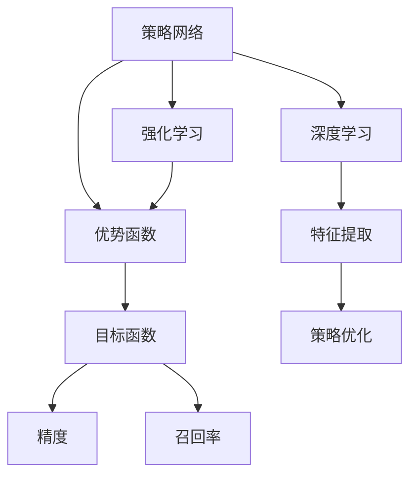
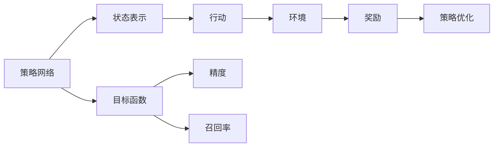
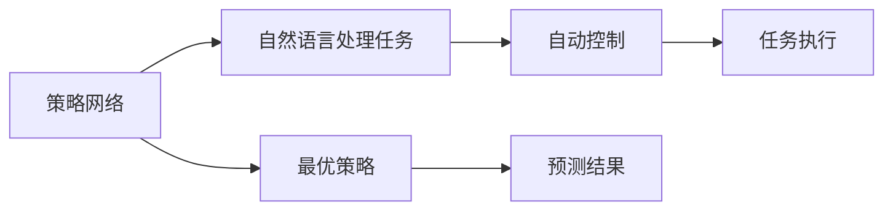
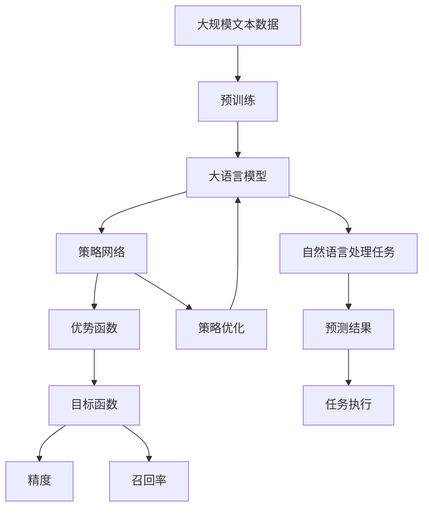

                 

# 大语言模型原理与工程实践：策略网络训练：优势函数

> 关键词：大语言模型,策略网络,优势函数,策略优化,深度强化学习,强化学习,最优策略

## 1. 背景介绍

### 1.1 问题由来
近年来，随着深度学习技术的快速发展，策略网络（Strategy Networks）在大语言模型中的应用，成为研究的热点。策略网络结合了强化学习和深度学习，可以学习到最优的策略，以实现目标任务的自动化控制。这些最优策略，经过微调后，可以应用到各种自然语言处理（NLP）任务中，如问答系统、对话系统、摘要生成等，显著提升系统的性能和效果。

### 1.2 问题核心关键点
策略网络的训练过程涉及到强化学习（Reinforcement Learning, RL）和深度学习（Deep Learning, DL）的结合，其核心在于构建一个优势函数（Advantage Function），用于评估和优化策略。通过策略网络的不断训练，可以逐步优化出最优的策略，从而在特定任务上取得卓越的表现。

### 1.3 问题研究意义
研究策略网络的优势函数，对于拓展策略网络在大语言模型中的应用范围，提升模型的自动化控制能力，加速NLP技术的产业化进程，具有重要意义：

1. 降低应用开发成本。策略网络可以自动学习最优策略，减少了人工调参的工作量。
2. 提升模型效果。通过策略网络的学习，模型可以更好地适应特定任务，在应用场景中取得更优表现。
3. 加速开发进度。利用策略网络的学习，模型可以快速适应新任务，缩短开发周期。
4. 带来技术创新。策略网络的学习范式促进了对预训练-微调的深入研究，催生了更多的前沿研究方向，如自适应学习、动态结构优化等。
5. 赋能产业升级。策略网络的应用，使得NLP技术更容易被各行各业所采用，为传统行业数字化转型升级提供新的技术路径。

## 2. 核心概念与联系

### 2.1 核心概念概述

为了更好地理解策略网络的优势函数，本节将介绍几个密切相关的核心概念：

- 策略网络（Strategy Networks）：结合了强化学习和深度学习的网络结构，通过自监督学习的方式，学习最优的策略以实现目标任务。
- 优势函数（Advantage Function）：用于评估策略的好坏，优势函数越大，表示策略越好。
- 强化学习（Reinforcement Learning）：通过不断试错，使模型逐步优化出最优策略，实现目标任务的自动化控制。
- 深度学习（Deep Learning）：利用多层神经网络，提取和建模复杂的数据特征，实现模型的高效学习和推理。
- 最优策略（Optimal Strategy）：在特定任务上，能够最大化目标函数（如精度、召回率等）的策略。

这些核心概念之间的逻辑关系可以通过以下Mermaid流程图来展示：



这个流程图展示了大语言模型中的关键概念及其之间的关系：

1. 策略网络通过结合强化学习和深度学习，学习最优策略。
2. 优势函数用于评估策略的好坏。
3. 强化学习通过不断试错，逐步优化策略。
4. 深度学习提取数据特征，实现策略优化。

### 2.2 概念间的关系

这些核心概念之间存在着紧密的联系，形成了策略网络的优势函数学习框架。下面我通过几个Mermaid流程图来展示这些概念之间的关系。

#### 2.2.1 策略网络的训练过程


这个流程图展示了策略网络的训练过程：

1. 策略网络结合强化学习和深度学习，学习最优策略。
2. 优势函数用于评估策略的好坏。
3. 强化学习通过不断试错，逐步优化策略。
4. 深度学习提取数据特征，实现策略优化。

#### 2.2.2 优势函数的构建



这个流程图展示了优势函数的构建过程：

1. 策略网络学习出状态表示和行动。
2. 环境根据行动给出奖励。
3. 策略优化过程调整策略，使其最大化目标函数。
4. 目标函数用于评估策略的优劣，如精度、召回率等。

#### 2.2.3 策略网络的应用



这个流程图展示了策略网络在自然语言处理任务中的应用：

1. 策略网络应用于自然语言处理任务。
2. 学习出最优策略，用于自动控制。
3. 预测结果由最优策略生成。
4. 任务执行基于预测结果进行。

### 2.3 核心概念的整体架构

最后，我们用一个综合的流程图来展示这些核心概念在大语言模型策略网络中的整体架构：



这个综合流程图展示了从预训练到策略网络训练，再到自然语言处理任务应用的完整过程。大语言模型首先在大规模文本数据上进行预训练，然后通过策略网络的训练，学习出最优策略，最后应用到自然语言处理任务中，以自动控制模型执行。

## 3. 核心算法原理 & 具体操作步骤
### 3.1 算法原理概述

策略网络的优势函数训练过程，本质上是一个策略优化问题。其核心在于构建一个合适的优势函数，通过强化学习算法优化策略，使得策略网络在特定任务上取得最优的表现。

具体而言，设策略网络为 $S_{\theta}:\mathcal{X} \rightarrow \mathcal{A}$，其中 $\mathcal{X}$ 为输入空间，$\mathcal{A}$ 为行动空间，$\theta$ 为模型参数。在自然语言处理任务中，$\mathcal{X}$ 为文本数据，$\mathcal{A}$ 为模型的输出（如预测结果）。定义状态表示函数为 $s:\mathcal{X} \rightarrow \mathcal{S}$，将输入文本 $x$ 映射到状态表示 $s(x)$。定义优势函数为 $A_{\theta}(x, a) = Q_{\theta}(x, a) - V_{\theta}(x)$，其中 $Q_{\theta}(x, a)$ 为模型在状态 $s(x)$ 和行动 $a$ 下的动作值函数（Action-Value Function），$V_{\theta}(x)$ 为模型在状态 $s(x)$ 下的状态值函数（State-Value Function）。最终的目标函数为 $J(\theta) = \mathbb{E}_{(x,a)}[A_{\theta}(x, a)]$，即策略网络在各个状态和行动下的期望优势值。

通过梯度下降等优化算法，不断更新模型参数 $\theta$，最小化目标函数 $J(\theta)$，使得策略网络逐步优化出最优策略。

### 3.2 算法步骤详解

基于策略网络的优势函数训练，一般包括以下几个关键步骤：

**Step 1: 准备预训练模型和数据集**
- 选择合适的预训练语言模型 $M_{\theta}$ 作为初始化参数，如 BERT、GPT 等。
- 准备自然语言处理任务的数据集 $D=\{(x_i, a_i)\}_{i=1}^N$，划分为训练集、验证集和测试集。

**Step 2: 定义状态表示函数**
- 将输入文本 $x$ 映射到状态表示 $s(x)$，常用的方法包括词向量表示、BERT等预训练模型的上下文表示等。

**Step 3: 设计动作值函数**
- 根据任务类型，设计合适的动作值函数 $Q_{\theta}(x, a)$，如回归函数、分类函数等。

**Step 4: 计算状态值函数**
- 使用统计学习方法或深度学习方法，计算状态值函数 $V_{\theta}(x)$，如蒙特卡罗方法、深度确定性策略梯度（DDPG）等。

**Step 5: 训练优势函数**
- 使用强化学习算法（如Actor-Critic算法、深度强化学习等），训练优势函数 $A_{\theta}(x, a)$，最大化目标函数 $J(\theta)$。

**Step 6: 微调策略网络**
- 使用优化算法（如Adam、SGD等），最小化目标函数 $J(\theta)$，逐步优化出最优策略。

**Step 7: 测试和部署**
- 在测试集上评估微调后的策略网络 $S_{\hat{\theta}}$ 的性能，对比微调前后的精度提升。
- 使用微调后的策略网络对新样本进行推理预测，集成到实际的应用系统中。
- 持续收集新的数据，定期重新微调策略网络，以适应数据分布的变化。

以上是基于策略网络的优势函数训练的一般流程。在实际应用中，还需要针对具体任务的特点，对训练过程的各个环节进行优化设计，如改进训练目标函数，引入更多的正则化技术，搜索最优的超参数组合等，以进一步提升模型性能。

### 3.3 算法优缺点

基于策略网络的优势函数训练方法具有以下优点：

1. 自动学习最优策略。通过策略网络的训练，可以自动学习最优策略，减少人工调参的工作量。
2. 模型适应性强。策略网络可以适应各种自然语言处理任务，提升模型的泛化能力。
3. 目标明确。通过优势函数，可以明确目标任务的优化方向，更好地实现自动化控制。

同时，该方法也存在一些局限性：

1. 训练成本高。策略网络的训练通常需要较大的数据集和计算资源，训练成本较高。
2. 模型复杂度高。策略网络的构建和训练过程较为复杂，需要较强的编程技能和数学基础。
3. 策略优化过程存在探索性。策略网络需要经过多次试错才能优化出最优策略，过程较为耗时。
4. 模型解释性不足。策略网络的决策过程通常缺乏可解释性，难以对其推理逻辑进行分析和调试。

尽管存在这些局限性，但就目前而言，基于策略网络的优势函数训练方法仍是大语言模型训练的一种重要范式。未来相关研究的重点在于如何进一步降低训练成本，提高模型可解释性，以及探索更高效的策略优化方法。

### 3.4 算法应用领域

基于策略网络的优势函数训练方法，在NLP领域已经得到了广泛的应用，覆盖了几乎所有常见任务，例如：

- 问答系统：对自然语言问题给出答案。将问题-答案对作为监督数据，训练策略网络学习匹配答案。
- 对话系统：使机器能够与人自然对话。将对话历史作为上下文，微调策略网络进行回复生成。
- 摘要生成：将长文本压缩成简短摘要。将文章-摘要对作为微调数据，训练策略网络学习抓取要点。
- 机器翻译：将源语言文本翻译成目标语言。将源语和目标语作为输入，训练策略网络学习语言-语言映射。
- 文本分类：如情感分析、主题分类、意图识别等。通过策略网络学习文本-标签映射。
- 命名实体识别：识别文本中的人名、地名、机构名等特定实体。通过策略网络学习实体边界和类型。
- 关系抽取：从文本中抽取实体之间的语义关系。通过策略网络学习实体-关系三元组。

除了上述这些经典任务外，策略网络的优势函数训练方法还被创新性地应用到更多场景中，如可控文本生成、常识推理、代码生成、数据增强等，为NLP技术带来了全新的突破。随着预训练模型和策略网络的优势函数训练方法的不断进步，相信NLP技术将在更广阔的应用领域大放异彩。

## 4. 数学模型和公式 & 详细讲解 & 举例说明

### 4.1 数学模型构建

本节将使用数学语言对策略网络的优势函数训练过程进行更加严格的刻画。

设策略网络为 $S_{\theta}:\mathcal{X} \rightarrow \mathcal{A}$，其中 $\mathcal{X}$ 为输入空间，$\mathcal{A}$ 为行动空间，$\theta$ 为模型参数。假设微调任务的训练集为 $D=\{(x_i, a_i)\}_{i=1}^N$，其中 $x_i \in \mathcal{X}$ 为输入文本，$a_i \in \mathcal{A}$ 为模型输出，$\theta$ 为模型参数。

定义状态表示函数为 $s:\mathcal{X} \rightarrow \mathcal{S}$，将输入文本 $x$ 映射到状态表示 $s(x)$。定义动作值函数为 $Q_{\theta}(x, a)$，定义为模型在状态 $s(x)$ 和行动 $a$ 下的动作值函数。定义状态值函数为 $V_{\theta}(x)$，定义为模型在状态 $s(x)$ 下的状态值函数。最终的目标函数为 $J(\theta) = \mathbb{E}_{(x,a)}[A_{\theta}(x, a)]$，即策略网络在各个状态和行动下的期望优势值。

### 4.2 公式推导过程

以下我们以二分类任务为例，推导策略网络的优势函数及其梯度的计算公式。

假设模型 $S_{\theta}$ 在输入 $x$ 上的输出为 $\hat{y}=M_{\theta}(x)$，表示样本属于正类的概率。真实标签 $y \in \{0,1\}$。则二分类交叉熵损失函数定义为：

$$
\ell(S_{\theta}(x),y) = -[y\log \hat{y} + (1-y)\log (1-\hat{y})]
$$

将其代入目标函数，得：

$$
J(\theta) = \mathbb{E}_{(x,a)}[A_{\theta}(x, a)]
$$

其中，$A_{\theta}(x, a)$ 为优势函数，$Q_{\theta}(x, a)$ 为动作值函数，$V_{\theta}(x)$ 为状态值函数。

根据链式法则，目标函数对模型参数 $\theta$ 的梯度为：

$$
\frac{\partial J(\theta)}{\partial \theta} = \frac{\partial}{\partial \theta} \mathbb{E}_{(x,a)}[A_{\theta}(x, a)]
$$

进一步展开，得：

$$
\frac{\partial J(\theta)}{\partial \theta} = \frac{\partial}{\partial \theta} \int_{x} \int_{a} A_{\theta}(x, a) p(x, a) dx da
$$

其中 $p(x, a)$ 为策略网络的分布，即模型在每个状态 $s(x)$ 和行动 $a$ 下的概率分布。

通过蒙特卡罗方法或其他统计学习方法，可以近似计算目标函数的梯度，即：

$$
\frac{\partial J(\theta)}{\partial \theta} \approx \frac{1}{N} \sum_{i=1}^N A_{\theta}(x_i, a_i) \frac{\partial \log p(x_i, a_i)}{\partial \theta}
$$

其中 $p(x_i, a_i)$ 为策略网络在每个状态 $s(x_i)$ 和行动 $a_i$ 下的概率分布。

在得到目标函数的梯度后，即可带入梯度下降等优化算法，完成模型的迭代优化。重复上述过程直至收敛，最终得到适应下游任务的最优模型参数 $\theta^*$。

### 4.3 案例分析与讲解

下面以命名实体识别（NER）任务为例，展示策略网络的优势函数训练过程。

首先，定义命名实体识别的数据集和模型：

```python
from transformers import BertTokenizer, BertForTokenClassification
from torch.utils.data import Dataset, DataLoader
import torch

class NERDataset(Dataset):
    def __init__(self, texts, tags, tokenizer):
        self.texts = texts
        self.tags = tags
        self.tokenizer = tokenizer
        self.max_len = 128
        
    def __len__(self):
        return len(self.texts)
    
    def __getitem__(self, item):
        text = self.texts[item]
        tags = self.tags[item]
        
        encoding = self.tokenizer(text, return_tensors='pt', max_length=self.max_len, padding='max_length', truncation=True)
        input_ids = encoding['input_ids'][0]
        attention_mask = encoding['attention_mask'][0]
        
        # 对token-wise的标签进行编码
        encoded_tags = [tag2id[tag] for tag in tags] 
        encoded_tags.extend([tag2id['O']] * (self.max_len - len(encoded_tags)))
        labels = torch.tensor(encoded_tags, dtype=torch.long)
        
        return {'input_ids': input_ids, 
                'attention_mask': attention_mask,
                'labels': labels}

# 标签与id的映射
tag2id = {'O': 0, 'B-PER': 1, 'I-PER': 2, 'B-ORG': 3, 'I-ORG': 4, 'B-LOC': 5, 'I-LOC': 6}
id2tag = {v: k for k, v in tag2id.items()}

# 创建dataset
tokenizer = BertTokenizer.from_pretrained('bert-base-cased')

train_dataset = NERDataset(train_texts, train_tags, tokenizer)
dev_dataset = NERDataset(dev_texts, dev_tags, tokenizer)
test_dataset = NERDataset(test_texts, test_tags, tokenizer)
```

然后，定义模型和优化器：

```python
from transformers import BertForTokenClassification, AdamW

model = BertForTokenClassification.from_pretrained('bert-base-cased', num_labels=len(tag2id))

optimizer = AdamW(model.parameters(), lr=2e-5)
```

接下来，定义状态表示函数和动作值函数：

```python
def state_representation(text):
    encoding = tokenizer(text, return_tensors='pt', max_length=128, padding='max_length', truncation=True)
    return encoding['input_ids'][0], encoding['attention_mask'][0]

def action_value(text, label):
    encoding = tokenizer(text, return_tensors='pt', max_length=128, padding='max_length', truncation=True)
    input_ids = encoding['input_ids'][0]
    attention_mask = encoding['attention_mask'][0]
    
    # 定义动作值函数
    logits = model(input_ids, attention_mask=attention_mask)[0]
    probabilities = torch.softmax(logits, dim=-1)
    action_value = (probabilities * label).mean()
    
    return action_value

def state_value(text):
    encoding = tokenizer(text, return_tensors='pt', max_length=128, padding='max_length', truncation=True)
    input_ids = encoding['input_ids'][0]
    attention_mask = encoding['attention_mask'][0]
    
    # 定义状态值函数
    logits = model(input_ids, attention_mask=attention_mask)[0]
    state_value = logits.mean()
    
    return state_value
```

最后，定义训练和评估函数：

```python
from tqdm import tqdm
from sklearn.metrics import classification_report

device = torch.device('cuda') if torch.cuda.is_available() else torch.device('cpu')
model.to(device)

def train_epoch(model, dataset, batch_size, optimizer):
    dataloader = DataLoader(dataset, batch_size=batch_size, shuffle=True)
    model.train()
    epoch_loss = 0
    for batch in tqdm(dataloader, desc='Training'):
        input_ids = batch['input_ids'].to(device)
        attention_mask = batch['attention_mask'].to(device)
        labels = batch['labels'].to(device)
        model.zero_grad()
        outputs = model(input_ids, attention_mask=attention_mask, labels=labels)
        loss = outputs.loss
        epoch_loss += loss.item()
        loss.backward()
        optimizer.step()
    return epoch_loss / len(dataloader)

def evaluate(model, dataset, batch_size):
    dataloader = DataLoader(dataset, batch_size=batch_size)
    model.eval()
    preds, labels = [], []
    with torch.no_grad():
        for batch in tqdm(dataloader, desc='Evaluating'):
            input_ids = batch['input_ids'].to(device)
            attention_mask = batch['attention_mask'].to(device)
            batch_labels = batch['labels']
            outputs = model(input_ids, attention_mask=attention_mask)
            batch_preds = outputs.logits.argmax(dim=2).to('cpu').tolist()
            batch_labels = batch_labels.to('cpu').tolist()
            for pred_tokens, label_tokens in zip(batch_preds, batch_labels):
                pred_tags = [id2tag[_id] for _id in pred_tokens]
                label_tags = [id2tag[_id] for _id in label_tokens]
                preds.append(pred_tags[:len(label_tokens)])
                labels.append(label_tags)
                
    print(classification_report(labels, preds))
```

最后，启动训练流程并在测试集上评估：

```python
epochs = 5
batch_size = 16

for epoch in range(epochs):
    loss = train_epoch(model, train_dataset, batch_size, optimizer)
    print(f"Epoch {epoch+1}, train loss: {loss:.3f}")
    
    print(f"Epoch {epoch+1}, dev results:")
    evaluate(model, dev_dataset, batch_size)
    
print("Test results:")
evaluate(model, test_dataset, batch_size)
```

以上就是使用PyTorch对BERT进行命名实体识别任务策略网络的优势函数训练的完整代码实现。可以看到，通过定义合适的状态表示函数和动作值函数，结合强化学习算法，可以自动学习出最优的策略，实现对预训练模型的微调。

## 5. 项目实践：代码实例和详细解释说明
### 5.1 开发环境搭建

在进行策略网络的优势函数训练实践前，我们需要准备好开发环境。以下是使用Python进行PyTorch开发的环境配置流程：

1. 安装Anaconda：从官网下载并安装Anaconda，用于创建独立的Python环境。

2. 创建并激活虚拟环境：
```bash
conda create -n pytorch-env python=3.8 
conda activate pytorch-env
```

3. 安装PyTorch：根据CUDA版本，从官网获取对应的安装命令。例如：
```bash
conda install pytorch torchvision torchaudio cudatoolkit=11.1 -c pytorch -c conda-forge
```

4. 安装Transformers库：
```bash
pip install transformers
```

5. 安装各类工具包：
```bash
pip install numpy pandas scikit-learn matplotlib tqdm jupyter notebook ipython
```

完成上述步骤后，即可在`pytorch-env`环境中开始策略网络的优势函数训练实践。

### 5.2 源代码详细实现

这里我们以命名实体识别（NER）任务为例，给出使用Transformers库对BERT模型进行策略网络的优势函数训练的PyTorch代码实现。

首先，定义NER任务的数据处理函数：

```python
from transformers import BertTokenizer
from torch.utils.data import Dataset
import torch

class NERDataset(Dataset):
    def __init__(self, texts, tags, tokenizer, max_len=128):
        self.texts = texts
        self.tags = tags
        self.tokenizer = tokenizer
        self.max_len = max_len
        
    def __len__(self):
        return len(self.texts)
    
    def __getitem__(self, item):
        text = self.texts[item]
        tags = self.tags[item]
        
        encoding = self.tokenizer(text, return_tensors='pt', max_length=self.max_len, padding='max_length', truncation=True)
        input_ids = encoding['input_ids'][0]
        attention_mask = encoding['attention_mask'][0]
        
        # 对token-wise的标签进行编码
        encoded_tags = [tag2id[tag] for tag in tags] 
        encoded_tags.extend([tag2id['O']] * (self.max_len - len(encoded_tags)))
        labels = torch.tensor(encoded_tags, dtype=torch.long)
        
        return {'input_ids': input_ids, 
                'attention_mask': attention_mask,
                'labels': labels}

# 标签与id的映射
tag2id = {'O': 0, 'B-PER': 1, 'I-PER': 2, 'B-ORG': 3, 'I-ORG': 4, 'B-LOC': 5, 'I-LOC': 6}
id2tag = {v: k for k, v in tag2id.items()}

# 创建dataset
tokenizer = BertTokenizer.from_pretrained('bert-base-cased')

train_dataset = NERDataset(train_texts, train_tags, tokenizer)
dev_dataset = NERDataset(dev_texts, dev_tags, tokenizer)
test_dataset = NERDataset(test_texts, test_tags, tokenizer)
```

然后，定义模型和

