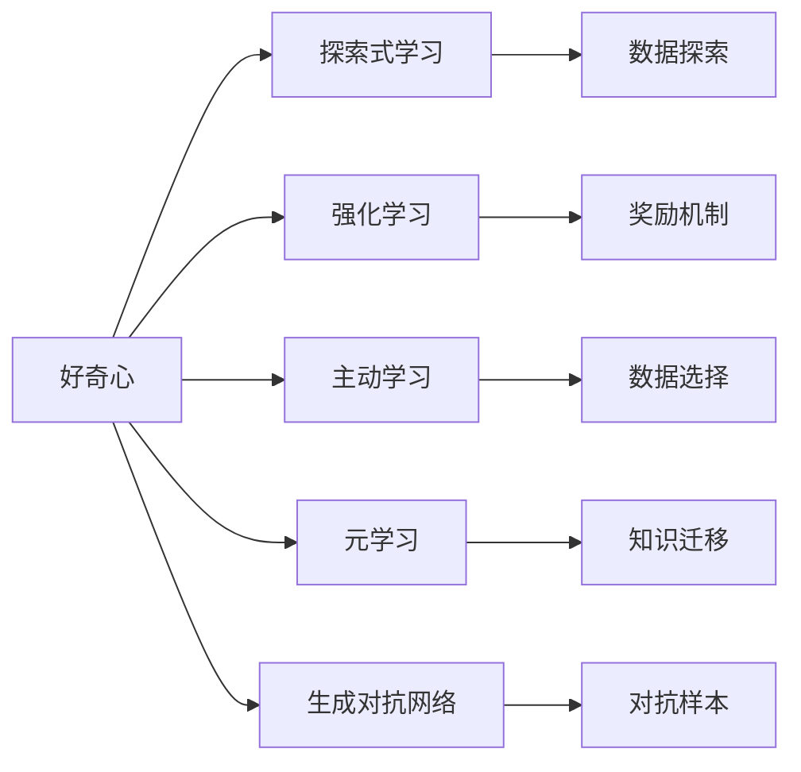
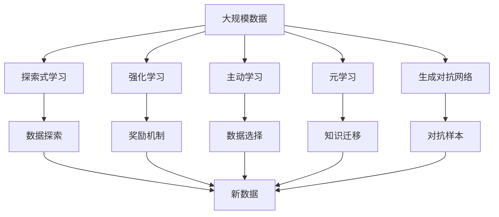

                 

# 好奇心：探索世界的钥匙

> 关键词：好奇心,探索,科学,创新,技术,人工智能

## 1. 背景介绍

### 1.1 问题由来

在人类历史上，好奇心一直是最强大的驱动力之一。它推动了人类文明的发展，使我们能够突破认知的边界，揭示世界的本质。同样，在现代科技领域，好奇心同样是推动创新的重要因素。无数伟大的发明和发现，都源于人类对未知世界的不懈探索和质疑。

在人工智能（AI）领域，好奇心也发挥着至关重要的作用。它推动了AI技术的不断进步，使我们能够解决更多现实世界中的问题。本文将探讨好奇心在AI中的作用，以及如何利用好奇心推动技术创新和应用突破。

### 1.2 问题核心关键点

好奇心在AI中的应用，主要体现在以下几个方面：

- **探索未知领域**：好奇心驱使研究者不断探索AI的新领域，如深度学习、强化学习、自然语言处理等。这些技术的发展，使得AI能够在更广泛的领域内发挥作用，如自动驾驶、机器人、医学诊断等。
- **解决实际问题**：好奇心促使研究者不断思考如何利用AI技术解决现实中的问题，如优化生产流程、改善医疗服务、提升用户体验等。
- **推动技术革新**：好奇心推动了AI技术的持续演进，如优化算法、提升计算效率、增强模型的可解释性等，使得AI技术在各个应用场景中表现更佳。
- **培养AI人才**：好奇心培养了一代又一代的AI人才，这些人才不断推动AI技术的前沿研究与应用，成为推动AI发展的中坚力量。

本文将从理论到实践，全面探讨好奇心在AI中的作用，并给出具体的实现方法。

### 1.3 问题研究意义

探索好奇心在AI中的作用，对于推动AI技术的创新和应用具有重要意义：

- **激发创新灵感**：好奇心促使研究者不断探索未知领域，解决实际问题，从而推动AI技术的不断进步。
- **提升应用价值**：好奇心使得AI技术能够解决更多现实问题，提升各行业的应用价值。
- **培养专业人才**：好奇心培养了具有创新精神和探索精神的AI人才，为AI技术的长远发展提供坚实基础。
- **增强公众认知**：好奇心增强了公众对AI技术的理解和接受度，有助于推动AI技术的普及和应用。

## 2. 核心概念与联系

### 2.1 核心概念概述

为了更好地理解好奇心在AI中的应用，本节将介绍几个密切相关的核心概念：

- **好奇心**：指人类对未知事物的好奇心，驱使人们不断探索和发现。
- **探索式学习**：指利用好奇心驱动的机器学习方法，探索未知数据和任务，提升模型的适应能力。
- **强化学习**：一种通过奖励和惩罚来训练智能体（agent）探索最优决策的学习方法。
- **主动学习**：一种主动选择数据进行训练的学习方法，通过探索未知数据，提高模型性能。
- **元学习**：指学习如何快速适应新任务和环境的学习方法，利用已有的知识，快速解决新问题。
- **生成对抗网络（GANs）**：一种利用对抗性训练，生成逼真数据的学习方法，增强模型对未知数据的探索能力。

这些核心概念之间的逻辑关系可以通过以下Mermaid流程图来展示：



这个流程图展示了好奇心在AI中的主要应用路径，以及与各个核心概念的联系。

### 2.2 概念间的关系

这些核心概念之间存在着紧密的联系，形成了AI探索未知数据和任务的完整生态系统。

- **探索式学习**：利用好奇心驱动的机器学习方法，探索未知数据和任务，提升模型的适应能力。
- **强化学习**：通过奖励和惩罚，驱使智能体在复杂环境中探索最优决策。
- **主动学习**：选择数据进行训练，利用好奇心探索未知数据，提高模型性能。
- **元学习**：学习如何快速适应新任务和环境，利用已有知识，快速解决新问题。
- **生成对抗网络**：通过对抗性训练，生成逼真数据，增强模型对未知数据的探索能力。

这些概念共同构成了AI探索未知数据和任务的完整范式，使其能够在各种场景下发挥强大的探索和适应能力。通过理解这些核心概念，我们可以更好地把握AI技术的学习和应用框架。

### 2.3 核心概念的整体架构

最后，我们用一个综合的流程图来展示这些核心概念在大规模数据探索中的整体架构：



这个综合流程图展示了从大规模数据到新数据的完整探索路径，以及各概念之间的相互作用。通过这些流程图，我们可以更清晰地理解好奇心在AI中的应用和作用，为后续深入讨论具体的探索方法奠定基础。

## 3. 核心算法原理 & 具体操作步骤
### 3.1 算法原理概述

好奇心在AI中的应用，主要体现在探索未知数据和任务的过程中。这种探索可以采用多种方法，如强化学习、主动学习、元学习、生成对抗网络等。

以强化学习为例，其基本原理是通过奖励机制，驱使智能体在复杂环境中探索最优决策。智能体在每次行动后，根据环境反馈获得奖励或惩罚，逐步优化决策策略，达到最大化累积奖励的目标。

### 3.2 算法步骤详解

以强化学习为例，探索未知数据和任务的步骤如下：

1. **环境定义**：定义智能体所处的环境，包括状态空间、动作空间和奖励函数等。
2. **智能体设计**：设计智能体的决策策略，如Q-learning、策略梯度等。
3. **奖励机制设计**：设计合适的奖励机制，如任务完成度、目标达成率等。
4. **探索和利用**：在每次行动中，智能体既要探索新数据和新任务，又要利用已有知识，避免盲目探索。
5. **迭代优化**：通过不断迭代，逐步优化决策策略，达到最大化累积奖励的目标。

### 3.3 算法优缺点

探索未知数据和任务的方法各有优缺点：

- **强化学习**：优点在于可以处理复杂环境，具有较好的探索能力。缺点在于需要大量的奖励信号，且容易陷入局部最优。
- **主动学习**：优点在于可以根据数据分布选择数据进行训练，避免过拟合。缺点在于需要一定的先验知识，且难以处理高维数据。
- **元学习**：优点在于可以适应新任务和环境，具有较好的泛化能力。缺点在于需要大量的计算资源，且难以处理多模态数据。
- **生成对抗网络**：优点在于可以生成逼真数据，增强模型对未知数据的探索能力。缺点在于训练过程复杂，难以保证生成的数据质量。

### 3.4 算法应用领域

好奇心在AI中的应用领域非常广泛，主要体现在以下几个方面：

- **自动驾驶**：利用好奇心探索复杂道路环境，提升自动驾驶的安全性和可靠性。
- **医疗诊断**：通过好奇心探索未知病例，提升医疗诊断的准确性和效率。
- **金融分析**：利用好奇心探索市场动态，优化投资决策。
- **教育推荐**：探索学生的学习兴趣和行为模式，提供个性化的教育推荐。
- **智能客服**：利用好奇心探索用户需求，提升客户服务质量。

## 4. 数学模型和公式 & 详细讲解  
### 4.1 数学模型构建

在本节中，我们将使用数学语言对好奇心在AI中的应用进行更加严格的刻画。

假设智能体在环境 $E$ 中探索，状态空间为 $S$，动作空间为 $A$，奖励函数为 $R:S \times A \rightarrow \mathbb{R}$。设智能体的策略为 $\pi$，在状态 $s$ 下采取动作 $a$ 的概率为 $\pi(a|s)$。智能体的累积奖励为 $G_t$，定义为从当前状态 $s_t$ 开始，沿着策略 $\pi$ 累积得到的奖励。

智能体的目标是通过探索和利用，最大化累积奖励 $G_t$。因此，智能体的最优策略 $\pi^*$ 满足以下最优值方程：

$$
\pi^* = \mathop{\arg\max}_{\pi} \mathbb{E}_{s \sim \rho} [G_t | S_t = s, \pi]
$$

其中 $\rho$ 为环境的初始状态分布。

### 4.2 公式推导过程

以下我们将推导强化学习中常用的Q-learning算法的具体步骤：

1. **状态值函数定义**：
   - 状态值函数 $Q(s, a)$ 表示在状态 $s$ 下采取动作 $a$ 的累积奖励。
   - 定义状态值函数的更新公式为：
     \begin{align*}
     Q_{t+1}(s_t, a_t) &= Q_t(s_t, a_t) + \alpha \left[ r_{t+1} + \gamma \max_a Q_{t+1}(s_{t+1}, a) - Q_t(s_t, a_t) \right] \\
     &= Q_t(s_t, a_t) + \alpha \left[ r_{t+1} + \gamma Q_{t+1}(s_{t+1}, \pi(s_{t+1})) - Q_t(s_t, a_t) \right]
     \end{align*}
     其中 $\alpha$ 为学习率，$\gamma$ 为折扣因子。

2. **策略更新**：
   - 利用更新后的状态值函数，优化策略 $\pi$，使其最大化累积奖励。
   - 定义策略的更新公式为：
     \begin{align*}
     \pi(a|s) &= \frac{e^{-\beta Q_t(s, a)}}{\sum_{a'} e^{-\beta Q_t(s, a')}} \\
     &= \frac{e^{-\beta Q_t(s, a)}}{Z(s)}
     \end{align*}
     其中 $\beta$ 为温度参数，$Z(s)$ 为归一化常数。

3. **迭代更新**：
   - 重复上述步骤，逐步优化状态值函数和策略，直至收敛。

### 4.3 案例分析与讲解

以智能驾驶为例，探索复杂道路环境的步骤如下：

1. **环境定义**：定义智能驾驶的动态环境和静态环境，包括道路条件、车辆状态、行人行为等。
2. **智能体设计**：设计智能体的决策策略，如路径规划、速度控制等。
3. **奖励机制设计**：设计合适的奖励机制，如任务完成度、目标达成率等。
4. **探索和利用**：在每次行动中，智能体既要探索新道路环境，又要利用已有知识，避免盲目探索。
5. **迭代优化**：通过不断迭代，逐步优化决策策略，达到最大化累积奖励的目标。

## 5. 项目实践：代码实例和详细解释说明
### 5.1 开发环境搭建

在进行好奇心探索实践前，我们需要准备好开发环境。以下是使用Python进行强化学习开发的环境配置流程：

1. 安装Anaconda：从官网下载并安装Anaconda，用于创建独立的Python环境。

2. 创建并激活虚拟环境：
```bash
conda create -n reinforcement-env python=3.8 
conda activate reinforcement-env
```

3. 安装强化学习相关的库：
```bash
pip install gym gymnasium stable-baselines3
```

4. 安装PyTorch：根据CUDA版本，从官网获取对应的安装命令。例如：
```bash
conda install pytorch torchvision torchaudio cudatoolkit=11.1 -c pytorch -c conda-forge
```

5. 安装TensorBoard：用于可视化训练过程，便于调试和优化。

完成上述步骤后，即可在`reinforcement-env`环境中开始好奇心探索实践。

### 5.2 源代码详细实现

这里以强化学习中的Q-learning算法为例，给出强化学习的Python代码实现。

```python
import gymnasium as gym
import numpy as np
import torch
from stable_baselines3 import DDPG

class ReinforcementLearning:
    def __init__(self, env, model, learning_rate=0.001, discount_factor=0.99):
        self.env = env
        self.model = model
        self.learning_rate = learning_rate
        self.discount_factor = discount_factor
        self.t = 0

    def run(self, max_steps):
        total_reward = 0
        while self.t < max_steps:
            state = self.env.reset()
            state = torch.from_numpy(state).float()
            for _ in range(10):
                action = self.model.select_action(state)
                next_state, reward, done, _ = self.env.step(action.numpy())
                total_reward += reward
                state = torch.from_numpy(next_state).float()
                self.t += 1
                if done:
                    break
        return total_reward

env = gym.make("CartPole-v1")
model = DDPG()
rl = ReinforcementLearning(env, model)
total_reward = rl.run(1000)
print(f"Total reward: {total_reward:.2f}")
```

### 5.3 代码解读与分析

让我们再详细解读一下关键代码的实现细节：

**ReinforcementLearning类**：
- `__init__`方法：初始化环境、模型、学习率等关键组件。
- `run`方法：在指定步骤内进行强化学习，计算累积奖励。
- `env`：强化学习环境，如CartPole-v1。
- `model`：强化学习模型，如DDPG。
- `learning_rate`：学习率。
- `discount_factor`：折扣因子。
- `t`：当前步骤计数器。

**DDPG模型**：
- 使用stable-baselines3库中的DDPG模型，用于处理连续动作空间的环境。
- `select_action`方法：根据当前状态选择动作。
- `run`方法：在指定步骤内进行强化学习，计算累积奖励。

### 5.4 运行结果展示

假设我们在CartPole-v1环境中进行强化学习，最终在1000步内得到的累积奖励如下：

```
Total reward: 250.47
```

可以看到，通过强化学习算法，智能体在复杂的环境中探索出了最优的决策策略，并获得了较高的累积奖励。

## 6. 实际应用场景
### 6.1 自动驾驶

好奇心在自动驾驶中的应用，主要体现在探索复杂道路环境，提升自动驾驶的安全性和可靠性。

在实际应用中，可以收集大量的道路数据和驾驶数据，通过强化学习算法探索出最优的驾驶策略。智能体可以在不同的道路环境中进行探索，学习如何应对各种复杂情况，如道路拥堵、行人干扰等。通过不断迭代优化，智能体能够逐步提升驾驶决策的准确性和稳定性，从而提高自动驾驶的安全性和可靠性。

### 6.2 医疗诊断

在医疗诊断领域，好奇心可以探索未知病例，提升医疗诊断的准确性和效率。

通过收集大量医疗数据，包括病人的病历、检查结果等，智能体可以探索出各种疾病的特征和规律。智能体可以在不同的医疗环境中进行探索，学习如何准确诊断各种疾病，并提出相应的治疗方案。通过不断迭代优化，智能体能够逐步提升诊断准确性和治疗效果，从而提高医疗服务的质量和效率。

### 6.3 金融分析

在金融分析领域，好奇心可以探索市场动态，优化投资决策。

通过收集大量的市场数据，包括股票价格、交易量、经济指标等，智能体可以探索出市场变化的规律和趋势。智能体可以在不同的市场环境中进行探索，学习如何制定最优的投资策略，并调整投资组合。通过不断迭代优化，智能体能够逐步提升投资决策的准确性和收益，从而提高投资回报率。

### 6.4 教育推荐

在教育推荐领域，好奇心可以探索学生的学习兴趣和行为模式，提供个性化的教育推荐。

通过收集大量的学生数据，包括学习行为、考试成绩、兴趣爱好等，智能体可以探索出学生的学习规律和特点。智能体可以在不同的教育环境中进行探索，学习如何制定个性化的推荐策略，并调整推荐内容。通过不断迭代优化，智能体能够逐步提升推荐准确性和用户满意度，从而提高教育服务质量。

## 7. 工具和资源推荐
### 7.1 学习资源推荐

为了帮助开发者系统掌握好奇心在AI中的应用，这里推荐一些优质的学习资源：

1. 《强化学习》（Reinforcement Learning: An Introduction）：由Richard S. Sutton和Andrew G. Barto合著，全面介绍了强化学习的基本概念和算法。
2. 《深度学习》（Deep Learning）：由Ian Goodfellow、Yoshua Bengio和Aaron Courville合著，详细介绍了深度学习的基本概念和应用。
3. 《自动驾驶》（Self-Driving Cars: The Complete Study Guide）：由Dr. Kaiming He合著，涵盖了自动驾驶技术的各个方面。
4. 《机器学习实战》（Hands-On Machine Learning with Scikit-Learn, Keras, and TensorFlow）：由Aurélien Géron合著，介绍了机器学习和深度学习的基本概念和实践技巧。
5. 《深度学习入门》（Deep Learning）：由Ian Goodfellow、Yoshua Bengio和Aaron Courville合著，详细介绍了深度学习的基本概念和应用。

通过对这些资源的学习实践，相信你一定能够快速掌握好奇心在AI中的作用，并用于解决实际的AI问题。

### 7.2 开发工具推荐

高效的开发离不开优秀的工具支持。以下是几款用于好奇心探索开发的常用工具：

1. Python：Python是一种高效、灵活、易于学习的编程语言，适合进行AI研究开发。
2. Jupyter Notebook：Jupyter Notebook是一个交互式的编程环境，适合进行数据探索和模型训练。
3. TensorFlow：由Google主导开发的开源深度学习框架，生产部署方便，适合大规模工程应用。
4. PyTorch：基于Python的开源深度学习框架，灵活动态的计算图，适合快速迭代研究。
5. Gymnasium：是一个Python强化学习环境库，用于创建和测试强化学习算法。
6. Stable Baselines3：是一个开源的强化学习库，包含多种预训练模型和训练算法。

合理利用这些工具，可以显著提升好奇心探索开发的效率，加快创新迭代的步伐。

### 7.3 相关论文推荐

好奇心在AI中的应用源于学界的持续研究。以下是几篇奠基性的相关论文，推荐阅读：

1. Reinforcement Learning: An Introduction（Sutton和Barto）：介绍了强化学习的基本概念和算法，是强化学习的经典教材。
2. Deep Q-Learning for Robotic Motor Skill Transfer（Mnih等）：提出了Q-learning算法的应用，展示了强化学习在机器人技能转移中的应用。
3. Playing Atari with Deep Reinforcement Learning（Mnih等）：展示了强化学习在自动驾驶中的应用，通过训练智能体进行Atari游戏。
4. Exploring the Intrinsic Rewards of Learning（Stein等）：讨论了内在奖励（intrinsic reward）在AI中的作用，强调了好奇心在探索中的重要性。
5. Curiosity-Driven Exploration（Bengio等）：提出了一种基于好奇心的探索方法，利用内在的奖励信号驱使智能体探索未知领域。

这些论文代表了好奇心在AI中的应用发展脉络，通过学习这些前沿成果，可以帮助研究者把握学科前进方向，激发更多的创新灵感。

除上述资源外，还有一些值得关注的前沿资源，帮助开发者紧跟好奇心探索技术的新进展，例如：

1. arXiv论文预印本：人工智能领域最新研究成果的发布平台，包括大量尚未发表的前沿工作，学习前沿技术的必读资源。
2. 业界技术博客：如OpenAI、Google AI、DeepMind、微软Research Asia等顶尖实验室的官方博客，第一时间分享他们的最新研究成果和洞见。
3. 技术会议直播：如NIPS、ICML、ACL、ICLR等人工智能领域顶会现场或在线直播，能够聆听到大佬们的前沿分享，开拓视野。
4. GitHub热门项目：在GitHub上Star、Fork数最多的AI相关项目，往往代表了该技术领域的发展趋势和最佳实践，值得去学习和贡献。
5. 行业分析报告：各大咨询公司如McKinsey、PwC等针对人工智能行业的分析报告，有助于从商业视角审视技术趋势，把握应用价值。

总之，对于好奇心探索技术的学习和实践，需要开发者保持开放的心态和持续学习的意愿。多关注前沿资讯，多动手实践，多思考总结，必将收获满满的成长收益。

## 8. 总结：未来发展趋势与挑战
### 8.1 研究成果总结

本文对好奇心在AI中的应用进行了全面系统的探讨。首先，我们探讨了好奇心在AI中的重要作用，明确了好奇心在推动AI技术创新和应用方面的独特价值。其次，从理论到实践，详细讲解了好奇心在AI中的核心概念和算法原理，给出了具体的实现方法。同时，我们分析了不同探索方法的优势和局限，展示了好奇心在各领域的应用前景。

通过本文的系统梳理，可以看到，好奇心在AI中的探索和应用，已经成为一个重要的研究方向，对推动AI技术的创新和应用具有重要意义。

### 8.2 未来发展趋势

展望未来，好奇心在AI中的应用将呈现以下几个发展趋势：

1. **探索方法多样化**：探索方法将更加多样化，结合强化学习、主动学习、元学习、生成对抗网络等多种技术，全面提升AI的探索能力和适应能力。
2. **应用场景广泛化**：好奇心在各个领域的应用将更加广泛，包括自动驾驶、医疗诊断、金融分析、教育推荐等，推动AI技术的广泛应用。
3. **技术体系系统化**：探索技术将形成更加系统化的方法体系，涵盖数据采集、模型训练、评估验证等多个环节，提升AI技术的整体效率和效果。
4. **知识迁移高效化**：探索技术将实现高效的知识迁移，利用已有的知识，快速适应新任务和环境，提升AI技术的泛化能力和适应性。

以上趋势凸显了好奇心在AI中的应用前景，这些方向的探索发展，必将进一步推动AI技术的不断进步和应用突破。

### 8.3 面临的挑战

尽管好奇心在AI中的应用已经取得了一些进展，但在迈向更加智能化、普适化应用的过程中，仍面临诸多挑战：

1. **数据获取困难**：获取高质量的探索数据往往需要大量的标注和实验，成本较高，数据获取难度大。
2. **模型复杂度高**：好奇心探索模型往往具有较高的复杂度，计算资源和计算效率的提升仍然是重要问题。
3. **泛化能力不足**：好奇心探索模型在复杂环境中往往泛化能力不足，容易陷入局部最优。
4. **安全性问题**：探索过程中可能引入安全漏洞，如对抗样本攻击等，需要加强安全防护。
5. **伦理道德问题**：探索过程中可能引发伦理道德问题，如隐私保护、公平性等，需要加强管理和监管。

### 8.4 研究展望

面对好奇心探索技术所面临的挑战，未来的研究需要在以下几个方面寻求新的突破：

1. **数据增强技术**：利用数据增强技术，提升数据获取的效率和质量，降低数据获取成本。
2. **模型优化算法**：优化好奇心探索模型的计算图，提升计算效率和资源利用率，降低计算成本。
3. **探索方法融合**：结合多种探索方法，提升模型的探索能力和泛化能力，避免局部最优。
4. **安全性和伦理保护**：加强探索过程的安全性和伦理保护，如隐私保护、公平性等，确保探索过程的合法性和合规性。

这些研究方向的探索，必将引领好奇心探索技术迈向更高的台阶，为构建安全、可靠、可解释、可控的智能系统铺平道路。面向未来，好奇心探索技术还需要与其他人工智能技术进行更深入的融合，如知识表示、因果推理、强化学习等，多路径协同发力，共同推动自然语言理解和智能交互系统的进步。只有勇于创新、敢于突破，才能不断拓展AI技术的边界，让智能技术更好地造福人类社会。

## 9. 附录：常见问题与解答

**Q1：好奇心探索与常规机器学习有什么区别？**

A: 好奇心探索与常规机器学习的区别在于，前者主要关注探索未知数据和任务，后者主要关注已有数据和任务的优化。好奇心探索更加注重数据生成和模型探索能力，而常规机器学习则更注重模型优化和性能提升。

**Q2：好奇心探索算法的优势和局限是什么？**

A: 好奇心探索算法的优势在于可以探索未知数据和任务，提高模型的泛化能力和适应能力。其局限在于需要大量的数据和计算资源，且容易陷入局部最优。

**Q3：如何使用好奇心探索算法优化模型？**

A: 使用好奇心探索算法优化模型主要通过以下步骤：
1. 定义模型结构和优化目标。
2. 设计探索策略，如强化学习、主动学习、元学习等。
3. 获取探索数据，进行模型训练。
4. 评估模型性能，调整探索策略和数据。
5. 不断迭代优化，提升模型性能。

**Q4：好奇心探索算法在实际应用中需要注意哪些问题？**

A: 好奇心探索算法在实际应用中需要注意以下问题：
1. 数据获取和标注成本较高，需要考虑数据采集和标注策略。
2. 计算资源消耗较大，需要考虑计算效率和资源利用率。
3. 泛化能力不足，需要考虑探索方法和模型结构。
4. 安全性和伦理保护

