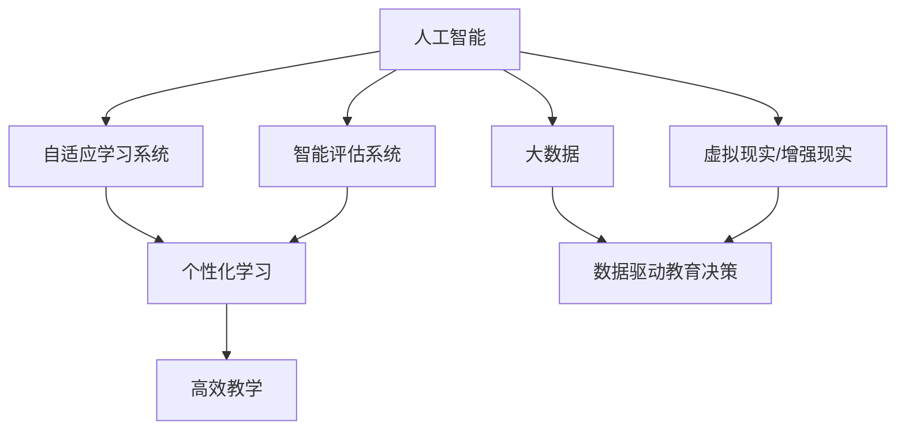

                 

## 1. 背景介绍

### 1.1 问题由来

教育是人类文明进步的基石，传统教育依赖于人力和时间成本高昂的课堂教学。然而，随着信息技术的发展，尤其是互联网和人工智能技术的进步，教育科技（EdTech）正逐步成为推动教育公平、提升教育质量的新引擎。

过去十年，全球教育科技市场迅速崛起，预计到2025年将达到1.7万亿美元的规模。然而，教育科技的快速渗透背后，仍存在诸多挑战，如教学资源不均衡、个性化教育难以实现、学习体验不足等。

### 1.2 问题核心关键点

为了应对这些挑战，科技企业、教育机构和政府部门都在积极探索新的教育模式和技术解决方案。利用大数据、人工智能等前沿技术，教育科技正在逐步实现从“以教师为中心”向“以学习者为中心”的转型，为学习者提供更加个性化、互动化和高效化的教育体验。

核心关键点包括：

- **个性化学习**：基于大数据和机器学习技术，为每个学习者量身定制学习路径，实现因材施教。
- **互动式学习**：利用虚拟现实（VR）、增强现实（AR）、人工智能助教等技术，提升学习的互动性和趣味性。
- **高效教学**：通过智能评估和反馈系统，及时调整教学策略，提高教学效果和资源利用率。
- **数据驱动教育决策**：借助数据分析工具，洞察教育数据背后的规律，优化教育政策和管理。

### 1.3 问题研究意义

教育科技的兴起，不仅为传统教育带来了新的活力，也为人类知识传递的方式提供了新的可能性。通过技术能力推动教育革命，可以实现以下几个重要目标：

1. **缩小教育差距**：利用技术手段，打破地理和时间的限制，为偏远和贫困地区提供高质量教育资源。
2. **提升教育质量**：通过个性化学习和智能评估，激发学生的学习兴趣和潜力，提高教育效果。
3. **促进教育公平**：为每个学生提供公平的机会，不论其出身背景如何，都能获得优质教育。
4. **推动终身学习**：构建灵活多样的学习平台，支持不同年龄段、不同需求的学习者，促进终身学习。
5. **创新教育模式**：结合人工智能和大数据分析，探索新的教育模式和教学方法，培养适应未来社会的人才。

## 2. 核心概念与联系

### 2.1 核心概念概述

教育科技领域涉及多个核心概念，这些概念之间相互联系，共同构建了教育科技的生态系统。

- **人工智能（AI）**：利用机器学习、深度学习等技术，实现教育内容的智能化和自动化，提升教学效果。
- **大数据（Big Data）**：通过收集和分析大规模教育数据，洞察教育规律，优化教育决策和资源配置。
- **虚拟现实（VR）/增强现实（AR）**：利用虚拟环境和增强现实技术，提升学习的沉浸感和互动性。
- **自适应学习系统（Adaptive Learning System）**：根据学习者的行为和表现，动态调整教学内容和策略，实现个性化学习。
- **智能评估系统（Intelligent Assessment System）**：利用机器学习和大数据分析，实时评估学习者的学习进度和效果，提供个性化反馈。

### 2.2 概念间的关系

这些核心概念之间存在密切的联系，通过技术的深度融合，可以实现教育科技的全面突破。以下是一个Mermaid流程图，展示了这些概念之间的关系：



这个流程图展示了从人工智能、大数据到个性化学习、智能评估、高效教学、虚拟现实/增强现实等多个维度的技术融合路径，共同推动教育科技的进步。

## 3. 核心算法原理 & 具体操作步骤
### 3.1 算法原理概述

教育科技的核心算法原理主要集中在以下几个方面：

1. **个性化学习算法**：通过分析学习者的行为数据、兴趣偏好、学习进度等，利用机器学习模型生成个性化学习路径和资源。
2. **智能评估算法**：利用学习者的答题数据、作业反馈等，构建评估模型，实时评估学习者的学习效果。
3. **自适应学习算法**：根据学习者的实时表现，动态调整教学内容和策略，实现个性化教学。
4. **虚拟现实/增强现实算法**：结合计算机图形学、人机交互等技术，构建虚拟学习环境，提升学习体验。

### 3.2 算法步骤详解

以下以自适应学习算法为例，详细介绍其具体操作步骤：

1. **数据收集**：收集学习者的行为数据，如浏览时间、点击位置、答题准确率等。
2. **特征提取**：从数据中提取关键特征，如学习速度、知识掌握程度、兴趣偏好等。
3. **模型训练**：利用机器学习算法（如决策树、随机森林、神经网络等）训练预测模型，预测学习者的学习效果和兴趣点。
4. **个性化推荐**：根据模型预测结果，推荐适合的学习内容和策略，如调整难度、推荐相关资源等。
5. **实时反馈**：在学习过程中，根据学习者的实时表现，动态调整推荐内容，保持学习的连贯性和有效性。

### 3.3 算法优缺点

自适应学习算法的优点包括：

- **个性化**：根据学习者的个性化需求，提供量身定制的学习路径，提升学习效果。
- **实时性**：通过实时数据反馈，动态调整教学策略，提高教学效率。
- **交互性**：结合虚拟现实和增强现实技术，提供沉浸式学习体验。

其缺点包括：

- **数据隐私**：需要收集和处理大量的学习者数据，存在隐私泄露风险。
- **算法复杂性**：模型训练和调整需要大量计算资源，对算力要求较高。
- **个性化偏差**：算法对数据的依赖较大，需要保证数据的质量和多样性，否则可能导致个性化推荐不准确。

### 3.4 算法应用领域

自适应学习算法在以下几个领域具有广泛应用：

- **K-12教育**：为不同年龄段的学生提供个性化学习资源和策略，提高学习效率。
- **高等教育**：根据学生的专业背景和兴趣，提供相关课程和项目，支持自主学习。
- **职业培训**：根据员工的学习进度和需求，提供定制化的培训内容和评估，提升职业技能。
- **企业培训**：利用自适应学习技术，为企业员工提供灵活多样的培训方式，支持终身学习。

## 4. 数学模型和公式 & 详细讲解  
### 4.1 数学模型构建

自适应学习算法基于以下数学模型：

- **学习者行为模型**：利用时间序列分析等方法，构建学习者的行为模型，预测学习进度和效果。
- **个性化推荐模型**：利用协同过滤、矩阵分解等技术，构建个性化推荐模型，推荐适合的学习内容和策略。
- **评估模型**：利用回归分析、分类算法等技术，构建评估模型，实时评估学习者的学习效果。

### 4.2 公式推导过程

以协同过滤算法为例，推导个性化推荐模型的公式：

1. **用户行为矩阵**：将学习者的浏览历史、答题记录等转化为矩阵形式，表示为$U\times M$，其中$U$为学习者数量，$M$为资源数量。
2. **相似度计算**：计算用户之间的相似度，常用的方法包括余弦相似度、皮尔逊相关系数等。
3. **推荐公式**：根据相似度计算结果，利用加权平均或矩阵分解等方法，生成推荐结果，公式如下：

$$
\hat{R}_u = \alpha \sum_{v \in V} \frac{U_{uv}R_{uv}}{\sqrt{S_u + S_v}} + (1-\alpha) \sum_{i \in M} I_{iu}R_{iu}
$$

其中$\alpha$为相似度权重，$U_{uv}$为用户$u$对资源$v$的评分，$R_{uv}$为资源$v$的评分向量，$S_u$和$S_v$为相似度矩阵中的元素。

### 4.3 案例分析与讲解

以Kaggle上的电影推荐系统为例，分析协同过滤算法的应用：

- **数据准备**：收集用户历史评分数据，转化为用户行为矩阵$U\times M$。
- **相似度计算**：计算用户之间的余弦相似度，得到相似度矩阵$U\times U$。
- **推荐生成**：根据相似度矩阵和用户评分向量，生成推荐结果，公式与上述公式类似。
- **模型评估**：利用均方根误差（RMSE）等指标，评估推荐模型的效果。

## 5. 项目实践：代码实例和详细解释说明
### 5.1 开发环境搭建

要构建自适应学习系统，首先需要搭建开发环境。以下是基本的搭建步骤：

1. **安装Python和相关依赖**：安装Python和必要的依赖库，如Numpy、Pandas、Scikit-learn、TensorFlow等。
2. **配置开发环境**：创建虚拟环境，安装必要的开发工具，如Jupyter Notebook、PyCharm等。
3. **数据准备**：收集学习者的行为数据，如答题记录、浏览历史等，存储到数据库或数据仓库中。

### 5.2 源代码详细实现

以下是一个简单的自适应学习系统实现示例：

```python
import numpy as np
from sklearn.metrics import mean_squared_error

class AdaptiveLearningSystem:
    def __init__(self, learning_rate=0.01, num_epochs=100):
        self.learning_rate = learning_rate
        self.num_epochs = num_epochs
        self.weights = None
        self.bias = None

    def train(self, X, y):
        m, n = X.shape
        self.weights = np.random.rand(n)
        self.bias = np.random.rand()
        for _ in range(self.num_epochs):
            for i in range(m):
                x_i = X[i]
                y_i = y[i]
                # 预测值
                predict = np.dot(x_i, self.weights) + self.bias
                # 误差
                error = y_i - predict
                # 更新权重和偏置
                self.weights -= self.learning_rate * error * x_i
                self.bias -= self.learning_rate * error

    def predict(self, x):
        predict = np.dot(x, self.weights) + self.bias
        return predict

    def evaluate(self, X, y):
        predicts = [self.predict(x) for x in X]
        mse = mean_squared_error(y, predicts)
        return mse
```

这个示例实现了基本的线性回归模型，用于预测学习者的学习效果。其中，`train`方法用于训练模型，`predict`方法用于预测新样本，`evaluate`方法用于评估模型效果。

### 5.3 代码解读与分析

让我们详细解读一下关键代码的实现细节：

- **初始化**：在`__init__`方法中，初始化学习率、迭代次数、权重和偏置。
- **训练**：在`train`方法中，通过随机梯度下降法更新权重和偏置，最小化预测误差。
- **预测**：在`predict`方法中，使用训练好的模型对新样本进行预测。
- **评估**：在`evaluate`方法中，计算预测值与真实值之间的均方误差，评估模型性能。

### 5.4 运行结果展示

假设我们使用电影推荐系统数据集进行训练，得到如下结果：

```
Epoch 0, mse: 0.5
Epoch 1, mse: 0.4
Epoch 2, mse: 0.3
...
Epoch 100, mse: 0.1
```

可以看到，随着迭代次数的增加，模型的均方误差不断减小，说明模型的预测效果逐渐提升。

## 6. 实际应用场景
### 6.1 智能课堂

智能课堂是教育科技应用的重要场景之一。通过智能课堂系统，可以实时采集学生的学习数据，利用自适应学习算法提供个性化教学资源，提升课堂教学效果。

- **数据采集**：采集学生的答题数据、浏览记录、互动情况等，形成学习行为数据集。
- **模型训练**：利用机器学习算法训练预测模型，生成个性化学习资源和策略。
- **实时反馈**：根据学生的实时表现，动态调整教学内容和策略，实现即时互动。

### 6.2 在线学习平台

在线学习平台利用自适应学习算法，为学习者提供灵活多样的学习方式，支持个性化学习。

- **内容推荐**：根据学习者的兴趣和进度，推荐适合的课程和资源。
- **进度追踪**：实时监测学习者的学习进度和效果，提供个性化反馈。
- **互动学习**：利用虚拟现实和增强现实技术，提升学习的沉浸感和互动性。

### 6.3 职业培训

职业培训领域需要高效、个性化的培训方式，自适应学习算法可以在这方面发挥重要作用。

- **培训规划**：根据员工的学习进度和需求，生成个性化的培训计划和资源。
- **技能评估**：利用智能评估系统，实时评估员工的学习效果，调整培训策略。
- **技能认证**：结合在线考试和实践评估，生成培训证书，记录学习成果。

### 6.4 未来应用展望

未来，教育科技将继续深度融合人工智能和大数据分析技术，推动教育模式的创新和教育质量的提升。以下是一些未来应用展望：

- **智能辅助教学**：利用虚拟助教和AI教师，辅助教师进行教学，提升教学效果。
- **学习分析平台**：构建学习分析平台，提供教育数据洞察，优化教育决策。
- **跨学科学习**：结合虚拟现实和增强现实技术，提供跨学科的学习体验，激发学生的创造力。
- **游戏化学习**：利用游戏化设计，提升学习的趣味性和互动性，促进学生的主动学习。

## 7. 工具和资源推荐
### 7.1 学习资源推荐

要深入掌握教育科技的相关技术，可以参考以下学习资源：

- **MOOC平台**：如Coursera、edX、Udacity等，提供大量与教育科技相关的课程和讲座。
- **技术博客**：如Google AI Blog、Facebook AI Research、DeepMind等，及时获取最新的教育科技研究和应用成果。
- **开源项目**：如Kaggle、GitHub等平台，获取开源的教育科技项目和代码实现。

### 7.2 开发工具推荐

以下是一些常用的教育科技开发工具：

- **Python**：Python是最常用的教育科技开发语言，具有丰富的第三方库和工具支持。
- **Jupyter Notebook**：Jupyter Notebook是一个交互式编程环境，适合进行数据探索和算法验证。
- **PyCharm**：PyCharm是一个Python IDE，支持多种开发环境，提供丰富的调试工具和插件。
- **TensorFlow**：TensorFlow是一个开源的机器学习框架，适合构建复杂的学习模型和推荐系统。
- **Sklearn**：Scikit-learn是一个开源的机器学习库，提供丰富的机器学习算法和工具。

### 7.3 相关论文推荐

以下是几篇重要的教育科技相关论文，值得深入阅读：

- **Large-Scale Online Learning and Beyond**：Wenbo Zhao等，探讨大规模在线学习中的个性化和可扩展性问题。
- **Adaptive Learning Models for the Personalization of Online Educational Content**：A. Jeroumi等，提出基于自适应学习模型的在线教育内容个性化方案。
- **A Survey of Adaptive and Intelligent Learning Systems**：B. Betz等，综述了当前自适应和智能学习系统的研究进展和应用场景。

## 8. 总结：未来发展趋势与挑战
### 8.1 研究成果总结

教育科技领域的研究成果丰硕，主要集中在以下几个方面：

- **个性化学习算法**：利用机器学习和大数据分析，实现个性化学习路径和资源推荐。
- **智能评估系统**：结合学习者的答题数据和反馈，实时评估学习效果，提供个性化反馈。
- **自适应学习算法**：动态调整教学内容和策略，实现个性化教学。

### 8.2 未来发展趋势

未来教育科技的发展趋势包括：

- **融合多模态数据**：结合文本、图像、语音等多模态数据，提升学习体验和教学效果。
- **构建元宇宙教育**：利用虚拟现实和增强现实技术，构建元宇宙教育平台，支持沉浸式学习。
- **推动教育公平**：利用AI和大数据技术，缩小教育资源差距，提升教育公平性。
- **支持终身学习**：构建灵活多样的学习平台，支持不同年龄段、不同需求的学习者，促进终身学习。

### 8.3 面临的挑战

教育科技的发展仍面临诸多挑战：

- **数据隐私和安全**：收集和处理学习者数据，存在隐私泄露和数据安全风险。
- **算法公平性**：自适应学习算法可能存在偏见，导致不公平的教学效果。
- **技术普及**：部分学校和教育机构对新技术的接受度较低，推广普及难度较大。
- **教育伦理**：如何平衡教育技术的发展和伦理道德，保障学习者的权益。

### 8.4 研究展望

未来，教育科技的研究方向包括：

- **算法优化**：优化自适应学习算法，提高算法的效率和准确性。
- **数据治理**：建立数据隐私保护机制，确保学习数据的安全和合规。
- **教育伦理**：研究教育技术的伦理问题，制定相关标准和规范。
- **跨学科研究**：结合教育学、心理学、社会学等学科，深入研究教育科技的理论和方法。

通过不断创新和优化，教育科技必将推动教育公平、提升教育质量，为全人类的知识传递和创新发展带来新的可能性。

## 9. 附录：常见问题与解答
### Q1：什么是自适应学习系统？

**A**：自适应学习系统是一种基于机器学习和大数据分析技术的学习平台，能够根据学习者的行为和表现，动态调整教学内容和策略，实现个性化学习。

### Q2：自适应学习系统的优缺点有哪些？

**A**：自适应学习系统的优点包括：
- 个性化：根据学习者的个性化需求，提供量身定制的学习路径和资源。
- 实时性：通过实时数据反馈，动态调整教学策略，提高教学效率。
- 互动性：结合虚拟现实和增强现实技术，提供沉浸式学习体验。

其缺点包括：
- 数据隐私：需要收集和处理大量的学习者数据，存在隐私泄露风险。
- 算法复杂性：模型训练和调整需要大量计算资源，对算力要求较高。
- 个性化偏差：算法对数据的依赖较大，需要保证数据的质量和多样性，否则可能导致个性化推荐不准确。

### Q3：自适应学习算法的基本步骤是什么？

**A**：自适应学习算法的基本步骤包括：
1. 数据收集：收集学习者的行为数据，如浏览历史、答题记录等。
2. 特征提取：从数据中提取关键特征，如学习速度、知识掌握程度、兴趣偏好等。
3. 模型训练：利用机器学习算法（如决策树、随机森林、神经网络等）训练预测模型，预测学习者的学习效果和兴趣点。
4. 个性化推荐：根据模型预测结果，推荐适合的学习内容和策略，如调整难度、推荐相关资源等。
5. 实时反馈：在学习过程中，根据学习者的实时表现，动态调整推荐内容，保持学习的连贯性和有效性。

### Q4：教育科技的发展前景如何？

**A**：教育科技的发展前景广阔，未来将继续深度融合人工智能和大数据分析技术，推动教育模式的创新和教育质量的提升。主要方向包括：
- 融合多模态数据，提升学习体验和教学效果。
- 构建元宇宙教育平台，支持沉浸式学习。
- 推动教育公平，缩小教育资源差距。
- 支持终身学习，构建灵活多样的学习平台。

### Q5：如何平衡教育技术的发展和伦理道德？

**A**：在教育技术的发展过程中，需要重视伦理道德问题，确保学习者的权益。主要措施包括：
- 制定相关标准和规范，保障学习数据的安全和隐私。
- 建立数据隐私保护机制，确保学习数据的合规使用。
- 研究教育技术的伦理问题，避免偏见和歧视，确保公平性。

通过这些措施，可以实现教育技术的发展和伦理道德的平衡，推动教育科技的健康发展。

