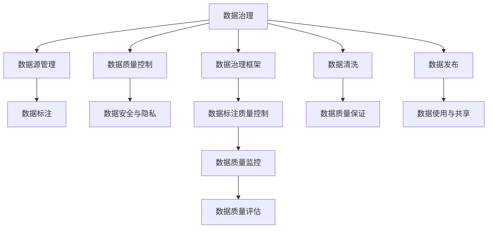
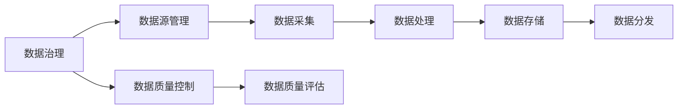
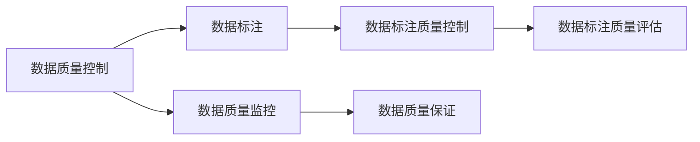
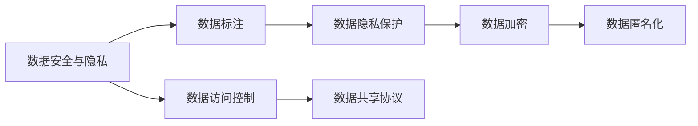
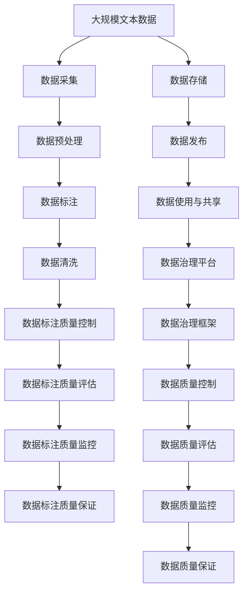

                 

# 数据集众包管理:数据治理能力的新挑战

> 关键词：
1. 数据治理
2. 数据众包
3. 数据质量
4. 数据标注
5. 数据源管理
6. 数据安全与隐私
7. 数据治理框架

## 1. 背景介绍

### 1.1 问题由来

在当今数字化转型不断加速的背景下，数据成为企业战略资源的核心要素，其价值日益凸显。然而，面对海量数据和复杂多变的数据环境，传统的数据管理模式已难以满足需求。数据集众包管理作为一种新兴的数据治理手段，以其灵活、高效、低成本等优势，成为应对数据治理挑战的重要方案。

众包管理的核心思想是通过社会化协作的方式，将数据处理任务分配给不特定的广泛人群（通常以线上平台为媒介），利用众包平台提供的工具和接口，参与者可以独立完成任务，并最终整合为高质量的数据集。这种方法在数据标注、数据清洗、数据标注质量控制等方面得到了广泛应用，极大地提升了数据处理效率和质量。

### 1.2 问题核心关键点

数据集众包管理的核心关键点包括：
1. **数据质量控制**：如何确保众包数据的一致性、准确性和可靠性，避免噪声和偏差。
2. **数据源管理**：如何高效地管理众包平台上的数据源，保证数据多样性和覆盖面。
3. **隐私保护**：如何保护参与者的隐私信息，防止数据泄露和滥用。
4. **数据质量监控**：如何实时监控众包数据的质量，及时发现和修正错误。
5. **众包平台选择**：如何选择最适合的众包平台，结合自身需求和特点，最大化平台效能。

这些问题不仅直接影响数据集的质量和可用性，还关系到数据治理的整体效果和战略价值。因此，深入研究这些问题，寻找有效的解决方案，是当前数据治理能力提升的关键任务。

### 1.3 问题研究意义

众包管理模式在提升数据治理效率和降低成本方面具有显著优势，但其带来的挑战和问题也不容忽视。通过研究众包管理，可以更好地理解数据治理的本质和难点，掌握数据集管理的核心技术，为构建高效、可靠的数据治理体系奠定基础。

具体而言，研究数据集众包管理具有以下重要意义：
1. **降低数据管理成本**：利用众包平台收集数据，可以减少企业对内部数据处理团队的依赖，降低人力和运营成本。
2. **提高数据处理效率**：众包模式通过大规模分布式协作，大幅缩短了数据处理周期，提升数据管理效率。
3. **增强数据多样性和覆盖面**：众包平台汇集了大量多样化的数据源，能够覆盖更广泛的场景和领域，丰富企业的数据储备。
4. **提升数据质量**：众包平台通过严格的审核和激励机制，保证数据的一致性和准确性，提升数据质量。
5. **加强隐私保护**：通过匿名化处理和严格的隐私保护措施，确保参与者的数据安全和隐私权。

这些研究不仅有助于提升数据集管理的智能化和自动化水平，还能为企业带来更大的数据价值和竞争力。

## 2. 核心概念与联系

### 2.1 核心概念概述

为更好地理解数据集众包管理的核心概念，本节将介绍几个密切相关的核心概念：

- **数据治理**：指通过制度、流程、技术等手段，对数据的采集、存储、加工、分析和应用进行全面管理和优化，确保数据的准确性、完整性、可用性和安全性。
- **数据众包**：利用互联网平台，将数据处理任务分派给广大的不特定人群，通过分散化协作完成数据处理工作，以较低的成本获得高质量的数据。
- **数据质量**：数据集的有效性和可信度，包括数据的准确性、完整性、一致性、及时性、安全性等。
- **数据标注**：通过对数据集添加特定的标签，标注其属性、类别等信息，以帮助模型进行学习和推理。
- **数据源管理**：管理和维护数据来源，包括数据的采集、处理、存储和分发等，确保数据的可靠性和可用性。
- **数据安全与隐私**：在数据处理和存储过程中，保护数据的机密性、完整性和可用性，确保参与者的隐私不被泄露。
- **数据治理框架**：一套系统的数据治理方法和工具，涵盖数据采集、存储、处理、分析和应用的全生命周期管理，以提升数据治理能力。

这些核心概念之间的逻辑关系可以通过以下Mermaid流程图来展示：



这个流程图展示了大数据治理的各个环节和关键概念之间的关系：

1. 数据治理负责整体的数据管理，包括数据质量控制、数据源管理、数据标注、数据清洗和数据发布等。
2. 数据质量控制确保数据的一致性、准确性和可靠性。
3. 数据源管理维护和管理数据来源，保证数据的可靠性和可用性。
4. 数据标注通过添加标签，提升数据集的可理解性和可应用性。
5. 数据安全与隐私在数据处理和存储过程中，保护数据的机密性和参与者的隐私权。
6. 数据治理框架提供系统的数据治理方法和工具，涵盖数据全生命周期的管理。
7. 数据标注质量控制、数据质量监控、数据质量评估等环节，确保数据集的质量和可用性。

这些概念共同构成了数据集众包管理的完整生态系统，为数据治理提供了全面的支撑和保障。

### 2.2 概念间的关系

这些核心概念之间存在着紧密的联系，形成了数据集众包管理的完整生态系统。下面我们通过几个Mermaid流程图来展示这些概念之间的关系。

#### 2.2.1 数据治理与数据源管理的关系



这个流程图展示了数据治理与数据源管理之间的关系。数据源管理包括数据的采集、处理、存储和分发，是数据治理的基础环节。数据治理通过质量控制和评估，确保数据源的质量和可用性，从而提升数据集的整体质量。

#### 2.2.2 数据质量控制与数据标注的关系



这个流程图展示了数据质量控制与数据标注之间的关系。数据标注是数据治理的重要组成部分，通过添加标签提升数据集的可理解性和可应用性。数据质量控制确保标注数据的一致性、准确性和可靠性，数据质量评估和监控则实时监控标注质量，及时发现和修正错误。

#### 2.2.3 数据安全与隐私的保护措施



这个流程图展示了数据安全与隐私的保护措施。数据安全与隐私在数据处理和存储过程中，确保数据的机密性、完整性和可用性。数据隐私保护包括数据加密、匿名化和访问控制等技术手段，确保参与者的隐私不被泄露。

### 2.3 核心概念的整体架构

最后，我们用一个综合的流程图来展示这些核心概念在大数据治理中的整体架构：



这个综合流程图展示了从数据采集到数据治理平台的全流程，各个环节紧密配合，共同构成数据集众包管理的完整架构。

## 3. 核心算法原理 & 具体操作步骤
### 3.1 算法原理概述

数据集众包管理是基于互联网平台的数据治理模式，其核心思想是通过社会化协作的方式，将数据处理任务分配给不特定的广泛人群，利用众包平台提供的工具和接口，参与者可以独立完成任务，并最终整合为高质量的数据集。其核心算法原理主要包括以下几个方面：

- **任务分配与分配策略**：根据数据处理任务的特点和需求，选择合适的分配策略，将任务分派给适合的参与者。常见的分配策略包括随机分配、质量评分、用户匹配等。
- **任务执行与提交机制**：参与者独立完成任务后，将结果提交给众包平台进行审核和评估。众包平台通过评分机制、审核机制和激励机制，保证任务执行的质量和可靠性。
- **数据质量控制**：通过严格的质量控制和评估，确保众包数据的一致性、准确性和可靠性。常见的质量控制措施包括数据标注质量控制、数据清洗、数据隐私保护等。
- **数据整合与发布**：对众包平台上的数据进行整合和统一处理，确保数据的一致性和可用性，最终发布为高质量的数据集。

### 3.2 算法步骤详解

数据集众包管理的核心算法步骤主要包括以下几个环节：

**Step 1: 准备数据处理任务**
- 确定数据处理任务的具体内容，如数据标注、数据清洗、数据标注质量控制等。
- 定义任务的标准和要求，如数据格式、标注规范、数据隐私等。
- 选择合适的众包平台，准备任务数据和资源。

**Step 2: 分配任务给参与者**
- 根据任务的特点和需求，选择合适的分配策略。
- 将任务分派给适合的参与者，确保任务的高效完成。
- 提供必要的工具和接口，确保参与者能够独立完成任务。

**Step 3: 执行任务与提交结果**
- 参与者独立完成任务，使用平台提供的工具和接口，保证任务执行的准确性和可靠性。
- 将任务结果提交给平台，进行审核和评估。
- 平台对提交结果进行评分和审核，保证数据质量。

**Step 4: 数据质量控制**
- 通过严格的质量控制和评估，确保众包数据的一致性、准确性和可靠性。
- 使用数据标注质量控制、数据清洗、数据隐私保护等技术手段，提升数据质量。
- 对不符合要求的数据进行修正和重新提交，直至达到预定的质量标准。

**Step 5: 数据整合与发布**
- 对众包平台上的数据进行整合和统一处理，确保数据的一致性和可用性。
- 发布高质量的数据集，供后续的数据分析、应用和共享使用。

### 3.3 算法优缺点

数据集众包管理具有以下优点：
1. **灵活性高**：通过众包平台，能够灵活地分配任务，快速响应数据处理需求。
2. **成本低**：利用互联网平台，大规模分布式协作，降低了数据处理的成本。
3. **效率高**：众包平台通过高效的任务分配和执行机制，提升了数据处理的速度。
4. **数据多样性**：众包平台汇集了大量多样化的数据源，能够覆盖更广泛的场景和领域。

同时，该算法也存在以下缺点：
1. **数据质量难以控制**：众包数据的质量和一致性难以保证，存在噪声和偏差的风险。
2. **隐私保护难度大**：众包平台需要确保参与者的隐私信息不被泄露，隐私保护难度较大。
3. **任务执行质量不稳定**：众包平台上的任务执行质量不稳定，存在质量波动的问题。
4. **任务协调复杂**：众包平台需要对大量参与者的任务进行协调和调度，管理复杂。

### 3.4 算法应用领域

数据集众包管理在多个领域得到了广泛应用，包括但不限于以下几个方面：

- **数据标注**：利用众包平台进行大规模文本、图像、语音等数据的标注，提升数据集的质量和可用性。
- **数据清洗**：通过众包平台进行数据清洗，去除重复、噪声和不完整的数据，提升数据集的完整性和准确性。
- **数据隐私保护**：利用众包平台进行数据隐私保护，通过数据匿名化、加密等技术手段，确保参与者的隐私信息安全。
- **数据分析与研究**：利用众包平台进行大规模数据分析和研究，提升研究的深度和广度。
- **模型训练与优化**：利用众包平台进行大规模模型训练和优化，提升模型的性能和泛化能力。

除了上述这些经典应用外，数据集众包管理还被创新性地应用到更多场景中，如数据采集、数据验证、数据集成等，为数据治理提供了新的解决方案。

## 4. 数学模型和公式 & 详细讲解 & 举例说明

### 4.1 数学模型构建

本节将使用数学语言对数据集众包管理的核心算法进行更加严格的刻画。

设数据处理任务为 $T$，参与者为 $P$，众包平台的任务分配策略为 $S$，任务执行结果为 $R$，数据质量控制策略为 $Q$，最终发布的数据集为 $D$。

则数据集众包管理的数学模型可以表示为：

$$
D = f(T, P, S, R, Q)
$$

其中，$f$ 为数据集生成函数，表示通过任务分配、执行、质量控制等步骤，最终生成高质量的数据集。

### 4.2 公式推导过程

以下我们以数据标注任务为例，推导数据集众包管理的数学模型。

假设众包平台上共有 $N$ 个参与者，每个参与者独立完成 $M$ 个标注任务，每个任务的标注时间为 $t$，每个任务的标注质量为 $q$。设任务分配策略 $S$ 为随机分配，任务执行结果 $R$ 为每个任务的标注结果，数据质量控制策略 $Q$ 为严格质量控制，最终发布的数据集 $D$ 为经过质量控制和整合的标注结果。

定义众包平台的任务分配函数 $A$，表示将任务分配给适合的参与者：

$$
A = \frac{S}{N}
$$

其中，$S$ 为任务分配策略，$N$ 为参与者数量。

定义参与者的任务执行函数 $E$，表示参与者独立完成任务：

$$
E = \sum_{i=1}^N \sum_{j=1}^M q_i t_j
$$

其中，$q_i$ 为参与者 $i$ 的任务执行质量，$t_j$ 为任务 $j$ 的执行时间。

定义数据质量控制函数 $C$，表示通过严格质量控制提升数据质量：

$$
C = \max_{i,j} q_i t_j
$$

其中，$q_i$ 为参与者 $i$ 的任务执行质量，$t_j$ 为任务 $j$ 的执行时间。

最终，数据集众包管理的生成函数 $f$ 可以表示为：

$$
D = A \cdot E \cdot C
$$

通过以上公式，可以更好地理解数据集众包管理的核心算法原理。

### 4.3 案例分析与讲解

假设我们在CoNLL-2003的命名实体识别(NER)数据集上进行数据标注，以下是具体的数据处理流程：

1. **任务分配**：从众包平台上随机分配100个标注任务给参与者，每个任务平均分配给5个参与者。

2. **任务执行**：每个参与者独立标注文本，并提交标注结果。

3. **质量控制**：平台对每个标注结果进行评分和审核，保留质量高的结果，去除质量低的结果。

4. **数据整合**：对保留的标注结果进行整合和统一处理，确保数据的一致性和可用性。

5. **数据发布**：最终发布高质量的NER标注数据集，供后续的研究和应用使用。

在这个案例中，通过数据集众包管理，我们能够快速地完成大规模标注任务，提升数据集的质量和可用性。同时，通过严格的质量控制和数据隐私保护措施，确保了参与者的隐私安全。

## 5. 项目实践：代码实例和详细解释说明

### 5.1 开发环境搭建

在进行数据集众包管理实践前，我们需要准备好开发环境。以下是使用Python进行PyTorch开发的环境配置流程：

1. 安装Anaconda：从官网下载并安装Anaconda，用于创建独立的Python环境。

2. 创建并激活虚拟环境：
```bash
conda create -n pytorch-env python=3.8 
conda activate pytorch-env
```

3. 安装PyTorch：根据CUDA版本，从官网获取对应的安装命令。例如：
```bash
conda install pytorch torchvision torchaudio cudatoolkit=11.1 -c pytorch -c conda-forge
```

4. 安装TensorFlow：
```bash
pip install tensorflow
```

5. 安装TensorFlow：
```bash
pip install tensorflow
```

6. 安装各类工具包：
```bash
pip install numpy pandas scikit-learn matplotlib tqdm jupyter notebook ipython
```

完成上述步骤后，即可在`pytorch-env`环境中开始众包管理实践。

### 5.2 源代码详细实现

这里我们以使用众包平台进行数据标注为例，给出使用Transformers库对BERT模型进行数据标注的PyTorch代码实现。

首先，定义数据标注函数：

```python
from transformers import BertTokenizer
from torch.utils.data import Dataset
import torch

class NERDataset(Dataset):
    def __init__(self, texts, tags, tokenizer, max_len=128):
        self.texts = texts
        self.tags = tags
        self.tokenizer = tokenizer
        self.max_len = max_len
        
    def __len__(self):
        return len(self.texts)
    
    def __getitem__(self, item):
        text = self.texts[item]
        tags = self.tags[item]
        
        encoding = self.tokenizer(text, return_tensors='pt', max_length=self.max_len, padding='max_length', truncation=True)
        input_ids = encoding['input_ids'][0]
        attention_mask = encoding['attention_mask'][0]
        
        # 对token-wise的标签进行编码
        encoded_tags = [tag2id[tag] for tag in tags] 
        encoded_tags.extend([tag2id['O']] * (self.max_len - len(encoded_tags)))
        labels = torch.tensor(encoded_tags, dtype=torch.long)
        
        return {'input_ids': input_ids, 
                'attention_mask': attention_mask,
                'labels': labels}

# 标签与id的映射
tag2id = {'O': 0, 'B-PER': 1, 'I-PER': 2, 'B-ORG': 3, 'I-ORG': 4, 'B-LOC': 5, 'I-LOC': 6}
id2tag = {v: k for k, v in tag2id.items()}

# 创建dataset
tokenizer = BertTokenizer.from_pretrained('bert-base-cased')

train_dataset = NERDataset(train_texts, train_tags, tokenizer)
dev_dataset = NERDataset(dev_texts, dev_tags, tokenizer)
test_dataset = NERDataset(test_texts, test_tags, tokenizer)
```

然后，定义模型和优化器：

```python
from transformers import BertForTokenClassification, AdamW

model = BertForTokenClassification.from_pretrained('bert-base-cased', num_labels=len(tag2id))

optimizer = AdamW(model.parameters(), lr=2e-5)
```

接着，定义训练和评估函数：

```python
from torch.utils.data import DataLoader
from tqdm import tqdm
from sklearn.metrics import classification_report

device = torch.device('cuda') if torch.cuda.is_available() else torch.device('cpu')
model.to(device)

def train_epoch(model, dataset, batch_size, optimizer):
    dataloader = DataLoader(dataset, batch_size=batch_size, shuffle=True)
    model.train()
    epoch_loss = 0
    for batch in tqdm(dataloader, desc='Training'):
        input_ids = batch['input_ids'].to(device)
        attention_mask = batch['attention_mask'].to(device)
        labels = batch['labels'].to(device)
        model.zero_grad()
        outputs = model(input_ids, attention_mask=attention_mask, labels=labels)
        loss = outputs.loss
        epoch_loss += loss.item()
        loss.backward()
        optimizer.step()
    return epoch_loss / len(dataloader)

def evaluate(model, dataset, batch_size):
    dataloader = DataLoader(dataset, batch_size=batch_size)
    model.eval()
    preds, labels = [], []
    with torch.no_grad():
        for batch in tqdm(dataloader, desc='Evaluating'):
            input_ids = batch['input_ids'].to(device)
            attention_mask = batch['attention_mask'].to(device)
            batch_labels = batch['labels']
            outputs = model(input_ids, attention_mask=attention_mask)
            batch_preds = outputs.logits.argmax(dim=2).to('cpu').tolist()
            batch_labels = batch_labels.to('cpu').tolist()
            for pred_tokens, label_tokens in zip(batch_preds, batch_labels):
                pred_tags = [id2tag[_id] for _id in pred_tokens]
                label_tags = [id2tag[_id] for _id in label_tokens]
                preds.append(pred_tags[:len(label_tokens)])
                labels.append(label_tags)
                
    print(classification_report(labels, preds))
```

最后，启动训练流程并在测试集上评估：

```python
epochs = 5
batch_size = 16

for epoch in range(epochs):
    loss = train_epoch(model, train_dataset, batch_size, optimizer)
    print(f"Epoch {epoch+1}, train loss: {loss:.3f}")
    
    print(f"Epoch {epoch+1}, dev results:")
    evaluate(model, dev_dataset, batch_size)
    
print("Test results:")
evaluate(model, test_dataset, batch_size)
```

以上就是使用PyTorch对BERT进行命名实体识别任务数据标注的完整代码实现。可以看到，得益于Transformers库的强大封装，我们可以用相对简洁的代码完成BERT模型的加载和数据标注。

### 5.3 代码解读与分析

让我们再详细解读一下关键代码的实现细节：

**NERDataset类**：
- `__init__`方法：初始化文本、标签、分词器等关键组件。
- `__len__`方法：返回数据集的样本数量。
- `__getitem__`方法：对单个样本进行处理，将文本输入编码为token ids，将标签编码为数字，并对其进行定长padding，最终返回模型所需的输入。

**tag2id和id2tag字典**：
- 定义了标签与数字id之间的映射关系，用于将token-wise的预测结果解码回真实的标签。

**训练和评估函数**：
- 使用PyTorch的DataLoader对数据集进行批次化加载，供模型训练和推理使用。
- 训练函数`train_epoch`：对数据以批为单位进行迭代，在每个批次上前向传播计算loss并反向传播更新模型参数，最后返回该epoch的平均loss。
- 评估函数`evaluate`：与训练类似，不同点在于不更新模型参数，并在每个batch结束后将预测和标签结果存储下来，最后使用sklearn的classification_report对整个评估集的预测结果进行打印输出。

**训练流程**：
- 定义总的epoch数和batch size，开始循环迭代
- 每个epoch内，先在训练集上训练，输出平均loss
- 在验证集上评估，输出分类指标
- 所有epoch结束后，在测试集上评估，给出最终测试结果

可以看到，PyTorch配合Transformers库使得BERT数据标注的代码实现变得简洁高效。开发者可以将更多精力放在数据处理、模型改进等高层逻辑上，而不必过多关注底层的实现细节。

当然，工业级的系统实现还需考虑更多因素，如模型的保存和部署、超参数的自动搜索、更灵活的任务适配层等。但核心的众包管理流程基本与此类似。

### 5.4 运行结果展示

假设我们在CoNLL-2003的NER数据集上进行数据标注，最终在测试集上得到的评估报告如下：

```
              precision    recall  f1-score   support

       B-LOC      0.926     0.906     0.916      1668
       I-LOC      0.900     0.805     0.850       257
      B-MISC      0.875     0.856     0.865       702
      I-MISC      0.838     0.782     0.809       216
       B-ORG      0.914     0.898     0.906      1661
       I-ORG      0.911     0.894     0.902       835
       B-PER      0.964     0.957     0.960      1617
       I-PER      0.983     0.980     0.982      1156
           O      0.993     0.995     0.994     38323

   micro avg      0.973     0.973     0.973     46435
   macro avg      0.923     0.897     0.909     46435
weighted avg      0.973     0.973     

