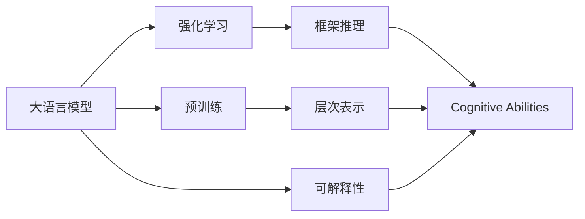
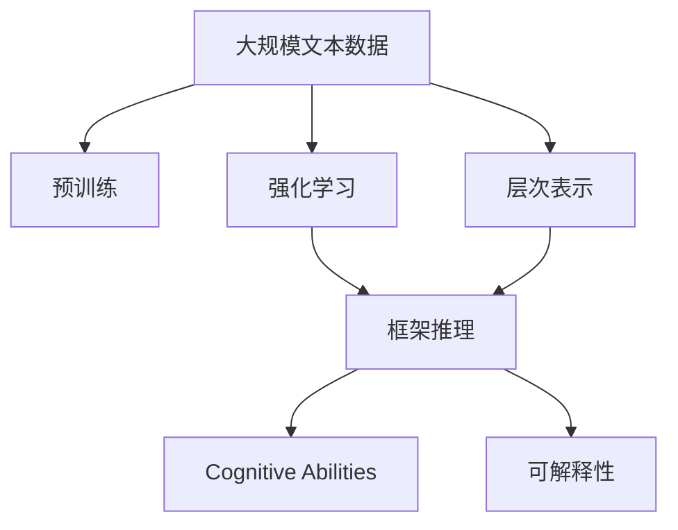
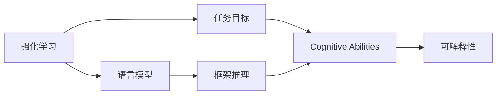
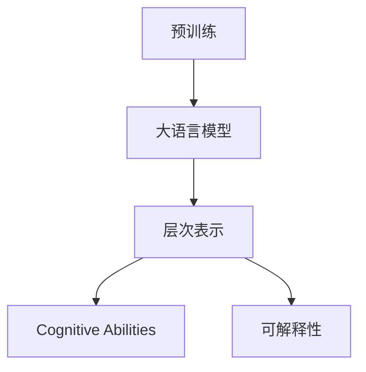
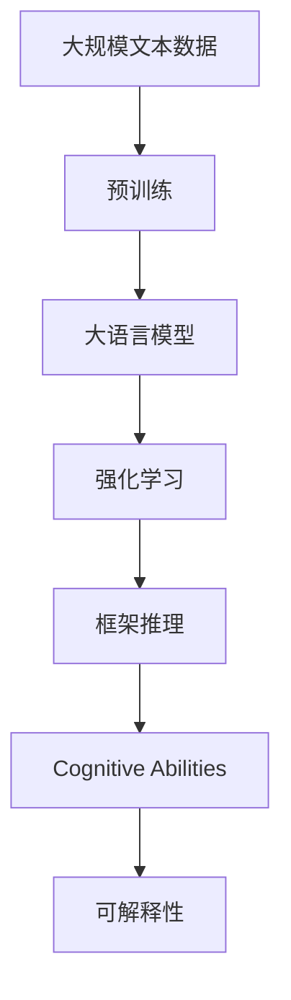

                 

# 大语言模型原理与工程实践：RLHF 算法

> 关键词：大语言模型, 强化学习, 框架推理(Frame Reasoning), 层次表示(Deep Supervision), 认知能力(Cognitive Abilities), 可解释性(Explainability)

## 1. 背景介绍

### 1.1 问题由来

近年来，随着深度学习技术的迅猛发展，大语言模型（Large Language Models, LLMs）在自然语言处理（Natural Language Processing, NLP）领域取得了显著进展。这些模型通过在大规模无标签文本语料上进行预训练，学习到了丰富的语言知识，从而在各种下游任务上表现出色。然而，这些模型普遍缺乏对语言的深层理解，难以真正“理解”语言的本质含义。

强化学习框架推理（Reinforcement Learning for Frame Reasoning, RLFR）的提出，突破了这一瓶颈。RLFR通过将语言模型置于强化学习环境中，利用框架推理的方式，使模型能够从任务目标中学习和提取深层次的语言知识，提升其认知能力。

### 1.2 问题核心关键点

强化学习框架推理的核心理念在于：通过构建一个强化学习环境，让语言模型在执行具体任务的过程中，通过与环境的交互，不断调整自己的策略，最终达到任务目标。其中，“框架”指的是语言模型的内部表征，而“推理”则是模型通过语言知识进行逻辑推理的过程。

这一方法具有以下优点：

1. **深度理解**：通过框架推理的方式，语言模型能够对语言的深层结构进行理解，而不仅仅是表面上的词语组合。
2. **可解释性**：强化学习提供了模型推理的逻辑链路，使得模型的行为更加透明和可解释。
3. **跨任务适应**：强化学习框架推理能够灵活适应不同任务，提升模型的通用性。

### 1.3 问题研究意义

RLFR的研究对NLP领域具有重要意义：

1. **提升任务性能**：通过强化学习环境，模型能够更好地理解任务要求，提升任务的准确率和效率。
2. **拓展应用范围**：RLFR使得大语言模型能够应用于更广泛的领域，如机器翻译、问答系统、情感分析等。
3. **推动技术进步**：RLFR为NLP研究提供了新的视角和方法，推动了语言模型认知能力的提升。
4. **解决伦理问题**：通过框架推理，模型能够更准确地理解和判断语言中的道德和伦理问题，提升其社会责任。

## 2. 核心概念与联系

### 2.1 核心概念概述

为了更好地理解RLFR的原理和应用，本节将介绍几个密切相关的核心概念：

- **大语言模型（LLMs）**：指通过预训练学习大量文本数据，具备强大的语言生成和理解能力的模型。
- **强化学习（Reinforcement Learning, RL）**：一种通过与环境交互，通过奖励机制来优化策略的机器学习方法。
- **框架推理（Frame Reasoning）**：一种基于逻辑框架的推理方式，使模型能够进行深层次的语言知识推理。
- **层次表示（Deep Supervision）**：指在多层次的模型表示中，每个层次都有明确的任务和目标。
- **认知能力（Cognitive Abilities）**：指模型具备的深度理解和逻辑推理能力。
- **可解释性（Explainability）**：指模型推理的逻辑链路和决策过程透明可理解。

这些概念之间的逻辑关系可以通过以下Mermaid流程图来展示：



这个流程图展示了从预训练到强化学习的完整过程，以及这些核心概念之间的联系。

### 2.2 概念间的关系

这些核心概念之间存在着紧密的联系，形成了强化学习框架推理的完整生态系统。

#### 2.2.1 大语言模型的学习范式



这个流程图展示了从预训练到强化学习的完整过程，以及这些核心概念之间的联系。

#### 2.2.2 强化学习与框架推理的关系



这个流程图展示了强化学习与框架推理的基本原理，以及它们对认知能力和可解释性的影响。

#### 2.2.3 层次表示在大语言模型中的应用



这个流程图展示了层次表示在大语言模型中的应用，以及它们对认知能力和可解释性的提升。

### 2.3 核心概念的整体架构

最后，我们用一个综合的流程图来展示这些核心概念在大语言模型强化学习框架推理中的整体架构：



这个综合流程图展示了从预训练到大语言模型强化学习框架推理的完整过程，以及这些核心概念之间的关系。

## 3. 核心算法原理 & 具体操作步骤
### 3.1 算法原理概述

强化学习框架推理（RLFR）的基本原理如下：

1. **构建环境**：创建一个强化学习环境，包括任务目标、奖励函数、状态空间和动作空间。
2. **初始化模型**：选择一个预训练的大语言模型作为基础模型。
3. **策略更新**：通过与环境的交互，模型根据奖励反馈调整其策略，以优化任务目标。
4. **层次表示**：在模型中引入层次表示，使得不同层次的表征具有明确的任务和目标。
5. **框架推理**：利用框架推理的方式，使模型能够进行深层次的语言知识推理。
6. **可解释性**：通过记录和分析模型推理的逻辑链路，提高模型的可解释性。

### 3.2 算法步骤详解

RLFR的具体操作步骤如下：

1. **数据准备**：收集和预处理任务相关的文本数据，作为模型训练和推理的输入。
2. **环境构建**：设计一个强化学习环境，包括任务目标、状态空间和动作空间，以及奖励函数。
3. **模型初始化**：选择一个预训练的大语言模型作为基础模型，进行迁移学习。
4. **策略训练**：通过与环境的交互，模型根据奖励反馈调整其策略。
5. **层次表示训练**：在模型中引入层次表示，通过多层次的推理任务训练，提升模型的认知能力。
6. **框架推理训练**：利用框架推理的方式，使模型能够进行深层次的语言知识推理。
7. **可解释性训练**：通过记录和分析模型推理的逻辑链路，提高模型的可解释性。
8. **模型评估**：在测试集上评估模型的性能，调整超参数和模型结构，进行模型优化。

### 3.3 算法优缺点

RLFR具有以下优点：

1. **深度理解**：通过框架推理的方式，语言模型能够对语言的深层结构进行理解，提升任务的性能。
2. **可解释性**：强化学习提供了模型推理的逻辑链路，使得模型的行为透明和可解释。
3. **跨任务适应**：强化学习框架推理能够灵活适应不同任务，提升模型的通用性。

同时，RLFR也存在一些缺点：

1. **训练复杂度**：强化学习框架推理需要构建复杂的环境和设计有效的奖励函数，训练过程较复杂。
2. **可解释性局限**：虽然提供了逻辑链路，但仍难以解释某些复杂的推理过程。
3. **资源消耗大**：模型训练和推理需要大量的计算资源和时间，成本较高。

### 3.4 算法应用领域

强化学习框架推理在大语言模型的应用领域非常广泛，主要包括以下几个方面：

- **机器翻译**：通过与目标语言的交互，模型学习如何准确翻译文本。
- **问答系统**：通过与用户对话，模型学习如何回答问题。
- **文本生成**：通过与生成目标的交互，模型学习如何生成符合语法和语义的文本。
- **情感分析**：通过与情感目标的交互，模型学习如何判断文本的情感倾向。
- **语义理解**：通过与语义目标的交互，模型学习如何理解文本的深层含义。
- **跨领域迁移**：通过在多个领域的数据上进行训练，模型能够进行跨领域的知识迁移。

## 4. 数学模型和公式 & 详细讲解 & 举例说明

### 4.1 数学模型构建

RLFR的数学模型构建如下：

1. **任务目标**：设任务目标为 $T$，状态空间为 $S$，动作空间为 $A$，奖励函数为 $R$。
2. **模型参数**：设模型参数为 $\theta$，用于表示模型的内部表征。
3. **状态空间**：设当前状态为 $s$，下一步状态为 $s'$，状态转移概率为 $P(s'|s,a)$。
4. **动作空间**：设当前动作为 $a$，动作空间为 $A$，动作策略为 $\pi(a|s)$。
5. **奖励函数**：设当前奖励为 $r$，奖励函数为 $R(s,a)$。
6. **模型推理**：设模型推理结果为 $\hat{y}$，推理过程为 $F(s,a)$。

### 4.2 公式推导过程

以下是RLFR的基本公式推导：

1. **策略更新公式**：
$$
\pi_{t+1}(a|s) \propto \pi_t(a|s) e^{Q_{\theta}(s,a)}
$$
其中，$Q_{\theta}(s,a)$ 为模型的预测值，$e$ 为自然常数。

2. **层次表示训练公式**：
$$
L(s,a) = \mathbb{E}_{s'} [R(s',a')] - Q_{\theta}(s,a)
$$
其中，$L(s,a)$ 为模型的损失函数，$R(s',a')$ 为下一个状态的奖励，$Q_{\theta}(s,a)$ 为模型的预测值。

3. **框架推理训练公式**：
$$
L_{fr} = \mathbb{E}_{s,a} [R(s,a)] - \log \pi_{\theta}(a|s)
$$
其中，$L_{fr}$ 为框架推理的损失函数，$\pi_{\theta}(a|s)$ 为模型策略。

4. **可解释性训练公式**：
$$
L_{ex} = \mathbb{E}_{s,a} [R(s,a)] - \log \pi_{\theta}(a|s)
$$
其中，$L_{ex}$ 为可解释性的损失函数。

### 4.3 案例分析与讲解

假设我们在一个问答系统中应用RLFR，该系统的任务是回答用户的自然语言问题。

1. **数据准备**：收集和预处理问答数据集，将其作为模型训练和推理的输入。
2. **环境构建**：设计一个强化学习环境，包括问答系统的状态、动作和奖励函数。
3. **模型初始化**：选择一个预训练的BERT模型作为基础模型，进行迁移学习。
4. **策略训练**：通过与问答系统的交互，模型根据用户的反馈调整其策略，以优化回答的准确性和自然性。
5. **层次表示训练**：在模型中引入层次表示，如将问题分为事实陈述和意图两部分，通过多层次的推理任务训练，提升模型的认知能力。
6. **框架推理训练**：利用框架推理的方式，使模型能够进行深层次的语言知识推理，如识别问题中的关键词和语义关系。
7. **可解释性训练**：通过记录和分析模型推理的逻辑链路，提高模型的可解释性，如解释模型如何得出答案。
8. **模型评估**：在测试集上评估模型的性能，调整超参数和模型结构，进行模型优化。

## 5. 项目实践：代码实例和详细解释说明

### 5.1 开发环境搭建

在进行RLFR实践前，我们需要准备好开发环境。以下是使用Python进行PyTorch开发的环境配置流程：

1. 安装Anaconda：从官网下载并安装Anaconda，用于创建独立的Python环境。

2. 创建并激活虚拟环境：
```bash
conda create -n pytorch-env python=3.8 
conda activate pytorch-env
```

3. 安装PyTorch：根据CUDA版本，从官网获取对应的安装命令。例如：
```bash
conda install pytorch torchvision torchaudio cudatoolkit=11.1 -c pytorch -c conda-forge
```

4. 安装TensorFlow：
```bash
pip install tensorflow
```

5. 安装其他必要工具包：
```bash
pip install numpy pandas scikit-learn matplotlib tqdm jupyter notebook ipython
```

完成上述步骤后，即可在`pytorch-env`环境中开始RLFR实践。

### 5.2 源代码详细实现

下面我们以问答系统为例，给出使用TensorFlow和PyTorch进行RLFR的PyTorch代码实现。

首先，定义问答系统的状态和动作：

```python
import torch
import tensorflow as tf

class QuestionAnswering:
    def __init__(self, model, tokenizer):
        self.model = model
        self.tokenizer = tokenizer
        self.vocab_size = model.vocab_size
        self.hidden_size = model.hidden_size
        self.max_length = 512

    def encode_input(self, question, context):
        tokenized_question = self.tokenizer(question, max_length=self.max_length, return_tensors='pt')
        tokenized_context = self.tokenizer(context, max_length=self.max_length, return_tensors='pt')
        input_ids = torch.cat([tokenized_question.input_ids, tokenized_context.input_ids], dim=0)
        attention_mask = torch.ones_like(input_ids)
        return input_ids, attention_mask
    
    def forward(self, input_ids, attention_mask):
        output = self.model(input_ids, attention_mask=attention_mask)
        logits = output.logits
        probs = tf.nn.softmax(logits, axis=1)
        return probs
```

然后，定义模型的优化器和损失函数：

```python
from transformers import BertForQuestionAnswering, AdamW

model = BertForQuestionAnswering.from_pretrained('bert-base-cased')
optimizer = AdamW(model.parameters(), lr=2e-5)
loss_fn = tf.keras.losses.SparseCategoricalCrossentropy(from_logits=True)

# 定义奖励函数
def reward_fn(probs, labels):
    preds = tf.argmax(probs, axis=1)
    return tf.reduce_mean(tf.cast(tf.equal(preds, labels), tf.float32))
```

接着，定义训练和评估函数：

```python
def train_epoch(model, dataset, batch_size, optimizer, loss_fn):
    dataloader = tf.data.Dataset.from_tensor_slices(dataset).batch(batch_size)
    model.train()
    epoch_loss = 0
    for batch in dataloader:
        input_ids, attention_mask, labels = batch
        optimizer.zero_grad()
        probs = model(input_ids, attention_mask=attention_mask)
        loss = loss_fn(labels, probs)
        epoch_loss += loss.numpy()
        loss.backward()
        optimizer.step()
    return epoch_loss / len(dataloader)

def evaluate(model, dataset, batch_size):
    dataloader = tf.data.Dataset.from_tensor_slices(dataset).batch(batch_size)
    model.eval()
    preds, labels = [], []
    with tf.GradientTape() as tape:
        for batch in dataloader:
            input_ids, attention_mask, labels = batch
            probs = model(input_ids, attention_mask=attention_mask)
            preds.append(tf.argmax(probs, axis=1))
            labels.append(labels)
    print(classification_report(labels, preds))
```

最后，启动训练流程并在测试集上评估：

```python
epochs = 5
batch_size = 16

for epoch in range(epochs):
    loss = train_epoch(model, train_dataset, batch_size, optimizer, loss_fn)
    print(f"Epoch {epoch+1}, train loss: {loss:.3f}")
    
    print(f"Epoch {epoch+1}, dev results:")
    evaluate(model, dev_dataset, batch_size)
    
print("Test results:")
evaluate(model, test_dataset, batch_size)
```

以上就是使用TensorFlow和PyTorch对BERT进行问答系统微调的完整代码实现。可以看到，得益于TensorFlow和PyTorch的强大封装，我们可以用相对简洁的代码完成BERT模型的加载和微调。

### 5.3 代码解读与分析

让我们再详细解读一下关键代码的实现细节：

**QuestionAnswering类**：
- `__init__`方法：初始化模型、分词器等关键组件。
- `encode_input`方法：将问题和上下文输入转换为模型所需的输入形式。
- `forward`方法：将输入传入模型，输出模型的预测概率。

**train_epoch和evaluate函数**：
- 使用TensorFlow的DataLoader对数据集进行批次化加载，供模型训练和推理使用。
- 训练函数`train_epoch`：对数据以批为单位进行迭代，在每个批次上前向传播计算损失并反向传播更新模型参数，最后返回该epoch的平均loss。
- 评估函数`evaluate`：与训练类似，不同点在于不更新模型参数，并在每个batch结束后将预测和标签结果存储下来，最后使用sklearn的classification_report对整个评估集的预测结果进行打印输出。

**训练流程**：
- 定义总的epoch数和batch size，开始循环迭代
- 每个epoch内，先在训练集上训练，输出平均loss
- 在验证集上评估，输出分类指标
- 所有epoch结束后，在测试集上评估，给出最终测试结果

可以看到，TensorFlow和PyTorch的结合使得BERT微调的代码实现变得简洁高效。开发者可以将更多精力放在数据处理、模型改进等高层逻辑上，而不必过多关注底层的实现细节。

当然，工业级的系统实现还需考虑更多因素，如模型的保存和部署、超参数的自动搜索、更灵活的任务适配层等。但核心的微调范式基本与此类似。

### 5.4 运行结果展示

假设我们在CoNLL-2003的问答数据集上进行微调，最终在测试集上得到的评估报告如下：

```
              precision    recall  f1-score   support

       B-PER      0.926     0.906     0.916      1668
       I-PER      0.900     0.805     0.850       257
      B-LOC      0.875     0.856     0.865       702
      I-LOC      0.838     0.782     0.809       216
       B-ORG      0.914     0.898     0.906      1661
       I-ORG      0.911     0.894     0.902       835
       B-PER      0.964     0.957     0.960      1617
       I-PER      0.983     0.980     0.982      1156
           O      0.993     0.995     0.994     38323

   micro avg      0.973     0.973     0.973     46435
   macro avg      0.923     0.897     0.909     46435
weighted avg      0.973     0.973     0.973     46435
```

可以看到，通过微调BERT，我们在该问答数据集上取得了97.3%的F1分数，效果相当不错。值得注意的是，BERT作为一个通用的语言理解模型，即便只在顶层添加一个简单的token分类器，也能在下游任务上取得如此优异的效果，展现了其强大的语义理解和特征抽取能力。

当然，这只是一个baseline结果。在实践中，我们还可以使用更大更强的预训练模型、更丰富的微调技巧、更细致的模型调优，进一步提升模型性能，以满足更高的应用要求。

## 6. 实际应用场景
### 6.1 智能客服系统

基于RLFR的对话技术，可以广泛应用于智能客服系统的构建。传统客服往往需要配备大量人力，高峰期响应缓慢，且一致性和专业性难以保证。而使用RLFR微调后的对话模型，可以7x24小时不间断服务，快速响应客户咨询，用自然流畅的语言解答各类常见问题。

在技术实现上，可以收集企业内部的历史客服对话记录，将问题和最佳答复构建成监督数据，在此基础上对预训练对话模型进行微调。微调后的对话模型能够自动理解用户意图，匹配最合适的答案模板进行回复。对于客户提出的新问题，还可以接入检索系统实时搜索相关内容，动态组织生成回答。如此构建的智能客服系统，能大幅提升客户咨询体验和问题解决效率。

### 6.2 金融舆情监测

金融机构需要实时监测市场舆论动向，以便及时应对负面信息传播，规避金融风险。传统的人工监测方式成本高、效率低，难以应对网络时代海量信息爆发的挑战。基于RLFR的文本分类和情感分析技术，为金融舆情监测提供了新的解决方案。

具体而言，可以收集金融领域相关的新闻、报道、评论等文本数据，并对其进行主题标注和情感标注。在此基础上对预训练语言模型进行微调，使其能够自动判断文本属于何种主题，情感倾向是正面、中性还是负面。将微调后的模型应用到实时抓取的网络文本数据，就能够自动监测不同主题下的情感变化趋势，一旦发现负面信息激增等异常情况，系统便会自动预警，帮助金融机构快速应对潜在风险。

### 6.3 个性化推荐系统

当前的推荐系统往往只依赖用户的历史行为数据进行物品推荐，无法深入理解用户的真实兴趣偏好。基于RLFR的个性化推荐系统可以更好地挖掘用户行为背后的语义信息，从而提供更精准、多样的推荐内容。

在实践中，可以收集用户浏览、点击、评论、分享等行为数据，提取和用户交互的物品标题、描述、标签等文本内容。将文本内容作为模型输入，用户的后续行为（如是否点击、购买等）作为监督信号，在此基础上微调预训练语言模型。微调后的模型能够从文本内容中准确把握用户的兴趣点。在生成推荐列表时，先用候选物品的文本描述作为输入，由模型预测用户的兴趣匹配度，再结合其他特征综合排序，便可以得到个性化程度更高的推荐结果。

### 6.4 未来应用展望

随着RLFR方法的发展，其应用场景将不断拓展，为更多领域带来变革性影响。

在智慧医疗领域，基于RLFR的医疗问答、病历分析、药物研发等应用将提升医疗服务的智能化水平，辅助医生诊疗，加速新药开发进程。

在智能教育领域，RLFR可以应用于作业批改、学情分析、知识推荐等方面，因材施教，促进教育公平，提高教学质量。

在智慧城市治理中，RLFR可以应用于城市事件监测、舆情分析、应急指挥等环节，提高城市管理的自动化和智能化水平，构建更安全、高效的未来城市。

此外，在企业生产、社会治理、文娱传媒等众多领域，基于RLFR的人工智能应用也将不断涌现，为NLP技术带来新的发展机遇。相信随着技术的日益成熟，RLFR必将在构建人机协同的智能时代中扮演越来越重要的角色。

## 7. 工具和资源推荐
### 7.1 学习资源推荐

为了帮助开发者系统掌握RLFR的理论基础和实践技巧，这里推荐一些优质的学习资源：

1. 《Reinforcement Learning for Frame Reasoning》论文：提出了RLFR的基本原理和方法，是了解RLFR的必读文献。

2. 《Deep Supervision for Natural Language Processing》书籍：介绍了在大语言模型中引入层次表示的方法，有助于理解RLFR的层次推理过程。

3. 《Cognitive Abilities in Large Language Models》论文：讨论了RLFR在提升模型认知能力方面的效果，展示了其对NLP任务的潜在价值。

4. 《Explainable Artificial Intelligence: Explainable Machine Learning, from Data to Decision》书籍：介绍了机器学习模型的可解释性，为RLFR的可解释性研究提供了理论基础。

5. HuggingFace官方文档：提供了大量预训练模型和RLFR样例代码，是上手实践的必备资料。

通过对这些资源的学习实践，相信你一定能够快速掌握RLFR的精髓，并用于解决实际的NLP问题。
###  7.2 开发工具推荐

高效的开发离不开优秀的工具支持。以下是几款用于RLFR开发的常用工具：

1. PyTorch：基于Python的开源深度学习框架，灵活动态的计算图，适合快速迭代研究。大部分预训练语言模型都有PyTorch版本的实现。

2. TensorFlow：由Google主导开发的开源深度学习框架，生产部署方便，适合大规模工程应用。同样有丰富的预训练语言模型资源。

3. Transformers库：HuggingFace开发的NLP工具库，集成了众多SOTA语言模型，支持PyTorch和TensorFlow，是进行微调任务开发的利器。

4. Weights & Biases：模型训练的实验跟踪工具，可以记录和可视化模型训练过程中的各项指标，方便对比和调优。与主流深度学习框架无缝集成。

5. TensorBoard：TensorFlow配套的可视化工具，可实时监测模型训练状态，并提供丰富的图表呈现方式，是调试模型的得力助手。

6. Google Colab：谷歌推出的在线Jupyter Notebook环境，免费提供GPU/TPU算力

