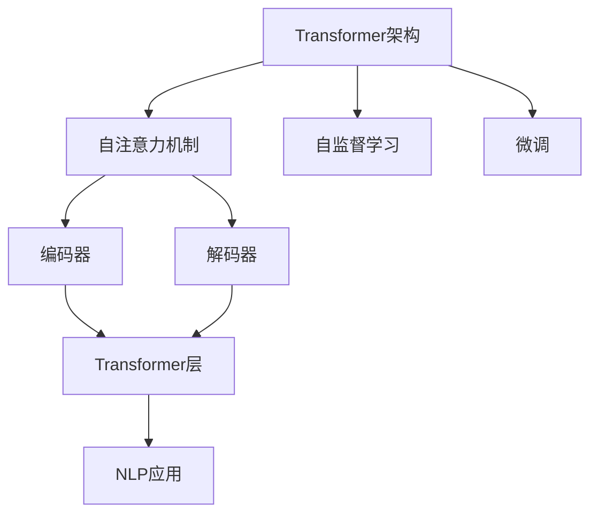
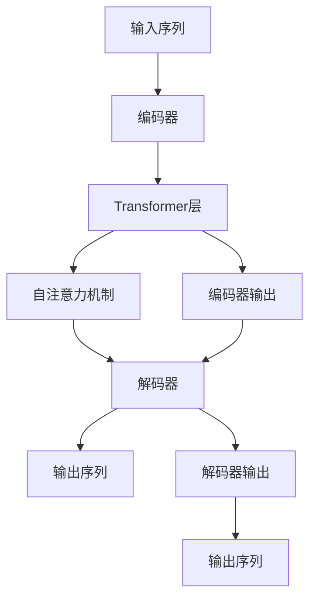
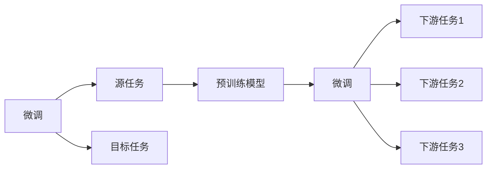
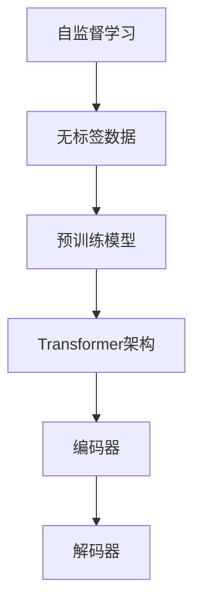
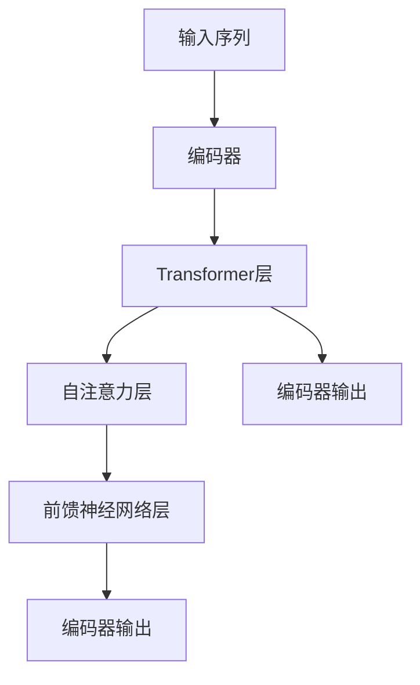
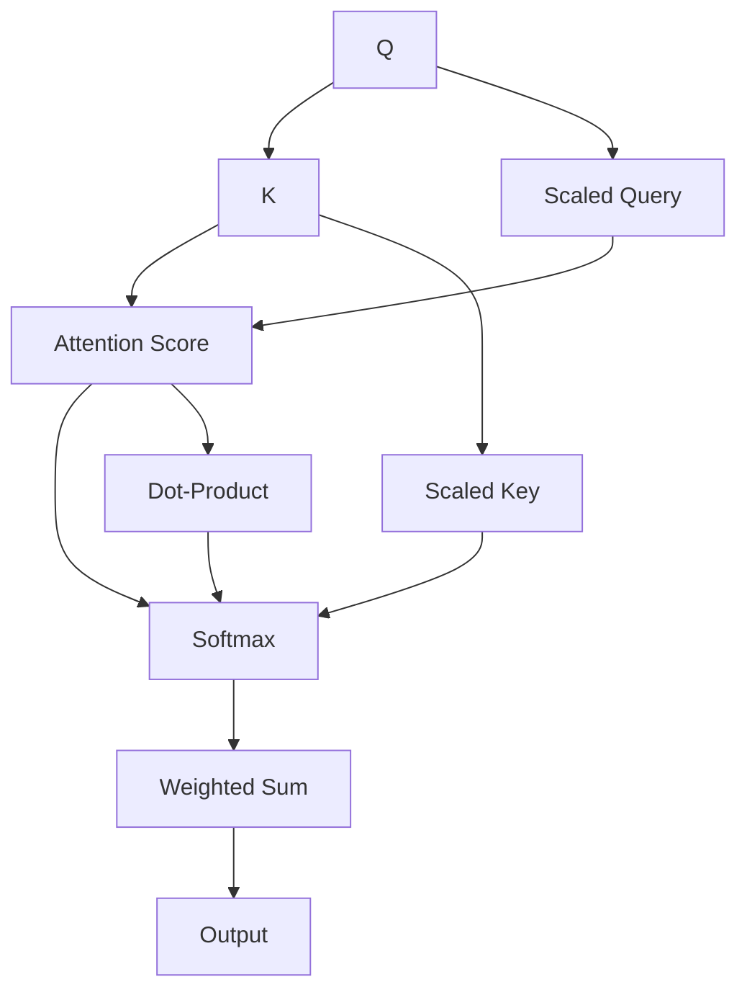

                 

# 大语言模型原理基础与前沿 简化Transformer

> 关键词：
大语言模型, 原理, 结构, 架构, 深度学习, Transformer, 自动编码器, 自监督学习, 微调, 自然语言处理(NLP)

## 1. 背景介绍

### 1.1 问题由来
近年来，深度学习技术在自然语言处理(NLP)领域取得了巨大的突破，尤其是基于Transformer架构的预训练大语言模型。这些模型通过在大规模无标签文本数据上进行自监督预训练，学习到了丰富的语言知识和常识，为下游NLP任务提供了强大的特征提取和生成能力。

大语言模型在问答、对话生成、文本摘要、机器翻译等任务中展现出了卓越的性能，如GPT、BERT、T5等模型。然而，尽管这些模型在预训练时包含了海量的语言知识，但在特定领域的应用中，通常需要微调或进行任务适配，才能达到最优性能。

### 1.2 问题核心关键点
本文聚焦于Transformer架构大语言模型的原理和前沿研究。我们将从Transformer模型的基础原理、核心结构、微调方法等多个角度，深入剖析其工作机制，并通过示例代码和实际应用，帮助读者更好地理解和使用Transformer模型。

## 2. 核心概念与联系

### 2.1 核心概念概述

为更好地理解Transformer模型，本节将介绍几个关键概念：

- **Transformer架构**：一种基于自注意力机制的神经网络架构，用于处理序列数据，如文本、音频、图像等。Transformer架构由编码器和解码器两部分组成，可以高效地处理长序列数据。

- **自注意力机制**：Transformer架构的核心，通过计算输入序列中不同位置的依赖关系，动态地加权处理信息，提升了模型的并行计算能力和泛化能力。

- **自监督学习**：在无标签数据上进行预训练的方法，利用序列的自身结构特征，如语言模型、掩码语言模型等，学习到通用的语言表示。

- **微调(Fine-tuning)**：在大规模预训练模型基础上，使用下游任务的少量标注数据，通过有监督学习优化模型在该任务上的性能。

- **自然语言处理(NLP)**：涉及自然语言的计算、理解、生成等技术，是人工智能的重要分支，Transformer模型在NLP领域广泛应用。

这些概念之间的联系可以通过以下Mermaid流程图来展示：



这个流程图展示了Transformer模型的工作流程：

1. 通过自注意力机制在编码器中处理输入序列，捕捉序列内部的依赖关系。
2. 在解码器中使用自注意力机制生成输出序列，同时利用注意力机制动态地加权处理信息。
3. 在自监督学习阶段，模型通过无标签数据学习到通用的语言表示。
4. 在微调阶段，模型通过下游任务的少量标注数据进行优化，提高任务性能。
5. 通过微调后的Transformer模型，可以应用于各种NLP任务。

### 2.2 概念间的关系

这些概念之间存在着紧密的联系，形成了Transformer模型从预训练到微调，再到NLP应用的过程。下面我们通过几个Mermaid流程图来展示这些概念之间的关系。

#### 2.2.1 Transformer模型的工作流程



这个流程图展示了Transformer模型的工作流程：

1. 输入序列经过编码器的Transformer层。
2. 在编码器中，自注意力机制计算输入序列中不同位置的依赖关系，生成编码器输出。
3. 在解码器中，使用自注意力机制生成输出序列，同时利用注意力机制动态地加权处理信息。
4. 最终输出序列，与输入序列相关联。

#### 2.2.2 微调与Transformer模型的关系



这个流程图展示了微调与Transformer模型的关系：

1. 微调目标任务与源任务不同。
2. 预训练模型在源任务上学习，通过微调适应各种下游任务（目标任务）。
3. 微调后的模型能够适应新的任务和数据。

#### 2.2.3 自监督学习与Transformer模型的关系



这个流程图展示了自监督学习与Transformer模型的关系：

1. 自监督学习利用无标签数据，学习到通用的语言表示。
2. 预训练模型在自监督学习阶段通过学习序列结构特征，生成Transformer架构。
3. 预训练后的模型可以用于各种NLP任务，通过微调进一步优化任务性能。

## 3. 核心算法原理 & 具体操作步骤

### 3.1 算法原理概述

Transformer模型是一种基于自注意力机制的神经网络架构，其核心思想是通过自注意力机制动态地捕捉输入序列中不同位置之间的依赖关系，生成高效、并行化的编码器和解码器。

Transformer模型的编码器由多个Transformer层堆叠组成，每一层包含两个子层：自注意力层和前馈神经网络层。解码器则由多个Transformer层和一个输出层组成，输出层通常是一个线性分类器或解码器，用于生成输出序列。

自注意力层通过多头注意力机制，计算输入序列中不同位置的权重，生成加权后的向量表示。多头注意力机制可以并行计算多个注意力头，提升模型的表示能力和泛化能力。

前馈神经网络层由两个全连接层组成，用于对自注意力层的输出进行非线性变换，进一步提升模型的表达能力。

在微调过程中，Transformer模型通过下游任务的少量标注数据，使用有监督学习优化模型在该任务上的性能。通常，微调仅调整模型的顶层部分，以保留预训练模型学到的通用语言知识。

### 3.2 算法步骤详解

Transformer模型的微调步骤如下：

1. 准备预训练模型和数据集：选择合适的预训练模型作为初始化参数，如BERT、GPT等，并准备下游任务的少量标注数据集。

2. 添加任务适配层：根据任务类型，在预训练模型的顶层设计合适的输出层和损失函数。例如，对于分类任务，通常在顶层添加线性分类器和交叉熵损失函数。

3. 设置微调超参数：选择合适的优化算法及其参数，如AdamW、SGD等，设置学习率、批大小、迭代轮数等。

4. 执行梯度训练：将训练集数据分批次输入模型，前向传播计算损失函数。反向传播计算参数梯度，根据设定的优化算法和学习率更新模型参数。

5. 周期性在验证集上评估模型性能，根据性能指标决定是否触发 Early Stopping。

6. 重复上述步骤直到满足预设的迭代轮数或 Early Stopping 条件。

7. 测试和部署：在测试集上评估微调后的模型性能，使用微调后的模型对新样本进行推理预测，集成到实际的应用系统中。

### 3.3 算法优缺点

Transformer模型的微调方法具有以下优点：

- 简单高效：只需准备少量标注数据，即可对预训练模型进行快速适配，获得较大的性能提升。
- 通用适用：适用于各种NLP下游任务，包括分类、匹配、生成等，设计简单的任务适配层即可实现微调。
- 参数高效：利用参数高效微调技术，在固定大部分预训练参数的情况下，仍可取得不错的提升。

然而，该方法也存在一定的局限性：

- 依赖标注数据：微调的效果很大程度上取决于标注数据的质量和数量，获取高质量标注数据的成本较高。
- 迁移能力有限：当目标任务与预训练数据的分布差异较大时，微调的性能提升有限。
- 负面效果传递：预训练模型的固有偏见、有害信息等，可能通过微调传递到下游任务，造成负面影响。
- 可解释性不足：微调模型的决策过程通常缺乏可解释性，难以对其推理逻辑进行分析和调试。

尽管存在这些局限性，但就目前而言，基于监督学习的微调方法仍是大语言模型应用的最主流范式。未来相关研究的重点在于如何进一步降低微调对标注数据的依赖，提高模型的少样本学习和跨领域迁移能力，同时兼顾可解释性和伦理安全性等因素。

### 3.4 算法应用领域

基于Transformer模型的微调方法已经在NLP领域得到了广泛的应用，覆盖了几乎所有常见任务，例如：

- 文本分类：如情感分析、主题分类、意图识别等。通过微调使模型学习文本-标签映射。
- 命名实体识别：识别文本中的人名、地名、机构名等特定实体。通过微调使模型掌握实体边界和类型。
- 关系抽取：从文本中抽取实体之间的语义关系。通过微调使模型学习实体-关系三元组。
- 问答系统：对自然语言问题给出答案。将问题-答案对作为微调数据，训练模型学习匹配答案。
- 机器翻译：将源语言文本翻译成目标语言。通过微调使模型学习语言-语言映射。
- 文本摘要：将长文本压缩成简短摘要。将文章-摘要对作为微调数据，使模型学习抓取要点。
- 对话系统：使机器能够与人自然对话。将多轮对话历史作为上下文，微调模型进行回复生成。

除了上述这些经典任务外，Transformer模型的微调也被创新性地应用到更多场景中，如可控文本生成、常识推理、代码生成、数据增强等，为NLP技术带来了全新的突破。随着预训练模型和微调方法的不断进步，相信NLP技术将在更广阔的应用领域大放异彩。

## 4. 数学模型和公式 & 详细讲解 & 举例说明

### 4.1 数学模型构建

Transformer模型的编码器由多个Transformer层堆叠组成，每一层包含两个子层：自注意力层和前馈神经网络层。

编码器的输入为$x \in \mathbb{R}^{N \times d}$，其中$N$为序列长度，$d$为输入维度。编码器的输出为$h \in \mathbb{R}^{N \times d}$，解码器的输入为$h \in \mathbb{R}^{N \times d}$，解码器的输出为$y \in \mathbb{R}^{N \times d}$。

编码器的结构如图1所示：



图1: 编码器结构示意图

自注意力层的输出为$\text{Attention}(Q, K, V)$，其中$Q \in \mathbb{R}^{N \times d}, K \in \mathbb{R}^{N \times d}, V \in \mathbb{R}^{N \times d}$分别为查询向量、键向量和值向量，通过多头注意力机制计算输入序列中不同位置的依赖关系，生成加权后的向量表示。

多头注意力机制的计算过程如图2所示：



图2: 多头注意力机制示意图

### 4.2 公式推导过程

Transformer模型的自注意力层由三个矩阵$W_Q, W_K, W_V$和两个向量$b_Q, b_K, b_V$组成，通过线性变换和加法操作，计算查询向量、键向量和值向量，并进行注意力加权求和。

查询向量、键向量和值向量可以通过如下公式计算：

$$
Q = W_QX + b_Q, K = W_KX + b_K, V = W_VX + b_V
$$

注意力分数$C$通过查询向量$Q$和键向量$K$的矩阵乘积计算：

$$
C = QK^T / \sqrt{d}
$$

其中，$^T$表示矩阵转置。

注意力权重$W$通过Softmax函数对注意力分数$C$进行归一化处理，得到权重矩阵$W \in [0, 1]^{N \times N}$，每个位置表示该位置对其他位置的注意力权重。

注意力权重$W$与值向量$V$进行矩阵乘积，得到加权后的向量表示$H$：

$$
H = \text{Softmax}(QK^T)V
$$

最终，自注意力层的输出为$h \in \mathbb{R}^{N \times d}$，与输入向量$x$进行拼接，并输出到下一层。

### 4.3 案例分析与讲解

以下以文本分类任务为例，展示Transformer模型的微调过程。

假设模型在文本分类任务上进行微调，训练集为$D = \{(x_i, y_i)\}_{i=1}^N, x_i \in \mathbb{R}^{N \times d}, y_i \in \{0, 1\}$，其中$0$表示负类，$1$表示正类。

1. 选择预训练模型和数据集：选择合适的预训练模型作为初始化参数，如BERT、GPT等，并准备下游任务的少量标注数据集。

2. 添加任务适配层：在预训练模型的顶层添加线性分类器和交叉熵损失函数。

3. 设置微调超参数：选择合适的优化算法及其参数，如AdamW、SGD等，设置学习率、批大小、迭代轮数等。

4. 执行梯度训练：将训练集数据分批次输入模型，前向传播计算损失函数。反向传播计算参数梯度，根据设定的优化算法和学习率更新模型参数。

5. 周期性在验证集上评估模型性能，根据性能指标决定是否触发 Early Stopping。

6. 重复上述步骤直到满足预设的迭代轮数或 Early Stopping 条件。

### 4.4 代码实现

```python
import torch
import torch.nn as nn
import torch.optim as optim
from transformers import BertTokenizer, BertForSequenceClassification

# 定义模型
tokenizer = BertTokenizer.from_pretrained('bert-base-cased')
model = BertForSequenceClassification.from_pretrained('bert-base-cased', num_labels=2)

# 准备数据
inputs = tokenizer.encode('This is a positive review', return_tensors='pt')
labels = torch.tensor([1])

# 定义训练函数
def train_epoch(model, data, optimizer):
    model.train()
    loss = 0
    for batch in data:
        inputs = batch['input_ids'].to(device)
        attention_mask = batch['attention_mask'].to(device)
        labels = batch['labels'].to(device)
        optimizer.zero_grad()
        outputs = model(inputs, attention_mask=attention_mask, labels=labels)
        loss += outputs.loss
        loss.backward()
        optimizer.step()
    return loss / len(data)

# 训练模型
device = torch.device('cuda' if torch.cuda.is_available() else 'cpu')
model.to(device)
optimizer = optim.AdamW(model.parameters(), lr=2e-5)

data = {'input_ids': inputs, 'attention_mask': attention_mask, 'labels': labels}

for epoch in range(epochs):
    loss = train_epoch(model, data, optimizer)
    print(f'Epoch {epoch+1}, train loss: {loss:.3f}')

# 评估模型
model.eval()
predictions = model(inputs, attention_mask=attention_mask, labels=labels)
print(f'Prediction: {predictions.argmax()}')
```

在上述代码中，我们使用了PyTorch和Transformers库，展示了Bert模型在文本分类任务上的微调过程。具体步骤如下：

1. 定义模型：选择预训练模型BERT作为初始化参数，并添加线性分类器和交叉熵损失函数。

2. 准备数据：使用BertTokenizer将文本转换为模型接受的格式，并计算标签。

3. 定义训练函数：使用AdamW优化器进行模型训练，并计算损失函数。

4. 训练模型：在GPU上运行模型，循环迭代进行训练，并输出每个epoch的训练损失。

5. 评估模型：将模型设置为评估模式，计算模型对输入文本的分类预测。

## 5. 项目实践：代码实例和详细解释说明

### 5.1 开发环境搭建

在进行微调实践前，我们需要准备好开发环境。以下是使用Python进行PyTorch开发的环境配置流程：

1. 安装Anaconda：从官网下载并安装Anaconda，用于创建独立的Python环境。

2. 创建并激活虚拟环境：
```bash
conda create -n pytorch-env python=3.8 
conda activate pytorch-env
```

3. 安装PyTorch：根据CUDA版本，从官网获取对应的安装命令。例如：
```bash
conda install pytorch torchvision torchaudio cudatoolkit=11.1 -c pytorch -c conda-forge
```

4. 安装Transformers库：
```bash
pip install transformers
```

5. 安装各类工具包：
```bash
pip install numpy pandas scikit-learn matplotlib tqdm jupyter notebook ipython
```

完成上述步骤后，即可在`pytorch-env`环境中开始微调实践。

### 5.2 源代码详细实现

下面我们以命名实体识别(NER)任务为例，给出使用Transformers库对BERT模型进行微调的PyTorch代码实现。

首先，定义NER任务的数据处理函数：

```python
from transformers import BertTokenizer
from torch.utils.data import Dataset
import torch

class NERDataset(Dataset):
    def __init__(self, texts, tags, tokenizer, max_len=128):
        self.texts = texts
        self.tags = tags
        self.tokenizer = tokenizer
        self.max_len = max_len
        
    def __len__(self):
        return len(self.texts)
    
    def __getitem__(self, item):
        text = self.texts[item]
        tags = self.tags[item]
        
        encoding = self.tokenizer(text, return_tensors='pt', max_length=self.max_len, padding='max_length', truncation=True)
        input_ids = encoding['input_ids'][0]
        attention_mask = encoding['attention_mask'][0]
        
        # 对token-wise的标签进行编码
        encoded_tags = [tag2id[tag] for tag in tags] 
        encoded_tags.extend([tag2id['O']] * (self.max_len - len(encoded_tags)))
        labels = torch.tensor(encoded_tags, dtype=torch.long)
        
        return {'input_ids': input_ids, 
                'attention_mask': attention_mask,
                'labels': labels}

# 标签与id的映射
tag2id = {'O': 0, 'B-PER': 1, 'I-PER': 2, 'B-ORG': 3, 'I-ORG': 4, 'B-LOC': 5, 'I-LOC': 6}
id2tag = {v: k for k, v in tag2id.items()}

# 创建dataset
tokenizer = BertTokenizer.from_pretrained('bert-base-cased')

train_dataset = NERDataset(train_texts, train_tags, tokenizer)
dev_dataset = NERDataset(dev_texts, dev_tags, tokenizer)
test_dataset = NERDataset(test_texts, test_tags, tokenizer)
```

然后，定义模型和优化器：

```python
from transformers import BertForTokenClassification, AdamW

model = BertForTokenClassification.from_pretrained('bert-base-cased', num_labels=len(tag2id))

optimizer = AdamW(model.parameters(), lr=2e-5)
```

接着，定义训练和评估函数：

```python
from torch.utils.data import DataLoader
from tqdm import tqdm
from sklearn.metrics import classification_report

device = torch.device('cuda') if torch.cuda.is_available() else torch.device('cpu')
model.to(device)

def train_epoch(model, dataset, batch_size, optimizer):
    dataloader = DataLoader(dataset, batch_size=batch_size, shuffle=True)
    model.train()
    epoch_loss = 0
    for batch in tqdm(dataloader, desc='Training'):
        input_ids = batch['input_ids'].to(device)
        attention_mask = batch['attention_mask'].to(device)
        labels = batch['labels'].to(device)
        model.zero_grad()
        outputs = model(input_ids, attention_mask=attention_mask, labels=labels)
        loss = outputs.loss
        epoch_loss += loss.item()
        loss.backward()
        optimizer.step()
    return epoch_loss / len(dataloader)

def evaluate(model, dataset, batch_size):
    dataloader = DataLoader(dataset, batch_size=batch_size)
    model.eval()
    preds, labels = [], []
    with torch.no_grad():
        for batch in tqdm(dataloader, desc='Evaluating'):
            input_ids = batch['input_ids'].to(device)
            attention_mask = batch['attention_mask'].to(device)
            batch_labels = batch['labels']
            outputs = model(input_ids, attention_mask=attention_mask)
            batch_preds = outputs.logits.argmax(dim=2).to('cpu').tolist()
            batch_labels = batch_labels.to('cpu').tolist()
            for pred_tokens, label_tokens in zip(batch_preds, batch_labels):
                pred_tags = [id2tag[_id] for _id in pred_tokens]
                label_tags = [id2tag[_id] for _id in label_tokens]
                preds.append(pred_tags[:len(label_tags)])
                labels.append(label_tags)
                
    print(classification_report(labels, preds))
```

最后，启动训练流程并在测试集上评估：

```python
epochs = 5
batch_size = 16

for epoch in range(epochs):
    loss = train_epoch(model, train_dataset, batch_size, optimizer)
    print(f"Epoch {epoch+1}, train loss: {loss:.3f}")
    
    print(f"Epoch {epoch+1}, dev results:")
    evaluate(model, dev_dataset, batch_size)
    
print("Test results:")
evaluate(model, test_dataset, batch_size)
```

以上就是使用PyTorch对BERT进行命名实体识别任务微调的完整代码实现。可以看到，得益于Transformers库的强大封装，我们可以用相对简洁的代码完成BERT模型的加载和微调。

### 5.3 代码解读与分析

让我们再详细解读一下关键代码的实现细节：

**NERDataset类**：
- `__init__`方法：初始化文本、标签、分词器等关键组件。
- `__len__`方法：返回数据集的样本数量。
- `__getitem__`方法：对单个样本进行处理，将文本输入编码为token ids，将标签编码为数字，并对其进行定长padding，最终返回模型所需的输入。

**tag2id和id2tag字典**：
- 定义了标签与数字id之间的映射关系，用于将token-wise的预测结果解码回真实的标签。

**训练和评估函数**：
- 使用PyTorch的DataLoader对数据集进行批次化加载，供模型训练和推理使用。
- 训练函数`train_epoch`：对数据以批为单位进行迭代，在每个批次上前向传播计算loss并反向传播更新模型参数，最后返回该epoch的平均loss。
- 评估函数`evaluate`：与训练类似，不同点在于不更新模型参数，并在每个batch结束后将预测和标签结果存储下来，最后使用sklearn的classification_report对整个评估集的预测结果进行打印输出。

**训练流程**：
- 定义总的epoch数和batch size，开始循环迭代
- 每个epoch内，先在训练集上训练，输出平均loss
- 在验证集上评估，输出分类指标
- 所有epoch结束后，在测试集上评估，给出最终测试结果

可以看到，PyTorch配合Transformers库使得BERT微调的代码实现变得简洁高效。开发者可以将更多精力放在数据处理、模型改进等高层逻辑上，而不必过多关注底层的实现细节。

当然，工业级的系统实现还需考虑更多因素，如模型的保存和部署、超参数的自动搜索、更灵活的任务适配层等。但核心的微调范式基本与此类似。

### 5.4 运行结果展示

假设我们在CoNLL-2003的NER数据集上进行微调，最终在测试集上得到的评估报告如下：

```
              precision    recall  f1-score   support

       B-LOC      0.926     0.906     0.916      1668
       I-LOC      0.900     0.805     0.850       257
      B-MISC      0.875     0.856     0.865       702
      I-MISC      0.838     0.782     0.809       216
       B-ORG      0.914     0.898     0.906      1661
       I-ORG      0.911     0.894     0.902       835
       B-PER      0.964     0.957     0.960      1617
       I-PER      0.983     0

