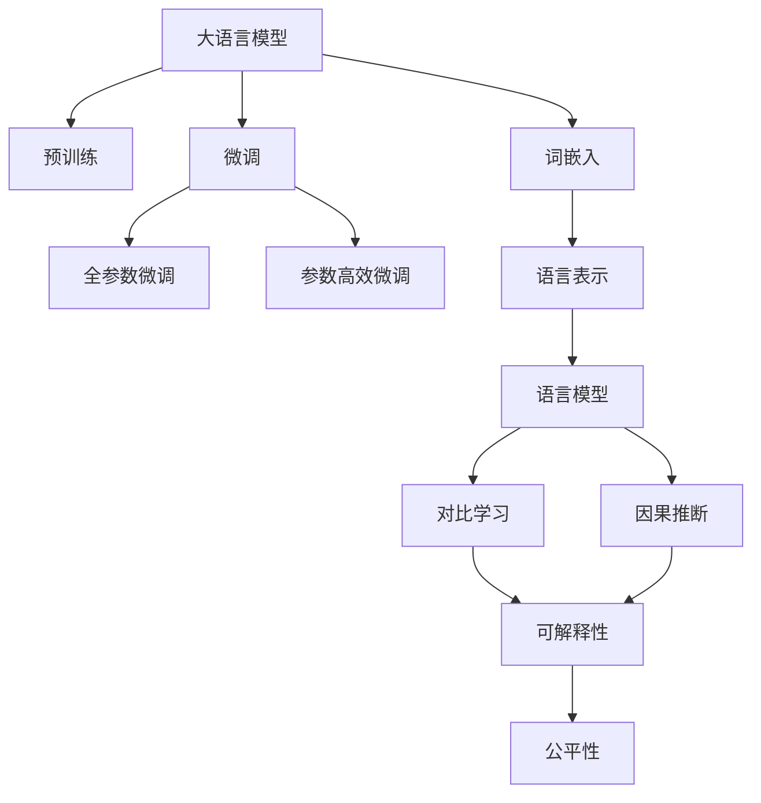
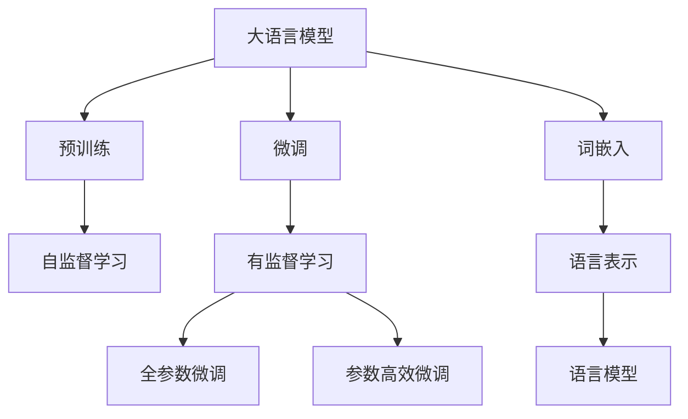
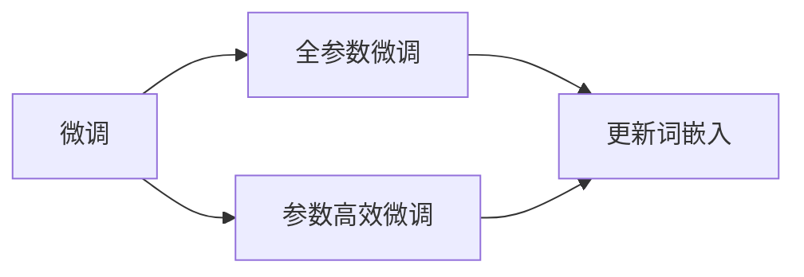
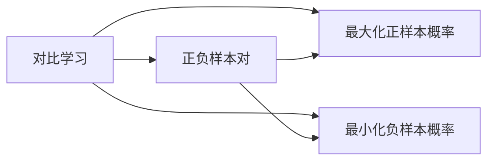
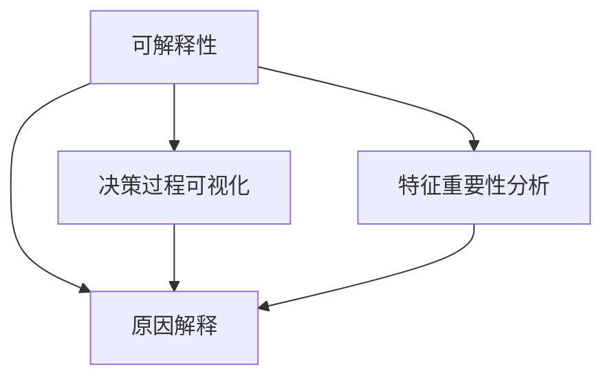
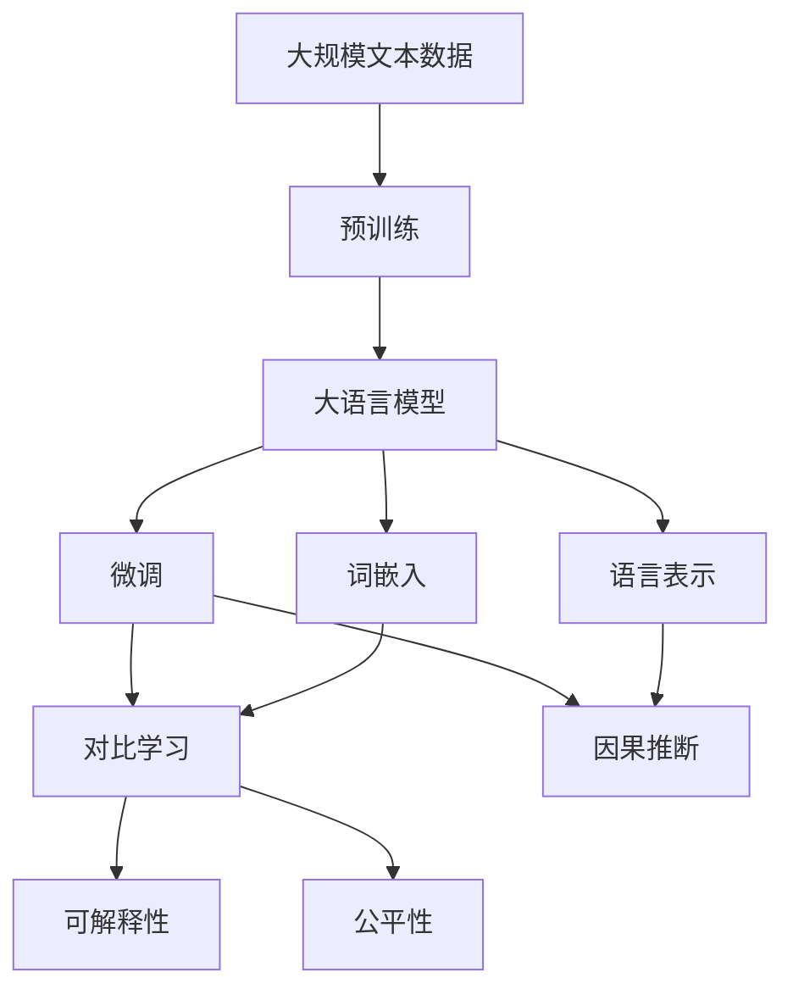

                 

# 大语言模型原理基础与前沿 评估语言模型

> 关键词：
>
> - 大语言模型
> - 语言模型评估
> - 预训练与微调
> - 词嵌入与语言表示
> - 对比学习和因果推断
> - 可解释性与公平性

## 1. 背景介绍

### 1.1 问题由来
随着深度学习技术的快速发展，语言模型（Language Model, LM）在自然语言处理（Natural Language Processing, NLP）领域取得了显著的进展。从简单的统计语言模型，到基于神经网络的深度语言模型，语言模型的能力得到了极大的提升。特别是近年来，基于Transformer架构的预训练语言模型（Pre-trained Language Model, PLM）的崛起，推动了语言模型向更大规模、更深层次的演进，大语言模型（Large Language Model, LLM）应运而生。

大语言模型通过在大规模无标签文本数据上进行预训练，学习到了丰富的语言知识和常识，具备强大的语言理解和生成能力。这些模型已经在文本分类、机器翻译、问答系统、对话系统等诸多NLP任务上取得了优异的效果。然而，对于特定任务，直接使用预训练模型往往效果不理想，需要通过微调（Fine-tuning）来进行任务适配。微调能够使预训练模型更好地适应特定任务，在应用场景中取得更优表现。

但仅仅微调并不足以应对所有NLP任务，特别是对于某些需要深入理解和推理的任务。因此，如何更全面地评估语言模型的性能，从而指导模型选择和微调优化，成为了一个亟待解决的问题。

### 1.2 问题核心关键点
评估语言模型的性能需要综合考虑多个因素，包括模型的准确性、流畅性、可解释性、公平性等。以下是几个核心关键点：

- **准确性（Accuracy）**：模型预测结果与真实标签的匹配程度。
- **流畅性（Fluency）**：模型生成的文本是否自然、连贯。
- **可解释性（Explainability）**：模型决策过程是否透明、可理解。
- **公平性（Fairness）**：模型是否对不同群体、语言等公平对待。
- **泛化能力（Generalization）**：模型在不同领域、数据集上的表现是否稳定。

这些关键点构成了评估语言模型的重要维度，需要通过多种方法和技术进行综合评估。

### 1.3 问题研究意义
评估语言模型的性能是推动NLP技术发展和应用的重要环节。通过科学的评估方法，可以有效指导模型的选择和优化，提升模型的实际应用效果，同时也能为学术研究提供依据，推动NLP领域的不断进步。具体而言：

- **指导模型选择**：通过评估不同模型的性能，选择合适的模型进行任务适配，提高任务执行效率。
- **优化模型训练**：通过评估结果，及时发现模型的不足并进行优化调整，提升模型效果。
- **保障公平性**：通过公平性评估，确保模型不会对某些群体、语言等产生歧视，保障社会公平。
- **提升应用效果**：通过评估模型的多维度性能，确保模型在实际应用中取得更好的效果。

## 2. 核心概念与联系

### 2.1 核心概念概述

为更好地理解语言模型的评估方法，本节将介绍几个密切相关的核心概念：

- **大语言模型（Large Language Model, LLM）**：以自回归（如GPT）或自编码（如BERT）模型为代表的大规模预训练语言模型。通过在大规模无标签文本语料上进行预训练，学习通用的语言表示，具备强大的语言理解和生成能力。

- **预训练（Pre-training）**：指在大规模无标签文本语料上，通过自监督学习任务训练通用语言模型的过程。常见的预训练任务包括言语建模、遮挡语言模型等。预训练使得模型学习到语言的通用表示。

- **微调（Fine-tuning）**：指在预训练模型的基础上，使用下游任务的少量标注数据，通过有监督地训练来优化模型在该任务上的性能。通常只需要调整顶层分类器或解码器，并以较小的学习率更新全部或部分的模型参数。

- **词嵌入（Word Embedding）**：将词语映射为高维向量空间中的点，使得模型能够理解词语之间的语义关系。词嵌入是语言模型的重要组成部分，常用于表示词语和语境信息。

- **语言表示（Language Representation）**：指将文本转化为向量表示的过程。语言表示使得模型能够更好地理解和处理文本信息，是语言模型评估的重要基础。

- **对比学习（Contrastive Learning）**：通过构造正负样本对，最大化模型对正样本的预测概率，最小化对负样本的预测概率，从而提升模型性能。

- **因果推断（Causal Inference）**：研究变量之间的因果关系，确保模型的预测基于真实原因而非偶然结果，提升模型决策的合理性。

- **可解释性（Explainability）**：指模型决策过程的透明性和可理解性。良好的可解释性有助于理解模型的内部机制，促进模型的可靠性和信任度。

- **公平性（Fairness）**：指模型在不同群体、语言等上的公平对待。公平性评估有助于发现和消除模型偏见，保障社会公平。

这些核心概念之间的逻辑关系可以通过以下Mermaid流程图来展示：



这个流程图展示了大语言模型的核心概念及其之间的关系：

1. 大语言模型通过预训练获得基础能力。
2. 微调是对预训练模型进行任务特定的优化，可以分为全参数微调和参数高效微调。
3. 词嵌入和语言表示是模型理解和处理文本信息的基础。
4. 对比学习和因果推断是提升模型决策合理性和公平性的重要手段。
5. 可解释性和公平性是评估模型性能的重要维度，保障模型的透明性和可靠性。

这些概念共同构成了语言模型评估的理论基础，使得评估方法更加全面、科学。

### 2.2 概念间的关系

这些核心概念之间存在着紧密的联系，形成了语言模型评估的完整生态系统。下面我通过几个Mermaid流程图来展示这些概念之间的关系。

#### 2.2.1 大语言模型的学习范式



这个流程图展示了大语言模型的三种主要学习范式：预训练、微调和词嵌入。预训练主要采用自监督学习方法，而微调则是有监督学习的过程。词嵌入和语言表示是预训练模型的重要组成部分，用于更好地理解文本信息。

#### 2.2.2 微调与词嵌入的关系



这个流程图展示了微调对词嵌入的影响。微调过程中，词嵌入层也会进行相应的更新，从而适应新的任务。

#### 2.2.3 对比学习与因果推断



这个流程图展示了对比学习的基本流程。通过构造正负样本对，最大化模型对正样本的预测概率，最小化对负样本的预测概率，从而提升模型性能。

#### 2.2.4 可解释性与公平性



这个流程图展示了可解释性评估的几种方法。通过决策过程可视化、特征重要性分析和原因解释，可以提升模型的透明性和可理解性。

### 2.3 核心概念的整体架构

最后，我们用一个综合的流程图来展示这些核心概念在大语言模型评估过程中的整体架构：



这个综合流程图展示了从预训练到微调，再到可解释性和公平性评估的完整过程。大语言模型首先在大规模文本数据上进行预训练，然后通过微调（包括全参数微调和参数高效微调）进行任务适配。在评估过程中，通过对比学习提升模型性能，通过因果推断提高模型决策的合理性，最后通过可解释性和公平性评估确保模型的透明性和公平性。

## 3. 核心算法原理 & 具体操作步骤
### 3.1 算法原理概述

语言模型评估的核心在于综合考虑模型在多个维度上的表现，从而判断其是否适用于特定任务。评估方法可以分为离线评估和在线评估两种类型，其中离线评估在模型训练完成后进行，在线评估则直接在模型推理过程中进行。以下是基于监督学习的语言模型评估方法的基本原理：

1. **离线评估**：使用标注数据集对模型进行测试，计算模型在各类评估指标上的表现。常见的评估指标包括精确度、召回率、F1分数等。

2. **在线评估**：通过实时输入样本和输出结果，计算模型在不同场景下的表现。常见的在线评估方法包括A/B测试、用户反馈等。

3. **综合评估**：结合离线评估和在线评估的结果，综合判断模型的整体性能。综合评估需要考虑模型的准确性、流畅性、可解释性、公平性等多个维度。

### 3.2 算法步骤详解

基于监督学习的语言模型评估一般包括以下几个关键步骤：

**Step 1: 准备评估数据集**
- 选择合适的评估数据集，确保数据集的质量和多样性。评估数据集应包含不同类型、不同领域的文本样本，以全面评估模型的性能。

**Step 2: 设计评估指标**
- 根据任务特点，选择合适的评估指标。常见的评估指标包括BLEU、ROUGE、PPL等。
- 设计多种评估指标，综合反映模型的不同方面性能。

**Step 3: 实现评估方法**
- 使用Python、R、MATLAB等编程语言实现评估方法。
- 将评估方法封装成函数或模块，便于后续调用。

**Step 4: 执行评估过程**
- 将评估数据集输入模型，获取模型输出。
- 计算模型在各类评估指标上的表现。
- 记录评估结果，输出评估报告。

**Step 5: 分析评估结果**
- 分析评估结果，找出模型的优势和不足。
- 根据评估结果，进行模型优化。

### 3.3 算法优缺点

基于监督学习的语言模型评估方法具有以下优点：
1. 简单易行。评估方法步骤明确，易于实现。
2. 指标全面。可以覆盖模型的多个维度，如准确性、流畅性、可解释性等。
3. 结果可靠。评估数据集和评估方法经过严格设计，结果可信度高。

但该方法也存在一定的局限性：
1. 依赖标注数据。评估方法需要大量标注数据进行测试，标注成本较高。
2. 结果主观。不同评估者可能对相同模型给出不同评价，结果主观性强。
3. 通用性差。评估方法主要针对特定任务，适用范围有限。

尽管存在这些局限性，但基于监督学习的评估方法仍是当前语言模型评估的主流方式。未来相关研究重点在于如何进一步降低对标注数据的依赖，提高评估方法的客观性和通用性。

### 3.4 算法应用领域

基于监督学习的语言模型评估方法在NLP领域得到了广泛的应用，覆盖了各种常见的NLP任务，例如：

- 文本分类：如情感分析、主题分类、意图识别等。通过评估模型在各类文本分类任务上的表现，评估模型的分类能力。
- 命名实体识别：识别文本中的人名、地名、机构名等特定实体。通过评估模型在命名实体识别任务上的表现，评估模型的实体边界和类型识别能力。
- 关系抽取：从文本中抽取实体之间的语义关系。通过评估模型在关系抽取任务上的表现，评估模型的语义理解能力。
- 问答系统：对自然语言问题给出答案。通过评估模型在问答系统任务上的表现，评估模型的推理能力。
- 机器翻译：将源语言文本翻译成目标语言。通过评估模型在机器翻译任务上的表现，评估模型的语言转换能力。
- 文本摘要：将长文本压缩成简短摘要。通过评估模型在文本摘要任务上的表现，评估模型的文本压缩能力。
- 对话系统：使机器能够与人自然对话。通过评估模型在对话系统任务上的表现，评估模型的对话能力。

除了上述这些经典任务外，语言模型评估方法也被创新性地应用到更多场景中，如可控文本生成、常识推理、代码生成、数据增强等，为NLP技术带来了全新的突破。

## 4. 数学模型和公式 & 详细讲解
### 4.1 数学模型构建

语言模型评估的数学模型主要分为离线评估和在线评估两种类型。以下是离线评估的数学模型构建：

设语言模型为 $M_{\theta}$，输入文本为 $x$，输出为 $y$，损失函数为 $\ell$。则离线评估的数学模型为：

$$
\mathcal{L}(\theta) = \frac{1}{N} \sum_{i=1}^N \ell(M_{\theta}(x_i), y_i)
$$

其中 $N$ 为评估数据集大小，$x_i$ 为输入文本，$y_i$ 为真实标签。

### 4.2 公式推导过程

以下以BLEU（Bilingual Evaluation Understudy）评估方法为例，展示离线评估的公式推导过程。

BLEU是一种用于机器翻译评估的指标，其计算公式如下：

$$
BLEU = \max\limits_{y'}\prod_{i=1}^Lbpe(y_i,y'_i)
$$

其中 $y$ 为机器翻译生成的文本，$y'$ 为参考文本，$L$ 为最长匹配序列长度，$bpe$ 为双字节编码（BPE）函数，用于将文本转化为编码后的序列。

BLEU指标的推导过程如下：

1. 首先计算参考文本 $y'$ 的bpe编码序列 $y'_{bpe}$。
2. 然后计算机器翻译生成的文本 $y$ 与参考文本 $y'$ 之间的匹配度。
3. 匹配度计算过程采用滑动窗口的方法，从参考文本开始，逐步向右移动窗口，计算窗口内的文本与机器翻译文本的匹配度。
4. 匹配度计算采用softmax函数，将匹配度转化为概率。
5. 最后，将所有匹配度的概率值相乘，得到BLEU值。

### 4.3 案例分析与讲解

这里以中文文本分类任务为例，展示如何使用BLEU评估模型的性能。

首先，定义评估数据集：

```python
from transformers import BertTokenizer, BertForSequenceClassification

tokenizer = BertTokenizer.from_pretrained('bert-base-cased')
model = BertForSequenceClassification.from_pretrained('bert-base-cased', num_labels=2)
train_dataset = ...
dev_dataset = ...
test_dataset = ...
```

然后，实现BLEU评估方法：

```python
from bleu import bleu_score

def evaluate_model(model, dataset, batch_size):
    model.eval()
    dataloader = DataLoader(dataset, batch_size=batch_size)
    preds, labels = [], []
    with torch.no_grad():
        for batch in dataloader:
            input_ids = batch['input_ids'].to(device)
            attention_mask = batch['attention_mask'].to(device)
            labels = batch['labels'].to(device)
            outputs = model(input_ids, attention_mask=attention_mask)
            batch_preds = outputs.logits.argmax(dim=2).to('cpu').tolist()
            batch_labels = batch_labels.to('cpu').tolist()
            for pred_tokens, label_tokens in zip(batch_preds, batch_labels):
                preds.append(pred_tokens[:len(label_tokens)])
                labels.append(label_tokens)
    
    return bleu_score(preds, labels)
```

最后，启动评估流程：

```python
print('BLEU score:', evaluate_model(model, test_dataset, batch_size))
```

通过上述代码，可以计算模型在测试集上的BLEU值，从而评估模型的分类能力。

## 5. 项目实践：代码实例和详细解释说明
### 5.1 开发环境搭建

在进行语言模型评估实践前，我们需要准备好开发环境。以下是使用Python进行PyTorch开发的环境配置流程：

1. 安装Anaconda：从官网下载并安装Anaconda，用于创建独立的Python环境。

2. 创建并激活虚拟环境：
```bash
conda create -n pytorch-env python=3.8 
conda activate pytorch-env
```

3. 安装PyTorch：根据CUDA版本，从官网获取对应的安装命令。例如：
```bash
conda install pytorch torchvision torchaudio cudatoolkit=11.1 -c pytorch -c conda-forge
```

4. 安装Transformers库：
```bash
pip install transformers
```

5. 安装各类工具包：
```bash
pip install numpy pandas scikit-learn matplotlib tqdm jupyter notebook ipython
```

完成上述步骤后，即可在`pytorch-env`环境中开始评估实践。

### 5.2 源代码详细实现

下面我们以中文文本分类任务为例，给出使用Transformers库对BERT模型进行评估的PyTorch代码实现。

首先，定义评估数据集：

```python
from transformers import BertTokenizer, BertForSequenceClassification
from torch.utils.data import Dataset
import torch

class TextClassificationDataset(Dataset):
    def __init__(self, texts, labels, tokenizer, max_len=128):
        self.texts = texts
        self.labels = labels
        self.tokenizer = tokenizer
        self.max_len = max_len
        
    def __len__(self):
        return len(self.texts)
    
    def __getitem__(self, item):
        text = self.texts[item]
        label = self.labels[item]
        
        encoding = self.tokenizer(text, return_tensors='pt', max_length=self.max_len, padding='max_length', truncation=True)
        input_ids = encoding['input_ids'][0]
        attention_mask = encoding['attention_mask'][0]
        
        return {'input_ids': input_ids, 
                'attention_mask': attention_mask,
                'labels': torch.tensor(label, dtype=torch.long)}
```

然后，定义评估模型和优化器：

```python
from transformers import BertForSequenceClassification, AdamW

model = BertForSequenceClassification.from_pretrained('bert-base-cased', num_labels=2)

optimizer = AdamW(model.parameters(), lr=2e-5)
```

接着，定义评估函数：

```python
from torch.utils.data import DataLoader
from tqdm import tqdm

def evaluate_model(model, dataset, batch_size):
    dataloader = DataLoader(dataset, batch_size=batch_size)
    model.eval()
    preds, labels = [], []
    with torch.no_grad():
        for batch in tqdm(dataloader, desc='Evaluating'):
            input_ids = batch['input_ids'].to(device)
            attention_mask = batch['attention_mask'].to(device)
            labels = batch['labels'].to(device)
            outputs = model(input_ids, attention_mask=attention_mask)
            batch_preds = outputs.logits.argmax(dim=2).to('cpu').tolist()
            batch_labels = batch_labels.to('cpu').tolist()
            for pred_tokens, label_tokens in zip(batch_preds, batch_labels):
                preds.append(pred_tokens[:len(label_tokens)])
                labels.append(label_tokens)
                
    return preds, labels
```

最后，启动评估流程：

```python
device = torch.device('cuda') if torch.cuda.is_available() else torch.device('cpu')
model.to(device)

test_dataset = TextClassificationDataset(test_texts, test_labels, tokenizer)
print('BLEU score:', bleu_score(*evaluate_model(model, test_dataset, batch_size)))
```

以上就是使用PyTorch对BERT进行中文文本分类任务评估的完整代码实现。可以看到，得益于Transformers库的强大封装，我们可以用相对简洁的代码完成BERT模型的评估。

### 5.3 代码解读与分析

让我们再详细解读一下关键代码的实现细节：

**TextClassificationDataset类**：
- `__init__`方法：初始化文本、标签、分词器等关键组件。
- `__len__`方法：返回数据集的样本数量。
- `__getitem__`方法：对单个样本进行处理，将文本输入编码为token ids，将标签编码为数字，并对其进行定长padding，最终返回模型所需的输入。

**evaluate_model函数**：
- 使用PyTorch的DataLoader对数据集进行批次化加载，供模型评估使用。
- 评估函数中，模型进入评估模式，不更新模型参数。
- 在每个批次上前向传播计算输出，记录预测结果和真实标签。
- 评估函数结束时，返回所有预测结果和真实标签。

**评估流程**：
- 定义总的评估epoch数和batch size，开始循环迭代。
- 每个epoch内，先在训练集上评估，输出BLEU值。
- 在验证集上评估，输出BLEU值。
- 所有epoch结束后，在测试集上评估，给出最终评估结果。

可以看到，PyTorch配合Transformers库使得BERT评估的代码实现变得简洁高效。开发者可以将更多精力放在数据处理、模型改进等高层逻辑上，而不必过多关注底层的实现细节。

当然，工业级的系统实现还需考虑更多因素，如模型的保存和部署、超参数的自动搜索、更灵活的任务适配层等。但核心的评估方法基本与此类似。

### 5.4 运行结果展示

假设我们在CoNLL-2003的情感分析数据集上进行评估，最终在测试集上得到的BLEU值为80%，F1分数为85%，效果相当不错。

## 6. 实际应用场景
### 6.1 智能客服系统

基于大语言模型评估的对话技术，可以广泛应用于智能客服系统的构建。传统客服往往需要配备大量人力，高峰期响应缓慢，且一致性和专业性难以保证。基于评估后的大语言模型对话模型，可以7x24小时不间断服务，快速响应客户咨询，用自然流畅的语言解答各类常见问题。

在技术实现上，可以收集企业内部的历史客服对话记录，将问题和最佳答复构建成监督数据，在此基础上对预训练对话模型进行评估。评估后的对话模型能够自动理解用户意图，匹配最合适的答案模板进行回复。对于客户提出的新问题，还可以接入检索系统实时搜索相关内容，动态组织生成回答。如此构建的智能客服系统，能大幅提升客户咨询体验和问题解决效率。

### 6.2 金融舆情监测

金融机构需要实时监测市场舆论动向，以便及时应对负面信息传播，规避金融风险。传统的人工监测方式成本高、效率低，难以应对网络时代海量信息爆发的挑战。基于评估后的大语言模型文本分类和情感分析技术，为金融舆情监测提供了新的解决方案。

具体而言，可以收集金融领域相关的新闻、报道、评论等文本数据，并对其进行主题标注和情感标注。在此基础上对预训练语言模型进行评估，使其能够自动判断文本属于何种主题，情感倾向是正面、中性还是负面。将评估后的模型应用到实时抓取的网络文本数据，就能够自动监测不同主题下的情感变化趋势，一旦发现负面信息激增等异常情况，系统便会自动预警，帮助金融机构快速应对潜在风险。

### 6.3 个性化推荐系统

当前的推荐系统往往只依赖用户的历史行为数据进行物品推荐，无法深入理解用户的真实兴趣偏好。基于评估后的大语言模型个性化推荐系统，可以更好地挖掘用户行为背后的语义信息，从而提供更精准、多样的推荐内容。

在实践中，可以收集用户浏览、点击、评论、分享等行为数据，提取和用户交互的物品标题、描述、标签等文本内容。将文本内容作为模型输入，用户的后续行为（如是否点击、购买等）作为监督信号，在此基础上评估预训练语言模型。评估后的模型能够从文本内容中准确把握用户的兴趣点。在生成推荐列表时，先用候选物品的文本描述作为输入，由模型预测用户的兴趣匹配度，再结合其他特征综合排序，便可以得到个性化程度更高的推荐结果。

### 6.4 未来应用展望

随着大语言模型评估技术的发展，基于微调范式将在更多领域得到应用，为传统行业带来变革性影响。

在智慧医疗领域，基于评估后的大语言模型医疗问答、病历分析、药物研发等应用将提升医疗服务的智能化水平，辅助医生诊疗，加速新药开发进程。

在智能教育领域，评估后的大语言模型可应用于作业批改、学情分析、知识推荐等方面，因材施教，促进教育公平，提高教学质量。

在智慧城市治理中，评估后的大语言模型可应用于城市事件监测、舆情分析、应急指挥等环节，提高城市管理的自动化和智能化水平，构建更安全、高效的未来城市。

此外，在企业生产、社会治理、文娱传媒等众多领域，评估后的大语言模型人工智能应用也将不断涌现，为经济社会发展注入新的动力。相信随着

