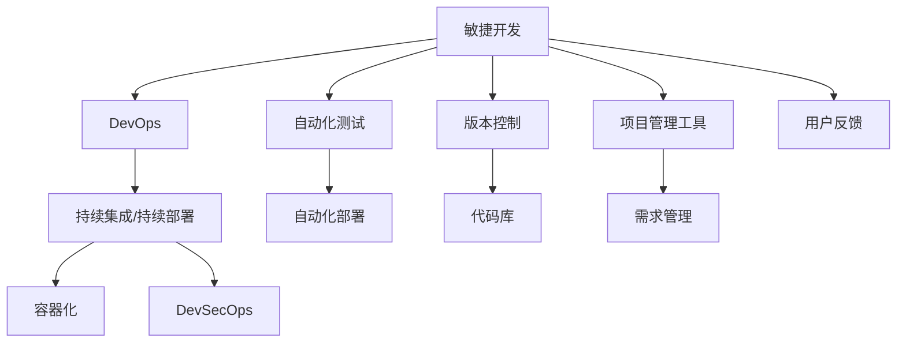

                 

# 软件2.0的项目管理最佳实践

在快速迭代、客户导向的互联网时代，软件2.0的开发模式逐渐取代了传统的瀑布模型，成为主流开发方式。软件2.0以需求为中心，强调快速响应客户反馈，不断迭代升级，提高产品的竞争力和用户满意度。在这一模式下，项目管理面临许多新的挑战，本文将深入探讨软件2.0的项目管理最佳实践，帮助开发者更好地应对这些挑战。

## 1. 背景介绍

### 1.1 背景描述
随着互联网和移动互联网的普及，企业对软件的需求日益增长。过去的软件开发模式以瀑布模型为主，强调阶段性成果和正式文档，开发周期长，客户需求变化难以迅速响应。为了应对这一挑战，敏捷开发方法应运而生，如Scrum、Kanban等敏捷框架。

然而，敏捷开发虽然注重客户反馈和快速迭代，但对文档、测试和质量控制等仍然存在一定忽视。随着技术的不断进步和市场需求的变化，软件2.0的开发模式逐渐兴起，它结合了敏捷开发和DevOps的理念，强调代码和功能的快速交付，同时对质量、性能和安全性给予更高关注。

### 1.2 背景问题
在软件2.0的开发模式中，项目管理面临以下几大挑战：

1. **快速迭代带来的质量问题**：软件2.0强调快速交付，但对代码质量、性能和安全性等关键指标的关注不足，容易产生bug和安全隐患。
2. **团队协作的挑战**：软件2.0强调跨团队协作，但不同团队的沟通和协作难度较大，容易出现信息不对称和任务冲突。
3. **客户需求变化的应对**：客户需求变化频繁，软件2.0要求能够迅速响应，但如何高效管理需求变更，仍是一个难题。
4. **自动化测试与持续集成**：软件2.0的快速迭代需要大量自动化测试和持续集成，但如何保证测试覆盖率和持续集成系统的稳定性，也是一大挑战。

## 2. 核心概念与联系

### 2.1 核心概念概述
软件2.0的项目管理涉及多个关键概念，包括敏捷开发、DevOps、持续集成/持续部署(CI/CD)、容器化、DevSecOps等。这些概念紧密联系，共同构成了软件2.0的开发和部署框架。

#### 敏捷开发
敏捷开发是一种以客户需求为中心的开发模式，强调快速迭代、灵活应变和团队协作。其核心理念包括自组织团队、迭代开发、客户参与和持续反馈等。

#### DevOps
DevOps是将软件开发和运维流程自动化，实现快速交付和持续改进的开发模式。其核心目标包括提升开发效率、缩短交付周期、提高质量和安全性等。

#### 持续集成/持续部署
持续集成和持续部署是DevOps的核心技术之一，通过自动化测试和部署，实现代码频繁交付和快速反馈，保证软件质量和稳定性。

#### 容器化
容器化是将应用程序及其依赖打包到可移植的容器中的技术，通过容器化实现应用的快速部署和迁移。

#### DevSecOps
DevSecOps是将安全纳入DevOps流程，通过自动化测试和扫描，确保软件在开发、测试和部署过程中满足安全标准。

### 2.2 核心概念的联系

这些概念之间的联系可以通过以下Mermaid流程图来展示：

这个流程图展示了敏捷开发、DevOps、持续集成/持续部署、容器化和DevSecOps之间的联系：

1. 敏捷开发通过快速迭代、持续反馈和客户参与，确保需求变更能迅速响应。
2. DevOps通过自动化测试和部署，提升交付速度和质量。
3. 持续集成/持续部署是DevOps的核心技术之一，实现代码频繁交付和快速反馈。
4. 容器化通过打包应用程序及其依赖，实现快速部署和迁移。
5. DevSecOps通过自动化测试和扫描，确保软件在开发、测试和部署过程中满足安全标准。
6. 自动化测试和自动化部署是DevOps的核心，通过版本控制和代码库管理，实现持续集成和持续部署。

## 3. 核心算法原理 & 具体操作步骤

### 3.1 算法原理概述

软件2.0的项目管理涉及多个关键算法和原理，包括敏捷开发算法、DevOps算法、持续集成/持续部署算法、容器化算法和DevSecOps算法。这些算法和原理共同构成了软件2.0的项目管理框架。

#### 敏捷开发算法
敏捷开发算法主要包括迭代开发和持续反馈两个核心算法。迭代开发算法通过多次迭代，逐步实现产品功能，每次迭代结束后评估并调整需求，确保产品逐步完善。持续反馈算法通过客户参与和团队协作，及时收集反馈，不断优化产品。

#### DevOps算法
DevOps算法主要包括自动化测试和自动化部署两个核心算法。自动化测试算法通过单元测试、集成测试和系统测试等自动化测试方法，确保代码质量和性能。自动化部署算法通过持续集成和持续部署系统，实现代码快速交付和快速反馈。

#### 持续集成/持续部署算法
持续集成/持续部署算法通过版本控制和代码库管理，实现代码频繁交付和快速反馈。具体流程包括代码提交、自动化测试、代码部署和质量评估等步骤。

#### 容器化算法
容器化算法通过容器化技术，实现应用的快速部署和迁移。具体流程包括应用打包、容器构建和容器部署等步骤。

#### DevSecOps算法
DevSecOps算法通过自动化测试和扫描，确保软件在开发、测试和部署过程中满足安全标准。具体流程包括代码扫描、漏洞检测和安全测试等步骤。

### 3.2 算法步骤详解

#### 敏捷开发算法步骤
1. **需求分析和制定计划**：与客户沟通需求，制定迭代计划和里程碑。
2. **迭代开发**：根据迭代计划，逐步实现产品功能，每个迭代周期结束时评估并调整需求。
3. **持续反馈**：通过客户反馈和团队协作，及时收集反馈，不断优化产品。

#### DevOps算法步骤
1. **自动化测试**：编写自动化测试脚本，实现单元测试、集成测试和系统测试等自动化测试方法。
2. **自动化部署**：通过持续集成和持续部署系统，实现代码快速交付和快速反馈。

#### 持续集成/持续部署算法步骤
1. **版本控制**：使用版本控制系统，如Git，管理代码和需求变更。
2. **代码库管理**：将代码提交到代码库，如GitHub、GitLab等，实现版本控制和代码共享。
3. **持续集成**：通过持续集成系统，自动构建和测试代码，实现快速反馈。
4. **持续部署**：通过持续部署系统，自动部署代码到生产环境，实现快速交付。

#### 容器化算法步骤
1. **应用打包**：将应用程序及其依赖打包到容器中，如Docker容器。
2. **容器构建**：通过容器构建工具，如Docker Compose、Kubernetes等，构建和配置容器。
3. **容器部署**：将容器部署到生产环境中，实现应用的快速部署和迁移。

#### DevSecOps算法步骤
1. **代码扫描**：通过静态代码分析工具，扫描代码中的安全漏洞。
2. **漏洞检测**：通过自动化扫描工具，检测代码中的安全漏洞。
3. **安全测试**：通过安全测试工具，进行渗透测试和漏洞验证。

### 3.3 算法优缺点

敏捷开发算法的优点在于灵活应变、快速迭代和客户参与，但也存在需求变更频繁、团队协作难度大的缺点。

DevOps算法的优点在于提升交付速度和质量，但也存在测试覆盖率不足、持续集成系统稳定性差的缺点。

持续集成/持续部署算法的优点在于频繁交付和快速反馈，但也存在版本控制复杂、代码库管理困难的问题。

容器化算法的优点在于快速部署和迁移，但也存在容器运行环境和容器管理复杂的问题。

DevSecOps算法的优点在于提升安全性和可靠性，但也存在安全扫描和漏洞检测误报率高的问题。

### 3.4 算法应用领域

敏捷开发、DevOps、持续集成/持续部署、容器化和DevSecOps等算法和原理，广泛应用于各种软件开发场景，如互联网应用、云服务、移动应用、大数据等。

## 4. 数学模型和公式 & 详细讲解

### 4.1 数学模型构建

软件2.0的项目管理涉及多个数学模型，包括敏捷开发模型、DevOps模型、持续集成/持续部署模型、容器化模型和DevSecOps模型。

#### 敏捷开发模型
敏捷开发模型以迭代开发和持续反馈为核心，数学模型为：

$$
F_{敏捷} = f_{迭代开发} + f_{持续反馈}
$$

其中，$f_{迭代开发}$表示迭代开发算法，$f_{持续反馈}$表示持续反馈算法。

#### DevOps模型
DevOps模型以自动化测试和自动化部署为核心，数学模型为：

$$
F_{DevOps} = f_{自动化测试} + f_{自动化部署}
$$

其中，$f_{自动化测试}$表示自动化测试算法，$f_{自动化部署}$表示自动化部署算法。

#### 持续集成/持续部署模型
持续集成/持续部署模型以版本控制和代码库管理为核心，数学模型为：

$$
F_{CI/CD} = f_{版本控制} + f_{代码库管理} + f_{持续集成} + f_{持续部署}
$$

其中，$f_{版本控制}$表示版本控制算法，$f_{代码库管理}$表示代码库管理算法，$f_{持续集成}$表示持续集成算法，$f_{持续部署}$表示持续部署算法。

#### 容器化模型
容器化模型以容器构建和容器部署为核心，数学模型为：

$$
F_{容器化} = f_{容器构建} + f_{容器部署}
$$

其中，$f_{容器构建}$表示容器构建算法，$f_{容器部署}$表示容器部署算法。

#### DevSecOps模型
DevSecOps模型以自动化测试和扫描为核心，数学模型为：

$$
F_{DevSecOps} = f_{代码扫描} + f_{漏洞检测} + f_{安全测试}
$$

其中，$f_{代码扫描}$表示代码扫描算法，$f_{漏洞检测}$表示漏洞检测算法，$f_{安全测试}$表示安全测试算法。

### 4.2 公式推导过程

以敏捷开发模型为例，推导其核心算法$f_{迭代开发}$和$f_{持续反馈}$的公式。

敏捷开发的核心算法$f_{迭代开发}$的公式为：

$$
f_{迭代开发} = \sum_{i=1}^{n} x_i
$$

其中，$x_i$表示第$i$个迭代周期的功能点，$n$表示迭代周期数。

敏捷开发的核心算法$f_{持续反馈}$的公式为：

$$
f_{持续反馈} = \sum_{i=1}^{n} y_i
$$

其中，$y_i$表示第$i$个迭代周期的客户反馈量，$n$表示迭代周期数。

通过上述公式，可以计算出敏捷开发模型的总功能点和总客户反馈量，进而评估敏捷开发算法的有效性。

### 4.3 案例分析与讲解

以一个电商平台的开发为例，分析如何应用敏捷开发和DevOps算法。

1. **敏捷开发算法应用**：电商平台需求频繁变化，使用敏捷开发算法，通过多次迭代，逐步实现产品功能，每次迭代结束后评估并调整需求。团队内部进行定期回顾和反馈，确保需求变更能迅速响应。

2. **DevOps算法应用**：电商平台的代码频繁交付和快速反馈，使用DevOps算法，编写自动化测试脚本，实现单元测试、集成测试和系统测试等自动化测试方法。通过持续集成和持续部署系统，实现代码快速交付和快速反馈。

## 5. 项目实践：代码实例和详细解释说明

### 5.1 开发环境搭建

在软件2.0的项目管理中，需要搭建一个完善的开发环境，以便高效开发和测试。以下是搭建开发环境的步骤：

1. **选择版本控制系统**：选择Git作为版本控制系统，安装Git客户端和Git Server。

2. **配置代码库**：在Git Server上创建代码库，将开发团队的所有代码上传至代码库中。

3. **安装CI/CD工具**：选择Jenkins作为持续集成工具，安装Jenkins Server，并配置CI/CD流水线。

4. **安装容器化工具**：选择Docker作为容器化工具，安装Docker Engine，并配置Docker Compose。

5. **安装DevSecOps工具**：选择SonarQube作为代码扫描工具，安装SonarQube Server，并配置扫描规则。

### 5.2 源代码详细实现

以电商平台的订单管理系统为例，详细解释如何应用敏捷开发和DevOps算法。

#### 敏捷开发实现

1. **需求分析**：与客户沟通需求，制定迭代计划和里程碑。

2. **迭代开发**：使用Jira工具，记录每个迭代周期的任务和进度。使用Scrum框架，每周进行回顾和反馈，确保任务按时完成。

3. **持续反馈**：使用Jira和Slack工具，及时收集客户反馈，调整需求和任务。

#### DevOps实现

1. **自动化测试**：编写自动化测试脚本，使用JUnit和TestNG框架实现单元测试、集成测试和系统测试。

2. **自动化部署**：使用Jenkins Server，配置CI/CD流水线，实现代码自动构建、测试和部署。

3. **持续集成**：使用Git作为版本控制系统，将代码提交到Git Server中，Jenkins Server自动触发CI/CD流水线，实现快速反馈。

## 6. 实际应用场景

### 6.1 电商平台的订单管理系统

电商平台的订单管理系统是一个典型的软件2.0项目，涉及敏捷开发和DevOps算法。具体应用场景如下：

1. **敏捷开发应用**：订单管理系统需求频繁变化，使用敏捷开发算法，通过多次迭代，逐步实现订单管理功能。每个迭代周期结束后，评估并调整需求，确保订单管理系统的稳定和高效。

2. **DevOps应用**：订单管理系统代码频繁交付和快速反馈，使用DevOps算法，编写自动化测试脚本，实现单元测试、集成测试和系统测试等自动化测试方法。通过持续集成和持续部署系统，实现代码快速交付和快速反馈。

### 6.2 金融行业的风险管理系统

金融行业的风险管理系统是一个复杂的软件2.0项目，涉及持续集成/持续部署和容器化算法。具体应用场景如下：

1. **持续集成/持续部署应用**：金融行业的风险管理需求变化频繁，使用持续集成/持续部署算法，通过版本控制和代码库管理，实现代码频繁交付和快速反馈。使用Jenkins Server，配置CI/CD流水线，实现代码自动构建、测试和部署。

2. **容器化应用**：金融行业的风险管理系统需要高效部署和迁移，使用容器化算法，将应用程序及其依赖打包到容器中，通过Docker Engine和Docker Compose，实现应用的快速部署和迁移。

## 7. 工具和资源推荐

### 7.1 学习资源推荐

1. **《敏捷开发实践指南》**：详细介绍敏捷开发的核心理念和实践方法，帮助开发团队掌握敏捷开发技巧。

2. **《DevOps实践指南》**：介绍DevOps的核心技术和最佳实践，帮助开发团队实现快速交付和持续改进。

3. **《持续集成与持续部署》**：详细讲解持续集成和持续部署的流程和方法，帮助开发团队实现自动化测试和快速反馈。

4. **《容器化技术入门》**：介绍容器化技术的基础知识和应用场景，帮助开发团队实现应用的快速部署和迁移。

5. **《DevSecOps实践指南》**：详细介绍DevSecOps的核心技术和最佳实践，帮助开发团队实现安全开发和持续改进。

### 7.2 开发工具推荐

1. **Jenkins Server**：开源的持续集成工具，支持CI/CD流水线配置和自动化测试。

2. **Docker Engine**：开源的容器化工具，支持Docker容器构建和部署。

3. **SonarQube Server**：开源的DevSecOps工具，支持代码扫描和漏洞检测。

4. **Git Server**：开源的版本控制系统，支持代码库管理和版本控制。

5. **Jira**：开源的项目管理工具，支持敏捷开发和需求管理。

### 7.3 相关论文推荐

1. **《敏捷开发与Scrum框架》**：详细介绍敏捷开发和Scrum框架的核心概念和实践方法，帮助开发团队掌握敏捷开发技巧。

2. **《DevOps实践指南》**：介绍DevOps的核心技术和最佳实践，帮助开发团队实现快速交付和持续改进。

3. **《持续集成与持续部署》**：详细讲解持续集成和持续部署的流程和方法，帮助开发团队实现自动化测试和快速反馈。

4. **《容器化技术入门》**：介绍容器化技术的基础知识和应用场景，帮助开发团队实现应用的快速部署和迁移。

5. **《DevSecOps实践指南》**：详细介绍DevSecOps的核心技术和最佳实践，帮助开发团队实现安全开发和持续改进。

## 8. 总结：未来发展趋势与挑战

### 8.1 研究成果总结

软件2.0的项目管理强调敏捷开发、DevOps、持续集成/持续部署、容器化和DevSecOps等技术的应用，通过自动化测试和快速交付，提升开发效率和产品质量。然而，软件2.0的项目管理仍面临需求变更频繁、团队协作困难、测试覆盖率不足等问题，需要进一步优化和改进。

### 8.2 未来发展趋势

1. **自动化程度的提升**：随着自动化测试和自动化部署技术的不断发展，软件2.0的项目管理将进一步提升自动化程度，减少人工干预，提高开发效率和质量。

2. **云原生应用的普及**：云原生应用将逐步取代传统应用，软件2.0的项目管理将更加依赖云平台和容器化技术，实现应用的快速部署和弹性扩展。

3. **DevSecOps的深入应用**：DevSecOps将成为软件2.0的项目管理的重要组成部分，通过自动化测试和扫描，提升软件的安全性和可靠性。

4. **微服务架构的应用**：微服务架构将逐步取代单体架构，软件2.0的项目管理将更加依赖微服务框架和容器化技术，实现应用的模块化和可扩展性。

### 8.3 面临的挑战

1. **需求变更的管理**：软件2.0的项目管理需要高效管理需求变更，确保需求变更能迅速响应，避免需求冲突和延期。

2. **团队协作的优化**：软件2.0的项目管理需要优化团队协作，确保团队成员之间的沟通和协作顺畅，避免信息不对称和任务冲突。

3. **测试覆盖率的提升**：软件2.0的项目管理需要提升自动化测试的覆盖率，确保代码质量和安全。

4. **容器化和云平台的优化**：软件2.0的项目管理需要优化容器化技术和云平台的使用，避免容器运行环境和容器管理复杂。

5. **DevSecOps的落地**：软件2.0的项目管理需要落地DevSecOps技术，避免安全扫描和漏洞检测误报率高的问题。

### 8.4 研究展望

1. **自动化测试和持续集成**：未来的软件开发需要更多自动化测试和持续集成，提升测试覆盖率和开发效率。

2. **微服务架构和容器化**：未来的软件开发需要更多微服务架构和容器化技术，提升应用的模块化和可扩展性。

3. **DevSecOps和安全开发**：未来的软件开发需要更多DevSecOps技术，提升软件的安全性和可靠性。

4. **云原生应用和云平台**：未来的软件开发需要更多云原生应用和云平台，实现应用的快速部署和弹性扩展。

## 9. 附录：常见问题与解答

### 9.1 问题一：敏捷开发算法是否适用于所有项目？

答：敏捷开发算法适用于需要快速迭代、客户需求频繁变化的项目，如互联网应用、电商、金融等。对于需求稳定的项目，瀑布模型可能更适合。

### 9.2 问题二：DevOps算法是否适用于所有项目？

答：DevOps算法适用于需要快速交付和持续改进的项目，如互联网应用、云服务、移动应用等。对于需求稳定的项目，DevOps算法可能不适合。

### 9.3 问题三：容器化算法是否适用于所有项目？

答：容器化算法适用于需要快速部署和迁移的项目，如互联网应用、云服务、移动应用等。对于需求稳定的项目，容器化算法可能不适合。

### 9.4 问题四：DevSecOps算法是否适用于所有项目？

答：DevSecOps算法适用于需要安全开发和持续改进的项目，如互联网应用、云服务、移动应用等。对于需求稳定的项目，DevSecOps算法可能不适合。

### 9.5 问题五：如何优化敏捷开发算法的管理？

答：优化敏捷开发算法的管理，可以采取以下措施：

1. **制定明确的需求计划和里程碑**：与客户沟通需求，制定明确的需求计划和里程碑，确保需求变更能迅速响应。

2. **定期回顾和反馈**：定期进行回顾和反馈，评估任务进度和质量，及时调整需求和任务。

3. **使用敏捷开发工具**：使用Jira、Scrum等敏捷开发工具，记录任务和进度，确保任务按时完成。

### 9.6 问题六：如何优化DevOps算法的管理？

答：优化DevOps算法的管理，可以采取以下措施：

1. **自动化测试**：编写自动化测试脚本，实现单元测试、集成测试和系统测试等自动化测试方法，确保代码质量和安全。

2. **持续集成和持续部署**：使用Jenkins Server，配置CI/CD流水线，实现代码自动构建、测试和部署，实现快速反馈。

3. **使用容器化技术**：使用Docker Engine和Docker Compose，实现应用的快速部署和迁移。

### 9.7 问题七：如何优化容器化算法的管理？

答：优化容器化算法的管理，可以采取以下措施：

1. **使用容器化技术**：使用Docker Engine和Docker Compose，实现应用的快速部署和迁移。

2. **管理容器运行环境**：优化容器运行环境，避免容器管理复杂，提高容器化算法的可靠性。

### 9.8 问题八：如何优化DevSecOps算法的管理？

答：优化DevSecOps算法的管理，可以采取以下措施：

1. **使用DevSecOps工具**：使用SonarQube等DevSecOps工具，实现代码扫描和漏洞检测，提升软件的安全性和可靠性。

2. **定期进行安全扫描**：定期进行安全扫描和漏洞检测，及时发现和修复安全漏洞，提升软件的安全性。

3. **使用静态代码分析工具**：使用静态代码分析工具，扫描代码中的安全漏洞，提升代码质量和安全。

作者：禅与计算机程序设计艺术 / Zen and the Art of Computer Programming

