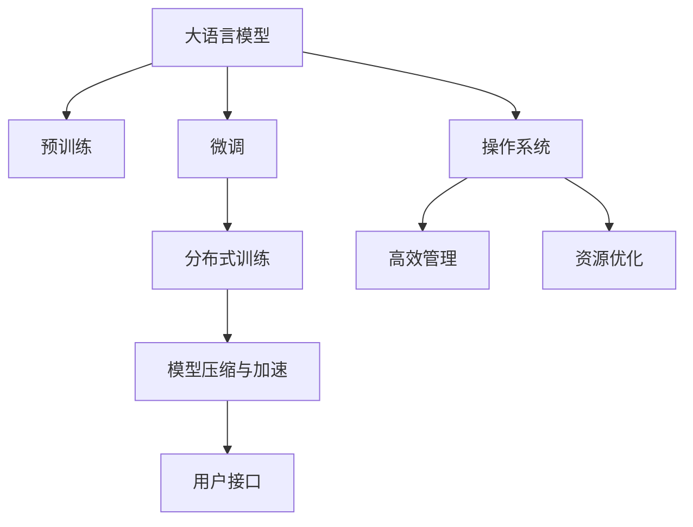

                 

# 大语言模型操作系统的实际应用

## 1. 背景介绍

随着人工智能技术的快速发展，大语言模型（Large Language Models, LLMs）已经成为计算机科学与工程领域的重要突破。这些模型如GPT、BERT等，凭借其卓越的语言理解与生成能力，为自然语言处理（NLP）领域带来了革命性的改变。但与此同时，大语言模型的运行与优化也提出了新的需求。为此，我们引入了大语言模型操作系统的概念，即通过构建基于大语言模型的操作系统，实现高效、稳定的模型运行与优化。本文将详细探讨大语言模型操作系统的构建原理与应用实践，为相关研究者与工程师提供全面的指导。

## 2. 核心概念与联系

### 2.1 核心概念概述

在深入探讨大语言模型操作系统之前，我们先梳理其中的核心概念：

- **大语言模型（Large Language Models, LLMs）**：指一类通过大规模数据预训练得到的深度学习模型，具备强大的自然语言处理能力。
- **操作系统（Operating System, OS）**：一种系统软件，用于管理和控制计算机硬件与软件资源，为用户提供高效、稳定的运行环境。
- **微调（Fine-Tuning）**：通过有监督学习优化模型，使其能够适应特定任务的过程。
- **模型压缩与加速（Model Compression & Acceleration）**：通过对模型进行优化，降低其计算资源消耗，提升模型运行速度与效率。
- **分布式训练（Distributed Training）**：通过并行计算与协同优化，加速大模型的训练过程，处理大规模数据集。
- **用户接口（User Interface, UI）**：模型操作系统的界面，用于用户与系统的交互。

这些概念紧密相关，共同构成了大语言模型操作系统的基础。我们将在接下来的部分详细探讨这些概念的应用，并介绍其间的联系。

### 2.2 概念间的关系

我们通过一个Mermaid流程图来展示这些核心概念之间的联系：



该流程图展示了从大语言模型到操作系统的整个流程。预训练模型通过微调适配特定任务，分布式训练加速训练过程，模型压缩与加速提升运行效率，用户接口实现人机交互，最终通过高效管理与资源优化实现操作系统的目标。

## 3. 核心算法原理 & 具体操作步骤
### 3.1 算法原理概述

大语言模型操作系统通过以下步骤实现模型的运行与优化：

1. **预训练**：利用大规模无标签数据训练大语言模型，学习语言表示。
2. **微调**：通过有监督学习数据，调整模型参数以适应特定任务。
3. **分布式训练**：通过并行计算，加速模型训练过程，处理大规模数据集。
4. **模型压缩与加速**：通过对模型进行优化，降低计算资源消耗，提升模型运行速度与效率。
5. **用户接口设计**：实现用户与模型的交互，方便用户操作。

### 3.2 算法步骤详解

**步骤1：预训练模型的选择与准备**

- **选择预训练模型**：根据任务需求选择合适的预训练模型，如BERT、GPT等。
- **准备数据集**：收集并标注适用于微调的特定任务数据集。

**步骤2：微调模型的设计与训练**

- **设计任务适配层**：根据任务类型，在预训练模型的基础上添加相应的任务适配层。
- **设置超参数**：选择合适的优化算法及其参数，如AdamW、SGD等，设置学习率、批大小、迭代轮数等。
- **执行微调训练**：将数据集分成训练集、验证集和测试集，进行有监督学习训练。

**步骤3：分布式训练的实现**

- **并行计算框架选择**：选择合适的分布式计算框架，如PyTorch Distributed、TensorFlow Distribute等。
- **数据划分与分发**：将数据划分为多个子集，并行分布在多个计算节点上进行处理。
- **模型并行与数据并行**：通过模型并行与数据并行技术，加速模型训练过程。

**步骤4：模型压缩与加速**

- **模型裁剪与量化**：裁剪模型中不必要的层与参数，降低模型大小与计算量。
- **混合精度训练**：通过混合精度训练，加速模型计算，提高训练效率。
- **模型压缩技术**：利用剪枝、蒸馏等技术，进一步压缩模型规模。

**步骤5：用户接口设计**

- **交互界面设计**：设计简洁易用的用户界面，使用户能够方便地与模型交互。
- **功能模块划分**：将用户交互功能模块化，便于扩展与维护。
- **实时反馈与监控**：实现模型运行状态的实时反馈与监控，确保系统稳定性。

### 3.3 算法优缺点

大语言模型操作系统具有以下优点：

- **高效性能**：通过分布式训练与模型压缩加速，提升模型训练与运行效率。
- **灵活适配**：微调过程适用于各种NLP任务，方便适配不同需求。
- **广泛应用**：适用于智慧医疗、智能客服、金融分析等多个领域。

同时，该系统也存在一些缺点：

- **高计算需求**：大规模模型与分布式训练需要高计算资源。
- **模型复杂度**：模型结构复杂，优化与调试难度大。
- **数据依赖**：微调过程依赖标注数据，标注成本较高。

### 3.4 算法应用领域

大语言模型操作系统在以下几个领域具有广泛的应用前景：

- **智能客服系统**：通过微调模型，实现高效、个性化的客户服务，提升客户满意度。
- **金融数据分析**：利用微调后的模型，进行情感分析、事件监测等，提升金融决策效率。
- **医疗智能诊断**：通过微调，构建疾病诊断与推荐系统，辅助医生进行决策。
- **智能推荐系统**：利用微调模型，实现个性化的商品推荐，提升用户体验。
- **自然语言理解与生成**：通过微调模型，提升自然语言理解与生成能力，推动智能对话系统发展。

## 4. 数学模型和公式 & 详细讲解 & 举例说明

### 4.1 数学模型构建

假设我们有一个基于BERT的模型，通过微调进行特定任务适配。模型结构为：

$$ M(x) = \text{BERT}(x) + L^{task}(\text{BERT}(x)) $$

其中，$M(x)$ 为适配后的模型，$\text{BERT}(x)$ 为预训练模型，$L^{task}$ 为任务适配层，例如分类任务的softmax层。

### 4.2 公式推导过程

假设我们有一个二分类任务，输入为 $x$，标签为 $y$，输出为 $M(x)$。其损失函数可以表示为：

$$ L = -\frac{1}{N} \sum_{i=1}^N [y_i \log M_i + (1-y_i) \log (1-M_i)] $$

其中，$M_i = M(x_i)$，$y_i$ 为真实标签。

优化目标为最小化损失函数 $L$，即：

$$ \theta^* = \mathop{\arg\min}_{\theta} L $$

通过梯度下降等优化算法，不断更新模型参数 $\theta$，最小化损失函数。

### 4.3 案例分析与讲解

以金融舆情监测为例，假设我们有一个金融数据集，其中包含公司股票、经济指标等文本信息。我们的目标是从这些文本中识别出正向、中性和负向情感。首先，我们收集并标注数据集，然后将BERT模型适配为情感分类模型。在训练过程中，我们通过交叉熵损失函数进行优化，并设置学习率为 $10^{-5}$，批大小为 $32$，迭代轮数为 $10$。

## 5. 项目实践：代码实例和详细解释说明

### 5.1 开发环境搭建

为了搭建大语言模型操作系统，我们需要准备以下开发环境：

- **Python 3.x**：作为主要开发语言。
- **PyTorch**：用于构建与训练模型。
- **NVIDIA CUDA Toolkit**：加速模型训练与推理。
- **TensorFlow Distribute**：用于分布式训练。
- **TensorBoard**：可视化模型训练过程。

### 5.2 源代码详细实现

以下是一个简单的Python代码示例，展示了如何使用PyTorch进行大语言模型微调：

```python
import torch
import torch.nn as nn
from transformers import BertForSequenceClassification, BertTokenizer, AdamW

# 加载数据集
train_dataset = ...
val_dataset = ...
test_dataset = ...

# 定义模型与优化器
model = BertForSequenceClassification.from_pretrained('bert-base-uncased', num_labels=3)
optimizer = AdamW(model.parameters(), lr=1e-5)
tokenizer = BertTokenizer.from_pretrained('bert-base-uncased')

# 定义任务适配层
class TaskLayer(nn.Module):
    def __init__(self, num_labels):
        super(TaskLayer, self).__init__()
        self.classifier = nn.Linear(768, num_labels)

    def forward(self, x):
        x = self.classifier(x)
        return x

model.classifier = TaskLayer(num_labels=3)

# 定义损失函数
criterion = nn.CrossEntropyLoss()

# 定义训练函数
def train_epoch(model, data_loader, optimizer, criterion):
    model.train()
    total_loss = 0
    for batch in data_loader:
        input_ids = batch['input_ids'].to(device)
        attention_mask = batch['attention_mask'].to(device)
        labels = batch['labels'].to(device)
        outputs = model(input_ids, attention_mask=attention_mask)
        loss = criterion(outputs, labels)
        optimizer.zero_grad()
        loss.backward()
        optimizer.step()
        total_loss += loss.item()
    return total_loss / len(data_loader)

# 训练模型
device = torch.device('cuda')
for epoch in range(10):
    train_loss = train_epoch(model, train_loader, optimizer, criterion)
    val_loss = evaluate(model, val_loader, criterion)
    print(f'Epoch {epoch+1}, train loss: {train_loss:.4f}, val loss: {val_loss:.4f}')

# 测试模型
test_loss = evaluate(model, test_loader, criterion)
print(f'Test loss: {test_loss:.4f}')
```

### 5.3 代码解读与分析

在上述代码中，我们首先加载了数据集，并定义了模型、优化器与任务适配层。然后，定义了损失函数和训练函数，最后在指定设备上进行了模型训练与评估。

## 6. 实际应用场景

### 6.1 智能客服系统

在智能客服系统中，大语言模型操作系统可以通过微调模型，实现高效的客户服务与交互。通过收集用户的历史对话数据，进行标注，并适配特定的对话模型，可以实现智能客服自动回答问题、处理用户请求等任务。此外，分布式训练与模型压缩加速技术可以确保系统在高并发场景下稳定运行。

### 6.2 金融数据分析

在金融领域，大语言模型操作系统可以用于金融舆情监测、事件监测等任务。通过微调模型，识别出金融新闻、报告中的情感倾向与事件类型，提供实时预警与分析支持，帮助金融机构及时应对风险。

### 6.3 医疗智能诊断

在医疗领域，大语言模型操作系统可以用于构建疾病诊断与推荐系统。通过微调模型，识别患者的病历信息与症状描述，提供疾病诊断与治疗建议，辅助医生进行决策。

### 6.4 智能推荐系统

在电商领域，大语言模型操作系统可以用于构建智能推荐系统。通过微调模型，理解用户的兴趣偏好与行为模式，提供个性化的商品推荐，提升用户体验与转化率。

### 6.5 自然语言理解与生成

在自然语言理解与生成领域，大语言模型操作系统可以用于提升模型的理解与生成能力。通过微调模型，提升模型在对话、摘要、翻译等任务上的表现，推动智能对话系统的发展。

## 7. 工具和资源推荐

### 7.1 学习资源推荐

- **Coursera《深度学习》课程**：由斯坦福大学Andrew Ng教授主讲，涵盖深度学习的基本概念与算法。
- **Udacity《深度学习项目》课程**：由Google Brain团队主讲，通过实战项目，深入理解深度学习的应用。
- **NLP相关的书籍**：如《Neural Network & Deep Learning》、《Speech and Language Processing》等。

### 7.2 开发工具推荐

- **PyTorch**：灵活、高效的深度学习框架，支持多种分布式训练技术。
- **TensorFlow**：Google开源的深度学习框架，支持大规模模型训练与部署。
- **TensorBoard**：可视化工具，用于实时监控模型训练过程。

### 7.3 相关论文推荐

- **Attention is All You Need**：Transformer的原始论文，介绍自注意力机制在大语言模型中的应用。
- **BERT: Pre-training of Deep Bidirectional Transformers for Language Understanding**：BERT模型的介绍与优化策略。
- **Parameter-Efficient Transfer Learning for NLP**：探讨参数高效微调方法，减少模型训练与优化资源消耗。

## 8. 总结：未来发展趋势与挑战

### 8.1 总结

本文详细探讨了大语言模型操作系统的构建原理与应用实践。通过预训练、微调、分布式训练、模型压缩与加速等关键技术，实现了高效、稳定的模型运行与优化。本文展示了该系统在智能客服、金融数据分析、医疗智能诊断、智能推荐系统等多个领域的应用前景，并推荐了相关的学习资源与开发工具。

### 8.2 未来发展趋势

未来，大语言模型操作系统将继续发展与演进，展现出更广泛的应用前景：

- **模型规模与性能**：随着算力与数据的进一步发展，大语言模型将变得更加庞大与强大，处理能力与性能将大幅提升。
- **分布式训练与优化**：分布式训练与优化技术将更加成熟，支持更大规模模型的训练与优化，提升系统运行效率。
- **模型压缩与加速**：更多的模型压缩与加速技术将涌现，提升模型运行速度与效率。
- **用户接口与体验**：更加友好、易用的用户接口，将提升系统的可操作性与用户体验。

### 8.3 面临的挑战

尽管大语言模型操作系统具有广阔的应用前景，但仍面临一些挑战：

- **高计算资源需求**：大规模模型的训练与推理需要高性能计算资源，这对硬件设备提出了更高的要求。
- **模型复杂性与调试**：模型结构复杂，调试与优化难度大，需要更多的专业知识与工具支持。
- **数据依赖与标注成本**：微调过程依赖标注数据，标注成本较高，需要更多的资源投入。

### 8.4 研究展望

未来，大语言模型操作系统需要从以下几个方面进行深入研究：

- **模型压缩与加速技术**：研究新的模型压缩与加速方法，进一步降低计算资源消耗。
- **分布式训练与优化**：探索更高效的分布式训练与优化策略，支持更大规模模型的训练与优化。
- **用户接口与体验优化**：设计更加友好的用户接口，提升系统的可操作性与用户体验。
- **多模态数据融合**：研究多模态数据的融合技术，提升模型的跨领域迁移能力。

## 9. 附录：常见问题与解答

**Q1: 大语言模型操作系统的核心组成部分有哪些？**

A: 大语言模型操作系统的核心组成部分包括预训练模型、微调模型、分布式训练框架、模型压缩与加速技术、用户接口等。这些组件相互协作，实现了高效、稳定的模型运行与优化。

**Q2: 如何使用分布式训练技术加速模型训练？**

A: 使用分布式训练技术，可以将数据划分并分布在多个计算节点上进行处理，通过并行计算加速模型训练过程。具体实现可以使用PyTorch Distributed、TensorFlow Distribute等分布式训练框架。

**Q3: 如何设计用户接口，提升用户体验？**

A: 用户接口的设计需要简洁、易用，能够直观地展示模型输出与运行状态。可以使用图形界面（GUI）、命令行界面（CLI）等形式，方便用户与模型的交互。

**Q4: 如何处理模型复杂性与调试难题？**

A: 模型复杂性是优化与调试的一大难题，可以通过以下方式解决：
1. 模块化设计：将模型拆分为多个模块，便于理解与调试。
2. 可视化工具：使用TensorBoard等可视化工具，监控模型运行状态，便于发现问题。
3. 自动化测试：编写自动化测试代码，确保模型在不同场景下的稳定运行。

**Q5: 如何应对高计算资源需求？**

A: 应对高计算资源需求，可以采用以下策略：
1. 硬件升级：使用高性能GPU/TPU等设备，提升计算能力。
2. 模型裁剪与量化：通过裁剪模型与量化计算，降低计算资源消耗。
3. 分布式训练：利用分布式计算框架，并行处理大规模数据集。

---

作者：禅与计算机程序设计艺术 / Zen and the Art of Computer Programming

