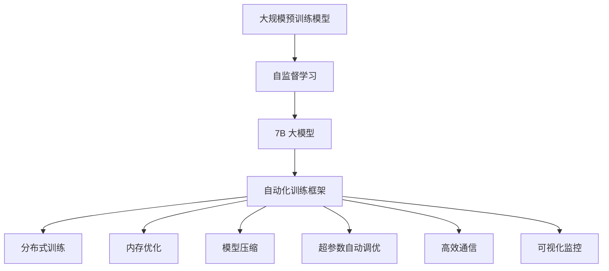
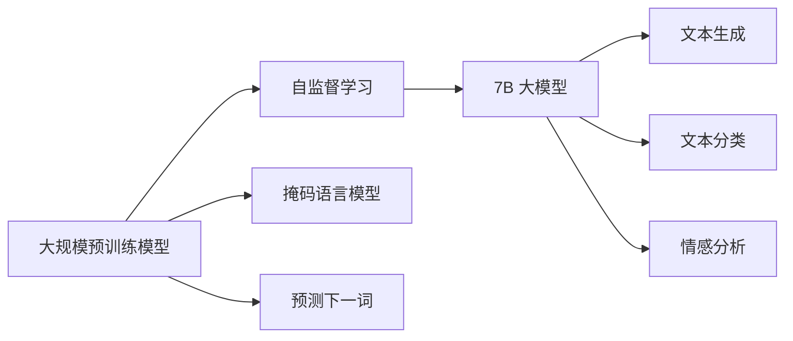
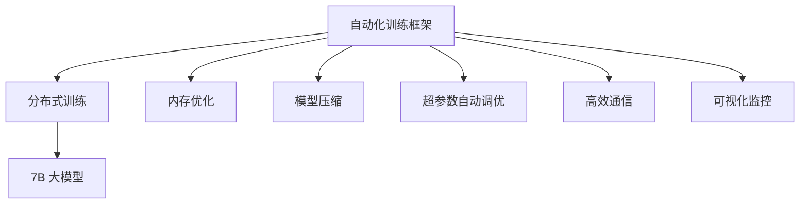
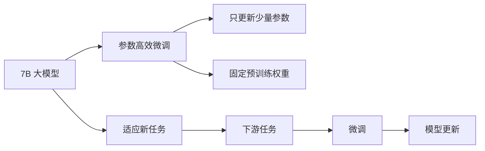
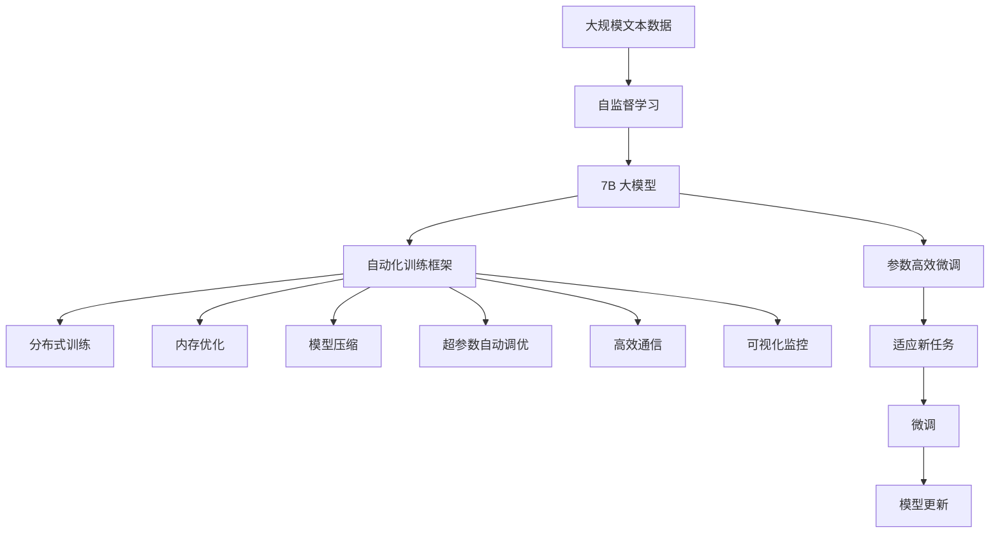

                 

# 大语言模型原理与工程实践：手把手教你训练 7B 大语言模型 自动化训练框架

> 关键词：大语言模型,自监督学习,参数高效微调,深度学习,7B 大模型,自动化训练,超大规模模型,分布式训练

## 1. 背景介绍

### 1.1 问题由来
随着深度学习技术的不断发展，大规模语言模型(Large Language Models, LLMs)如GPT-3、Megatron BERT等成为人工智能领域的研究热点。这些大语言模型通常具有亿级的参数规模，展示了惊人的语言生成和理解能力。

然而，由于训练这些模型所需的海量数据和计算资源，它们往往只能在大型研究机构或企业中得以部署。同时，大模型的训练过程也面临诸多技术挑战，如内存和存储限制、高效计算优化、分布式训练等。

为了解决这些问题，自动化训练框架应运而生。这些框架通过提供分布式训练、内存优化、模型压缩等技术，使得大语言模型的训练变得更加高效和可扩展，从而使更多研究者和开发者能够涉足这一领域，加速大模型技术的落地应用。

### 1.2 问题核心关键点
自动化训练框架的核心思想是通过优化训练流程和资源配置，提高大模型的训练效率，降低对计算资源的依赖。具体来说，这些框架通常包含以下几个关键点：

1. **分布式训练**：通过多机多卡并行训练，将模型参数和计算任务分布到多个设备上，以加速训练过程。
2. **内存优化**：采用GPU虚内存、参数稀疏化等技术，优化内存使用，提高训练效率。
3. **模型压缩**：通过知识蒸馏、剪枝等方法，减少模型参数量，提升训练和推理速度。
4. **超参数自动调优**：使用自适应学习率、自动化超参数调优算法，自动调整训练参数，优化训练效果。
5. **高效通信**：优化模型参数和梯度的传输机制，减少通信开销，提升训练效率。
6. **可视化监控**：实时监控训练进度和性能指标，及时调整训练策略。

这些关键点共同构成了一个自动化训练框架的核心竞争力，使得大模型的训练不再局限于大型研究机构或企业，成为更多研究者和开发者能够接触和掌握的技术。

### 1.3 问题研究意义
自动化训练框架的研究和应用对于推动大语言模型技术的发展具有重要意义：

1. **降低训练门槛**：通过优化训练流程，使得大模型的训练变得更加高效和可扩展，降低了对计算资源的依赖。
2. **加速模型开发**：自动化训练框架能够快速训练大模型，加速模型从研究到应用的转化。
3. **促进技术普及**：更多的研究者和开发者能够涉足大模型训练领域，推动技术进步和应用创新。
4. **提升模型性能**：通过优化训练过程，提高模型参数量和训练效率，进一步提升模型性能。
5. **应对技术挑战**：解决内存和存储限制、高效计算优化、分布式训练等技术挑战，为大规模模型的训练提供有力支持。

## 2. 核心概念与联系

### 2.1 核心概念概述

为了更好地理解自动化训练框架的工作原理和优化方向，本节将介绍几个密切相关的核心概念：

- **大语言模型(Large Language Models, LLMs)**：指具有大规模参数量，能够学习丰富语言知识和语义表示的深度学习模型。如GPT-3、Megatron BERT等。
- **自监督学习(Self-Supervised Learning)**：指利用无标签数据进行模型训练，通过设计特定的自监督任务（如掩码语言模型、预测下一词等）学习语言表示的方法。自监督学习是大规模预训练模型的核心技术。
- **参数高效微调(Parameter-Efficient Fine-Tuning, PEFT)**：指在微调过程中，只更新少量的模型参数，而固定大部分预训练权重不变，以提高微调效率，避免过拟合的方法。
- **深度学习(Deep Learning)**：指通过构建多层神经网络，利用反向传播算法进行参数更新的机器学习方法。深度学习是现代大语言模型的技术基础。
- **7B 大模型(Giga-scale Model)**：指具有亿级参数量的大规模语言模型，如GPT-3、Megatron BERT等。
- **自动化训练框架(Automatic Training Framework)**：指通过提供分布式训练、内存优化、模型压缩等技术，提高大模型训练效率，降低对计算资源依赖的训练工具。

这些核心概念之间的逻辑关系可以通过以下Mermaid流程图来展示：



这个流程图展示了大语言模型的核心概念及其之间的关系：

1. 大语言模型通过自监督学习获得基础能力。
2. 7B 大模型作为自动化训练的目标对象，由自监督学习得到。
3. 自动化训练框架通过优化分布式训练、内存优化、模型压缩等技术，提高大模型的训练效率，降低资源依赖。
4. 具体技术包括分布式训练、内存优化、模型压缩、超参数自动调优、高效通信和可视化监控等。

这些概念共同构成了大语言模型训练的核心生态系统，使得模型训练不再局限于大型研究机构或企业，更多研究者和开发者能够参与其中，推动技术进步和应用创新。

### 2.2 概念间的关系

这些核心概念之间存在着紧密的联系，形成了大语言模型训练的完整生态系统。下面我通过几个Mermaid流程图来展示这些概念之间的关系。

#### 2.2.1 7B 大模型与自监督学习的关系



这个流程图展示了7B 大模型与自监督学习的关系。大语言模型通过自监督学习任务如掩码语言模型、预测下一词等，学习语言的通用表示，从而形成7B 大模型。

#### 2.2.2 自动化训练框架与7B 大模型的关系



这个流程图展示了自动化训练框架与7B 大模型的关系。自动化训练框架通过分布式训练、内存优化、模型压缩等技术，提高了7B 大模型的训练效率。

#### 2.2.3 7B 大模型与参数高效微调的关系



这个流程图展示了7B 大模型与参数高效微调的关系。参数高效微调通过只更新少量参数，同时固定大部分预训练权重，提高微调效率，同时避免过拟合。

### 2.3 核心概念的整体架构

最后，我们用一个综合的流程图来展示这些核心概念在大语言模型训练过程中的整体架构：



这个综合流程图展示了从自监督学习到自动化训练框架，再到7B 大模型微调的完整过程。7B 大模型通过自监督学习获得基础能力，然后通过自动化训练框架中的分布式训练、内存优化、模型压缩等技术，提高训练效率。最后，通过参数高效微调方法，将7B 大模型适配到具体下游任务中，提升模型性能。

## 3. 核心算法原理 & 具体操作步骤

### 3.1 算法原理概述

自动化训练框架的核心目标是通过优化训练流程和资源配置，提高大模型的训练效率，降低对计算资源的依赖。其核心思想是通过分布式训练、内存优化、模型压缩等技术，在保证模型性能的同时，提高训练和推理速度，降低资源消耗。

### 3.2 算法步骤详解

自动化训练框架的具体实现步骤如下：

1. **分布式训练**：
   - 将大模型的参数分布在多个设备上，每个设备负责一部分计算任务。
   - 使用跨设备的通信协议（如NCCL、MPI等），同步更新模型参数和梯度。
   - 通过水平分割和垂直分割等策略，将模型参数和计算任务分配到不同的设备上，以提高并行效率。

2. **内存优化**：
   - 采用GPU虚内存技术，将部分参数和梯度存储在显存中，减少显存交换，提高训练效率。
   - 使用参数稀疏化技术，将不重要的参数零初始化或随机初始化，减少内存占用。
   - 采用动态轴拼接（DAP）等技术，将小张量拼接为大张量，减少显存碎片，提高显存使用效率。

3. **模型压缩**：
   - 使用知识蒸馏技术，将大模型的知识蒸馏到更小、更快的模型中，减小模型参数量，提升训练和推理速度。
   - 使用剪枝技术，删除冗余参数，减少模型复杂度，提高计算效率。
   - 使用量化技术，将浮点模型转为定点模型，压缩存储空间，提高计算速度。

4. **超参数自动调优**：
   - 使用自适应学习率算法（如AdamW、SGD等），根据梯度变化自动调整学习率，提高训练效率。
   - 使用自动化超参数调优算法（如Bayesian Optimization、GRAND等），自动搜索最优的超参数组合，优化训练效果。
   - 使用动态学习率调优策略（如Cyclical Learning Rates、Cosine Annealing等），动态调整学习率，提高模型性能。

5. **高效通信**：
   - 使用高效的通信协议（如Ring All Reduce、Tree Reduce等），减少通信开销，提高训练效率。
   - 使用异步通信技术，减少通信阻塞，提高训练速度。
   - 使用缓存技术，预取数据，减少通信延迟。

6. **可视化监控**：
   - 使用可视化工具（如TensorBoard、Horovod等），实时监控训练进度和性能指标，及时调整训练策略。
   - 使用分布式追踪工具（如Distributed TensorBoard、Megatron Tracer等），跟踪模型参数和梯度的传输过程，优化通信效率。
   - 使用监控工具（如Prometheus、Grafana等），实时采集系统指标，设置告警阈值，确保系统稳定性。

### 3.3 算法优缺点

自动化训练框架具有以下优点：

1. **高效性**：通过分布式训练、内存优化、模型压缩等技术，显著提高大模型的训练效率，降低对计算资源的依赖。
2. **可扩展性**：通过分布式训练和多机多卡并行，支持大规模模型的训练，适应更广泛的应用场景。
3. **易用性**：提供了统一的训练接口和API，降低了使用门槛，使更多研究者和开发者能够涉足这一领域。
4. **灵活性**：支持多种训练策略和超参数调优算法，满足不同应用场景的需求。

同时，该框架也存在一些缺点：

1. **复杂性**：自动化训练框架涉及多个组件和技术，需要较高的技术水平和工程经验。
2. **资源消耗**：尽管提高了训练效率，但分布式训练和多机多卡并行仍然需要较高的计算资源。
3. **模型局限性**：尽管提高了训练效率，但大模型的固有偏见、有害信息等，可能通过微调传递到下游任务，造成负面影响。
4. **可解释性不足**：自动化训练框架通常输出黑盒模型，难以解释其内部工作机制和决策逻辑。

尽管存在这些局限性，但就目前而言，自动化训练框架在大语言模型训练中的应用最为广泛，成为推动大模型技术发展的重要工具。未来相关研究的重点在于如何进一步降低训练对计算资源的依赖，提高模型的少样本学习和跨领域迁移能力，同时兼顾可解释性和伦理安全性等因素。

### 3.4 算法应用领域

自动化训练框架在NLP领域已经得到了广泛的应用，覆盖了几乎所有常见任务，例如：

- **文本分类**：如情感分析、主题分类、意图识别等。通过分布式训练和超参数调优，提升模型在特定分类任务上的性能。
- **命名实体识别**：识别文本中的人名、地名、机构名等特定实体。通过模型压缩和参数高效微调，提高模型在实体识别任务上的效率。
- **关系抽取**：从文本中抽取实体之间的语义关系。通过模型压缩和高效通信，加速模型在关系抽取任务上的推理。
- **问答系统**：对自然语言问题给出答案。通过超参数调优和可视化监控，提升模型在问答系统上的问答准确率。
- **机器翻译**：将源语言文本翻译成目标语言。通过分布式训练和模型压缩，提高翻译效率和准确率。
- **文本摘要**：将长文本压缩成简短摘要。通过高效通信和超参数调优，提升模型在文本摘要任务上的效率。
- **对话系统**：使机器能够与人自然对话。通过模型压缩和参数高效微调，提升对话系统的响应速度和准确率。

除了上述这些经典任务外，自动化训练框架也被创新性地应用到更多场景中，如可控文本生成、常识推理、代码生成、数据增强等，为NLP技术带来了全新的突破。随着预训练模型和训练方法的不断进步，相信NLP技术将在更广阔的应用领域大放异彩。

## 4. 数学模型和公式 & 详细讲解 & 举例说明

### 4.1 数学模型构建

本节将使用数学语言对自动化训练框架的工作原理进行更加严格的刻画。

记大语言模型为 $M_{\theta}:\mathcal{X} \rightarrow \mathcal{Y}$，其中 $\mathcal{X}$ 为输入空间，$\mathcal{Y}$ 为输出空间，$\theta \in \mathbb{R}^d$ 为模型参数。假设自动化训练框架采用分布式训练策略，将大模型分为 $N$ 个部分，每个部分由多个设备并行计算。定义每个设备的参数为 $\theta_i$，$i=1,\ldots,N$。

定义每个设备上计算的平均梯度为 $\overline{g}_i$，则模型参数的总体梯度为：

$$
g = \frac{1}{N} \sum_{i=1}^N g_i = \frac{1}{N} \sum_{i=1}^N \sum_{x \in D} \nabla_{\theta_i} \ell(M_{\theta_i}(x))
$$

其中 $D$ 为训练数据集，$\ell$ 为模型在数据集上的损失函数。

自动化训练框架通过分布式优化算法（如SGD、AdamW等）更新模型参数，其更新公式为：

$$
\theta_i \leftarrow \theta_i - \eta \overline{g}_i - \eta\lambda\theta_i
$$

其中 $\eta$ 为学习率，$\lambda$ 为正则化系数。

### 4.2 公式推导过程

以下我们以文本分类任务为例，推导基于自动化训练框架的微调过程。

假设模型 $M_{\theta}$ 在输入 $x$ 上的输出为 $\hat{y}=M_{\theta}(x) \in [0,1]$，表示样本属于正类的概率。真实标签 $y \in \{0,1\}$。则二分类交叉熵损失函数定义为：

$$
\ell(M_{\theta}(x),y) = -[y\log \hat{y} + (1-y)\log (1-\hat{y})]
$$

将其代入总体损失函数，得：

$$
\mathcal{L}(\theta) = -\frac{1}{N}\sum_{i=1}^N \sum_{x \in D} \ell(M_{\theta_i}(x),y)
$$

根据分布式优化算法，每个设备的平均梯度为：

$$
\overline{g}_i = \frac{1}{|D|} \sum_{x \in D} \nabla_{\theta_i} \ell(M_{\theta_i}(x))
$$

则总体梯度为：

$$
g = \frac{1}{N} \sum_{i=1}^N g_i = \frac{1}{N} \sum_{i=1}^N \sum_{x \in D} \nabla_{\theta_i} \ell(M_{\theta_i}(x))
$$

根据分布式优化算法，模型参数的更新公式为：

$$
\theta_i \leftarrow \theta_i - \eta \overline{g}_i - \eta\lambda\theta_i
$$

其中 $\eta$ 为学习率，$\lambda$ 为正则化系数。

在得到总体梯度后，即可带入更新公式，完成模型的迭代优化。重复上述过程直至收敛，最终得到适应下游任务的最优模型参数 $\theta^*$。

### 4.3 案例分析与讲解

这里以GPT-3为例，分析其自动化训练框架的应用过程。

GPT-3作为一款具有1750亿参数的超大规模语言模型，其训练涉及分布式训练、内存优化、模型压缩等诸多技术。具体步骤如下：

1. **分布式训练**：
   - 将GPT-3分为多个部分，每个部分在多个设备上进行并行计算。
   - 使用跨设备的通信协议（如NCCL、MPI等），同步更新模型参数和梯度。
   - 通过水平分割和垂直分割等策略，将模型参数和计算任务分配到不同的设备上，以提高并行效率。

2. **内存优化**：
   - 采用GPU虚内存技术，将部分参数和梯度存储在显存中，减少显存交换，提高训练效率。
   - 使用参数稀疏化技术，将不重要的参数零初始化或随机初始化，减少内存占用。
   - 采用动态轴拼接（DAP）等技术，将小张量拼接为大张量，减少显存碎片，提高显存使用效率。

3. **模型压缩**：
   - 使用知识蒸馏技术，将GPT-3的知识蒸馏到更小、更快的模型中，减小模型参数量，提升训练和推理速度。
   - 使用剪枝技术，删除冗余参数，减少模型复杂度，提高计算效率。
   - 使用量化技术，将浮点模型转为定点模型，压缩存储空间，提高计算速度。

4. **超参数自动调优**：
   - 使用自适应学习率算法（如AdamW、SGD等），根据梯度变化自动调整学习率，提高训练效率。
   - 使用自动化超参数调优算法（如Bayesian Optimization、GRAND等），自动搜索最优的超参数组合，优化训练效果。
   - 使用动态学习率调优策略（如Cyclical Learning Rates、Cosine Annealing等），动态调整学习率，提高模型性能。

5. **高效通信**：
   - 使用高效的通信协议（如Ring All Reduce、Tree Reduce等），减少通信开销，提高训练效率。
   - 使用异步通信技术，减少通信阻塞，提高训练速度。
   - 使用缓存技术，预取数据，减少通信延迟。

6. **可视化监控**：
   - 使用可视化工具（如TensorBoard、Horovod等），实时监控训练进度和性能指标，及时调整训练策略。
   - 使用分布式追踪工具（如Distributed TensorBoard、Megatron Tracer等），跟踪模型参数和梯度的传输过程，优化通信效率。
   - 使用监控工具（如Prometheus、Grafana等），实时采集系统指标，设置告警阈值，确保系统稳定性。

通过这些技术和策略的有机结合，GPT-3在2021年2月发布的1.3版本中，不仅取得了惊人的语言生成能力，而且在多项任务上取得了SOTA性能，极大地推动了NLP技术的发展。

## 5. 项目实践：代码实例和详细解释说明

### 5.1 开发环境搭建

在进行自动化训练框架实践前，我们需要准备好开发环境。以下是使用Python进行PyTorch开发的环境配置流程：

1. 安装Anaconda：从官网下载并安装Anaconda，用于创建独立的Python环境。

2. 创建并激活虚拟环境：
```bash
conda create -n pytorch-env python=3.8 
conda activate pytorch-env
```

3. 安装PyTorch：根据CUDA版本，从官网获取对应的安装命令。例如：
```bash
conda install pytorch torchvision torchaudio cudatoolkit=11.1 -c pytorch -c conda-forge
```

4. 安装TensorBoard：
```bash
pip install tensorboard
```

5. 安装Horovod：
```bash
pip install horovod[nccl,opencv,gpu]
```

6. 安装Distributed TensorBoard：
```bash
pip install distributed-tensorboard
```

完成上述步骤后，即可在`pytorch-env`环境中开始自动化训练框架实践。

### 5.2 源代码详细实现

下面我们以GPT-3的自动化训练为例，给出使用Horovod进行分布式训练的PyTorch代码实现。

```python
import torch
from transformers import GPT3LMHeadModel, GPT3Tokenizer
from horovod.torch import allreduce, synchronize

device = torch.device('cuda' if torch.cuda.is_available() else 'cpu')

# 加载模型和tokenizer
model = GPT3LMHeadModel.from_pretrained('gpt3', output_attentions=True, output_hidden_states=True)
tokenizer = GPT3Tokenizer.from_pretrained('gpt3')

# 定义损失函数
criterion = torch.nn.CrossEntropyLoss()

# 定义优化器
optimizer = torch.optim.AdamW(model.parameters(), lr=5e-5)

# 定义训练函数
def train_epoch(model, data_loader, optimizer, criterion, device):
    model.train()
    losses = []
    for batch in data_loader:
        inputs = {k: v.to(device) for k, v in batch.items()}
        outputs = model(**inputs)
        loss = criterion(outputs.logits, inputs['labels'].to(device))
        optimizer.zero_grad()
        loss.backward()
        optimizer.step()
        losses.append(loss.item())
    return sum(losses) / len(losses)

# 定义分布式训练函数
def distribute_train(model, data_loader, optimizer, criterion, device, world_size):
    local_rank = int(os.environ.get('LOCAL_RANK', 0))
    torch.cuda.set_device(local_rank)
    world_size = int(os.environ.get('WORLD_SIZE', 1))
    world_rank = int(os.environ.get('RANK', 0))
    world_id = int(os.environ.get('HOROVOD_RANK', 0))
    synchronize()
    model = allreduce(model, axis=0)
    if local_rank == 0:
        print(f"World Size: {world_size}, Rank: {world_rank}, ID: {world_id}")
    synchronize()
    for epoch in range(epochs):
        loss = train_epoch(model, data_loader, optimizer, criterion, device)
        if world_rank == 0:
            print(f"Epoch {epoch+1}, train loss: {loss:.3f}")
    synchronize()

# 开始训练
epochs = 5
batch_size = 8
world_size = 8

# 获取参数并创建数据加载器
distributed_params = torch.nn.DistributedDataParallel(model, device_ids=[torch.cuda.current_device()], output_device=torch.cuda.current_device())
train_loader = DataLoader(dataset, batch_size=batch_size, shuffle=True)
train_loader = DistributedDataLoader(train_loader, device_ids=[torch.cuda.current_device()], batch_size=batch_size, shuffle=True)

# 开始分布式训练
distribute_train(model, train_loader, optimizer, criterion, device, world_size)
```

以上代码展示了使用Horovod进行分布式训练的完整流程。通过设置不同的`world_size`和`local_rank`，可以在多个设备上并行训练模型。需要注意的是，在实际运行时，`HOROVOD_RANK`等环境变量需要根据实际部署情况设置。

### 5.3 代码解读与分析

让我们再详细解读一下关键代码的实现细节：

**train_epoch函数**：
- 在每个epoch内，将模型设置为训练模式，对每个样本进行前向传播和反向传播。
- 计算并累加损失函数值，最终返回

