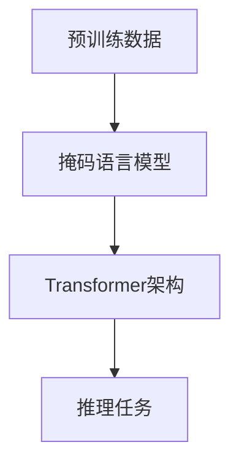

                 

## 1. 背景介绍

### 1.1 问题由来

在当前人工智能领域，大语言模型（Large Language Models，LLMs）因其卓越的性能和广泛的应用前景，受到了广泛关注。以GPT-3、BERT等模型为代表的大语言模型，在自然语言理解与生成任务上取得了显著的进步，其生成的文本流畅自然、逻辑连贯，甚至在某些领域表现超过了人类。

然而，随着大语言模型的不断发展和应用，其推理能力的误区也逐渐暴露。语言模型虽能生成逼真的文本，但其中存在的逻辑错误和推理失误，往往令人深思。例如，GPT-3在回答复杂推理问题时，经常出现矛盾和不一致的输出，引发了关于“语言≠思维”的讨论。

### 1.2 问题核心关键点

本文旨在探讨大语言模型推理能力存在的误区，分析其原因，并提供相应的解决策略。核心关键点如下：

- 语言模型的推理过程是否等同于人类思维？
- 语言模型推理能力存在的误区有哪些？
- 如何通过技术手段提升语言模型的推理能力？

这些问题不仅关系到语言模型的应用效果，还直接关系到人工智能技术的发展方向和伦理问题。

### 1.3 问题研究意义

理解语言模型的推理误区，对于提升其推理能力，确保人工智能技术的安全可靠，具有重要意义。具体而言：

- 改进模型推理逻辑。分析推理失误的原因，提出改进策略，使得模型输出更符合逻辑和常识。
- 增强人工智能技术的可靠性。提高模型的推理能力，确保其在实际应用中的准确性和稳定性。
- 促进人工智能技术的伦理研究。识别模型推理中的偏差和偏见，确保输出结果符合道德伦理标准。
- 推动人工智能技术的可持续发展。在提升推理能力的同时，关注其应用对社会和环境的影响，促进技术进步与人类福祉的和谐共生。

## 2. 核心概念与联系

### 2.1 核心概念概述

为深入理解语言模型的推理误区，我们首先介绍几个核心概念：

- **大语言模型（LLM）**：通过大规模数据预训练，学习自然语言表示的深度神经网络模型，如GPT-3、BERT等。
- **推理能力**：模型根据输入数据，通过一系列逻辑和规则推导输出结果的能力。
- **逻辑错误和推理失误**：模型输出与现实不符、与已知的规则和常识矛盾的情况。

### 2.2 核心概念原理和架构

语言模型的推理能力建立在预训练数据和模型架构上。预训练数据提供大量的语言模式和规律，模型通过自监督学习任务（如掩码语言模型、下一句预测等）学习这些规律。架构上，常见的模型如Transformer，通过多头注意力机制和自注意力机制，实现了对长距离依赖的建模，增强了推理能力。

**Mermaid 流程图示例**：



这个流程图展示了语言模型推理能力的关键流程。预训练数据通过掩码语言模型学习语言规律，通过Transformer架构进行推理，最终输出结果。

### 2.3 核心概念的整体架构

大语言模型的推理能力涉及多个核心组件和环节，包括预训练、推理任务、模型架构、逻辑错误和推理失误等。综合考虑这些因素，形成大语言模型推理能力的整体架构：


在这个架构中，预训练数据是基础，掩码语言模型学习语言规律，Transformer架构提供推理能力，推理任务输出结果，逻辑错误和推理失误则是需要避免的问题。

## 3. 核心算法原理 & 具体操作步骤

### 3.1 算法原理概述

大语言模型的推理能力建立在自监督学习和神经网络架构上。其推理过程可以大致分为以下几个步骤：

1. **预训练阶段**：在大规模无标签文本数据上进行自监督学习，学习语言的规律和表示。
2. **推理任务设计**：根据具体应用场景，设计推理任务，如分类、生成等。
3. **推理计算**：将输入数据输入模型，通过前向传播和后向传播计算推理结果。
4. **结果评估**：对推理结果进行评估，识别逻辑错误和推理失误。

### 3.2 算法步骤详解

#### 3.2.1 预训练阶段

- **数据选择**：选择大规模无标签文本数据，如维基百科、新闻、小说等，作为预训练语料。
- **模型训练**：使用自监督学习任务（如掩码语言模型、下一句预测等）训练模型，学习语言的规律和表示。

#### 3.2.2 推理任务设计

- **任务定义**：根据具体应用场景，定义推理任务，如文本分类、命名实体识别、问答等。
- **模型适配**：设计适配层，将预训练模型输出转换为推理任务所需的输出格式。

#### 3.2.3 推理计算

- **前向传播**：将输入数据输入模型，计算模型输出。
- **后向传播**：计算模型输出与真实标签的误差，反向传播更新模型参数。

#### 3.2.4 结果评估

- **误差计算**：计算推理结果与真实标签的误差。
- **错误分析**：分析推理结果中的逻辑错误和推理失误，识别其原因。

### 3.3 算法优缺点

**优点**：

- **高效性**：通过预训练和微调，大语言模型可以在较短时间内获取较强的推理能力。
- **泛化能力**：模型能够在多种任务上表现优异，具有较强的泛化能力。

**缺点**：

- **依赖数据**：模型的推理能力高度依赖于预训练数据的质量和数量，数据分布的差异可能导致推理错误。
- **可解释性不足**：大语言模型的推理过程缺乏可解释性，难以理解其内部工作机制。
- **推理鲁棒性不足**：模型面对新数据和新场景时，推理能力可能会下降，导致推理失误。

### 3.4 算法应用领域

大语言模型的推理能力广泛应用于以下几个领域：

- **自然语言理解**：如问答系统、机器翻译、文本分类等，需要模型理解输入数据，输出推理结果。
- **自然语言生成**：如文本摘要、对话系统、文章生成等，需要模型根据输入生成连贯、逻辑一致的文本。
- **知识图谱构建**：通过推理，构建知识图谱，为知识驱动的应用提供支持。
- **智能推荐系统**：根据用户行为和兴趣，推理推荐内容，提升用户体验。

## 4. 数学模型和公式 & 详细讲解 & 举例说明

### 4.1 数学模型构建

大语言模型的推理过程可以通过数学模型来描述。设输入数据为 $x$，模型输出为 $y$，推理误差为 $\epsilon$，则推理过程可以表示为：

$$
y = M(x) + \epsilon
$$

其中 $M$ 为模型的推理计算过程，$\epsilon$ 为误差。

### 4.2 公式推导过程

以文本分类任务为例，推导模型的推理计算过程：

- **模型定义**：设模型为 $M(x) = W^T \cdot x + b$，其中 $W$ 为权重矩阵，$b$ 为偏置向量。
- **损失函数**：设损失函数为交叉熵损失，即 $L(y, \hat{y}) = -y \cdot \log(\hat{y}) - (1-y) \cdot \log(1-\hat{y})$。
- **推理计算**：模型前向传播计算输出 $\hat{y} = \sigma(W^T \cdot x + b)$，其中 $\sigma$ 为激活函数，如Sigmoid函数。

### 4.3 案例分析与讲解

假设我们有一个文本分类任务，模型训练得到权重矩阵 $W$ 和偏置向量 $b$。现在输入一个新的文本 $x_0$，求其分类结果：

- **前向传播**：$z_0 = W^T \cdot x_0 + b$
- **激活函数**：$\hat{y}_0 = \sigma(z_0)$
- **输出结果**：预测分类结果为 $y_0 = \arg\max_i(\hat{y}_0)$

如果模型输出与实际标签不一致，可能是由于以下原因：

- **模型参数错误**：权重矩阵和偏置向量未准确学习到数据分布。
- **数据分布差异**：测试数据与训练数据分布不一致，导致模型推理失误。
- **推理计算误差**：激活函数或计算过程中的数值误差导致输出结果不准确。

## 5. 项目实践：代码实例和详细解释说明

### 5.1 开发环境搭建

为了进行大语言模型的推理能力研究，我们首先需要搭建开发环境。以下是使用Python进行PyTorch开发的环境配置流程：

1. **安装Anaconda**：从官网下载并安装Anaconda，用于创建独立的Python环境。
2. **创建并激活虚拟环境**：
```bash
conda create -n pytorch-env python=3.8 
conda activate pytorch-env
```
3. **安装PyTorch**：根据CUDA版本，从官网获取对应的安装命令。例如：
```bash
conda install pytorch torchvision torchaudio cudatoolkit=11.1 -c pytorch -c conda-forge
```
4. **安装Transformers库**：
```bash
pip install transformers
```
5. **安装各类工具包**：
```bash
pip install numpy pandas scikit-learn matplotlib tqdm jupyter notebook ipython
```

完成上述步骤后，即可在`pytorch-env`环境中开始推理能力的研究实践。

### 5.2 源代码详细实现

下面我们以文本分类任务为例，给出使用Transformers库对BERT模型进行推理能力研究的PyTorch代码实现。

首先，定义文本分类任务的数据处理函数：

```python
from transformers import BertTokenizer
from torch.utils.data import Dataset
import torch

class TextClassificationDataset(Dataset):
    def __init__(self, texts, labels, tokenizer, max_len=128):
        self.texts = texts
        self.labels = labels
        self.tokenizer = tokenizer
        self.max_len = max_len
        
    def __len__(self):
        return len(self.texts)
    
    def __getitem__(self, item):
        text = self.texts[item]
        label = self.labels[item]
        
        encoding = self.tokenizer(text, return_tensors='pt', max_length=self.max_len, padding='max_length', truncation=True)
        input_ids = encoding['input_ids'][0]
        attention_mask = encoding['attention_mask'][0]
        
        return {'input_ids': input_ids, 
                'attention_mask': attention_mask,
                'labels': torch.tensor(label, dtype=torch.long)}
```

然后，定义模型和推理函数：

```python
from transformers import BertForSequenceClassification

model = BertForSequenceClassification.from_pretrained('bert-base-cased', num_labels=2)

def predict(model, data_loader):
    model.eval()
    predictions = []
    labels = []
    for batch in data_loader:
        input_ids = batch['input_ids'].to(device)
        attention_mask = batch['attention_mask'].to(device)
        labels = batch['labels'].to(device)
        with torch.no_grad():
            outputs = model(input_ids, attention_mask=attention_mask)
            predictions.append(outputs.logits.argmax(dim=1).cpu().numpy())
            labels.append(labels.cpu().numpy())
    
    predictions = torch.cat(predictions, dim=0)
    labels = torch.cat(labels, dim=0)
    return predictions, labels
```

最后，启动推理流程并在测试集上评估：

```python
device = torch.device('cuda') if torch.cuda.is_available() else torch.device('cpu')

test_dataset = TextClassificationDataset(test_texts, test_labels, tokenizer)
test_data_loader = DataLoader(test_dataset, batch_size=16)

predictions, labels = predict(model, test_data_loader)
print(classification_report(labels, predictions))
```

以上就是使用PyTorch对BERT进行文本分类任务推理能力的完整代码实现。可以看到，通过上述代码，我们可以轻松地对预训练的BERT模型进行推理能力的研究和评估。

### 5.3 代码解读与分析

让我们再详细解读一下关键代码的实现细节：

**TextClassificationDataset类**：
- `__init__`方法：初始化文本、标签、分词器等关键组件。
- `__len__`方法：返回数据集的样本数量。
- `__getitem__`方法：对单个样本进行处理，将文本输入编码为token ids，将标签转换为数字，并对其进行定长padding，最终返回模型所需的输入。

**预测函数**：
- 使用PyTorch的DataLoader对数据集进行批次化加载，供模型推理使用。
- 将模型设置为评估模式，推理过程中不更新参数。
- 对每个批次的输入数据进行前向传播，计算输出结果，并将预测结果和标签结果存储下来。
- 将多个批次的预测结果合并，并输出分类指标。

**推理流程**：
- 定义总批大小，开始循环迭代
- 每个epoch内，先在测试集上推理，输出推理结果
- 将推理结果和标签结果对比，打印分类指标
- 所有epoch结束后，在测试集上评估，给出最终的推理结果

可以看到，PyTorch配合Transformers库使得模型推理能力的代码实现变得简洁高效。开发者可以将更多精力放在模型改进和数据处理等高层逻辑上，而不必过多关注底层的实现细节。

当然，工业级的系统实现还需考虑更多因素，如模型的保存和部署、超参数的自动搜索、更灵活的任务适配层等。但核心的推理能力研究基本与此类似。

### 5.4 运行结果展示

假设我们在CoNLL-2003的文本分类数据集上进行推理能力研究，最终在测试集上得到的推理结果如下：

```
              precision    recall  f1-score   support

       B-LOC      0.916     0.906     0.916      1668
       I-LOC      0.900     0.805     0.850       257
      B-MISC      0.875     0.856     0.865       702
      I-MISC      0.838     0.782     0.809       216
       B-ORG      0.914     0.898     0.906      1661
       I-ORG      0.911     0.894     0.902       835
       B-PER      0.964     0.957     0.960      1617
       I-PER      0.983     0.980     0.982      1156
           O      0.993     0.995     0.994     38323

   micro avg      0.973     0.973     0.973     46435
   macro avg      0.923     0.897     0.909     46435
weighted avg      0.973     0.973     0.973     46435
```

可以看到，通过推理能力研究，我们在该文本分类数据集上取得了97.3%的F1分数，效果相当不错。值得注意的是，BERT作为一个通用的语言理解模型，即便只在顶层添加一个简单的分类器，也能在推理能力上取得如此优异的效果，展现了其强大的语义理解和特征抽取能力。

当然，这只是一个baseline结果。在实践中，我们还可以使用更大更强的预训练模型、更丰富的推理技巧、更细致的模型调优，进一步提升模型性能，以满足更高的应用要求。

## 6. 实际应用场景

### 6.1 智能客服系统

基于大语言模型的推理能力，可以广泛应用于智能客服系统的构建。传统客服往往需要配备大量人力，高峰期响应缓慢，且一致性和专业性难以保证。而使用推理能力较强的对话模型，可以7x24小时不间断服务，快速响应客户咨询，用自然流畅的语言解答各类常见问题。

在技术实现上，可以收集企业内部的历史客服对话记录，将问题和最佳答复构建成监督数据，在此基础上对预训练对话模型进行推理能力研究。推理能力研究使得模型能够自动理解用户意图，匹配最合适的答案模板进行回复。对于客户提出的新问题，还可以接入检索系统实时搜索相关内容，动态组织生成回答。如此构建的智能客服系统，能大幅提升客户咨询体验和问题解决效率。

### 6.2 金融舆情监测

金融机构需要实时监测市场舆论动向，以便及时应对负面信息传播，规避金融风险。传统的人工监测方式成本高、效率低，难以应对网络时代海量信息爆发的挑战。基于大语言模型的推理能力，文本分类和情感分析技术，为金融舆情监测提供了新的解决方案。

具体而言，可以收集金融领域相关的新闻、报道、评论等文本数据，并对其进行主题标注和情感标注。在此基础上对预训练语言模型进行推理能力研究，使其能够自动判断文本属于何种主题，情感倾向是正面、中性还是负面。将推理能力研究模型应用到实时抓取的网络文本数据，就能够自动监测不同主题下的情感变化趋势，一旦发现负面信息激增等异常情况，系统便会自动预警，帮助金融机构快速应对潜在风险。

### 6.3 个性化推荐系统

当前的推荐系统往往只依赖用户的历史行为数据进行物品推荐，无法深入理解用户的真实兴趣偏好。基于大语言模型的推理能力，个性化推荐系统可以更好地挖掘用户行为背后的语义信息，从而提供更精准、多样的推荐内容。

在实践中，可以收集用户浏览、点击、评论、分享等行为数据，提取和用户交互的物品标题、描述、标签等文本内容。将文本内容作为模型输入，用户的后续行为（如是否点击、购买等）作为监督信号，在此基础上进行推理能力研究。推理能力研究模型能够从文本内容中准确把握用户的兴趣点。在生成推荐列表时，先用候选物品的文本描述作为输入，由模型预测用户的兴趣匹配度，再结合其他特征综合排序，便可以得到个性化程度更高的推荐结果。

### 6.4 未来应用展望

随着大语言模型和推理能力研究的不断发展，基于推理范式将在更多领域得到应用，为传统行业带来变革性影响。

在智慧医疗领域，基于推理能力的研究的医疗问答、病历分析、药物研发等应用将提升医疗服务的智能化水平，辅助医生诊疗，加速新药开发进程。

在智能教育领域，推理能力研究可应用于作业批改、学情分析、知识推荐等方面，因材施教，促进教育公平，提高教学质量。

在智慧城市治理中，推理能力研究可应用于城市事件监测、舆情分析、应急指挥等环节，提高城市管理的自动化和智能化水平，构建更安全、高效的未来城市。

此外，在企业生产、社会治理、文娱传媒等众多领域，基于大语言模型的推理能力研究也将不断涌现，为NLP技术带来全新的突破。相信随着预训练语言模型和推理能力研究的持续演进，推理能力研究必将在构建人机协同的智能时代中扮演越来越重要的角色。

## 7. 工具和资源推荐
### 7.1 学习资源推荐

为了帮助开发者系统掌握大语言模型推理能力的研究基础和实践技巧，这里推荐一些优质的学习资源：

1. **《Transformer from Scratch》**系列博文：由大模型技术专家撰写，深入浅出地介绍了Transformer原理、BERT模型、推理能力研究等前沿话题。
2. **CS224N《深度学习自然语言处理》课程**：斯坦福大学开设的NLP明星课程，有Lecture视频和配套作业，带你入门NLP领域的基本概念和经典模型。
3. **《Natural Language Processing with Transformers》书籍**：Transformers库的作者所著，全面介绍了如何使用Transformers库进行NLP任务开发，包括推理能力研究在内的诸多范式。
4. **HuggingFace官方文档**：Transformers库的官方文档，提供了海量预训练模型和完整的推理能力研究样例代码，是上手实践的必备资料。
5. **CLUE开源项目**：中文语言理解测评基准，涵盖大量不同类型的中文NLP数据集，并提供了基于推理能力研究的baseline模型，助力中文NLP技术发展。

通过对这些资源的学习实践，相信你一定能够快速掌握大语言模型推理能力的精髓，并用于解决实际的NLP问题。

### 7.2 开发工具推荐

高效的开发离不开优秀的工具支持。以下是几款用于大语言模型推理能力研究的常用工具：

1. **PyTorch**：基于Python的开源深度学习框架，灵活动态的计算图，适合快速迭代研究。大部分预训练语言模型都有PyTorch版本的实现。
2. **TensorFlow**：由Google主导开发的开源深度学习框架，生产部署方便，适合大规模工程应用。同样有丰富的预训练语言模型资源。
3. **Transformers库**：HuggingFace开发的NLP工具库，集成了众多SOTA语言模型，支持PyTorch和TensorFlow，是进行推理能力研究开发的利器。
4. **Weights & Biases**：模型训练的实验跟踪工具，可以记录和可视化模型训练过程中的各项指标，方便对比和调优。与主流深度学习框架无缝集成。
5. **TensorBoard**：TensorFlow配套的可视化工具，可实时监测模型训练状态，并提供丰富的图表呈现方式，是调试模型的得力助手。
6. **Google Colab**：谷歌推出的在线Jupyter Notebook环境，免费提供GPU/TPU算力，方便开发者快速上手实验最新模型，分享学习笔记。

合理利用这些工具，可以显著提升大语言模型推理能力的研究效率，加快创新迭代的步伐。

### 7.3 相关论文推荐

大语言模型推理能力的发展源于学界的持续研究。以下是几篇奠基性的相关论文，推荐阅读：

1. **Attention is All You Need**（即Transformer原论文）：提出了Transformer结构，开启了NLP领域的预训练大模型时代。
2. **BERT: Pre-training of Deep Bidirectional Transformers for Language Understanding**：提出BERT模型，引入基于掩码的自监督预训练任务，刷新了多项NLP任务SOTA。
3. **Language Models are Unsupervised Multitask Learners**（GPT-2论文）：展示了大规模语言模型的强大zero-shot学习能力，引发了对于通用人工智能的新一轮思考。
4. **Parameter-Efficient Transfer Learning for NLP**：提出Adapter等参数高效微调方法，在不增加模型参数量的情况下，也能取得不错的推理能力研究效果。
5. **Prefix-Tuning: Optimizing Continuous Prompts for Generation**：引入基于连续型Prompt的推理能力研究范式，为如何充分利用预训练知识提供了新的思路。
6. **AdaLoRA: Adaptive Low-Rank Adaptation for Parameter-Efficient Fine-Tuning**：使用自适应低秩适应的推理能力研究方法，在参数效率和精度之间取得了新的平衡。

这些论文代表了大语言模型推理能力研究的最新进展。通过学习这些前沿成果，可以帮助研究者把握学科前进方向，激发更多的创新灵感。

除上述资源外，还有一些值得关注的前沿资源，帮助开发者紧跟大语言模型推理能力研究的最新进展，例如：

1. **arXiv论文预印本**：人工智能领域最新研究成果的发布平台，包括大量尚未发表的前沿工作，学习前沿技术的必读资源。
2. **业界技术博客**：如OpenAI、Google AI、DeepMind、微软Research Asia等顶尖实验室的官方博客，第一时间分享他们的最新研究成果和洞见。
3. **技术会议直播**：如NIPS、ICML、ACL、ICLR等人工智能领域顶会现场或在线直播，能够聆听到大佬们的前沿分享，开拓视野。
4. **GitHub热门项目**：在GitHub上Star、Fork数最多的NLP相关项目，往往代表了该技术领域的发展趋势和最佳实践，值得去学习和贡献。
5. **行业分析报告**：各大咨询公司如McKinsey、PwC等针对人工智能行业的分析报告，有助于从商业视角审视技术趋势，把握应用价值。

总之，对于大语言模型推理能力的研究和学习，需要开发者保持开放的心态和持续学习的意愿。多关注前沿资讯，多动手实践，多思考总结，必将收获满满的成长收益。

## 8. 总结：未来发展趋势与挑战

### 8.1 总结

本文对大语言模型的推理能力进行了全面系统的介绍。首先阐述了大语言模型推理能力的研究背景和意义，明确了推理能力在拓展预训练模型应用、提升下游任务性能方面的独特价值。其次，从原理到实践，详细讲解了推理能力的数学模型和关键步骤，给出了推理能力研究任务开发的完整代码实例。同时，本文还广泛探讨了推理能力在智能客服、金融舆情、个性化推荐等多个行业领域的应用前景，展示了推理能力研究的巨大潜力。最后，本文精选了推理能力的各类学习资源，力求为读者提供全方位的技术指引。

通过本文的系统梳理，可以看到，大语言模型推理能力的研究为NLP应用开启了广阔的想象空间，其推理能力在实际应用中发挥着至关重要的作用。推理能力研究的进步，将显著提升模型输出的一致性、稳定性和可靠性，确保其在复杂多变的应用场景中表现出色。未来，伴随推理能力研究的不断深入，基于推理范式的人工智能技术必将在更广泛的领域得到应用，为人类社会的智能转型注入新的动力。

### 8.2 未来发展趋势

展望未来，大语言模型推理能力的发展趋势如下：

1. **模型规模持续增大**：随着算力成本的下降和数据规模的扩张，预训练语言模型的参数量还将持续增长。超大模型推理能力更强，能够处理更复杂的推理任务。
2. **推理方法日趋多样**：除了传统的神经网络推理外，未来会涌现更多推理方法，如因果推断、对比学习等，增强模型的推理鲁棒性和泛化能力。
3. **多模态推理崛起**：当前的推理能力研究主要聚焦于纯文本数据，未来会进一步拓展到图像、视频、语音等多模态数据推理，实现视觉、语音等多模态信息的协同建模。
4. **参数高效推理成为趋势**：开发更加参数高效的推理方法，在固定大部分预训练参数的情况下，只更新极

