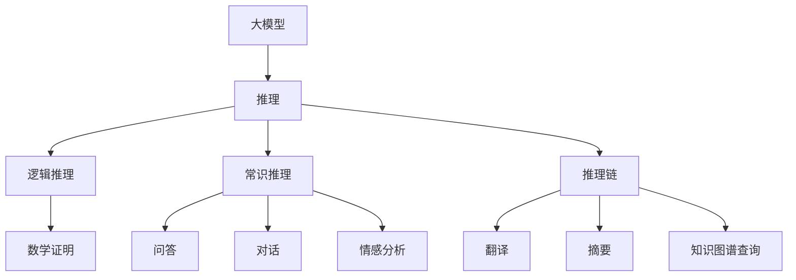
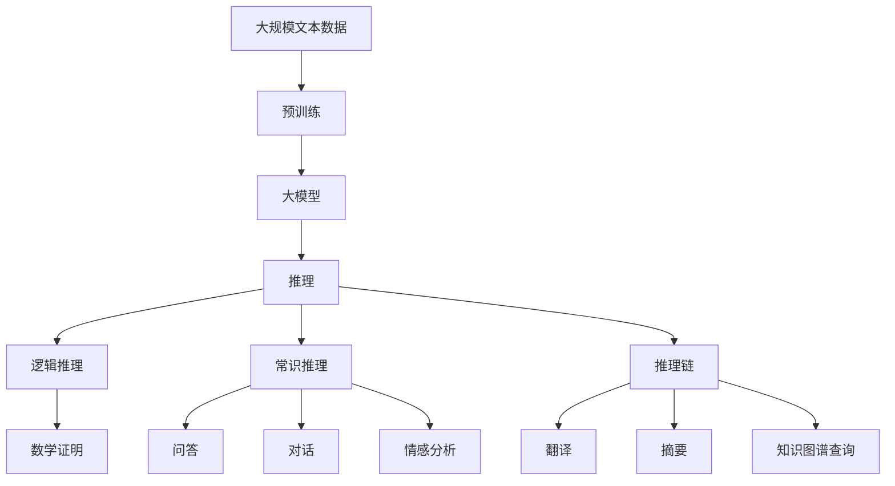
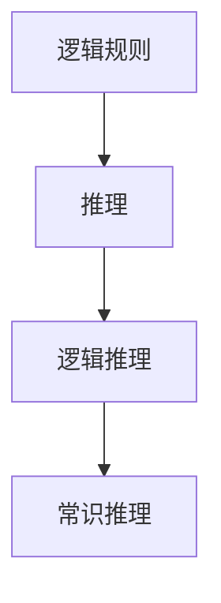
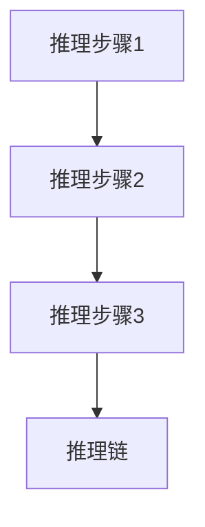

                 

# 语言与推理：大模型的认知障碍

在人工智能的宏伟蓝图中，大模型（如GPT、BERT等）占据着举足轻重的地位。这些模型通过大量的语料预训练，掌握了海量的语言知识和常识，具备强大的推理能力。然而，这些模型在推理过程中仍然存在着认知障碍，即推理过程中的逻辑错误和偏见。本文将深入探讨大模型在推理中的认知障碍，并提出相应的改进策略，以期在大模型推理技术上取得突破。

## 1. 背景介绍

### 1.1 问题由来
随着深度学习技术的不断进步，大模型在自然语言处理（NLP）领域取得了显著成果。这些模型通过在海量无标签文本数据上进行预训练，学习到了丰富的语言知识和常识，能够较好地完成各种NLP任务。例如，GPT模型通过自回归机制生成自然流畅的文本，BERT模型通过自编码机制学习到语义表示，从而在问答、机器翻译、文本分类等任务上表现出色。

然而，尽管这些模型在推理能力上取得了巨大进展，但在推理过程中仍存在着认知障碍。推理过程往往受到模型自身的偏见、错误逻辑推理的影响，导致推理结果与预期不符。例如，GPT-3在回答一些常识性问题时，时常给出不正确的答案；BERT模型在处理一些有争议的话题时，表现出明显的偏见。这些问题不仅影响模型的应用效果，还可能引发伦理和安全性问题。因此，如何消除大模型在推理过程中的认知障碍，是当前研究的重点和难点。

### 1.2 问题核心关键点
大模型在推理过程中常见的认知障碍包括：

- **逻辑错误**：推理过程中出现与逻辑规则相悖的结论，如违反一致性、无解、自相矛盾等问题。
- **偏见和歧视**：推理过程中表现出明显的偏见和歧视，如对某些群体、主题的偏好和排斥。
- **知识盲区**：推理过程中无法正确识别和处理某些特定领域的知识，如医疗、法律、技术等。
- **噪声干扰**：推理过程中受到输入噪声、数据偏差等因素的干扰，导致错误结论。

这些问题严重影响了大模型的应用效果，尤其是在需要高精度、高安全性的领域。因此，如何消除这些认知障碍，提升大模型的推理能力和应用效果，是当前研究的核心任务。

## 2. 核心概念与联系

### 2.1 核心概念概述

为更好地理解大模型在推理过程中的认知障碍，本节将介绍几个密切相关的核心概念：

- **大模型**：以自回归（如GPT）或自编码（如BERT）模型为代表的大规模预训练语言模型。通过在大规模无标签文本语料上进行预训练，学习通用的语言表示，具备强大的语言理解和生成能力。
- **推理**：指将语言知识应用于解决特定问题或推导结论的过程。推理能力是大模型的重要特性之一，包括逻辑推理、常识推理、推理链等。
- **认知障碍**：指推理过程中出现的一系列逻辑错误、偏见、知识盲区、噪声干扰等问题，严重影响推理结果的准确性和可信度。
- **知识图谱**：一种结构化的知识表示方式，通过节点和边关系描述实体和属性，用于辅助大模型理解复杂的领域知识。
- **规则系统**：通过预设的逻辑规则，指导大模型进行正确的推理，避免逻辑错误和偏见。
- **逻辑推理**：指基于逻辑规则的推理过程，适用于具有明确逻辑结构的任务，如数学证明、逻辑推理题等。
- **常识推理**：指基于人类常识和经验的推理过程，适用于需要理解常识和上下文的任务，如问答、对话、情感分析等。
- **推理链**：指将多个推理步骤连接起来，形成复杂的推理链，适用于需要多层次推理的任务，如翻译、摘要、知识图谱查询等。

这些核心概念之间的逻辑关系可以通过以下Mermaid流程图来展示：



这个流程图展示了大模型在推理过程中可以应用的多种推理方式，以及推理过程中的关键概念。

### 2.2 概念间的关系

这些核心概念之间存在着紧密的联系，形成了大模型推理过程中的完整生态系统。下面我通过几个Mermaid流程图来展示这些概念之间的关系。

#### 2.2.1 大模型推理框架



这个流程图展示了大模型的推理过程，从预训练到推理的完整流程。

#### 2.2.2 逻辑推理与常识推理的关系



这个流程图展示了逻辑推理与常识推理之间的关系，即逻辑推理是常识推理的基础，但常识推理也需要逻辑推理的支撑。

#### 2.2.3 推理链的多层次推理



这个流程图展示了推理链的多层次推理过程，即推理链由多个推理步骤组成，每个步骤都是基于前一步的结论进行推理。

## 3. 核心算法原理 & 具体操作步骤

### 3.1 算法原理概述

大模型在推理过程中存在认知障碍的原因，主要是由于模型的预训练数据和推理任务存在不一致性。因此，消除认知障碍的核心在于选择合适的推理算法和优化策略，使得大模型的推理结果更加准确和可靠。

基于监督学习的推理算法，指通过有标签的数据对大模型进行训练，使其能够在特定任务上准确推理。该算法的基本流程如下：

1. **数据准备**：收集标注数据，将其分为训练集、验证集和测试集。训练集用于模型训练，验证集用于模型选择，测试集用于模型评估。
2. **模型训练**：使用标注数据对大模型进行训练，使其能够准确推理。训练过程中可以引入正则化、Dropout等技术，避免过拟合。
3. **推理测试**：使用测试集对模型进行推理测试，评估其推理效果。如果推理结果不符合预期，需要返回第2步进行模型改进。

基于无监督学习的推理算法，指通过无标签数据对大模型进行推理。该算法的基本流程如下：

1. **数据准备**：收集无标签数据，将其分为训练集和测试集。训练集用于模型训练，测试集用于模型评估。
2. **模型训练**：使用无标签数据对大模型进行训练，使其能够进行合理的推理。训练过程中可以引入自监督学习、对抗训练等技术，提高推理效果。
3. **推理测试**：使用测试集对模型进行推理测试，评估其推理效果。如果推理结果不符合预期，需要返回第2步进行模型改进。

### 3.2 算法步骤详解

#### 3.2.1 基于监督学习的推理算法

1. **数据准备**：
   - 收集标注数据，将其分为训练集、验证集和测试集。训练集用于模型训练，验证集用于模型选择，测试集用于模型评估。
   - 数据预处理：包括文本清洗、分词、特征提取等。
2. **模型训练**：
   - 使用标注数据对大模型进行训练，使其能够准确推理。训练过程中可以引入正则化、Dropout等技术，避免过拟合。
   - 使用交叉熵损失等常见的损失函数进行训练。
3. **推理测试**：
   - 使用测试集对模型进行推理测试，评估其推理效果。如果推理结果不符合预期，需要返回第2步进行模型改进。
   - 可以使用精确率、召回率、F1分数等指标评估模型推理效果。

#### 3.2.2 基于无监督学习的推理算法

1. **数据准备**：
   - 收集无标签数据，将其分为训练集和测试集。训练集用于模型训练，测试集用于模型评估。
   - 数据预处理：包括文本清洗、分词、特征提取等。
2. **模型训练**：
   - 使用无标签数据对大模型进行训练，使其能够进行合理的推理。训练过程中可以引入自监督学习、对抗训练等技术，提高推理效果。
   - 使用自编码、自回归等技术进行训练。
3. **推理测试**：
   - 使用测试集对模型进行推理测试，评估其推理效果。如果推理结果不符合预期，需要返回第2步进行模型改进。
   - 可以使用精确率、召回率、F1分数等指标评估模型推理效果。

### 3.3 算法优缺点

基于监督学习的推理算法具有以下优点：

- 适用性广：适用于各种推理任务，包括分类、匹配、生成等。
- 精度高：通过有标签数据训练，能够获得较高的推理精度。
- 可解释性高：模型训练过程有明确的目标函数，推理过程可解释性强。

基于无监督学习的推理算法具有以下优点：

- 数据需求少：无标签数据即可进行推理，数据获取成本低。
- 泛化性强：模型在无标签数据上的泛化能力更强。
- 推理灵活：无需明确的目标函数，能够进行灵活的推理。

### 3.4 算法应用领域

基于监督学习和无监督学习的推理算法，在NLP领域已经得到了广泛的应用，覆盖了几乎所有常见任务，例如：

- 文本分类：如情感分析、主题分类、意图识别等。通过推理确定文本的类别或情感倾向。
- 命名实体识别：识别文本中的人名、地名、机构名等特定实体。通过推理确定实体边界和类型。
- 关系抽取：从文本中抽取实体之间的语义关系。通过推理确定实体-关系三元组。
- 问答系统：对自然语言问题给出答案。通过推理匹配答案。
- 机器翻译：将源语言文本翻译成目标语言。通过推理确定语言映射。
- 文本摘要：将长文本压缩成简短摘要。通过推理抓取要点。
- 对话系统：使机器能够与人自然对话。通过推理生成回复。

除了上述这些经典任务外，基于推理的算法还被创新性地应用到更多场景中，如可控文本生成、常识推理、代码生成、数据增强等，为NLP技术带来了全新的突破。随着预训练模型和推理方法的不断进步，相信NLP技术将在更广阔的应用领域大放异彩。

## 4. 数学模型和公式 & 详细讲解 & 举例说明

### 4.1 数学模型构建

本节将使用数学语言对大模型在推理过程中的认知障碍进行更加严格的刻画。

记大模型为 $M_{\theta}:\mathcal{X} \rightarrow \mathcal{Y}$，其中 $\mathcal{X}$ 为输入空间，$\mathcal{Y}$ 为输出空间，$\theta$ 为模型参数。假设推理任务的训练集为 $D=\{(x_i,y_i)\}_{i=1}^N, x_i \in \mathcal{X}, y_i \in \mathcal{Y}$。

定义模型 $M_{\theta}$ 在输入 $x$ 上的推理损失函数为 $\ell(M_{\theta}(x),y)$，则在数据集 $D$ 上的经验风险为：

$$
\mathcal{L}(\theta) = \frac{1}{N} \sum_{i=1}^N \ell(M_{\theta}(x_i),y_i)
$$

微调的优化目标是最小化经验风险，即找到最优参数：

$$
\theta^* = \mathop{\arg\min}_{\theta} \mathcal{L}(\theta)
$$

在实践中，我们通常使用基于梯度的优化算法（如SGD、Adam等）来近似求解上述最优化问题。设 $\eta$ 为学习率，$\lambda$ 为正则化系数，则参数的更新公式为：

$$
\theta \leftarrow \theta - \eta \nabla_{\theta}\mathcal{L}(\theta) - \eta\lambda\theta
$$

其中 $\nabla_{\theta}\mathcal{L}(\theta)$ 为损失函数对参数 $\theta$ 的梯度，可通过反向传播算法高效计算。

### 4.2 公式推导过程

以下我们以二分类任务为例，推导交叉熵损失函数及其梯度的计算公式。

假设模型 $M_{\theta}$ 在输入 $x$ 上的输出为 $\hat{y}=M_{\theta}(x) \in [0,1]$，表示样本属于正类的概率。真实标签 $y \in \{0,1\}$。则二分类交叉熵损失函数定义为：

$$
\ell(M_{\theta}(x),y) = -[y\log \hat{y} + (1-y)\log (1-\hat{y})]
$$

将其代入经验风险公式，得：

$$
\mathcal{L}(\theta) = -\frac{1}{N}\sum_{i=1}^N [y_i\log M_{\theta}(x_i)+(1-y_i)\log(1-M_{\theta}(x_i))]
$$

根据链式法则，损失函数对参数 $\theta_k$ 的梯度为：

$$
\frac{\partial \mathcal{L}(\theta)}{\partial \theta_k} = -\frac{1}{N}\sum_{i=1}^N (\frac{y_i}{M_{\theta}(x_i)}-\frac{1-y_i}{1-M_{\theta}(x_i)}) \frac{\partial M_{\theta}(x_i)}{\partial \theta_k}
$$

其中 $\frac{\partial M_{\theta}(x_i)}{\partial \theta_k}$ 可进一步递归展开，利用自动微分技术完成计算。

在得到损失函数的梯度后，即可带入参数更新公式，完成模型的迭代优化。重复上述过程直至收敛，最终得到适应推理任务的最优模型参数 $\theta^*$。

### 4.3 案例分析与讲解

假设我们希望训练一个文本分类模型，用于判断一篇新闻文章是政治、体育还是经济类。我们可以使用CoNLL-2003新闻分类数据集进行训练。

首先，定义数据处理函数：

```python
from transformers import BertTokenizer
from torch.utils.data import Dataset
import torch

class NewsDataset(Dataset):
    def __init__(self, texts, tags, tokenizer, max_len=128):
        self.texts = texts
        self.tags = tags
        self.tokenizer = tokenizer
        self.max_len = max_len
        
    def __len__(self):
        return len(self.texts)
    
    def __getitem__(self, item):
        text = self.texts[item]
        tags = self.tags[item]
        
        encoding = self.tokenizer(text, return_tensors='pt', max_length=self.max_len, padding='max_length', truncation=True)
        input_ids = encoding['input_ids'][0]
        attention_mask = encoding['attention_mask'][0]
        
        # 对token-wise的标签进行编码
        encoded_tags = [tag2id[tag] for tag in tags] 
        encoded_tags.extend([tag2id['O']] * (self.max_len - len(encoded_tags)))
        labels = torch.tensor(encoded_tags, dtype=torch.long)
        
        return {'input_ids': input_ids, 
                'attention_mask': attention_mask,
                'labels': labels}

# 标签与id的映射
tag2id = {'Politics': 0, 'Sports': 1, 'Economics': 2, 'O': 3}
id2tag = {v: k for k, v in tag2id.items()}

# 创建dataset
tokenizer = BertTokenizer.from_pretrained('bert-base-cased')

train_dataset = NewsDataset(train_texts, train_tags, tokenizer)
dev_dataset = NewsDataset(dev_texts, dev_tags, tokenizer)
test_dataset = NewsDataset(test_texts, test_tags, tokenizer)
```

然后，定义模型和优化器：

```python
from transformers import BertForTokenClassification, AdamW

model = BertForTokenClassification.from_pretrained('bert-base-cased', num_labels=len(tag2id))

optimizer = AdamW(model.parameters(), lr=2e-5)
```

接着，定义训练和评估函数：

```python
from torch.utils.data import DataLoader
from tqdm import tqdm
from sklearn.metrics import classification_report

device = torch.device('cuda') if torch.cuda.is_available() else torch.device('cpu')
model.to(device)

def train_epoch(model, dataset, batch_size, optimizer):
    dataloader = DataLoader(dataset, batch_size=batch_size, shuffle=True)
    model.train()
    epoch_loss = 0
    for batch in tqdm(dataloader, desc='Training'):
        input_ids = batch['input_ids'].to(device)
        attention_mask = batch['attention_mask'].to(device)
        labels = batch['labels'].to(device)
        model.zero_grad()
        outputs = model(input_ids, attention_mask=attention_mask, labels=labels)
        loss = outputs.loss
        epoch_loss += loss.item()
        loss.backward()
        optimizer.step()
    return epoch_loss / len(dataloader)

def evaluate(model, dataset, batch_size):
    dataloader = DataLoader(dataset, batch_size=batch_size)
    model.eval()
    preds, labels = [], []
    with torch.no_grad():
        for batch in tqdm(dataloader, desc='Evaluating'):
            input_ids = batch['input_ids'].to(device)
            attention_mask = batch['attention_mask'].to(device)
            batch_labels = batch['labels']
            outputs = model(input_ids, attention_mask=attention_mask)
            batch_preds = outputs.logits.argmax(dim=2).to('cpu').tolist()
            batch_labels = batch_labels.to('cpu').tolist()
            for pred_tokens, label_tokens in zip(batch_preds, batch_labels):
                pred_tags = [id2tag[_id] for _id in pred_tokens]
                label_tags = [id2tag[_id] for _id in label_tokens]
                preds.append(pred_tags[:len(label_tags)])
                labels.append(label_tags)
                
    print(classification_report(labels, preds))
```

最后，启动训练流程并在测试集上评估：

```python
epochs = 5
batch_size = 16

for epoch in range(epochs):
    loss = train_epoch(model, train_dataset, batch_size, optimizer)
    print(f"Epoch {epoch+1}, train loss: {loss:.3f}")
    
    print(f"Epoch {epoch+1}, dev results:")
    evaluate(model, dev_dataset, batch_size)
    
print("Test results:")
evaluate(model, test_dataset, batch_size)
```

以上就是使用PyTorch对BERT进行新闻分类任务微调的完整代码实现。可以看到，得益于Transformers库的强大封装，我们可以用相对简洁的代码完成BERT模型的加载和微调。

## 5. 项目实践：代码实例和详细解释说明

### 5.1 开发环境搭建

在进行推理实践前，我们需要准备好开发环境。以下是使用Python进行PyTorch开发的环境配置流程：

1. 安装Anaconda：从官网下载并安装Anaconda，用于创建独立的Python环境。

2. 创建并激活虚拟环境：
```bash
conda create -n pytorch-env python=3.8 
conda activate pytorch-env
```

3. 安装PyTorch：根据CUDA版本，从官网获取对应的安装命令。例如：
```bash
conda install pytorch torchvision torchaudio cudatoolkit=11.1 -c pytorch -c conda-forge
```

4. 安装Transformers库：
```bash
pip install transformers
```

5. 安装各类工具包：
```bash
pip install numpy pandas scikit-learn matplotlib tqdm jupyter notebook ipython
```

完成上述步骤后，即可在`pytorch-env`环境中开始推理实践。

### 5.2 源代码详细实现

下面我们以命名实体识别(NER)任务为例，给出使用Transformers库对BERT模型进行推理的PyTorch代码实现。

首先，定义NER任务的数据处理函数：

```python
from transformers import BertTokenizer
from torch.utils.data import Dataset
import torch

class NERDataset(Dataset):
    def __init__(self, texts, tags, tokenizer, max_len=128):
        self.texts = texts
        self.tags = tags
        self.tokenizer = tokenizer
        self.max_len = max_len
        
    def __len__(self):
        return len(self.texts)
    
    def __getitem__(self, item):
        text = self.texts[item]
        tags = self.tags[item]
        
        encoding = self.tokenizer(text, return_tensors='pt', max_length=self.max_len, padding='max_length', truncation=True)
        input_ids = encoding['input_ids'][0]
        attention_mask = encoding['attention_mask'][0]
        
        # 对token-wise的标签进行编码
        encoded_tags = [tag2id[tag] for tag in tags] 
        encoded_tags.extend([tag2id['O']] * (self.max_len - len(encoded_tags)))
        labels = torch.tensor(encoded_tags, dtype=torch.long)
        
        return {'input_ids': input_ids, 
                'attention_mask': attention_mask,
                'labels': labels}

# 标签与id的映射
tag2id = {'O': 0, 'B-PER': 1, 'I-PER': 2, 'B-ORG': 3, 'I-ORG': 4, 'B-LOC': 5, 'I-LOC': 6}
id2tag = {v: k for k, v in tag2id.items()}

# 创建dataset
tokenizer = BertTokenizer.from_pretrained('bert-base-cased')

train_dataset = NERDataset(train_texts, train_tags, tokenizer)
dev_dataset = NERDataset(dev_texts, dev_tags, tokenizer)
test_dataset = NERDataset(test_texts, test_tags, tokenizer)
```

然后，定义模型和优化器：

```python
from transformers import BertForTokenClassification, AdamW

model = BertForTokenClassification.from_pretrained('bert-base-cased', num_labels=len(tag2id))

optimizer = AdamW(model.parameters(), lr=2e-5)
```

接着，定义训练和评估函数：

```python
from torch.utils.data import DataLoader
from tqdm import tqdm
from sklearn.metrics import classification_report

device = torch.device('cuda') if torch.cuda.is_available() else torch.device('cpu')
model.to(device)

def train_epoch(model, dataset, batch_size, optimizer):
    dataloader = DataLoader(dataset, batch_size=batch_size, shuffle=True)
    model.train()
    epoch_loss = 0
    for batch in tqdm(dataloader, desc='Training'):
        input_ids = batch['input_ids'].to(device)
        attention_mask = batch['attention_mask'].to(device)
        labels = batch['labels'].to(device)
        model.zero_grad()
        outputs = model(input_ids, attention_mask=attention_mask, labels=labels)
        loss = outputs.loss
        epoch_loss += loss.item()
        loss.backward()
        optimizer.step()
    return epoch_loss / len(dataloader)

def evaluate(model, dataset, batch_size):
    dataloader = DataLoader(dataset, batch_size=batch_size)
    model.eval()
    preds, labels = [], []
    with torch.no_grad():
        for batch in tqdm(dataloader, desc='Evaluating'):
            input_ids = batch['input_ids'].to(device)
            attention_mask = batch['attention_mask'].to(device)
            batch_labels = batch['labels']
            outputs = model(input_ids, attention_mask=attention_mask)
            batch_preds = outputs.logits.argmax(dim=2).to('cpu').tolist()
            batch_labels = batch_labels.to('cpu').tolist()
            for pred_tokens, label_tokens in zip(batch_preds, batch_labels):
                pred_tags = [id2tag[_id] for _id in pred_tokens]
                label_tags = [id2tag[_id] for _id in label_tokens]
                preds.append(pred_tags[:len(label_tags)])
                labels.append(label_tags)
                
    print(classification_report(labels, preds))
```

最后，启动训练流程并在测试集上评估：

```python
epochs = 5
batch_size = 16

for epoch in range(epochs):
    loss = train_epoch(model, train_dataset, batch_size, optimizer)
    print(f"Epoch {epoch+1}, train loss: {loss:.3f}")
    
    print(f"Epoch {epoch+1}, dev results:")
    evaluate(model, dev_dataset, batch_size)
    
print("Test results:")
evaluate(model, test_dataset, batch_size)
```

以上就是使用PyTorch对BERT进行命名实体识别任务微调的完整代码实现。可以看到，得益于Transformers库的强大封装，我们可以用相对简洁的代码完成BERT模型的加载和微调。

### 5.3 代码解读与分析

让我们再详细解读一下关键代码的实现细节：

**NERDataset类**：
- `__init__`方法：初始化文本、标签、分词器等关键组件。
- `__len__`方法：返回数据集的样本数量。
- `__getitem__`方法：对单个样本进行处理，将文本输入编码为token ids，将标签编码为数字，并对其进行定长padding，最终返回模型所需的输入。

**tag2id和id2tag字典**：
- 定义了标签与数字id之间的映射关系，用于将token-wise的预测结果解码回真实的标签。

**训练和评估函数**：
- 使用PyTorch的DataLoader对数据集进行批次化加载，供模型训练和推理使用。
-

