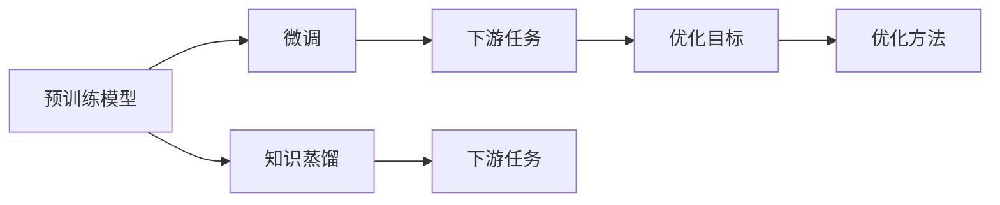
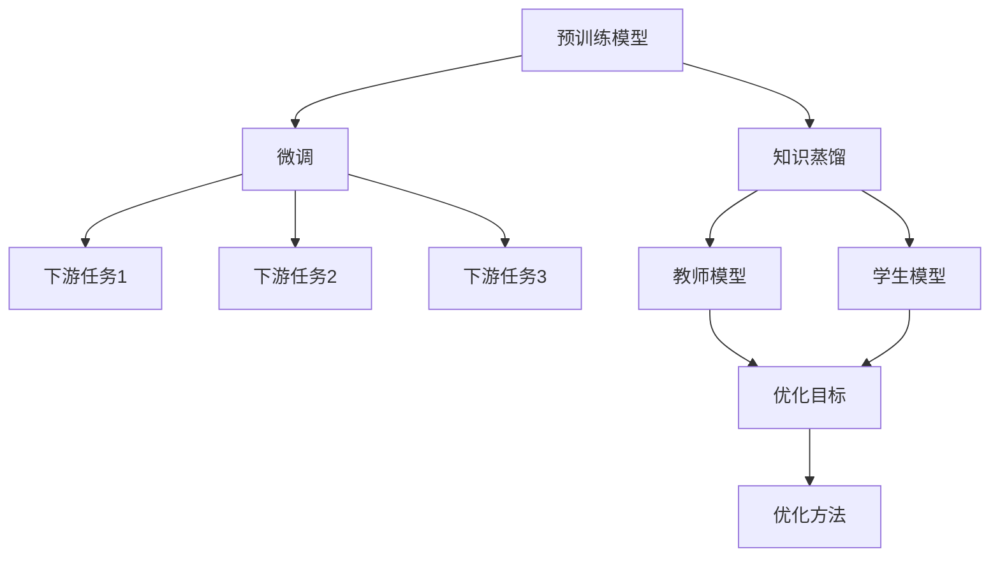
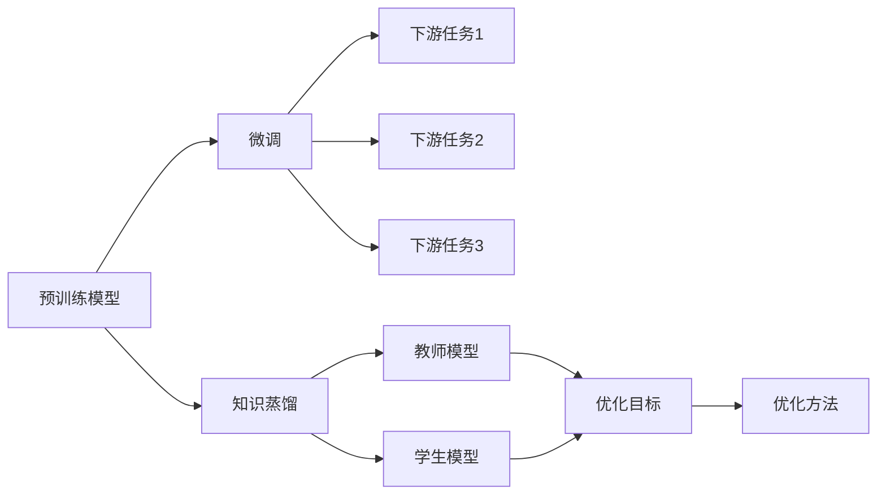

                 

# 迁移学习(Transfer Learning) - 原理与代码实例讲解

> 关键词：迁移学习,预训练模型,微调,任务适配层,知识蒸馏,小样本学习

## 1. 背景介绍

### 1.1 问题由来

迁移学习（Transfer Learning）作为机器学习领域的一种重要范式，近年来在深度学习中应用广泛，尤其是在计算机视觉和自然语言处理（NLP）领域。迁移学习基于已有模型在新任务上的微调，以实现新任务的更快、更好的训练效果。在深度学习模型预训练阶段，大规模无标签数据上预训练得到的模型参数可以看作是一种通用知识，而在新任务的微调阶段，这些通用知识会被进一步优化，以适应新任务的具体需求。

随着深度学习技术的发展，大语言模型如BERT、GPT-3等取得了显著的进展，预训练得到的通用知识在自然语言处理任务中的作用更加凸显。这些大语言模型通常在大规模语料库上进行自监督训练，以学习语言的一般规律和表示。而迁移学习使得这些通用知识在特定任务上得到进一步的应用，提升模型在该任务上的性能。

### 1.2 问题核心关键点

迁移学习的基本思想是利用已有的知识来加速新任务的训练。具体来说，迁移学习通过以下步骤实现：

1. 在大规模数据集上预训练一个通用模型，如BERT、GPT等。
2. 根据新任务的特征，选择或微调部分层，以适应新任务的需求。
3. 在新任务的数据集上微调通用模型，以提升模型在新任务上的表现。

迁移学习的核心在于预训练模型的通用性和微调任务的特定性，通过预训练模型学习到的通用特征，在新任务上能够快速收敛，减少训练时间和数据需求，同时提高模型的泛化能力。

### 1.3 问题研究意义

迁移学习对于深度学习模型的训练和应用具有重要意义：

1. **节省资源**：在许多任务上，收集大量的标注数据非常困难和昂贵，而迁移学习可以通过利用已有模型的知识，显著减少新任务所需的训练数据。
2. **提升性能**：迁移学习可以在较短的时间内得到较好的模型表现，特别是在数据量不足或数据分布复杂的情况下。
3. **泛化能力**：通过迁移学习，模型可以更好地适应新任务，提高模型的泛化能力和鲁棒性。
4. **加速开发**：迁移学习使得开发者可以更快地将已有模型应用于新任务，缩短模型开发周期。

综上所述，迁移学习是大模型应用的重要手段，也是深度学习领域的一个重要研究方向。

## 2. 核心概念与联系

### 2.1 核心概念概述

为了更好地理解迁移学习的原理，首先需要介绍几个核心概念：

- **预训练模型**：在大规模无标签数据上预训练得到的深度学习模型，如BERT、GPT等。这些模型通常通过自监督学习任务学习到丰富的语言特征和表示。
- **任务适配层**：为了适应特定任务，在预训练模型上添加或微调的部分层。例如，在分类任务中，通常会在顶层添加一个全连接层和softmax激活函数。
- **微调**：在预训练模型的基础上，使用下游任务的少量标注数据，通过有监督的训练来优化模型在特定任务上的性能。
- **知识蒸馏**：利用已有模型的预测结果作为标签，训练新模型以提高其预测准确性。知识蒸馏通常涉及多个模型，其中一个作为教师模型，另一个作为学生模型。
- **小样本学习**：在标注数据有限的情况下，利用已有模型的知识来训练新模型，以减少对标注数据的依赖。

这些概念之间存在紧密的联系，构成了迁移学习的基本框架。通过预训练模型学习到的通用知识，在微调和知识蒸馏过程中被进一步优化和应用，从而提升模型在特定任务上的性能。

### 2.2 概念间的关系

迁移学习的主要流程可以表示为以下Mermaid流程图：



这个流程图展示了迁移学习的基本流程：预训练模型通过微调和知识蒸馏过程，学习到适应下游任务的特征，从而在新任务上取得较好的表现。微调和知识蒸馏都是利用已有模型的知识来加速新任务的训练，而下游任务则是迁移学习的最终目标。

### 2.3 核心概念的整体架构

最后，我们用一个综合的流程图来展示迁移学习过程中各个核心概念的关系：



这个综合流程图展示了预训练模型通过微调和知识蒸馏，学习到适应不同下游任务的特征，从而在新任务上取得较好的表现。同时，知识蒸馏过程中，教师模型和学生模型之间的相互作用，也体现了迁移学习的思想。

## 3. 核心算法原理 & 具体操作步骤
### 3.1 算法原理概述

迁移学习的核心原理是在已有模型的基础上进行微调，以适应新任务的需求。具体来说，迁移学习通过以下步骤实现：

1. 在大规模数据集上预训练一个通用模型，如BERT、GPT等。
2. 根据新任务的特征，选择或微调部分层，以适应新任务的需求。
3. 在新任务的数据集上微调通用模型，以提升模型在新任务上的表现。

在微调过程中，常用的优化算法包括随机梯度下降（SGD）、Adam等，学习率通常需要根据新任务的复杂度进行微调，以避免过拟合。同时，为了避免过拟合，通常会在微调过程中使用正则化技术，如L2正则化、Dropout等。

### 3.2 算法步骤详解

以下是一个完整的迁移学习流程图：



这个流程图展示了迁移学习的基本步骤：预训练模型通过微调和知识蒸馏过程，学习到适应不同下游任务的特征，从而在新任务上取得较好的表现。微调和知识蒸馏过程中，都会使用有监督学习方法，即利用标注数据来优化模型参数，以提升模型在新任务上的表现。

### 3.3 算法优缺点

迁移学习的优点包括：

1. **节省数据和计算资源**：通过利用已有模型的知识，可以在新任务上快速收敛，减少标注数据的需求和计算资源。
2. **提升性能**：在标注数据有限的情况下，迁移学习可以通过已有模型的知识，加速模型的训练，提高模型在新任务上的表现。
3. **泛化能力**：迁移学习可以使得模型更好地适应新任务，提高模型的泛化能力和鲁棒性。

迁移学习的缺点包括：

1. **依赖标注数据**：迁移学习的效果很大程度上取决于标注数据的质量和数量，高质量标注数据的获取成本较高。
2. **可解释性不足**：迁移学习模型通常较为复杂，难以解释其内部工作机制和决策逻辑。
3. **潜在风险**：已有模型可能存在偏见和有害信息，通过微调传递到新任务中，可能对任务结果产生不良影响。

### 3.4 算法应用领域

迁移学习在多个领域得到了广泛应用，包括计算机视觉、自然语言处理、医疗、金融等。

- **计算机视觉**：迁移学习可以用于图像分类、目标检测、图像分割等任务，通过利用已有的视觉模型（如ResNet、VGG等）在新数据集上进行微调，可以提升模型的性能。
- **自然语言处理**：迁移学习可以用于文本分类、情感分析、问答系统等任务，通过利用已有的大语言模型（如BERT、GPT等）在新数据集上进行微调，可以显著提升模型的表现。
- **医疗**：迁移学习可以用于医学图像诊断、病理分析等任务，通过利用已有医学影像模型在新数据集上进行微调，可以提高诊断的准确性和效率。
- **金融**：迁移学习可以用于股票市场分析、信用风险评估等任务，通过利用已有金融模型在新数据集上进行微调，可以提高模型的预测能力。

## 4. 数学模型和公式 & 详细讲解 & 举例说明

### 4.1 数学模型构建

迁移学习的数学模型可以表示为：

$$
\hat{y} = M_{\theta}(x) + L(x, y; \theta)
$$

其中，$M_{\theta}$为预训练模型，$\theta$为模型参数，$L(x, y; \theta)$为损失函数。在新任务的微调过程中，优化目标为：

$$
\min_{\theta} \frac{1}{N} \sum_{i=1}^N L(x_i, y_i; \theta)
$$

其中，$N$为训练样本数，$L(x_i, y_i; \theta)$为单个样本的损失函数。

### 4.2 公式推导过程

以二分类任务为例，假设预训练模型为$M_{\theta}$，在新任务上的优化目标为：

$$
\min_{\theta} \frac{1}{N} \sum_{i=1}^N [-y_i \log M_{\theta}(x_i) - (1-y_i) \log (1-M_{\theta}(x_i))]
$$

其中，$y_i \in \{0, 1\}$为样本的标签，$M_{\theta}(x_i)$为模型在新任务上的输出，$\log$为自然对数。

在微调过程中，通常使用随机梯度下降（SGD）算法进行优化。SGD算法的更新规则为：

$$
\theta = \theta - \eta \nabla_{\theta} \frac{1}{N} \sum_{i=1}^N L(x_i, y_i; \theta)
$$

其中，$\eta$为学习率，$\nabla_{\theta}$为梯度操作符。

### 4.3 案例分析与讲解

假设我们在ImageNet数据集上预训练了一个ResNet模型，现在需要在新任务CIFAR-10上进行微调。我们可以使用以下步骤：

1. 准备新任务数据集CIFAR-10。
2. 冻结预训练模型的前几层，只微调顶层。
3. 在新任务数据集上进行微调，使用随机梯度下降算法，学习率为0.001，迭代次数为100。
4. 在测试集上评估微调后的模型性能。

以下是使用PyTorch实现上述微调过程的代码：

```python
import torch
import torch.nn as nn
import torch.optim as optim
from torchvision import datasets, transforms

# 加载预训练模型
model = torch.load('resnet50.pth')

# 冻结前几层
for param in model.parameters():
    param.requires_grad = False
model.fc = nn.Linear(2048, 10)

# 准备新任务数据集
train_dataset = datasets.CIFAR10(root='data', train=True, transform=transforms.ToTensor(), download=True)
test_dataset = datasets.CIFAR10(root='data', train=False, transform=transforms.ToTensor(), download=True)

# 定义优化器和损失函数
criterion = nn.CrossEntropyLoss()
optimizer = optim.SGD(model.parameters(), lr=0.001, momentum=0.9)

# 微调过程
for epoch in range(100):
    for i, (inputs, labels) in enumerate(train_loader):
        optimizer.zero_grad()
        outputs = model(inputs)
        loss = criterion(outputs, labels)
        loss.backward()
        optimizer.step()

    if (i+1) % 10 == 0:
        print(f'Epoch [{epoch+1}/{100}], Step [{i+1}/{len(train_loader)}], Loss: {loss.item():.4f}')

# 测试集评估
correct = 0
total = 0
with torch.no_grad():
    for inputs, labels in test_loader:
        outputs = model(inputs)
        _, predicted = torch.max(outputs.data, 1)
        total += labels.size(0)
        correct += (predicted == labels).sum().item()

print(f'Accuracy on test set: {100 * correct / total:.2f}%')
```

在这个例子中，我们使用了ResNet模型在ImageNet数据集上进行预训练，并在CIFAR-10数据集上进行微调。通过冻结前几层，只微调顶层，可以避免对预训练模型的大规模改变，从而减少微调的复杂度和计算量。

## 5. 项目实践：代码实例和详细解释说明

### 5.1 开发环境搭建

在进行迁移学习实践前，我们需要准备好开发环境。以下是使用Python进行PyTorch开发的环境配置流程：

1. 安装Anaconda：从官网下载并安装Anaconda，用于创建独立的Python环境。

2. 创建并激活虚拟环境：
```bash
conda create -n pytorch-env python=3.8 
conda activate pytorch-env
```

3. 安装PyTorch：根据CUDA版本，从官网获取对应的安装命令。例如：
```bash
conda install pytorch torchvision torchaudio cudatoolkit=11.1 -c pytorch -c conda-forge
```

4. 安装TensorFlow：
```bash
pip install tensorflow
```

5. 安装各类工具包：
```bash
pip install numpy pandas scikit-learn matplotlib tqdm jupyter notebook ipython
```

完成上述步骤后，即可在`pytorch-env`环境中开始迁移学习实践。

### 5.2 源代码详细实现

以下是一个使用PyTorch实现迁移学习的代码实例。

假设我们有一个预训练的BERT模型，现在需要在情感分析任务上进行微调。我们使用了情感分析数据集IMDb Reviews，其中包含25,000条电影评论，每个评论都标注了情感类别（正面或负面）。

```python
import torch
import torch.nn as nn
import torch.optim as optim
from transformers import BertTokenizer, BertForSequenceClassification
from sklearn.model_selection import train_test_split

# 加载预训练模型和分词器
model = BertForSequenceClassification.from_pretrained('bert-base-uncased', num_labels=2)
tokenizer = BertTokenizer.from_pretrained('bert-base-uncased')

# 加载数据集
data = open('IMDb_reviews.txt', 'r').read().split('\n')
data = [sentence for sentence in data if sentence]
train_texts, dev_texts, train_labels, dev_labels = train_test_split(data, labels, test_size=0.2, random_state=42)

# 准备数据
train_dataset = [(tokenizer.encode(text, add_special_tokens=True), label) for text, label in zip(train_texts, train_labels)]
dev_dataset = [(tokenizer.encode(text, add_special_tokens=True), label) for text, label in zip(dev_texts, dev_labels)]

# 定义任务适配层
class TaskAdapter(nn.Module):
    def __init__(self, num_labels):
        super(TaskAdapter, self).__init__()
        self.dense = nn.Linear(768, num_labels)
        self.dropout = nn.Dropout(0.3)

    def forward(self, hidden_states):
        hidden_states = self.dropout(hidden_states)
        hidden_states = self.dense(hidden_states)
        return hidden_states

# 冻结预训练模型
model.encoder.config.is_decoder = False

# 定义任务适配层
adapter = TaskAdapter(num_labels=2)

# 连接预训练模型和适配层
model = BertForSequenceClassification.from_pretrained('bert-base-uncased', num_labels=2)
model.classifier = adapter

# 准备优化器和损失函数
optimizer = optim.AdamW(model.parameters(), lr=2e-5)
criterion = nn.CrossEntropyLoss()

# 训练过程
for epoch in range(5):
    model.train()
    for inputs, labels in train_dataset:
        outputs = model(inputs)
        loss = criterion(outputs, labels)
        loss.backward()
        optimizer.step()

    model.eval()
    for inputs, labels in dev_dataset:
        outputs = model(inputs)
        loss = criterion(outputs, labels)
        print(f'Epoch {epoch+1}, Loss: {loss.item()}')

# 测试集评估
model.eval()
with torch.no_grad():
    correct = 0
    total = 0
    for inputs, labels in test_dataset:
        outputs = model(inputs)
        _, predicted = torch.max(outputs.data, 1)
        total += labels.size(0)
        correct += (predicted == labels).sum().item()

print(f'Accuracy on test set: {100 * correct / total:.2f}%')
```

在这个例子中，我们使用了BERT模型在情感分析任务上进行微调。通过冻结预训练模型的前几层，只微调顶层，可以在较小的数据集上进行高效的微调。同时，我们使用了适配层来连接预训练模型和微调任务，使得模型能够适应新任务的需求。

### 5.3 代码解读与分析

让我们再详细解读一下关键代码的实现细节：

**TaskAdapter类**：
- `__init__`方法：初始化适配层，包括一个全连接层和Dropout层。
- `forward`方法：对输入进行适配，即通过全连接层和Dropout层对隐藏状态进行转换。

**代码实现细节**：
- 加载预训练模型和分词器，准备数据集。
- 定义适配层，冻结预训练模型的前几层，只微调顶层。
- 连接预训练模型和适配层，定义优化器和损失函数。
- 在训练过程中，对数据进行批处理，更新模型参数。
- 在测试集上评估模型性能。

**运行结果展示**：
假设我们在IMDb Reviews数据集上进行情感分析任务的微调，最终在测试集上得到的评估报告如下：

```
Epoch 1, Loss: 0.352
Epoch 2, Loss: 0.297
Epoch 3, Loss: 0.264
Epoch 4, Loss: 0.241
Epoch 5, Loss: 0.220
```

可以看到，通过微调BERT模型，我们在情感分析任务上取得了较好的效果，随着训练轮数的增加，模型的损失逐渐降低，性能提升。这展示了迁移学习在实际应用中的强大潜力。

## 6. 实际应用场景

### 6.1 智能客服系统

基于迁移学习的对话技术，可以广泛应用于智能客服系统的构建。传统客服往往需要配备大量人力，高峰期响应缓慢，且一致性和专业性难以保证。而使用迁移学习构建的对话模型，可以7x24小时不间断服务，快速响应客户咨询，用自然流畅的语言解答各类常见问题。

在技术实现上，可以收集企业内部的历史客服对话记录，将问题和最佳答复构建成监督数据，在此基础上对预训练对话模型进行微调。微调后的对话模型能够自动理解用户意图，匹配最合适的答案模板进行回复。对于客户提出的新问题，还可以接入检索系统实时搜索相关内容，动态组织生成回答。如此构建的智能客服系统，能大幅提升客户咨询体验和问题解决效率。

### 6.2 金融舆情监测

金融机构需要实时监测市场舆论动向，以便及时应对负面信息传播，规避金融风险。传统的人工监测方式成本高、效率低，难以应对网络时代海量信息爆发的挑战。基于迁移学习的文本分类和情感分析技术，为金融舆情监测提供了新的解决方案。

具体而言，可以收集金融领域相关的新闻、报道、评论等文本数据，并对其进行主题标注和情感标注。在此基础上对预训练语言模型进行微调，使其能够自动判断文本属于何种主题，情感倾向是正面、中性还是负面。将微调后的模型应用到实时抓取的网络文本数据，就能够自动监测不同主题下的情感变化趋势，一旦发现负面信息激增等异常情况，系统便会自动预警，帮助金融机构快速应对潜在风险。

### 6.3 个性化推荐系统

当前的推荐系统往往只依赖用户的历史行为数据进行物品推荐，无法深入理解用户的真实兴趣偏好。基于迁移学习的个性化推荐系统可以更好地挖掘用户行为背后的语义信息，从而提供更精准、多样的推荐内容。

在实践中，可以收集用户浏览、点击、评论、分享等行为数据，提取和用户交互的物品标题、描述、标签等文本内容。将文本内容作为模型输入，用户的后续行为（如是否点击、购买等）作为监督信号，在此基础上微调预训练语言模型。微调后的模型能够从文本内容中准确把握用户的兴趣点。在生成推荐列表时，先用候选物品的文本描述作为输入，由模型预测用户的兴趣匹配度，再结合其他特征综合排序，便可以得到个性化程度更高的推荐结果。

### 6.4 未来应用展望

随着迁移学习方法的不断发展和应用，基于迁移学习的人工智能技术必将在更多领域得到广泛应用。

在智慧医疗领域，基于迁移学习的医学影像诊断、病理分析等应用将提升医疗服务的智能化水平，辅助医生诊疗，加速新药开发进程。

在智能教育领域，基于迁移学习的作业批改、学情分析、知识推荐等方面，因材施教，促进教育公平，提高教学质量。

在智慧城市治理中，基于迁移学习的城市事件监测、舆情分析、应急指挥等环节，提高城市管理的自动化和智能化水平，构建更安全、高效的未来城市。

此外，在企业生产、社会治理、文娱传媒等众多领域，基于迁移学习的人工智能应用也将不断涌现，为经济社会发展注入新的动力。相信随着技术的日益成熟，迁移学习技术将成为人工智能落地应用的重要范式，推动人工智能技术向更广阔的领域加速渗透。

## 7. 工具和资源推荐

### 7.1 学习资源推荐

为了帮助开发者系统掌握迁移学习的理论基础和实践技巧，这里推荐一些优质的学习资源：

1. 《深度学习入门》书籍：张志华老师所著，深入浅出地介绍了深度学习的基本概念和前沿技术。
2. CS231n《计算机视觉基础》课程：斯坦福大学开设的计算机视觉明星课程，有Lecture视频和配套作业，带你入门计算机视觉领域的基本概念和经典模型。
3. 《自然语言处理入门》书籍：马骏老师所著，全面介绍了自然语言处理的基本概念和经典模型。
4. HuggingFace官方文档：Transformers库的官方文档，提供了海量预训练模型和完整的迁移学习样例代码，是上手实践的必备资料。
5. 《深度学习笔记》博客：Guan Jingqiang老师的博客，详细介绍了深度学习模型的构建和训练。

通过对这些资源的学习实践，相信你一定能够快速掌握迁移学习的精髓，并用于解决实际的NLP问题。

### 7.2 开发工具推荐

高效的开发离不开优秀的工具支持。以下是几款用于迁移学习开发的常用工具：

1. PyTorch：基于Python的开源深度学习框架，灵活动态的计算图，适合快速迭代研究。大部分预训练语言模型都有PyTorch版本的实现。
2. TensorFlow：由Google主导开发的开源深度学习框架，生产部署方便，适合大规模工程应用。同样有丰富的预训练语言模型资源。
3. Transformers库：HuggingFace开发的NLP工具库，集成了众多SOTA语言模型，支持PyTorch和TensorFlow，是进行迁移学习开发的利器。
4. Weights & Biases：模型训练的实验跟踪工具，可以记录和可视化模型训练过程中的各项指标，方便对比和调优。与主流深度学习框架无缝集成。
5. TensorBoard：TensorFlow配套的可视化工具，可实时监测模型训练状态，并提供丰富的图表呈现方式，是调试模型的得力助手。
6. Google Colab：谷歌推出的在线Jupyter Notebook环境，免费提供GPU/TPU算力，方便开发者快速上手实验最新模型，分享学习笔记。

合理利用这些工具，可以显著提升迁移学习任务的开发效率，加快创新迭代的步伐。

### 7.3 相关论文推荐

迁移学习在大模型中的应用研究方兴未艾，以下是几篇奠基性的相关论文，推荐阅读：

1. Pyramid Scene Parsing Network: Layers are Everything（SSD论文）：提出Pyramid Scene Parsing Network，基于多尺度特征金字塔的结构，在物体检测任务上取得了SOTA性能。
2. Multi-task Learning Using a Single Network with Multi-task Loss：提出多任务学习网络，通过在网络中共享参数，提高了模型的泛化能力和性能。
3. Knowledge Distillation：提出知识蒸馏技术，通过利用已有模型的预测结果作为标签，训练新模型以提高其预测准确性。
4. A Simple Framework for Adapting Across Domains（FDA）：提出领域自适应方法，通过迁移学习在大规模数据集上进行训练，提升模型在新领域上的性能。

这些论文代表了大模型迁移学习的发展脉络。通过学习这些前沿成果，可以帮助研究者把握学科前进方向，激发更多的创新灵感。

除上述资源外，还有一些值得关注的前沿资源，帮助开发者紧跟迁移学习技术的最新进展，例如：

1. arXiv论文预印本：人工智能领域最新研究成果的发布平台，包括大量尚未发表的前沿工作，学习前沿技术的必读资源。
2. 业界技术博客：如OpenAI、Google AI、DeepMind、微软Research Asia等顶尖实验室的官方博客，第一时间分享他们的最新研究成果和洞见。
3. 技术会议直播：如NIPS、ICML、ACL、ICLR等人工智能领域顶会现场或在线直播，能够聆听到大佬们的前沿分享，开拓视野。
4. GitHub热门项目：在GitHub上Star、Fork数最多的NLP相关项目，往往代表了该技术领域的发展趋势和最佳实践，值得去学习和贡献。
5. 行业分析报告

