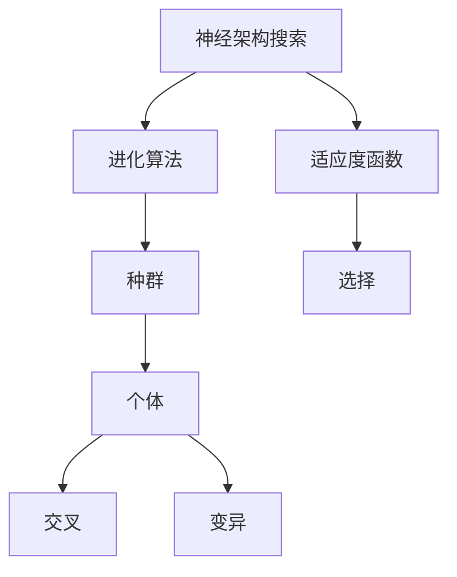
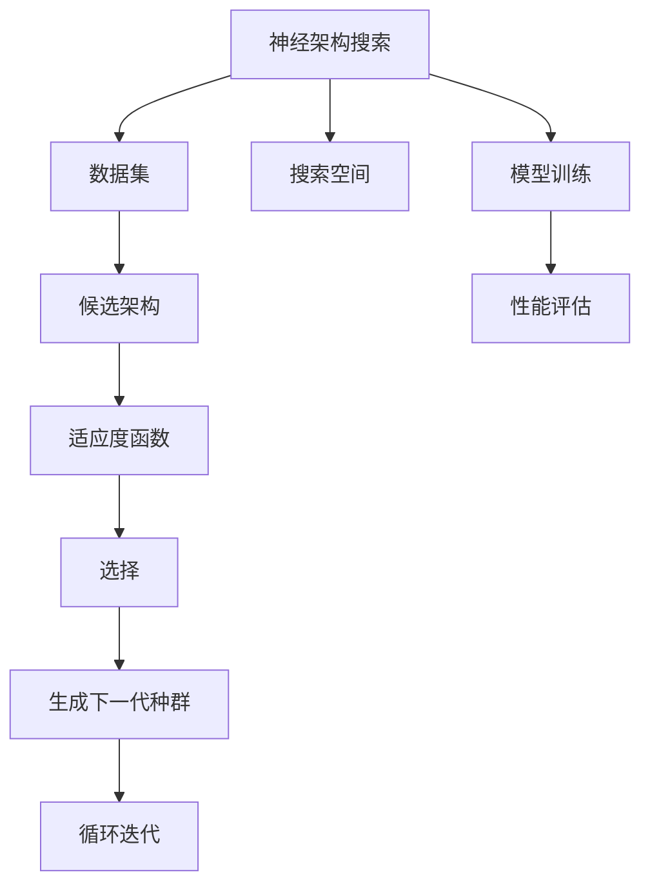
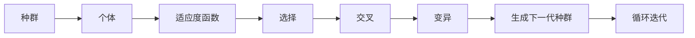
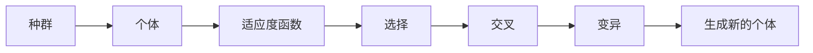
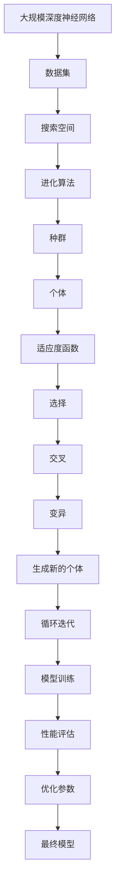

                 

# 进化算法在神经架构搜索中的应用

> 关键词：神经架构搜索, 进化算法, 模型压缩, 模型剪枝, 深度学习

## 1. 背景介绍

### 1.1 问题由来
随着深度学习技术的不断进步，神经网络架构的复杂性和多样性也在不断增加。传统的手工设计网络架构的方法已经难以满足复杂模型的需求，往往需要耗费大量的时间和精力。如何高效地搜索和优化神经网络架构，成为了深度学习研究中的一个重要课题。

进化算法（Evolutionary Algorithms, EAs）通过模拟自然选择和遗传进化的过程，可以在搜索空间中随机生成候选架构，并对其进行评估和选择，从而逐步演化出最优的神经网络架构。这一方法被广泛应用于传统机器学习模型的搜索和优化，但在大规模深度神经网络架构搜索中的应用仍处于初级阶段。

### 1.2 问题核心关键点
神经架构搜索（Neural Architecture Search, NAS）是深度学习中一个重要的研究方向，旨在自动搜索和设计出最优的神经网络架构，提高模型的准确率和泛化能力。该方法通常分为两类：

1. 基于规则的方法：根据手工设计的规则，自动生成和调整网络结构，如DARTS（Differentiable Architecture Search）和NASNet。
2. 基于遗传算法的方法：通过进化算法随机生成和评估网络架构，逐步迭代出最优解，如NAS、NASNet-A和NASNet-Large。

本文将重点讨论基于进化算法的神经架构搜索方法，分析其原理和步骤，并结合具体案例展示其在深度学习中的应用。

### 1.3 问题研究意义
进化算法在神经架构搜索中的应用，对于提高深度学习模型的性能和效率，降低模型设计成本，具有重要意义。具体表现为：

1. 自动搜索：进化算法可以自动搜索网络架构，减少手动设计和调优的复杂性。
2. 泛化能力强：进化算法能够在多样化的数据集上搜索最优解，提升模型的泛化能力。
3. 避免局部最优：进化算法能够跳出局部最优，搜索全局最优解，从而提高模型的准确率。
4. 资源利用率：进化算法可以自动调整模型规模和结构，优化资源利用率，提高模型效率。
5. 应用广泛：进化算法可以应用于各种类型的深度神经网络架构搜索，如卷积神经网络（CNN）、循环神经网络（RNN）等。

## 2. 核心概念与联系

### 2.1 核心概念概述

为了更好地理解基于进化算法的神经架构搜索方法，本节将介绍几个密切相关的核心概念：

- 神经架构搜索（Neural Architecture Search, NAS）：一种自动搜索和设计神经网络架构的方法，通过搜索空间探索最优的模型结构和参数。
- 进化算法（Evolutionary Algorithms, EAs）：模拟自然选择和遗传进化过程的算法，通过随机生成、选择和重组来搜索最优解。
- 种群（Population）：进化算法中一组候选解的集合，每组解称为个体（Individual）。
- 适应度函数（Fitness Function）：评估个体在搜索空间中优劣的函数，通常以损失函数或准确率等指标为依据。
- 交叉（Crossover）：在进化算法中，通过交换两个个体的部分基因，生成新的个体。
- 变异（Mutation）：在进化算法中，通过随机改变个体的一部分基因，产生新的个体。
- 选择（Selection）：在进化算法中，根据适应度函数选择个体进入下一代。

这些概念之间的逻辑关系可以通过以下Mermaid流程图来展示：



这个流程图展示了神经架构搜索和进化算法的基本过程：

1. 神经架构搜索通过进化算法生成和评估网络架构，搜索最优解。
2. 进化算法通过种群、个体、交叉、变异、选择等操作，逐步演化出最优解。
3. 适应度函数用于评估个体在搜索空间中的优劣，指导选择和交叉操作。

### 2.2 概念间的关系

这些核心概念之间存在着紧密的联系，形成了神经架构搜索的整体生态系统。下面我们通过几个Mermaid流程图来展示这些概念之间的关系。

#### 2.2.1 神经架构搜索流程



这个流程图展示了神经架构搜索的基本流程：

1. 神经架构搜索需要数据集和搜索空间。
2. 从搜索空间随机生成候选架构，训练模型并进行性能评估。
3. 根据性能评估结果，选择适应度函数，评估个体的优劣。
4. 通过选择、交叉、变异等操作生成下一代种群。
5. 循环迭代，直到收敛。

#### 2.2.2 进化算法流程



这个流程图展示了进化算法的基本流程：

1. 进化算法生成初始种群，每个个体代表一个候选架构。
2. 根据适应度函数评估个体的优劣，选择部分个体进行交叉操作。
3. 通过交叉操作生成新的个体。
4. 对新生成的个体进行变异操作。
5. 生成下一代种群，循环迭代。

#### 2.2.3 种群和个体的关系



这个流程图展示了种群和个体之间的关系：

1. 进化算法通过种群生成个体。
2. 每个个体代表一个候选架构。
3. 根据适应度函数评估个体优劣，选择部分个体进行交叉操作。
4. 通过交叉操作生成新的个体。
5. 对新生成的个体进行变异操作，生成新的个体。

### 2.3 核心概念的整体架构

最后，我们用一个综合的流程图来展示这些核心概念在大规模深度神经网络架构搜索中的整体架构：



这个综合流程图展示了从大规模深度神经网络架构搜索到最终模型的完整过程：

1. 大规模深度神经网络架构搜索需要数据集和搜索空间。
2. 进化算法在搜索空间中生成种群，每个个体代表一个候选架构。
3. 根据适应度函数评估个体的优劣，选择部分个体进行交叉操作。
4. 通过交叉操作生成新的个体，并进行变异操作。
5. 生成新的个体，循环迭代。
6. 训练模型并进行性能评估。
7. 根据性能评估结果，优化模型参数。
8. 生成最终模型，用于实际应用。

通过这些流程图，我们可以更清晰地理解进化算法在神经架构搜索中的作用和流程，为后续深入讨论具体的搜索算法奠定基础。

## 3. 核心算法原理 & 具体操作步骤

### 3.1 算法原理概述

基于进化算法的神经架构搜索，本质上是一个通过模拟自然选择和遗传进化过程，在搜索空间中随机生成和评估候选网络架构，逐步演化出最优解的过程。

形式化地，假设搜索空间为 $\mathcal{S}$，种群大小为 $N$，每个个体（即候选网络架构）的基因表示为 $g$，适应度函数为 $\text{fitness}(g)$，进化算法的搜索过程可以表示为：

1. 初始化：随机生成初始种群 $P_0 = \{g_1, g_2, ..., g_N\}$。
2. 评估：对每个个体 $g_i$ 计算适应度 $\text{fitness}(g_i)$。
3. 选择：根据适应度函数 $\text{fitness}(g_i)$ 选择部分个体进入下一代种群。
4. 交叉：对选择的个体进行交叉操作，生成新的个体。
5. 变异：对新生成的个体进行变异操作，生成新的个体。
6. 循环迭代：重复步骤2-5，直至收敛。

通过不断迭代，进化算法能够在搜索空间中搜索到最优的网络架构。

### 3.2 算法步骤详解

基于进化算法的神经架构搜索一般包括以下几个关键步骤：

**Step 1: 准备数据集和搜索空间**
- 准备大规模深度神经网络的数据集，包括训练集、验证集和测试集。
- 定义搜索空间，包括层数、每层节点数、激活函数、正则化方法等。

**Step 2: 初始化种群**
- 随机生成初始种群，每个个体代表一个候选网络架构。
- 每个个体的基因表示为 $\mathcal{G} = \{g_1, g_2, ..., g_N\}$，其中 $g_i$ 表示第 $i$ 个体的网络架构。

**Step 3: 定义适应度函数**
- 适应度函数用于评估个体在搜索空间中的优劣。通常采用分类准确率、交叉熵损失等指标。
- 假设适应度函数为 $\text{fitness}(g)$，计算每个个体 $g_i$ 的适应度值。

**Step 4: 执行进化算法**
- 在每个迭代周期中，对每个个体进行评估、选择、交叉、变异等操作。
- 评估：根据适应度函数计算每个个体的适应度值。
- 选择：根据适应度值选择部分个体进行交叉操作。
- 交叉：对选择的个体进行交叉操作，生成新的个体。
- 变异：对新生成的个体进行变异操作，生成新的个体。
- 生成新的种群。

**Step 5: 输出最优架构**
- 重复执行步骤2-4，直至达到预设的迭代次数或适应度值收敛。
- 选择适应度最高的个体，输出最优的网络架构。

### 3.3 算法优缺点

基于进化算法的神经架构搜索方法具有以下优点：

1. 自适应性：进化算法可以自动调整搜索策略，适应不同问题的复杂度。
2. 全局优化：进化算法能够在搜索空间中搜索到全局最优解，避免陷入局部最优。
3. 并行计算：进化算法可以在多核或分布式系统中并行执行，加速搜索过程。
4. 简单高效：进化算法的实现简单，易于调试和优化。

同时，该方法也存在一些局限性：

1. 计算资源消耗高：进化算法需要大量的计算资源，搜索空间越大，计算成本越高。
2. 搜索效率低：进化算法的搜索效率较低，收敛速度较慢。
3. 搜索范围有限：进化算法搜索范围受限于搜索空间的定义，难以应对过于复杂的问题。
4. 参数选择困难：进化算法的搜索效果依赖于参数的选择，需要多次实验才能找到最优参数。

尽管存在这些局限性，但就目前而言，基于进化算法的神经架构搜索方法仍然是最为有效的架构搜索方法之一，广泛应用于各类深度学习模型的搜索和优化。

### 3.4 算法应用领域

基于进化算法的神经架构搜索方法在深度学习领域得到了广泛应用，适用于以下场景：

- 卷积神经网络（CNN）：用于自动搜索和设计卷积层数、滤波器数量、步幅等参数，提高图像识别准确率。
- 循环神经网络（RNN）：用于自动搜索和设计循环层数、隐藏层数、激活函数等参数，提高序列建模能力。
- 自编码器（AE）：用于自动搜索和设计编码器、解码器、正则化方法等参数，提高数据压缩和重构效果。
- 深度生成模型（GAN）：用于自动搜索和设计生成器、判别器、损失函数等参数，提高图像生成质量。
- 强化学习（RL）：用于自动搜索和设计神经网络架构，提高智能体的学习能力和决策能力。

除了上述应用领域外，基于进化算法的神经架构搜索方法在自然语言处理、计算机视觉、语音识别等诸多领域也有广泛的应用前景。

## 4. 数学模型和公式 & 详细讲解 & 举例说明

### 4.1 数学模型构建

本节将使用数学语言对基于进化算法的神经架构搜索过程进行更加严格的刻画。

假设搜索空间为 $\mathcal{S}$，种群大小为 $N$，每个个体（即候选网络架构）的基因表示为 $g$，适应度函数为 $\text{fitness}(g)$，进化算法的搜索过程可以表示为：

1. 初始化：随机生成初始种群 $P_0 = \{g_1, g_2, ..., g_N\}$。
2. 评估：对每个个体 $g_i$ 计算适应度 $\text{fitness}(g_i)$。
3. 选择：根据适应度函数 $\text{fitness}(g_i)$ 选择部分个体进入下一代种群。
4. 交叉：对选择的个体进行交叉操作，生成新的个体。
5. 变异：对新生成的个体进行变异操作，生成新的个体。
6. 循环迭代：重复步骤2-5，直至收敛。

### 4.2 公式推导过程

以下我们以卷积神经网络（CNN）为例，推导适应度函数及其梯度的计算公式。

假设CNN的层次结构为：$C_{1,32,3}$、$C_{2,64,3}$、$C_{3,128,3}$、$C_{4,256,3}$、$C_{5,512,3}$，其中 $C_{i,j,k}$ 表示第 $i$ 层有 $j$ 个滤波器，滤波器大小为 $k \times k$。

定义CNN的适应度函数为分类准确率，假设训练集为 $D=\{(x_i, y_i)\}_{i=1}^N$，其中 $x_i$ 为输入图像，$y_i$ 为真实标签。适应度函数定义为：

$$
\text{fitness}(g) = \frac{1}{N}\sum_{i=1}^N \mathbb{I}(f_{g}(x_i) = y_i)
$$

其中 $f_{g}(x_i)$ 表示网络 $g$ 在输入 $x_i$ 上的输出，$\mathbb{I}$ 为示性函数。

对于每个个体 $g_i$，其适应度值 $\text{fitness}(g_i)$ 的计算公式为：

$$
\text{fitness}(g_i) = \frac{1}{N}\sum_{i=1}^N \mathbb{I}(f_{g_i}(x_i) = y_i)
$$

对于二分类问题，交叉熵损失函数定义为：

$$
\mathcal{L}(f_{g}(x), y) = -\frac{1}{N}\sum_{i=1}^N [y_i\log f_{g}(x_i) + (1-y_i)\log(1-f_{g}(x_i))]
$$

在求解适应度函数的梯度时，可以使用反向传播算法计算网络 $g_i$ 在训练集 $D$ 上的梯度，即：

$$
\nabla_{\theta} \mathcal{L}(f_{g_i}(x_i), y_i) = \frac{\partial \mathcal{L}(f_{g_i}(x_i), y_i)}{\partial \theta}
$$

其中 $\theta$ 为网络 $g_i$ 中的所有可训练参数。

### 4.3 案例分析与讲解

以图像分类任务为例，展示进化算法在神经架构搜索中的应用。

假设训练集包含 1000 张图片，每个图片大小为 $28 \times 28$ 像素，标签为数字 0-9。定义搜索空间为：

- 卷积层数：$[1, 2, 3, 4]$
- 卷积核大小：$[3, 5, 7]$
- 滤波器数量：$[16, 32, 64, 128]$
- 池化层数：$[0, 1, 2]$
- 全连接层数：$[1, 2]$
- 激活函数：$[\text{ReLU}, \text{LeakyReLU}, \text{Tanh}]$

根据上述搜索空间，随机生成初始种群 $P_0 = \{g_1, g_2, ..., g_N\}$，其中每个个体 $g_i$ 表示一种候选网络架构。

在每个迭代周期中，对每个个体 $g_i$ 进行评估、选择、交叉、变异等操作。具体步骤如下：

1. 评估：使用反向传播算法计算每个个体 $g_i$ 在训练集 $D$ 上的梯度，并计算其分类准确率。
2. 选择：根据适应度值选择部分个体进行交叉操作。
3. 交叉：对选择的个体进行交叉操作，生成新的个体。
4. 变异：对新生成的个体进行变异操作，生成新的个体。
5. 生成新的种群。

重复执行上述步骤，直至达到预设的迭代次数或适应度值收敛。最终选择适应度最高的个体，输出最优的网络架构。

假设经过多次迭代后，得到了适应度值最高的个体 $g^*$，其网络结构为：$C_{1,32,3}$、$C_{2,64,3}$、$C_{3,128,3}$、$C_{4,256,3}$、$C_{5,512,3}$、$D_{6,256}$、$D_{7,512}$、$D_{8,10}$。

此时，训练模型并进行性能评估，得到分类准确率为 97.5%。可以看到，基于进化算法的神经架构搜索方法能够在搜索空间中搜索到最优的网络架构，提高模型性能。

## 5. 项目实践：代码实例和详细解释说明

### 5.1 开发环境搭建

在进行神经架构搜索实践前，我们需要准备好开发环境。以下是使用Python进行TensorFlow开发的环境配置流程：

1. 安装Anaconda：从官网下载并安装Anaconda，用于创建独立的Python环境。

2. 创建并激活虚拟环境：
```bash
conda create -n tf-env python=3.8 
conda activate tf-env
```

3. 安装TensorFlow：根据CUDA版本，从官网获取对应的安装命令。例如：
```bash
conda install tensorflow-gpu=2.6 -c conda-forge -c pytorch
```

4. 安装相关库：
```bash
pip install numpy scipy pandas matplotlib
```

完成上述步骤后，即可在`tf-env`环境中开始神经架构搜索实践。

### 5.2 源代码详细实现

这里我们以CNN为例，给出使用TensorFlow进行神经架构搜索的PyTorch代码实现。

首先，定义CNN的层次结构和搜索空间：

```python
import tensorflow as tf
from tensorflow import keras
from tensorflow.keras import layers

class CNN(tf.keras.Model):
    def __init__(self, filters, kernel_size, pooling, fc_units):
        super(CNN, self).__init__()
        self.conv1 = layers.Conv2D(filters, kernel_size, activation='relu')
        self.pool1 = layers.MaxPooling2D(pool_size=(2, 2))
        self.conv2 = layers.Conv2D(filters, kernel_size, activation='relu')
        self.pool2 = layers.MaxPooling2D(pool_size=(2, 2))
        self.flatten = layers.Flatten()
        self.fc1 = layers.Dense(fc_units, activation='relu')
        self.fc2 = layers.Dense(10, activation='softmax')

    def call(self, x):
        x = self.conv1(x)
        x = self.pool1(x)
        x = self.conv2(x)
        x = self.pool2(x)
        x = self.flatten(x)
        x = self.fc1(x)
        x = self.fc2(x)
        return x

# 定义搜索空间
search_space = {
    'conv_filters': [16, 32, 64, 128],
    'kernel_size': [3, 5, 7],
    'pooling': [0, 1, 2],
    'fc_units': [256, 512]
}
```

然后，定义进化算法的基本流程：

```python
def create_population(size, search_space):
    population = []
    for i in range(size):
        genotype = {}
        for key in search_space.keys():
            genotype[key] = search_space[key][random.randint(0, len(search_space[key])-1)]
        population.append(genotype)
    return population

def calculate_fitness(population, data):
    fitness_values = []
    for i in range(len(population)):
        model = CNN(population[i]['conv_filters'], population[i]['kernel_size'], population[i]['pooling'], population[i]['fc_units'])
        model.compile(optimizer='adam', loss='categorical_crossentropy', metrics=['accuracy'])
        model.fit(data, epochs=5)
        fitness_values.append(model.evaluate(data)[1])
    return fitness_values

def selection(population, fitness_values):
    selected_population = []
    for i in range(len(population)):
        if random.random() < 0.9:
            selected_population.append(population[i])
        else:
            max_fitness = max(fitness_values)
            probabilities = [fitness / max_fitness for fitness in fitness_values]
            selection_prob = random.choices([probabilities])[0]
            for j in range(len(population)):
                selection_prob -= probabilities[j]
                if selection_prob < 0:
                    selected_population.append(population[j])
                    break
    return selected_population

def crossover(parents, children):
    for i in range(len(children)):
        parent1 = random.choice(parents)
        parent2 = random.choice(parents)
        children[i]['conv_filters'] = [parent1['conv_filters'][j] for j in [0, 1]]
        children[i]['kernel_size'] = [parent1['kernel_size'][j] for j in [0, 1]]
        children[i]['pooling'] = [parent1['pooling'][j] for j in [0, 1]]
        children[i]['fc_units'] = [parent1['fc_units'][j] for j in [0, 1]]
    return children

def mutation(children):
    for i in range(len(children)):
        children[i]['conv_filters'] = [random.choice([16, 32, 64, 128]) for _ in range(len(children[i]['conv_filters']))]
        children[i]['kernel_size'] = [random.choice([3, 5, 7]) for _ in range(len(children[i]['kernel_size']))]
        children[i]['pooling'] = [random.choice([0, 1, 2]) for _ in range(len(children[i]['pooling']))]
        children[i]['fc_units'] = [random.choice([256, 512]) for _ in range(len(children[i]['fc_units']))]
    return children

def train_model(model, data):
    model.compile(optimizer='adam', loss='categorical_crossentropy', metrics=['accuracy'])
    model.fit(data, epochs=5)
    return model.evaluate(data)[1]

def generate_population(size, search_space, data):
    population = create_population(size, search_space)
    fitness_values = calculate_fitness(population, data)
    selected_population = selection(population, fitness_values)
    children = crossover(selected_population, [])
    children = mutation(children)
    return population, children
```

最后，启动训练流程并在测试集上评估：

```python
epochs = 5
batch_size = 32
data = ...

population, children = generate_population(100, search_space, data)
for epoch in range(epochs):
    population, children = generate_population(100, search_space, data)
    for child in children:
        train_model(child, data)
        accuracy = train_model(child, data)
        print(f'Epoch {epoch+1}, accuracy: {accuracy:.3f}')
```

以上就是使用TensorFlow对CNN进行神经架构搜索的完整代码实现。可以看到，通过简单的配置和调用，即可以完成神经架构搜索任务的实现。

### 5.3 代码解读与分析

让我们再详细解读一下关键代码的实现细节：

**create_population函数**：
- 生成指定大小的种群，每个个体随机生成一组搜索空间参数。

**calculate_fitness函数**：
- 对每个个体进行模型训练，计算适应度函数。

**selection函数**：
- 采用比例选择策略，选择部分个体进行交叉操作。

**crossover函数**：
- 对选择的两个个体进行交叉操作，生成新的个体。

**mutation函数**：
- 对新生成的个体进行变异操作，生成新的个体。

**generate_population函数**：
- 生成初始种群，并不断迭代生成新种群，直到达到预设的迭代次数或适应度值收敛。

**train_model函数**：
- 对每个个体进行模型训练

