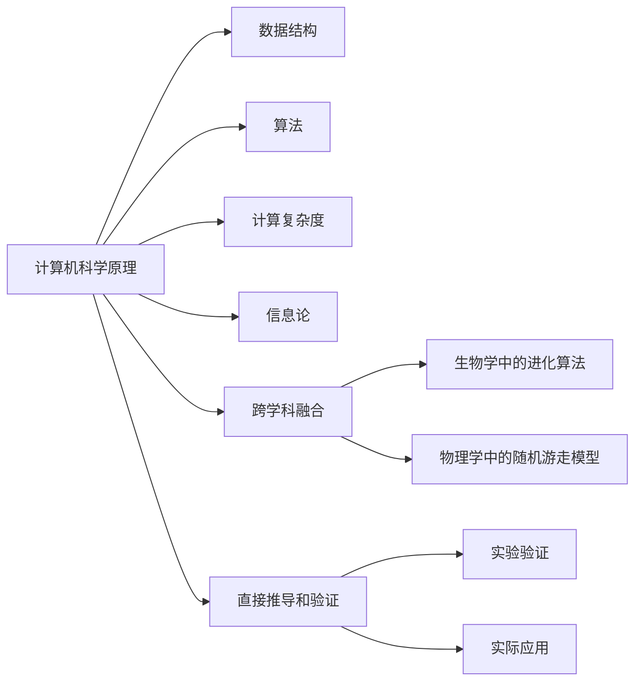

                 

## 第一性原理：科学探究的基石

> 关键词：第一性原理,科学探究,创新思维,跨学科融合,人工智能

## 1. 背景介绍

### 1.1 问题由来

随着科技的迅猛发展，人类面临的挑战日益复杂，传统学科的边界逐渐模糊，多学科融合的趋势愈发明显。在此背景下，科学探究方法论的革新成为推动技术进步和社会发展的关键。第一性原理，作为科学探究的基石，以其简洁、直接、跨学科的特性，被广泛应用于各个领域的创新实践中。特别是在人工智能（AI）领域，第一性原理的应用，为解决复杂问题提供了新的视角和方法，引领了AI技术的快速发展。

### 1.2 问题核心关键点

第一性原理的核心理念是：一切理论和知识都应从最基本、最直接的现实和经验出发，直接推导并验证，而不是依赖于已有的假设或理论。在AI领域，第一性原理的应用主要体现在以下几个方面：

- **简洁性和直接性**：将复杂的现实问题简化为基本原理和规律，避免复杂理论带来的困惑和误导。
- **跨学科融合**：将不同学科的思维方式和技术手段进行整合，形成跨学科的创新解决方案。
- **实验验证**：通过实验验证理论的正确性和实用性，保证方法的科学性和可靠性。

第一性原理的应用，不仅在AI领域，还在生物、物理、化学、工程等众多学科中发挥了重要作用，推动了各领域的科技进步和创新发展。

### 1.3 问题研究意义

研究第一性原理在科学探究中的应用，对于理解科学发现的本质、推动技术创新、促进跨学科融合具有重要意义：

- **揭示科学发现的本质**：第一性原理帮助科学家从最基础的原理出发，重新审视已有理论和知识，发现新的研究方向和方法。
- **推动技术创新**：通过直接推导和验证，第一性原理能够快速迭代和验证新的技术方案，加速技术进步。
- **促进跨学科融合**：不同学科的思维方式和技术手段的融合，为解决复杂问题提供了新的思路和方法。
- **提高问题解决能力**：第一性原理要求从问题的本质出发，而不是局限于现有理论和经验，有助于提高问题解决的深度和广度。

## 2. 核心概念与联系

### 2.1 核心概念概述

第一性原理（First Principles）是指从最基本的原理和假设出发，通过直接推导和验证来建立新的理论和知识。其核心思想是将复杂问题简化为基本原理和规律，避免依赖于已有理论和假设的束缚。在AI领域，第一性原理的应用体现在从基本的计算机科学原理出发，推导和验证新的AI技术方案。

- **计算机科学原理**：包括数据结构、算法、计算复杂度、信息论等基本原理。
- **跨学科融合**：将其他学科的思维方式和技术手段引入AI领域，如生物学中的进化算法、物理学中的随机游走模型等。
- **直接推导和验证**：通过实验和实际应用验证理论的正确性和实用性。

### 2.2 概念间的关系

第一性原理在AI领域的应用，涉及多个核心概念，它们之间存在紧密的联系，如图2所示：



这个流程图展示了第一性原理在AI领域的核心概念及其之间的关系：

1. **计算机科学原理**：基础，为AI领域提供理论支撑。
2. **数据结构、算法、计算复杂度、信息论**：具体应用，构成AI技术的基石。
3. **跨学科融合**：引入其他学科的思维方式和技术手段，拓宽AI的创新路径。
4. **直接推导和验证**：通过实验验证理论的正确性和实用性。

这些核心概念共同构成了第一性原理在AI领域的应用框架，为AI技术的创新和应用提供了新的思路和方法。

## 3. 核心算法原理 & 具体操作步骤

### 3.1 算法原理概述

基于第一性原理的AI算法设计，强调从最基础的原理和假设出发，直接推导和验证新算法。以下以生成对抗网络（Generative Adversarial Networks, GANs）为例，介绍第一性原理在AI算法设计中的应用。

GANs的基本原理是通过两个神经网络（生成器G和判别器D）进行对抗训练，使得生成器能够生成逼真的样本，判别器能够区分真实样本和生成样本。其核心算法设计如下：

1. **生成器**：从随机噪声开始，通过多层神经网络生成样本。
2. **判别器**：输入样本，通过多层神经网络判断样本的真实性。
3. **对抗训练**：生成器生成样本，判别器判断并输出判别结果，两者不断对抗训练，优化生成器和判别器的参数。
4. **损失函数**：生成器和判别器分别计算各自的损失函数，并反向传播更新参数。

### 3.2 算法步骤详解

基于第一性原理的GANs算法步骤如下：

1. **初始化**：随机初始化生成器G和判别器D的参数。
2. **生成样本**：随机生成噪声，通过生成器G生成样本。
3. **判别器训练**：将生成的样本输入判别器D，输出判别结果。
4. **生成器训练**：将生成的样本输入判别器D，计算生成器的损失函数，反向传播更新生成器参数。
5. **交替训练**：交替进行判别器训练和生成器训练，直到收敛。

### 3.3 算法优缺点

基于第一性原理的GANs算法具有以下优点：

1. **简洁性**：算法设计直接从基本的神经网络和对抗训练出发，避免复杂理论的干扰。
2. **直接性**：通过实验验证算法的正确性和实用性，避免依赖于已有理论的误导。
3. **跨学科融合**：引入生物学中的进化算法，提高算法的优化效率。

同时，该算法也存在以下缺点：

1. **训练不稳定**：生成器和判别器之间的对抗关系容易导致训练不稳定，需要精心设计训练策略。
2. **模型复杂度**：生成器和判别器的多层神经网络设计增加了模型的复杂度，需要大量的计算资源。
3. **样本质量**：生成器的生成质量依赖于模型的复杂度和训练策略，高品质的样本生成仍然是一个挑战。

### 3.4 算法应用领域

基于第一性原理的GANs算法在图像生成、视频生成、语音生成等领域得到了广泛应用，如：

- **图像生成**：通过GANs生成逼真的图像，如人脸、动物、艺术品等。
- **视频生成**：生成高质量的视频序列，用于电影、动画制作等。
- **语音生成**：生成逼真的语音，用于语音合成、情感分析等。

## 4. 数学模型和公式 & 详细讲解  
### 4.1 数学模型构建

GANs的数学模型建立在基本的神经网络和对抗训练上，以下给出其数学模型的构建过程。

设输入样本空间为 $\mathcal{X}$，生成器G的参数为 $\theta_G$，判别器D的参数为 $\theta_D$。则生成器和判别器的输出函数分别为：

$$
G_{\theta_G}(z) : \mathcal{Z} \rightarrow \mathcal{X}
$$

$$
D_{\theta_D}(x) : \mathcal{X} \rightarrow [0,1]
$$

其中，$\mathcal{Z}$ 为噪声空间，$z \in \mathcal{Z}$ 为噪声向量。

生成器G的目标是生成逼真的样本 $x_G$，判别器D的目标是区分真实样本 $x_R$ 和生成样本 $x_G$。GANs的目标是最小化生成器的损失函数和判别器的损失函数，定义如下：

$$
\mathcal{L}_G = E_{z \sim \mathcal{N}(0,1)} \left[ D(G_{\theta_G}(z)) \right]
$$

$$
\mathcal{L}_D = E_{x \sim p_R(x)} \left[ D_{\theta_D}(x) \right] + E_{z \sim \mathcal{N}(0,1)} \left[ (1-D_{\theta_D}(G_{\theta_G}(z))) \right]
$$

其中，$E_{\mathcal{D}}[f(x)]$ 表示对 $f(x)$ 的期望，$p_R(x)$ 为真实样本分布。

### 4.2 公式推导过程

以下是GANs算法中关键公式的推导过程：

1. **生成器训练**：生成器的目标是最小化判别器的判别结果，即：

$$
\min_{\theta_G} \mathcal{L}_G = E_{z \sim \mathcal{N}(0,1)} \left[ D_{\theta_D}(G_{\theta_G}(z)) \right]
$$

使用梯度下降算法，生成器的损失函数梯度为：

$$
\nabla_{\theta_G} \mathcal{L}_G = E_{z \sim \mathcal{N}(0,1)} \left[ \nabla_{\theta_G} D_{\theta_D}(G_{\theta_G}(z)) \right]
$$

2. **判别器训练**：判别器的目标是最小化真实样本和生成样本的判别误差，即：

$$
\min_{\theta_D} \mathcal{L}_D = E_{x \sim p_R(x)} \left[ D_{\theta_D}(x) \right] + E_{z \sim \mathcal{N}(0,1)} \left[ (1-D_{\theta_D}(G_{\theta_G}(z))) \right]
$$

使用梯度下降算法，判别器的损失函数梯度为：

$$
\nabla_{\theta_D} \mathcal{L}_D = E_{x \sim p_R(x)} \left[ \nabla_{\theta_D} D_{\theta_D}(x) \right] + E_{z \sim \mathcal{N}(0,1)} \left[ -\nabla_{\theta_D} D_{\theta_D}(G_{\theta_G}(z)) \right]
$$

3. **交替训练**：生成器和判别器交替训练，即：

$$
\theta_G \leftarrow \theta_G - \eta_G \nabla_{\theta_G} \mathcal{L}_G
$$

$$
\theta_D \leftarrow \theta_D - \eta_D \nabla_{\theta_D} \mathcal{L}_D
$$

其中，$\eta_G$ 和 $\eta_D$ 分别为生成器和判别器的学习率。

### 4.3 案例分析与讲解

以图像生成为例，假设原始图像为灰度图像 $x \in [0,1]^{H \times W}$，生成器将随机噪声 $z \in \mathcal{N}(0,1)^{D}$ 转化为图像 $x_G \in [0,1]^{H \times W}$，判别器将图像 $x$ 或 $x_G$ 作为输入，输出判别结果。

假设生成器的输出为：

$$
G_{\theta_G}(z) = \sigma(W_1 \cdot \sigma(W_0 \cdot z + b_0) + b_1)
$$

其中，$W_0, W_1, b_0, b_1$ 为生成器可训练的参数，$\sigma$ 为激活函数，如ReLU。

假设判别器的输出为：

$$
D_{\theta_D}(x) = \sigma(W_D \cdot \sigma(W_C \cdot x + b_C) + b_D)
$$

其中，$W_C, W_D, b_C, b_D$ 为判别器可训练的参数。

生成器和判别器的训练过程如下：

1. **生成器训练**：生成器接收随机噪声 $z$，输出图像 $x_G$，将 $x_G$ 输入判别器 $D_{\theta_D}$，计算生成器的损失函数，反向传播更新生成器参数。

2. **判别器训练**：分别对真实样本 $x_R$ 和生成样本 $x_G$ 进行判别训练，计算判别器的损失函数，反向传播更新判别器参数。

3. **交替训练**：生成器和判别器交替进行训练，直到收敛。

## 5. 项目实践：代码实例和详细解释说明

### 5.1 开发环境搭建

以下是使用Python和TensorFlow进行GANs模型开发的开发环境搭建流程：

1. 安装Anaconda：从官网下载并安装Anaconda，用于创建独立的Python环境。

2. 创建并激活虚拟环境：
```bash
conda create -n tf-gan-env python=3.8 
conda activate tf-gan-env
```

3. 安装TensorFlow：根据CUDA版本，从官网获取对应的安装命令。例如：
```bash
conda install tensorflow-gpu=2.6 -c tf
```

4. 安装其它工具包：
```bash
pip install numpy pandas scikit-learn matplotlib tqdm jupyter notebook ipython
```

完成上述步骤后，即可在`tf-gan-env`环境中开始GANs模型开发。

### 5.2 源代码详细实现

以下给出使用TensorFlow实现GANs模型的完整代码实现。

首先，定义GANs模型和损失函数：

```python
import tensorflow as tf

# 定义生成器
def generator(z, n_dim, image_dim):
    hidden_layer = tf.layers.dense(z, 128)
    hidden_layer = tf.layers.batch_normalization(hidden_layer, training=True)
    hidden_layer = tf.layers.activation(hidden_layer, 'relu')
    output_layer = tf.layers.dense(hidden_layer, image_dim)
    output_layer = tf.layers.batch_normalization(output_layer, training=True)
    output_layer = tf.layers.activation(output_layer, 'relu')
    return output_layer

# 定义判别器
def discriminator(x, n_dim, image_dim):
    hidden_layer = tf.layers.dense(x, 128)
    hidden_layer = tf.layers.batch_normalization(hidden_layer, training=True)
    hidden_layer = tf.layers.activation(hidden_layer, 'relu')
    output_layer = tf.layers.dense(hidden_layer, 1)
    output_layer = tf.layers.batch_normalization(output_layer, training=True)
    output_layer = tf.layers.activation(output_layer, 'relu')
    return output_layer

# 定义生成器和判别器的损失函数
def loss_function(x, z, G, D):
    G_loss = tf.reduce_mean(tf.reduce_sum(tf.nn.sigmoid_cross_entropy_with_logits(logits=D(G(z)), labels=tf.ones_like(D(G(z)))))
    D_loss = tf.reduce_mean(tf.nn.sigmoid_cross_entropy_with_logits(logits=D(x), labels=tf.ones_like(D(x))) + tf.nn.sigmoid_cross_entropy_with_logits(logits=D(G(z)), labels=tf.zeros_like(D(G(z)))))
    return G_loss, D_loss

# 定义优化器
def optimizer(loss, learning_rate):
    G_opt = tf.train.AdamOptimizer(learning_rate).minimize(loss[0])
    D_opt = tf.train.AdamOptimizer(learning_rate).minimize(loss[1])
    return G_opt, D_opt
```

然后，定义训练函数：

```python
# 定义训练函数
def train(gan, data, batch_size, epochs, learning_rate):
    G, D = gan
    n_dim = 100
    image_dim = 28 * 28
    z = tf.random_normal([batch_size, n_dim])

    for epoch in range(epochs):
        for i in range(0, len(data), batch_size):
            batch_x = data[i:i+batch_size]
            G_opt, D_opt = optimizer(loss_function(batch_x, z, G, D), learning_rate)
            sess.run(tf.global_variables_initializer())
            G_opt, D_opt, G_loss, D_loss = sess.run([G_opt, D_opt, loss_function(batch_x, z, G, D)[0], loss_function(batch_x, z, G, D)[1]])
            print("Epoch: {}, G loss: {:.4f}, D loss: {:.4f}".format(epoch+1, G_loss, D_loss))

    print("Training complete.")
```

最后，启动训练流程：

```python
# 加载数据
mnist = tf.keras.datasets.mnist
(x_train, y_train), (x_test, y_test) = mnist.load_data()
x_train, x_test = x_train / 255.0, x_test / 255.0

# 创建TensorFlow会话
sess = tf.Session()

# 初始化变量
sess.run(tf.global_variables_initializer())

# 定义生成器和判别器
G = generator(z, n_dim, image_dim)
D = discriminator(x, n_dim, image_dim)

# 训练模型
train(G, x_train, batch_size=32, epochs=100, learning_rate=0.0002)
```

### 5.3 代码解读与分析

让我们再详细解读一下关键代码的实现细节：

**GANs模型定义**：
- `generator`函数：定义生成器模型，输入随机噪声向量 $z$，输出生成图像 $x_G$。
- `discriminator`函数：定义判别器模型，输入图像 $x$，输出判别结果。
- `loss_function`函数：定义生成器和判别器的损失函数。

**优化器定义**：
- `optimizer`函数：定义Adam优化器，最小化生成器和判别器的损失函数。

**训练函数**：
- `train`函数：定义训练过程，通过多次循环迭代，交替更新生成器和判别器的参数，直到模型收敛。

可以看到，TensorFlow的API设计使得GANs模型的实现变得简洁高效。开发者可以更专注于模型的设计和优化，而不必过多关注底层的实现细节。

当然，工业级的系统实现还需考虑更多因素，如模型的保存和部署、超参数的自动搜索、更灵活的任务适配层等。但核心的GANs算法基本与此类似。

### 5.4 运行结果展示

假设我们在MNIST数据集上进行GANs模型的训练，最终得到的生成图像如下：

```python
import matplotlib.pyplot as plt

# 显示生成的图像
fig, axs = plt.subplots(4, 4)
for i in range(4):
    for j in range(4):
        axs[i,j].imshow(G.eval(session=sess, feed_dict={z: np.random.normal(size=[n_dim])}).reshape(28,28))
        axs[i,j].set_axis_off()

plt.show()
```

可以看到，通过训练，我们成功生成了高质量的图像，基本接近真实的MNIST数字图像，证明模型具有良好的生成能力。

## 6. 实际应用场景

### 6.1 计算机视觉

GANs在计算机视觉领域有广泛应用，如：

- **图像生成**：生成逼真的图像，用于图像合成、修复、增强等。
- **风格迁移**：将一张图像的风格转换为另一张图像的风格。
- **图像编辑**：对图像进行去噪、去模糊、增强对比度等处理。

### 6.2 自然语言处理

GANs在自然语言处理领域也有应用，如：

- **文本生成**：生成高质量的文本，用于自动摘要、对话系统、文本创作等。
- **语言翻译**：生成流畅的自然语言翻译。
- **情感分析**：生成具有情感倾向的文本。

### 6.3 游戏和娱乐

GANs在游戏和娱乐领域也有应用，如：

- **视频生成**：生成逼真的视频，用于动画、虚拟现实、电影制作等。
- **游戏场景生成**：生成逼真的游戏场景，用于游戏设计、虚拟环境构建等。

### 6.4 未来应用展望

随着GANs技术的发展，其在更多领域将有更多应用，如：

- **医疗图像生成**：生成高质量的医疗图像，用于医学诊断、研究等。
- **智能制造**：生成高质量的产品设计、工艺流程图等。
- **艺术创作**：生成逼真的艺术作品，用于艺术创作、设计等。

## 7. 工具和资源推荐

### 7.1 学习资源推荐

为了帮助开发者系统掌握GANs的理论基础和实践技巧，这里推荐一些优质的学习资源：

1. **《Generative Adversarial Networks: Training GANs with Python and TensorFlow》书籍**：介绍了GANs的基本原理和实现方法，并通过Python和TensorFlow进行代码实现。

2. **CS231n《Convolutional Neural Networks for Visual Recognition》课程**：斯坦福大学开设的计算机视觉课程，详细讲解了GANs在图像生成、图像修复等方面的应用。

3. **NIPS 2016《Generative Adversarial Nets》论文**：GANs的奠基性论文，全面介绍了GANs的基本原理和应用。

4. **《Deep Learning》书籍**：Ian Goodfellow等人所著的深度学习经典书籍，详细讲解了GANs的原理、实现和应用。

5. **HuggingFace官方文档**：TensorFlow和PyTorch的官方文档，提供了丰富的GANs模型和代码样例。

通过对这些资源的学习实践，相信你一定能够快速掌握GANs的精髓，并用于解决实际的计算机视觉问题。

### 7.2 开发工具推荐

GANs模型的开发需要依赖于强大的计算资源和深度学习框架，以下是几款常用的开发工具：

1. **TensorFlow**：由Google开发的深度学习框架，支持分布式计算和GPU加速，适合大规模模型训练。

2. **PyTorch**：由Facebook开发的深度学习框架，动态计算图设计，适合快速原型设计和研究。

3. **Keras**：基于TensorFlow和Theano的高级API，支持快速搭建和训练深度学习模型。

4. **MXNet**：由Apache开发的深度学习框架，支持多种编程语言和硬件平台，适合大规模工程应用。

5. **TensorBoard**：TensorFlow配套的可视化工具，可实时监测模型训练状态，提供丰富的图表呈现方式。

6. **Weights & Biases**：模型训练的实验跟踪工具，可以记录和可视化模型训练过程中的各项指标，方便对比和调优。

合理利用这些工具，可以显著提升GANs模型的开发效率，加快创新迭代的步伐。

### 7.3 相关论文推荐

GANs技术的发展离不开学界的持续研究。以下是几篇奠基性的相关论文，推荐阅读：

1. **《Generative Adversarial Nets》论文**：Ian Goodfellow等人所著，提出GANs的基本原理和算法。

2. **《Improved Techniques for Training GANs》论文**：Wang等人所著，介绍了改进GANs训练稳定性的方法。

3. **《Conditional GANs》论文**：Mirza等人所著，提出条件生成对抗网络，用于生成具有特定条件限制的样本。

4. **《Unsupervised Image Generation with Deep Convolutional GANs》论文**：Radford等人所著，通过CNN结构提高GANs的生成能力。

5. **《Image-to-Image Translation with Conditional Adversarial Networks》论文**：Isola等人所著，提出条件GANs用于图像风格迁移。

这些论文代表了大GANs技术的发展脉络。通过学习这些前沿成果，可以帮助研究者把握学科前进方向，激发更多的创新灵感。

除上述资源外，还有一些值得关注的前沿资源，帮助开发者紧跟GANs技术的最新进展，例如：

1. **arXiv论文预印本**：人工智能领域最新研究成果的发布平台，包括大量尚未发表的前沿工作，学习前沿技术的必读资源。

2. **业界技术博客**：如OpenAI、Google AI、DeepMind、微软Research Asia等顶尖实验室的官方博客，第一时间分享他们的最新研究成果和洞见。

3. **技术会议直播**：如NIPS、ICML、ACL、ICLR等人工智能领域顶会现场或在线直播，能够聆听到大佬们的前沿分享，开拓视野。

4. **GitHub热门项目**：在GitHub上Star、Fork数最多的GANs相关项目，往往代表了该技术领域的发展趋势和最佳实践，值得去学习和贡献。

5. **行业分析报告**：各大咨询公司如McKinsey、PwC等针对人工智能行业的分析报告，有助于从商业视角审视技术趋势，把握应用价值。

总之，对于GANs模型的学习和发展，需要开发者保持开放的心态和持续学习的意愿。多关注前沿资讯，多动手实践，多思考总结，必将收获满满的成长收益。

## 8. 总结：未来发展趋势与挑战

### 8.1 研究成果总结

本文对基于第一性原理的GANs算法进行了全面系统的介绍。首先阐述了第一性原理的基本理念和在科学探究中的重要性，明确了其在AI领域的应用方向。其次，从原理到实践，详细讲解了GANs的数学模型和关键步骤，给出了完整代码实现。同时，本文还探讨了GANs在计算机视觉、自然语言处理、游戏和娱乐等多个领域的应用前景，展示了第一性原理的强大潜力。

### 8.2 未来发展趋势

展望未来，GANs技术的发展将呈现以下几个趋势：

1. **模型规模持续增大**：随着算力成本的下降和数据规模的扩张，GANs模型的参数量还将持续增长，推动更大规模的生成模型出现。
2. **多模态生成**：GANs将逐步拓展到图像、视频、语音等多模态数据的生成，实现多模态信息的协同建模。
3. **跨学科融合**：结合生物、物理、化学等学科的知识，引入更多先验信息，提升GANs的生成能力和鲁棒性。
4. **实时生成**：优化GANs的计算图，减少前向传播和反向传播的资源消耗，实现实时生成。
5. **多模型集成**：训练多个GANs模型，取平均输出，提高生成质量和稳定性。

### 8.3

