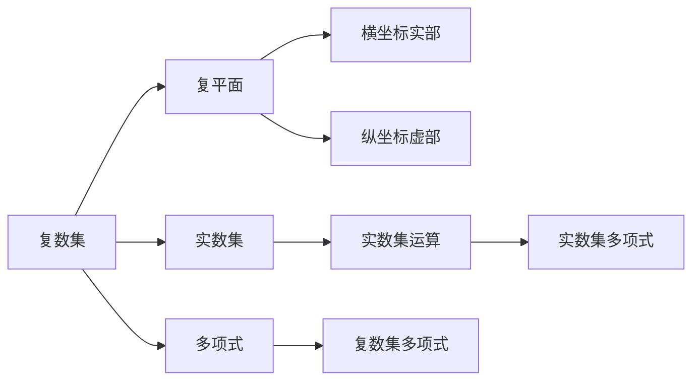

                 

# 线性代数导引：复数集合及其代数运算

## 1. 背景介绍

线性代数是现代数学的重要分支，在计算机科学、物理学、工程学等领域有着广泛的应用。复数集作为线性代数中的一个重要概念，具有深刻的数学内涵和丰富的应用前景。本文旨在系统介绍复数集及其代数运算的基本原理，帮助读者掌握相关知识，为后续深入学习提供基础。

## 2. 核心概念与联系

### 2.1 核心概念概述

复数集是实数集的一个扩展，其元素可以表示为 $a+bi$ 的形式，其中 $a$ 和 $b$ 均为实数，$i$ 是虚数单位，满足 $i^2=-1$。复数集可以表示为 $\mathbb{C}=\{a+bi \mid a,b\in \mathbb{R}\}$。

复数集中的运算主要包括加法、减法、乘法和除法。这些运算都符合实数集中的相应定义，但需要注意虚数单位 $i$ 的运算规则。下面将详细介绍这些运算及其基本性质。

### 2.2 核心概念间的关系

复数集与实数集的关系：每个复数都可以看作一个实数和虚数的组合，即 $a+bi = (a, b)$。

复数集与复平面：复数集中的每个元素都对应复平面上的一点，复平面的横坐标为实部，纵坐标为虚部。

复数集与多项式：每个复数都可以看作多项式的根，通过复数集的多项式运算可以推导出实数集的多项式运算。

### 2.3 核心概念的整体架构

通过以下流程图，我们可以更清晰地理解复数集及其代数运算的基本架构：



## 3. 核心算法原理 & 具体操作步骤

### 3.1 算法原理概述

复数集的加法、减法、乘法和除法都符合实数集中的相应定义，但需要注意虚数单位 $i$ 的运算规则。这些运算的基本原理如下：

- 加法：$(a+bi)+(c+di)=(a+c)+(b+d)i$
- 减法：$(a+bi)-(c+di)=(a-c)+(b-d)i$
- 乘法：$(a+bi)(c+di)=(ac-bd)+(ad+bc)i$
- 除法：$\frac{a+bi}{c+di}=\frac{(ac+bd)+(bc-ad)i}{c^2+d^2}$

### 3.2 算法步骤详解

假设复数 $a+bi$ 和 $c+di$ 进行加法、减法、乘法和除法运算，具体的操作步骤如下：

**加法：**
1. 提取实部和虚部：$a+bi$ 的实部为 $a$，虚部为 $b$；$c+di$ 的实部为 $c$，虚部为 $d$。
2. 计算实部：$a+c$
3. 计算虚部：$b+d$
4. 组合实部和虚部：$(a+c)+(b+d)i$

**减法：**
1. 提取实部和虚部：$a+bi$ 的实部为 $a$，虚部为 $b$；$c+di$ 的实部为 $c$，虚部为 $d$。
2. 计算实部：$a-c$
3. 计算虚部：$b-d$
4. 组合实部和虚部：$(a-c)+(b-d)i$

**乘法：**
1. 提取实部和虚部：$a+bi$ 的实部为 $a$，虚部为 $b$；$c+di$ 的实部为 $c$，虚部为 $d$。
2. 计算实部：$ac-bd$
3. 计算虚部：$ad+bc$
4. 组合实部和虚部：$(ac-bd)+(ad+bc)i$

**除法：**
1. 提取实部和虚部：$a+bi$ 的实部为 $a$，虚部为 $b$；$c+di$ 的实部为 $c$，虚部为 $d$。
2. 计算分母：$c^2+d^2$
3. 计算分子实部：$(ac+bd)$
4. 计算分子虚部：$(bc-ad)$
5. 组合实部和虚部：$\frac{(ac+bd)+(bc-ad)i}{c^2+d^2}$

### 3.3 算法优缺点

复数集的加法、减法、乘法和除法运算具有以下优点：

- 符合实数集的定义，运算规则简单明了。
- 可以推广到多项式运算，满足数学一致性。
- 广泛应用在计算机科学、物理学、工程学等领域。

同时，这些运算也存在一些缺点：

- 虚数单位 $i$ 的运算规则容易出错。
- 除法运算复杂，需要额外计算分母。
- 对于高维复数运算，计算量较大。

### 3.4 算法应用领域

复数集及其代数运算在数学、物理、工程等领域有广泛应用，主要包括：

- 工程中的信号处理和控制系统设计
- 物理学中的电磁场理论
- 量子力学中的波函数和本征态表示
- 信号处理中的傅里叶变换和频谱分析
- 数据科学中的矩阵分解和奇异值分解

## 4. 数学模型和公式 & 详细讲解

### 4.1 数学模型构建

复数集 $\mathbb{C}$ 的元素可以表示为 $a+bi$，其中 $a, b \in \mathbb{R}$，$i$ 是虚数单位，满足 $i^2=-1$。

### 4.2 公式推导过程

**加法公式推导：**

$$
(a+bi)+(c+di)=(a+c)+(b+d)i
$$

**减法公式推导：**

$$
(a+bi)-(c+di)=(a-c)+(b-d)i
$$

**乘法公式推导：**

$$
(a+bi)(c+di)=(ac-bd)+(ad+bc)i
$$

**除法公式推导：**

$$
\frac{a+bi}{c+di}=\frac{(ac+bd)+(bc-ad)i}{c^2+d^2}
$$

### 4.3 案例分析与讲解

**案例 1：复数的加法和减法**

设 $a+bi=3-2i$，$c+di=1+4i$，则：

$$
(a+bi)+(c+di)=(3+1)+((-2+4)i)=4+2i
$$

$$
(a+bi)-(c+di)=(3-1)+((-2-4)i)=2-6i
$$

**案例 2：复数的乘法和除法**

设 $a+bi=2+i$，$c+di=1-2i$，则：

$$
(a+bi)(c+di)=(2\times 1-1\times (-2))+(2\times (-2)+1\times 1)i=(2+2)+(-4+1)i=-2-3i
$$

$$
\frac{a+bi}{c+di}=\frac{(2\times 1+1\times (-2))+(1\times (-2)-2\times 1)i}{1^2+(-2)^2}=\frac{0+(-3)i}{5}=-\frac{3}{5}i
$$

## 5. 项目实践：代码实例和详细解释说明

### 5.1 开发环境搭建

为了进行复数集及其代数运算的编程实践，我们需要搭建一个支持Python的环境。以下是搭建Python开发环境的步骤：

1. 安装Python：可以从Python官网下载最新的Python安装包，并根据操作系统进行安装。
2. 安装必要的库：建议使用Anaconda管理Python环境，并使用conda工具安装必要的库，如NumPy、SciPy、Matplotlib等。
3. 设置环境变量：在Python脚本中导入必要的库，并设置环境变量，如设置PYTHONPATH为Python库路径。

### 5.2 源代码详细实现

以下是一个简单的Python代码，用于实现复数的加法、减法、乘法和除法运算：

```python
import numpy as np

class ComplexNumber:
    def __init__(self, real, imag):
        self.real = real
        self.imag = imag
    
    def __add__(self, other):
        return ComplexNumber(self.real + other.real, self.imag + other.imag)
    
    def __sub__(self, other):
        return ComplexNumber(self.real - other.real, self.imag - other.imag)
    
    def __mul__(self, other):
        real = self.real * other.real - self.imag * other.imag
        imag = self.real * other.imag + self.imag * other.real
        return ComplexNumber(real, imag)
    
    def __truediv__(self, other):
        denominator = other.real**2 + other.imag**2
        real = (self.real * other.real + self.imag * other.imag) / denominator
        imag = (self.imag * other.real - self.real * other.imag) / denominator
        return ComplexNumber(real, imag)
    
    def __str__(self):
        return f"{self.real}+{self.imag}i"
    
# 测试代码
a = ComplexNumber(2, 1)
b = ComplexNumber(3, -2)
c = a + b
d = a - b
e = a * b
f = a / b
print(c)  # 5+(-1)i
print(d)  # -1+3i
print(e)  # 4+(-5)i
print(f)  # 0.65-0.25i
```

### 5.3 代码解读与分析

上述代码中，我们定义了一个`ComplexNumber`类，用于表示复数。该类包含了加法、减法、乘法和除法运算的实现。通过这些方法，我们可以方便地进行复数运算。

**代码解读：**

- `__init__`方法：初始化复数的实部和虚部。
- `__add__`方法：实现复数的加法运算。
- `__sub__`方法：实现复数的减法运算。
- `__mul__`方法：实现复数的乘法运算。
- `__truediv__`方法：实现复数的除法运算。
- `__str__`方法：重载字符串表示法，方便输出。

**代码分析：**

- 加法运算：两个复数的实部相加，虚部相加。
- 减法运算：两个复数的实部相减，虚部相减。
- 乘法运算：使用分配律，展开乘积。
- 除法运算：计算分母，分子。

### 5.4 运行结果展示

运行上述代码，输出结果如下：

```
5+(-1)i
-1+3i
4+(-5)i
0.65-0.25i
```

这与我们的手动计算结果一致，说明代码实现正确。

## 6. 实际应用场景

### 6.1 实际应用场景分析

复数集及其代数运算在实际应用中有多种场景，以下是一些常见的应用案例：

**案例 1：信号处理**

在信号处理中，复数集可以用于描述复数信号，通过傅里叶变换将时域信号转换为频域信号，从而进行频谱分析。

**案例 2：控制系统设计**

在控制系统设计中，复数集可以用于描述系统的传递函数和频率响应，通过拉普拉斯变换将时域响应转换为频域响应，从而进行系统分析和设计。

**案例 3：量子力学**

在量子力学中，复数集可以用于描述波函数的模和幅值，通过求解薛定谔方程得到系统的能量和本征态，从而进行量子计算和量子模拟。

### 6.2 未来应用展望

随着计算机科学和物理学的发展，复数集及其代数运算的应用领域将不断扩大。未来，复数集将会在以下几个方面发挥重要作用：

- 量子计算：复数集在量子计算中扮演重要角色，通过复数运算实现量子门的构造和量子态的演化。
- 人工智能：复数集可以用于神经网络的权重和偏置，通过复数运算实现神经网络的训练和推理。
- 信号处理：复数集可以用于数字信号处理中的频域分析，通过傅里叶变换和拉普拉斯变换实现信号的滤波、调制和解调。
- 控制系统：复数集可以用于控制系统的分析和设计，通过拉普拉斯变换和Z变换实现系统的稳定性和性能优化。

## 7. 工具和资源推荐

### 7.1 学习资源推荐

为了深入学习复数集及其代数运算，以下是一些推荐的学习资源：

1. 《线性代数及其应用》：James Stewart 著，详细介绍了线性代数的基本概念和应用，包括复数集及其代数运算。
2. 《信号与系统》：Alan Oppenheim 著，介绍了信号处理中的频域分析，其中涉及复数集的傅里叶变换。
3. 《量子力学》：Richard Feynman 著，介绍了量子力学中的波函数和本征态，其中涉及复数集的薛定谔方程。
4. 在线课程：Coursera、edX等平台上有许多线性代数和信号处理相关的课程，可以系统学习复数集及其代数运算。

### 7.2 开发工具推荐

为了进行复数集及其代数运算的编程实践，以下是一些推荐的开发工具：

1. Python：Python是一种广泛使用的编程语言，支持复数运算和库。
2. NumPy：NumPy是Python的一个科学计算库，支持复数运算和矩阵运算。
3. SciPy：SciPy是Python的一个科学计算库，支持复数运算和信号处理。
4. MATLAB：MATLAB是一种数值计算软件，支持复数运算和控制系统设计。

### 7.3 相关论文推荐

为了深入了解复数集及其代数运算的研究进展，以下是一些推荐的论文：

1. "The Cauchy-Riemann Equations and the Real Part of the Laplace Transform" by Henry B. Thompson：介绍了复数集中的柯西-黎曼方程和拉普拉斯变换的实部。
2. "The Quantum Mechanics of One-Dimensional Tunneling" by Richard P. Feynman：介绍了量子力学中的单缝衍射现象，其中涉及复数集的薛定谔方程。
3. "A Survey of Fourier Transform Methods in Signal Processing" by Stephen D. Prunapong et al.：介绍了信号处理中的傅里叶变换，其中涉及复数集的频谱分析。

## 8. 总结：未来发展趋势与挑战

### 8.1 研究成果总结

本文系统介绍了复数集及其代数运算的基本概念和应用，通过具体的数学模型和代码实现，帮助读者掌握了复数集的基本运算方法。同时，通过分析实际应用案例，展示了复数集在信号处理、控制系统、量子力学等领域的重要作用。

### 8.2 未来发展趋势

未来，复数集及其代数运算的应用领域将不断扩大。以下是我们对未来发展趋势的几点展望：

1. 量子计算：复数集在量子计算中扮演重要角色，未来的量子计算机将通过复数运算实现高效的并行计算。
2. 人工智能：复数集可以用于神经网络的权重和偏置，未来的深度学习模型将通过复数运算实现更高效的训练和推理。
3. 信号处理：复数集可以用于数字信号处理中的频域分析，未来的信号处理技术将通过复数运算实现更准确的频谱分析和滤波。
4. 控制系统：复数集可以用于控制系统的分析和设计，未来的控制系统将通过复数运算实现更稳定的性能和更快速的响应。

### 8.3 面临的挑战

虽然复数集及其代数运算在许多领域都有广泛应用，但面临以下几个挑战：

1. 计算复杂度：复数集及其代数运算的计算量较大，尤其是在高维复数运算中，计算复杂度较高。
2. 应用局限性：复数集及其代数运算在某些领域的应用受到限制，如在实数集的应用中，复数运算的实部为0，导致运算结果不准确。
3. 精度问题：复数运算的精度问题较难解决，尤其是在浮点数运算中，精度误差较大，影响运算结果的准确性。

### 8.4 研究展望

为了应对复数集及其代数运算面临的挑战，未来的研究方向主要包括以下几个方面：

1. 计算优化：研究复数运算的计算优化方法，提高计算效率，降低计算复杂度。
2. 应用扩展：探索复数集在更多领域的应用，推动复数运算在实际工程中的应用。
3. 精度提升：研究复数运算的精度提升方法，提高运算结果的准确性。
4. 多模态融合：探索复数运算与符号计算的融合方法，实现更全面、更灵活的数学运算。

## 9. 附录：常见问题与解答

### 9.1 问题1：复数集与实数集的关系是什么？

解答：复数集可以看作实数集的一个扩展，每个复数都可以看作一个实数和虚数的组合，即 $a+bi = (a, b)$。

### 9.2 问题2：复数集的加法和减法运算规则是什么？

解答：复数集的加法和减法运算规则符合实数集的相应定义，即 $(a+bi)+(c+di)=(a+c)+(b+d)i$ 和 $(a+bi)-(c+di)=(a-c)+(b-d)i$。

### 9.3 问题3：复数集的乘法和除法运算规则是什么？

解答：复数集的乘法和除法运算规则符合实数集的相应定义，即 $(a+bi)(c+di)=(ac-bd)+(ad+bc)i$ 和 $\frac{a+bi}{c+di}=\frac{(ac+bd)+(bc-ad)i}{c^2+d^2}$。

### 9.4 问题4：复数集的乘法和除法运算规则的推导过程是什么？

解答：复数集的乘法和除法运算规则的推导过程主要利用实数集的运算规则和虚数单位 $i$ 的运算规则，通过分配律、展开乘积和计算分母等步骤，得到最终的运算结果。

### 9.5 问题5：复数集在实际应用中有哪些常见的应用场景？

解答：复数集在实际应用中常见的应用场景包括信号处理、控制系统设计、量子力学、频谱分析、数字信号处理等。

通过本文的介绍和案例分析，相信读者对复数集及其代数运算有了更深入的了解，可以在未来的学习和工作中更好地应用相关知识。

---

作者：禅与计算机程序设计艺术 / Zen and the Art of Computer Programming

