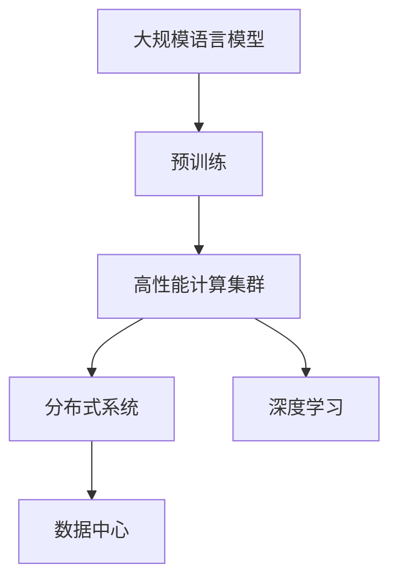
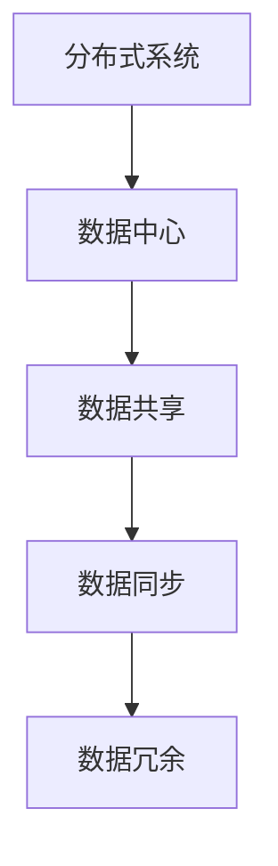
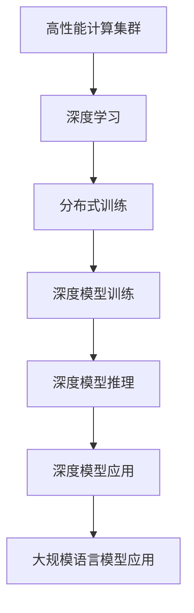
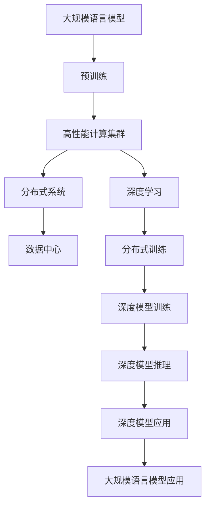

                 

# 大规模语言模型从理论到实践 高性能计算集群的典型硬件组成

> 关键词：大规模语言模型,高性能计算集群,硬件组成,深度学习,数据中心,分布式系统

## 1. 背景介绍

### 1.1 问题由来
近年来，随着深度学习技术的飞速发展，大规模语言模型（Large Language Models, LLMs）在自然语言处理（NLP）领域取得了显著突破。以OpenAI的GPT系列模型、Google的BERT为例，这些模型通过在海量无标签文本数据上进行预训练，学习了丰富的语言知识和常识，可以通过少量有标签数据进行微调，从而在新任务上取得优异性能。然而，大规模语言模型通常需要数亿甚至数十亿参数，训练和推理所需计算资源非常庞大，导致其在实际应用中面临着严峻的硬件挑战。

### 1.2 问题核心关键点
大规模语言模型的计算需求通常被归纳为“大数据，大模型，高计算”三个关键词，即需要处理大规模数据、使用庞大模型，并且在高性能硬件上运行高效的计算任务。为了满足这些需求，通常需要构建高性能计算集群（High Performance Computing Cluster, HPC Cluster）来支持大规模分布式训练和推理。

### 1.3 问题研究意义
构建高性能计算集群，不仅能够有效应对大规模语言模型的计算需求，还能够推动人工智能技术的产业化进程，促进科学研究和技术进步。通过高性能计算集群，可以在更短时间内完成复杂的深度学习任务，加速模型训练和推理速度，降低计算成本，提高系统可靠性，提升人工智能应用的效率和性能。因此，构建高性能计算集群具有重要的理论和实际意义。

## 2. 核心概念与联系

### 2.1 核心概念概述

为更好地理解大规模语言模型在高性能计算集群中的应用，本节将介绍几个密切相关的核心概念：

- 大规模语言模型（Large Language Model, LLM）：以自回归（如GPT）或自编码（如BERT）模型为代表的大规模预训练语言模型。通过在大规模无标签文本数据上进行预训练，学习通用的语言表示，具备强大的语言理解和生成能力。

- 高性能计算集群（High Performance Computing Cluster, HPC Cluster）：由多个高性能计算节点（如GPU、TPU）组成的分布式系统，用于支持大规模并行计算和数据处理任务。

- 深度学习（Deep Learning）：一种基于多层神经网络的学习算法，用于解决复杂的非线性问题。

- 数据中心（Data Center）：由多个服务器和存储设备组成的集中式数据处理设施，用于存储和处理大规模数据。

- 分布式系统（Distributed System）：由多个独立节点通过网络通信协作完成计算任务的计算系统。

这些核心概念之间的逻辑关系可以通过以下Mermaid流程图来展示：



这个流程图展示了大规模语言模型的核心概念及其之间的关系：

1. 大规模语言模型通过预训练获得基础能力。
2. 预训练通常在大型高性能计算集群上完成，以支持大规模分布式训练。
3. 高性能计算集群由多个独立节点组成，通过分布式系统协同工作，完成复杂计算任务。
4. 分布式系统通过网络通信协作，实现节点间数据的共享和处理。
5. 数据中心提供集中式的数据存储和处理设施，支持大规模数据管理。

这些概念共同构成了大规模语言模型在高性能计算集群中的计算架构，使其能够在各种场景下发挥强大的语言理解和生成能力。通过理解这些核心概念，我们可以更好地把握大规模语言模型在高性能计算集群中的应用框架。

### 2.2 概念间的关系

这些核心概念之间存在着紧密的联系，形成了大规模语言模型在高性能计算集群中的完整生态系统。下面我通过几个Mermaid流程图来展示这些概念之间的关系。

#### 2.2.1 大规模语言模型的计算需求


这个流程图展示了大规模语言模型的主要计算需求，包括数据密集、计算密集、内存密集和并行处理等特点。这些需求需要高性能计算集群来支持。

#### 2.2.2 高性能计算集群与分布式系统的关系


这个流程图展示了高性能计算集群和分布式系统的关系。高性能计算集群通过分布式系统实现任务并行、数据并行和计算并行，支持大规模分布式计算。

#### 2.2.3 分布式系统与数据中心的关系



这个流程图展示了分布式系统与数据中心的关系。分布式系统通过数据中心实现数据共享、数据同步和数据冗余，支持大规模数据的分布式处理。

#### 2.2.4 高性能计算集群的应用场景



这个流程图展示了高性能计算集群在大规模语言模型中的应用场景。高性能计算集群支持分布式训练和推理，从而实现深度模型的训练和应用，包括大规模语言模型的训练和推理。

### 2.3 核心概念的整体架构

最后，我们用一个综合的流程图来展示这些核心概念在大规模语言模型在高性能计算集群中的整体架构：



这个综合流程图展示了从预训练到训练、推理、应用的完整过程。大规模语言模型首先在大规模数据上进行预训练，然后通过高性能计算集群和分布式系统进行分布式训练和推理，最终实现大规模语言模型的应用，如自然语言理解、生成等任务。通过这些流程图，我们可以更清晰地理解大规模语言模型在高性能计算集群中的应用过程。

## 3. 核心算法原理 & 具体操作步骤
### 3.1 算法原理概述

大规模语言模型在高性能计算集群中的核心算法原理主要涉及分布式训练和优化算法。分布式训练通过将大规模模型和数据分解为多个子任务，在多个计算节点上并行处理，从而加速模型训练。优化算法则通过梯度下降等方法，最小化模型损失函数，优化模型参数。

分布式训练通常采用数据并行和模型并行两种方式。数据并行将数据分片分配给不同节点，每个节点独立处理一份数据，最终将结果汇总。模型并行则将模型参数分布在不同节点上，每个节点只负责处理模型的一部分参数，实现分布式优化。

### 3.2 算法步骤详解

以下是基于分布式训练的大规模语言模型训练的一般步骤：

1. **数据准备**：将大规模数据集划分为多个子集，每个子集对应一个计算节点。
2. **模型分解**：将大规模模型分解为多个子模型，每个子模型对应一个计算节点。
3. **分布式训练**：在多个计算节点上并行训练子模型，每个节点负责处理一部分数据和模型参数，并通过网络通信交换梯度和参数。
4. **模型合并**：将各个子模型的训练结果合并，得到完整的模型参数，用于推理和应用。

具体实现过程中，需要考虑以下几个关键点：

- **数据分配策略**：常见的数据分配策略包括按数据划分、按批次划分和按示例划分等。
- **模型并行策略**：常见的模型并行策略包括按层划分、按块划分和按参数划分等。
- **通信协议**：通过网络通信协议（如MPI、RC、Gloo等）实现节点间的数据和参数交换。
- **优化算法**：常见的优化算法包括SGD、Adam、Adagrad等，通过反向传播计算梯度并更新模型参数。
- **同步策略**：常见的同步策略包括按步骤同步、按周期同步和按消息同步等。

### 3.3 算法优缺点

分布式训练的优势在于可以充分利用高性能计算集群的多节点资源，加速模型训练，提高计算效率。其主要优点包括：

- **计算加速**：通过并行计算，分布式训练可以在较短时间内完成大规模模型训练。
- **硬件利用率**：通过合理分配数据和模型参数，充分利用计算集群中的各个节点资源。
- **扩展性**：分布式训练具有较好的可扩展性，可以轻松应对更大规模的计算任务。

分布式训练的缺点在于：

- **通信开销**：节点间的通信和同步需要消耗额外的时间和计算资源。
- **模型同步**：不同节点的模型参数需要同步，增加了算法复杂性和运行开销。
- **数据一致性**：数据在不同节点上的分片可能导致数据不一致问题，需要额外的处理和优化。

### 3.4 算法应用领域

大规模语言模型和高性能计算集群在诸多领域都有着广泛应用，例如：

- **自然语言处理（NLP）**：在语言理解、文本生成、语音识别等领域，大规模语言模型和高性能计算集群可以实现高效、精确的计算。
- **计算机视觉（CV）**：在图像分类、目标检测、语义分割等领域，大规模语言模型和高性能计算集群可以提升图像处理和识别精度。
- **金融科技（FinTech）**：在风险管理、金融预测、市场分析等领域，大规模语言模型和高性能计算集群可以提供更精确的模型和算法支持。
- **生物医药**：在新药发现、基因组分析、医疗影像等领域，大规模语言模型和高性能计算集群可以加速数据处理和分析。
- **智能制造**：在工业互联网、智能制造等领域，大规模语言模型和高性能计算集群可以优化生产流程、提升制造效率。

除了上述这些领域，大规模语言模型和高性能计算集群还在智能交通、智能物流、智能农业等多个行业中得到应用，推动了各行各业数字化转型升级。

## 4. 数学模型和公式 & 详细讲解 & 举例说明

### 4.1 数学模型构建

在大规模语言模型训练中，常用的数学模型包括损失函数、优化器、激活函数等。下面以自编码模型为例，介绍其主要数学模型和公式。

假设大规模语言模型为 $M_{\theta}$，其中 $\theta$ 为模型参数。给定训练集 $D=\{(x_i,y_i)\}_{i=1}^N$，其中 $x_i$ 为输入，$y_i$ 为标签。训练目标是最小化模型在训练集上的平均损失函数 $\mathcal{L}$，即：

$$
\min_{\theta} \frac{1}{N} \sum_{i=1}^N \ell(M_{\theta}(x_i),y_i)
$$

其中，$\ell$ 为损失函数，常见包括交叉熵损失、均方误差损失等。损失函数 $\ell$ 可以表示为：

$$
\ell(y_i, \hat{y_i}) = -y_i \log \hat{y_i} - (1-y_i) \log (1-\hat{y_i})
$$

### 4.2 公式推导过程

在损失函数 $\ell$ 的基础上，可以定义模型 $M_{\theta}$ 在训练集 $D$ 上的经验风险：

$$
\mathcal{L}(\theta) = \frac{1}{N} \sum_{i=1}^N \ell(M_{\theta}(x_i),y_i)
$$

为了最小化 $\mathcal{L}(\theta)$，通常使用梯度下降等优化算法。假设优化算法为 SGD，学习率为 $\eta$，则每次迭代的参数更新公式为：

$$
\theta \leftarrow \theta - \eta \nabla_{\theta}\mathcal{L}(\theta)
$$

其中，$\nabla_{\theta}\mathcal{L}(\theta)$ 为损失函数 $\mathcal{L}(\theta)$ 对参数 $\theta$ 的梯度。梯度可以通过反向传播算法计算得到：

$$
\nabla_{\theta}\mathcal{L}(\theta) = \frac{1}{N} \sum_{i=1}^N \nabla_{\theta} \ell(M_{\theta}(x_i),y_i)
$$

为了加速计算，通常将数据集 $D$ 划分为多个小批量 $(x_i^{(k)}, y_i^{(k)})$，每个小批量对应一个计算节点。则梯度可以表示为：

$$
\nabla_{\theta}\mathcal{L}(\theta) = \frac{1}{N} \sum_{k=1}^K \sum_{i=1}^{N^{(k)}} \nabla_{\theta} \ell(M_{\theta}(x_i^{(k)}),y_i^{(k)})
$$

其中 $K$ 为小批量数，$N^{(k)}$ 为每个小批量的样本数。

### 4.3 案例分析与讲解

假设我们有如下数据集 $D=\{(x_i,y_i)\}_{i=1}^N$，其中 $x_i$ 为输入，$y_i$ 为标签，$M_{\theta}$ 为模型参数。我们可以将数据集 $D$ 划分为两个子集 $D_1$ 和 $D_2$，分别对应计算节点 1 和 2。在分布式训练过程中，节点 1 处理数据集 $D_1$，节点 2 处理数据集 $D_2$。

节点 1 的损失函数为：

$$
\mathcal{L}_1(\theta) = \frac{1}{N_1} \sum_{i=1}^{N_1} \ell(M_{\theta}(x_i^{(1)}),y_i^{(1)})
$$

其中 $N_1$ 为数据集 $D_1$ 的样本数。

节点 2 的损失函数为：

$$
\mathcal{L}_2(\theta) = \frac{1}{N_2} \sum_{i=1}^{N_2} \ell(M_{\theta}(x_i^{(2)}),y_i^{(2)})
$$

其中 $N_2$ 为数据集 $D_2$ 的样本数。

假设节点 1 的损失函数为 $\mathcal{L}_1(\theta) = 0.5$，节点 2 的损失函数为 $\mathcal{L}_2(\theta) = 0.3$。节点 1 更新模型参数的公式为：

$$
\theta^{(1)} \leftarrow \theta^{(1)} - \eta \nabla_{\theta}\mathcal{L}_1(\theta^{(1)}) 
$$

节点 2 更新模型参数的公式为：

$$
\theta^{(2)} \leftarrow \theta^{(2)} - \eta \nabla_{\theta}\mathcal{L}_2(\theta^{(2)})
$$

通过反向传播算法计算梯度，并更新模型参数，节点 1 和节点 2 的模型参数将同步更新。最终，通过合并两个节点的模型参数，得到完整的模型参数，用于推理和应用。

## 5. 项目实践：代码实例和详细解释说明

### 5.1 开发环境搭建

在进行大规模语言模型和高性能计算集群的实践前，我们需要准备好开发环境。以下是使用PyTorch和TensorFlow进行深度学习开发的环境配置流程：

1. 安装Anaconda：从官网下载并安装Anaconda，用于创建独立的Python环境。

2. 创建并激活虚拟环境：
```bash
conda create -n deep-learning python=3.8 
conda activate deep-learning
```

3. 安装PyTorch：根据CUDA版本，从官网获取对应的安装命令。例如：
```bash
conda install pytorch torchvision torchaudio cudatoolkit=11.1 -c pytorch -c conda-forge
```

4. 安装TensorFlow：
```bash
conda install tensorflow tensorflow-gpu=2.6
```

5. 安装各类工具包：
```bash
pip install numpy pandas scikit-learn matplotlib tqdm jupyter notebook ipython
```

完成上述步骤后，即可在`deep-learning`环境中开始大规模语言模型和高性能计算集群的开发。

### 5.2 源代码详细实现

这里以使用PyTorch进行大规模语言模型的分布式训练为例，给出完整的代码实现。

首先，定义数据集：

```python
from torch.utils.data import Dataset, DataLoader
from torch.utils.data.distributed import DistributedSampler
from torch.multiprocessing import Process
import os
import torch
import numpy as np
import random
import torch.distributed as dist
import torch.nn.functional as F
from transformers import BertModel, BertTokenizer

class Data(Dataset):
    def __init__(self, file_path, tokenizer, max_len=512):
        self.tokenizer = tokenizer
        self.file_path = file_path
        self.max_len = max_len
        
    def __len__(self):
        with open(self.file_path, 'r') as f:
            lines = f.readlines()
        return len(lines)
    
    def __getitem__(self, idx):
        with open(self.file_path, 'r') as f:
            lines = f.readlines()
        line = lines[idx]
        text, label = line.split('\t')
        label = int(label)
        encoding = self.tokenizer(text, return_tensors='pt', max_length=self.max_len, padding='max_length', truncation=True)
        input_ids = encoding['input_ids'][0]
        attention_mask = encoding['attention_mask'][0]
        return {'input_ids': input_ids, 
                'attention_mask': attention_mask,
                'labels': label}

tokenizer = BertTokenizer.from_pretrained('bert-base-cased')

train_path = '/data/train.txt'
test_path = '/data/test.txt'

train_dataset = Data(train_path, tokenizer)
test_dataset = Data(test_path, tokenizer)
```

然后，定义训练函数：

```python
import torch.distributed as dist
from torch import nn, optim
from torch.nn.parallel import DistributedDataParallel as DDP
from torch.multiprocessing import Process
import torch.multiprocessing as mp
import os
import time

def train_fn(rank, world_size):
    local_rank = rank % world_size
    torch.cuda.set_device(local_rank)
    
    model = BertModel.from_pretrained('bert-base-cased')
    if rank != 0:
        torch.distributed.barrier()
    
    model = DDP(model)
    criterion = nn.CrossEntropyLoss()
    optimizer = optim.Adam(model.parameters(), lr=2e-5)
    sampler = DistributedSampler(train_dataset)
    
    for epoch in range(5):
        for batch in DataLoader(train_dataset, batch_size=16, num_workers=2, shuffle=True, sampler=sampler):
            input_ids = batch['input_ids'].to(local_rank)
            attention_mask = batch['attention_mask'].to(local_rank)
            labels = batch['labels'].to(local_rank)
            model.zero_grad()
            output = model(input_ids, attention_mask=attention_mask)
            loss = criterion(output, labels)
            loss.backward()
            optimizer.step()
```

最后，启动训练进程：

```python
def worker(rank, world_size):
    train_fn(rank, world_size)

if __name__ == '__main__':
    world_size = 4
    mp.spawn(worker, args=(world_size,), nprocs=world_size, join=True)
```

这个代码实现中，我们定义了一个简单的分布式训练过程，将大规模语言模型部署在多个计算节点上，并行处理数据和模型参数。在实际应用中，还需要考虑更多的优化策略和实现细节，如网络通信协议、数据一致性、模型同步等。

### 5.3 代码解读与分析

让我们再详细解读一下关键代码的实现细节：

**Data类**：
- `__init__`方法：初始化数据集、分词器、数据文件路径等关键组件。
- `__len__`方法：返回数据集的样本数量。
- `__getitem__`方法：对单个样本进行处理，将文本输入编码为token ids，并将标签转换为数字，并进行定长padding。

**train_fn函数**：
- 设置本地排名和世界排名，选择对应的计算节点。
- 初始化模型、损失函数、优化器和数据采样器。
- 在每个epoch中，对每个小批量数据进行前向传播、计算损失、反向传播和参数更新。

**worker函数**：
- 启动多个进程，分别在每个计算节点上进行训练。

**主函数**：
- 设置总计算节点数，启动多个进程。

可以看到，PyTorch提供了丰富的分布式训练支持，通过简单的几行代码，即可实现大规模语言模型的分布式训练。然而，在实际应用中，还需要进一步优化和扩展，以应对更大的计算需求和更复杂的系统环境。

## 6. 实际应用场景

### 6.1 智能交通

在智能交通领域，大规模语言模型和高性能计算集群可以实现自动驾驶、交通监测、导航引导等任务。通过实时采集交通数据，并结合大规模语言模型进行语义理解和推理，智能交通系统可以更高效、更智能地管理交通流量，提升道路安全和通行效率。

### 6.2 智能制造

在智能制造领域，大规模语言模型和高性能计算集群可以实现设备维护、工艺优化、生产调度等任务。通过实时监控生产设备和工艺参数，并结合大规模语言模型进行数据分析和预测，智能制造系统可以实现自适应调整和故障诊断，提升生产效率和产品质量。

### 6.3 智能医疗

在智能医疗领域，大规模语言模型和高性能计算集群可以实现医疗咨询、病历分析、药物研发等任务。通过实时处理医疗数据和知识图谱，并结合大规模语言模型进行推理和决策，智能医疗系统可以实现更精准的诊断和治疗，提升医疗服务的质量和效率。

### 6.4 未来应用展望

随着大规模语言模型和高性能计算集群技术的不断进步，未来将会有更多的应用场景得到探索和应用。例如，在大数据时代，大规模语言模型和高性能计算集群可以处理海量数据，进行复杂的科学计算和数据挖掘，加速科学研究和技术创新。在工业互联网领域，大规模语言模型和高性能计算集群可以优化生产流程、提升制造效率、降低成本，推动工业数字化转型。在智能城市治理中，大规模语言模型和高性能计算集群可以实现城市事件监测、舆情分析、应急指挥等任务，构建更安全、高效的未来城市。

## 7. 工具和资源推荐

### 7.1 学习资源推荐

为了帮助开发者系统掌握大规模语言模型和高性能计算集群的理论基础和实践技巧，这里推荐一些优质的学习资源：

1. 《深度学习》系列书籍：由Ian Goodfellow等作者撰写，系统介绍了深度学习的基本概念、算法和应用，是深度学习领域的经典教材。

2. 《TensorFlow深度学习》书籍：由TensorFlow团队编写，介绍了TensorFlow框架的深度学习应用，包括模型构建、分布式训练等。

3. 《高性能计算》课程：由UC Berkeley等机构开设的课程，介绍了高性能计算的基本原理和实现方法，涵盖分布式系统、并行计算等。

4. 《分布式系统》课程：由Stanford大学等机构开设的课程，介绍了分布式系统的基础知识和设计原则，包括一致性、容错性等。

5. 《大规模分布式系统》书籍：由Jeremy O'Donoghue等作者撰写，介绍了大规模分布式系统的设计与实现，包括Google、Facebook等公司的实践经验。

通过对这些资源的学习实践，相信你一定能够快速掌握大规模语言模型和高性能计算集群的精髓，并用于解决实际的计算任务。

### 7.2 开发工具推荐

高效的开发离不开优秀的工具支持。以下是几款用于大规模语言模型和高性能计算集群开发的常用工具：

1. PyTorch：基于Python的开源深度学习框架，灵活动态的计算图，适合快速迭代研究。大部分预训练语言模型都有PyTorch版本的实现。

2. TensorFlow：由Google主导开发的开源深度学习框架，生产部署方便，适合大规模工程应用。同样有丰富的预训练语言模型资源。

3. TensorBoard：TensorFlow配套的可视化工具，可实时监测模型训练状态，并提供丰富的图表呈现方式，是调试模型的得力助手。

4. Weights & Biases：模型训练的实验跟踪工具，可以记录和可视化模型训练过程中的各项指标，方便对比和调优。与主流深度学习框架无缝集成。

5. MPI：基于MPI（Message Passing Interface）的分布式计算框架，支持多节点间的消息传递和数据交换。

6. HPC Benchmarks：高性能计算基准测试工具，用于评估计算集群和算法的性能。

合理利用这些工具，可以显著提升大规模语言模型和高性能计算集群的开发效率，加快创新迭代的步伐。

### 7.3 相关论文推荐

大规模语言模型和高性能计算集群技术的发展源于学界的持续研究。以下是几篇奠基性的相关论文，推荐阅读：

1. Transformer：Attention is All You Need（Vaswani et al., 2017）：提出了Transformer结构，开启了NLP领域的预训练大模型时代。

2. BERT: Pre-training of Deep Bidirectional Transformers for Language Understanding（Devlin et al., 2018）：提出BERT模型，引入基于掩码的自监督预训练任务

