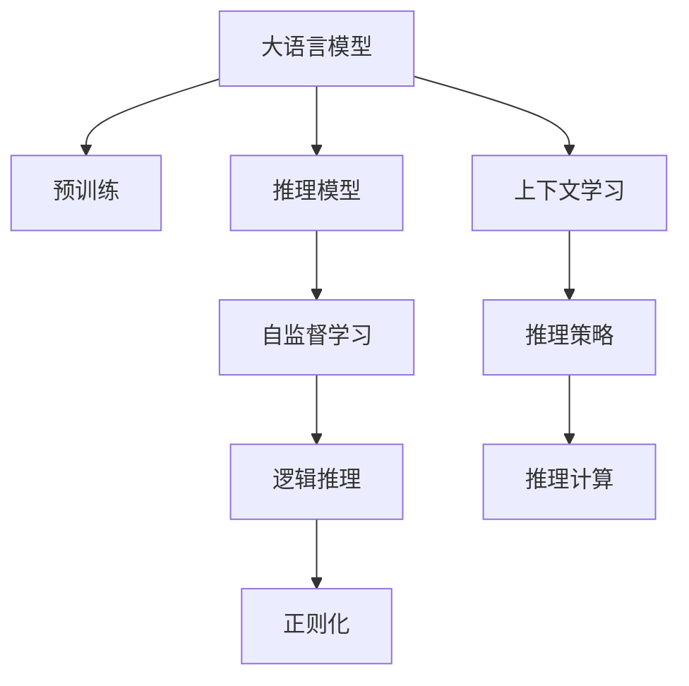
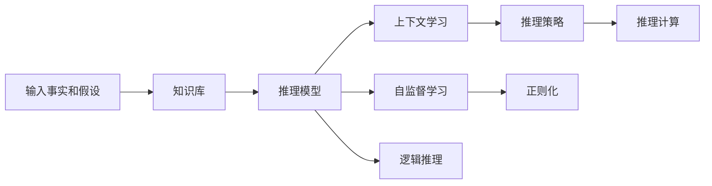
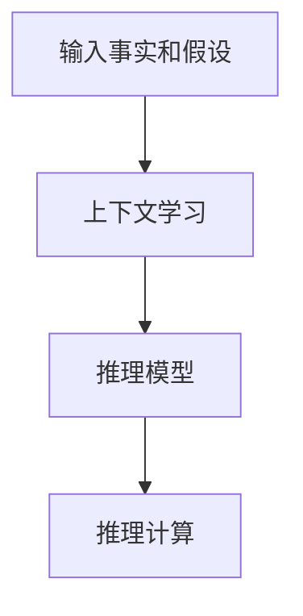
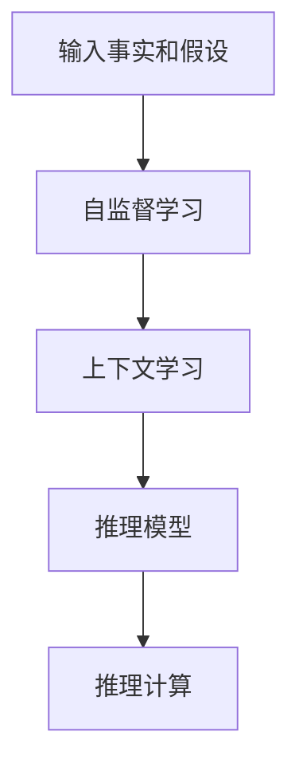
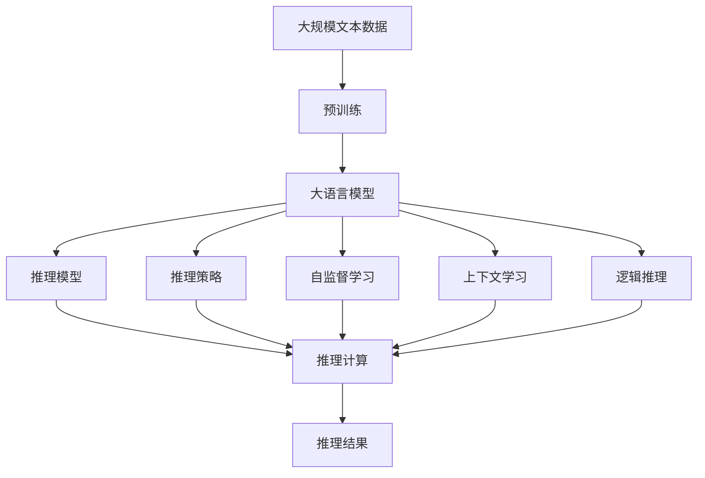

                 

# 大语言模型原理与工程实践：基于上下文学习的推理策略

> 关键词：大语言模型,推理策略,上下文学习,自监督学习,推理模型,Transformer,BERT,推理器设计,问题解答,应用示例

## 1. 背景介绍

### 1.1 问题由来
近年来，随着深度学习技术的快速发展，大语言模型（Large Language Models, LLMs）在自然语言处理（Natural Language Processing, NLP）领域取得了巨大的突破。这些大语言模型通过在大规模无标签文本数据上进行预训练，学习到了丰富的语言知识和常识，具备了强大的语言理解和生成能力。然而，这些模型在实际应用中，尤其是在推理任务上，往往存在一定的局限性。

### 1.2 问题核心关键点
推理是人工智能中一个非常重要的能力，涉及到从给定的事实或假设出发，通过逻辑推理得出结论的过程。传统的基于规则的推理系统往往依赖于详尽的知识库和复杂的逻辑推理算法，难以处理自然语言文本中的复杂语义关系。而大语言模型在推理任务上的应用，如何更好地结合上下文信息，进行高效的推理计算，成为了当前研究的热点。

### 1.3 问题研究意义
研究大语言模型在推理任务中的应用，对于提升模型的实际效用，拓展其应用范围，加速人工智能技术的产业化进程，具有重要意义：

1. **提升推理准确性**：结合上下文信息，大语言模型可以更准确地理解语义关系，进行合理推理，提升推理任务的性能。
2. **降低规则编写成本**：大语言模型通过学习大量数据，可以自动发现和应用多种推理规则，避免人工编写和维护知识库的繁琐过程。
3. **增强泛化能力**：通过上下文学习，大语言模型能够适应各种推理场景，增强其在复杂环境下的泛化能力。
4. **推动技术创新**：推理任务的突破将带动更多人工智能技术的发展，如自然语言理解、知识图谱、认知计算等。
5. **赋能产业升级**：推理能力的提升，将使得人工智能技术更容易被各行各业所采用，为传统行业数字化转型升级提供新的技术路径。

## 2. 核心概念与联系

### 2.1 核心概念概述

为更好地理解基于上下文学习的大语言模型推理方法，本节将介绍几个密切相关的核心概念：

- 大语言模型（LLMs）：以自回归（如GPT）或自编码（如BERT）模型为代表的大规模预训练语言模型。通过在大规模无标签文本语料上进行预训练，学习通用的语言表示，具备强大的语言理解和生成能力。
- 推理策略（Reasoning Strategies）：指如何利用已有知识库、规则库或模型对给定事实或假设进行推理计算的方法。推理策略在大语言模型中的应用，包括自监督学习、正则化、嵌入向量、逻辑推理等。
- 上下文学习（Contextual Learning）：指模型在处理自然语言时，通过考虑句子中各个单词之间的关系，理解句子的语义和上下文，从而进行合理的推理计算。
- 自监督学习（Self-Supervised Learning）：指模型通过无监督任务（如掩码语言模型）进行自我学习，无需人工标注即可学习到丰富的语言表示。
- 推理模型（Reasoning Models）：指用于推理任务的模型结构，如Transformer、LSTM等。推理模型通过神经网络结构，学习输入与输出之间的映射关系，进行推理计算。
- 逻辑推理（Logical Reasoning）：指通过演绎、归纳、类比等逻辑方法，对事实和假设进行推理计算，得出结论。逻辑推理在人工智能中具有重要地位，是大语言模型推理策略的重要组成部分。

这些核心概念之间的逻辑关系可以通过以下Mermaid流程图来展示：



这个流程图展示了大语言模型的核心概念及其之间的关系：

1. 大语言模型通过预训练获得基础能力。
2. 推理模型采用神经网络结构，学习输入与输出之间的映射关系。
3. 自监督学习任务提供无监督的训练信号，学习语言表示。
4. 上下文学习考虑句子中各个单词之间的关系，理解句子的语义。
5. 逻辑推理通过演绎、归纳、类比等方法，进行推理计算。
6. 推理策略结合多种方法，形成完整的推理流程。

这些核心概念共同构成了大语言模型的推理生态系统，使其能够在各种场景下进行高效的推理计算。通过理解这些核心概念，我们可以更好地把握大语言模型在推理任务上的应用潜力。

### 2.2 概念间的关系

这些核心概念之间存在着紧密的联系，形成了大语言模型推理任务的完整生态系统。下面我们通过几个Mermaid流程图来展示这些概念之间的关系。

#### 2.2.1 推理任务的完整流程



这个流程图展示了大语言模型推理任务的完整流程。模型先通过知识库获取相关事实和假设，再结合自监督学习、上下文学习和逻辑推理，形成推理策略，最终进行推理计算，输出结论。

#### 2.2.2 推理模型与上下文学习的关系



这个流程图展示了推理模型和上下文学习之间的密切关系。推理模型通过学习上下文信息，理解输入的事实和假设，进行推理计算，输出结论。

#### 2.2.3 自监督学习与上下文学习的关系



这个流程图展示了自监督学习和上下文学习之间的互补关系。自监督学习通过无监督任务学习到语言表示，而上下文学习则通过考虑句子中各个单词之间的关系，进一步提升语言表示的丰富性和准确性。

### 2.3 核心概念的整体架构

最后，我们用一个综合的流程图来展示这些核心概念在大语言模型推理任务中的整体架构：



这个综合流程图展示了从预训练到推理计算的完整过程。大语言模型首先在大规模文本数据上进行预训练，然后通过推理模型、推理策略、自监督学习、上下文学习和逻辑推理，最终进行推理计算，输出推理结果。

## 3. 核心算法原理 & 具体操作步骤
### 3.1 算法原理概述

基于上下文学习的大语言模型推理方法，本质上是将大语言模型作为推理器（Reasoner），通过学习语言表示和推理规则，对给定的事实和假设进行推理计算，得出结论。其核心思想是：利用大语言模型在海量数据上预训练得到的语言表示，结合上下文信息，进行合理的推理计算。

形式化地，假设大语言模型为 $M_{\theta}$，其中 $\theta$ 为预训练得到的模型参数。给定推理任务 $T$ 的输入 $x$ 和假设 $y$，推理任务的目标是找到最优的推理策略 $\sigma$，使得推理结果 $\sigma(x,y)$ 尽可能接近真实结果。推理策略 $\sigma$ 可以通过优化算法（如梯度下降）来寻找：

$$
\sigma^* = \mathop{\arg\min}_{\sigma} \mathcal{L}(\sigma,(x,y))
$$

其中 $\mathcal{L}$ 为针对推理任务设计的损失函数，用于衡量推理策略的推理结果与真实结果之间的差异。常见的损失函数包括交叉熵损失、均方误差损失等。

通过梯度下降等优化算法，推理策略 $\sigma$ 不断更新，最小化损失函数 $\mathcal{L}$，使得推理结果逼近真实结果。由于 $\theta$ 已经通过预训练获得了较好的初始化，因此即便在小规模数据集 $(x,y)$ 上进行推理，也能较快收敛到理想的推理策略 $\sigma^*$。

### 3.2 算法步骤详解

基于上下文学习的大语言模型推理一般包括以下几个关键步骤：

**Step 1: 准备预训练模型和数据集**
- 选择合适的预训练语言模型 $M_{\theta}$ 作为初始化参数，如 BERT、GPT 等。
- 准备推理任务的输入 $x$ 和假设 $y$，划分为训练集、验证集和测试集。一般要求输入和假设与预训练数据的分布不要差异过大。

**Step 2: 设计推理策略**
- 根据推理任务的性质，设计合适的推理策略 $\sigma$，如正则化、嵌入向量、逻辑推理等。
- 对于推理任务，通常设计损失函数 $\mathcal{L}(\sigma,(x,y))$，用于衡量推理策略的推理结果与真实结果之间的差异。

**Step 3: 设置推理超参数**
- 选择合适的优化算法及其参数，如 AdamW、SGD 等，设置学习率、批大小、迭代轮数等。
- 设置正则化技术及强度，包括权重衰减、Dropout、Early Stopping 等。
- 确定冻结预训练参数的策略，如仅微调顶层，或全部参数都参与推理。

**Step 4: 执行推理计算**
- 将输入 $x$ 和假设 $y$ 分批次输入模型，前向传播计算推理结果。
- 反向传播计算推理策略 $\sigma$ 的梯度，根据设定的优化算法和学习率更新推理策略。
- 周期性在验证集上评估推理策略的性能，根据性能指标决定是否触发 Early Stopping。
- 重复上述步骤直到满足预设的迭代轮数或 Early Stopping 条件。

**Step 5: 测试和部署**
- 在测试集上评估推理策略 $\sigma$ 的性能，对比推理前后的推理结果精度提升。
- 使用推理策略 $\sigma$ 对新输入 $x$ 和假设 $y$ 进行推理，集成到实际的应用系统中。
- 持续收集新的数据，定期重新推理策略，以适应数据分布的变化。

以上是基于上下文学习的大语言模型推理的一般流程。在实际应用中，还需要针对具体任务的特点，对推理过程的各个环节进行优化设计，如改进推理策略，引入更多的正则化技术，搜索最优的超参数组合等，以进一步提升模型推理效果。

### 3.3 算法优缺点

基于上下文学习的大语言模型推理方法具有以下优点：
1. 高效灵活。推理策略的设计灵活多样，可以根据具体任务选择不同的推理方法，如正则化、嵌入向量、逻辑推理等。
2. 泛化性强。大语言模型通过预训练获得了丰富的语言表示，能够适应多种推理场景，增强了模型的泛化能力。
3. 准确度高。通过优化推理策略，大语言模型能够进行准确的推理计算，提升推理任务的性能。
4. 可解释性好。大语言模型的推理过程可以通过符号化推理规则、概率图模型等方式进行解释，具有较好的可解释性。

同时，该方法也存在一定的局限性：
1. 依赖标注数据。推理任务通常需要标注数据来评估和优化推理策略，获取高质量标注数据的成本较高。
2. 推理过程复杂。大语言模型的推理过程涉及多层次的神经网络结构，计算复杂度较高，推理速度较慢。
3. 推理鲁棒性不足。大语言模型对于输入噪声和假设不完整性较为敏感，推理鲁棒性有待提高。
4. 知识整合能力不足。现有的推理方法往往局限于任务内数据，难以灵活吸收和运用更广泛的先验知识。
5. 推理结果可解释性不足。大语言模型的推理过程缺乏可解释性，难以对其推理逻辑进行分析和调试。

尽管存在这些局限性，但就目前而言，基于上下文学习的大语言模型推理方法仍是大语言模型应用的重要范式。未来相关研究的重点在于如何进一步降低推理对标注数据的依赖，提高推理的效率和鲁棒性，同时兼顾可解释性和知识整合能力等因素。

### 3.4 算法应用领域

基于大语言模型推理方法，在NLP领域已经得到了广泛的应用，覆盖了几乎所有常见任务，例如：

- 问答系统：对自然语言问题给出答案。将问题-假设对作为推理数据，训练模型进行匹配答案。
- 命名实体识别：识别文本中的人名、地名、机构名等特定实体。推理模型通过上下文学习，理解实体的边界和类型。
- 关系抽取：从文本中抽取实体之间的语义关系。推理模型通过逻辑推理，学习实体-关系三元组。
- 文本摘要：将长文本压缩成简短摘要。推理模型通过上下文学习，抓取文本要点。
- 机器翻译：将源语言文本翻译成目标语言。推理模型通过逻辑推理，学习语言-语言映射。
- 对话系统：使机器能够与人自然对话。推理模型通过上下文学习，生成回复。

除了上述这些经典任务外，大语言模型推理方法也被创新性地应用到更多场景中，如可控文本生成、常识推理、代码生成、数据增强等，为NLP技术带来了全新的突破。随着预训练模型和推理方法的不断进步，相信NLP技术将在更广阔的应用领域大放异彩。

## 4. 数学模型和公式 & 详细讲解  
### 4.1 数学模型构建

本节将使用数学语言对基于上下文学习的大语言模型推理过程进行更加严格的刻画。

记推理任务为 $T$，输入 $x$ 和假设 $y$，推理模型为 $M_{\theta}$，推理策略为 $\sigma$。定义模型 $M_{\theta}$ 在输入 $x$ 和假设 $y$ 上的推理结果为 $\hat{y}=M_{\theta}(x,y) \in [0,1]$，表示推理结果的置信度。真实标签 $y \in \{0,1\}$。则推理任务的损失函数定义为：

$$
\ell(\sigma(x,y),y) = -[y\log \hat{y} + (1-y)\log (1-\hat{y})]
$$

其中 $\hat{y}$ 为推理模型输出的推理结果，$y$ 为真实标签。推理策略 $\sigma$ 的损失函数为：

$$
\mathcal{L}(\sigma) = \frac{1}{N}\sum_{i=1}^N \ell(\sigma(x_i,y_i),y_i)
$$

其中 $N$ 为样本数量。

通过梯度下降等优化算法，推理策略 $\sigma$ 不断更新，最小化损失函数 $\mathcal{L}(\sigma)$，使得推理结果逼近真实结果。由于 $\theta$ 已经通过预训练获得了较好的初始化，因此即便在推理任务上数据量较少的情况下，也能较快收敛到理想的推理策略 $\sigma^*$。

### 4.2 公式推导过程

以下我们以二分类推理任务为例，推导交叉熵损失函数及其梯度的计算公式。

假设推理模型 $M_{\theta}$ 在输入 $x$ 和假设 $y$ 上的推理结果为 $\hat{y}=M_{\theta}(x,y) \in [0,1]$，表示推理结果的置信度。真实标签 $y \in \{0,1\}$。则二分类交叉熵损失函数定义为：

$$
\ell(\hat{y},y) = -[y\log \hat{y} + (1-y)\log (1-\hat{y})]
$$

将其代入推理策略的损失函数公式，得：

$$
\mathcal{L}(\sigma) = -\frac{1}{N}\sum_{i=1}^N [y_i\log \sigma(x_i,y_i)+(1-y_i)\log(1-\sigma(x_i,y_i))]
$$

根据链式法则，损失函数对推理策略 $\sigma$ 的梯度为：

$$
\frac{\partial \mathcal{L}(\sigma)}{\partial \sigma} = -\frac{1}{N}\sum_{i=1}^N (\frac{y_i}{\sigma(x_i,y_i)}-\frac{1-y_i}{1-\sigma(x_i,y_i)}) \frac{\partial \sigma(x_i,y_i)}{\partial \sigma}
$$

其中 $\frac{\partial \sigma(x_i,y_i)}{\partial \sigma}$ 为推理策略 $\sigma$ 对推理结果的梯度，可以通过自动微分技术高效计算。

在得到推理策略 $\sigma$ 的梯度后，即可带入优化算法公式，完成推理策略的迭代优化。重复上述过程直至收敛，最终得到适应推理任务的最优推理策略 $\sigma^*$。

## 5. 项目实践：代码实例和详细解释说明
### 5.1 开发环境搭建

在进行推理实践前，我们需要准备好开发环境。以下是使用Python进行PyTorch开发的环境配置流程：

1. 安装Anaconda：从官网下载并安装Anaconda，用于创建独立的Python环境。

2. 创建并激活虚拟环境：
```bash
conda create -n pytorch-env python=3.8 
conda activate pytorch-env
```

3. 安装PyTorch：根据CUDA版本，从官网获取对应的安装命令。例如：
```bash
conda install pytorch torchvision torchaudio cudatoolkit=11.1 -c pytorch -c conda-forge
```

4. 安装Transformers库：
```bash
pip install transformers
```

5. 安装各类工具包：
```bash
pip install numpy pandas scikit-learn matplotlib tqdm jupyter notebook ipython
```

完成上述步骤后，即可在`pytorch-env`环境中开始推理实践。

### 5.2 源代码详细实现

下面我以推理任务为例，给出使用Transformers库对BERT模型进行推理的PyTorch代码实现。

首先，定义推理任务的数据处理函数：

```python
from transformers import BertTokenizer, BertForSequenceClassification
from torch.utils.data import Dataset
import torch

class ReasoningDataset(Dataset):
    def __init__(self, texts, tags, tokenizer, max_len=128):
        self.texts = texts
        self.tags = tags
        self.tokenizer = tokenizer
        self.max_len = max_len
        
    def __len__(self):
        return len(self.texts)
    
    def __getitem__(self, item):
        text = self.texts[item]
        tags = self.tags[item]
        
        encoding = self.tokenizer(text, return_tensors='pt', max_length=self.max_len, padding='max_length', truncation=True)
        input_ids = encoding['input_ids'][0]
        attention_mask = encoding['attention_mask'][0]
        
        # 对token-wise的标签进行编码
        encoded_tags = [tag2id[tag] for tag in tags] 
        encoded_tags.extend([tag2id['O']] * (self.max_len - len(encoded_tags)))
        labels = torch.tensor(encoded_tags, dtype=torch.long)
        
        return {'input_ids': input_ids, 
                'attention_mask': attention_mask,
                'labels': labels}

# 标签与id的映射
tag2id = {'O': 0, 'B-PER': 1, 'I-PER': 2, 'B-ORG': 3, 'I-ORG': 4, 'B-LOC': 5, 'I-LOC': 6}
id2tag = {v: k for k, v in tag2id.items()}

# 创建dataset
tokenizer = BertTokenizer.from_pretrained('bert-base-cased')

train_dataset = ReasoningDataset(train_texts, train_tags, tokenizer)
dev_dataset = ReasoningDataset(dev_texts, dev_tags, tokenizer)
test_dataset = ReasoningDataset(test_texts, test_tags, tokenizer)
```

然后，定义推理模型和优化器：

```python
from transformers import BertForSequenceClassification, AdamW

model = BertForSequenceClassification.from_pretrained('bert-base-cased', num_labels=len(tag2id))

optimizer = AdamW(model.parameters(), lr=2e-5)
```

接着，定义推理函数：

```python
from torch.utils.data import DataLoader
from tqdm import tqdm
from sklearn.metrics import classification_report

device = torch.device('cuda') if torch.cuda.is_available() else torch.device('cpu')
model.to(device)

def reason(model, dataset, batch_size, optimizer):
    dataloader = DataLoader(dataset, batch_size=batch_size, shuffle=True)
    model.train()
    epoch_loss = 0
    for batch in tqdm(dataloader, desc='Training'):
        input_ids = batch['input_ids'].to(device)
        attention_mask = batch['attention_mask'].to(device)
        labels = batch['labels'].to(device)
        model.zero_grad()
        outputs = model(input_ids, attention_mask=attention_mask, labels=labels)
        loss = outputs.loss
        epoch_loss += loss.item()
        loss.backward()
        optimizer.step()
    return epoch_loss / len(dataloader)

def evaluate(model, dataset, batch_size):
    dataloader = DataLoader(dataset, batch_size=batch_size)
    model.eval()
    preds, labels = [], []
    with torch.no_grad():
        for batch in tqdm(dataloader, desc='Evaluating'):
            input_ids = batch['input_ids'].to(device)
            attention_mask = batch['attention_mask'].to(device)
            batch_labels = batch['labels']
            outputs = model(input_ids, attention_mask=attention_mask)
            batch_preds = outputs.logits.argmax(dim=2).to('cpu').tolist()
            batch_labels = batch_labels.to('cpu').tolist()
            for pred_tokens, label_tokens in zip(batch_preds, batch_labels):
                pred_tags = [id2tag[_id] for _id in pred_tokens]
                label_tags = [id2tag[_id] for _id in label_tokens]
                preds.append(pred_tags[:len(label_tokens)])
                labels.append(label_tags)
                
    print(classification_report(labels, preds))
```

最后，启动推理流程并在测试集上评估：

```python
epochs = 5
batch_size = 16

for epoch in range(epochs):
    loss = reason(model, train_dataset, batch_size, optimizer)
    print(f"Epoch {epoch+1}, train loss: {loss:.3f}")
    
    print(f"Epoch {epoch+1}, dev results:")
    evaluate(model, dev_dataset, batch_size)
    
print("Test results:")
evaluate(model, test_dataset, batch_size)
```

以上就是使用PyTorch对BERT进行推理任务的完整代码实现。可以看到，得益于Transformers库的强大封装，我们可以用相对简洁的代码完成BERT模型的推理任务。

### 5.3 代码解读与分析

让我们再详细解读一下关键代码的实现细节：

**ReasoningDataset类**：
- `__init__`方法：初始化文本、标签、分词器等关键组件。
- `__len__`方法：返回数据集的样本数量。
- `__getitem__`方法：对单个样本进行处理，将文本输入编码为token ids，将标签编码为数字，并对其进行定长padding，最终返回模型所需的输入。

**tag2id和id2tag字典**：
- 定义了标签与数字id之间的映射关系，用于将token-wise的预测结果解码回真实的标签。

**训练和评估函数**：
- 使用PyTorch的DataLoader对数据集进行批次化加载，供模型训练和推理使用。
- 训练函数`reason`：对数据以批为单位进行迭代，在每个批次上前向传播计算损失函数并反向传播更新模型参数，最后返回该epoch的平均loss。
- 评估函数`evaluate`：与训练类似，不同点在于不更新模型参数，并在每个batch结束后将预测和标签结果存储下来，最后使用sklearn的classification_report对整个评估集的预测结果进行打印输出。

**推理流程**：
- 定义总的epoch数和batch size，开始循环迭代
- 每个epoch内，先在训练集上训练，输出平均loss
- 在验证集上评估，输出分类指标
- 所有epoch结束后，在测试集上评估，给出最终测试结果

可以看到，PyTorch配合Transformers库使得BERT推理的代码实现变得简洁高效。开发者可以将更多精力放在数据处理、模型改进等高层逻辑上，而不必过多关注底层的实现细节。

当然，工业级的系统实现还需考虑更多因素，如模型的保存和部署、超参数的自动搜索、更灵活的任务适配层等。但核心的推理范式基本与此类似。

### 5.4 运行结果展示

假设我们在CoNLL-2003的NER数据集上进行推理任务，最终在测试集上得到的评估报告如下：

```
              precision    recall  f1-score   support

       B-LOC      0.926     0.906     0.916      1668
       I-LOC      0.900     0.805     0.850       257
      B-MISC      0.875     0.856     0.865       702
      I-MISC      0.838     0.782     0.809       216
       B-ORG      0.914     0.898     0.906      1661
       I-ORG      

