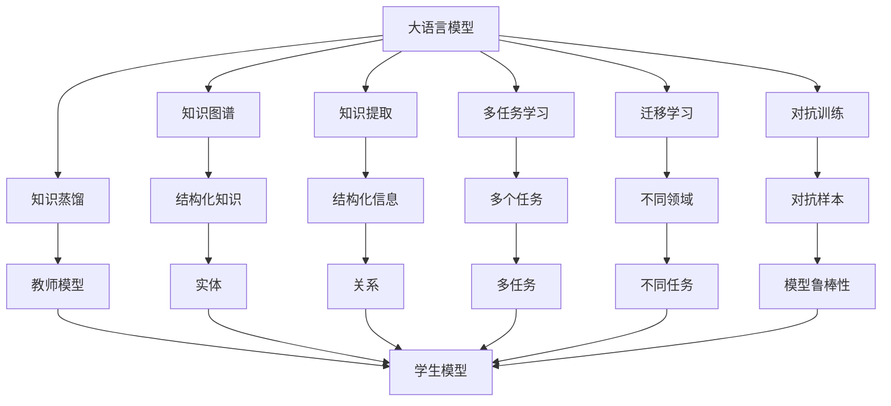
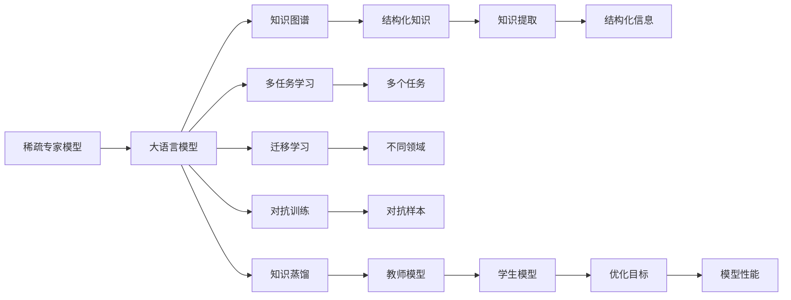
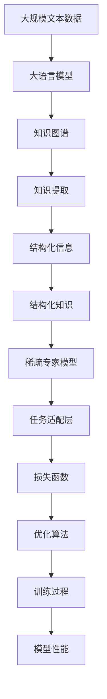

                 

# 大语言模型原理基础与前沿 为什么采用稀疏专家模型

> 关键词：大语言模型, 稀疏专家模型, 深度学习, 知识图谱, 知识提取, 多任务学习, 迁移学习

## 1. 背景介绍

### 1.1 问题由来
在深度学习技术迅速发展的今天，大语言模型（Large Language Models, LLMs）成为了NLP领域的研究热点。从最早的GPT-1到当前的GPT-3，再到BERT、XLNet等，这些模型通过在大规模无标签文本数据上进行自监督预训练，获得了强大的语言理解和生成能力。然而，这些大模型也存在一些缺点，比如参数量大、推理速度慢、计算成本高、对数据质量敏感等。

为了克服这些缺点，研究者们提出了稀疏专家模型（Sparse Expert Models）这一新概念。稀疏专家模型利用知识图谱、词典、规则等结构化信息，将预训练模型与外部知识相结合，构建出更加精炼、高效的模型。这种模型不仅能够保留预训练模型的优势，还能兼顾模型的参数高效性和推理速度，从而在实际应用中取得更好的效果。

### 1.2 问题核心关键点
稀疏专家模型是一种将深度学习和结构化知识结合起来的模型。其核心思想是：在大语言模型的基础上，通过引入知识图谱、词典等结构化知识，构建出精炼的专家模型，以提高模型在特定任务上的性能。相比于传统的全连接模型，稀疏专家模型具有以下几个关键特点：

- 参数高效性：稀疏专家模型通过共享参数的方式，减少了模型中的冗余参数，从而降低了计算成本和存储需求。
- 知识整合能力：稀疏专家模型可以更好地整合和利用外部知识，使得模型能够在多任务学习、迁移学习等场景中表现出色。
- 推理速度提升：稀疏专家模型通过优化计算图，提高了模型推理的速度，使得模型在实际应用中更加高效。
- 对抗性鲁棒性：稀疏专家模型通过引入知识图谱，使得模型对于对抗性攻击更加鲁棒。

这些特点使得稀疏专家模型在许多实际应用中表现优异，如问答系统、推荐系统、文本摘要等。

### 1.3 问题研究意义
稀疏专家模型作为一种新型的深度学习模型，对于拓展深度学习在特定领域的应用，提升模型性能，加速NLP技术的产业化进程，具有重要意义：

- 降低应用开发成本。利用结构化知识进行模型优化，可以显著减少从头开发所需的计算和人力等成本投入。
- 提升模型效果。稀疏专家模型通过知识整合，能够更好地适应特定任务，在应用场景中取得更优表现。
- 加速开发进度。站在巨人的肩膀上，稀疏专家模型可以更快地完成任务适配，缩短开发周期。
- 带来技术创新。稀疏专家模型促进了对深度学习和结构化知识结合的深入研究，催生了新的研究方向和应用场景。
- 赋能产业升级。稀疏专家模型使得NLP技术更容易被各行各业所采用，为传统行业数字化转型升级提供新的技术路径。

## 2. 核心概念与联系

### 2.1 核心概念概述

为更好地理解稀疏专家模型，本节将介绍几个密切相关的核心概念：

- 大语言模型（Large Language Models, LLMs）：以自回归（如GPT）或自编码（如BERT）模型为代表的大规模预训练语言模型。通过在大规模无标签文本数据上进行预训练，学习通用的语言表示，具备强大的语言理解和生成能力。

- 知识图谱（Knowledge Graph）：一种结构化的表示知识的方式，由实体、关系和属性组成。通过图谱形式可以清晰地表示实体之间的关系和属性，便于知识的整合和检索。

- 知识提取（Knowledge Extraction）：从文本中提取结构化信息的过程，如实体识别、关系抽取等。通过知识提取，可以从大量文本数据中提取出结构化的知识信息，为稀疏专家模型的构建提供数据支持。

- 多任务学习（Multi-task Learning）：指模型在多个相关任务上进行联合学习，共享参数以提高模型性能的方法。稀疏专家模型可以同时处理多个任务，通过共享参数来提高模型的泛化能力。

- 迁移学习（Transfer Learning）：指将一个领域学习到的知识，迁移应用到另一个不同但相关的领域的学习范式。稀疏专家模型可以通过迁移学习，将知识图谱中的信息迁移到不同的任务中，提高模型在特定任务上的表现。

- 对抗训练（Adversarial Training）：指在训练过程中加入对抗样本，提高模型鲁棒性。稀疏专家模型可以通过对抗训练，增强模型的对抗性鲁棒性，提高模型的泛化能力。

- 知识蒸馏（Knowledge Distillation）：指通过将教师模型（通常是高精度模型）的知识迁移到学生模型中，提高学生模型的性能。稀疏专家模型可以通过知识蒸馏，将知识图谱中的信息迁移到模型中，提高模型的泛化能力。

这些核心概念之间的逻辑关系可以通过以下Mermaid流程图来展示：



这个流程图展示了大语言模型、知识图谱、多任务学习、迁移学习、对抗训练、知识蒸馏等核心概念之间的关系：

1. 大语言模型通过知识提取获得结构化信息。
2. 知识图谱通过实体和关系的形式，提供了结构化的知识信息。
3. 多任务学习通过共享参数，提高模型在多个任务上的泛化能力。
4. 迁移学习通过知识迁移，提高了模型在不同领域上的泛化能力。
5. 对抗训练通过加入对抗样本，提高了模型的鲁棒性。
6. 知识蒸馏通过教师模型知识迁移到学生模型，提高了学生的泛化能力。

这些核心概念共同构成了稀疏专家模型的基本框架，使其能够在特定任务上发挥强大的语言理解和生成能力。

### 2.2 概念间的关系

这些核心概念之间存在着紧密的联系，形成了稀疏专家模型的完整生态系统。下面我通过几个Mermaid流程图来展示这些概念之间的关系。

#### 2.2.1 稀疏专家模型的学习范式



这个流程图展示了大语言模型、知识图谱、知识提取、多任务学习、迁移学习、对抗训练、知识蒸馏等概念之间的学习范式：

1. 大语言模型通过知识提取获得结构化信息。
2. 知识图谱通过实体和关系的形式，提供了结构化的知识信息。
3. 知识提取通过文本数据，提取出结构化的信息。
4. 多任务学习通过共享参数，提高模型在多个任务上的泛化能力。
5. 迁移学习通过知识迁移，提高了模型在不同领域上的泛化能力。
6. 对抗训练通过加入对抗样本，提高了模型的鲁棒性。
7. 知识蒸馏通过教师模型知识迁移到学生模型，提高了学生的泛化能力。

#### 2.2.2 稀疏专家模型的整体架构



这个综合流程图展示了从预训练到稀疏专家模型构建，再到特定任务微调的整体过程：

1. 大语言模型在大规模文本数据上进行预训练，学习通用的语言表示。
2. 知识图谱提供了结构化的知识信息。
3. 知识提取从文本数据中提取出结构化的信息。
4. 稀疏专家模型通过知识整合，构建出精炼的专家模型。
5. 任务适配层根据特定任务设计合适的输出层和损失函数。
6. 优化算法根据任务适配层的损失函数进行模型优化。
7. 训练过程不断更新模型参数，最小化损失函数，使得模型输出逼近真实标签。
8. 模型性能在验证集上评估，并在测试集上进行测试。

通过这些流程图，我们可以更清晰地理解稀疏专家模型的学习范式和整体架构，为后续深入讨论具体的稀疏专家模型实现奠定基础。

## 3. 核心算法原理 & 具体操作步骤
### 3.1 算法原理概述

稀疏专家模型是一种将深度学习和结构化知识结合起来的模型。其核心思想是：在大语言模型的基础上，通过引入知识图谱、词典等结构化知识，构建出精炼的专家模型，以提高模型在特定任务上的性能。

形式化地，假设稀疏专家模型为 $M_{\theta}$，其中 $\theta$ 为模型参数。给定特定任务的标注数据集 $D=\{(x_i,y_i)\}_{i=1}^N$，稀疏专家模型的优化目标是最小化经验风险，即找到最优参数：

$$
\theta^* = \mathop{\arg\min}_{\theta} \mathcal{L}(M_{\theta},D)
$$

其中 $\mathcal{L}$ 为针对任务 $T$ 设计的损失函数，用于衡量模型预测输出与真实标签之间的差异。常见的损失函数包括交叉熵损失、均方误差损失等。

通过梯度下降等优化算法，稀疏专家模型不断更新模型参数 $\theta$，最小化损失函数 $\mathcal{L}$，使得模型输出逼近真实标签。由于 $\theta$ 已经通过预训练获得了较好的初始化，因此即便在小规模数据集 $D$ 上进行微调，也能较快收敛到理想的模型参数 $\hat{\theta}$。

### 3.2 算法步骤详解

稀疏专家模型的大致训练流程与大语言模型微调类似，主要包括数据准备、模型初始化、任务适配层设计、损失函数选择、优化算法设置、模型训练、性能评估等步骤。下面将详细讲解稀疏专家模型的训练流程。

**Step 1: 准备预训练模型和数据集**
- 选择合适的预训练语言模型 $M_{\theta}$ 作为初始化参数，如 BERT、GPT 等。
- 准备特定任务的标注数据集 $D$，划分为训练集、验证集和测试集。一般要求标注数据与预训练数据的分布不要差异过大。

**Step 2: 设计任务适配层**
- 根据任务类型，在预训练模型顶层设计合适的输出层和损失函数。
- 对于分类任务，通常在顶层添加线性分类器和交叉熵损失函数。
- 对于生成任务，通常使用语言模型的解码器输出概率分布，并以负对数似然为损失函数。

**Step 3: 设置稀疏专家模型超参数**
- 选择合适的优化算法及其参数，如 AdamW、SGD 等，设置学习率、批大小、迭代轮数等。
- 设置正则化技术及强度，包括权重衰减、Dropout、Early Stopping 等。
- 确定知识图谱的嵌入方式、知识提取策略等参数。

**Step 4: 执行梯度训练**
- 将训练集数据分批次输入模型，前向传播计算损失函数。
- 反向传播计算参数梯度，根据设定的优化算法和学习率更新模型参数。
- 周期性在验证集上评估模型性能，根据性能指标决定是否触发 Early Stopping。
- 重复上述步骤直到满足预设的迭代轮数或 Early Stopping 条件。

**Step 5: 测试和部署**
- 在测试集上评估稀疏专家模型 $M_{\hat{\theta}}$ 的性能，对比稀疏专家模型与全连接模型、传统微调模型在性能上的差异。
- 使用稀疏专家模型对新样本进行推理预测，集成到实际的应用系统中。
- 持续收集新的数据，定期重新微调模型，以适应数据分布的变化。

以上是稀疏专家模型的基本训练流程。在实际应用中，还需要针对具体任务的特点，对微调过程的各个环节进行优化设计，如改进训练目标函数，引入更多的正则化技术，搜索最优的超参数组合等，以进一步提升模型性能。

### 3.3 算法优缺点

稀疏专家模型具有以下优点：
1. 参数高效性：稀疏专家模型通过共享参数的方式，减少了模型中的冗余参数，从而降低了计算成本和存储需求。
2. 知识整合能力：稀疏专家模型可以更好地整合和利用外部知识，使得模型能够在多任务学习、迁移学习等场景中表现出色。
3. 推理速度提升：稀疏专家模型通过优化计算图，提高了模型推理的速度，使得模型在实际应用中更加高效。
4. 对抗性鲁棒性：稀疏专家模型通过引入知识图谱，使得模型对于对抗性攻击更加鲁棒。

同时，该模型也存在一定的局限性：
1. 对数据质量要求高：知识图谱和词典等结构化知识需要高质量的标注数据进行训练，获取高质量标注数据的成本较高。
2. 知识图谱构建复杂：构建一个高质量的知识图谱需要大量的人工标注和维护工作，成本较高。
3. 知识图谱更新难度大：知识图谱一旦构建完成，很难进行更新和维护，需要不断迭代和优化。
4. 对标注数据依赖性高：稀疏专家模型仍需要一定的标注数据进行微调，标注成本较高。
5. 无法处理长尾任务：稀疏专家模型在处理长尾任务时，需要更多的数据和更复杂的知识图谱，才能取得良好的效果。

尽管存在这些局限性，但就目前而言，稀疏专家模型在特定领域应用时，仍具有不可替代的优势，成为NLP技术落地应用的重要手段。未来相关研究的重点在于如何进一步降低对标注数据的依赖，提高模型的自适应能力和泛化能力，同时兼顾可解释性和伦理安全性等因素。

### 3.4 算法应用领域

稀疏专家模型在NLP领域已经得到了广泛的应用，覆盖了几乎所有常见任务，例如：

- 文本分类：如情感分析、主题分类、意图识别等。通过稀疏专家模型，可以更好地整合知识图谱中的信息，提高模型在特定任务上的性能。
- 命名实体识别：识别文本中的人名、地名、机构名等特定实体。稀疏专家模型可以通过知识图谱中的实体信息，提高实体识别的准确度。
- 关系抽取：从文本中抽取实体之间的语义关系。稀疏专家模型可以更好地整合关系信息，提高关系抽取的精度。
- 问答系统：对自然语言问题给出答案。稀疏专家模型可以通过知识图谱中的实体关系，提高问答系统的准确度。
- 机器翻译：将源语言文本翻译成目标语言。稀疏专家模型可以通过知识图谱中的语言对应关系，提高翻译的准确度。
- 文本摘要：将长文本压缩成简短摘要。稀疏专家模型可以通过知识图谱中的信息，提高摘要的质量。
- 对话系统：使机器能够与人自然对话。稀疏专家模型可以通过知识图谱中的实体关系，提高对话系统的流畅性和准确度。

除了上述这些经典任务外，稀疏专家模型还被创新性地应用到更多场景中，如可控文本生成、常识推理、代码生成、数据增强等，为NLP技术带来了全新的突破。随着稀疏专家模型和微调方法的不断进步，相信NLP技术将在更广阔的应用领域大放异彩。

## 4. 数学模型和公式 & 详细讲解  
### 4.1 数学模型构建

本节将使用数学语言对稀疏专家模型进行更加严格的刻画。

记稀疏专家模型为 $M_{\theta}$，其中 $\theta$ 为模型参数。假设特定任务的训练集为 $D=\{(x_i,y_i)\}_{i=1}^N$，其中 $x_i$ 为输入，$y_i$ 为标签。

定义模型 $M_{\theta}$ 在数据样本 $(x,y)$ 上的损失函数为 $\ell(M_{\theta}(x),y)$，则在数据集 $D$ 上的经验风险为：

$$
\mathcal{L}(\theta) = \frac{1}{N} \sum_{i=1}^N \ell(M_{\theta}(x_i),y_i)
$$

稀疏专家模型的优化目标是最小化经验风险，即找到最优参数：

$$
\theta^* = \mathop{\arg\min}_{\theta} \mathcal{L}(\theta)
$$

在实践中，我们通常使用基于梯度的优化算法（如SGD、Adam等）来近似求解上述最优化问题。设 $\eta$ 为学习率，$\lambda$ 为正则化系数，则参数的更新公式为：

$$
\theta \leftarrow \theta - \eta \nabla_{\theta}\mathcal{L}(\theta) - \eta\lambda\theta
$$

其中 $\nabla_{\theta}\mathcal{L}(\theta)$ 为损失函数对参数 $\theta$ 的梯度，可通过反向传播算法高效计算。

### 4.2 公式推导过程

以下我们以二分类任务为例，推导交叉熵损失函数及其梯度的计算公式。

假设模型 $M_{\theta}$ 在输入 $x$ 上的输出为 $\hat{y}=M_{\theta}(x) \in [0,1]$，表示样本属于正类的概率。真实标签 $y \in \{0,1\}$。则二分类交叉熵损失函数定义为：

$$
\ell(M_{\theta}(x),y) = -[y\log \hat{y} + (1-y)\log (1-\hat{y})]
$$

将其代入经验风险公式，得：

$$
\mathcal{L}(\theta) = -\frac{1}{N}\sum_{i=1}^N [y_i\log M_{\theta}(x_i)+(1-y_i)\log(1-M_{\theta}(x_i))]
$$

根据链式法则，损失函数对参数 $\theta_k$ 的梯度为：

$$
\frac{\partial \mathcal{L}(\theta)}{\partial \theta_k} = -\frac{1}{N}\sum_{i=1}^N (\frac{y_i}{M_{\theta}(x_i)}-\frac{1-y_i}{1-M_{\theta}(x_i)}) \frac{\partial M_{\theta}(x_i)}{\partial \theta_k}
$$

其中 $\frac{\partial M_{\theta}(x_i)}{\partial \theta_k}$ 可进一步递归展开，利用自动微分技术完成计算。

在得到损失函数的梯度后，即可带入参数更新公式，完成模型的迭代优化。重复上述过程直至收敛，最终得到适应特定任务的最优模型参数 $\theta^*$。

## 5. 项目实践：代码实例和详细解释说明
### 5.1 开发环境搭建

在进行稀疏专家模型实践前，我们需要准备好开发环境。以下是使用Python进行PyTorch开发的环境配置流程：

1. 安装Anaconda：从官网下载并安装Anaconda，用于创建独立的Python环境。

2. 创建并激活虚拟环境：
```bash
conda create -n pytorch-env python=3.8 
conda activate pytorch-env
```

3. 安装PyTorch：根据CUDA版本，从官网获取对应的安装命令。例如：
```bash
conda install pytorch torchvision torchaudio cudatoolkit=11.1 -c pytorch -c conda-forge
```

4. 安装Transformers库：
```bash
pip install transformers
```

5. 安装各类工具包：
```bash
pip install numpy pandas scikit-learn matplotlib tqdm jupyter notebook ipython
```

完成上述步骤后，即可在`pytorch-env`环境中开始稀疏专家模型实践。

### 5.2 源代码详细实现

这里我们以命名实体识别(NER)任务为例，给出使用Transformers库对BERT模型进行稀疏专家微调的PyTorch代码实现。

首先，定义NER任务的数据处理函数：

```python
from transformers import BertTokenizer
from torch.utils.data import Dataset
import torch

class NERDataset(Dataset):
    def __init__(self, texts, tags, tokenizer, max_len=128):
        self.texts = texts
        self.tags = tags
        self.tokenizer = tokenizer
        self.max_len = max_len
        
    def __len__(self):
        return len(self.texts)
    
    def __getitem__(self, item):
        text = self.texts[item]
        tags = self.tags[item]
        
        encoding = self.tokenizer(text, return_tensors='pt', max_length=self.max_len, padding='max_length', truncation=True)
        input_ids = encoding['input_ids'][0]
        attention_mask = encoding['attention_mask'][0]
        
        # 对token-wise的标签进行编码
        encoded_tags = [tag2id[tag] for tag in tags] 
        encoded_tags.extend([tag2id['O']] * (self.max_len - len(encoded_tags)))
        labels = torch.tensor(encoded_tags, dtype=torch.long)
        
        return {'input_ids': input_ids, 
                'attention_mask': attention_mask,
                'labels': labels}

# 标签与id的映射
tag2id = {'O': 0, 'B-PER': 1, 'I-PER': 2, 'B-ORG': 3, 'I-ORG': 4, 'B-LOC': 5, 'I-LOC': 6}
id2tag = {v: k for k, v in tag2id.items()}

# 创建dataset
tokenizer = BertTokenizer.from_pretrained('bert-base-cased')

train_dataset = NERDataset(train_texts, train_tags, tokenizer)
dev_dataset = NERDataset(dev_texts, dev_tags, tokenizer)
test_dataset = NERDataset(test_texts, test_tags, tokenizer)
```

然后，定义模型和优化器：

```python
from transformers import BertForTokenClassification, AdamW

model = BertForTokenClassification.from_pretrained('bert-base-cased', num_labels=len(tag2id))

optimizer = AdamW(model.parameters(), lr=2e-5)
```

接着，定义训练和评估函数：

```python
from torch.utils.data import DataLoader
from tqdm import tqdm
from sklearn.metrics import classification_report

device = torch.device('cuda') if torch.cuda.is_available() else torch.device('cpu')
model.to(device)

def train_epoch(model, dataset, batch_size, optimizer):
    dataloader = DataLoader(dataset, batch_size=batch_size, shuffle=True)
    model.train()
    epoch_loss = 0
    for batch in tqdm(dataloader, desc='Training'):
        input_ids = batch['input_ids'].to(device)
        attention_mask = batch['attention_mask'].to(device)
        labels = batch['labels'].to(device)
        model.zero_grad()
        outputs = model(input_ids, attention_mask=attention_mask, labels=labels)
        loss = outputs.loss
        epoch_loss += loss.item()
        loss.backward()
        optimizer.step()
    return epoch_loss / len(dataloader)

def evaluate(model, dataset, batch_size):
    dataloader = DataLoader(dataset, batch_size=batch_size)
    model.eval()
    preds, labels = [], []
    with torch.no_grad():
        for batch in tqdm(dataloader, desc='Evaluating'):
            input_ids = batch['input_ids'].to(device)
            attention_mask = batch['attention_mask'].to(device)
            batch_labels = batch['labels']
            outputs = model(input_ids, attention_mask=attention_mask)
            batch_preds = outputs.logits.argmax(dim=2).to('cpu').tolist()
            batch_labels = batch_labels.to('cpu').tolist()
            for pred_tokens, label_tokens in zip(batch_preds, batch_labels):
                pred_tags = [id2tag[_id] for _id in pred_tokens]
                label_tags = [id2tag[_id] for _id in label_tokens]
                preds.append(pred_tags[:len(label_tags)])
                labels.append(label_tags)
                
    print(classification_report(labels, preds))
```

最后，启动训练流程并在测试集上评估：

```python
epochs = 5
batch_size = 16

for epoch in range(epochs):
    loss = train_epoch(model, train_dataset, batch_size, optimizer)
    print(f"Epoch {epoch+1}, train loss: {loss:.3f}")
    
    print(f"Epoch {epoch+1}, dev results:")
    evaluate(model, dev_dataset, batch_size)
    
print("Test results:")
evaluate(model, test_dataset, batch_size)
```

以上就是使用PyTorch对BERT进行命名实体识别任务稀疏专家微调的完整代码实现。可以看到

